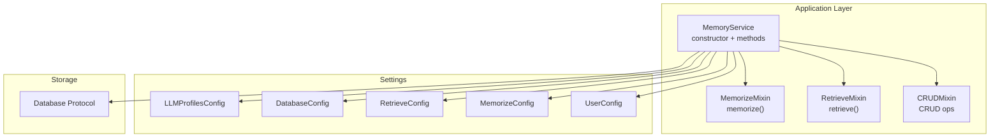
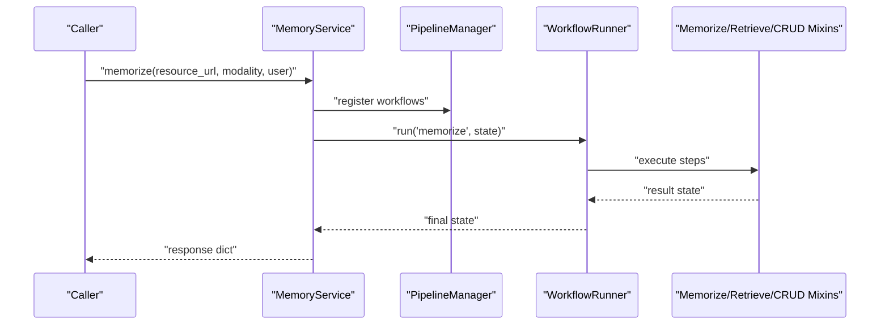
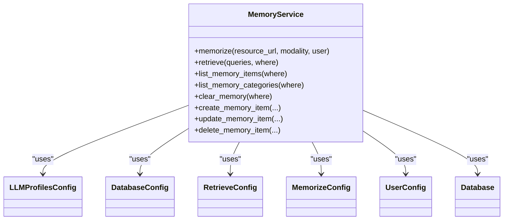

# API Reference

<cite>
**Referenced Files in This Document**
- [service.py](file://src/memu/app/service.py)
- [settings.py](file://src/memu/app/settings.py)
- [memorize.py](file://src/memu/app/memorize.py)
- [retrieve.py](file://src/memu/app/retrieve.py)
- [crud.py](file://src/memu/app/crud.py)
- [interfaces.py](file://src/memu/database/interfaces.py)
- [__init__.py](file://src/memu/__init__.py)
- [README.md](file://README.md)
- [getting_started_robust.py](file://examples/getting_started_robust.py)
- [example_1_conversation_memory.py](file://examples/example_1_conversation_memory.py)
- [CHANGELOG.md](file://CHANGELOG.md)
</cite>

## Table of Contents
1. [Introduction](#introduction)
2. [Project Structure](#project-structure)
3. [Core Components](#core-components)
4. [Architecture Overview](#architecture-overview)
5. [Detailed Component Analysis](#detailed-component-analysis)
6. [Dependency Analysis](#dependency-analysis)
7. [Performance Considerations](#performance-considerations)
8. [Troubleshooting Guide](#troubleshooting-guide)
9. [Conclusion](#conclusion)
10. [Appendices](#appendices)

## Introduction
This document provides a comprehensive API reference for the memU MemoryService, focusing on the core public interfaces exposed by the MemoryService class. It covers constructor configuration, the memorize() and retrieve() methods, CRUD operations for manual memory management, filtering and scoping, authentication, rate limiting considerations, performance optimization, and versioning/backwards compatibility guidance.

## Project Structure
The MemoryService API is implemented in the application layer and integrates with pluggable LLM providers, vector stores, and databases. The key modules include:
- MemoryService class and mixins for memorize, retrieve, and CRUD operations
- Settings models for configuration (LLM profiles, database, retrieval, memorize)
- Database interface protocol for storage backends
- Public alias for convenience

**Diagram sources**
- [service.py](file://src/memu/app/service.py#L49-L95)
- [settings.py](file://src/memu/app/settings.py#L263-L322)
- [interfaces.py](file://src/memu/database/interfaces.py#L12-L26)

**Section sources**
- [service.py](file://src/memu/app/service.py#L49-L95)
- [settings.py](file://src/memu/app/settings.py#L263-L322)
- [interfaces.py](file://src/memu/database/interfaces.py#L12-L26)

## Core Components
- MemoryService: Orchestrates memory ingestion, retrieval, and persistence via workflows. Exposes constructor with configuration options and public methods for memorize(), retrieve(), and CRUD operations.
- Settings models: Define configuration for LLM providers, database backends, retrieval behavior, and user scoping.
- Database Protocol: Abstraction for storage backends (in-memory, SQLite, PostgreSQL with pgvector).

Key responsibilities:
- Constructor validates and normalizes configuration, initializes clients and pipelines.
- Methods encapsulate end-to-end workflows for memory operations.
- Filtering and scoping are enforced via user model fields.

**Section sources**
- [service.py](file://src/memu/app/service.py#L49-L95)
- [settings.py](file://src/memu/app/settings.py#L263-L322)
- [interfaces.py](file://src/memu/database/interfaces.py#L12-L26)

## Architecture Overview
MemoryService composes three mixins implementing the major operations and integrates with configurable LLM providers and storage backends. Workflows are registered and executed through a pipeline manager.

**Diagram sources**
- [service.py](file://src/memu/app/service.py#L315-L360)
- [memorize.py](file://src/memu/app/memorize.py#L65-L95)

**Section sources**
- [service.py](file://src/memu/app/service.py#L315-L360)
- [memorize.py](file://src/memu/app/memorize.py#L65-L95)

## Detailed Component Analysis

### MemoryService Constructor and Configuration
Constructor parameters:
- llm_profiles: LLMProfilesConfig or dict[str, Any] | None
- blob_config: BlobConfig or dict[str, Any] | None
- database_config: DatabaseConfig or dict[str, Any] | None
- memorize_config: MemorizeConfig or dict[str, Any] | None
- retrieve_config: RetrieveConfig or dict[str, Any] | None
- workflow_runner: WorkflowRunner | str | None
- user_config: UserConfig or dict[str, Any] | None

Behavior:
- Validates and normalizes each configuration using a shared validator.
- Initializes filesystem, category configs, and database via a factory.
- Sets up LLM client registry and pipeline manager.
- Registers memorize, retrieve (RAG and LLM), and CRUD pipelines.

Configuration models:
- LLMProfilesConfig: Manages named LLM profiles with defaults and embedding profile.
- DatabaseConfig: Selects metadata store and vector index provider.
- RetrieveConfig: Controls retrieval strategy (RAG vs LLM), top-k, sufficiency checks, and ranking.
- MemorizeConfig: Controls memory types, prompts, category assignments, and reinforcement.
- UserConfig: Defines the Pydantic user model used for scoping and filtering.

Notes:
- The "default" and "embedding" profiles are ensured to exist in LLMProfilesConfig.
- DatabaseConfig auto-selects vector index provider based on metadata store.

**Section sources**
- [service.py](file://src/memu/app/service.py#L50-L95)
- [settings.py](file://src/memu/app/settings.py#L263-L322)

### memorize() Method
Purpose:
- Ingests a resource, preprocesses/modalities, extracts structured memories, persists items and categories, and returns a response.

HTTP method:
- Not applicable; this is a synchronous Python method invoked via await.

Parameters:
- resource_url: str
- modality: str (e.g., conversation, document, image, video, audio)
- user: dict[str, Any] | None (optional user scope)

Processing flow:
- Validates/ensures categories ready.
- Builds workflow state with resource, modality, memory types, and user scope.
- Executes the "memorize" pipeline and returns the assembled response.

Response schema:
- Single resource or multiple resources
- Items extracted from the resource
- Categories updated/returned
- Relations linking items to categories

Error handling:
- Raises RuntimeError if the workflow fails to produce a response.

Practical examples:
- See examples demonstrating conversation processing and manual memory injection.

**Section sources**
- [memorize.py](file://src/memu/app/memorize.py#L65-L95)
- [example_1_conversation_memory.py](file://examples/example_1_conversation_memory.py#L97-L100)
- [getting_started_robust.py](file://examples/getting_started_robust.py#L76-L81)

### retrieve() Method
Purpose:
- Retrieves relevant context using either RAG (vector similarity) or LLM-driven ranking.

HTTP method:
- Not applicable; this is a synchronous Python method invoked via await.

Parameters:
- queries: list[dict[str, Any]]
  - Last element is treated as the active query; earlier elements are context history.
- where: dict[str, Any] | None (optional user/session scoping)

Method selection:
- retrieve_config.method determines pipeline:
  - "rag": embedding-based vector search
  - "llm": LLM ranks categories/items/resources

Filtering options (where):
- Cleaned against the configured user model fields.
- Unknown fields raise ValueError.
- Supports "__in" suffix for membership checks.

Response structure:
- needs_retrieval: bool
- original_query: str
- rewritten_query: str | None
- next_step_query: str | None
- categories: list
- items: list
- resources: list

Error handling:
- Empty queries raise ValueError.
- Missing response from workflow raises RuntimeError.

Practical examples:
- Natural language queries with optional context history.
- Filtering by user_id or agent_id/session_id via where.

**Section sources**
- [retrieve.py](file://src/memu/app/retrieve.py#L42-L85)
- [retrieve.py](file://src/memu/app/retrieve.py#L87-L104)

### CRUD Operations for Manual Memory Management
Methods:
- list_memory_items(where: dict[str, Any] | None = None) -> dict[str, Any]
- list_memory_categories(where: dict[str, Any] | None = None) -> dict[str, Any]
- clear_memory(where: dict[str, Any] | None = None) -> dict[str, Any]
- create_memory_item(memory_type, memory_content, memory_categories, user: dict[str, Any] | None = None) -> dict[str, Any]
- update_memory_item(memory_id, memory_type: MemoryType | None = None, memory_content: str | None = None, memory_categories: list[str] | None = None, user: dict[str, Any] | None = None) -> dict[str, Any]
- delete_memory_item(memory_id, user: dict[str, Any] | None = None) -> dict[str, Any]

Filtering:
- where is validated against user model fields; unknown fields cause ValueError.

Responses:
- CRUD methods return a response dict containing the affected records and related updates.

Error handling:
- Validation errors for invalid memory types or missing records.
- Runtime error if workflow fails to produce a response.

**Section sources**
- [crud.py](file://src/memu/app/crud.py#L38-L98)
- [crud.py](file://src/memu/app/crud.py#L279-L380)
- [crud.py](file://src/memu/app/crud.py#L195-L212)

### Authentication and Rate Limiting
Authentication:
- LLM providers are configured via llm_profiles. The default provider uses OPENAI_API_KEY unless overridden.
- For OpenRouter, set provider to "openrouter" and supply the OpenRouter API key.

Rate limiting considerations:
- Embedding calls are batched according to embed_batch_size.
- LLM calls are subject to provider limits; consider using the "rag" method for proactive context assembly to minimize LLM calls.

**Section sources**
- [settings.py](file://src/memu/app/settings.py#L102-L127)
- [README.md](file://README.md#L259-L273)

### Practical Examples and Integration Patterns
- Conversation memory processing: Demonstrates initializing MemoryService with llm_profiles and calling memorize() on conversation files.
- Robust getting started: Shows initialization, manual memory injection via create_memory_item(), and retrieval via retrieve().
- Cloud API equivalents: The README documents cloud endpoints and headers for comparison.

**Section sources**
- [example_1_conversation_memory.py](file://examples/example_1_conversation_memory.py#L70-L79)
- [getting_started_robust.py](file://examples/getting_started_robust.py#L50-L65)
- [README.md](file://README.md#L259-L273)

## Dependency Analysis
MemoryService depends on:
- Settings models for configuration
- Database protocol for storage
- LLM client backends (SDK, HTTP, LazyLLM)
- Pipeline manager and workflow runner

**Diagram sources**
- [service.py](file://src/memu/app/service.py#L49-L95)
- [settings.py](file://src/memu/app/settings.py#L263-L322)
- [interfaces.py](file://src/memu/database/interfaces.py#L12-L26)

**Section sources**
- [service.py](file://src/memu/app/service.py#L49-L95)
- [settings.py](file://src/memu/app/settings.py#L263-L322)
- [interfaces.py](file://src/memu/database/interfaces.py#L12-L26)

## Performance Considerations
- Choose "rag" for fast, proactive context assembly; "llm" for deeper reasoning at higher cost.
- Tune embed_batch_size to balance throughput and provider limits.
- Use where filters to constrain retrieval scope and reduce computation.
- Leverage category summaries and reference-aware retrieval to reduce redundant LLM calls.

[No sources needed since this section provides general guidance]

## Troubleshooting Guide
Common issues and resolutions:
- Missing OPENAI_API_KEY or incorrect provider configuration: Ensure llm_profiles.api_key and provider are set correctly.
- Unknown filter field in where: Only fields defined in the user model are accepted.
- Empty queries to retrieve(): Provide at least one query object.
- Workflow failed to produce a response: Inspect underlying LLM/provider errors and retry.

**Section sources**
- [retrieve.py](file://src/memu/app/retrieve.py#L47-L48)
- [retrieve.py](file://src/memu/app/retrieve.py#L99-L101)
- [memorize.py](file://src/memu/app/memorize.py#L92-L94)

## Conclusion
MemoryService offers a cohesive API for continuous learning, retrieval, and manual memory management. Its configuration model enables flexible LLM and storage backends, while filtering and scoping keep data privacy and performance in mind. Use the "rag" method for proactive, low-cost context assembly and "llm" for anticipatory reasoning requiring deeper LLM involvement.

[No sources needed since this section summarizes without analyzing specific files]

## Appendices

### API Versioning, Backwards Compatibility, and Migration
- Breaking changes occur between major versions; consult the changelog for specific changes.
- Recent changes include enhancements to memory types, proactive examples, and database backends (e.g., SQLite).
- Migrations:
  - Review breaking changes in the changelog and update configurations accordingly.
  - Ensure llm_profiles includes "default" and "embedding" profiles as needed.
  - Verify where clause filters align with the current user model fields.

**Section sources**
- [CHANGELOG.md](file://CHANGELOG.md#L1-L263)

### Public Alias
- MemUService is provided as a public alias for MemoryService.

**Section sources**
- [__init__.py](file://src/memu/__init__.py#L4-L5)