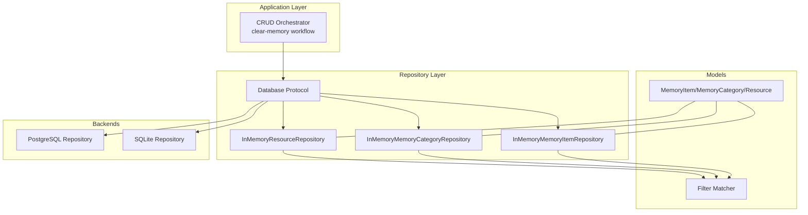
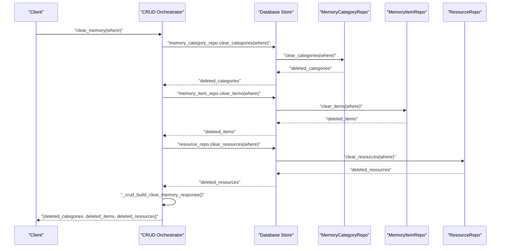
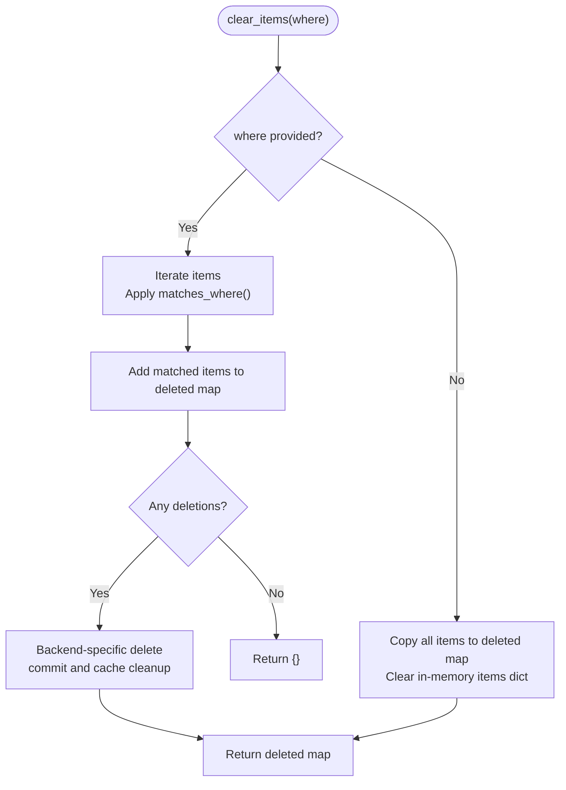
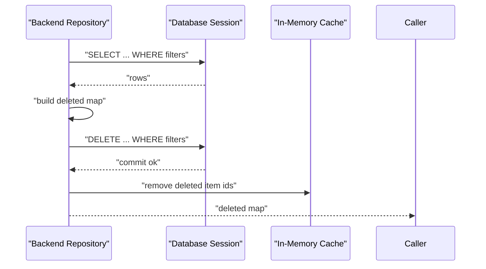
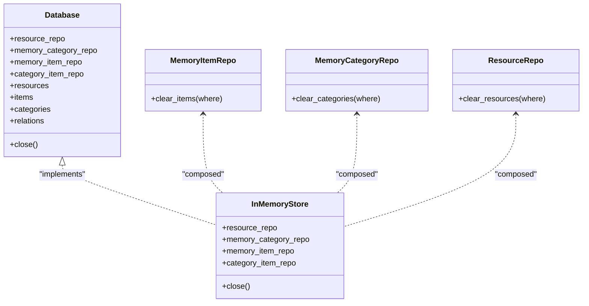

# Bulk Clear Operations

<cite>
**Referenced Files in This Document**
- [crud.py](file://src/memu/app/crud.py)
- [memory_item_repo.py](file://src/memu/database/inmemory/repositories/memory_item_repo.py)
- [memory_category_repo.py](file://src/memu/database/inmemory/repositories/memory_category_repo.py)
- [resource_repo.py](file://src/memu/database/inmemory/repositories/resource_repo.py)
- [filter.py](file://src/memu/database/inmemory/repositories/filter.py)
- [models.py](file://src/memu/database/models.py)
- [interfaces.py](file://src/memu/database/interfaces.py)
- [repo.py](file://src/memu/database/inmemory/repo.py)
- [state.py](file://src/memu/database/state.py)
- [memory_item_repo.py](file://src/memu/database/postgres/repositories/memory_item_repo.py)
- [memory_item_repo.py](file://src/memu/database/sqlite/repositories/memory_item_repo.py)
- [0003-user-scope-in-data-model.md](file://docs/adr/0003-user-scope-in-data-model.md)
</cite>

## Table of Contents
1. [Introduction](#introduction)
2. [Project Structure](#project-structure)
3. [Core Components](#core-components)
4. [Architecture Overview](#architecture-overview)
5. [Detailed Component Analysis](#detailed-component-analysis)
6. [Dependency Analysis](#dependency-analysis)
7. [Performance Considerations](#performance-considerations)
8. [Troubleshooting Guide](#troubleshooting-guide)
9. [Conclusion](#conclusion)
10. [Appendices](#appendices)

## Introduction
This document explains bulk clear operations for clearing memory data at scale. It focuses on the clear_memory() workflow, which selectively deletes memory categories, items, and resources across all memory layers while preserving user scope enforcement and returning a structured response of deleted entities. It also covers where clause filtering, cascading effects, transaction safety, and performance considerations for large-scale deletions.

## Project Structure
The bulk clear capability spans:
- Application layer: orchestration of CRUD workflows and response building
- Repository layer: backend-agnostic interfaces and in-memory implementations
- Database backends: PostgreSQL and SQLite repository implementations
- Models and filtering: shared Pydantic models and in-memory where clause matching

**Diagram sources**
- [crud.py](file://src/memu/app/crud.py#L246-L277)
- [interfaces.py](file://src/memu/database/interfaces.py#L13-L26)
- [memory_item_repo.py](file://src/memu/database/inmemory/repositories/memory_item_repo.py#L16-L60)
- [memory_category_repo.py](file://src/memu/database/inmemory/repositories/memory_category_repo.py#L15-L33)
- [resource_repo.py](file://src/memu/database/inmemory/repositories/resource_repo.py#L13-L31)
- [filter.py](file://src/memu/database/inmemory/repositories/filter.py#L7-L29)
- [models.py](file://src/memu/database/models.py#L68-L106)
- [memory_item_repo.py](file://src/memu/database/postgres/repositories/memory_item_repo.py#L88-L111)
- [memory_item_repo.py](file://src/memu/database/sqlite/repositories/memory_item_repo.py#L164-L209)

**Section sources**
- [crud.py](file://src/memu/app/crud.py#L246-L277)
- [interfaces.py](file://src/memu/database/interfaces.py#L13-L26)
- [repo.py](file://src/memu/database/inmemory/repo.py#L20-L61)
- [state.py](file://src/memu/database/state.py#L8-L17)

## Core Components
- clear_memory_categories: Deletes categories matching where filters and returns deleted entries
- clear_memory_items: Deletes items matching where filters and returns deleted entries
- clear_memory_resources: Deletes resources matching where filters and returns deleted entries
- Response builder: Aggregates deleted categories, items, and resources into a unified response

Key behaviors:
- Selective clearing via where clause filters
- User scope enforcement through filter matching
- Response structure: deleted_categories, deleted_items, deleted_resources
- Backend-specific implementations (in-memory, PostgreSQL, SQLite) share the same interface contract

**Section sources**
- [crud.py](file://src/memu/app/crud.py#L246-L277)
- [memory_item_repo.py](file://src/memu/database/inmemory/repositories/memory_item_repo.py#L53-L60)
- [memory_category_repo.py](file://src/memu/database/inmemory/repositories/memory_category_repo.py#L26-L33)
- [resource_repo.py](file://src/memu/database/inmemory/repositories/resource_repo.py#L24-L31)

## Architecture Overview
The clear workflow is a three-step pipeline executed under a single request:
1. Clear categories
2. Clear items
3. Clear resources
4. Build response with deleted entities

**Diagram sources**
- [crud.py](file://src/memu/app/crud.py#L246-L277)
- [memory_item_repo.py](file://src/memu/database/inmemory/repositories/memory_item_repo.py#L53-L60)
- [memory_category_repo.py](file://src/memu/database/inmemory/repositories/memory_category_repo.py#L26-L33)
- [resource_repo.py](file://src/memu/database/inmemory/repositories/resource_repo.py#L24-L31)

## Detailed Component Analysis

### Clear Categories
- Purpose: Remove categories matching where filters
- Behavior: If where is empty, clears all categories; otherwise, applies filter matching
- Response: Returns a dictionary of deleted category ID to category object

Implementation highlights:
- Filter matching uses the in-memory filter engine
- User scope fields are included in category models via scoped model composition

**Section sources**
- [memory_category_repo.py](file://src/memu/database/inmemory/repositories/memory_category_repo.py#L26-L33)
- [filter.py](file://src/memu/database/inmemory/repositories/filter.py#L7-L29)
- [models.py](file://src/memu/database/models.py#L96-L106)
- [0003-user-scope-in-data-model.md](file://docs/adr/0003-user-scope-in-data-model.md#L14-L18)

### Clear Items
- Purpose: Remove items matching where filters
- Behavior: If where is empty, clears all items; otherwise, applies filter matching
- Response: Returns a dictionary of deleted item ID to item object

Backend specifics:
- In-memory: Pure dictionary operations with filter matching
- PostgreSQL: Selects rows, builds deleted map, executes DELETE, commits, and cleans cache
- SQLite: Similar pattern with SQLAlchemy delete statement and cache cleanup

**Section sources**
- [memory_item_repo.py](file://src/memu/database/inmemory/repositories/memory_item_repo.py#L53-L60)
- [memory_item_repo.py](file://src/memu/database/postgres/repositories/memory_item_repo.py#L88-L111)
- [memory_item_repo.py](file://src/memu/database/sqlite/repositories/memory_item_repo.py#L164-L209)
- [filter.py](file://src/memu/database/inmemory/repositories/filter.py#L7-L29)

### Clear Resources
- Purpose: Remove resources matching where filters
- Behavior: If where is empty, clears all resources; otherwise, applies filter matching
- Response: Returns a dictionary of deleted resource ID to resource object

**Section sources**
- [resource_repo.py](file://src/memu/database/inmemory/repositories/resource_repo.py#L24-L31)
- [filter.py](file://src/memu/database/inmemory/repositories/filter.py#L7-L29)

### Response Building
- Aggregates deleted entities from categories, items, and resources
- Produces a JSON-serializable response with three top-level arrays
- Excludes embeddings from returned entities for compactness

**Section sources**
- [crud.py](file://src/memu/app/crud.py#L267-L277)

### Where Clause Filtering and User Scope Enforcement
- Where clause syntax: field names with optional operators (e.g., field__op)
- Supported operator: __in for membership testing
- Matching logic: field presence and equality/membership checks against object attributes
- User scope enforcement: filter matching includes user-defined scope fields embedded into models

**Diagram sources**
- [memory_item_repo.py](file://src/memu/database/inmemory/repositories/memory_item_repo.py#L53-L60)
- [filter.py](file://src/memu/database/inmemory/repositories/filter.py#L7-L29)
- [memory_item_repo.py](file://src/memu/database/postgres/repositories/memory_item_repo.py#L88-L111)
- [memory_item_repo.py](file://src/memu/database/sqlite/repositories/memory_item_repo.py#L164-L209)

**Section sources**
- [filter.py](file://src/memu/database/inmemory/repositories/filter.py#L7-L29)
- [models.py](file://src/memu/database/models.py#L108-L134)
- [0003-user-scope-in-data-model.md](file://docs/adr/0003-user-scope-in-data-model.md#L14-L18)

### Transaction Safety Across Backends
- PostgreSQL: Uses a single session to SELECT matching rows, build the deleted map, execute DELETE, commit, and clean cache
- SQLite: Similar pattern with SQLAlchemy delete and commit
- In-memory: Immediate dictionary updates; no external transactions

**Diagram sources**
- [memory_item_repo.py](file://src/memu/database/postgres/repositories/memory_item_repo.py#L88-L111)
- [memory_item_repo.py](file://src/memu/database/sqlite/repositories/memory_item_repo.py#L164-L209)

**Section sources**
- [memory_item_repo.py](file://src/memu/database/postgres/repositories/memory_item_repo.py#L88-L111)
- [memory_item_repo.py](file://src/memu/database/sqlite/repositories/memory_item_repo.py#L164-L209)

### Cascade Deletion Across Layers
- Categories: Clear categories first; dependent items remain but lose category linkage
- Items: Clear items second; resources referenced by items remain unless also cleared
- Resources: Clear resources last; items referencing removed resources become orphaned by reference but retain their records

Note: The current clear workflow does not enforce referential integrity cascades. To achieve true cascade deletion, additional logic would be required to:
- Remove category-item relations before deleting items
- Delete items before deleting resources they reference

[No sources needed since this section provides conceptual guidance]

## Dependency Analysis
- Database protocol defines the repository contracts used by the CRUD orchestrator
- In-memory store composes repositories backed by shared models and state
- Filter matching is reused across all repository implementations for consistent behavior

**Diagram sources**
- [interfaces.py](file://src/memu/database/interfaces.py#L13-L26)
- [repo.py](file://src/memu/database/inmemory/repo.py#L20-L61)
- [memory_item_repo.py](file://src/memu/database/inmemory/repositories/memory_item_repo.py#L16-L20)
- [memory_category_repo.py](file://src/memu/database/inmemory/repositories/memory_category_repo.py#L15-L19)
- [resource_repo.py](file://src/memu/database/inmemory/repositories/resource_repo.py#L13-L17)

**Section sources**
- [interfaces.py](file://src/memu/database/interfaces.py#L13-L26)
- [repo.py](file://src/memu/database/inmemory/repo.py#L20-L61)

## Performance Considerations
- Large-scale deletions: Prefer targeted where clauses to minimize scan and deletion cost
- Backend choice: PostgreSQL and SQLite handle bulk deletes efficiently; in-memory clears are O(n) dictionary operations
- Cache cleanup: Repositories proactively remove cached entries after backend deletes
- Response size: Excluding embeddings reduces payload size for large deletions

[No sources needed since this section provides general guidance]

## Troubleshooting Guide
Common issues and resolutions:
- Empty where clause: Clears entire layer; verify intent before invoking
- No matches: Returns empty map; confirm filter correctness
- Scope mismatch: Ensure where clause includes required user scope fields
- Backend errors: Verify session commit and cache synchronization

**Section sources**
- [crud.py](file://src/memu/app/crud.py#L267-L277)
- [memory_item_repo.py](file://src/memu/database/postgres/repositories/memory_item_repo.py#L88-L111)
- [memory_item_repo.py](file://src/memu/database/sqlite/repositories/memory_item_repo.py#L164-L209)

## Conclusion
The bulk clear operations provide a scalable, user-scoped, and response-rich mechanism to purge memory categories, items, and resources. By leveraging where clause filtering and consistent repository interfaces across backends, the system supports both targeted and complete system cleanup scenarios while maintaining predictable performance characteristics.

## Appendices

### Example Scenarios
- Selective clearing by user: Provide where filters that include user scope fields
- Time-based clearing: Use where filters on created_at or updated_at fields
- Complete system cleanup: Invoke clear_memory with no where clause to clear all entities

[No sources needed since this section provides conceptual guidance]