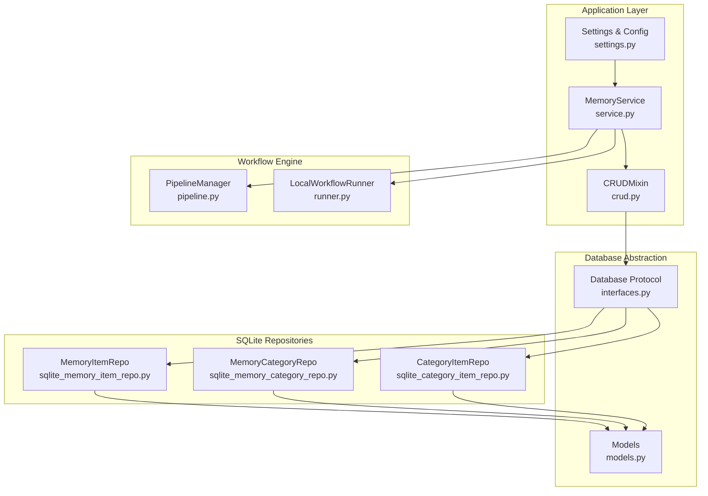
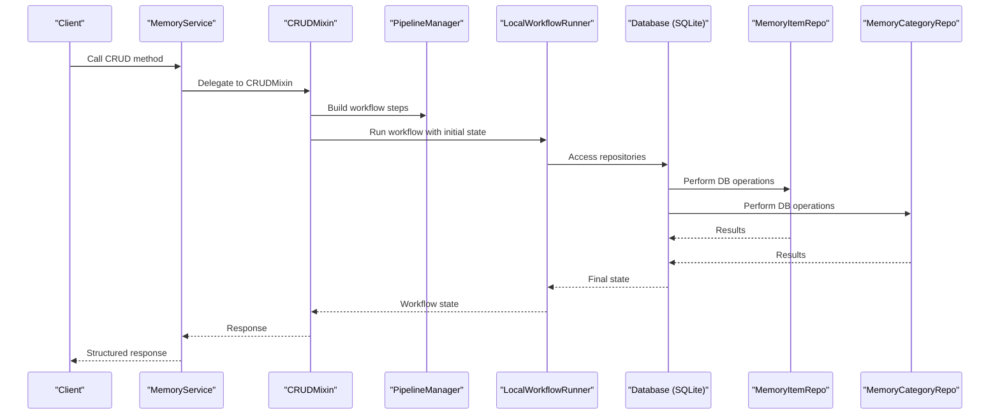
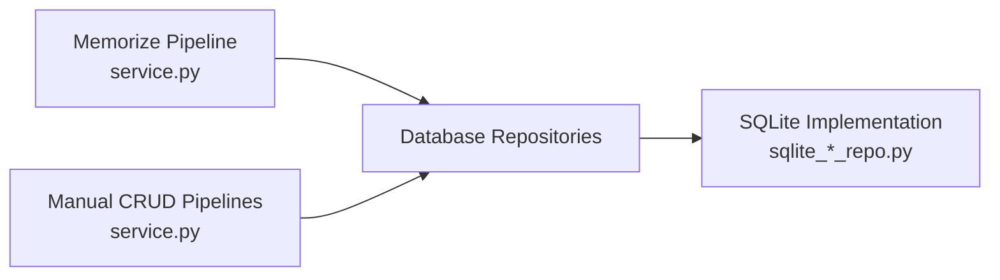
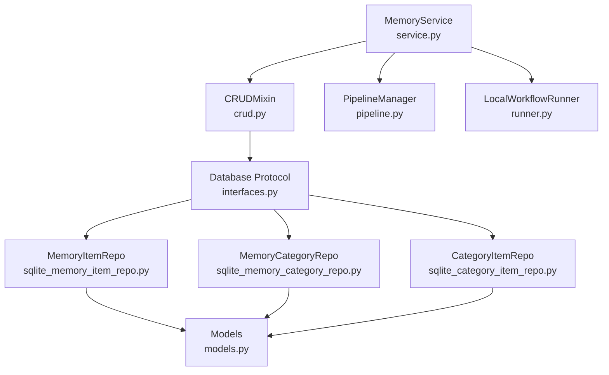

# CRUD Operations

<cite>
**Referenced Files in This Document**
- [crud.py](file://src/memu/app/crud.py)
- [service.py](file://src/memu/app/service.py)
- [models.py](file://src/memu/database/models.py)
- [memory_item.py](file://src/memu/database/repositories/memory_item.py)
- [memory_category.py](file://src/memu/database/repositories/memory_category.py)
- [category_item.py](file://src/memu/database/repositories/category_item.py)
- [sqlite_memory_item_repo.py](file://src/memu/database/sqlite/repositories/memory_item_repo.py)
- [sqlite_memory_category_repo.py](file://src/memu/database/sqlite/repositories/memory_category_repo.py)
- [sqlite_category_item_repo.py](file://src/memu/database/sqlite/repositories/category_item_repo.py)
- [interfaces.py](file://src/memu/database/interfaces.py)
- [settings.py](file://src/memu/app/settings.py)
- [pipeline.py](file://src/memu/workflow/pipeline.py)
- [runner.py](file://src/memu/workflow/runner.py)
- [example_1_conversation_memory.py](file://examples/example_1_conversation_memory.py)
</cite>

## Table of Contents
1. [Introduction](#introduction)
2. [Project Structure](#project-structure)
3. [Core Components](#core-components)
4. [Architecture Overview](#architecture-overview)
5. [Detailed Component Analysis](#detailed-component-analysis)
6. [Dependency Analysis](#dependency-analysis)
7. [Performance Considerations](#performance-considerations)
8. [Troubleshooting Guide](#troubleshooting-guide)
9. [Conclusion](#conclusion)
10. [Appendices](#appendices)

## Introduction
This document provides API documentation for manual memory management CRUD operations. It focuses on five core methods:
- create_memory_item()
- update_memory_item()
- delete_memory_item()
- list_memory_items()
- list_memory_categories()

It explains parameter requirements, return value structures, error conditions, underlying database operations, transaction handling, consistency guarantees, and how these operations relate to the automated memory ingestion pipeline. Practical examples demonstrate manual workflows, bulk operations, and administrative tasks. Access control and audit considerations are addressed through the user scope model and workflow interceptors.

## Project Structure
The CRUD functionality is implemented in the application layer and orchestrated through a workflow engine. Data access is abstracted behind repository protocols and implemented for SQLite and PostgreSQL.

**Diagram sources**
- [service.py](file://src/memu/app/service.py#L49-L427)
- [crud.py](file://src/memu/app/crud.py#L23-L714)
- [pipeline.py](file://src/memu/workflow/pipeline.py#L21-L171)
- [runner.py](file://src/memu/workflow/runner.py#L28-L82)
- [interfaces.py](file://src/memu/database/interfaces.py#L12-L36)
- [sqlite_memory_item_repo.py](file://src/memu/database/sqlite/repositories/memory_item_repo.py#L23-L541)
- [sqlite_memory_category_repo.py](file://src/memu/database/sqlite/repositories/memory_category_repo.py#L21-L261)
- [sqlite_category_item_repo.py](file://src/memu/database/sqlite/repositories/category_item_repo.py#L21-L181)
- [models.py](file://src/memu/database/models.py#L68-L149)
- [settings.py](file://src/memu/app/settings.py#L245-L322)

**Section sources**
- [service.py](file://src/memu/app/service.py#L49-L427)
- [crud.py](file://src/memu/app/crud.py#L23-L714)
- [pipeline.py](file://src/memu/workflow/pipeline.py#L21-L171)
- [runner.py](file://src/memu/workflow/runner.py#L28-L82)
- [interfaces.py](file://src/memu/database/interfaces.py#L12-L36)
- [sqlite_memory_item_repo.py](file://src/memu/database/sqlite/repositories/memory_item_repo.py#L23-L541)
- [sqlite_memory_category_repo.py](file://src/memu/database/sqlite/repositories/memory_category_repo.py#L21-L261)
- [sqlite_category_item_repo.py](file://src/memu/database/sqlite/repositories/category_item_repo.py#L21-L181)
- [models.py](file://src/memu/database/models.py#L68-L149)
- [settings.py](file://src/memu/app/settings.py#L245-L322)

## Core Components
- CRUDMixin: Provides manual memory management APIs and orchestrates workflows for list, create, update, delete, and clear operations.
- MemoryService: Implements the service layer, wires repositories, manages LLM clients, and registers workflows.
- Repository Protocols: Define contracts for MemoryItemRepo, MemoryCategoryRepo, and CategoryItemRepo.
- SQLite Repositories: Concrete implementations for SQLite with transactional persistence and caching.
- Database Protocol: Abstracts storage backend and exposes repository instances.
- Models: Define MemoryItem, MemoryCategory, CategoryItem, and shared BaseRecord behavior.
- Settings: Configure user scope model, memory categories, LLM profiles, and database backends.

**Section sources**
- [crud.py](file://src/memu/app/crud.py#L23-L714)
- [service.py](file://src/memu/app/service.py#L49-L427)
- [memory_item.py](file://src/memu/database/repositories/memory_item.py#L9-L55)
- [memory_category.py](file://src/memu/database/repositories/memory_category.py#L9-L34)
- [category_item.py](file://src/memu/database/repositories/category_item.py#L9-L24)
- [sqlite_memory_item_repo.py](file://src/memu/database/sqlite/repositories/memory_item_repo.py#L23-L541)
- [sqlite_memory_category_repo.py](file://src/memu/database/sqlite/repositories/memory_category_repo.py#L21-L261)
- [sqlite_category_item_repo.py](file://src/memu/database/sqlite/repositories/category_item_repo.py#L21-L181)
- [interfaces.py](file://src/memu/database/interfaces.py#L12-L36)
- [models.py](file://src/memu/database/models.py#L68-L149)
- [settings.py](file://src/memu/app/settings.py#L245-L322)

## Architecture Overview
Manual memory management follows a workflow-driven pattern:
- Application layer methods validate inputs and prepare a workflow state.
- Workflows are registered in PipelineManager and executed by LocalWorkflowRunner.
- Steps operate on Database repositories to perform reads/writes.
- Responses are built from repository results and model dumps excluding embeddings.

**Diagram sources**
- [service.py](file://src/memu/app/service.py#L315-L361)
- [crud.py](file://src/memu/app/crud.py#L38-L77)
- [pipeline.py](file://src/memu/workflow/pipeline.py#L47-L49)
- [runner.py](file://src/memu/workflow/runner.py#L31-L39)
- [interfaces.py](file://src/memu/database/interfaces.py#L12-L26)
- [sqlite_memory_item_repo.py](file://src/memu/database/sqlite/repositories/memory_item_repo.py#L53-L84)
- [sqlite_memory_category_repo.py](file://src/memu/database/sqlite/repositories/memory_category_repo.py#L51-L82)

## Detailed Component Analysis

### Manual CRUD API Definitions

#### create_memory_item()
- Purpose: Create a new memory item and optionally link it to categories. Updates category summaries via LLM.
- Parameters:
  - memory_type: Literal string among supported types.
  - memory_content: String summary/content to store.
  - memory_categories: List of category names to associate.
  - user: Optional dict conforming to the configured user scope model.
- Validation:
  - Validates memory_type against allowed values.
  - Ensures user scope is present and conforms to user_model.
- Workflow:
  - Embeds content, creates MemoryItem, links categories, persists and reindexes categories.
- Return:
  - Dictionary containing the created memory_item and affected category_updates.
- Errors:
  - ValueError for invalid memory_type.
  - RuntimeError if workflow fails to produce a response.
- Underlying DB:
  - MemoryItemRepo.create_item(), CategoryItemRepo.link_item_category().
- Transactions:
  - SQLite transactions are committed per operation; repository methods commit within sessions.
- Consistency:
  - Category summaries updated via LLM; updates applied atomically per category.

**Section sources**
- [crud.py](file://src/memu/app/crud.py#L279-L314)
- [sqlite_memory_item_repo.py](file://src/memu/database/sqlite/repositories/memory_item_repo.py#L211-L283)
- [sqlite_category_item_repo.py](file://src/memu/database/sqlite/repositories/category_item_repo.py#L84-L141)
- [models.py](file://src/memu/database/models.py#L12-L12)

#### update_memory_item()
- Purpose: Update memory_type, memory_content, or memory_categories for an existing item.
- Parameters:
  - memory_id: Identifier of the item to update.
  - memory_type: Optional; must be valid if provided.
  - memory_content: Optional; if provided, generates new embedding.
  - memory_categories: Optional; replaces category membership.
  - user: Optional user scope.
- Validation:
  - At least one of type, content, or categories must be provided.
  - Validates memory_type if present.
- Workflow:
  - Loads existing item, computes diffs, updates item and category memberships, reindexes categories.
- Return:
  - Dictionary containing updated memory_item and affected category_updates.
- Errors:
  - ValueError if item not found or invalid parameters.
  - RuntimeError if workflow fails to produce a response.
- Underlying DB:
  - MemoryItemRepo.update_item(), CategoryItemRepo operations for linking/unlinking.
- Transactions:
  - SQLite transaction committed per operation.

**Section sources**
- [crud.py](file://src/memu/app/crud.py#L315-L354)
- [sqlite_memory_item_repo.py](file://src/memu/database/sqlite/repositories/memory_item_repo.py#L388-L459)
- [sqlite_category_item_repo.py](file://src/memu/database/sqlite/repositories/category_item_repo.py#L143-L173)

#### delete_memory_item()
- Purpose: Remove a memory item and update category summaries accordingly.
- Parameters:
  - memory_id: Identifier of the item to delete.
  - user: Optional user scope.
- Workflow:
  - Loads item, records category updates, deletes item, persists changes.
- Return:
  - Dictionary containing deleted memory_item and affected category_updates.
- Errors:
  - ValueError if item not found.
  - RuntimeError if workflow fails to produce a response.
- Underlying DB:
  - MemoryItemRepo.delete_item(), CategoryItemRepo unlink operations.
- Transactions:
  - SQLite transaction committed per operation.

**Section sources**
- [crud.py](file://src/memu/app/crud.py#L356-L380)
- [sqlite_memory_item_repo.py](file://src/memu/database/sqlite/repositories/memory_item_repo.py#L461-L476)
- [sqlite_category_item_repo.py](file://src/memu/database/sqlite/repositories/category_item_repo.py#L143-L162)

#### list_memory_items()
- Purpose: Retrieve memory items with optional filtering.
- Parameters:
  - where: Optional dict of filters aligned with user scope model fields.
- Validation:
  - Filters are validated against user_model fields; unknown fields raise ValueError.
- Workflow:
  - Executes a read-only workflow that queries MemoryItemRepo and builds a response.
- Return:
  - Dictionary containing a list of items (without embeddings).
- Errors:
  - RuntimeError if workflow fails to produce a response.
- Underlying DB:
  - MemoryItemRepo.list_items() with SQLModel filters.

**Section sources**
- [crud.py](file://src/memu/app/crud.py#L38-L77)
- [sqlite_memory_item_repo.py](file://src/memu/database/sqlite/repositories/memory_item_repo.py#L86-L117)

#### list_memory_categories()
- Purpose: Retrieve memory categories with optional filtering.
- Parameters:
  - where: Optional dict of filters aligned with user scope model fields.
- Validation:
  - Filters validated against user_model fields.
- Workflow:
  - Executes a read-only workflow that queries MemoryCategoryRepo and builds a response.
- Return:
  - Dictionary containing a list of categories (without embeddings).
- Errors:
  - RuntimeError if workflow fails to produce a response.
- Underlying DB:
  - MemoryCategoryRepo.list_categories() with SQLModel filters.

**Section sources**
- [crud.py](file://src/memu/app/crud.py#L59-L77)
- [sqlite_memory_category_repo.py](file://src/memu/database/sqlite/repositories/memory_category_repo.py#L51-L82)

### Relationship to Automated Memory Ingestion Pipeline
- The manual CRUD methods reuse the same repository layer and database abstraction as the automated memorize pipeline.
- Workflows for manual operations mirror the structure of the memorize pipeline but focus on explicit user-driven changes rather than automatic extraction.
- Both pipelines share the same database state, ensuring consistency across manual edits and automated ingestion.

**Diagram sources**
- [service.py](file://src/memu/app/service.py#L315-L348)
- [interfaces.py](file://src/memu/database/interfaces.py#L12-L26)
- [sqlite_memory_item_repo.py](file://src/memu/database/sqlite/repositories/memory_item_repo.py#L23-L50)
- [sqlite_memory_category_repo.py](file://src/memu/database/sqlite/repositories/memory_category_repo.py#L21-L49)

**Section sources**
- [service.py](file://src/memu/app/service.py#L315-L348)
- [interfaces.py](file://src/memu/database/interfaces.py#L12-L26)

### Data Validation, Access Control, and Audit Trail
- Data Validation:
  - Memory type validation occurs in CRUD methods.
  - Filter validation ensures only known user scope fields are used.
- Access Control:
  - User scope model is merged into repository models to enforce per-user isolation.
  - Filtering and deduplication leverage user_data passed to repositories.
- Audit Trail:
  - All records extend BaseRecord with created_at and updated_at timestamps.
  - Deduplication tracks content_hash and reinforcement metrics for tool memories.

**Section sources**
- [crud.py](file://src/memu/app/crud.py#L287-L329)
- [models.py](file://src/memu/database/models.py#L35-L106)
- [sqlite_memory_item_repo.py](file://src/memu/database/sqlite/repositories/memory_item_repo.py#L311-L386)

### Practical Examples and Workflows

#### Example: Conversation Memory Processing
- Demonstrates initializing MemoryService, processing conversation files, and extracting memory categories.
- Shows how categories are updated after each memorize call, aligning with manual category updates.

**Section sources**
- [example_1_conversation_memory.py](file://examples/example_1_conversation_memory.py#L51-L118)

#### Bulk Operations and Administrative Tasks
- Use list_memory_items() with where filters to scope bulk operations.
- Use clear_memory workflow (via CRUD) to remove items, categories, and resources in a single operation.
- Administrative tasks can leverage user scope to limit visibility and modifications.

**Section sources**
- [crud.py](file://src/memu/app/crud.py#L79-L98)
- [sqlite_memory_item_repo.py](file://src/memu/database/sqlite/repositories/memory_item_repo.py#L164-L209)
- [sqlite_memory_category_repo.py](file://src/memu/database/sqlite/repositories/memory_category_repo.py#L84-L129)

## Dependency Analysis
The system exhibits clear separation of concerns:
- Application layer depends on workflow engine and settings.
- Workflow engine depends on pipeline and runner abstractions.
- Database abstraction decouples storage backends from application logic.
- Repositories depend on models and SQLModel for persistence.

**Diagram sources**
- [service.py](file://src/memu/app/service.py#L49-L427)
- [crud.py](file://src/memu/app/crud.py#L23-L714)
- [pipeline.py](file://src/memu/workflow/pipeline.py#L21-L171)
- [runner.py](file://src/memu/workflow/runner.py#L28-L82)
- [interfaces.py](file://src/memu/database/interfaces.py#L12-L36)
- [sqlite_memory_item_repo.py](file://src/memu/database/sqlite/repositories/memory_item_repo.py#L23-L541)
- [sqlite_memory_category_repo.py](file://src/memu/database/sqlite/repositories/memory_category_repo.py#L21-L261)
- [sqlite_category_item_repo.py](file://src/memu/database/sqlite/repositories/category_item_repo.py#L21-L181)
- [models.py](file://src/memu/database/models.py#L68-L149)

**Section sources**
- [service.py](file://src/memu/app/service.py#L49-L427)
- [crud.py](file://src/memu/app/crud.py#L23-L714)
- [pipeline.py](file://src/memu/workflow/pipeline.py#L21-L171)
- [runner.py](file://src/memu/workflow/runner.py#L28-L82)
- [interfaces.py](file://src/memu/database/interfaces.py#L12-L36)
- [sqlite_memory_item_repo.py](file://src/memu/database/sqlite/repositories/memory_item_repo.py#L23-L541)
- [sqlite_memory_category_repo.py](file://src/memu/database/sqlite/repositories/memory_category_repo.py#L21-L261)
- [sqlite_category_item_repo.py](file://src/memu/database/sqlite/repositories/category_item_repo.py#L21-L181)
- [models.py](file://src/memu/database/models.py#L68-L149)

## Performance Considerations
- Vector Search: MemoryItemRepo.vector_search_items supports similarity and salience ranking; salience incorporates reinforcement counts and recency decay.
- Caching: Repositories maintain in-memory caches (items, categories, relations) to reduce repeated database reads.
- Batch Embeddings: Embedding clients are configured via LLM profiles; batching is handled by underlying clients.
- Concurrency: Workflows are executed asynchronously; ensure proper rate limiting for LLM and embedding endpoints.

**Section sources**
- [sqlite_memory_item_repo.py](file://src/memu/database/sqlite/repositories/memory_item_repo.py#L477-L519)
- [settings.py](file://src/memu/app/settings.py#L102-L127)

## Troubleshooting Guide
- Unknown filter fields: Ensure where clauses use only fields defined in the user scope model; otherwise, a ValueError is raised.
- Item/Category not found: CRUD update/delete methods raise ValueError when identifiers are missing.
- Workflow failures: If a workflow does not produce a response, a RuntimeError is raised.
- LLM profile errors: Unknown LLM profiles referenced in step configurations cause validation errors during pipeline registration.
- Interceptors: Use workflow interceptors to capture errors and debug step execution.

**Section sources**
- [crud.py](file://src/memu/app/crud.py#L195-L212)
- [crud.py](file://src/memu/app/crud.py#L540-L541)
- [pipeline.py](file://src/memu/workflow/pipeline.py#L131-L164)
- [service.py](file://src/memu/app/service.py#L284-L295)

## Conclusion
The manual memory management CRUD APIs provide a robust, workflow-driven interface for creating, updating, deleting, listing, and clearing memory items and categories. They integrate seamlessly with the automated ingestion pipeline, ensuring consistent data models, user-scoped access control, and reliable transactional persistence. Proper use of filters, user scopes, and workflow interceptors enables safe and auditable administrative operations.

## Appendices

### API Method Specifications

- create_memory_item()
  - Parameters: memory_type, memory_content, memory_categories, user (optional)
  - Returns: { memory_item: ..., category_updates: [...] }
  - Errors: ValueError (invalid type), RuntimeError (workflow failure)

- update_memory_item()
  - Parameters: memory_id, memory_type (optional), memory_content (optional), memory_categories (optional), user (optional)
  - Returns: { memory_item: ..., category_updates: [...] }
  - Errors: ValueError (missing item or invalid params), RuntimeError (workflow failure)

- delete_memory_item()
  - Parameters: memory_id, user (optional)
  - Returns: { memory_item: ..., category_updates: [...] }
  - Errors: ValueError (missing item), RuntimeError (workflow failure)

- list_memory_items()
  - Parameters: where (optional)
  - Returns: { items: [...] }
  - Errors: RuntimeError (workflow failure)

- list_memory_categories()
  - Parameters: where (optional)
  - Returns: { categories: [...] }
  - Errors: RuntimeError (workflow failure)

**Section sources**
- [crud.py](file://src/memu/app/crud.py#L279-L380)
- [crud.py](file://src/memu/app/crud.py#L38-L77)