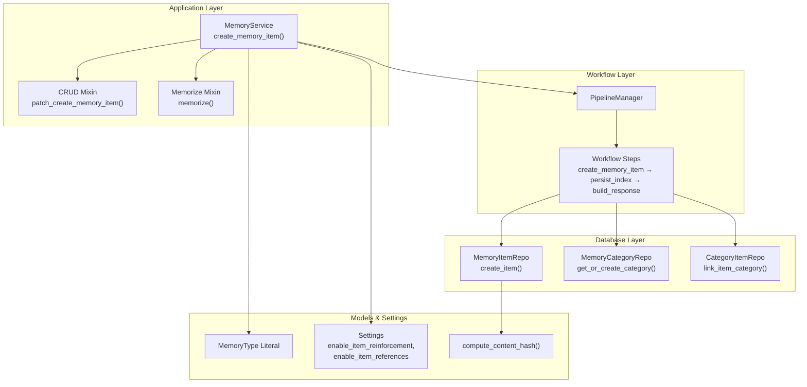
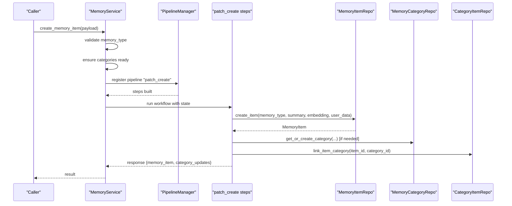
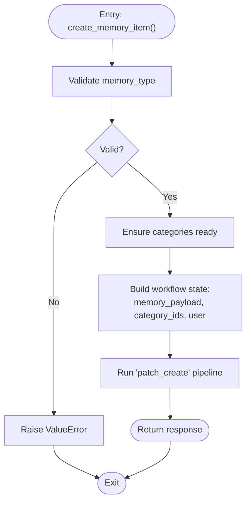
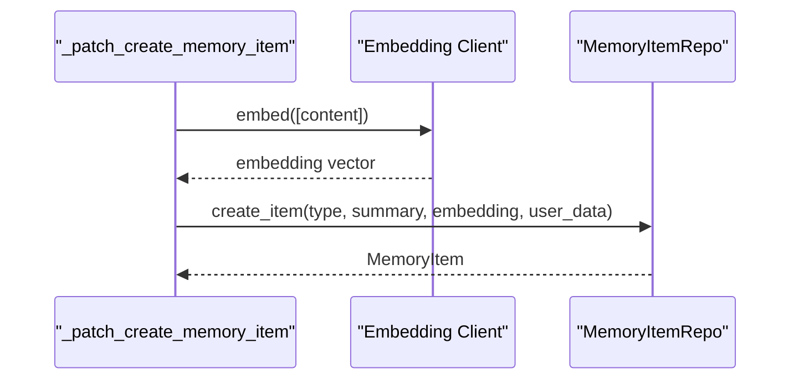
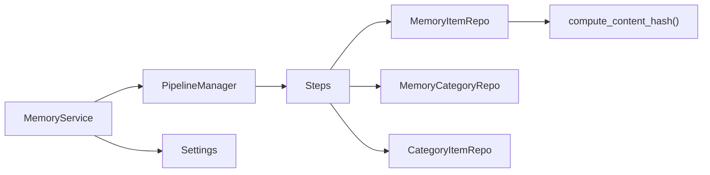

# Create Operations

<cite>
**Referenced Files in This Document**
- [service.py](file://src/memu/app/service.py)
- [crud.py](file://src/memu/app/crud.py)
- [memorize.py](file://src/memu/app/memorize.py)
- [models.py](file://src/memu/database/models.py)
- [memory_item_repo.py (inmemory)](file://src/memu/database/inmemory/repositories/memory_item_repo.py)
- [memory_item_repo.py (postgres)](file://src/memu/database/postgres/repositories/memory_item_repo.py)
- [memory_item_repo.py (sqlite)](file://src/memu/database/sqlite/repositories/memory_item_repo.py)
- [settings.py](file://src/memu/app/settings.py)
- [pipeline.py](file://src/memu/workflow/pipeline.py)
- [test_tool_memory.py](file://tests/test_tool_memory.py)
</cite>

## Table of Contents
1. [Introduction](#introduction)
2. [Project Structure](#project-structure)
3. [Core Components](#core-components)
4. [Architecture Overview](#architecture-overview)
5. [Detailed Component Analysis](#detailed-component-analysis)
6. [Dependency Analysis](#dependency-analysis)
7. [Performance Considerations](#performance-considerations)
8. [Troubleshooting Guide](#troubleshooting-guide)
9. [Conclusion](#conclusion)

## Introduction
This document focuses on create operations for memory item creation, centered on the create_memory_item() method exposed by the MemoryService. It explains parameter validation, memory type restrictions, category assignment, and the end-to-end workflow pipeline that generates embeddings, maps categories, and persists items. It also covers payload structure, user scope validation, category ID resolution, and error scenarios. Finally, it connects manual creation with the automated memory ingestion pipeline and highlights manual override capabilities.

## Project Structure
The create operation spans several layers:
- Application layer: MemoryService orchestrates workflows and exposes create_memory_item().
- Workflow layer: Pipelines define steps for embedding generation, category mapping, persistence, and indexing.
- Database layer: Repositories implement create_item() with deduplication and user scope enforcement.
- Models and settings: Define memory types, hashing for deduplication, and configuration flags.

**Diagram sources**
- [service.py](file://src/memu/app/service.py#L49-L350)
- [crud.py](file://src/memu/app/crud.py#L279-L411)
- [memorize.py](file://src/memu/app/memorize.py#L65-L95)
- [pipeline.py](file://src/memu/workflow/pipeline.py#L21-L50)
- [models.py](file://src/memu/database/models.py#L12-L33)
- [settings.py](file://src/memu/app/settings.py#L204-L243)

**Section sources**
- [service.py](file://src/memu/app/service.py#L49-L350)
- [crud.py](file://src/memu/app/crud.py#L279-L411)
- [memorize.py](file://src/memu/app/memorize.py#L65-L95)
- [pipeline.py](file://src/memu/workflow/pipeline.py#L21-L50)
- [models.py](file://src/memu/database/models.py#L12-L33)
- [settings.py](file://src/memu/app/settings.py#L204-L243)

## Core Components
- MemoryService.create_memory_item(): Public entry point that validates inputs, ensures categories are ready, and runs the “patch_create” workflow.
- CRUDMixin._patch_create_memory_item(): Generates embedding, creates the memory item, maps categories, and tracks category updates.
- MemoryItemRepo.create_item(): Persists the item, supports deduplication via content hash, and enforces user scope.
- Category mapping: Resolves category names to IDs and links items to categories.
- User scope validation: Enforces allowed fields based on the configured user model.

**Section sources**
- [service.py](file://src/memu/app/service.py#L49-L350)
- [crud.py](file://src/memu/app/crud.py#L279-L411)
- [memorize.py](file://src/memu/app/memorize.py#L65-L95)
- [models.py](file://src/memu/database/models.py#L12-L33)

## Architecture Overview
The create operation follows a deterministic pipeline:
1. Validate memory_type against the MemoryType literal.
2. Ensure categories are initialized for the given user scope.
3. Prepare a workflow state with memory_payload, category_ids, and user scope.
4. Run “patch_create” steps:
   - Embedding generation for the memory content.
   - Item creation via MemoryItemRepo.create_item().
   - Category mapping and relation creation.
   - Optional category summary updates.
5. Build a response containing the created memory item and affected categories.

**Diagram sources**
- [service.py](file://src/memu/app/service.py#L315-L332)
- [crud.py](file://src/memu/app/crud.py#L382-L411)
- [memorize.py](file://src/memu/app/memorize.py#L65-L95)

## Detailed Component Analysis

### Method: create_memory_item()
- Purpose: Create a memory item with validated type, embed content, assign categories, and persist.
- Input validation:
  - memory_type must be one of the allowed literals.
  - user parameter is validated against the configured user model.
- Workflow orchestration:
  - Ensures categories are ready for the user scope.
  - Builds a state with memory_payload, category_ids, and user scope.
  - Executes the “patch_create” pipeline.
- Output: A response containing the created memory item and affected categories.

**Diagram sources**
- [service.py](file://src/memu/app/service.py#L315-L332)
- [crud.py](file://src/memu/app/crud.py#L279-L313)

**Section sources**
- [service.py](file://src/memu/app/service.py#L315-L332)
- [crud.py](file://src/memu/app/crud.py#L279-L313)

### Parameter Validation and Memory Type Restrictions
- memory_type is validated against the MemoryType literal, which enumerates supported types.
- If invalid, a ValueError is raised with the allowed set.

**Section sources**
- [crud.py](file://src/memu/app/crud.py#L287-L289)
- [models.py](file://src/memu/database/models.py#L12-L12)

### Payload Structure
- memory_payload includes:
  - type: MemoryType
  - content: string summary
  - categories: list of category names
- The workflow state also carries category_ids and user scope.

**Section sources**
- [crud.py](file://src/memu/app/crud.py#L296-L306)
- [memorize.py](file://src/memu/app/memorize.py#L65-L95)

### User Scope Validation
- The user parameter is transformed into a Pydantic model derived from the configured user model.
- Unknown fields are rejected with a ValueError.
- User scope fields are propagated into user_data for repository operations.

**Section sources**
- [crud.py](file://src/memu/app/crud.py#L293-L294)
- [crud.py](file://src/memu/app/crud.py#L195-L212)

### Category Assignment and Resolution
- Category names are mapped to IDs using a name-to-ID lookup maintained in context.
- Duplicates are de-duplicated by ID before linking.
- Relations are created via CategoryItemRepo.link_item_category().

**Section sources**
- [memorize.py](file://src/memu/app/memorize.py#L676-L687)
- [crud.py](file://src/memu/app/crud.py#L625-L636)

### Embedding Generation and Persistence
- Embedding is generated for the memory content and stored with the item.
- MemoryItemRepo.create_item() persists the item and enforces user scope.
- Deduplication is supported via content_hash computed from summary and memory_type.

**Diagram sources**
- [crud.py](file://src/memu/app/crud.py#L509-L517)
- [models.py](file://src/memu/database/models.py#L15-L32)

**Section sources**
- [crud.py](file://src/memu/app/crud.py#L509-L517)
- [models.py](file://src/memu/database/models.py#L15-L32)

### Reinforcement and Deduplication
- When enable_item_reinforcement is true, create_item() checks for existing items with the same content_hash within the same user scope.
- If found, the existing item is reinforced (count incremented) instead of creating duplicates.
- This applies to all types except “tool”.

**Section sources**
- [settings.py](file://src/memu/app/settings.py#L239-L242)
- [memory_item_repo.py (inmemory)](file://src/memu/database/inmemory/repositories/memory_item_repo.py#L132-L136)
- [memory_item_repo.py (postgres)](file://src/memu/database/postgres/repositories/memory_item_repo.py#L124-L131)
- [memory_item_repo.py (sqlite)](file://src/memu/database/sqlite/repositories/memory_item_repo.py#L299-L308)

### Tool Memory and Extra Fields
- Tool memories support special fields in extra:
  - when_to_use: hint for retrieval timing.
  - metadata: type-specific metadata (e.g., tool_name, avg_success_rate).
  - tool_calls: serialized ToolCallResult history.
- These fields are populated during creation and used for statistics and retrieval hints.

**Section sources**
- [models.py](file://src/memu/database/models.py#L82-L94)
- [test_tool_memory.py](file://tests/test_tool_memory.py#L137-L152)
- [test_tool_memory.py](file://tests/test_tool_memory.py#L153-L176)

### Relationship with Automated Ingestion Pipeline
- The “memorize” pipeline extracts structured entries, generates embeddings, and assigns categories automatically.
- Manual creation via create_memory_item() bypasses extraction and directly embeds and persists the provided content.
- Both paths converge on the same repository APIs and category mapping logic.

**Section sources**
- [memorize.py](file://src/memu/app/memorize.py#L97-L166)
- [memorize.py](file://src/memu/app/memorize.py#L578-L623)

### Manual Override Capabilities
- Manual creation allows overriding memory type, content, and category assignments.
- The workflow supports embedding generation and category updates independently of the automated extraction pipeline.

**Section sources**
- [crud.py](file://src/memu/app/crud.py#L382-L411)
- [memorize.py](file://src/memu/app/memorize.py#L148-L166)

## Dependency Analysis
- MemoryService registers pipelines and delegates execution to the workflow runner.
- CRUDMixin builds the “patch_create” pipeline with explicit step capabilities and configuration.
- MemoryItemRepo depends on compute_content_hash() for deduplication and enforces user scope filters.
- Settings control whether reinforcement and reference tracking are enabled.

**Diagram sources**
- [service.py](file://src/memu/app/service.py#L315-L332)
- [pipeline.py](file://src/memu/workflow/pipeline.py#L21-L50)
- [models.py](file://src/memu/database/models.py#L15-L32)
- [settings.py](file://src/memu/app/settings.py#L204-L243)

**Section sources**
- [service.py](file://src/memu/app/service.py#L315-L332)
- [pipeline.py](file://src/memu/workflow/pipeline.py#L21-L50)
- [models.py](file://src/memu/database/models.py#L15-L32)
- [settings.py](file://src/memu/app/settings.py#L204-L243)

## Performance Considerations
- Embedding generation is performed synchronously in the workflow step; batching can be considered if many items are created in sequence.
- Deduplication relies on content_hash comparisons; normalization reduces false negatives due to whitespace differences.
- Category mapping uses an in-memory lookup; ensure category initialization is complete before heavy creation workloads.

[No sources needed since this section provides general guidance]

## Troubleshooting Guide
Common errors and resolutions:
- Invalid memory_type: Ensure the type is one of the allowed literals.
- Unknown filter field in user scope: Verify the user model fields and remove unsupported keys.
- Memory item not found during update/delete: Confirm the memory_id exists and belongs to the current user scope.
- Category not found: Ensure category names are initialized and mapped to IDs before linking.

**Section sources**
- [crud.py](file://src/memu/app/crud.py#L287-L289)
- [crud.py](file://src/memu/app/crud.py#L195-L212)
- [crud.py](file://src/memu/app/crud.py#L538-L541)

## Conclusion
The create_memory_item() method provides a robust, configurable pathway to create memory items with strong validation, user scope enforcement, and category mapping. It integrates seamlessly with the automated ingestion pipeline and supports manual overrides for flexible use cases. Deduplication and reinforcement enhance data quality, while tool memory extras enable advanced retrieval and agent self-improvement scenarios.