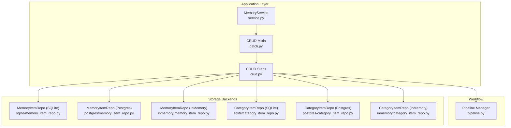
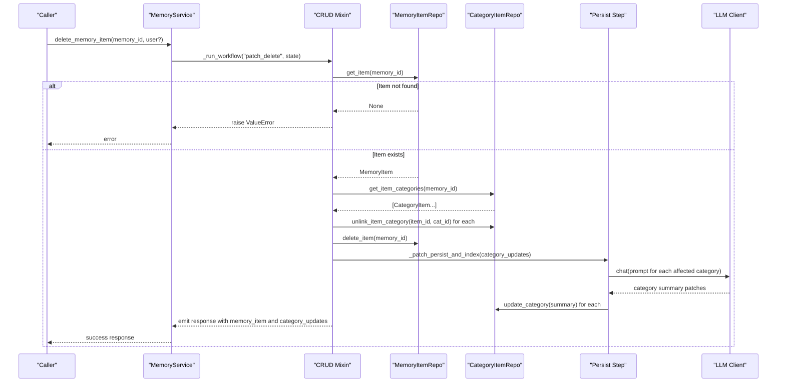
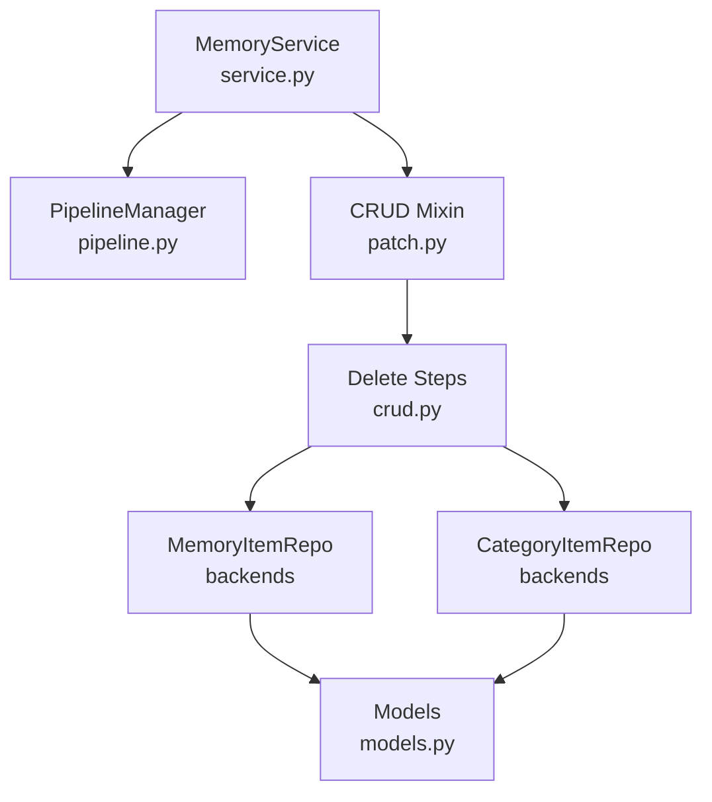

# Delete Operations

<cite>
**Referenced Files in This Document**
- [patch.py](file://src/memu/app/patch.py)
- [crud.py](file://src/memu/app/crud.py)
- [service.py](file://src/memu/app/service.py)
- [memory_item_repo.py (SQLite)](file://src/memu/database/sqlite/repositories/memory_item_repo.py)
- [memory_item_repo.py (Postgres)](file://src/memu/database/postgres/repositories/memory_item_repo.py)
- [memory_item_repo.py (InMemory)](file://src/memu/database/inmemory/repositories/memory_item_repo.py)
- [category_item_repo.py (SQLite)](file://src/memu/database/sqlite/repositories/category_item_repo.py)
- [category_item_repo.py (Postgres)](file://src/memu/database/postgres/repositories/category_item_repo.py)
- [category_item_repo.py (InMemory)](file://src/memu/database/inmemory/repositories/category_item_repo.py)
- [models.py](file://src/memu/database/models.py)
- [pipeline.py](file://src/memu/workflow/pipeline.py)
</cite>

## Table of Contents
1. [Introduction](#introduction)
2. [Project Structure](#project-structure)
3. [Core Components](#core-components)
4. [Architecture Overview](#architecture-overview)
5. [Detailed Component Analysis](#detailed-component-analysis)
6. [Dependency Analysis](#dependency-analysis)
7. [Performance Considerations](#performance-considerations)
8. [Troubleshooting Guide](#troubleshooting-guide)
9. [Conclusion](#conclusion)

## Introduction
This document explains the delete operations for memory items, focusing on the delete_memory_item() method and its behavior across storage backends. It covers:
- Single item deletion workflow
- Cascade-like cleanup of item-category relationships
- Category summary updates triggered by deletions
- Error handling for non-existent items and user scope validation
- Relationship to bulk clearing operations (clear_memory)
- Practical examples and verification steps

## Project Structure
The delete operation spans the application layer (service and CRUD mixins), workflow orchestration, and database repositories. The key files are:
- Application entry and workflow orchestration
- CRUD mixin implementing the delete step
- Database repositories for memory items and category-item relations
- Models defining the data structures
- Workflow pipeline manager

**Diagram sources**
- [service.py](file://src/memu/app/service.py#L315-L359)
- [patch.py](file://src/memu/app/patch.py#L114-L138)
- [crud.py](file://src/memu/app/crud.py#L581-L623)
- [memory_item_repo.py (SQLite)](file://src/memu/database/sqlite/repositories/memory_item_repo.py#L461-L476)
- [memory_item_repo.py (Postgres)](file://src/memu/database/postgres/repositories/memory_item_repo.py#L273-L279)
- [memory_item_repo.py (InMemory)](file://src/memu/database/inmemory/repositories/memory_item_repo.py#L218-L222)
- [category_item_repo.py (SQLite)](file://src/memu/database/sqlite/repositories/category_item_repo.py#L143-L162)
- [category_item_repo.py (Postgres)](file://src/memu/database/postgres/repositories/category_item_repo.py#L68-L78)
- [category_item_repo.py (InMemory)](file://src/memu/database/inmemory/repositories/category_item_repo.py#L40-L42)

**Section sources**
- [service.py](file://src/memu/app/service.py#L315-L359)
- [patch.py](file://src/memu/app/patch.py#L114-L138)
- [crud.py](file://src/memu/app/crud.py#L581-L623)

## Core Components
- MemoryService orchestrates workflows and registers pipelines for delete operations.
- CRUD mixin defines the delete-memory-item workflow steps and error handling.
- Repositories implement item deletion and category-item unlinking per backend.
- Models define MemoryItem, MemoryCategory, and CategoryItem records.

Key responsibilities:
- delete_memory_item(): Validates presence, collects affected categories, deletes the item, and prepares category summary updates.
- Category cleanup: Unlinks item from all categories before deletion.
- Category summaries: Requests LLM-driven updates for impacted categories.

**Section sources**
- [service.py](file://src/memu/app/service.py#L330-L332)
- [patch.py](file://src/memu/app/patch.py#L114-L138)
- [crud.py](file://src/memu/app/crud.py#L581-L623)
- [models.py](file://src/memu/database/models.py#L76-L106)

## Architecture Overview
The delete operation follows a three-step workflow:
1. Patch: Validate item existence, collect categories, and mark category updates.
2. Persist: Trigger category summary updates via LLM.
3. Emit: Build response containing the deleted item and affected categories.

**Diagram sources**
- [patch.py](file://src/memu/app/patch.py#L114-L138)
- [crud.py](file://src/memu/app/crud.py#L581-L609)
- [memory_item_repo.py (SQLite)](file://src/memu/database/sqlite/repositories/memory_item_repo.py#L461-L476)
- [memory_item_repo.py (Postgres)](file://src/memu/database/postgres/repositories/memory_item_repo.py#L273-L279)
- [memory_item_repo.py (InMemory)](file://src/memu/database/inmemory/repositories/memory_item_repo.py#L218-L222)
- [category_item_repo.py (SQLite)](file://src/memu/database/sqlite/repositories/category_item_repo.py#L143-L162)
- [category_item_repo.py (Postgres)](file://src/memu/database/postgres/repositories/category_item_repo.py#L68-L78)
- [category_item_repo.py (InMemory)](file://src/memu/database/inmemory/repositories/category_item_repo.py#L40-L42)

## Detailed Component Analysis

### delete_memory_item() Method
Behavior:
- Validates user scope and ensures categories are ready.
- Builds workflow state with memory_id, context, store, category ids, and user.
- Executes the "patch_delete" pipeline.

Workflow steps:
- Patch step validates item existence and collects categories.
- Unlinks the item from all categories.
- Deletes the item from the repository.
- Prepares category updates for persistence.
- Persist step computes new category summaries using LLM.
- Emit step constructs the response.

Error handling:
- Raises ValueError if the item does not exist.
- Raises RuntimeError if the workflow fails to produce a response.

Response:
- Returns the deleted memory item and the list of categories whose summaries were updated.

**Section sources**
- [patch.py](file://src/memu/app/patch.py#L114-L138)
- [crud.py](file://src/memu/app/crud.py#L581-L623)

### Item Deletion Implementation by Backend
- SQLite: delete_item() queries and deletes the row, then removes from cache.
- Postgres: delete_item() executes a SQL DELETE and commits.
- InMemory: delete_item() removes from the in-memory dictionary.

All backends maintain cache consistency by removing entries after deletion.

**Section sources**
- [memory_item_repo.py (SQLite)](file://src/memu/database/sqlite/repositories/memory_item_repo.py#L461-L476)
- [memory_item_repo.py (Postgres)](file://src/memu/database/postgres/repositories/memory_item_repo.py#L273-L279)
- [memory_item_repo.py (InMemory)](file://src/memu/database/inmemory/repositories/memory_item_repo.py#L218-L222)

### Category Relationship Cleanup
- get_item_categories() enumerates all category relations for the item.
- unlink_item_category() removes each relation from the backend.
- This ensures no orphaned links remain after item deletion.

Backends:
- SQLite: Selects and deletes the relation row, then updates cache.
- Postgres: Executes a SQL DELETE for the relation.
- InMemory: Filters the relations list to exclude the item-category pair.

**Section sources**
- [category_item_repo.py (SQLite)](file://src/memu/database/sqlite/repositories/category_item_repo.py#L143-L162)
- [category_item_repo.py (Postgres)](file://src/memu/database/postgres/repositories/category_item_repo.py#L68-L78)
- [category_item_repo.py (InMemory)](file://src/memu/database/inmemory/repositories/category_item_repo.py#L40-L42)

### Category Summary Updates
After deletion, category_memory_updates maps category_id to a tuple of (content_before, content_after). The persist step:
- Builds prompts for each affected category.
- Calls the LLM to propose updated summaries.
- Applies updates via update_category() if needed.

This maintains category coherence by reflecting the removal of the item’s content.

**Section sources**
- [crud.py](file://src/memu/app/crud.py#L601-L671)
- [models.py](file://src/memu/database/models.py#L96-L106)

### Data Integrity Maintenance
- Atomicity: Item deletion and relation unlinking occur in the same workflow step.
- Consistency: Category summaries are recomputed to reflect the change.
- Cache hygiene: Repositories remove entries from in-memory caches after deletion.

**Section sources**
- [crud.py](file://src/memu/app/crud.py#L581-L609)
- [memory_item_repo.py (SQLite)](file://src/memu/database/sqlite/repositories/memory_item_repo.py#L474-L476)
- [memory_item_repo.py (Postgres)](file://src/memu/database/postgres/repositories/memory_item_repo.py#L277-L279)
- [memory_item_repo.py (InMemory)](file://src/memu/database/inmemory/repositories/memory_item_repo.py#L220-L222)

### Relationship with clear_memory() and Bulk Deletion
- clear_memory_items() performs bulk deletion of items matching filters and clears cache entries.
- delete_memory_item() targets a single item and triggers category updates.
- Bulk operations bypass per-item category updates and rely on cache invalidation.

Implications:
- Use clear_memory_items() for bulk cleanup.
- Use delete_memory_item() for precise item removal with category integrity.

**Section sources**
- [crud.py](file://src/memu/app/crud.py#L253-L258)
- [memory_item_repo.py (SQLite)](file://src/memu/database/sqlite/repositories/memory_item_repo.py#L164-L209)
- [memory_item_repo.py (Postgres)](file://src/memu/database/postgres/repositories/memory_item_repo.py#L88-L111)
- [memory_item_repo.py (InMemory)](file://src/memu/database/inmemory/repositories/memory_item_repo.py#L53-L60)

### Examples

#### Example 1: Single Item Deletion
- Call delete_memory_item(memory_id="item-uuid", user={"user_id": "alice"}).
- The system verifies the item exists, unlinks it from all categories, deletes it, and updates category summaries.

Verification:
- Confirm the item is absent from list_items().
- Confirm category relations for the item are removed.
- Confirm category summaries reflect the removal.

**Section sources**
- [patch.py](file://src/memu/app/patch.py#L114-L138)
- [crud.py](file://src/memu/app/crud.py#L581-L609)

#### Example 2: Cascade Effects on Categories
- Deleting an item causes category_memory_updates for each linked category.
- Persist step invokes LLM to propose updated summaries.
- Categories are updated accordingly.

Verification:
- Inspect category_updates in the response.
- Verify category summaries changed after deletion.

**Section sources**
- [crud.py](file://src/memu/app/crud.py#L581-L609)
- [crud.py](file://src/memu/app/crud.py#L601-L671)

#### Example 3: Bulk Clearing vs Single Deletion
- Use clear_memory_items(where={"user_id": "alice"}) to remove multiple items.
- delete_memory_item() is appropriate for targeted removal.

Verification:
- After clear_memory_items(), confirm items are gone and caches cleared.
- After delete_memory_item(), confirm category relations are cleaned and summaries updated.

**Section sources**
- [crud.py](file://src/memu/app/crud.py#L253-L258)
- [memory_item_repo.py (SQLite)](file://src/memu/database/sqlite/repositories/memory_item_repo.py#L164-L209)
- [memory_item_repo.py (Postgres)](file://src/memu/database/postgres/repositories/memory_item_repo.py#L88-L111)
- [memory_item_repo.py (InMemory)](file://src/memu/database/inmemory/repositories/memory_item_repo.py#L53-L60)

## Dependency Analysis
The delete operation depends on:
- MemoryService to register and run the "patch_delete" pipeline.
- CRUD mixin to implement the workflow steps.
- Repositories to enforce referential integrity and maintain cache consistency.
- Models to represent records and guide category summary updates.

**Diagram sources**
- [service.py](file://src/memu/app/service.py#L315-L359)
- [pipeline.py](file://src/memu/workflow/pipeline.py#L21-L49)
- [patch.py](file://src/memu/app/patch.py#L114-L138)
- [crud.py](file://src/memu/app/crud.py#L581-L623)
- [models.py](file://src/memu/database/models.py#L76-L106)

**Section sources**
- [service.py](file://src/memu/app/service.py#L315-L359)
- [pipeline.py](file://src/memu/workflow/pipeline.py#L21-L49)
- [patch.py](file://src/memu/app/patch.py#L114-L138)
- [crud.py](file://src/memu/app/crud.py#L581-L623)
- [models.py](file://src/memu/database/models.py#L76-L106)

## Performance Considerations
- Single item deletion is O(k) for k categories linked to the item, plus O(1) item deletion.
- Category summary updates are asynchronous via LLM calls; batching is handled internally by gather.
- Cache invalidation is immediate after deletion to prevent stale reads.

[No sources needed since this section provides general guidance]

## Troubleshooting Guide
Common issues and resolutions:
- Non-existent item: delete_memory_item() raises ValueError when the item is not found. Verify the memory_id and user scope.
- Workflow failure: If the response is None, a RuntimeError is raised. Check pipeline registration and step configurations.
- Category summary not updating: Ensure the LLM client is configured and reachable; verify category_memory_updates are populated.

Verification steps:
- Confirm item absence via list_items().
- Confirm category relations are removed via get_item_categories().
- Review response fields: memory_item and category_updates.

**Section sources**
- [crud.py](file://src/memu/app/crud.py#L586-L592)
- [patch.py](file://src/memu/app/patch.py#L133-L138)
- [crud.py](file://src/memu/app/crud.py#L601-L671)

## Conclusion
The delete_memory_item() method provides a robust, backend-agnostic way to remove memory items while maintaining referential integrity and category coherence. It enforces user scope validation, cleans up item-category relationships, and triggers category summary updates. For bulk operations, use clear_memory_items(). Together, these operations ensure data integrity and predictable behavior across storage backends.