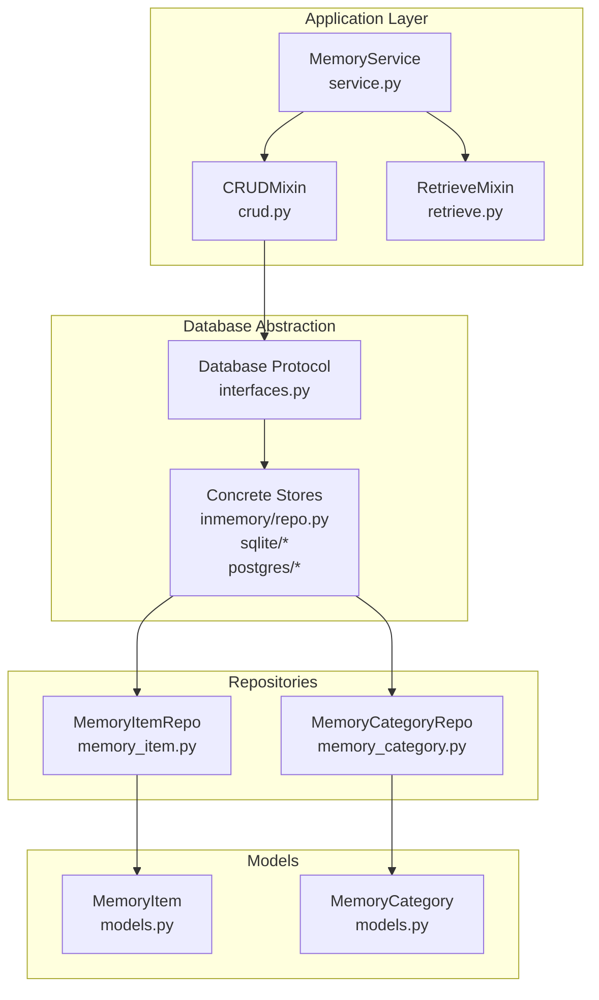
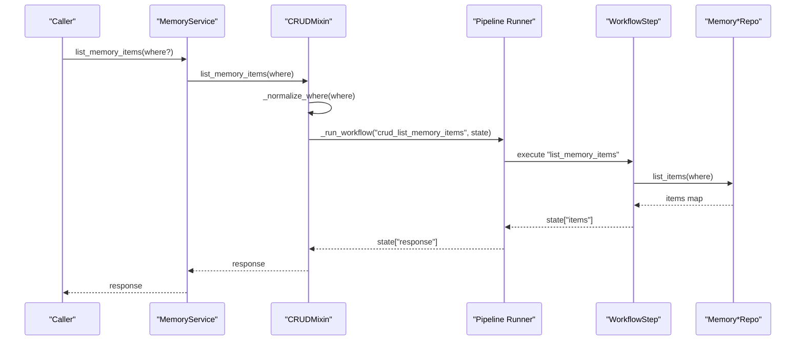
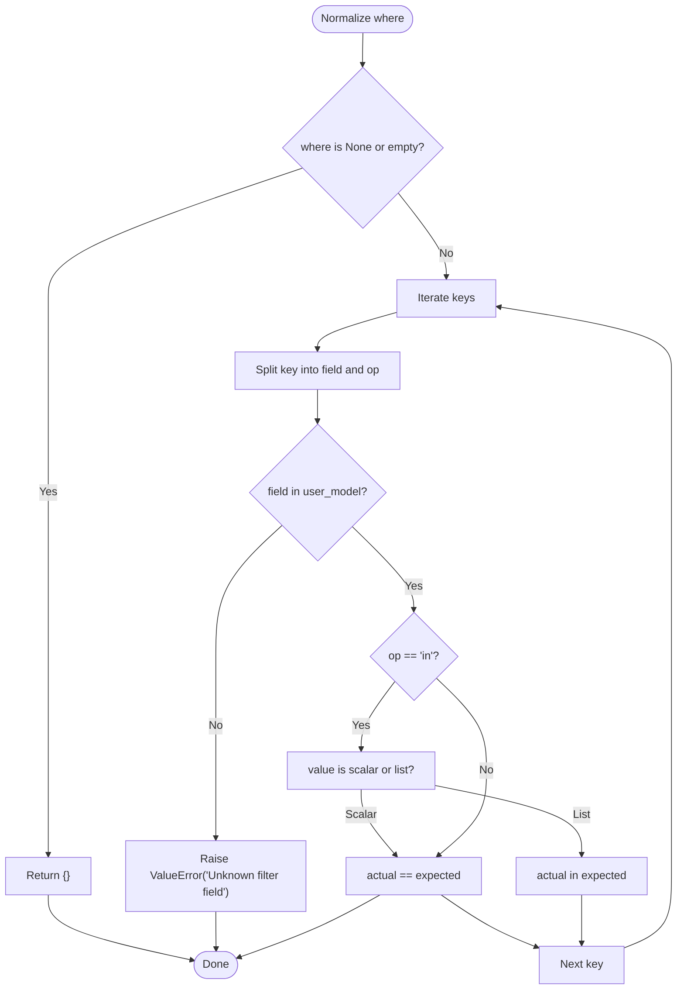
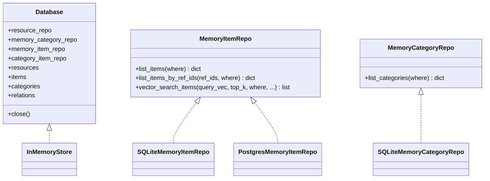
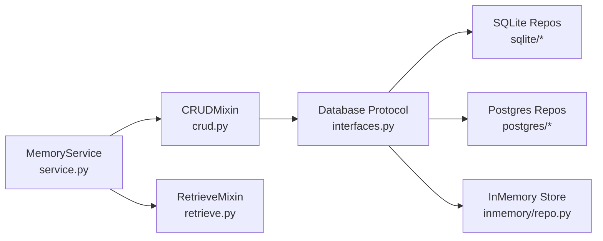

# List Operations

<cite>
**Referenced Files in This Document**
- [crud.py](file://src/memu/app/crud.py)
- [service.py](file://src/memu/app/service.py)
- [retrieve.py](file://src/memu/app/retrieve.py)
- [interfaces.py](file://src/memu/database/interfaces.py)
- [models.py](file://src/memu/database/models.py)
- [memory_item.py](file://src/memu/database/repositories/memory_item.py)
- [memory_category.py](file://src/memu/database/repositories/memory_category.py)
- [sqlite/base.py](file://src/memu/database/sqlite/repositories/base.py)
- [sqlite/memory_item_repo.py](file://src/memu/database/sqlite/repositories/memory_item_repo.py)
- [postgres/memory_item_repo.py](file://src/memu/database/postgres/repositories/memory_item_repo.py)
- [postgres/base.py](file://src/memu/database/postgres/repositories/base.py)
- [inmemory/filter.py](file://src/memu/database/inmemory/repositories/filter.py)
- [inmemory/repo.py](file://src/memu/database/inmemory/repo.py)
</cite>

## Table of Contents
1. [Introduction](#introduction)
2. [Project Structure](#project-structure)
3. [Core Components](#core-components)
4. [Architecture Overview](#architecture-overview)
5. [Detailed Component Analysis](#detailed-component-analysis)
6. [Dependency Analysis](#dependency-analysis)
7. [Performance Considerations](#performance-considerations)
8. [Troubleshooting Guide](#troubleshooting-guide)
9. [Conclusion](#conclusion)

## Introduction
This document explains the list operations for reading memory data: list_memory_items() and list_memory_categories(). It covers method parameters, filtering via the where clause, supported operators, user scope enforcement, repository pattern usage, database abstraction, return structures, pagination considerations, performance optimization, error handling, and security for user data access.

## Project Structure
The list operations are part of the application’s CRUD layer and integrate with a workflow engine. Filtering is enforced against a user-scoped Pydantic model, and repositories abstract database backends (SQLite, PostgreSQL, in-memory).

**Diagram sources**
- [service.py](file://src/memu/app/service.py#L49-L348)
- [crud.py](file://src/memu/app/crud.py#L38-L77)
- [retrieve.py](file://src/memu/app/retrieve.py#L42-L85)
- [interfaces.py](file://src/memu/database/interfaces.py#L12-L26)
- [inmemory/repo.py](file://src/memu/database/inmemory/repo.py#L20-L61)
- [sqlite/base.py](file://src/memu/database/sqlite/repositories/base.py#L18-L100)
- [postgres/base.py](file://src/memu/database/postgres/repositories/base.py#L70-L113)
- [memory_item.py](file://src/memu/database/repositories/memory_item.py#L9-L55)
- [memory_category.py](file://src/memu/database/repositories/memory_category.py#L9-L34)
- [models.py](file://src/memu/database/models.py#L68-L106)

**Section sources**
- [service.py](file://src/memu/app/service.py#L49-L348)
- [interfaces.py](file://src/memu/database/interfaces.py#L12-L26)

## Core Components
- list_memory_items(where: dict[str, Any] | None = None) -> dict[str, Any]
  - Purpose: Lists memory items with optional filtering.
  - Parameters:
    - where: Filter map supporting equality and “in” operator.
  - Return: JSON-serializable structure containing a list of items.
- list_memory_categories(where: dict[str, Any] | None = None) -> dict[str, Any]
  - Purpose: Lists memory categories with optional filtering.
  - Parameters:
    - where: Filter map supporting equality and “in” operator.
  - Return: JSON-serializable structure containing a list of categories.

Filtering semantics:
- Supported operators:
  - Equality: field equals value.
  - Membership: field__in equals a scalar or list.
- Unknown fields are rejected with an error.
- None values in where are ignored.

User scope enforcement:
- The where clause keys are validated against the configured user model fields.
- Only fields present in the user scope model are allowed.

**Section sources**
- [crud.py](file://src/memu/app/crud.py#L38-L77)
- [crud.py](file://src/memu/app/crud.py#L195-L204)
- [retrieve.py](file://src/memu/app/retrieve.py#L87-L104)
- [models.py](file://src/memu/database/models.py#L108-L134)

## Architecture Overview
The list operations follow a consistent workflow:
1. Normalize where clause against user scope.
2. Build workflow state with context, store, and where filters.
3. Run a dedicated pipeline step to list items/categories via the repository.
4. Materialize results and exclude embeddings in the response.

**Diagram sources**
- [service.py](file://src/memu/app/service.py#L333-L343)
- [crud.py](file://src/memu/app/crud.py#L38-L77)
- [crud.py](file://src/memu/app/crud.py#L214-L219)
- [memory_item.py](file://src/memu/database/repositories/memory_item.py#L17-L17)

**Section sources**
- [service.py](file://src/memu/app/service.py#L333-L343)
- [crud.py](file://src/memu/app/crud.py#L100-L148)

## Detailed Component Analysis

### Method: list_memory_items()
- Entry point: [list_memory_items](file://src/memu/app/crud.py#L38-L57)
- Normalization: [_normalize_where](file://src/memu/app/crud.py#L195-L204)
- Workflow registration: [_build_list_memory_items_workflow](file://src/memu/app/crud.py#L100-L119)
- Handler: [_crud_list_memory_items](file://src/memu/app/crud.py#L214-L219)
- Response builder: [_crud_build_list_items_response](file://src/memu/app/crud.py#L228-L235)

Behavior:
- Validates where keys against the user scope model.
- Delegates to store.memory_item_repo.list_items(where).
- Returns a JSON-serializable payload with an items array.

Return structure:
- Keys: items
- items: Array of materialized MemoryItem records excluding embeddings.

**Section sources**
- [crud.py](file://src/memu/app/crud.py#L38-L77)
- [crud.py](file://src/memu/app/crud.py#L100-L119)
- [crud.py](file://src/memu/app/crud.py#L214-L235)

### Method: list_memory_categories()
- Entry point: [list_memory_categories](file://src/memu/app/crud.py#L59-L77)
- Normalization: [_normalize_where](file://src/memu/app/crud.py#L195-L204)
- Workflow registration: [_build_list_memory_categories_workflow](file://src/memu/app/crud.py#L129-L148)
- Handler: [_crud_list_memory_categories](file://src/memu/app/crud.py#L221-L226)
- Response builder: [_crud_build_list_categories_response](file://src/memu/app/crud.py#L237-L244)

Behavior:
- Validates where keys against the user scope model.
- Delegates to store.memory_category_repo.list_categories(where).
- Returns a JSON-serializable payload with a categories array.

Return structure:
- Keys: categories
- categories: Array of materialized MemoryCategory records excluding embeddings.

**Section sources**
- [crud.py](file://src/memu/app/crud.py#L59-L77)
- [crud.py](file://src/memu/app/crud.py#L129-L148)
- [crud.py](file://src/memu/app/crud.py#L221-L244)

### Where Clause Filtering System
Field validation:
- Only fields present in the user scope model are accepted.
- Unknown fields raise an error during normalization.

Supported operators:
- Equality: field=value
- Membership: field__in=value or field__in=[v1,v2,...]
- None values are ignored.

Backend-specific behavior:
- SQLite: Builds SQLAlchemy filters and validates columns; raises on unknown fields.
- PostgreSQL: Similar filter building and validation; supports JSON fields for extra.
- In-memory: Applies matches_where for equality and membership checks.

**Diagram sources**
- [crud.py](file://src/memu/app/crud.py#L195-L204)
- [sqlite/base.py](file://src/memu/database/sqlite/repositories/base.py#L80-L100)
- [postgres/base.py](file://src/memu/database/postgres/repositories/base.py#L70-L86)
- [inmemory/filter.py](file://src/memu/database/inmemory/repositories/filter.py#L7-L29)

**Section sources**
- [crud.py](file://src/memu/app/crud.py#L195-L204)
- [sqlite/base.py](file://src/memu/database/sqlite/repositories/base.py#L80-L100)
- [postgres/base.py](file://src/memu/database/postgres/repositories/base.py#L70-L86)
- [inmemory/filter.py](file://src/memu/database/inmemory/repositories/filter.py#L7-L29)

### Repository Pattern and Database Abstraction
Contracts:
- MemoryItemRepo: [MemoryItemRepo](file://src/memu/database/repositories/memory_item.py#L9-L55)
- MemoryCategoryRepo: [MemoryCategoryRepo](file://src/memu/database/repositories/memory_category.py#L9-L34)

Concrete implementations:
- SQLite: [SQLiteMemoryItemRepo](file://src/memu/database/sqlite/repositories/memory_item_repo.py#L23-L541), [SQLiteMemoryCategoryRepo](file://src/memu/database/postgres/repositories/memory_category_repo.py#L13-L34)
- PostgreSQL: [PostgresMemoryItemRepo](file://src/memu/database/postgres/repositories/memory_item_repo.py#L14-L402)
- In-memory: [InMemoryStore](file://src/memu/database/inmemory/repo.py#L20-L61)

Database protocol:
- [Database](file://src/memu/database/interfaces.py#L12-L26) exposes repositories and cached collections.

**Diagram sources**
- [interfaces.py](file://src/memu/database/interfaces.py#L12-L26)
- [memory_item.py](file://src/memu/database/repositories/memory_item.py#L9-L55)
- [memory_category.py](file://src/memu/database/repositories/memory_category.py#L9-L34)
- [sqlite/memory_item_repo.py](file://src/memu/database/sqlite/repositories/memory_item_repo.py#L23-L541)
- [postgres/memory_item_repo.py](file://src/memu/database/postgres/repositories/memory_item_repo.py#L14-L402)
- [inmemory/repo.py](file://src/memu/database/inmemory/repo.py#L20-L61)

**Section sources**
- [interfaces.py](file://src/memu/database/interfaces.py#L12-L26)
- [memory_item.py](file://src/memu/database/repositories/memory_item.py#L9-L55)
- [memory_category.py](file://src/memu/database/repositories/memory_category.py#L9-L34)
- [sqlite/memory_item_repo.py](file://src/memu/database/sqlite/repositories/memory_item_repo.py#L23-L541)
- [postgres/memory_item_repo.py](file://src/memu/database/postgres/repositories/memory_item_repo.py#L14-L402)
- [inmemory/repo.py](file://src/memu/database/inmemory/repo.py#L20-L61)

### Practical Examples and Scenarios
Note: The following examples describe filter patterns and outcomes. They are illustrative and not code snippets.

- List all items for the current user scope:
  - where: {}
  - Behavior: Returns all items visible under the user scope.

- Filter by a single field:
  - where: {"memory_type": "knowledge"}
  - Behavior: Returns items where memory_type equals the given value.

- Filter by multiple values (IN):
  - where: {"memory_type__in": ["event", "knowledge"]}
  - Behavior: Returns items whose memory_type is in the provided list.

- Filter by a user scope field:
  - where: {"user_id": "abc123"}
  - Behavior: Returns items constrained by the user scope model field.

- Mixed filters:
  - where: {"memory_type__in": ["profile", "skill"], "user_id": "abc123"}
  - Behavior: Intersection of both conditions.

- Unknown field:
  - where: {"unknown_field": "value"}
  - Behavior: Raises an error during normalization.

- None value:
  - where: {"memory_type": "knowledge", "optional_field": None}
  - Behavior: None values are ignored; only memory_type filter applies.

Pagination considerations:
- Current list APIs return full result sets. There is no built-in limit or cursor.
- For large datasets, consider:
  - Applying stricter where filters to reduce result size.
  - Using vector_search_items for retrieval-focused workflows when appropriate.
  - Client-side paging of returned arrays.

Security considerations:
- Filtering is enforced against the user scope model to prevent unauthorized access.
- Unknown fields are rejected to avoid injection-like misuse.
- Responses exclude embeddings to minimize data exposure.

**Section sources**
- [crud.py](file://src/memu/app/crud.py#L195-L204)
- [sqlite/base.py](file://src/memu/database/sqlite/repositories/base.py#L80-L100)
- [postgres/base.py](file://src/memu/database/postgres/repositories/base.py#L70-L86)
- [inmemory/filter.py](file://src/memu/database/inmemory/repositories/filter.py#L7-L29)

## Dependency Analysis
- MemoryService composes CRUD and Retrieve mixins and registers pipelines for list operations.
- CRUDMixin orchestrates workflow execution and response building.
- Repositories implement list operations and apply backend-specific filtering.
- Database protocol abstracts storage backends while exposing typed repositories.

**Diagram sources**
- [service.py](file://src/memu/app/service.py#L49-L348)
- [interfaces.py](file://src/memu/database/interfaces.py#L12-L26)
- [sqlite/memory_item_repo.py](file://src/memu/database/sqlite/repositories/memory_item_repo.py#L23-L541)
- [postgres/memory_item_repo.py](file://src/memu/database/postgres/repositories/memory_item_repo.py#L14-L402)
- [inmemory/repo.py](file://src/memu/database/inmemory/repo.py#L20-L61)

**Section sources**
- [service.py](file://src/memu/app/service.py#L49-L348)
- [interfaces.py](file://src/memu/database/interfaces.py#L12-L26)

## Performance Considerations
- Filtering cost:
  - SQLite and PostgreSQL: Filters are applied at the database level; unknown fields raise early.
  - In-memory: Full scan with matches_where; consider narrowing where clauses.
- Vector search:
  - For retrieval-heavy workflows, vector_search_items can be used internally by retrieve flows.
- Caching:
  - Repositories maintain in-memory caches (e.g., items map) to reduce repeated loads.
- Recommendations:
  - Keep where clauses minimal and precise.
  - Prefer equality and small IN lists.
  - Avoid unnecessary embedding transfers; responses exclude embeddings.

[No sources needed since this section provides general guidance]

## Troubleshooting Guide
Common errors and causes:
- Unknown filter field:
  - Cause: where key not present in user scope model.
  - Symptom: ValueError raised during normalization.
  - Fix: Verify field names against the user model.

- Empty result sets:
  - Cause: No records match the where clause.
  - Fix: Relax filters or confirm user scope alignment.

- Unexpected behavior with None values:
  - Cause: None values are ignored; they do not act as wildcards.
  - Fix: Remove None entries from where.

- Backend-specific column errors:
  - Cause: Unknown model fields in where clause.
  - Symptom: ValueError indicating unknown filter field for model.
  - Fix: Use only fields defined on the model.

**Section sources**
- [crud.py](file://src/memu/app/crud.py#L195-L204)
- [sqlite/base.py](file://src/memu/database/sqlite/repositories/base.py#L80-L100)
- [postgres/base.py](file://src/memu/database/postgres/repositories/base.py#L70-L86)

## Conclusion
The list_memory_items() and list_memory_categories() operations provide robust, user-scoped filtering via a where clause supporting equality and membership. The repository pattern and database abstraction enable backend flexibility, while normalization and validation enforce security and correctness. For performance, keep filters tight and leverage vector search in retrieval workflows when applicable.