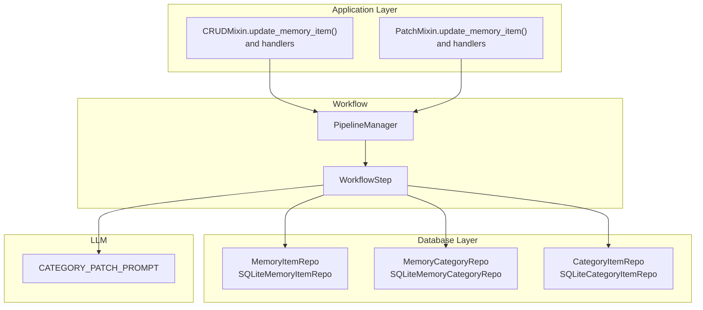
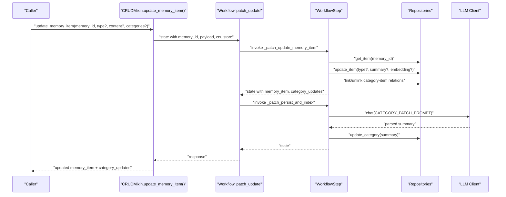
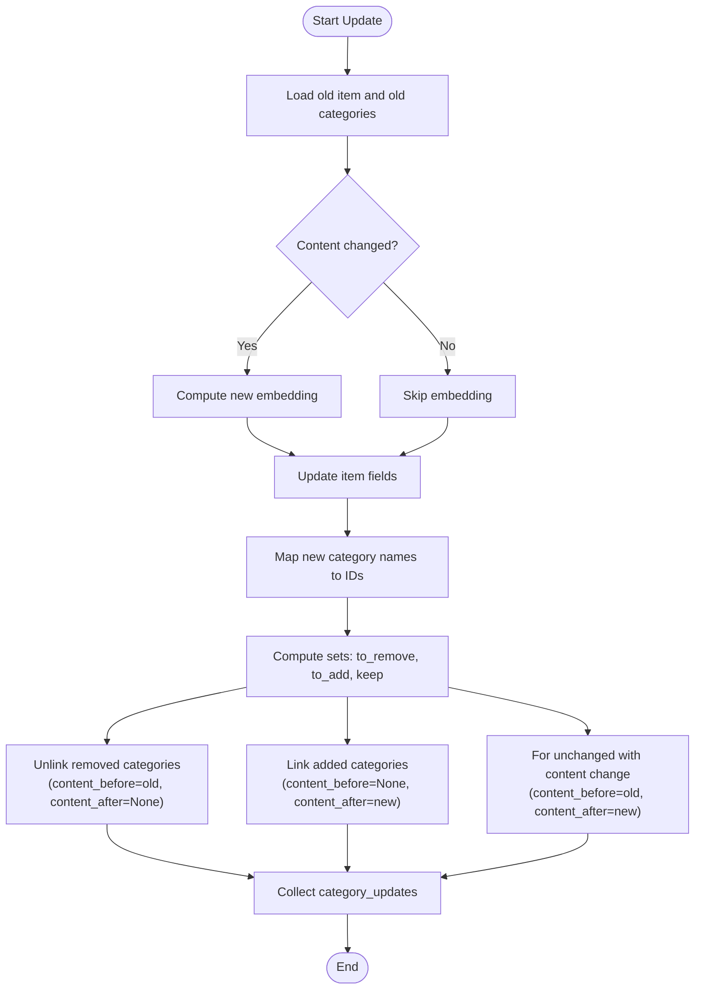
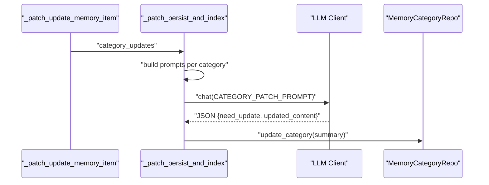
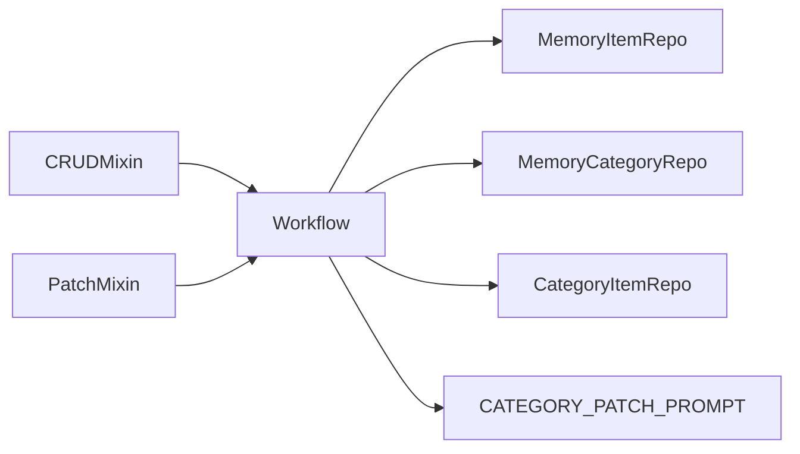

# Update Operations

<cite>
**Referenced Files in This Document**
- [crud.py](file://src/memu/app/crud.py)
- [patch.py](file://src/memu/app/patch.py)
- [models.py](file://src/memu/database/models.py)
- [memory_item_repo.py](file://src/memu/database/sqlite/repositories/memory_item_repo.py)
- [memory_category_repo.py](file://src/memu/database/sqlite/repositories/memory_category_repo.py)
- [category_item_repo.py](file://src/memu/database/sqlite/repositories/category_item_repo.py)
- [category.py](file://src/memu/prompts/category_patch/category.py)
- [pipeline.py](file://src/memu/workflow/pipeline.py)
- [step.py](file://src/memu/workflow/step.py)
</cite>

## Table of Contents
1. [Introduction](#introduction)
2. [Project Structure](#project-structure)
3. [Core Components](#core-components)
4. [Architecture Overview](#architecture-overview)
5. [Detailed Component Analysis](#detailed-component-analysis)
6. [Dependency Analysis](#dependency-analysis)
7. [Performance Considerations](#performance-considerations)
8. [Troubleshooting Guide](#troubleshooting-guide)
9. [Conclusion](#conclusion)

## Introduction
This document explains update operations for modifying existing memory items, focusing on the update_memory_item() method. It covers:
- Partial updates: updating only type, content, or categories
- Validation requirements: ensuring at least one field is provided and validating memory type
- Category relationship management: adding/removing categories and tracking content-before/content-after
- Content embedding updates: when content changes, embeddings are recomputed
- Category summary update mechanism: automatic LLM-driven updates to category summaries
- Practical examples: content updates, type changes, category reassignment, and mixed field updates
- Conflict awareness: potential conflicts with automated memory processing

## Project Structure
The update operation is implemented in the application layer and orchestrates database and LLM interactions through a workflow pipeline.

**Diagram sources**
- [crud.py](file://src/memu/app/crud.py#L315-L354)
- [patch.py](file://src/memu/app/patch.py#L73-L112)
- [pipeline.py](file://src/memu/workflow/pipeline.py#L21-L45)
- [step.py](file://src/memu/workflow/step.py#L16-L47)
- [memory_item_repo.py](file://src/memu/database/sqlite/repositories/memory_item_repo.py#L388-L459)
- [memory_category_repo.py](file://src/memu/database/sqlite/repositories/memory_category_repo.py#L196-L253)
- [category_item_repo.py](file://src/memu/database/sqlite/repositories/category_item_repo.py#L84-L162)
- [category.py](file://src/memu/prompts/category_patch/category.py#L1-L46)

**Section sources**
- [crud.py](file://src/memu/app/crud.py#L315-L354)
- [patch.py](file://src/memu/app/patch.py#L73-L112)
- [pipeline.py](file://src/memu/workflow/pipeline.py#L21-L45)
- [step.py](file://src/memu/workflow/step.py#L16-L47)

## Core Components
- CRUDMixin.update_memory_item(): Validates inputs, prepares workflow state, and runs the "patch_update" pipeline.
- PatchMixin.update_memory_item(): Alternative implementation with similar validation and workflow orchestration.
- _patch_update_memory_item(): Core update handler that:
  - Loads the existing item and old content
  - Optionally computes new embedding when content changes
  - Updates item fields (type, summary, embedding)
  - Manages category membership changes (add/remove) and builds category_updates
- Category summary updater: _patch_category_summaries() queries LLM to update category summaries based on content-before/content-after pairs.

Key validations:
- At least one of type, content, or categories must be provided
- Memory type must be one of the allowed literals

**Section sources**
- [crud.py](file://src/memu/app/crud.py#L315-L354)
- [crud.py](file://src/memu/app/crud.py#L530-L579)
- [crud.py](file://src/memu/app/crud.py#L638-L713)
- [models.py](file://src/memu/database/models.py#L12-L12)

## Architecture Overview
The update operation follows a three-step workflow:
1. Patch: update item and manage category membership; collect category_updates
2. Persist/Index: optionally update category summaries via LLM
3. Emit: build response with updated item and affected categories

**Diagram sources**
- [crud.py](file://src/memu/app/crud.py#L315-L354)
- [crud.py](file://src/memu/app/crud.py#L422-L451)
- [crud.py](file://src/memu/app/crud.py#L530-L579)
- [crud.py](file://src/memu/app/crud.py#L601-L623)
- [crud.py](file://src/memu/app/crud.py#L638-L713)
- [memory_item_repo.py](file://src/memu/database/sqlite/repositories/memory_item_repo.py#L388-L459)
- [memory_category_repo.py](file://src/memu/database/sqlite/repositories/memory_category_repo.py#L196-L253)
- [category_item_repo.py](file://src/memu/database/sqlite/repositories/category_item_repo.py#L84-L162)
- [category.py](file://src/memu/prompts/category_patch/category.py#L1-L46)

## Detailed Component Analysis

### update_memory_item() Method
Behavior:
- Validates that at least one of type, content, or categories is provided
- Validates memory type against allowed literals
- Prepares workflow state with memory_id, payload, context, store, and user scope
- Executes the "patch_update" pipeline and returns the response

Partial update semantics:
- If type is provided, update item type
- If content is provided, compute embedding and update summary and embedding
- If categories is provided, map names to IDs and reconcile category memberships

Category relationship management:
- Computes old/new category sets and determines adds/removes
- Builds category_updates entries with (content_before, content_after) tuples
- For unchanged categories with content change, records (old, new) pair

Content embedding updates:
- When content changes, a new embedding is computed and stored
- When content remains unchanged, embedding remains as-is

Category summary update mechanism:
- For each category affected, constructs a prompt with content_before/content_after
- Queries LLM to decide whether to update and what the new summary should be
- Persists updated summaries when needed

Potential conflicts with automated memory processing:
- Category summary updates occur asynchronously via LLM; if automated processors rely on category summaries immediately after update, a small delay may be observed until summaries are refreshed

**Section sources**
- [crud.py](file://src/memu/app/crud.py#L315-L354)
- [crud.py](file://src/memu/app/crud.py#L530-L579)
- [crud.py](file://src/memu/app/crud.py#L638-L713)
- [models.py](file://src/memu/database/models.py#L12-L12)

### Parameter Validation
- Required fields: At least one of type, content, or categories must be provided; otherwise raises a validation error
- Memory type validation: If provided, type must match one of the allowed literals; otherwise raises a validation error

**Section sources**
- [crud.py](file://src/memu/app/crud.py#L324-L329)

### Category Relationship Management
- Old categories: Retrieved from category-item relations
- New categories: Mapped from provided names to category IDs
- Changes:
  - Removed categories: Unlink relations; include (old_content, None) in category_updates
  - Added categories: Link relations; include (None, new_content) in category_updates
  - Unchanged categories with content change: Include (old_content, new_content) in category_updates

**Diagram sources**
- [crud.py](file://src/memu/app/crud.py#L530-L579)
- [category_item_repo.py](file://src/memu/database/sqlite/repositories/category_item_repo.py#L84-L162)

**Section sources**
- [crud.py](file://src/memu/app/crud.py#L530-L579)
- [category_item_repo.py](file://src/memu/database/sqlite/repositories/category_item_repo.py#L84-L162)

### Content Embedding Updates
- Trigger: Content change
- Action: Compute embedding for new content and update item embedding
- Persistence: Stored in the memory item repository

**Section sources**
- [crud.py](file://src/memu/app/crud.py#L546-L558)
- [memory_item_repo.py](file://src/memu/database/sqlite/repositories/memory_item_repo.py#L388-L459)

### Category Summary Update Mechanism
- Trigger: Non-empty category_updates
- Prompt construction: Uses CATEGORY_PATCH_PROMPT with category name, original content, and update content
- Decision: LLM responds with JSON indicating need_update and updated_content
- Apply: Update category summary when needed

**Diagram sources**
- [crud.py](file://src/memu/app/crud.py#L601-L623)
- [crud.py](file://src/memu/app/crud.py#L638-L713)
- [category.py](file://src/memu/prompts/category_patch/category.py#L1-L46)
- [memory_category_repo.py](file://src/memu/database/sqlite/repositories/memory_category_repo.py#L196-L253)

**Section sources**
- [crud.py](file://src/memu/app/crud.py#L638-L713)
- [category.py](file://src/memu/prompts/category_patch/category.py#L1-L46)
- [memory_category_repo.py](file://src/memu/database/sqlite/repositories/memory_category_repo.py#L196-L253)

### Practical Examples

Example 1: Content update only
- Update an item’s summary and recompute embedding
- No category changes
- Category summary update occurs only if the category’s content_before/content_after differ

Example 2: Type change only
- Update memory type while keeping content and categories
- No embedding change
- No category membership changes

Example 3: Category reassignment
- Change categories from A,B to B,C
- Links removed for A, links added for C
- Category summaries updated for A and C accordingly

Example 4: Mixed field updates
- Update content, type, and categories simultaneously
- Recompute embedding, update type and summary
- Reconcile category membership and update category summaries

Note: These examples describe expected behavior based on the documented logic. They do not reproduce code content.

**Section sources**
- [crud.py](file://src/memu/app/crud.py#L530-L579)
- [crud.py](file://src/memu/app/crud.py#L638-L713)

## Dependency Analysis
- CRUDMixin and PatchMixin depend on:
  - Workflow pipeline for orchestration
  - Database repositories for persistence
  - LLM client for category summary updates
- Repositories:
  - MemoryItemRepo: update_item, get_item, delete_item
  - MemoryCategoryRepo: update_category
  - CategoryItemRepo: link_item_category, unlink_item_category, get_item_categories
- Prompts:
  - CATEGORY_PATCH_PROMPT defines the LLM prompt for category summaries

**Diagram sources**
- [crud.py](file://src/memu/app/crud.py#L315-L354)
- [patch.py](file://src/memu/app/patch.py#L73-L112)
- [memory_item_repo.py](file://src/memu/database/sqlite/repositories/memory_item_repo.py#L388-L459)
- [memory_category_repo.py](file://src/memu/database/sqlite/repositories/memory_category_repo.py#L196-L253)
- [category_item_repo.py](file://src/memu/database/sqlite/repositories/category_item_repo.py#L84-L162)
- [category.py](file://src/memu/prompts/category_patch/category.py#L1-L46)

**Section sources**
- [crud.py](file://src/memu/app/crud.py#L315-L354)
- [patch.py](file://src/memu/app/patch.py#L73-L112)
- [memory_item_repo.py](file://src/memu/database/sqlite/repositories/memory_item_repo.py#L388-L459)
- [memory_category_repo.py](file://src/memu/database/sqlite/repositories/memory_category_repo.py#L196-L253)
- [category_item_repo.py](file://src/memu/database/sqlite/repositories/category_item_repo.py#L84-L162)
- [category.py](file://src/memu/prompts/category_patch/category.py#L1-L46)

## Performance Considerations
- Embedding computation cost: Triggered only when content changes; avoid unnecessary updates to reduce latency
- Category reconciliation: Set operations compute differences; keep category lists concise
- LLM calls: Category summary updates are batched and executed concurrently; consider rate limits and cost
- Database writes: Updates and category link/unlink are performed per change; batching via transactions is handled internally by repositories

## Troubleshooting Guide
Common issues and resolutions:
- Missing required fields: Ensure at least one of type, content, or categories is provided
- Invalid memory type: Confirm type matches allowed literals
- Item not found: Verify memory_id exists before calling update
- Category mapping errors: Ensure category names exist and are mapped correctly
- LLM parsing failures: CATEGORY_PATCH_PROMPT expects specific JSON fields; ensure responses conform to the expected schema

**Section sources**
- [crud.py](file://src/memu/app/crud.py#L324-L329)
- [crud.py](file://src/memu/app/crud.py#L531-L541)
- [crud.py](file://src/memu/app/crud.py#L638-L713)

## Conclusion
The update_memory_item() method supports robust, partial updates to memory items with strong validation and careful category relationship management. It integrates embedding updates and category summary maintenance through an LLM-driven process. By following the documented validation rules and understanding the category reconciliation and summary update mechanisms, developers can reliably modify memory items while maintaining data consistency and meaningful category summaries.