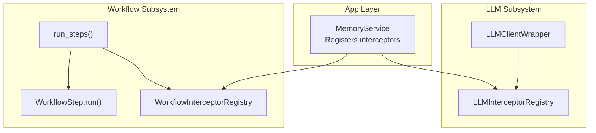
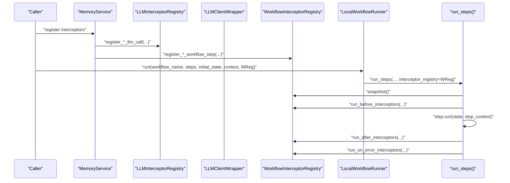
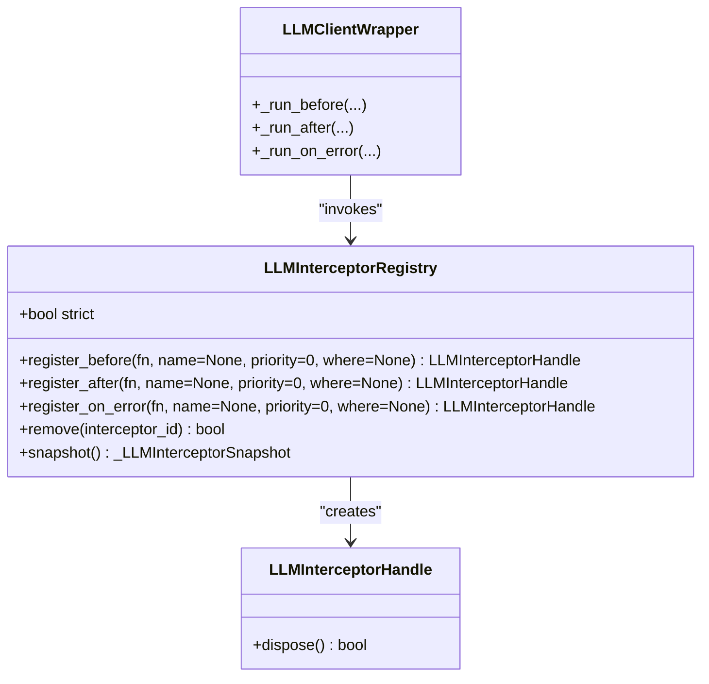
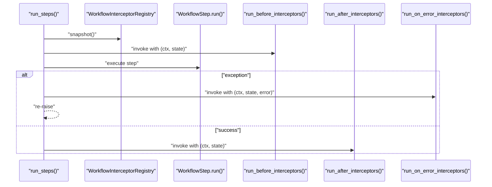
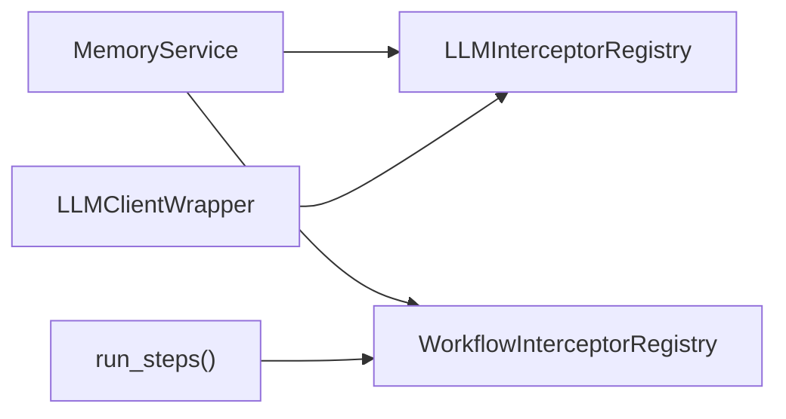

# Interceptor System

<cite>
**Referenced Files in This Document**
- [interceptor.py](file://src/memu/workflow/interceptor.py)
- [step.py](file://src/memu/workflow/step.py)
- [runner.py](file://src/memu/workflow/runner.py)
- [wrapper.py](file://src/memu/llm/wrapper.py)
- [service.py](file://src/memu/app/service.py)
</cite>

## Table of Contents
1. [Introduction](#introduction)
2. [Project Structure](#project-structure)
3. [Core Components](#core-components)
4. [Architecture Overview](#architecture-overview)
5. [Detailed Component Analysis](#detailed-component-analysis)
6. [Dependency Analysis](#dependency-analysis)
7. [Performance Considerations](#performance-considerations)
8. [Troubleshooting Guide](#troubleshooting-guide)
9. [Conclusion](#conclusion)

## Introduction
This document describes the interceptor system for LLM and workflow interception in the project. It covers the APIs for registering interceptors, their execution semantics, priority and filtering mechanisms, and practical examples for logging, rate limiting, custom authentication, and workflow monitoring. It also explains how interceptors relate to observability, error handling, and performance monitoring.

## Project Structure
The interceptor system spans two subsystems:
- LLM interceptor system: centralized in the LLM wrapper module with filtering, priority, and snapshot-based invocation.
- Workflow interceptor system: integrated into the workflow engine with per-step before/after/on-error hooks executed in registration order.

**Diagram sources**
- [service.py](file://src/memu/app/service.py#L227-L295)
- [wrapper.py](file://src/memu/llm/wrapper.py#L128-L224)
- [interceptor.py](file://src/memu/workflow/interceptor.py#L56-L166)
- [step.py](file://src/memu/workflow/step.py#L50-L102)

**Section sources**
- [service.py](file://src/memu/app/service.py#L227-L295)
- [wrapper.py](file://src/memu/llm/wrapper.py#L128-L224)
- [interceptor.py](file://src/memu/workflow/interceptor.py#L56-L166)
- [step.py](file://src/memu/workflow/step.py#L50-L102)

## Core Components
This section documents the interceptor registration APIs and their parameters, callback signatures, and execution order.

- LLM interceptors (registered via MemoryService):
  - intercept_before_llm_call(fn, name=None, priority=0, where=None) → LLMInterceptorHandle
  - intercept_after_llm_call(fn, name=None, priority=0, where=None) → LLMInterceptorHandle
  - intercept_on_error_llm_call(fn, name=None, priority=0, where=None) → LLMInterceptorHandle
  - Callback signature: fn(LLMCallContext, request_view, ...)
  - Execution order: before → after (reverse) → on_error (reverse), with filtering and priority applied.

- Workflow interceptors (registered via MemoryService):
  - intercept_before_workflow_step(fn, name=None) → WorkflowInterceptorHandle
  - intercept_after_workflow_step(fn, name=None) → WorkflowInterceptorHandle
  - intercept_on_error_workflow_step(fn, name=None) → WorkflowInterceptorHandle
  - Callback signature: fn(WorkflowStepContext, state) for before/after; fn(WorkflowStepContext, state, error) for on_error
  - Execution order: before → step.run() → after (reverse) → on_error (reverse) in registration order.

Key differences:
- LLM interceptors support priority and filtering (where), and are invoked around LLM calls.
- Workflow interceptors are invoked around each workflow step and are executed in registration order without priority or filtering.

**Section sources**
- [service.py](file://src/memu/app/service.py#L227-L295)
- [wrapper.py](file://src/memu/llm/wrapper.py#L141-L169)
- [interceptor.py](file://src/memu/workflow/interceptor.py#L78-L115)

## Architecture Overview
The interceptor system integrates with the LLM client wrapper and the workflow runner. MemoryService exposes convenience methods to register interceptors on both LLM calls and workflow steps. The LLM wrapper manages interceptor snapshots and invocation order, while the workflow engine constructs step contexts and invokes interceptors around each step.

**Diagram sources**
- [service.py](file://src/memu/app/service.py#L227-L295)
- [runner.py](file://src/memu/workflow/runner.py#L28-L39)
- [step.py](file://src/memu/workflow/step.py#L50-L102)
- [interceptor.py](file://src/memu/workflow/interceptor.py#L168-L203)
- [wrapper.py](file://src/memu/llm/wrapper.py#L450-L504)

## Detailed Component Analysis

### LLM Interceptor System
- Registry and invocation:
  - LLMInterceptorRegistry maintains three queues: before, after, on_error.
  - Interceptors are stored with priority and insertion order, then sorted by (priority, order).
  - Invocation respects status ("success"/"error") and filters.
- Filtering:
  - where accepts a mapping, LLMCallFilter, or callable.
  - _should_run_interceptor evaluates filters and handles exceptions defensively.
- Snapshot and strict mode:
  - snapshot() captures current interceptor sets for consistent invocation during a call.
  - strict controls whether interceptor exceptions propagate or are logged.

**Diagram sources**
- [wrapper.py](file://src/memu/llm/wrapper.py#L128-L224)
- [wrapper.py](file://src/memu/llm/wrapper.py#L450-L504)
- [wrapper.py](file://src/memu/llm/wrapper.py#L115-L126)

**Section sources**
- [wrapper.py](file://src/memu/llm/wrapper.py#L128-L224)
- [wrapper.py](file://src/memu/llm/wrapper.py#L450-L504)
- [wrapper.py](file://src/memu/llm/wrapper.py#L733-L757)

### Workflow Interceptor System
- Registry and invocation:
  - WorkflowInterceptorRegistry stores before/after/on_error interceptors in registration order.
  - run_before_interceptors iterates forward; run_after_interceptors and run_on_error_interceptors iterate backward.
  - strict controls exception propagation vs. logging.
- Step integration:
  - run_steps builds WorkflowStepContext and invokes interceptors around each step.
  - Missing required state keys are validated before invoking interceptors.

**Diagram sources**
- [step.py](file://src/memu/workflow/step.py#L50-L102)
- [interceptor.py](file://src/memu/workflow/interceptor.py#L168-L203)

**Section sources**
- [interceptor.py](file://src/memu/workflow/interceptor.py#L56-L166)
- [interceptor.py](file://src/memu/workflow/interceptor.py#L168-L203)
- [step.py](file://src/memu/workflow/step.py#L50-L102)

### API Reference and Execution Semantics

- LLM interceptor registration
  - intercept_before_llm_call(fn, name=None, priority=0, where=None)
  - intercept_after_llm_call(fn, name=None, priority=0, where=None)
  - intercept_on_error_llm_call(fn, name=None, priority=0, where=None)
  - Parameters:
    - fn: callable; signature depends on hook type (see below)
    - name: optional string identifier
    - priority: integer sort key (lower executes earlier among same priority)
    - where: filter mapping, LLMCallFilter, or callable predicate
  - Callback signatures:
    - before/after: fn(LLMCallContext, request_view, ...) where ... includes response_view and usage on success
    - on_error: fn(LLMCallContext, request_view, error, usage)
  - Execution order:
    - before: ordered by (priority, insertion_order)
    - after/on_error: reverse order of (priority, insertion_order)
    - filtered by where; failures in filter are logged and ignored

- Workflow interceptor registration
  - intercept_before_workflow_step(fn, name=None)
  - intercept_after_workflow_step(fn, name=None)
  - intercept_on_error_workflow_step(fn, name=None)
  - Parameters:
    - fn: callable
    - name: optional string identifier
  - Callback signatures:
    - before/after: fn(WorkflowStepContext, WorkflowState)
    - on_error: fn(WorkflowStepContext, WorkflowState, Exception)
  - Execution order:
    - before → step.run() → after (reverse) → on_error (reverse), in registration order

- Disposal
  - Both LLMInterceptorHandle and WorkflowInterceptorHandle support dispose() to remove interceptors by ID.

**Section sources**
- [service.py](file://src/memu/app/service.py#L227-L295)
- [wrapper.py](file://src/memu/llm/wrapper.py#L141-L169)
- [interceptor.py](file://src/memu/workflow/interceptor.py#L78-L115)

### Practical Examples

- Logging interceptor
  - LLM: capture request/response metadata and usage; log before/after/on_error.
  - Workflow: log step context and state transitions.

- Rate limiting
  - LLM: enforce per-profile or per-operation limits in before hook; block or delay calls.
  - Workflow: gate step execution based on external quotas.

- Custom authentication
  - LLM: inject auth headers or tokens in request_view; validate credentials.
  - Workflow: validate step context or state before execution.

- Workflow monitoring
  - Record step timings, state diffs, and outcomes; emit metrics and traces.

Note: These examples describe conceptual usage patterns. Implementations should adhere to the documented callback signatures and execution semantics.

[No sources needed since this section provides conceptual examples]

## Dependency Analysis
- MemoryService depends on both registries to expose user-friendly registration methods.
- LLMClientWrapper depends on LLMInterceptorRegistry for snapshotting and invocation.
- run_steps depends on WorkflowInterceptorRegistry for step-level interception.
- Interceptors are isolated from each other and from core logic; they receive contextual data and can modify state only through side effects.

**Diagram sources**
- [service.py](file://src/memu/app/service.py#L227-L295)
- [wrapper.py](file://src/memu/llm/wrapper.py#L128-L224)
- [step.py](file://src/memu/workflow/step.py#L50-L102)

**Section sources**
- [service.py](file://src/memu/app/service.py#L227-L295)
- [wrapper.py](file://src/memu/llm/wrapper.py#L128-L224)
- [step.py](file://src/memu/workflow/step.py#L50-L102)

## Performance Considerations
- LLM interceptors:
  - Priority sorting adds O(n log n) overhead per registration; keep the number of active interceptors reasonable.
  - Filter evaluation occurs per call; avoid expensive computations inside where predicates.
  - Strict mode disables exception short-circuiting; use only when necessary.
- Workflow interceptors:
  - Execution order is linear in the number of registered interceptors; minimize heavy work in interceptors.
  - Snapshotting avoids concurrent modifications during invocation; still keep interceptor lists small.

[No sources needed since this section provides general guidance]

## Troubleshooting Guide
- Interceptor exceptions:
  - In strict mode, exceptions propagate; otherwise they are logged and ignored.
  - Verify strict property on registries to control behavior.
- Filter failures:
  - Where predicates are evaluated defensively; failures are logged and the interceptor is skipped.
  - Ensure where predicates handle None values gracefully.
- Registration order:
  - Workflow interceptors execute in registration order; confirm order by inspection of registration sequence.
- Missing state keys:
  - run_steps validates required keys before invoking interceptors; fix step requirements or initial state.

**Section sources**
- [interceptor.py](file://src/memu/workflow/interceptor.py#L210-L219)
- [wrapper.py](file://src/memu/llm/wrapper.py#L760-L772)
- [wrapper.py](file://src/memu/llm/wrapper.py#L733-L757)
- [step.py](file://src/memu/workflow/step.py#L69-L72)

## Conclusion
The interceptor system provides a flexible mechanism to observe and control both LLM calls and workflow steps. LLM interceptors offer fine-grained control via priority and filtering, while workflow interceptors enable straightforward step-level instrumentation. By combining interceptors with observability tooling, teams can implement robust logging, rate limiting, authentication, and monitoring strategies.