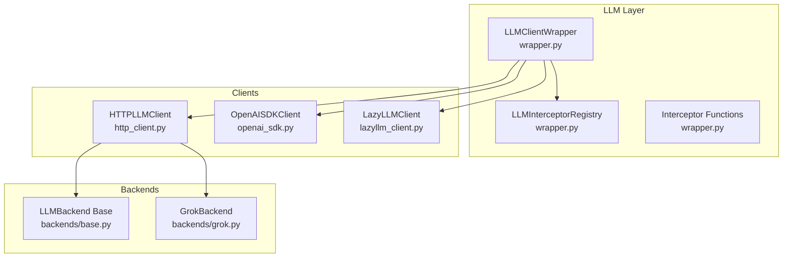
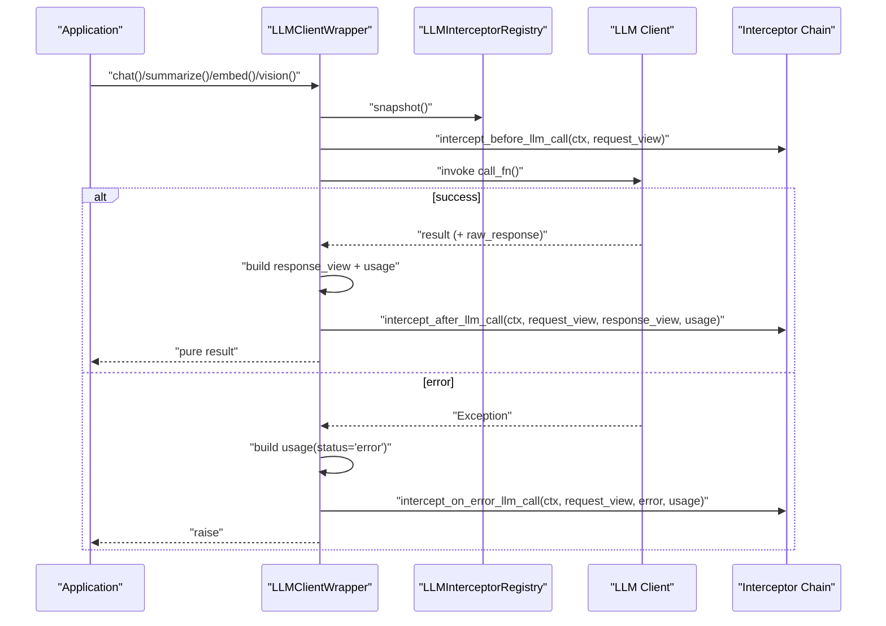
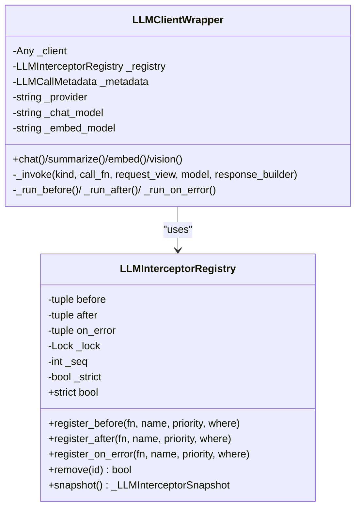
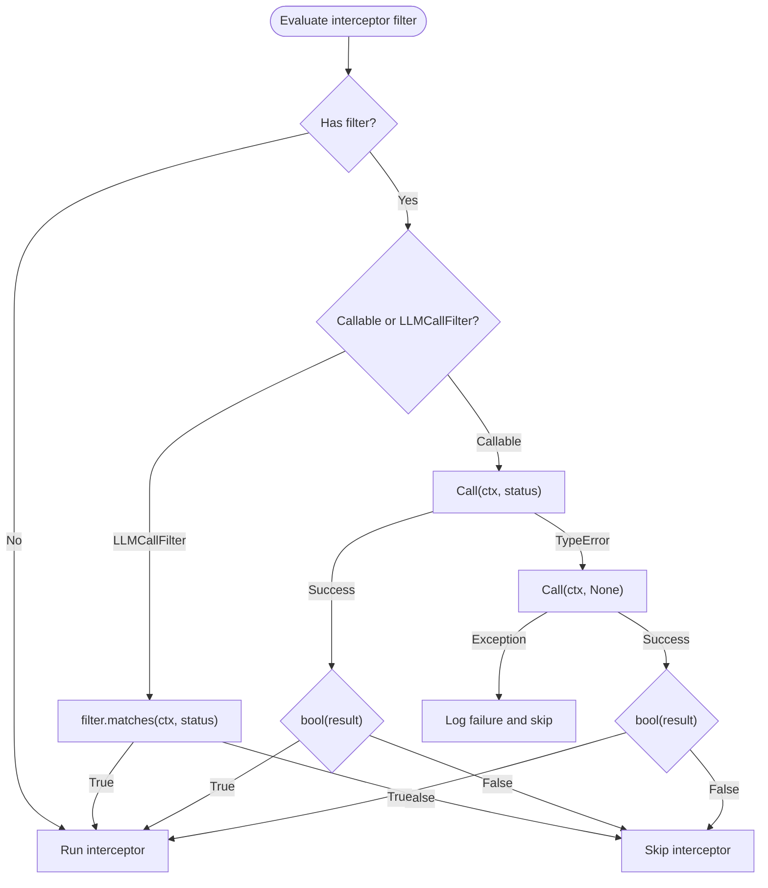
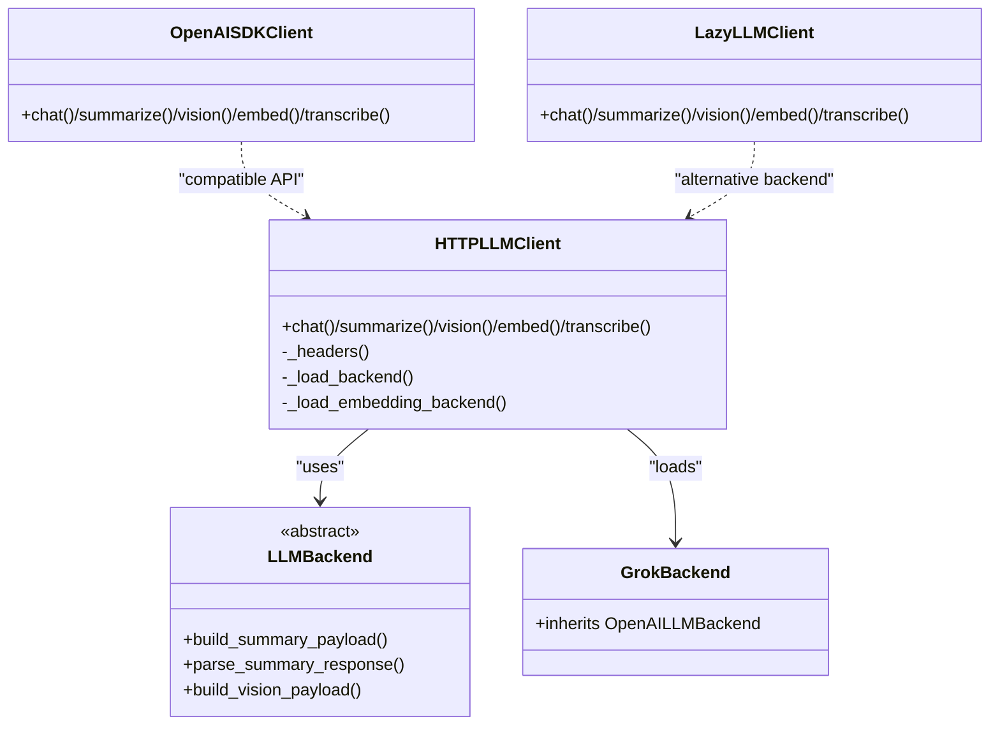
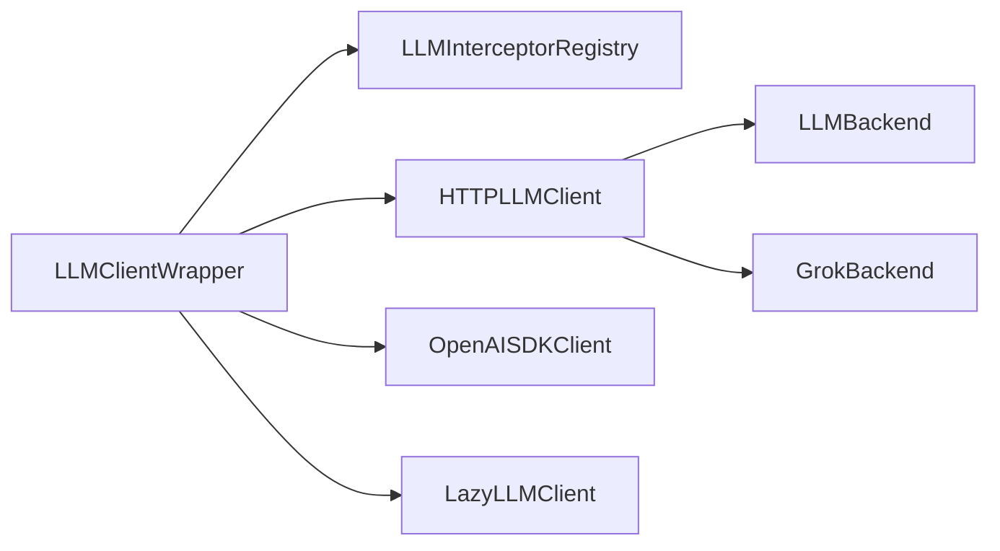

# LLM Interceptors

<cite>
**Referenced Files in This Document**
- [wrapper.py](file://src/memu/llm/wrapper.py)
- [http_client.py](file://src/memu/llm/http_client.py)
- [openai_sdk.py](file://src/memu/llm/openai_sdk.py)
- [lazyllm_client.py](file://src/memu/llm/lazyllm_client.py)
- [base.py](file://src/memu/llm/backends/base.py)
- [grok.py](file://src/memu/llm/backends/grok.py)
- [settings.py](file://src/memu/app/settings.py)
- [test_grok_provider.py](file://tests/llm/test_grok_provider.py)
- [example_5_with_lazyllm_client.py](file://examples/example_5_with_lazyllm_client.py)
</cite>

## Table of Contents
1. [Introduction](#introduction)
2. [Project Structure](#project-structure)
3. [Core Components](#core-components)
4. [Architecture Overview](#architecture-overview)
5. [Detailed Component Analysis](#detailed-component-analysis)
6. [Dependency Analysis](#dependency-analysis)
7. [Performance Considerations](#performance-considerations)
8. [Troubleshooting Guide](#troubleshooting-guide)
9. [Conclusion](#conclusion)

## Introduction
This document explains the LLM interceptor system for provider-level interception and transformation. It covers the three interceptor hooks—intercept_before_llm_call(), intercept_after_llm_call(), and intercept_on_error_llm_call()—along with registration patterns, callback signatures, parameter handling, execution pipeline, priority and conditional execution, and practical examples. It also documents the relationship between interceptors and observability, monitoring, and debugging, as well as error handling, retry logic, and fallback mechanisms.

## Project Structure
The LLM interceptor system centers around a dedicated wrapper that instruments LLM client calls, exposing a registry and lifecycle hooks for before/after/error phases. Supporting clients (HTTP, OpenAI SDK, LazyLLM) are integrated behind a unified interface that captures call context, request/response views, and usage metrics.

**Diagram sources**
- [wrapper.py](file://src/memu/llm/wrapper.py#L128-L224)
- [http_client.py](file://src/memu/llm/http_client.py#L80-L118)
- [openai_sdk.py](file://src/memu/llm/openai_sdk.py#L20-L38)
- [lazyllm_client.py](file://src/memu/llm/lazyllm_client.py#L9-L34)
- [base.py](file://src/memu/llm/backends/base.py#L6-L31)
- [grok.py](file://src/memu/llm/backends/grok.py#L6-L12)

**Section sources**
- [wrapper.py](file://src/memu/llm/wrapper.py#L128-L224)
- [http_client.py](file://src/memu/llm/http_client.py#L80-L118)
- [openai_sdk.py](file://src/memu/llm/openai_sdk.py#L20-L38)
- [lazyllm_client.py](file://src/memu/llm/lazyllm_client.py#L9-L34)
- [base.py](file://src/memu/llm/backends/base.py#L6-L31)
- [grok.py](file://src/memu/llm/backends/grok.py#L6-L12)

## Core Components
- LLMInterceptorRegistry: Manages interceptor registration and snapshots for before/after/on_error phases. Supports priority ordering and optional filters.
- LLMClientWrapper: Wraps LLM clients and orchestrates the interceptor pipeline around each call. Builds call context, request/response views, and usage metrics.
- LLMCallFilter: Conditional filter supporting operations, step_ids, providers, models, and statuses.
- LLMCallContext, LLMRequestView, LLMResponseView, LLMUsage: Typed data carriers for observability and telemetry.
- Client backends: HTTPLLMClient, OpenAISDKClient, LazyLLMClient integrate with the wrapper uniformly.

Key interceptor lifecycle methods exposed by the wrapper:
- intercept_before_llm_call(ctx, request_view): Called before a call; can mutate or observe request.
- intercept_after_llm_call(ctx, request_view, response_view, usage): Called after successful completion; can observe and transform telemetry.
- intercept_on_error_llm_call(ctx, request_view, error, usage): Called on exceptions; supports recovery or fallback.

Registration APIs:
- register_before(fn, name=None, priority=0, where=None)
- register_after(fn, name=None, priority=0, where=None)
- register_on_error(fn, name=None, priority=0, where=None)

Callback signatures:
- Before: (LLMCallContext, LLMRequestView)
- After: (LLMCallContext, LLMRequestView, LLMResponseView, LLMUsage)
- On error: (LLMCallContext, LLMRequestView, Exception, LLMUsage)

Execution pipeline:
- Snapshot registry at call time.
- Filter interceptors by LLMCallFilter or predicate.
- Sort by priority/order.
- Invoke in normal order for before, reverse order for after/on_error.
- Strict mode controls whether exceptions are swallowed or re-raised.

**Section sources**
- [wrapper.py](file://src/memu/llm/wrapper.py#L128-L224)
- [wrapper.py](file://src/memu/llm/wrapper.py#L450-L504)
- [wrapper.py](file://src/memu/llm/wrapper.py#L733-L757)
- [wrapper.py](file://src/memu/llm/wrapper.py#L17-L68)

## Architecture Overview
The LLM interceptor architecture is layered:
- Clients implement provider-specific logic (HTTP, SDK, LazyLLM).
- LLMClientWrapper unifies invocation, builds context, and runs interceptors.
- Interceptors receive typed views and can conditionally execute based on filters.

**Diagram sources**
- [wrapper.py](file://src/memu/llm/wrapper.py#L387-L436)
- [wrapper.py](file://src/memu/llm/wrapper.py#L450-L504)

## Detailed Component Analysis

### LLMInterceptorRegistry and Lifecycle
- Registration stores interceptors with priority and insertion order, enabling deterministic sorting.
- Filters can be LLMCallFilter instances, callables, or mappings coerced into filters.
- Snapshots capture the registry state at call time to avoid dynamic changes mid-call.
- Safe invocation handles awaitable interceptors and strict mode behavior.

**Diagram sources**
- [wrapper.py](file://src/memu/llm/wrapper.py#L128-L224)
- [wrapper.py](file://src/memu/llm/wrapper.py#L226-L448)

**Section sources**
- [wrapper.py](file://src/memu/llm/wrapper.py#L128-L224)
- [wrapper.py](file://src/memu/llm/wrapper.py#L450-L504)
- [wrapper.py](file://src/memu/llm/wrapper.py#L760-L773)

### LLMCallFilter and Conditional Execution
- LLMCallFilter supports matching on operations, step_ids, providers, models, and statuses.
- _should_run_interceptor evaluates either a callable or LLMCallFilter against LLMCallContext and status.
- _coerce_filter converts mappings to LLMCallFilter, enabling concise registration.

**Diagram sources**
- [wrapper.py](file://src/memu/llm/wrapper.py#L706-L757)

**Section sources**
- [wrapper.py](file://src/memu/llm/wrapper.py#L62-L87)
- [wrapper.py](file://src/memu/llm/wrapper.py#L706-L757)

### Provider Backends and Client Integration
- HTTPLLMClient: Generic HTTP client for chat, vision, transcription, and embeddings; loads provider-specific backends and embedding backends.
- OpenAISDKClient: Uses the official AsyncOpenAI SDK for chat, vision, embeddings, and transcription.
- LazyLLMClient: Integrates with LazyLLM OnlineModule for LLM/VLM/Embedding/STT with configurable sources and models.
- Backends: LLMBackend base plus provider-specific implementations (e.g., GrokBackend inheriting OpenAI-compatible behavior).

**Diagram sources**
- [http_client.py](file://src/memu/llm/http_client.py#L80-L118)
- [openai_sdk.py](file://src/memu/llm/openai_sdk.py#L20-L38)
- [lazyllm_client.py](file://src/memu/llm/lazyllm_client.py#L9-L34)
- [base.py](file://src/memu/llm/backends/base.py#L6-L31)
- [grok.py](file://src/memu/llm/backends/grok.py#L6-L12)

**Section sources**
- [http_client.py](file://src/memu/llm/http_client.py#L80-L118)
- [openai_sdk.py](file://src/memu/llm/openai_sdk.py#L20-L38)
- [lazyllm_client.py](file://src/memu/llm/lazyllm_client.py#L9-L34)
- [base.py](file://src/memu/llm/backends/base.py#L6-L31)
- [grok.py](file://src/memu/llm/backends/grok.py#L6-L12)

### Practical Examples

#### Authentication Interceptor
- Purpose: Inject or validate credentials per call.
- Pattern: Use intercept_before_llm_call to enrich Authorization headers or validate tokens.
- Conditional execution: Filter by provider or model to limit scope.

#### Request/Response Transformation
- Purpose: Normalize payloads, inject system prompts, or sanitize responses.
- Pattern: Modify LLMRequestView in intercept_before_llm_call; enrich telemetry in intercept_after_llm_call.

#### Rate Limiting and Retry
- Purpose: Enforce quotas and handle transient failures.
- Pattern: Use intercept_on_error_llm_call to detect retryable errors and trigger backoff/retry; optionally short-circuit with cached responses.

#### Caching Strategies
- Purpose: Reduce latency and cost by serving cached completions.
- Pattern: In intercept_before_llm_call, compute cache key from LLMCallContext and LLMRequestView; if hit, return cached LLMResponseView and usage; otherwise proceed.

#### Custom Provider Integration
- Purpose: Support new providers without changing call sites.
- Pattern: Wrap provider client in a compatible interface and register interceptors for normalization, logging, and fallback.

#### Observability, Monitoring, and Debugging
- LLMCallContext carries profile, request_id, trace_id, operation, step_id, provider, model, and tags.
- LLMRequestView/LLMResponseView capture counts, sizes, hashes, and metadata.
- LLMUsage records tokens, latency, finish_reason, status, and token breakdowns.
- Interceptors can emit structured logs, metrics, traces, and audit events.

**Section sources**
- [wrapper.py](file://src/memu/llm/wrapper.py#L17-L68)
- [wrapper.py](file://src/memu/llm/wrapper.py#L653-L703)

## Dependency Analysis
- LLMClientWrapper depends on LLMInterceptorRegistry for lifecycle orchestration.
- Clients (HTTPLLMClient, OpenAISDKClient, LazyLLMClient) are interchangeable behind the wrapper.
- Backends define provider-specific payload/response handling; GrokBackend leverages OpenAI-compatible behavior.

**Diagram sources**
- [wrapper.py](file://src/memu/llm/wrapper.py#L226-L246)
- [http_client.py](file://src/memu/llm/http_client.py#L80-L118)
- [base.py](file://src/memu/llm/backends/base.py#L6-L31)
- [grok.py](file://src/memu/llm/backends/grok.py#L6-L12)

**Section sources**
- [wrapper.py](file://src/memu/llm/wrapper.py#L226-L246)
- [http_client.py](file://src/memu/llm/http_client.py#L80-L118)
- [base.py](file://src/memu/llm/backends/base.py#L6-L31)
- [grok.py](file://src/memu/llm/backends/grok.py#L6-L12)

## Performance Considerations
- Interceptor overhead: Keep interceptors lightweight; avoid heavy I/O in hot paths.
- Sorting cost: Priority-based sorting is O(n log n); minimize interceptor count or use filters to reduce invocation.
- Usage extraction: Best-effort parsing avoids blocking; wrap in try/except to prevent latency spikes.
- Batched embeddings: Use client-side batching to reduce round-trips; interceptors can still observe aggregated usage.

## Troubleshooting Guide
- Strict mode: Enable strict to surface interceptor errors immediately; otherwise, exceptions are logged and swallowed.
- Filter failures: If a filter throws, the interceptor is skipped; check filter predicates and normalization.
- Provider mismatch: Ensure provider identifiers align with backend loaders; verify base_url and api_key.
- Grok defaults: When provider is set to “grok”, defaults switch to Grok-compatible values; confirm configuration.

**Section sources**
- [wrapper.py](file://src/memu/llm/wrapper.py#L760-L773)
- [wrapper.py](file://src/memu/llm/wrapper.py#L733-L757)
- [settings.py](file://src/memu/app/settings.py#L128-L138)
- [test_grok_provider.py](file://tests/llm/test_grok_provider.py#L10-L16)

## Conclusion
The LLM interceptor system provides a robust, extensible mechanism for provider-level interception and transformation. By leveraging typed contexts, filters, and a deterministic pipeline, applications can implement authentication, transformation, rate limiting, caching, and observability while maintaining compatibility across multiple LLM clients and providers. Use strict mode judiciously, apply filters to scope interceptors, and instrument telemetry to monitor performance and reliability.