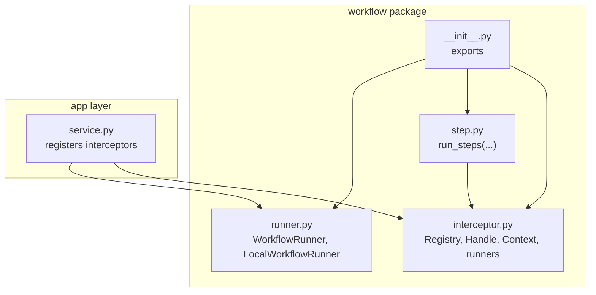
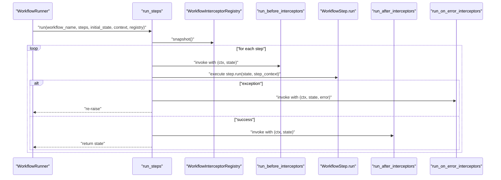
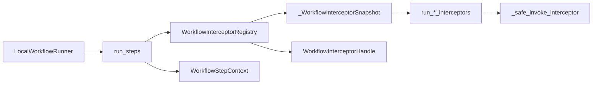

# Workflow Interceptors

<cite>
**Referenced Files in This Document**
- [interceptor.py](file://src/memu/workflow/interceptor.py)
- [step.py](file://src/memu/workflow/step.py)
- [runner.py](file://src/memu/workflow/runner.py)
- [__init__.py](file://src/memu/workflow/__init__.py)
- [service.py](file://src/memu/app/service.py)
- [architecture.md](file://docs/architecture.md)
</cite>

## Table of Contents
1. [Introduction](#introduction)
2. [Project Structure](#project-structure)
3. [Core Components](#core-components)
4. [Architecture Overview](#architecture-overview)
5. [Detailed Component Analysis](#detailed-component-analysis)
6. [Dependency Analysis](#dependency-analysis)
7. [Performance Considerations](#performance-considerations)
8. [Troubleshooting Guide](#troubleshooting-guide)
9. [Conclusion](#conclusion)

## Introduction
This document explains the workflow interceptor system for step-level interception and execution. It covers the WorkflowInterceptorRegistry and its methods for registering before-step, after-step, and on-error interceptors. It documents the WorkflowStepContext dataclass and the WorkflowInterceptorHandle used to manage interceptor lifecycle. Practical examples illustrate logging, metrics, audit trails, and error handling patterns. Thread safety, strict mode behavior, and execution order guarantees are explained, along with performance considerations and best practices for workflow monitoring.

## Project Structure
The workflow interceptor system lives under the workflow package and integrates with the step execution pipeline and runner. Public exports are available via the workflow package’s __init__.

**Diagram sources**
- [interceptor.py](file://src/memu/workflow/interceptor.py#L1-L219)
- [step.py](file://src/memu/workflow/step.py#L1-L102)
- [runner.py](file://src/memu/workflow/runner.py#L1-L82)
- [__init__.py](file://src/memu/workflow/__init__.py#L1-L30)
- [service.py](file://src/memu/app/service.py#L80-L279)

**Section sources**
- [__init__.py](file://src/memu/workflow/__init__.py#L1-L30)
- [architecture.md](file://docs/architecture.md#L64-L72)

## Core Components
- WorkflowInterceptorRegistry: central registry for step-level interceptors. Supports registration of before, after, and on-error interceptors. Provides snapshotting and thread-safe mutation.
- WorkflowInterceptorHandle: handle returned by registration to dispose/remove interceptors.
- WorkflowStepContext: immutable dataclass passed to interceptors with workflow_name, step_id, step_role, and step_context.
- Execution runners: run_before_interceptors, run_after_interceptors, run_on_error_interceptors orchestrate interceptor invocation with strict mode and safe invocation.

Key behaviors:
- Registration order determines execution order for before interceptors.
- After and on-error interceptors run in reverse order.
- Strict mode controls whether interceptor exceptions propagate or are logged.
- Thread safety is ensured via a lock during registry mutations.

**Section sources**
- [interceptor.py](file://src/memu/workflow/interceptor.py#L16-L219)

## Architecture Overview
The workflow engine executes steps sequentially. Between each step, the system invokes registered interceptors in a deterministic order. The runner delegates execution to run_steps, which builds a WorkflowStepContext and calls the appropriate interceptor sets.

**Diagram sources**
- [runner.py](file://src/memu/workflow/runner.py#L28-L39)
- [step.py](file://src/memu/workflow/step.py#L50-L102)
- [interceptor.py](file://src/memu/workflow/interceptor.py#L168-L219)

## Detailed Component Analysis

### WorkflowInterceptorRegistry
Responsibilities:
- Maintain ordered lists of before, after, and on-error interceptors.
- Provide thread-safe registration and removal.
- Snapshot current interceptor sets for a single execution.
- Expose strict mode flag.

Execution guarantees:
- Before interceptors run in registration order.
- After interceptors run in reverse registration order.
- On-error interceptors run in reverse registration order.
- Exceptions in interceptors are handled according to strict mode.

Thread safety:
- Uses a lock for all mutations (registration and removal).
- Snapshots capture immutable tuples for the duration of a single run.

Strict mode:
- When strict is True, interceptor exceptions propagate.
- When strict is False, exceptions are logged and execution continues.

**Section sources**
- [interceptor.py](file://src/memu/workflow/interceptor.py#L56-L165)

### WorkflowInterceptorHandle
Responsibilities:
- Wraps a registry and interceptor id.
- Provides a dispose method to remove the interceptor.
- Prevents double-disposal.

Lifecycle:
- Returned by register_before/register_after/register_on_error.
- Dispose returns True if removal occurred, False if already disposed.

**Section sources**
- [interceptor.py](file://src/memu/workflow/interceptor.py#L40-L54)

### WorkflowStepContext
Fields:
- workflow_name: name of the workflow.
- step_id: identifier of the current step.
- step_role: role of the current step.
- step_context: dict carrying contextual data (e.g., step_config, trace_id, tags).

Usage:
- Built in run_steps from the step and context, then passed to all interceptors.

**Section sources**
- [interceptor.py](file://src/memu/workflow/interceptor.py#L16-L24)
- [step.py](file://src/memu/workflow/step.py#L73-L84)

### Interceptor Execution Runners
- run_before_interceptors: iterates forward through the snapshot’s before interceptors.
- run_after_interceptors: iterates backward through the snapshot’s after interceptors.
- run_on_error_interceptors: iterates backward through the snapshot’s on_error interceptors.
- _safe_invoke_interceptor: wraps invocation to await coroutines and handle exceptions based on strict mode.

Ordering and reversal:
- After and on-error interceptors are reversed to provide intuitive exit semantics (last-in, first-out).

**Section sources**
- [interceptor.py](file://src/memu/workflow/interceptor.py#L168-L219)

### Integration with Workflow Runner and Step Execution
- LocalWorkflowRunner delegates to run_steps.
- run_steps builds WorkflowStepContext, snapshots the registry, and invokes interceptors around each step.
- On step failure, on-error interceptors are invoked before re-raising.

**Section sources**
- [runner.py](file://src/memu/workflow/runner.py#L28-L39)
- [step.py](file://src/memu/workflow/step.py#L50-L102)

### Practical Examples and Patterns
Note: The following are conceptual examples to illustrate usage. They are designed to help you implement similar patterns without reproducing code.

- Logging interceptor
  - Register a before-step interceptor to log step entry with workflow_name, step_id, and step_role.
  - Register an after-step interceptor to log successful completion and timing.
  - Register an on-error interceptor to log failures with error details.

- Metrics collection
  - Before-step: increment step entry counters and start timers.
  - After-step: record latency and success counters.
  - On-error: record error counters and include error types.

- Audit trail
  - Capture step_context (including trace_id and tags) in before-step.
  - Record outcome and timestamps in after-step.
  - Record error context in on-error.

- Error handling patterns
  - Use strict=False for robustness; allow cascading failures to be contained.
  - Use strict=True in controlled environments to surface issues immediately.
  - Ensure on-error interceptors are registered last (due to reverse order) to guarantee cleanup.

- Lifecycle management
  - Store the returned handle from registration.
  - Dispose handles when shutting down or removing specific monitoring.

- Thread safety and strict mode
  - Interceptors are invoked within a single-threaded execution context per workflow run.
  - Use strict mode to balance resilience and observability.

[No sources needed since this subsection provides conceptual guidance]

## Dependency Analysis
The workflow interceptor system depends on the step execution pipeline and runner. The registry is consumed by run_steps, which constructs the context and invokes the runners.

**Diagram sources**
- [interceptor.py](file://src/memu/workflow/interceptor.py#L56-L219)
- [step.py](file://src/memu/workflow/step.py#L50-L102)
- [runner.py](file://src/memu/workflow/runner.py#L28-L39)

**Section sources**
- [interceptor.py](file://src/memu/workflow/interceptor.py#L56-L165)
- [step.py](file://src/memu/workflow/step.py#L50-L102)
- [runner.py](file://src/memu/workflow/runner.py#L28-L39)

## Performance Considerations
- Interceptor overhead: Each interceptor adds a function call and potential async await. Keep interceptors efficient and avoid heavy I/O.
- Reverse iteration cost: After and on-error interceptors iterate in reverse; keep interceptor counts reasonable.
- Strict mode: Logging exceptions is cheaper than propagating, but still incurs overhead. Use strict mode judiciously.
- Snapshotting: Capturing a snapshot per run avoids concurrent mutation costs during execution.
- Concurrency: The registry uses a lock for mutations; avoid frequent dynamic registration during steady-state runs.

[No sources needed since this section provides general guidance]

## Troubleshooting Guide
- Interceptor not invoked
  - Verify registration via register_before/register_after/register_on_error and confirm snapshot is non-empty.
  - Ensure the registry is passed to run_steps via the runner.

- Exceptions in interceptors
  - With strict=False (default), exceptions are logged and ignored. Check logs for “Workflow interceptor failed” entries.
  - With strict=True, exceptions propagate and may abort the workflow.

- Disposing interceptors
  - Use the returned handle.dispose() to remove an interceptor. Dispose returns False if already disposed.

- Execution order confusion
  - Remember: before in registration order, after and on-error in reverse order.

- Context mismatch
  - Confirm step_context includes expected keys (e.g., step_id, step_config). These are populated in run_steps.

**Section sources**
- [interceptor.py](file://src/memu/workflow/interceptor.py#L40-L54)
- [interceptor.py](file://src/memu/workflow/interceptor.py#L168-L219)
- [step.py](file://src/memu/workflow/step.py#L73-L84)

## Conclusion
The workflow interceptor system provides a simple, deterministic, and extensible mechanism for step-level monitoring and control. By leveraging before, after, and on-error hooks, you can implement logging, metrics, auditing, and robust error handling. The registry ensures thread-safe management, and strict mode lets you tune reliability versus observability. Follow the recommended patterns and performance guidelines to maintain efficient and observable workflows.