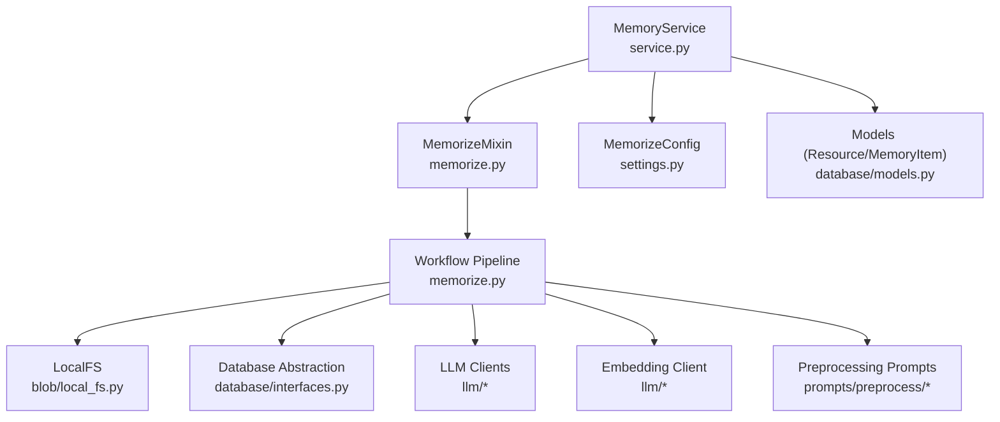
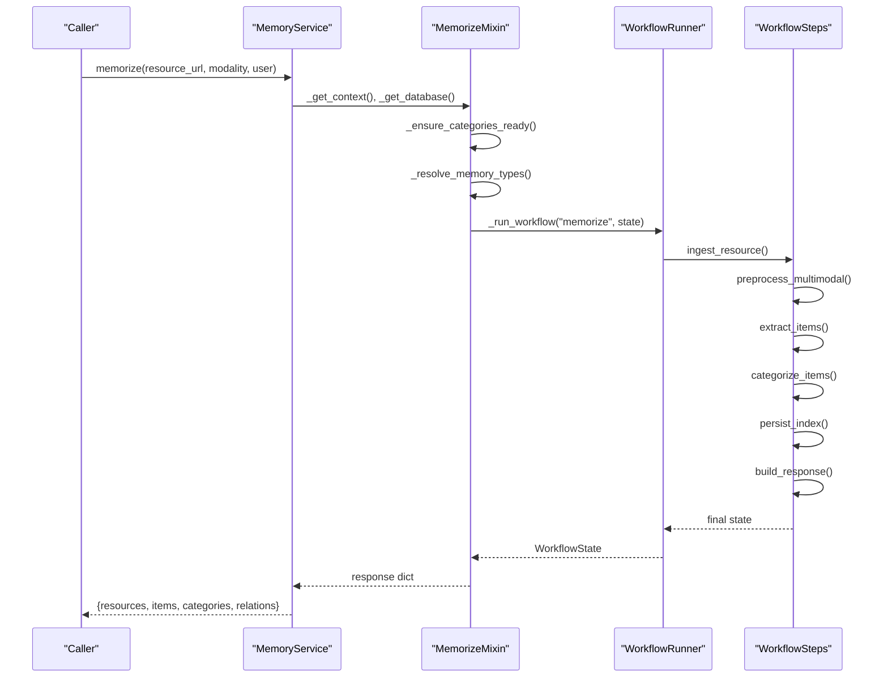
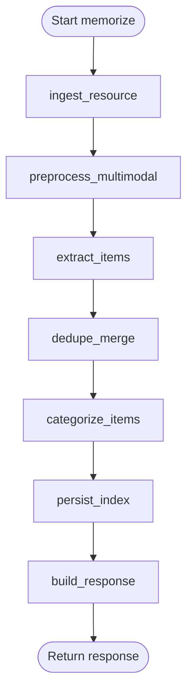
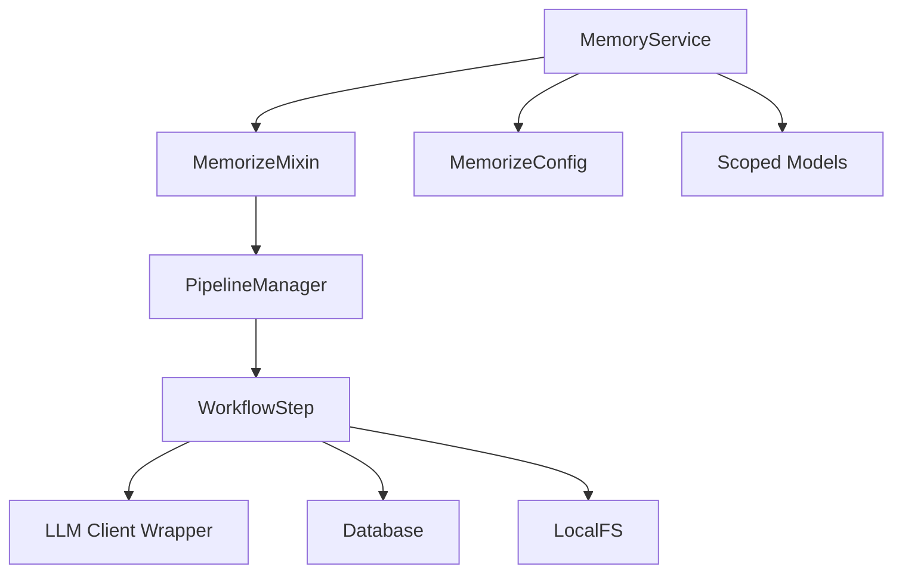

# Memorize Method

<cite>
**Referenced Files in This Document**
- [memorize.py](file://src/memu/app/memorize.py)
- [service.py](file://src/memu/app/service.py)
- [models.py](file://src/memu/database/models.py)
- [settings.py](file://src/memu/app/settings.py)
- [conversation.py](file://src/memu/prompts/preprocess/conversation.py)
- [document.py](file://src/memu/prompts/preprocess/document.py)
- [architecture.md](file://docs/architecture.md)
- [example_1_conversation_memory.py](file://examples/example_1_conversation_memory.py)
- [example_3_multimodal_memory.py](file://examples/example_3_multimodal_memory.py)
- [memorize.py](file://examples/proactive/memory/local/memorize.py)
</cite>

## Table of Contents
1. [Introduction](#introduction)
2. [Project Structure](#project-structure)
3. [Core Components](#core-components)
4. [Architecture Overview](#architecture-overview)
5. [Detailed Component Analysis](#detailed-component-analysis)
6. [Dependency Analysis](#dependency-analysis)
7. [Performance Considerations](#performance-considerations)
8. [Troubleshooting Guide](#troubleshooting-guide)
9. [Conclusion](#conclusion)
10. [Appendices](#appendices)

## Introduction
This document provides API documentation for the memorize() method, focusing on memory ingestion and extraction. It explains the method signature, parameter specifications, validation rules, return value structure, error handling, and the end-to-end memory extraction pipeline. Practical examples demonstrate ingestion from conversations, documents, and multimodal content. The document also covers preprocessing, categorization, performance considerations, batch processing patterns, and integration with external systems.

## Project Structure
The memorize() method is implemented in the MemoryService class and orchestrated through a workflow pipeline. Supporting components include configuration models, database models, preprocessing prompts, and example usage patterns.

**Diagram sources**
- [service.py](file://src/memu/app/service.py#L49-L96)
- [memorize.py](file://src/memu/app/memorize.py#L47-L166)
- [settings.py](file://src/memu/app/settings.py#L204-L243)
- [models.py](file://src/memu/database/models.py#L68-L106)

**Section sources**
- [service.py](file://src/memu/app/service.py#L49-L96)
- [memorize.py](file://src/memu/app/memorize.py#L47-L166)
- [settings.py](file://src/memu/app/settings.py#L204-L243)
- [models.py](file://src/memu/database/models.py#L68-L106)

## Core Components
- Method signature: memorize(resource_url: str, modality: str, user: dict[str, Any] | None = None) -> dict[str, Any]
- Purpose: Ingest a resource, preprocess it, extract structured memories, categorize them, persist embeddings, and return a consolidated response.
- Key parameters:
  - resource_url: str — URL or local path to the input resource.
  - modality: str — Input type (e.g., conversation, document, image, video, audio).
  - user: dict[str, Any] | None — Optional user scope payload validated against the configured user model.
- Return value: dict containing resources, items, categories, and relations.
- Error handling: Raises exceptions on invalid state transitions, missing keys, or workflow failures.

**Section sources**
- [memorize.py](file://src/memu/app/memorize.py#L65-L95)
- [service.py](file://src/memu/app/service.py#L49-L96)

## Architecture Overview
The memorize pipeline is a workflow composed of ordered steps with explicit state keys and capabilities.

**Diagram sources**
- [memorize.py](file://src/memu/app/memorize.py#L65-L95)
- [memorize.py](file://src/memu/app/memorize.py#L97-L166)
- [architecture.md](file://docs/architecture.md#L73-L85)

**Section sources**
- [memorize.py](file://src/memu/app/memorize.py#L65-L95)
- [memorize.py](file://src/memu/app/memorize.py#L97-L166)
- [architecture.md](file://docs/architecture.md#L73-L85)

## Detailed Component Analysis

### Method Signature and Parameters
- resource_url: str
  - Data type: string representing a URL or filesystem path.
  - Validation: Must be a non-empty string; the system resolves it via LocalFS fetch.
  - Acceptable values: Local file paths or remote-accessible URLs compatible with the blob provider.
- modality: str
  - Data type: string indicating the input modality.
  - Validation: Supported modalities include conversation, document, image, video, audio.
  - Acceptable values: One of the recognized modalities; preprocessing dispatch depends on this value.
- user: dict[str, Any] | None
  - Data type: dictionary validated against the configured user model.
  - Validation: If provided, must conform to the user scope schema; otherwise treated as None.
  - Acceptable values: Keys must not conflict with core record models; merged into scoped models.

Behavioral notes:
- The method initializes categories lazily if not ready.
- Memory types are resolved from configuration; defaults include profile, event, knowledge, behavior, skill, tool.

**Section sources**
- [memorize.py](file://src/memu/app/memorize.py#L65-L95)
- [memorize.py](file://src/memu/app/memorize.py#L77-L78)
- [memorize.py](file://src/memu/app/memorize.py#L74-L75)
- [settings.py](file://src/memu/app/settings.py#L204-L243)
- [models.py](file://src/memu/database/models.py#L12-L12)

### Return Value Structure
The response is a dictionary containing:
- resources: list of Resource records (without embeddings) with fields such as url, modality, local_path, caption.
- items: list of MemoryItem records (without embeddings) with fields such as memory_type, summary, embedding, extra metadata.
- categories: list of MemoryCategory records (without embeddings) with fields such as name, description, summary.
- relations: list of CategoryItem relations linking items to categories.

Edge cases:
- Single resource: returns a single resource object under the "resource" key.
- Multiple resources: returns a list under the "resources" key.

**Section sources**
- [memorize.py](file://src/memu/app/memorize.py#L299-L325)
- [models.py](file://src/memu/database/models.py#L68-L106)

### Error Handling Mechanisms
- Workflow failure: If the workflow does not produce a response, a runtime error is raised.
- Missing keys: WorkflowRunner enforces required state keys per step; missing keys cause a key error.
- Invalid memory type: During update operations, invalid memory types are rejected.
- LLM errors: LLM client wrappers capture usage metadata and propagate exceptions; interceptors can wrap calls for observability.

**Section sources**
- [memorize.py](file://src/memu/app/memorize.py#L92-L95)
- [service.py](file://src/memu/app/service.py#L50-L96)
- [workflow/step.py](file://src/memu/workflow/step.py#L67-L72)

### Memory Extraction Pipeline
The pipeline stages are:
1. ingest_resource: Fetches the resource via LocalFS and populates local_path and raw_text.
2. preprocess_multimodal: Applies modality-specific preprocessing; for text modalities, extracts text and optional captions; for media, uses vision capabilities.
3. extract_items: Generates structured entries per memory type using LLM prompts; segments conversations when applicable.
4. dedupe_merge: Placeholder for deduplication and merging logic.
5. categorize_items: Persists resources, memory items, and category relations; computes embeddings.
6. persist_index: Updates category summaries and optionally persists item references.
7. build_response: Constructs the final response with resources, items, categories, and relations.

**Diagram sources**
- [memorize.py](file://src/memu/app/memorize.py#L97-L166)

**Section sources**
- [memorize.py](file://src/memu/app/memorize.py#L97-L166)

### Preprocessing Steps
- Conversation preprocessing: Segments long conversations into meaningful segments using a dedicated prompt and returns multiple preprocessed resources.
- Document preprocessing: Produces a condensed version and a one-sentence caption.
- Audio preprocessing: Transcribes audio files or reads pre-transcribed text files; returns text for downstream processing.
- Image/Video preprocessing: Uses vision capabilities to extract textual descriptions or captions.

Validation and dispatch:
- The system checks whether the modality requires text and whether preprocessing prompts are configured.
- Custom prompts can be provided per modality; otherwise, built-in prompts are used.

**Section sources**
- [memorize.py](file://src/memu/app/memorize.py#L689-L794)
- [conversation.py](file://src/memu/prompts/preprocess/conversation.py#L1-L44)
- [document.py](file://src/memu/prompts/preprocess/document.py#L1-L36)

### Categorization Process
- Categories are initialized lazily with embeddings computed from category names and descriptions.
- Memory items are linked to categories based on content similarity and category assignment thresholds.
- Category summaries are updated after memory ingestion; optional item references are persisted for citation.

**Section sources**
- [memorize.py](file://src/memu/app/memorize.py#L648-L687)
- [memorize.py](file://src/memu/app/memorize.py#L283-L297)

### Practical Examples

#### Conversation Memory Ingestion
- Demonstrates processing conversation JSON files and generating memory categories.
- Shows how to configure LLM profiles and call memorize with modality "conversation".

**Section sources**
- [example_1_conversation_memory.py](file://examples/example_1_conversation_memory.py#L72-L100)

#### Multimodal Memory Ingestion
- Demonstrates processing documents and images across modalities.
- Shows custom category definitions and multimodal preprocessing.

**Section sources**
- [example_3_multimodal_memory.py](file://examples/example_3_multimodal_memory.py#L91-L120)

#### Local Proactive Memory Ingestion
- Demonstrates creating a conversation resource file and calling memorize with a user scope.

**Section sources**
- [memorize.py](file://examples/proactive/memory/local/memorize.py#L34-L39)

## Dependency Analysis
- MemoryService composes MemorizeMixin and orchestrates workflow registration and execution.
- Workflow steps declare required and produced state keys, capabilities, and step-level configurations.
- Database and LLM clients are lazily initialized and cached per profile.
- Preprocessing prompts are resolved per modality and memory type.

**Diagram sources**
- [service.py](file://src/memu/app/service.py#L49-L96)
- [memorize.py](file://src/memu/app/memorize.py#L97-L166)
- [settings.py](file://src/memu/app/settings.py#L204-L243)
- [models.py](file://src/memu/database/models.py#L124-L134)

**Section sources**
- [service.py](file://src/memu/app/service.py#L49-L96)
- [memorize.py](file://src/memu/app/memorize.py#L97-L166)
- [settings.py](file://src/memu/app/settings.py#L204-L243)
- [models.py](file://src/memu/database/models.py#L124-L134)

## Performance Considerations
- Embedding batching: LLM clients support configurable embedding batch sizes to optimize throughput.
- Lazy initialization: LLM clients and category initialization are deferred until needed.
- Segment-based extraction: Conversation segmentation reduces prompt size and improves accuracy.
- Vector index selection: Choose appropriate vector index provider (bruteforce, pgvector) based on scale and performance needs.
- Interceptors: Use LLM and workflow interceptors for observability and cost control without changing core logic.

[No sources needed since this section provides general guidance]

## Troubleshooting Guide
Common issues and resolutions:
- Missing required state keys during workflow execution: Ensure all required keys are present before invoking the workflow.
- Invalid memory type: Verify memory types against the allowed set.
- LLM profile not found: Confirm the profile exists in llm_profiles and matches step configuration.
- Audio transcription failures: Check file extensions and ensure transcription endpoints are reachable.
- Category initialization race conditions: Use the provided async initialization helpers to avoid concurrent setup.

**Section sources**
- [service.py](file://src/memu/app/service.py#L49-L96)
- [memorize.py](file://src/memu/app/memorize.py#L637-L646)
- [workflow/step.py](file://src/memu/workflow/step.py#L67-L72)

## Conclusion
The memorize() method provides a robust, extensible pipeline for ingesting and extracting structured memories across modalities. Its modular workflow design, configurable prompts, and lazy initialization enable scalable integration with diverse external systems. By following the parameter specifications, preprocessing guidelines, and categorization rules outlined above, developers can reliably process conversations, documents, and multimodal content while maintaining performance and observability.

[No sources needed since this section summarizes without analyzing specific files]

## Appendices

### API Definition
- Method: memorize(resource_url: str, modality: str, user: dict[str, Any] | None = None) -> dict[str, Any]
- Required parameters:
  - resource_url: str — Input resource location.
  - modality: str — One of conversation, document, image, video, audio.
- Optional parameters:
  - user: dict[str, Any] | None — User scope payload validated against the configured user model.
- Returns:
  - dict with keys: resources/items/categories/relations (single resource uses "resource" key).

**Section sources**
- [memorize.py](file://src/memu/app/memorize.py#L65-L95)
- [memorize.py](file://src/memu/app/memorize.py#L299-L325)

### Integration Patterns
- Batch processing: Call memorize() multiple times with different resource URLs; the workflow handles each independently.
- External systems: Integrate via resource_url pointing to cloud storage or HTTP endpoints; ensure LocalFS-compatible URLs.
- Observability: Use LLM and workflow interceptors to capture metadata and monitor costs.

**Section sources**
- [service.py](file://src/memu/app/service.py#L258-L296)
- [architecture.md](file://docs/architecture.md#L64-L72)