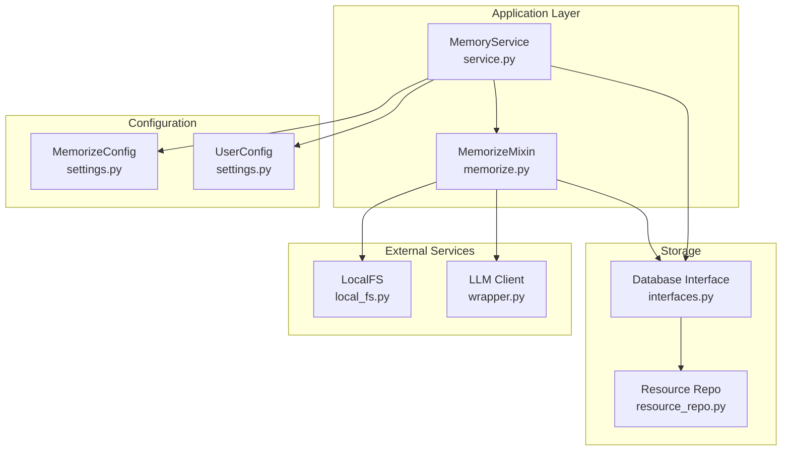
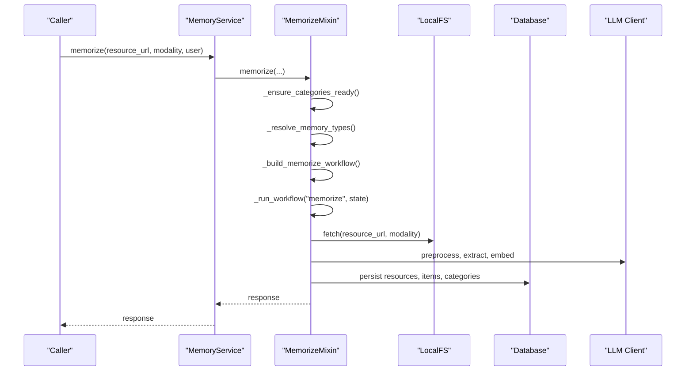
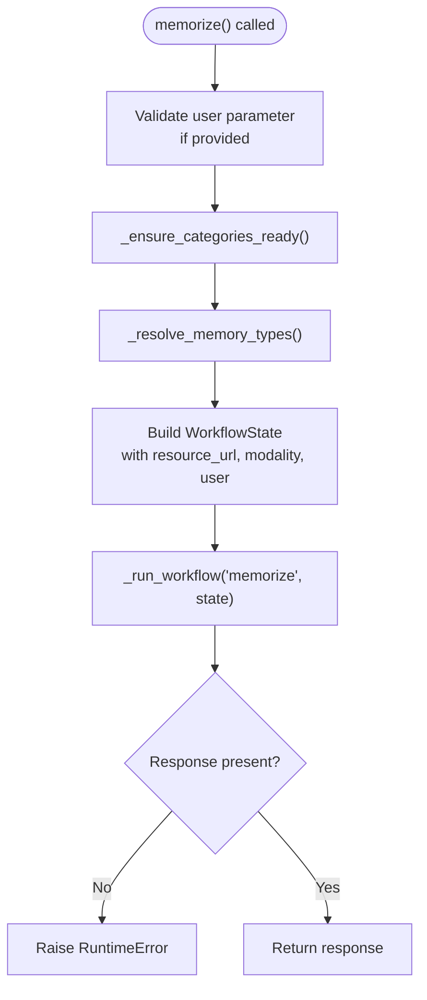
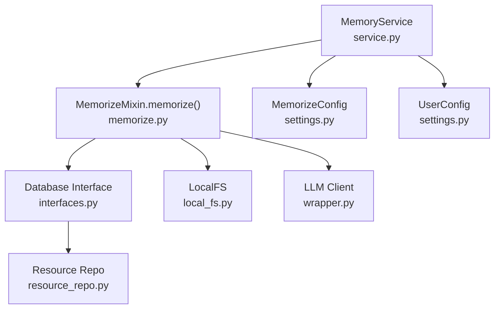

# Method Signature and Parameters

<cite>
**Referenced Files in This Document**
- [memorize.py](file://src/memu/app/memorize.py)
- [service.py](file://src/memu/app/service.py)
- [settings.py](file://src/memu/app/settings.py)
- [example_1_conversation_memory.py](file://examples/example_1_conversation_memory.py)
- [example_3_multimodal_memory.py](file://examples/example_3_multimodal_memory.py)
- [local/memorize.py](file://examples/proactive/memory/local/memorize.py)
- [platform/memorize.py](file://examples/proactive/memory/platform/memorize.py)
- [test_inmemory.py](file://tests/test_inmemory.py)
</cite>

## Table of Contents
1. [Introduction](#introduction)
2. [Project Structure](#project-structure)
3. [Core Components](#core-components)
4. [Architecture Overview](#architecture-overview)
5. [Detailed Component Analysis](#detailed-component-analysis)
6. [Dependency Analysis](#dependency-analysis)
7. [Performance Considerations](#performance-considerations)
8. [Troubleshooting Guide](#troubleshooting-guide)
9. [Conclusion](#conclusion)

## Introduction
This document provides comprehensive documentation for the `memorize()` method signature and parameters. It covers the method signature, parameter types, validation rules, acceptable values, default behaviors, parameter relationships, validation logic, error conditions, examples of valid parameter combinations, and parameter precedence and optional handling.

## Project Structure
The `memorize()` method is implemented in the `MemorizeMixin` class and is consumed by the `MemoryService` class. The method orchestrates a multi-step workflow to ingest, preprocess, extract, categorize, persist, and summarize memory from resources across multiple modalities.



**Diagram sources**
- [service.py](file://src/memu/app/service.py#L49-L96)
- [memorize.py](file://src/memu/app/memorize.py#L47-L96)
- [settings.py](file://src/memu/app/settings.py#L204-L243)

**Section sources**
- [service.py](file://src/memu/app/service.py#L49-L96)
- [memorize.py](file://src/memu/app/memorize.py#L47-L96)
- [settings.py](file://src/memu/app/settings.py#L204-L243)

## Core Components
The `memorize()` method signature is defined as:

```python
async def memorize(
    self,
    *,
    resource_url: str,
    modality: str,
    user: dict[str, Any] | None = None,
) -> dict[str, Any]:
```

Key characteristics:
- Positional-only parameters are not enforced; all parameters are keyword-only.
- The method is asynchronous and returns a dictionary containing the processed memory artifacts.
- The `user` parameter is optional and defaults to `None`.

**Section sources**
- [memorize.py](file://src/memu/app/memorize.py#L65-L71)

## Architecture Overview
The `memorize()` method participates in a multi-step workflow orchestrated by the `MemoryService`. The workflow ensures categories are ready, resolves memory types, builds a workflow state, runs the workflow, and validates the response.



**Diagram sources**
- [memorize.py](file://src/memu/app/memorize.py#L65-L96)
- [memorize.py](file://src/memu/app/memorize.py#L97-L166)
- [service.py](file://src/memu/app/service.py#L350-L360)

## Detailed Component Analysis

### Method Signature and Parameters

#### Parameter: resource_url (string)
- **Type**: string
- **Validation rules**:
  - Must be a non-empty string.
  - Used to fetch the resource locally via `LocalFS.fetch()`.
  - The underlying filesystem abstraction accepts the URL/path and modality to retrieve content.
- **Acceptable values**:
  - Valid file system paths or URLs supported by the configured blob storage.
  - Examples in the repository include JSON conversation files and text/document files.
- **Default behavior**:
  - No default value; must be provided.
- **Relationships and dependencies**:
  - Required by the ingestion step; without it, the workflow cannot proceed.
  - The modality determines how the resource is interpreted during preprocessing.
- **Parameter precedence**:
  - Higher precedence than optional parameters; required for successful execution.
- **Examples of valid usage**:
  - Conversation files: `"examples/resources/conversations/conv1.json"`
  - Documents: `"examples/resources/docs/doc1.txt"`
  - Images: `"examples/resources/images/image1.png"`

**Section sources**
- [memorize.py](file://src/memu/app/memorize.py#L65-L71)
- [memorize.py](file://src/memu/app/memorize.py#L181-L184)
- [example_1_conversation_memory.py](file://examples/example_1_conversation_memory.py#L97-L98)
- [example_3_multimodal_memory.py](file://examples/example_3_multimodal_memory.py#L117-L118)

#### Parameter: modality (string)
- **Type**: string
- **Validation rules**:
  - Must be a recognized modality string.
  - Supported modalities include: `"conversation"`, `"document"`, `"image"`, `"video"`, `"audio"`.
  - The method dispatches preprocessing logic based on this value.
- **Acceptable values**:
  - `"conversation"`: Requires text content; supports segmentation.
  - `"document"`: Requires text content; condenses and extracts captions.
  - `"image"`: Processes media files directly; uses vision capabilities.
  - `"video"`: Processes media files; extracts frames and analyzes via vision.
  - `"audio"`: Transcribes audio or reads pre-transcribed text; processes as text.
- **Default behavior**:
  - No default value; must be provided.
- **Relationships and dependencies**:
  - Determines preprocessing pipeline and required capabilities.
  - Some modalities require text content; others rely on vision or transcription.
- **Parameter precedence**:
  - Influences preprocessing and embedding steps; affects downstream processing.
- **Examples of valid usage**:
  - `"conversation"` for JSON conversation files.
  - `"document"` for text documents.
  - `"image"` for image files.
  - `"video"` for video files.
  - `"audio"` for audio files.

**Section sources**
- [memorize.py](file://src/memu/app/memorize.py#L68-L69)
- [memorize.py](file://src/memu/app/memorize.py#L772-L773)
- [memorize.py](file://src/memu/app/memorize.py#L775-L794)
- [memorize.py](file://src/memu/app/memorize.py#L708-L735)
- [example_1_conversation_memory.py](file://examples/example_1_conversation_memory.py#L97-L98)
- [example_3_multimodal_memory.py](file://examples/example_3_multimodal_memory.py#L117-L118)

#### Parameter: user (dict[str, Any] | None)
- **Type**: dict[str, Any] | None
- **Validation rules**:
  - If provided, must be a dictionary that conforms to the configured user model.
  - The service constructs a Pydantic model from the provided dictionary and converts it to a dumpable form.
  - The user scope is merged into persisted entities to support multi-user and multi-agent scenarios.
- **Acceptable values**:
  - Any dictionary compatible with the configured user model (e.g., `{"user_id": "..."}`).
  - Can be omitted to indicate no explicit user scope.
- **Default behavior**:
  - Defaults to `None`; when `None`, no user scope is applied.
- **Relationships and dependencies**:
  - Applied to resources, items, categories, and relations during persistence.
  - Enables filtering and scoping across retrievals and CRUD operations.
- **Parameter precedence**:
  - Lower precedence than required parameters; influences persistence and filtering.
- **Examples of valid usage**:
  - Providing a user identifier: `{"user_id": "123"}`
  - Omitting the parameter: `None`

**Section sources**
- [memorize.py](file://src/memu/app/memorize.py#L65-L71)
- [memorize.py](file://src/memu/app/memorize.py#L74-L74)
- [service.py](file://src/memu/app/service.py#L62-L63)
- [settings.py](file://src/memu/app/settings.py#L256-L258)
- [test_inmemory.py](file://tests/test_inmemory.py#L40-L40)
- [local/memorize.py](file://examples/proactive/memory/local/memorize.py#L38-L38)

### Parameter Validation Logic and Error Conditions

#### Validation logic
- The method constructs a user scope model from the provided dictionary if present.
- The workflow state includes the user scope for downstream steps.
- The method raises a runtime error if the workflow fails to produce a response.

#### Error conditions
- **Missing required keys in workflow state**: The workflow runner enforces required keys per step; missing keys result in a `KeyError`.
- **Invalid user scope**: If the provided user dictionary does not conform to the configured user model, model validation errors may occur during construction.
- **Workflow failure**: If the workflow does not produce a response, a `RuntimeError` is raised.



**Diagram sources**
- [memorize.py](file://src/memu/app/memorize.py#L65-L95)
- [memorize.py](file://src/memu/app/memorize.py#L97-L166)
- [service.py](file://src/memu/app/service.py#L350-L360)

**Section sources**
- [memorize.py](file://src/memu/app/memorize.py#L65-L95)
- [memorize.py](file://src/memu/app/memorize.py#L97-L166)
- [service.py](file://src/memu/app/service.py#L350-L360)

### Parameter Relationships and Dependencies
- The `resource_url` and `modality` parameters are required and define the resource to be processed.
- The `user` parameter, when provided, scopes the persisted entities and enables filtering.
- The method relies on:
  - Local file system access via `LocalFS.fetch()`.
  - LLM clients for preprocessing, extraction, and embeddings.
  - Database persistence for resources, items, and categories.
- The workflow enforces that required keys are present at each step; missing keys lead to errors.

**Section sources**
- [memorize.py](file://src/memu/app/memorize.py#L181-L184)
- [memorize.py](file://src/memu/app/memorize.py#L97-L166)
- [service.py](file://src/memu/app/service.py#L350-L360)

### Examples of Valid Parameter Combinations and Common Usage Patterns

#### Conversation memory
- Use `"conversation"` modality with JSON conversation files.
- Example usage:
  - `await service.memorize(resource_url="examples/resources/conversations/conv1.json", modality="conversation")`
  - `await service.memorize(resource_url=resource_url, modality="conversation", user={"user_id": "123"})`

**Section sources**
- [example_1_conversation_memory.py](file://examples/example_1_conversation_memory.py#L97-L98)
- [test_inmemory.py](file://tests/test_inmemory.py#L40-L40)
- [local/memorize.py](file://examples/proactive/memory/local/memorize.py#L38-L38)

#### Multimodal memory
- Use `"document"`, `"image"`, or `"video"` modalities with appropriate files.
- Example usage:
  - `await service.memorize(resource_url="examples/resources/docs/doc1.txt", modality="document")`
  - `await service.memorize(resource_url="examples/resources/images/image1.png", modality="image")`

**Section sources**
- [example_3_multimodal_memory.py](file://examples/example_3_multimodal_memory.py#L117-L118)

#### Platform usage
- The platform example demonstrates how to call the memorize endpoint with a payload including conversation messages, user identifiers, and configuration overrides.

**Section sources**
- [platform/memorize.py](file://examples/proactive/memory/platform/memorize.py#L13-L31)

## Dependency Analysis
The `memorize()` method depends on several components:
- Configuration: `MemorizeConfig` and `UserConfig` define behavior and user scope.
- Storage: Database interface and resource repositories handle persistence.
- External services: Local file system and LLM clients provide preprocessing and embeddings.
- Workflow orchestration: The service registers and runs the memorize pipeline.



**Diagram sources**
- [memorize.py](file://src/memu/app/memorize.py#L47-L96)
- [service.py](file://src/memu/app/service.py#L49-L96)
- [settings.py](file://src/memu/app/settings.py#L204-L243)

**Section sources**
- [memorize.py](file://src/memu/app/memorize.py#L47-L96)
- [service.py](file://src/memu/app/service.py#L49-L96)
- [settings.py](file://src/memu/app/settings.py#L204-L243)

## Performance Considerations
- Embedding and LLM calls are asynchronous and batched where possible.
- Preprocessing steps may involve transcription or vision processing, which can be computationally expensive.
- The workflow supports concurrency via `asyncio.gather()` for parallel processing of multiple memory types and segments.

[No sources needed since this section provides general guidance]

## Troubleshooting Guide
Common issues and resolutions:
- **Missing required keys**: Ensure `resource_url` and `modality` are provided; the workflow requires these keys to proceed.
- **Invalid user scope**: Verify that the user dictionary conforms to the configured user model; otherwise, model validation errors may occur.
- **Workflow failures**: If the response is empty, a `RuntimeError` is raised indicating the workflow did not produce a response.
- **Modality-specific errors**: For audio modalities, transcription failures can result in `None` preprocessing; ensure audio files are supported and transcription is available.

**Section sources**
- [memorize.py](file://src/memu/app/memorize.py#L92-L94)
- [memorize.py](file://src/memu/app/memorize.py#L721-L770)

## Conclusion
The `memorize()` method provides a robust, configurable interface for ingesting and processing resources across multiple modalities. Its parameters—`resource_url`, `modality`, and optional `user`—are designed to be explicit and validated through the service’s configuration and workflow orchestration. Proper usage involves providing valid resource URLs and supported modalities, optionally scoping with user data, and handling potential workflow errors gracefully.