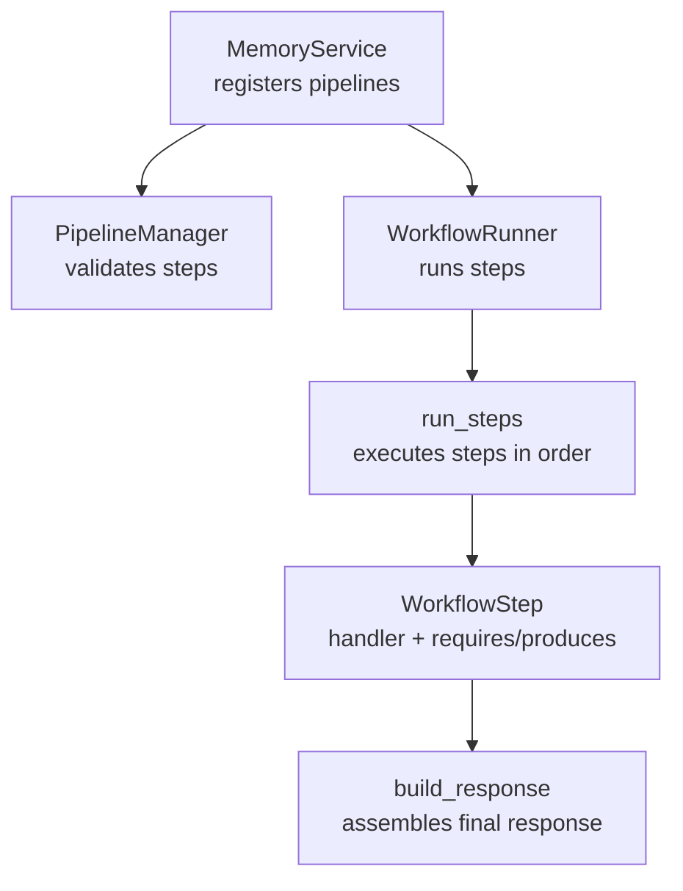
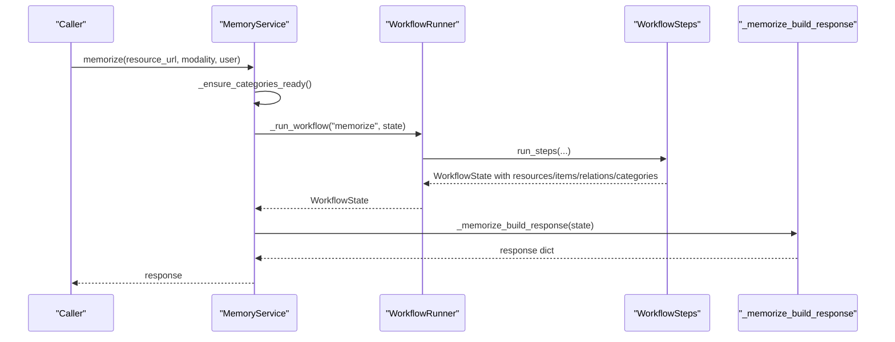
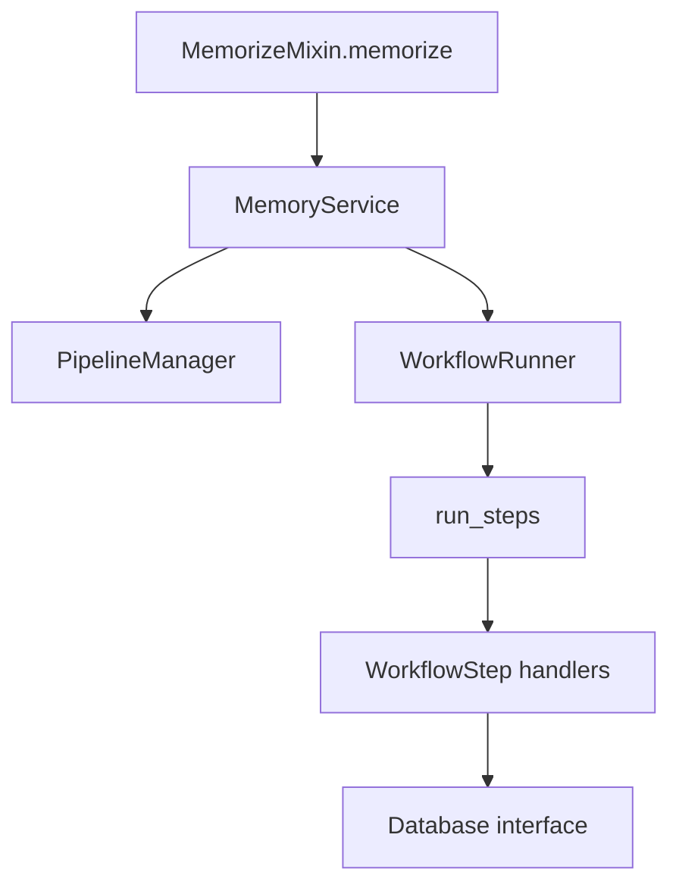

# Return Values and Error Handling

<cite>
**Referenced Files in This Document**
- [memorize.py](file://src/memu/app/memorize.py)
- [service.py](file://src/memu/app/service.py)
- [step.py](file://src/memu/workflow/step.py)
- [runner.py](file://src/memu/workflow/runner.py)
- [pipeline.py](file://src/memu/workflow/pipeline.py)
- [interceptor.py](file://src/memu/workflow/interceptor.py)
- [interfaces.py](file://src/memu/database/interfaces.py)
- [test_openrouter.py](file://tests/test_openrouter.py)
- [architecture.md](file://docs/architecture.md)
- [0001-workflow-pipeline-architecture.md](file://docs/adr/0001-workflow-pipeline-architecture.md)
- [memorize.py (local example)](file://examples/proactive/memory/local/memorize.py)
- [memorize.py (platform example)](file://examples/proactive/memory/platform/memorize.py)
</cite>

## Table of Contents
1. [Introduction](#introduction)
2. [Project Structure](#project-structure)
3. [Core Components](#core-components)
4. [Architecture Overview](#architecture-overview)
5. [Detailed Component Analysis](#detailed-component-analysis)
6. [Dependency Analysis](#dependency-analysis)
7. [Performance Considerations](#performance-considerations)
8. [Troubleshooting Guide](#troubleshooting-guide)
9. [Conclusion](#conclusion)

## Introduction
This document explains the return values and error handling mechanisms of the memorize() method. It details the exact structure of the returned dictionary, including resource(s), items, categories, and relations fields, along with their data types, nested structures, and field relationships. It also documents all possible exception types, error conditions, error messages, and practical strategies for retries and recovery. Examples of successful responses and error scenarios are included to guide implementation and debugging.

## Project Structure
The memorize() operation is implemented as a workflow pipeline orchestrated by MemoryService and executed by a WorkflowRunner. The pipeline stages transform raw resources into structured memory items, persist them, and produce a consolidated response.

**Diagram sources**
- [service.py](file://src/memu/app/service.py#L315-L361)
- [pipeline.py](file://src/memu/workflow/pipeline.py#L27-L46)
- [runner.py](file://src/memu/workflow/runner.py#L28-L39)
- [step.py](file://src/memu/workflow/step.py#L50-L102)
- [memorize.py](file://src/memu/app/memorize.py#L97-L166)

**Section sources**
- [architecture.md](file://docs/architecture.md#L52-L85)
- [0001-workflow-pipeline-architecture.md](file://docs/adr/0001-workflow-pipeline-architecture.md#L1-L36)

## Core Components
- MemoryService orchestrates the memorize pipeline, registers steps, and runs the workflow.
- PipelineManager validates step dependencies and capabilities.
- WorkflowRunner executes steps locally by default.
- WorkflowStep enforces required/produced state keys and returns mapping results.
- build_response constructs the final dictionary returned by memorize().

Key behaviors:
- The memorize() method returns a dictionary with resource(s), items, categories, and relations.
- If the workflow fails to produce a response, a runtime error is raised.

**Section sources**
- [service.py](file://src/memu/app/service.py#L315-L361)
- [pipeline.py](file://src/memu/workflow/pipeline.py#L131-L165)
- [runner.py](file://src/memu/workflow/runner.py#L28-L39)
- [step.py](file://src/memu/workflow/step.py#L40-L47)
- [memorize.py](file://src/memu/app/memorize.py#L65-L95)

## Architecture Overview
The memorize pipeline consists of seven ordered steps. The final step builds the response dictionary.

**Diagram sources**
- [memorize.py](file://src/memu/app/memorize.py#L65-L95)
- [service.py](file://src/memu/app/service.py#L350-L361)
- [runner.py](file://src/memu/workflow/runner.py#L31-L39)
- [step.py](file://src/memu/workflow/step.py#L50-L102)
- [memorize.py](file://src/memu/app/memorize.py#L299-L325)

## Detailed Component Analysis

### Return Value Structure
The memorize() method returns a dictionary with the following fields:

- resource or resources
  - Type: dict or list of dicts
  - Description: One resource dict if a single resource was created; otherwise a list of resource dicts.
  - Nested structure: Depends on the underlying Resource model; excludes embedding field in serialization.
  - Relationship: Each resource corresponds to a persisted Resource record.

- items
  - Type: list of dicts
  - Description: Memory items extracted from the resource.
  - Nested structure: Each item is a serialized MemoryItem without embedding; includes memory_type, summary, and related metadata.
  - Relationship: Linked to categories via relations.

- categories
  - Type: list of dicts
  - Description: Category definitions used during categorization.
  - Nested structure: Serialized MemoryCategory records without embedding.
  - Relationship: Used to map items to categories.

- relations
  - Type: list of dicts
  - Description: Item-to-category linkage records.
  - Nested structure: CategoryItem model serialized to dict.

Notes:
- The presence of resource vs resources depends on whether the preprocessing produced a single resource or multiple segmented resources.
- The response is built in the final step and returned by memorize().

**Section sources**
- [memorize.py](file://src/memu/app/memorize.py#L299-L325)
- [memorize.py](file://src/memu/app/memorize.py#L300-L308)
- [memorize.py](file://src/memu/app/memorize.py#L310-L323)
- [service.py](file://src/memu/app/service.py#L375-L377)

### Data Types and Field Relationships
- resource(s): Serialized Resource records (excluding embedding).
- items: Serialized MemoryItem records (excluding embedding).
- relations: CategoryItem linkage records.
- categories: Serialized MemoryCategory records (excluding embedding).

The relationships:
- items belong to a resource (via resource_id).
- items are linked to categories via relations.
- categories define the taxonomy used to map items.

**Section sources**
- [interfaces.py](file://src/memu/database/interfaces.py#L12-L26)
- [memorize.py](file://src/memu/app/memorize.py#L240-L281)

### Error Handling Mechanisms
The memorize() method raises errors under specific conditions:

- Workflow failure to produce a response:
  - Condition: After running the pipeline, if the resulting state lacks a response field.
  - Exception: RuntimeError with a descriptive message.
  - Recovery: Retry the operation after ensuring prerequisites (e.g., categories ready) are satisfied.

- Step-level validation failures:
  - Missing required state keys for a step:
    - Exception: KeyError with a message listing missing keys.
    - Recovery: Ensure prior steps produce the required keys or supply initial_state_keys accordingly.
  - Step handler does not return a mapping:
    - Exception: TypeError indicating the handler must return a mapping.
    - Recovery: Fix the step handler to return a dict.

- Pipeline validation errors:
  - Duplicate step_id, unavailable capabilities, unknown LLM profile, or missing required keys:
    - Exceptions: ValueError with descriptive messages.
    - Recovery: Adjust pipeline definition or step configuration.

- Unknown workflow runner:
  - Exception: ValueError when resolving an unknown runner name.
  - Recovery: Register the runner or use a supported runner name.

- Interceptor strict mode:
  - On-error interceptors: If strict is enabled, interceptor exceptions propagate; otherwise they are logged.
  - Recovery: Disable strict mode for less strict error handling or fix interceptor logic.

- LLM client profile resolution:
  - Unknown profile name:
    - Exception: KeyError with the profile name.
    - Recovery: Configure a valid profile or adjust step config.

- JSON parsing and XML parsing:
  - Segment extraction and memory parsing may fall back to empty results if parsing fails.
  - Recovery: Validate input formats and retry with corrected inputs.

Retry and recovery strategies:
- Idempotent retries: Retry the entire memorize() call after correcting transient issues (e.g., network failures).
- Conditional retries: For LLM failures, retry with exponential backoff and reduced concurrency.
- Graceful degradation: If preprocessing fails (e.g., video frame extraction), the system continues with partial results or defaults.
- Interceptor-based monitoring: Use on_error interceptors to capture and log errors for later analysis.

**Section sources**
- [memorize.py](file://src/memu/app/memorize.py#L90-L95)
- [step.py](file://src/memu/workflow/step.py#L67-L72)
- [step.py](file://src/memu/workflow/step.py#L40-L47)
- [pipeline.py](file://src/memu/workflow/pipeline.py#L131-L165)
- [runner.py](file://src/memu/workflow/runner.py#L61-L81)
- [interceptor.py](file://src/memu/workflow/interceptor.py#L145-L161)
- [interceptor.py](file://src/memu/workflow/interceptor.py#L205-L219)
- [service.py](file://src/memu/app/service.py#L147-L148)

### Successful Response Example
A successful call to memorize() returns a dictionary with:
- resource or resources: One or multiple resource entries.
- items: List of extracted memory items.
- categories: List of category definitions used.
- relations: List of item-to-category linkages.

The test suite demonstrates retrieving items and categories counts from the response, confirming the presence of these fields.

**Section sources**
- [test_openrouter.py](file://tests/test_openrouter.py#L46-L64)

### Error Scenarios and Handling Approaches
- Missing required keys for a step:
  - Symptom: KeyError listing missing keys.
  - Approach: Ensure earlier steps produce required keys or adjust initial state keys.

- Handler returns invalid type:
  - Symptom: TypeError stating the handler must return a mapping.
  - Approach: Modify the handler to return a dict.

- Unknown LLM profile:
  - Symptom: KeyError with the profile name.
  - Approach: Define the profile or change step configuration.

- Workflow runner not found:
  - Symptom: ValueError with runner name.
  - Approach: Register the runner or select a supported runner.

- No response produced:
  - Symptom: RuntimeError indicating the workflow failed to produce a response.
  - Approach: Inspect pipeline steps, ensure prerequisites (e.g., categories ready), and retry.

- Interceptor exceptions in strict mode:
  - Symptom: Propagated exceptions from interceptors.
  - Approach: Disable strict mode or fix interceptor logic.

**Section sources**
- [step.py](file://src/memu/workflow/step.py#L67-L72)
- [step.py](file://src/memu/workflow/step.py#L40-L47)
- [pipeline.py](file://src/memu/workflow/pipeline.py#L131-L165)
- [runner.py](file://src/memu/workflow/runner.py#L61-L81)
- [service.py](file://src/memu/app/service.py#L147-L148)
- [memorize.py](file://src/memu/app/memorize.py#L90-L95)
- [interceptor.py](file://src/memu/workflow/interceptor.py#L205-L219)

## Dependency Analysis
The memorize() method depends on:
- MemoryService for orchestration and pipeline registration.
- PipelineManager for validating step dependencies.
- WorkflowRunner for executing steps.
- WorkflowStep handlers for processing state transitions.
- Database interface for persistence and retrieval of resources, items, categories, and relations.

**Diagram sources**
- [memorize.py](file://src/memu/app/memorize.py#L65-L95)
- [service.py](file://src/memu/app/service.py#L315-L361)
- [pipeline.py](file://src/memu/workflow/pipeline.py#L27-L46)
- [runner.py](file://src/memu/workflow/runner.py#L28-L39)
- [step.py](file://src/memu/workflow/step.py#L50-L102)
- [interfaces.py](file://src/memu/database/interfaces.py#L12-L26)

**Section sources**
- [service.py](file://src/memu/app/service.py#L315-L361)
- [pipeline.py](file://src/memu/workflow/pipeline.py#L27-L46)
- [runner.py](file://src/memu/workflow/runner.py#L28-L39)
- [step.py](file://src/memu/workflow/step.py#L50-L102)
- [interfaces.py](file://src/memu/database/interfaces.py#L12-L26)

## Performance Considerations
- Embedding generation: Generating embeddings for items and captions can be expensive; batch sizes and concurrency impact throughput.
- LLM calls: Structured extraction and summarization introduce latency; consider caching and rate limiting.
- Preprocessing: Video frame extraction and audio transcription add overhead; ensure external tools (e.g., ffmpeg) are available.
- Pipeline validation: Excessive pipeline mutations can degrade performance due to repeated validation; keep pipeline definitions stable.

[No sources needed since this section provides general guidance]

## Troubleshooting Guide
Common issues and resolutions:
- Workflow returns no response:
  - Verify that all steps execute successfully and that the final step sets the response field.
  - Check for exceptions in earlier steps and address them.

- Missing required keys:
  - Review the pipeline’s required keys and ensure preceding steps produce them.

- Handler type mismatch:
  - Ensure each step handler returns a dict.

- Unknown LLM profile:
  - Confirm the profile exists in configuration.

- Runner resolution errors:
  - Register the runner or use a supported runner name.

- Interceptor failures:
  - Disable strict mode temporarily to isolate interceptor issues.

- Example usage patterns:
  - Local example: Demonstrates calling memorize with a conversation resource URL and user scope.
  - Platform example: Shows how to trigger a remote memorize operation and handle task_id.

**Section sources**
- [memorize.py](file://src/memu/app/memorize.py#L90-L95)
- [step.py](file://src/memu/workflow/step.py#L67-L72)
- [pipeline.py](file://src/memu/workflow/pipeline.py#L131-L165)
- [runner.py](file://src/memu/workflow/runner.py#L61-L81)
- [interceptor.py](file://src/memu/workflow/interceptor.py#L205-L219)
- [memorize.py (local example)](file://examples/proactive/memory/local/memorize.py#L34-L39)
- [memorize.py (platform example)](file://examples/proactive/memory/platform/memorize.py#L13-L31)

## Conclusion
The memorize() method returns a structured dictionary containing resource(s), items, categories, and relations, assembled after a validated workflow pipeline. Robust error handling is enforced at multiple layers: step validation, handler return types, pipeline configuration, runner resolution, and interceptor behavior. By understanding the return structure and implementing appropriate retries and recovery strategies, applications can reliably integrate memory ingestion with predictable outcomes.