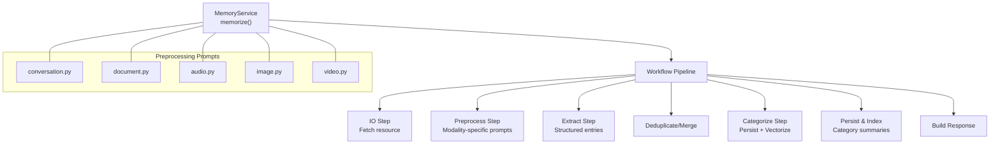
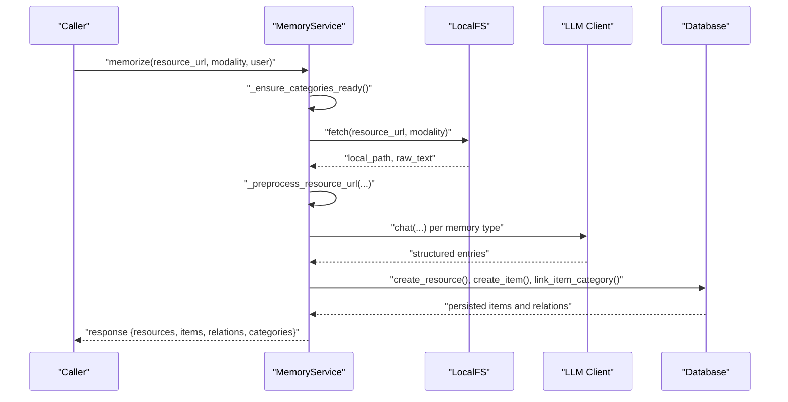
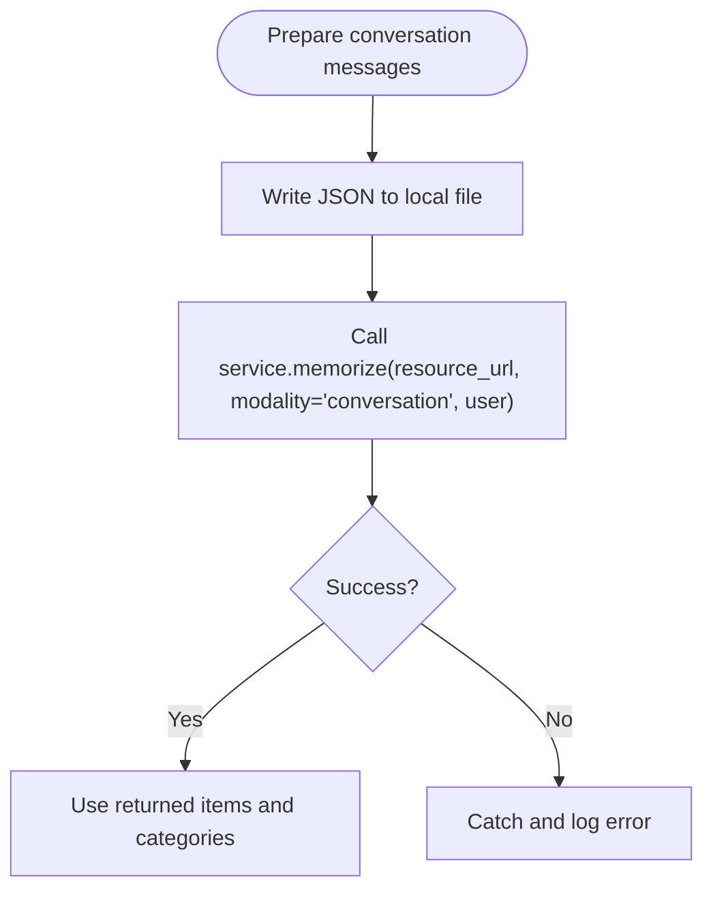
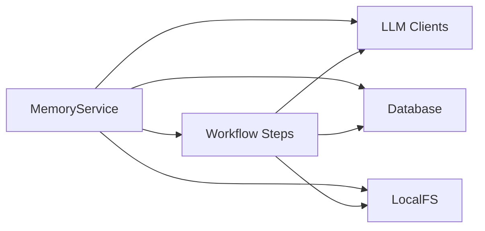

# Usage Examples and Best Practices

<cite>
**Referenced Files in This Document**
- [memorize.py](file://src/memu/app/memorize.py)
- [service.py](file://src/memu/app/service.py)
- [conversation.py](file://src/memu/prompts/preprocess/conversation.py)
- [document.py](file://src/memu/prompts/preprocess/document.py)
- [audio.py](file://src/memu/prompts/preprocess/audio.py)
- [image.py](file://src/memu/prompts/preprocess/image.py)
- [video.py](file://src/memu/prompts/preprocess/video.py)
- [memory_item_repo.py (Postgres)](file://src/memu/database/postgres/repositories/memory_item_repo.py)
- [memory_item_repo.py (SQLite)](file://src/memu/database/sqlite/repositories/memory_item_repo.py)
- [example_1_conversation_memory.py](file://examples/example_1_conversation_memory.py)
- [example_3_multimodal_memory.py](file://examples/example_3_multimodal_memory.py)
- [example_4_openrouter_memory.py](file://examples/example_4_openrouter_memory.py)
- [test_nebius_provider.py](file://examples/test_nebius_provider.py)
- [local/memorize.py](file://examples/proactive/memory/local/memorize.py)
- [platform/memorize.py](file://examples/proactive/memory/platform/memorize.py)
</cite>

## Table of Contents
1. [Introduction](#introduction)
2. [Project Structure](#project-structure)
3. [Core Components](#core-components)
4. [Architecture Overview](#architecture-overview)
5. [Detailed Component Analysis](#detailed-component-analysis)
6. [Dependency Analysis](#dependency-analysis)
7. [Performance Considerations](#performance-considerations)
8. [Troubleshooting Guide](#troubleshooting-guide)
9. [Conclusion](#conclusion)
10. [Appendices](#appendices)

## Introduction
This document provides comprehensive usage examples and best practices for the memorize() method in memU. It covers ingestion from multiple modalities (conversations, documents, audio, video, images), parameter configuration, error handling, integration with external systems, performance optimization, batch processing, memory management, and advanced usage patterns. The goal is to help both new and experienced users adopt robust, scalable memory ingestion workflows.

## Project Structure
The memorize() method is implemented in the MemoryService class and orchestrated through a workflow pipeline. Supporting components include:
- Preprocessing prompts for each modality
- Database repositories for persistence and deduplication
- Example scripts demonstrating real-world usage

**Diagram sources**
- [memorize.py](file://src/memu/app/memorize.py#L97-L166)
- [conversation.py](file://src/memu/prompts/preprocess/conversation.py#L1-L44)
- [document.py](file://src/memu/prompts/preprocess/document.py#L1-L36)
- [audio.py](file://src/memu/prompts/preprocess/audio.py#L1-L36)
- [image.py](file://src/memu/prompts/preprocess/image.py#L1-L35)
- [video.py](file://src/memu/prompts/preprocess/video.py#L1-L36)

**Section sources**
- [memorize.py](file://src/memu/app/memorize.py#L97-L166)
- [service.py](file://src/memu/app/service.py#L49-L95)

## Core Components
- MemoryService: Provides the public memorize() interface and orchestrates the workflow.
- MemorizeMixin: Implements the workflow steps and state transitions.
- Preprocessing prompts: Modality-specific templates guiding LLM-based preprocessing.
- Database repositories: Persist memory items, manage embeddings, and enforce deduplication.

Key capabilities:
- Asynchronous workflow execution
- LLM and embedding client selection per step
- User scoping and category initialization
- Structured extraction and categorization
- Batch-friendly design via segment-aware conversation processing

**Section sources**
- [service.py](file://src/memu/app/service.py#L49-L95)
- [memorize.py](file://src/memu/app/memorize.py#L65-L95)
- [memorize.py](file://src/memu/app/memorize.py#L97-L166)

## Architecture Overview
The memorize() method follows a staged pipeline:
1. Ingest resource (download or read local file)
2. Preprocess resource (modality-specific cleaning and segmentation)
3. Extract structured entries (memory types and categories)
4. Deduplicate and merge
5. Categorize and persist (items, relations, category updates)
6. Persist category summaries and optional references
7. Build and return response

**Diagram sources**
- [memorize.py](file://src/memu/app/memorize.py#L65-L95)
- [memorize.py](file://src/memu/app/memorize.py#L181-L197)
- [memorize.py](file://src/memu/app/memorize.py#L199-L227)
- [memorize.py](file://src/memu/app/memorize.py#L234-L281)
- [memorize.py](file://src/memu/app/memorize.py#L283-L297)
- [memorize.py](file://src/memu/app/memorize.py#L299-L325)

## Detailed Component Analysis

### MemoryService.memorize()
- Purpose: Public entry point to ingest and process a resource into memory.
- Required parameters:
  - resource_url: Path or URI to the resource
  - modality: One of conversation, document, audio, video, image, or others supported by preprocessing
  - user: Optional user scope (e.g., user_id) to enable user-scoped persistence and filtering
- Behavior:
  - Ensures categories are initialized
  - Builds workflow state and runs the pipeline
  - Validates and returns a structured response

Best practices:
- Always pass user scope when working in multi-tenant or multi-user environments
- Ensure resource_url is accessible by the configured blob storage
- Use appropriate memory_types and category_configs for your domain

**Section sources**
- [memorize.py](file://src/memu/app/memorize.py#L65-L95)
- [service.py](file://src/memu/app/service.py#L49-L95)

### Preprocessing and Modality Handling
- Conversation: Segments long conversations into topic-appropriate chunks using modality-specific prompts, then processes each segment.
- Document: Condenses content and generates a one-sentence caption.
- Audio: Transcribes audio to text (via LLM STT capability) and then applies document-style preprocessing.
- Image/Video: Generates detailed descriptions and one-sentence captions.

Guidance:
- For very long conversations, rely on segmentation to keep prompts manageable and extraction accurate.
- For audio, ensure readable file extensions or provide pre-transcribed text.
- For images/videos, leverage the vision-language capabilities exposed by the LLM client.

**Section sources**
- [memorize.py](file://src/memu/app/memorize.py#L689-L794)
- [conversation.py](file://src/memu/prompts/preprocess/conversation.py#L1-L44)
- [document.py](file://src/memu/prompts/preprocess/document.py#L1-L36)
- [audio.py](file://src/memu/prompts/preprocess/audio.py#L1-L36)
- [image.py](file://src/memu/prompts/preprocess/image.py#L1-L35)
- [video.py](file://src/memu/prompts/preprocess/video.py#L1-L36)

### Structured Extraction and Categorization
- Extracts structured entries per memory type using prompts tailored to each type.
- Parses LLM responses into (memory_type, content, categories) tuples.
- Persists items with embeddings and links them to categories.
- Supports reinforcement-based deduplication and category update summaries.

Recommendations:
- Configure memory_types and category_configs to match your domain taxonomy.
- Enable item reinforcement to avoid duplicate processing under repeated ingestion.
- Use category update summaries to keep category knowledge fresh.

**Section sources**
- [memorize.py](file://src/memu/app/memorize.py#L424-L553)
- [memorize.py](file://src/memu/app/memorize.py#L578-L623)
- [memorize.py](file://src/memu/app/memorize.py#L283-L297)

### Persistence and Deduplication
- Memory items are persisted with embeddings and user scope.
- Deduplication is performed by content hash within the same user scope.
- Reinforcement increments counters and timestamps for existing items.

Operational tips:
- Expect deduplicated items to return the same embedding and updated metadata.
- Use user scope to isolate data across tenants or agents.

**Section sources**
- [memory_item_repo.py (Postgres)](file://src/memu/database/postgres/repositories/memory_item_repo.py#L173-L199)
- [memory_item_repo.py (SQLite)](file://src/memu/database/sqlite/repositories/memory_item_repo.py#L285-L299)

### Practical Usage Patterns and Examples

#### Conversations
- Local example: Demonstrates writing a conversation JSON to disk and calling memorize() with modality "conversation".
- Platform example: Shows offloading to a remote API with override configuration.

**Diagram sources**
- [local/memorize.py](file://examples/proactive/memory/local/memorize.py#L13-L38)
- [platform/memorize.py](file://examples/proactive/memory/platform/memorize.py#L13-L31)

**Section sources**
- [local/memorize.py](file://examples/proactive/memory/local/memorize.py#L13-L38)
- [platform/memorize.py](file://examples/proactive/memory/platform/memorize.py#L13-L31)
- [example_1_conversation_memory.py](file://examples/example_1_conversation_memory.py#L86-L117)

#### Documents
- Example shows initializing MemoryService with LLM profiles and processing multiple document files.

**Section sources**
- [example_3_multimodal_memory.py](file://examples/example_3_multimodal_memory.py#L58-L138)

#### Audio Files
- Example demonstrates using OpenRouter as the LLM backend and processing conversation JSON files.

**Section sources**
- [example_4_openrouter_memory.py](file://examples/example_4_openrouter_memory.py#L46-L113)

#### Images and Videos
- Example initializes MemoryService with OpenAI and processes documents and images to generate category outputs.

**Section sources**
- [example_3_multimodal_memory.py](file://examples/example_3_multimodal_memory.py#L58-L138)

#### Integrating with External Systems
- Platform example shows posting to a remote API with Authorization header and override configuration.

**Section sources**
- [platform/memorize.py](file://examples/proactive/memory/platform/memorize.py#L13-L31)

#### Using Alternative Providers (e.g., Nebius)
- Example demonstrates configuring MemU to use Nebius via OpenAI-compatible endpoints.

**Section sources**
- [test_nebius_provider.py](file://examples/test_nebius_provider.py#L107-L193)

## Dependency Analysis
The memorize() pipeline depends on:
- LLM clients (chat and embedding) selected per step
- Database for persistence and vector index
- Local filesystem for resource access
- Preprocessing prompts for each modality

**Diagram sources**
- [service.py](file://src/memu/app/service.py#L187-L226)
- [memorize.py](file://src/memu/app/memorize.py#L97-L166)

**Section sources**
- [service.py](file://src/memu/app/service.py#L187-L226)
- [memorize.py](file://src/memu/app/memorize.py#L97-L166)

## Performance Considerations
- Embedding batching: Configure embed_batch_size in LLM profiles to optimize throughput.
- Client caching: LLM clients are cached per profile to avoid repeated initialization overhead.
- Segment-based conversation processing: Reduces prompt size and improves extraction quality for long conversations.
- Deduplication: Prevents redundant embeddings and storage costs.
- Asynchronous orchestration: Leverages asyncio for concurrent LLM calls and I/O.

Recommendations:
- Tune embed_batch_size according to provider limits and latency targets.
- Use user scope to shard data and reduce contention.
- Prefer segmented conversations to keep prompt sizes reasonable.
- Monitor vector index provider performance and adjust indexing strategies.

**Section sources**
- [service.py](file://src/memu/app/service.py#L97-L151)
- [memorize.py](file://src/memu/app/memorize.py#L484-L509)
- [memory_item_repo.py (Postgres)](file://src/memu/database/postgres/repositories/memory_item_repo.py#L173-L199)

## Troubleshooting Guide
Common issues and resolutions:
- Missing or invalid API keys: Ensure llm_profiles are configured with correct provider, base_url, and api_key.
- Unsupported modality: Confirm modality is supported by preprocessing prompts and that resource_url points to a valid file.
- Audio transcription failures: Verify audio file extension or provide pre-transcribed text; check logs for exceptions during transcription.
- Empty or missing structured entries: Validate memory_types and category prompts; ensure LLM responses conform to expected XML/JSON structure.
- Deduplication behavior: Reinforced items increment counters; confirm user scope and content hash logic if duplicates appear unexpected.

Debugging tips:
- Wrap calls in try/except and log errors with resource_url and modality.
- Inspect returned response keys: resources, items, relations, categories.
- Use interceptors to capture LLM call metadata and step context for tracing.

**Section sources**
- [service.py](file://src/memu/app/service.py#L228-L295)
- [memorize.py](file://src/memu/app/memorize.py#L737-L770)
- [memorize.py](file://src/memu/app/memorize.py#L933-L963)

## Conclusion
The memorize() method provides a robust, extensible pipeline for turning diverse content into structured, categorized, and embeddable memories. By leveraging modality-specific preprocessing, structured extraction, and efficient persistence with deduplication, teams can build scalable memory ingestion workflows. Use the examples and best practices here to integrate with your systems, optimize performance, and maintain reliable, high-quality memory stores.

## Appendices

### Parameter Reference
- resource_url: Path or URI to the input resource
- modality: "conversation", "document", "audio", "image", "video", or others supported by preprocessing
- user: Optional mapping containing user identifiers for scoping

**Section sources**
- [memorize.py](file://src/memu/app/memorize.py#L65-L95)

### Advanced Usage Patterns
- Override LLM profiles per step using step_config to route heavy embedding workloads to dedicated profiles.
- Dynamically insert or replace workflow steps to inject custom logic (e.g., custom deduplication).
- Integrate with external platforms by posting to the platform’s memorize endpoint and polling for results.

**Section sources**
- [service.py](file://src/memu/app/service.py#L390-L426)
- [platform/memorize.py](file://examples/proactive/memory/platform/memorize.py#L13-L31)