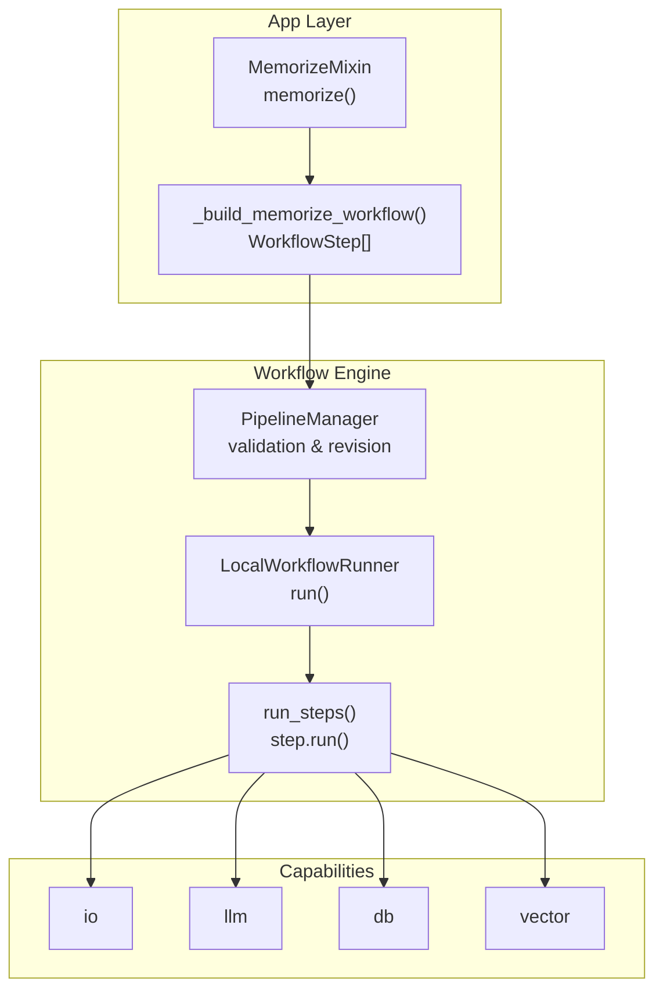
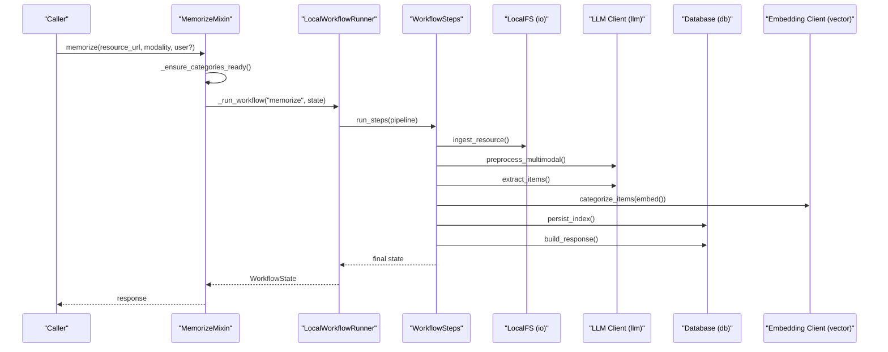
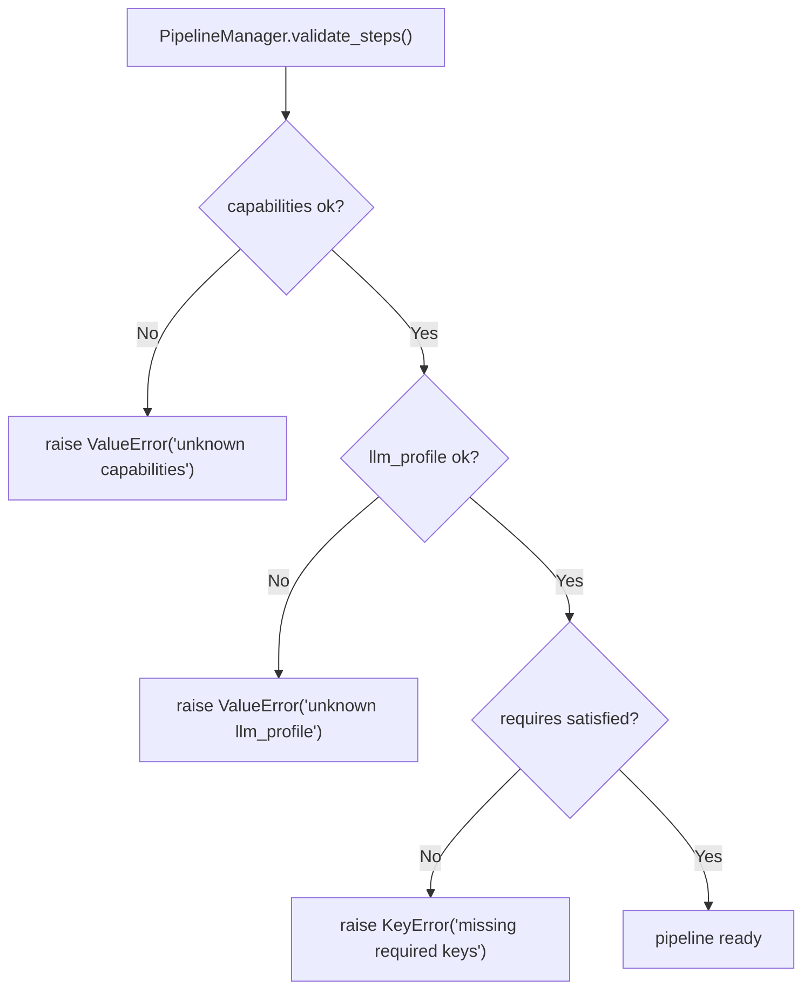

# Workflow Steps and Execution

<cite>
**Referenced Files in This Document**
- [memorize.py](file://src/memu/app/memorize.py)
- [pipeline.py](file://src/memu/workflow/pipeline.py)
- [step.py](file://src/memu/workflow/step.py)
- [runner.py](file://src/memu/workflow/runner.py)
- [settings.py](file://src/memu/app/settings.py)
- [interfaces.py](file://src/memu/database/interfaces.py)
- [memory_item.py](file://src/memu/database/repositories/memory_item.py)
- [openai_sdk.py](file://src/memu/embedding/openai_sdk.py)
- [lazyllm_client.py](file://src/memu/llm/lazyllm_client.py)
- [wrapper.py](file://src/memu/llm/wrapper.py)
- [service.py](file://src/memu/app/service.py)
- [conv1.json](file://examples/resources/conversations/conv1.json)
- [doc1.txt](file://examples/resources/docs/doc1.txt)
- [example_3_multimodal_memory.py](file://examples/example_3_multimodal_memory.py)
</cite>

## Table of Contents
1. [Introduction](#introduction)
2. [Project Structure](#project-structure)
3. [Core Components](#core-components)
4. [Architecture Overview](#architecture-overview)
5. [Detailed Component Analysis](#detailed-component-analysis)
6. [Dependency Analysis](#dependency-analysis)
7. [Performance Considerations](#performance-considerations)
8. [Troubleshooting Guide](#troubleshooting-guide)
9. [Conclusion](#conclusion)

## Introduction
This document explains the internal workflow execution of the memorize() method, detailing each step’s purpose, capabilities, dependencies, data flow, and performance characteristics. It covers the end-to-end pipeline from resource ingestion through response construction, including multimodal preprocessing, memory extraction, deduplication, categorization, persistence, and summarization.

## Project Structure
The memorize workflow is implemented as a pluggable pipeline with explicit step definitions and a runner that executes them sequentially. The pipeline is validated against capability availability and required state keys before execution.

**Diagram sources**
- [memorize.py](file://src/memu/app/memorize.py#L97-L166)
- [pipeline.py](file://src/memu/workflow/pipeline.py#L21-L171)
- [runner.py](file://src/memu/workflow/runner.py#L28-L82)
- [step.py](file://src/memu/workflow/step.py#L16-L102)

**Section sources**
- [memorize.py](file://src/memu/app/memorize.py#L65-L95)
- [pipeline.py](file://src/memu/workflow/pipeline.py#L21-L171)
- [runner.py](file://src/memu/workflow/runner.py#L28-L82)
- [step.py](file://src/memu/workflow/step.py#L16-L102)

## Core Components
- MemorizeMixin.memorize(): Orchestrates the workflow, prepares initial state, and invokes the pipeline runner.
- PipelineManager: Registers and validates pipelines, enforces capability availability and required state keys.
- LocalWorkflowRunner: Executes steps sequentially with interceptors and error handling.
- WorkflowStep: Encapsulates handler functions, required/produced state keys, capabilities, and step configuration.

Key capabilities used across steps:
- io: Filesystem access for fetching resources.
- llm: Chat, vision, transcription, and embedding calls.
- db: Persistence of resources, items, categories, and relations.
- vector: Embedding generation for semantic similarity.

**Section sources**
- [memorize.py](file://src/memu/app/memorize.py#L65-L95)
- [pipeline.py](file://src/memu/workflow/pipeline.py#L21-L171)
- [runner.py](file://src/memu/workflow/runner.py#L28-L82)
- [step.py](file://src/memu/workflow/step.py#L16-L102)

## Architecture Overview
The memorize workflow is a deterministic pipeline with explicit step ordering and state transitions. Each step declares its required inputs and produced outputs, enabling validation and safe execution.

**Diagram sources**
- [memorize.py](file://src/memu/app/memorize.py#L65-L95)
- [runner.py](file://src/memu/workflow/runner.py#L28-L82)
- [step.py](file://src/memu/workflow/step.py#L50-L102)

## Detailed Component Analysis

### Step 1: ingest_resource
- Purpose: Fetch the resource locally and prepare raw text for downstream steps.
- Inputs: resource_url, modality
- Outputs: local_path, raw_text
- Capabilities: io
- Dependencies: LocalFS fetch()

Execution order: First step in the pipeline.
Data flow: Transforms external resource URL into a local filesystem path and text content.

Timing/performance: I/O bound; depends on network/file system latency.

Examples:
- Documents: local_path points to a .txt/.pdf; raw_text contains parsed text.
- Conversations: local_path points to a JSON file; raw_text contains serialized content.
- Images/Audio/Video: local_path points to media; raw_text may be None initially.

**Section sources**
- [memorize.py](file://src/memu/app/memorize.py#L181-L184)
- [memorize.py](file://src/memu/app/memorize.py#L333-L350)

### Step 2: preprocess_multimodal
- Purpose: Normalize and prepare content for memory extraction based on modality.
- Inputs: local_path, modality, raw_text
- Outputs: preprocessed_resources (list of dicts with text and caption)
- Capabilities: llm
- Dependencies: LLM client for multimodal processing; optional audio transcription; video frame extraction.

Execution order: Second step.
Data flow: Applies modality-specific preprocessing prompts and returns one or more segments with text and optional captions.

Timing/performance: LLM-dependent; batching and concurrency depend on client configuration.

Examples:
- Conversation: Segments conversation into labeled chunks and generates per-segment captions.
- Image/Video: Uses vision LLM to generate description and caption from frames.
- Document/Audio: Applies templated prompts to process text or transcription.

**Section sources**
- [memorize.py](file://src/memu/app/memorize.py#L186-L197)
- [memorize.py](file://src/memu/app/memorize.py#L689-L794)
- [memorize.py](file://src/memu/app/memorize.py#L796-L844)
- [memorize.py](file://src/memu/app/memorize.py#L845-L890)
- [memorize.py](file://src/memu/app/memorize.py#L891-L908)
- [memorize.py](file://src/memu/app/memorize.py#L910-L928)

### Step 3: extract_items
- Purpose: Extract structured memory entries for each memory type from preprocessed content.
- Inputs: preprocessed_resources, memory_types, categories_prompt_str, modality, resource_url
- Outputs: resource_plans (list of plans with entries)
- Capabilities: llm
- Dependencies: LLM client; builds prompts per memory type; parses XML/JSON responses.

Execution order: Third step.
Data flow: Iterates over preprocessed segments, generates structured entries per memory type, and aggregates into resource_plans.

Timing/performance: LLM-heavy; scales with number of segments and memory types.

Examples:
- Conversation: Extracts items per segment with category assignments.
- Document/Image/Audio: Extracts items from processed content with category assignments.

**Section sources**
- [memorize.py](file://src/memu/app/memorize.py#L199-L227)
- [memorize.py](file://src/memu/app/memorize.py#L424-L534)
- [memorize.py](file://src/memu/app/memorize.py#L511-L534)
- [memorize.py](file://src/memu/app/memorize.py#L1290-L1331)

### Step 4: dedupe_merge
- Purpose: Placeholder for deduplication and merging logic.
- Inputs: resource_plans
- Outputs: resource_plans
- Capabilities: none
- Notes: Currently a no-op; reserved for future enhancement.

Execution order: Fourth step.
Data flow: Pass-through of resource_plans.

**Section sources**
- [memorize.py](file://src/memu/app/memorize.py#L229-L232)

### Step 5: categorize_items
- Purpose: Persist resources and memory items, compute embeddings, link items to categories, and collect category updates.
- Inputs: resource_plans, ctx, store, local_path, modality, user
- Outputs: resources, items, relations, category_updates
- Capabilities: db, vector
- Dependencies: Embedding client; database repositories; category mapping.

Execution order: Fifth step.
Data flow: Creates Resource records, persists MemoryItems with embeddings, links items to categories, and accumulates category_updates for later summary updates.

Timing/performance: Embedding generation cost dominates; scales with number of items.

**Section sources**
- [memorize.py](file://src/memu/app/memorize.py#L234-L281)
- [memorize.py](file://src/memu/app/memorize.py#L578-L623)
- [memorize.py](file://src/memu/app/memorize.py#L352-L385)

### Step 6: persist_index
- Purpose: Update category summaries and optionally persist item reference IDs for cross-category linking.
- Inputs: category_updates, ctx, store
- Outputs: categories
- Capabilities: db, llm
- Dependencies: LLM client for summary updates; database repositories.

Execution order: Sixth step.
Data flow: Builds prompts per category, updates summaries, and optionally writes ref_id to items referenced in summaries.

Timing/performance: LLM-dependent; minimal DB writes.

**Section sources**
- [memorize.py](file://src/memu/app/memorize.py#L283-L297)
- [memorize.py](file://src/memu/app/memorize.py#L1001-L1037)
- [memorize.py](file://src/memu/app/memorize.py#L1100-L1139)

### Step 7: build_response
- Purpose: Construct the final response object for the caller.
- Inputs: resources, items, relations, ctx, store, category_ids
- Outputs: response
- Capabilities: none
- Dependencies: Model dumps; category lookup.

Execution order: Seventh and final step.
Data flow: Serializes resources, items, relations, and categories into a compact response.

**Section sources**
- [memorize.py](file://src/memu/app/memorize.py#L299-L325)

## Dependency Analysis
The pipeline enforces:
- Capability availability: Each step declares required capabilities; PipelineManager validates against available capabilities.
- State key contracts: Each step declares requires and produces; PipelineManager ensures missing keys are satisfied by earlier steps or initial state.
- LLM profile validation: Step config may reference llm_profile; PipelineManager validates against registered profiles.

**Diagram sources**
- [pipeline.py](file://src/memu/workflow/pipeline.py#L131-L165)

**Section sources**
- [pipeline.py](file://src/memu/workflow/pipeline.py#L131-L165)
- [step.py](file://src/memu/workflow/step.py#L16-L48)

## Performance Considerations
- Embedding cost: The categorize_items step computes embeddings for all item summaries; batching and model choice significantly impact latency.
- LLM calls: Preprocessing and extraction are LLM-heavy; consider profile selection and prompt templating to reduce token usage.
- I/O throughput: ingest_resource depends on filesystem/network; ensure adequate bandwidth and local caching.
- Concurrency: Steps are executed sequentially; consider parallelizing independent steps externally if needed.
- Vector search: Category summaries and item embeddings enable efficient retrieval; ensure vector index configuration aligns with deployment scale.

[No sources needed since this section provides general guidance]

## Troubleshooting Guide
Common issues and remedies:
- Missing required state keys: Pipeline validation raises KeyError if a step’s requires are not met by prior steps or initial state.
- Unknown capabilities: Pipeline validation raises ValueError if a step requests unavailable capabilities.
- Unknown LLM profile: Pipeline validation raises ValueError if a step references a non-existent llm_profile.
- LLM parsing failures: Extraction and preprocessing rely on structured outputs; ensure prompts return valid XML/JSON and handle fallbacks gracefully.
- Embedding errors: Embedding client may fail under rate limits or invalid inputs; verify batch sizes and input lengths.

**Section sources**
- [pipeline.py](file://src/memu/workflow/pipeline.py#L131-L165)
- [step.py](file://src/memu/workflow/step.py#L40-L47)

## Conclusion
The memorize() workflow is a robust, capability-aware pipeline that transforms raw resources into structured, categorized memories with embeddings and summaries. Its modular design enables easy extension, validation, and safe execution across diverse modalities and backends.

[No sources needed since this section summarizes without analyzing specific files]

## Appendices

### Step-specific configurations and capabilities
- ingest_resource: requires resource_url, modality; produces local_path, raw_text; capabilities io
- preprocess_multimodal: requires local_path, modality, raw_text; produces preprocessed_resources; capabilities llm; config chat_llm_profile
- extract_items: requires preprocessed_resources, memory_types, categories_prompt_str, modality, resource_url; produces resource_plans; capabilities llm; config chat_llm_profile
- dedupe_merge: requires resource_plans; produces resource_plans; capabilities none
- categorize_items: requires resource_plans, ctx, store, local_path, modality, user; produces resources, items, relations, category_updates; capabilities db, vector; config embed_llm_profile
- persist_index: requires category_updates, ctx, store; produces categories; capabilities db, llm; config chat_llm_profile
- build_response: requires resources, items, relations, ctx, store, category_ids; produces response; capabilities none

**Section sources**
- [memorize.py](file://src/memu/app/memorize.py#L97-L166)

### Example executions across modalities
- Conversation: Preprocessing segments the conversation and generates per-segment captions; extraction yields items per memory type with category assignments.
- Document: Preprocessing condenses and extracts a caption; extraction processes the document text similarly.
- Image/Video: Vision LLM generates description and caption; extraction processes these outputs.
- Audio: Audio transcription is prepared (via transcription or text file); preprocessing applies templated prompts; extraction proceeds as text-based.

**Section sources**
- [memorize.py](file://src/memu/app/memorize.py#L796-L844)
- [memorize.py](file://src/memu/app/memorize.py#L845-L890)
- [memorize.py](file://src/memu/app/memorize.py#L891-L908)
- [memorize.py](file://src/memu/app/memorize.py#L910-L928)
- [memorize.py](file://src/memu/app/memorize.py#L737-L770)
- [conv1.json](file://examples/resources/conversations/conv1.json#L1-L55)
- [doc1.txt](file://examples/resources/docs/doc1.txt#L1-L331)
- [example_3_multimodal_memory.py](file://examples/example_3_multimodal_memory.py#L102-L106)

### Capability backends
- io: Local filesystem access via LocalFS.
- llm: OpenAI SDK, HTTP-based client, or LazyLLM client; supports chat, vision, transcription, and embedding.
- db: Database protocol with repository abstractions; supports in-memory, SQLite, and Postgres backends.
- vector: Embedding clients (OpenAI SDK, HTTP client) with batching support.

**Section sources**
- [service.py](file://src/memu/app/service.py#L91-L153)
- [interfaces.py](file://src/memu/database/interfaces.py#L12-L35)
- [openai_sdk.py](file://src/memu/embedding/openai_sdk.py#L19-L43)
- [lazyllm_client.py](file://src/memu/llm/lazyllm_client.py#L119-L135)
- [wrapper.py](file://src/memu/llm/wrapper.py#L340-L350)