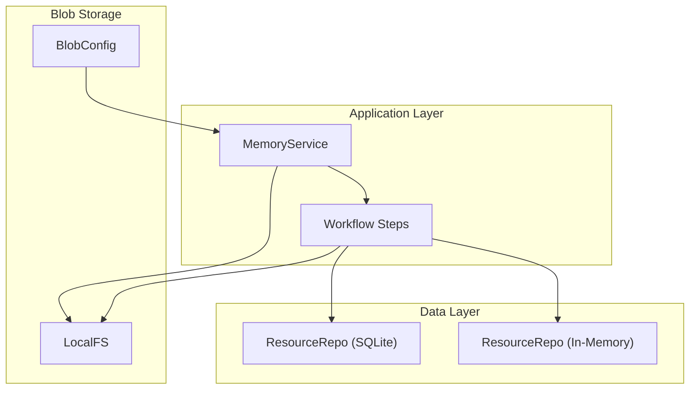
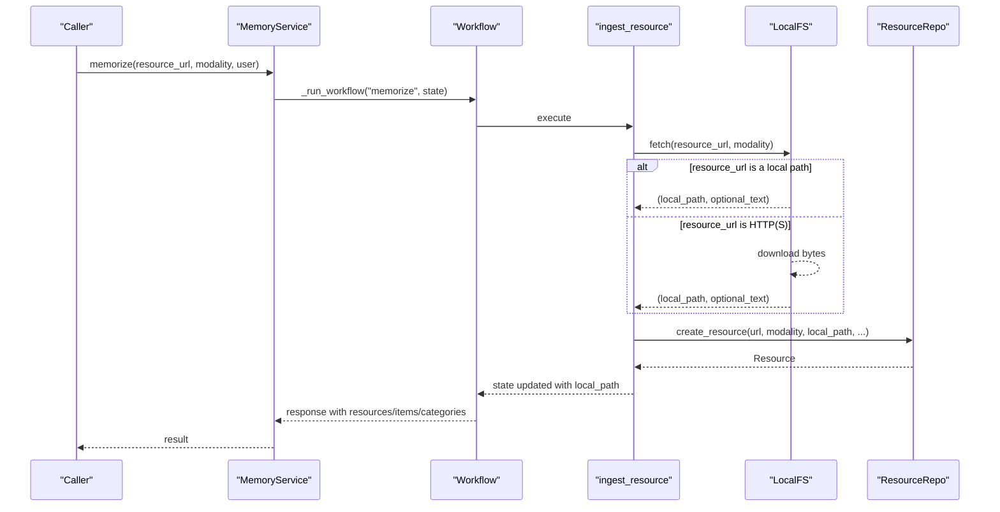
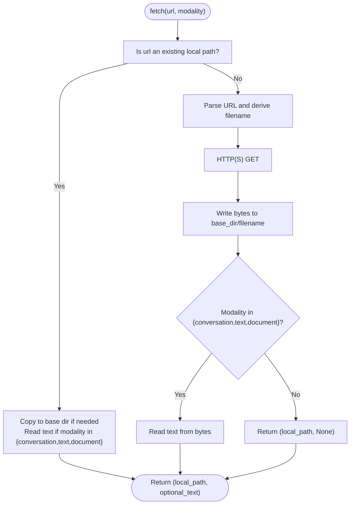
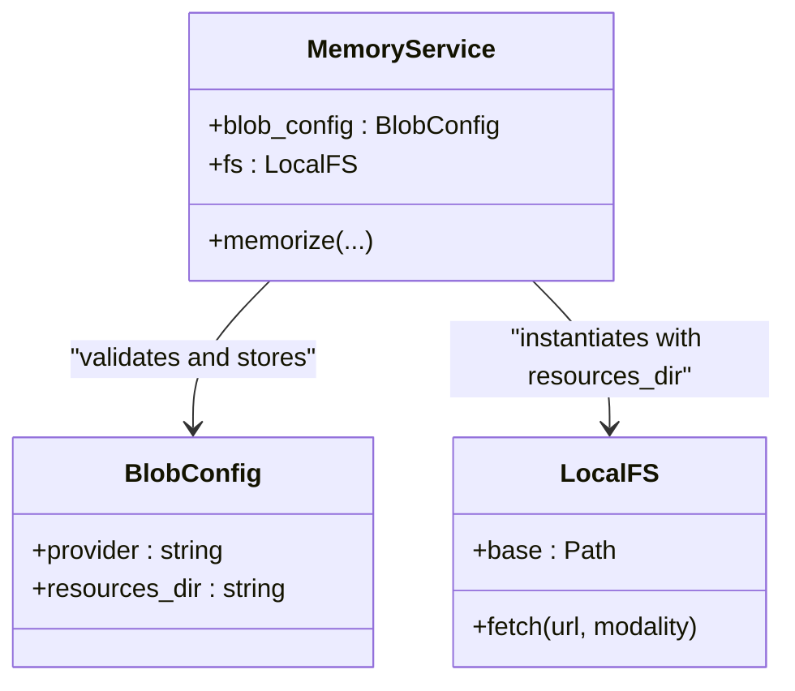
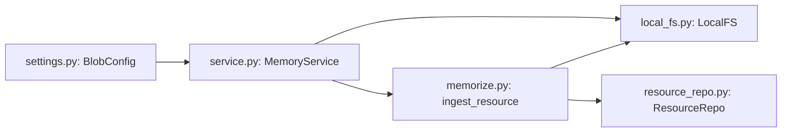

# Blob Storage Configuration

<cite>
**Referenced Files in This Document**
- [local_fs.py](file://src/memu/blob/local_fs.py)
- [settings.py](file://src/memu/app/settings.py)
- [service.py](file://src/memu/app/service.py)
- [memorize.py](file://src/memu/app/memorize.py)
- [architecture.md](file://docs/architecture.md)
- [example_1_conversation_memory.py](file://examples/example_1_conversation_memory.py)
- [test_nebius_provider.py](file://examples/test_nebius_provider.py)
- [resource_repo.py (SQLite)](file://src/memu/database/sqlite/repositories/resource_repo.py)
- [resource_repo.py (In-Memory)](file://src/memu/database/inmemory/repositories/resource_repo.py)
</cite>

## Table of Contents
1. [Introduction](#introduction)
2. [Project Structure](#project-structure)
3. [Core Components](#core-components)
4. [Architecture Overview](#architecture-overview)
5. [Detailed Component Analysis](#detailed-component-analysis)
6. [Dependency Analysis](#dependency-analysis)
7. [Performance Considerations](#performance-considerations)
8. [Troubleshooting Guide](#troubleshooting-guide)
9. [Conclusion](#conclusion)
10. [Appendices](#appendices)

## Introduction
This document explains how blob storage is configured and used within MemoryService. It focuses on the BlobConfig structure and the LocalFS implementation for file-based storage, how resource directories are managed, how file paths are handled, and how blob storage integrates with memory operations. It also provides practical configuration examples for different deployment scenarios, discusses permissions and storage limits, outlines cleanup policies, and addresses performance considerations for large-scale blob storage and potential integration with cloud storage solutions.

## Project Structure
Blob storage configuration and usage are centered around:
- BlobConfig: A typed configuration for blob storage, including provider selection and the resources directory.
- LocalFS: A file-system-backed blob fetcher that resolves URLs to local files and downloads remote resources when needed.
- MemoryService: The orchestration layer that validates BlobConfig, instantiates LocalFS, and wires it into the memorize workflow.
- Resource repositories: Persist Resource records with local_path, enabling retrieval and lifecycle management.

**Diagram sources**
- [settings.py](file://src/memu/app/settings.py#L141-L143)
- [service.py](file://src/memu/app/service.py#L50-L95)
- [local_fs.py](file://src/memu/blob/local_fs.py#L10-L81)
- [memorize.py](file://src/memu/app/memorize.py#L181-L184)
- [resource_repo.py (SQLite)](file://src/memu/database/sqlite/repositories/resource_repo.py#L137-L154)
- [resource_repo.py (In-Memory)](file://src/memu/database/inmemory/repositories/resource_repo.py#L33-L54)

**Section sources**
- [architecture.md](file://docs/architecture.md#L1-L50)
- [settings.py](file://src/memu/app/settings.py#L141-L143)
- [service.py](file://src/memu/app/service.py#L50-L95)

## Core Components
- BlobConfig: Defines the blob storage provider and the resources directory used by LocalFS.
- LocalFS: Provides asynchronous fetching of resources from either local paths or HTTP(S) URLs, writing files into the configured resources directory and returning a local path plus optional text content for text-based modalities.
- MemoryService: Validates BlobConfig, constructs LocalFS with resources_dir, and injects it into the memorize workflow so that ingest_resource step obtains a local_path for downstream processing.
- Resource repositories: Persist Resource records with url, modality, local_path, and other metadata, enabling listing, clearing, and retrieval of resources.

**Section sources**
- [settings.py](file://src/memu/app/settings.py#L141-L143)
- [local_fs.py](file://src/memu/blob/local_fs.py#L10-L81)
- [service.py](file://src/memu/app/service.py#L50-L95)
- [memorize.py](file://src/memu/app/memorize.py#L181-L184)
- [resource_repo.py (SQLite)](file://src/memu/database/sqlite/repositories/resource_repo.py#L137-L154)
- [resource_repo.py (In-Memory)](file://src/memu/database/inmemory/repositories/resource_repo.py#L33-L54)

## Architecture Overview
Blob storage is part of the ingestion pipeline. The memorize workflow’s ingest_resource step calls LocalFS.fetch to materialize the resource locally, then passes the local_path forward for multimodal preprocessing and memory extraction.

**Diagram sources**
- [memorize.py](file://src/memu/app/memorize.py#L65-L95)
- [memorize.py](file://src/memu/app/memorize.py#L181-L184)
- [local_fs.py](file://src/memu/blob/local_fs.py#L57-L81)
- [resource_repo.py (SQLite)](file://src/memu/database/sqlite/repositories/resource_repo.py#L137-L154)
- [resource_repo.py (In-Memory)](file://src/memu/database/inmemory/repositories/resource_repo.py#L33-L54)

## Detailed Component Analysis

### BlobConfig
- Purpose: Encapsulates blob storage configuration for MemoryService.
- Fields:
  - provider: Storage provider identifier (default "local").
  - resources_dir: Base directory for storing downloaded or copied resources (default "./data/resources").

Usage:
- MemoryService validates and stores BlobConfig, then initializes LocalFS with resources_dir.

**Section sources**
- [settings.py](file://src/memu/app/settings.py#L141-L143)
- [service.py](file://src/memu/app/service.py#L65-L66)
- [service.py](file://src/memu/app/service.py#L70)

### LocalFS
Responsibilities:
- Accepts a base directory (resources_dir) and ensures it exists.
- fetch(url, modality):
  - If url points to an existing local path, copies it into the base directory if needed and returns the destination path and optional text for text-based modalities.
  - If url is HTTP(S), downloads the content, writes it to a clean filename derived from the URL, and returns the destination path and optional text for text-based modalities.

Filename derivation:
- Extracts the basename from the URL path.
- If ambiguous or ends with a generic script-like extension, infers a proper extension from query parameters or falls back to a modality-based default.

Text handling:
- For modalities "conversation", "text", and "document", returns decoded text content along with the local path.

Asynchronous behavior:
- Uses an async HTTP client for remote downloads.

**Diagram sources**
- [local_fs.py](file://src/memu/blob/local_fs.py#L10-L81)

**Section sources**
- [local_fs.py](file://src/memu/blob/local_fs.py#L10-L81)

### MemoryService Integration
- Validates BlobConfig and constructs LocalFS with resources_dir.
- The memorize workflow’s ingest_resource step calls fs.fetch to obtain a local_path and optional text, which are then passed to subsequent steps for preprocessing and memory extraction.

**Diagram sources**
- [service.py](file://src/memu/app/service.py#L50-L95)
- [settings.py](file://src/memu/app/settings.py#L141-L143)
- [local_fs.py](file://src/memu/blob/local_fs.py#L10-L13)

**Section sources**
- [service.py](file://src/memu/app/service.py#L50-L95)
- [memorize.py](file://src/memu/app/memorize.py#L181-L184)

### Resource Persistence and Cleanup
- Resource records include local_path, enabling downstream operations to access the materialized file.
- Clearing resources deletes both the persisted records and removes the underlying files from the file system.

**Section sources**
- [resource_repo.py (SQLite)](file://src/memu/database/sqlite/repositories/resource_repo.py#L137-L154)
- [resource_repo.py (In-Memory)](file://src/memu/database/inmemory/repositories/resource_repo.py#L33-L54)

## Dependency Analysis
- MemoryService depends on BlobConfig and constructs LocalFS from resources_dir.
- The memorize workflow depends on LocalFS for resource ingestion.
- Resource repositories depend on local_path to manage persisted resources.

**Diagram sources**
- [settings.py](file://src/memu/app/settings.py#L141-L143)
- [service.py](file://src/memu/app/service.py#L50-L95)
- [local_fs.py](file://src/memu/blob/local_fs.py#L10-L81)
- [memorize.py](file://src/memu/app/memorize.py#L181-L184)
- [resource_repo.py (SQLite)](file://src/memu/database/sqlite/repositories/resource_repo.py#L137-L154)

**Section sources**
- [settings.py](file://src/memu/app/settings.py#L141-L143)
- [service.py](file://src/memu/app/service.py#L50-L95)
- [memorize.py](file://src/memu/app/memorize.py#L181-L184)

## Performance Considerations
- I/O throughput: LocalFS writes downloaded content synchronously to disk; ensure the resources_dir resides on fast storage (SSD) for large-scale usage.
- Concurrency: The workflow stages are asynchronous; LocalFS uses an async HTTP client for downloads. Coordinate with embedding and LLM clients to avoid I/O bottlenecks.
- File system limits: On Unix-like systems, tune ulimit and file descriptor limits; on Windows, ensure sufficient disk space and handle antivirus interference.
- Caching: Reuse local_path across steps to minimize repeated downloads; avoid redundant fetches for the same URL.
- Cleanup: Implement periodic cleanup of stale or unused files in resources_dir to control disk usage.
- Scaling: For multi-node deployments, mount a shared file system or integrate with cloud storage (see Integration Guidance below).

[No sources needed since this section provides general guidance]

## Troubleshooting Guide
- Permission denied when writing to resources_dir:
  - Ensure the process has write permissions to the configured directory.
  - On Unix-like systems, check umask and group membership.
- HTTP download failures:
  - Verify network connectivity and proxy settings.
  - Confirm URL accessibility and presence of required headers.
- Filename collisions:
  - LocalFS derives clean filenames; if conflicts occur, adjust the URL or pre-stage files with unique names.
- Missing text content:
  - LocalFS returns text only for modalities "conversation", "text", and "document"; for others, expect None.

**Section sources**
- [local_fs.py](file://src/memu/blob/local_fs.py#L57-L81)

## Conclusion
Blob storage in MemoryService is intentionally simple and robust: a typed configuration (BlobConfig) and a straightforward file-system fetcher (LocalFS) integrate seamlessly into the memorize workflow. By carefully configuring resources_dir, managing permissions and disk quotas, and implementing cleanup policies, you can operate reliably at scale. For cloud-native deployments, consider mounting shared storage or integrating with cloud blob backends while preserving the same interface contract.

[No sources needed since this section summarizes without analyzing specific files]

## Appendices

### Configuration Examples

- Minimal local configuration
  - Set provider to "local" and resources_dir to a writable path.
  - Example initialization patterns are demonstrated in the examples.

- Using a mounted shared directory
  - Mount a network drive or persistent volume to resources_dir for multi-instance setups.

- Using a cloud-backed file system
  - Mount cloud storage (e.g., S3 via s3fs, Azure Files via cifs) to resources_dir transparently.

- Environment-based configuration
  - Export OPENAI_API_KEY and initialize MemoryService similarly to the examples.

**Section sources**
- [example_1_conversation_memory.py](file://examples/example_1_conversation_memory.py#L64-L79)
- [test_nebius_provider.py](file://examples/test_nebius_provider.py#L119-L134)

### File System Permissions and Storage Limits
- Permissions:
  - Ensure the service account has read/write access to resources_dir.
  - Restrict write access to trusted processes to prevent tampering.
- Storage limits:
  - Monitor disk usage and enforce quotas on resources_dir.
  - Rotate logs and periodically prune old or unused files.
- Cleanup policy:
  - Implement a scheduled job to remove files older than a retention period.
  - Use repository clear operations to remove persisted records and underlying files.

**Section sources**
- [resource_repo.py (SQLite)](file://src/memu/database/sqlite/repositories/resource_repo.py#L89-L135)
- [resource_repo.py (In-Memory)](file://src/memu/database/inmemory/repositories/resource_repo.py#L33-L54)

### Integration Guidance for Cloud Storage
- Contract:
  - LocalFS exposes fetch(url, modality) returning (local_path, optional_text).
- Options:
  - Replace LocalFS with a cloud-aware implementation that:
    - Resolves URLs to cloud URIs.
    - Downloads to a local staging area or streams via a cloud SDK.
    - Returns a local_path for downstream processing.
  - Alternatively, mount cloud storage to resources_dir and keep LocalFS unchanged.

[No sources needed since this section provides general guidance]