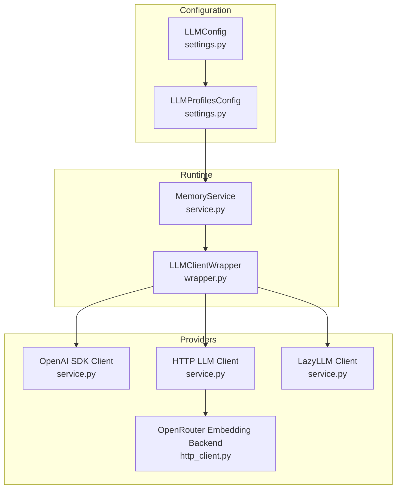
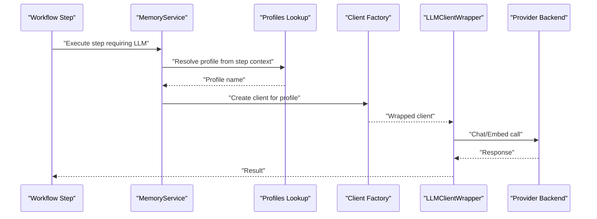
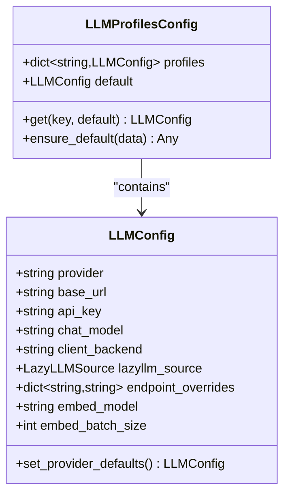
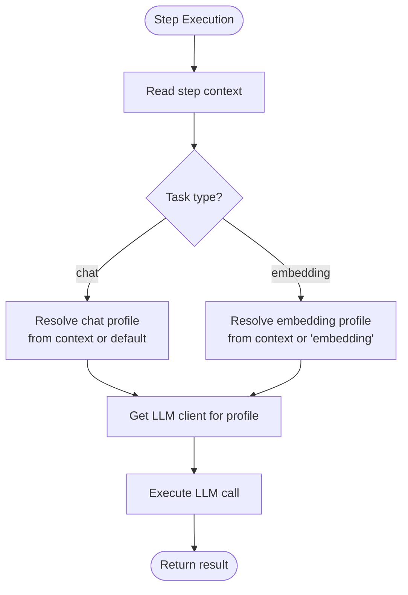
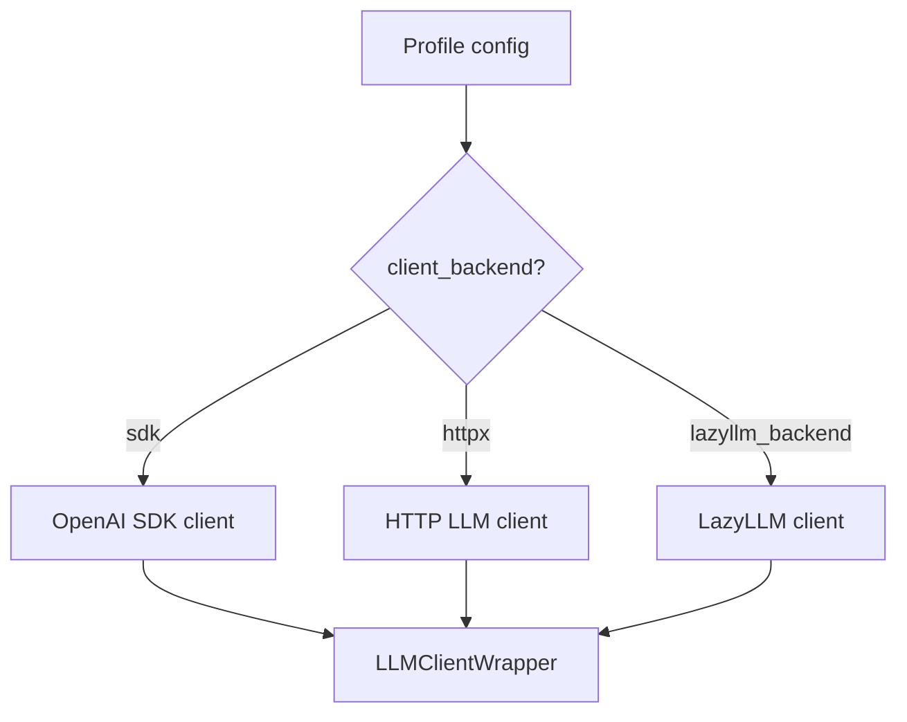
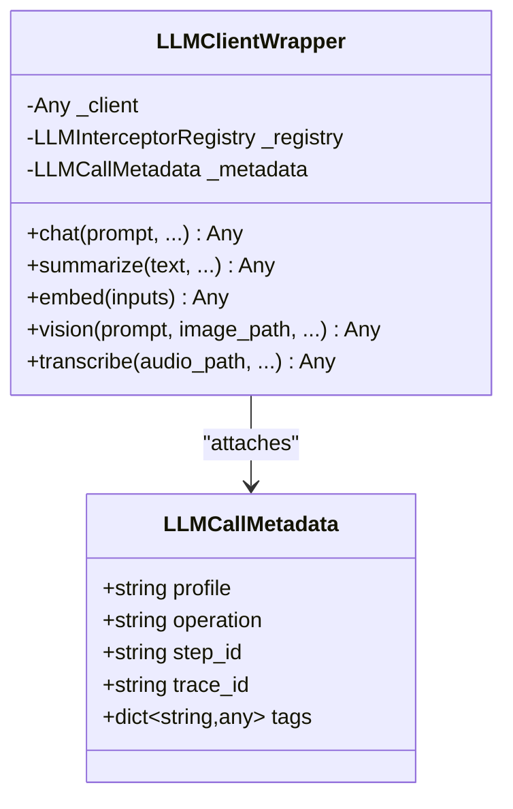
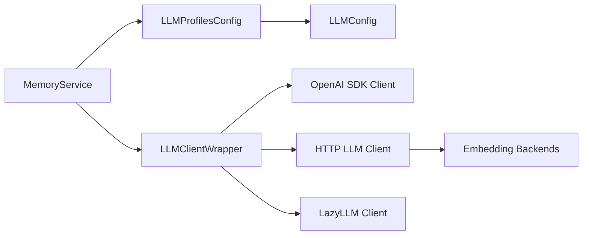

# LLM Profiles Configuration

<cite>
**Referenced Files in This Document**
- [settings.py](file://src/memu/app/settings.py)
- [service.py](file://src/memu/app/service.py)
- [wrapper.py](file://src/memu/llm/wrapper.py)
- [http_client.py](file://src/memu/llm/http_client.py)
- [grok.md](file://docs/providers/grok.md)
- [example_4_openrouter_memory.py](file://examples/example_4_openrouter_memory.py)
- [test_grok_provider.py](file://tests/llm/test_grok_provider.py)
</cite>

## Table of Contents
1. [Introduction](#introduction)
2. [Project Structure](#project-structure)
3. [Core Components](#core-components)
4. [Architecture Overview](#architecture-overview)
5. [Detailed Component Analysis](#detailed-component-analysis)
6. [Dependency Analysis](#dependency-analysis)
7. [Performance Considerations](#performance-considerations)
8. [Troubleshooting Guide](#troubleshooting-guide)
9. [Conclusion](#conclusion)
10. [Appendices](#appendices)

## Introduction
This document explains how to configure and operate LLM profiles in MemoryService. It covers the LLMProfilesConfig structure, default and named profiles, provider-specific settings, credential management, and how profiles are resolved at runtime during workflow steps. Practical examples demonstrate single-provider and multi-provider configurations, and guidance is provided for production-grade deployments.

## Project Structure
The LLM profiles feature spans configuration models, service initialization, client wrapping, and provider backends:
- Configuration models define LLMConfig and LLMProfilesConfig
- MemoryService resolves profiles and selects clients for chat and embedding tasks
- LLMClientWrapper instruments LLM calls and attaches metadata
- Provider backends implement HTTP and SDK clients for different providers

**Diagram sources**
- [settings.py](file://src/memu/app/settings.py#L102-L127)
- [settings.py](file://src/memu/app/settings.py#L263-L297)
- [service.py](file://src/memu/app/service.py#L97-L124)
- [service.py](file://src/memu/app/service.py#L168-L226)
- [wrapper.py](file://src/memu/llm/wrapper.py#L226-L448)
- [http_client.py](file://src/memu/llm/http_client.py#L288-L300)

**Section sources**
- [settings.py](file://src/memu/app/settings.py#L102-L127)
- [settings.py](file://src/memu/app/settings.py#L263-L297)
- [service.py](file://src/memu/app/service.py#L97-L124)
- [wrapper.py](file://src/memu/llm/wrapper.py#L226-L448)
- [http_client.py](file://src/memu/llm/http_client.py#L288-L300)

## Core Components
- LLMConfig defines provider identity, base URL, API key field name, chat and embedding models, client backend selection, and optional endpoint overrides.
- LLMProfilesConfig is a typed dictionary of named profiles keyed by string identifiers, ensuring a default profile exists and providing convenience accessors.

Key behaviors:
- Default profile creation and embedding fallback
- Provider-specific defaults (e.g., Grok)
- Profile resolution for chat vs embedding tasks

**Section sources**
- [settings.py](file://src/memu/app/settings.py#L102-L127)
- [settings.py](file://src/memu/app/settings.py#L263-L297)

## Architecture Overview
The runtime flow for profile-driven LLM calls:
1. MemoryService loads LLMProfilesConfig and registers available profiles
2. For each workflow step, the service resolves the appropriate profile based on step context
3. The service instantiates a client according to the selected profile’s backend
4. LLMClientWrapper wraps the underlying client, capturing metadata and enabling interceptors
5. Calls are executed via the chosen backend (SDK, HTTP, or LazyLLM)

**Diagram sources**
- [service.py](file://src/memu/app/service.py#L168-L226)
- [wrapper.py](file://src/memu/llm/wrapper.py#L226-L448)

## Detailed Component Analysis

### LLMProfilesConfig and LLMConfig
- LLMProfilesConfig enforces presence of a default profile and an embedding profile, defaulting to the default profile if missing.
- LLMConfig encapsulates provider identity, base URL, API key field name, chat and embedding models, client backend, and optional overrides.
- Provider-specific defaults are applied when provider is set to specific values (e.g., Grok).

**Diagram sources**
- [settings.py](file://src/memu/app/settings.py#L102-L127)
- [settings.py](file://src/memu/app/settings.py#L263-L297)

**Section sources**
- [settings.py](file://src/memu/app/settings.py#L102-L127)
- [settings.py](file://src/memu/app/settings.py#L263-L297)

### Profile Resolution During Runtime
- MemoryService resolves the profile for chat tasks using step context keys and falls back to the default profile.
- For embedding tasks, it uses a dedicated embedding profile or falls back to the embedding profile.
- The resolved profile is used to initialize the appropriate client backend.

**Diagram sources**
- [service.py](file://src/memu/app/service.py#L208-L226)

**Section sources**
- [service.py](file://src/memu/app/service.py#L168-L226)

### Client Initialization and Backends
- MemoryService chooses among SDK, HTTP, or LazyLLM backends based on profile configuration.
- SDK backend uses provider-specific SDKs (e.g., OpenAI).
- HTTP backend supports OpenAI-compatible APIs and provider-specific overrides.
- LazyLLM backend enables broader provider ecosystems.

**Diagram sources**
- [service.py](file://src/memu/app/service.py#L97-L124)
- [wrapper.py](file://src/memu/llm/wrapper.py#L226-L448)

**Section sources**
- [service.py](file://src/memu/app/service.py#L97-L124)

### LLM Call Instrumentation and Metadata
- LLMClientWrapper wraps provider clients and captures metadata such as profile, operation, step ID, trace ID, and tags.
- Interceptors can be registered to run before, after, or on errors, enabling observability and policy enforcement.

**Diagram sources**
- [wrapper.py](file://src/memu/llm/wrapper.py#L89-L96)
- [wrapper.py](file://src/memu/llm/wrapper.py#L226-L448)

**Section sources**
- [wrapper.py](file://src/memu/llm/wrapper.py#L89-L96)
- [wrapper.py](file://src/memu/llm/wrapper.py#L226-L448)

### Provider-Specific Settings and Backends
- Grok provider defaults are applied when provider is set to the Grok identifier, including base URL and model.
- OpenRouter embedding backend is supported via HTTP client.
- Doubao and OpenRouter embeddings are supported through dedicated embedding backends.

**Section sources**
- [settings.py](file://src/memu/app/settings.py#L128-L139)
- [http_client.py](file://src/memu/llm/http_client.py#L288-L300)
- [grok.md](file://docs/providers/grok.md#L25-L31)

## Dependency Analysis
- LLMProfilesConfig depends on LLMConfig for individual profile definitions.
- MemoryService depends on LLMProfilesConfig to resolve profiles and on client factories to instantiate backends.
- LLMClientWrapper depends on the underlying client implementation and the interceptor registry.
- HTTP client integrates with provider-specific embedding backends.

**Diagram sources**
- [settings.py](file://src/memu/app/settings.py#L263-L297)
- [service.py](file://src/memu/app/service.py#L97-L124)
- [wrapper.py](file://src/memu/llm/wrapper.py#L226-L448)
- [http_client.py](file://src/memu/llm/http_client.py#L288-L300)

**Section sources**
- [settings.py](file://src/memu/app/settings.py#L263-L297)
- [service.py](file://src/memu/app/service.py#L97-L124)
- [wrapper.py](file://src/memu/llm/wrapper.py#L226-L448)
- [http_client.py](file://src/memu/llm/http_client.py#L288-L300)

## Performance Considerations
- Client backend choice impacts latency and throughput; SDK backends often provide optimized request handling, while HTTP backends offer flexibility for diverse providers.
- Batch embedding sizes can be tuned via profile configuration to balance throughput and cost.
- Interceptors add overhead; use filters to limit invocation scope.

[No sources needed since this section provides general guidance]

## Troubleshooting Guide
Common issues and resolutions:
- Provider defaults not applied: Ensure provider is set to recognized identifiers so automatic defaults are triggered.
- Missing embedding profile: LLMProfilesConfig ensures an embedding profile exists; verify configuration includes an embedding key if you rely on it.
- HTTP client endpoint mismatches: Use endpoint overrides to align with provider-specific paths.
- Grok connectivity: Confirm API key environment variable and base URL alignment with provider defaults.

**Section sources**
- [settings.py](file://src/memu/app/settings.py#L128-L139)
- [settings.py](file://src/memu/app/settings.py#L269-L288)
- [http_client.py](file://src/memu/llm/http_client.py#L288-L300)
- [grok.md](file://docs/providers/grok.md#L51-L56)

## Conclusion
LLM profiles in MemoryService provide a flexible, typed mechanism to configure and switch between providers and settings. By leveraging LLMProfilesConfig and MemoryService’s runtime resolution, applications can seamlessly operate multiple providers, manage credentials safely, and instrument calls for observability.

[No sources needed since this section summarizes without analyzing specific files]

## Appendices

### Practical Examples

- Single-provider configuration with OpenRouter
  - Demonstrates configuring a single profile for chat and embedding using an HTTP backend and a provider-specific base URL and model.
  - See example usage in the provided script.

  **Section sources**
  - [example_4_openrouter_memory.py](file://examples/example_4_openrouter_memory.py#L66-L76)

- Multi-provider configuration
  - Define multiple named profiles under LLMProfilesConfig, each with distinct provider, base URL, API key field, and models.
  - Resolve profiles per step using step context keys for chat and embedding tasks.

  **Section sources**
  - [settings.py](file://src/memu/app/settings.py#L263-L297)
  - [service.py](file://src/memu/app/service.py#L208-L226)

- Credential management
  - Store provider API keys in environment variables and reference them via the API key field in LLMConfig.
  - For provider-specific defaults (e.g., Grok), ensure the referenced environment variable is set.

  **Section sources**
  - [settings.py](file://src/memu/app/settings.py#L108)
  - [grok.md](file://docs/providers/grok.md#L19-L23)

- Provider-specific settings
  - Grok defaults are applied when provider is set to the Grok identifier.
  - OpenRouter embedding backend is supported via HTTP client.

  **Section sources**
  - [settings.py](file://src/memu/app/settings.py#L128-L139)
  - [http_client.py](file://src/memu/llm/http_client.py#L288-L300)

- Production best practices
  - Centralize credential storage and rotation.
  - Use explicit endpoint overrides only when necessary.
  - Monitor token usage and latency via interceptors.
  - Keep provider defaults aligned with current provider offerings.

[No sources needed since this section provides general guidance]