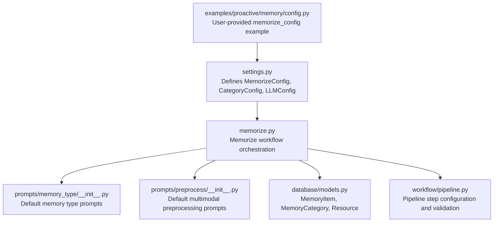
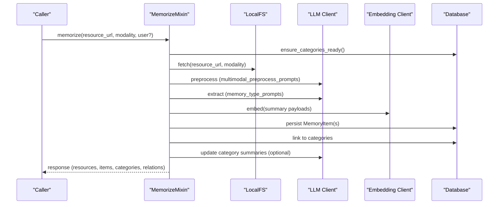
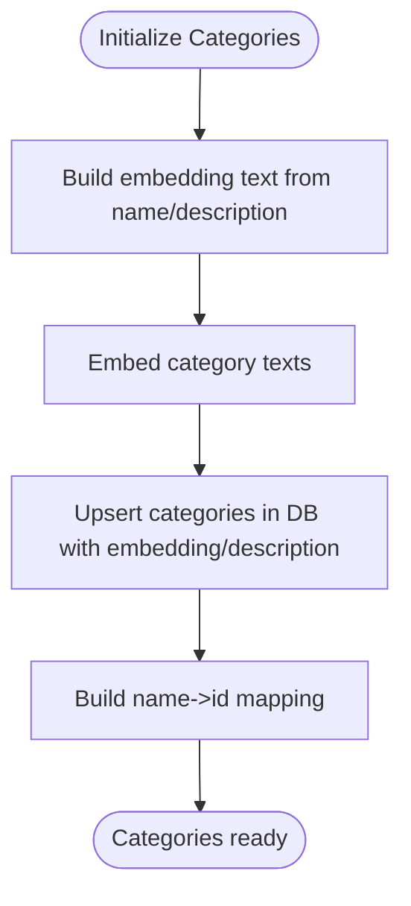
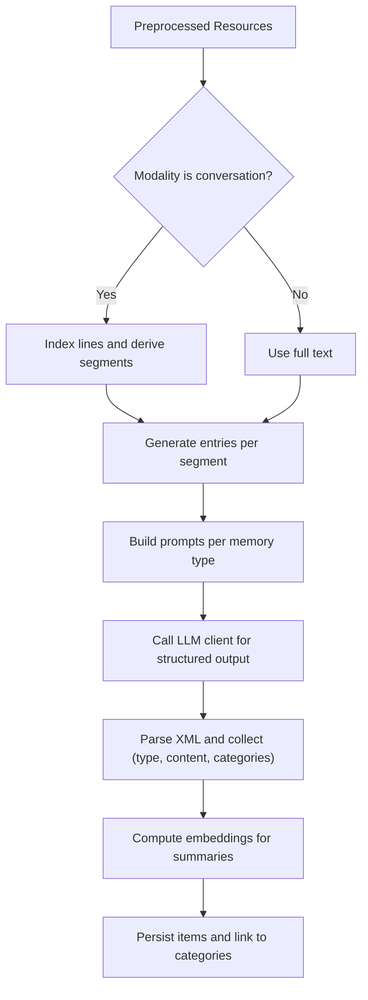
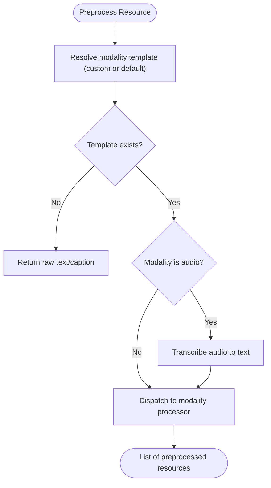
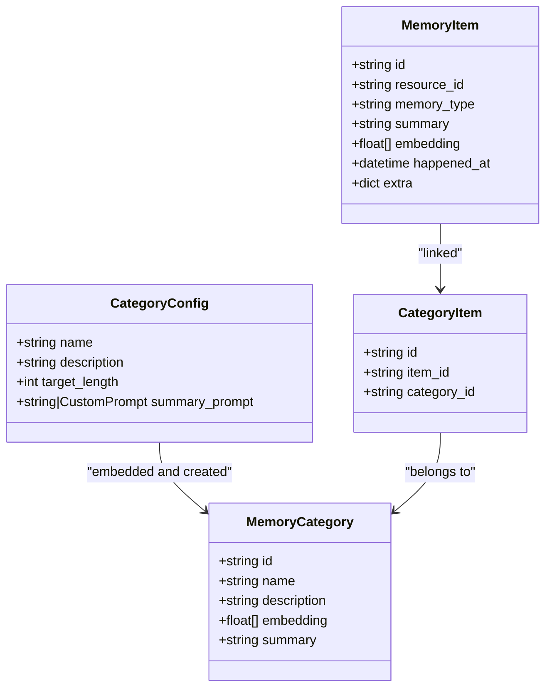
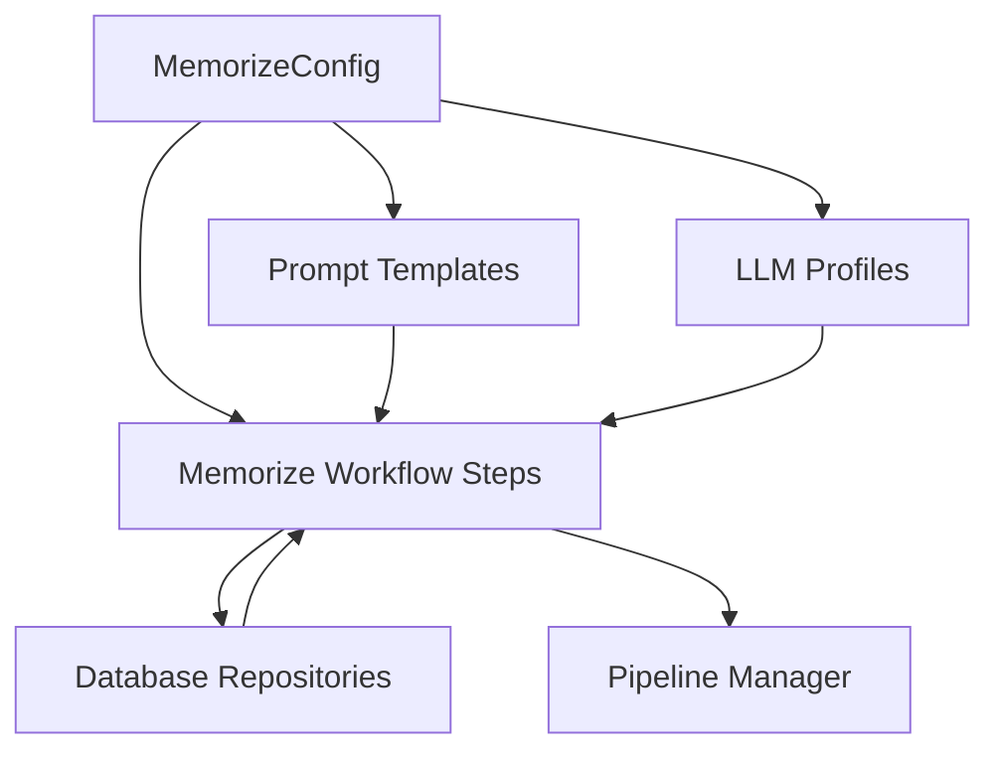

# Memorize Configuration

<cite>
**Referenced Files in This Document**
- [settings.py](file://src/memu/app/settings.py)
- [memorize.py](file://src/memu/app/memorize.py)
- [models.py](file://src/memu/database/models.py)
- [__init__.py](file://src/memu/prompts/memory_type/__init__.py)
- [conversation.py](file://src/memu/prompts/preprocess/conversation.py)
- [__init__.py](file://src/memu/prompts/preprocess/__init__.py)
- [pipeline.py](file://src/memu/workflow/pipeline.py)
- [config.py](file://examples/proactive/memory/config.py)
</cite>

## Table of Contents
1. [Introduction](#introduction)
2. [Project Structure](#project-structure)
3. [Core Components](#core-components)
4. [Architecture Overview](#architecture-overview)
5. [Detailed Component Analysis](#detailed-component-analysis)
6. [Dependency Analysis](#dependency-analysis)
7. [Performance Considerations](#performance-considerations)
8. [Troubleshooting Guide](#troubleshooting-guide)
9. [Conclusion](#conclusion)
10. [Appendices](#appendices)

## Introduction
This document explains the Memorize configuration system that controls how the system ingests, preprocesses, extracts, categorizes, and persists memories from diverse modalities (text, conversation, audio, video, image). It focuses on the MemorizeConfig structure, including memory_categories, extraction settings, and processing parameters. It also details category configuration, memory item extraction rules, preprocessing options, and the relationship between categories and memory organization. Practical examples illustrate different extraction strategies for varied use cases, and guidance is provided for performance tuning, batch processing, and quality control.

## Project Structure
The Memorize configuration spans several modules:
- Settings define the configuration models and defaults.
- The memorize workflow orchestrates ingestion, preprocessing, extraction, deduplication, categorization, persistence, and response building.
- Prompts provide default extraction instructions and preprocessing templates.
- Models define the persisted entities and their fields.
- Pipeline management governs step-level configuration and capability validation.

**Diagram sources**
- [settings.py](file://src/memu/app/settings.py#L204-L243)
- [memorize.py](file://src/memu/app/memorize.py#L97-L166)
- [__init__.py](file://src/memu/prompts/memory_type/__init__.py#L1-L47)
- [__init__.py](file://src/memu/prompts/preprocess/__init__.py#L1-L12)
- [models.py](file://src/memu/database/models.py#L12-L149)
- [pipeline.py](file://src/memu/workflow/pipeline.py#L21-L171)
- [config.py](file://examples/proactive/memory/config.py#L1-L67)

**Section sources**
- [settings.py](file://src/memu/app/settings.py#L204-L243)
- [memorize.py](file://src/memu/app/memorize.py#L97-L166)
- [__init__.py](file://src/memu/prompts/memory_type/__init__.py#L1-L47)
- [__init__.py](file://src/memu/prompts/preprocess/__init__.py#L1-L12)
- [models.py](file://src/memu/database/models.py#L12-L149)
- [pipeline.py](file://src/memu/workflow/pipeline.py#L21-L171)
- [config.py](file://examples/proactive/memory/config.py#L1-L67)

## Core Components
- MemorizeConfig: Central configuration for memory extraction and categorization, including:
  - memory_categories: Global category definitions embedded at startup.
  - memory_types: Ordered list of memory types to extract.
  - memory_type_prompts: Overrides for extraction prompts per memory type.
  - multimodal_preprocess_prompts: Per-modality preprocessing prompts.
  - LLM profiles for preprocessing, extraction, and category summarization.
  - Quality and reference controls: enable_item_references, enable_item_reinforcement.
- CategoryConfig: Defines category name, description, optional target length, and optional summary prompt.
- Memory types: Supported types include profile, event, knowledge, behavior, skill, tool.
- Models: Resource, MemoryItem, MemoryCategory, CategoryItem define persisted entities and fields.

Key configuration fields and their roles:
- memory_categories: Provides category embeddings and names used to map extracted items to categories.
- memory_types: Determines which extraction prompts are applied.
- memory_type_prompts: Allows customizing extraction behavior per memory type.
- multimodal_preprocess_prompts: Controls how each modality is preprocessed before extraction.
- LLM profiles: Select which LLM backend and model to use for each phase.
- enable_item_references and enable_item_reinforcement: Control advanced features for traceability and quality.

**Section sources**
- [settings.py](file://src/memu/app/settings.py#L67-L90)
- [settings.py](file://src/memu/app/settings.py#L204-L243)
- [models.py](file://src/memu/database/models.py#L12-L149)
- [__init__.py](file://src/memu/prompts/memory_type/__init__.py#L3-L4)
- [memorize.py](file://src/memu/app/memorize.py#L648-L687)

## Architecture Overview
The Memorize workflow is a pipeline with distinct steps, each consuming required inputs and producing outputs for subsequent steps. The configuration influences which prompts are used, which LLM profile is selected, and how categories are initialized and updated.

**Diagram sources**
- [memorize.py](file://src/memu/app/memorize.py#L65-L95)
- [memorize.py](file://src/memu/app/memorize.py#L97-L166)
- [memorize.py](file://src/memu/app/memorize.py#L181-L325)
- [memorize.py](file://src/memu/app/memorize.py#L578-L623)
- [memorize.py](file://src/memu/app/memorize.py#L283-L297)

## Detailed Component Analysis

### MemorizeConfig Structure and Fields
MemorizeConfig defines:
- category_assign_threshold: Threshold for category assignment.
- multimodal_preprocess_prompts: Modality-specific preprocessing prompts (string or CustomPrompt).
- preprocess_llm_profile: LLM profile for preprocessing.
- memory_types: Ordered list of memory types to extract.
- memory_type_prompts: Overrides for extraction prompts per memory type.
- memory_extract_llm_profile: LLM profile for extraction.
- memory_categories: Global category definitions.
- default_category_summary_prompt: Default prompt for category summaries.
- default_category_summary_target_length: Target length for auto-generated summaries.
- category_update_llm_profile: LLM profile for updating category summaries.
- enable_item_references: Enable inline citations in category summaries.
- enable_item_reinforcement: Enable reinforcement tracking for items.

These fields influence:
- Which extraction prompts are used for each memory type.
- How multimodal resources are preprocessed.
- How categories are embedded and initialized.
- Whether advanced features like item references and reinforcement are enabled.

**Section sources**
- [settings.py](file://src/memu/app/settings.py#L204-L243)

### Category Configuration and Initialization
Categories are defined by CategoryConfig and embedded at service startup. The initialization process:
- Builds category embedding text from name and description.
- Embeds category texts using the embedding client.
- Creates or retrieves categories in the database with embeddings and descriptions.
- Maintains a mapping from category name to ID for later linking.

**Diagram sources**
- [memorize.py](file://src/memu/app/memorize.py#L648-L687)
- [memorize.py](file://src/memu/app/memorize.py#L670-L674)
- [memorize.py](file://src/memu/app/memorize.py#L660-L668)

**Section sources**
- [settings.py](file://src/memu/app/settings.py#L67-L90)
- [memorize.py](file://src/memu/app/memorize.py#L648-L687)

### Memory Item Extraction Rules and Processing Parameters
Extraction behavior is governed by:
- memory_types: Determines which extraction prompts are built.
- memory_type_prompts: Overrides default prompts per memory type.
- multimodal_preprocess_prompts: Controls preprocessing before extraction.
- conversation segmentation: For conversation modality, segments are derived from indexed lines and processed individually.

Processing parameters:
- Segment-based extraction for conversations uses indexed lines to define start/end bounds.
- Extraction sends prompts to the LLM client and parses XML-formatted responses into structured entries.
- Embeddings are computed for each summary payload and stored with items.
- Optional reinforcement tracking and item references are controlled by configuration flags.

**Diagram sources**
- [memorize.py](file://src/memu/app/memorize.py#L484-L509)
- [memorize.py](file://src/memu/app/memorize.py#L511-L534)
- [memorize.py](file://src/memu/app/memorize.py#L536-L553)
- [memorize.py](file://src/memu/app/memorize.py#L578-L623)

**Section sources**
- [memorize.py](file://src/memu/app/memorize.py#L484-L553)
- [memorize.py](file://src/memu/app/memorize.py#L578-L623)
- [memorize.py](file://src/memu/app/memorize.py#L690-L794)

### Preprocessing Options by Modality
Preprocessing dispatch depends on modality and configured prompts:
- conversation: Indexed segmentation and per-segment extraction.
- video/image/document/audio: Modality-specific processors invoked via templates.
- audio: Optional transcription via STT client if text is absent.
- fallback: If no template is provided, raw text is passed through.

**Diagram sources**
- [memorize.py](file://src/memu/app/memorize.py#L689-L794)
- [__init__.py](file://src/memu/prompts/preprocess/__init__.py#L3-L9)
- [conversation.py](file://src/memu/prompts/preprocess/conversation.py#L1-L44)

**Section sources**
- [memorize.py](file://src/memu/app/memorize.py#L689-L794)
- [__init__.py](file://src/memu/prompts/preprocess/__init__.py#L1-L12)
- [conversation.py](file://src/memu/prompts/preprocess/conversation.py#L1-L44)

### Relationship Between Categories and Memory Organization
Categories drive:
- Embedding-based initialization and mapping.
- Assignment of extracted items to categories via category names.
- Optional category summary updates and reference tracking.

**Diagram sources**
- [settings.py](file://src/memu/app/settings.py#L67-L90)
- [models.py](file://src/memu/database/models.py#L96-L106)

**Section sources**
- [settings.py](file://src/memu/app/settings.py#L67-L90)
- [models.py](file://src/memu/database/models.py#L96-L106)

### Examples of Configuring Different Memory Extraction Strategies
- Minimal record extraction for coding conversations:
  - Configure memory_types to include a custom record type.
  - Provide custom memory_type_prompts with objective, workflow, rules, and examples blocks.
  - Define memory_categories with a todo category and a custom summary prompt.
  - See example configuration in the proactive memory example.

- Skill extraction from operational logs:
  - Define memory_types for skill.
  - Provide custom memory_type_prompts tailored to extracting actions, outcomes, and lessons.
  - Define categories such as deployment_execution, pre_deployment_validation, incident_response_rollback, performance_monitoring, database_management, testing_verification.
  - Use multimodal_preprocess_prompts to segment long logs into manageable chunks.

- Knowledge extraction from documents:
  - Use memory_types for knowledge.
  - Provide custom memory_type_prompts focused on factual knowledge extraction.
  - Define categories like Programming, Domain Knowledge, etc.
  - Leverage document preprocessing prompts to clean and structure text.

- Profile and behavior extraction:
  - Use memory_types for profile and behavior.
  - Provide custom prompts that emphasize user traits, preferences, and behavioral patterns.
  - Define categories aligned with personal_info, preferences, relationships, habits, etc.

Note: The example configuration demonstrates a record extraction setup with a todo category and custom prompts. Adjust memory_types, memory_type_prompts, and memory_categories according to your domain and desired extraction granularity.

**Section sources**
- [config.py](file://examples/proactive/memory/config.py#L1-L67)
- [__init__.py](file://src/memu/prompts/memory_type/__init__.py#L1-L47)

## Dependency Analysis
The Memorize workflow depends on:
- Configuration models (MemorizeConfig, CategoryConfig) for runtime behavior.
- Prompt templates for extraction and preprocessing.
- LLM profiles for selecting clients and models.
- Database repositories for persistence and retrieval.
- Pipeline manager for validating step configurations and capabilities.

**Diagram sources**
- [settings.py](file://src/memu/app/settings.py#L204-L243)
- [memorize.py](file://src/memu/app/memorize.py#L97-L166)
- [pipeline.py](file://src/memu/workflow/pipeline.py#L21-L171)

**Section sources**
- [settings.py](file://src/memu/app/settings.py#L204-L243)
- [memorize.py](file://src/memu/app/memorize.py#L97-L166)
- [pipeline.py](file://src/memu/workflow/pipeline.py#L21-L171)

## Performance Considerations
- Embedding batch size: LLMConfig embed_batch_size controls batch size for embedding API calls. Larger batches reduce API calls but increase memory usage.
- LLM profiles: Use separate profiles for preprocessing, extraction, and category updates to isolate costs and throughput.
- Conversation segmentation: Breaking long conversations into segments reduces context size per extraction call, improving reliability and cost.
- Reinforcement and references: enable_item_reinforcement and enable_item_references add computational overhead; enable only when needed.
- Vector index provider: DatabaseConfig selects vector index provider (bruteforce, pgvector) and DSN, impacting retrieval performance.
- Pipeline validation: PipelineManager validates step capabilities and required state keys, preventing misconfiguration that could cause retries or failures.

[No sources needed since this section provides general guidance]

## Troubleshooting Guide
Common issues and resolutions:
- Unknown LLM profile in a step: Ensure the referenced profile exists in LLMProfilesConfig.
- Missing required state keys: Verify that earlier steps produce the keys required by downstream steps.
- Capability mismatch: Confirm that step capabilities align with available capabilities.
- No text for text-based modalities: For conversation/document, ensure text is present or preprocessing succeeds.
- Audio transcription failures: Check audio file extensions and transcription client availability.
- Category initialization failures: Verify embeddings are computed and categories are upserted correctly.

Operational checks:
- Validate LLM profiles and endpoints.
- Monitor embedding batch sizes and vector index configuration.
- Inspect conversation segmentation logic for malformed indices.

**Section sources**
- [pipeline.py](file://src/memu/workflow/pipeline.py#L131-L164)
- [memorize.py](file://src/memu/app/memorize.py#L737-L770)
- [memorize.py](file://src/memu/app/memorize.py#L689-L794)

## Conclusion
MemorizeConfig provides a comprehensive, extensible mechanism to tailor memory extraction across modalities and domains. By combining configurable memory types, category definitions, and prompt overrides with robust preprocessing and persistence workflows, teams can implement precise extraction strategies for diverse use cases while maintaining performance and quality controls.

[No sources needed since this section summarizes without analyzing specific files]

## Appendices

### Appendix A: Configuration Keys and Defaults
- memory_types: Defaults to a predefined set of memory types.
- memory_type_prompts: Defaults to built-in prompts; can be overridden per type.
- memory_categories: Defaults to a standard set of categories; can be customized.
- multimodal_preprocess_prompts: Defaults to built-in templates; can be overridden per modality.
- LLM profiles: Separate profiles for preprocessing, extraction, and category updates.
- enable_item_references: Toggle for inline citations in category summaries.
- enable_item_reinforcement: Toggle for reinforcement tracking.

**Section sources**
- [settings.py](file://src/memu/app/settings.py#L30-L36)
- [settings.py](file://src/memu/app/settings.py#L74-L89)
- [settings.py](file://src/memu/app/settings.py#L204-L243)
- [__init__.py](file://src/memu/prompts/memory_type/__init__.py#L3-L4)