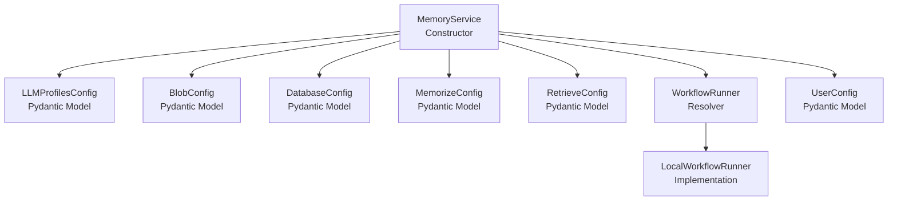
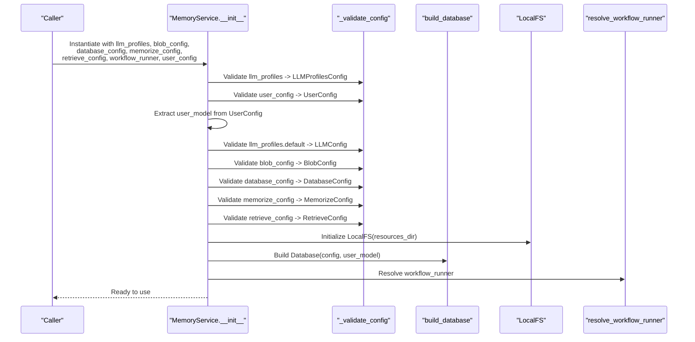
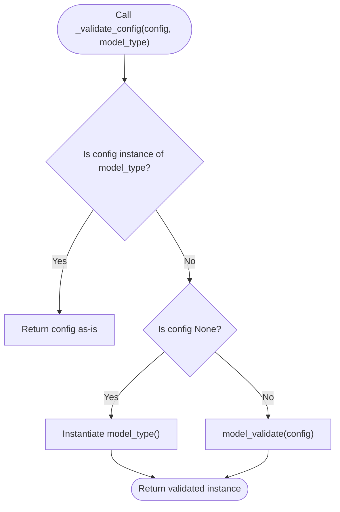
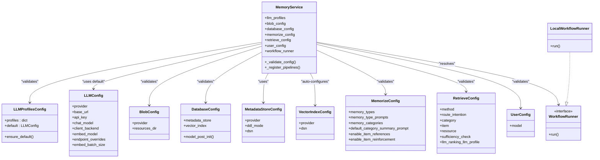

# MemoryService Constructor & Configuration

<cite>
**Referenced Files in This Document**
- [service.py](file://src/memu/app/service.py)
- [settings.py](file://src/memu/app/settings.py)
- [runner.py](file://src/memu/workflow/runner.py)
- [test_inmemory.py](file://tests/test_inmemory.py)
- [test_postgres.py](file://tests/test_postgres.py)
- [sqlite.md](file://docs/sqlite.md)
- [README_en.md](file://readme/README_en.md)
</cite>

## Table of Contents
1. [Introduction](#introduction)
2. [Project Structure](#project-structure)
3. [Core Components](#core-components)
4. [Architecture Overview](#architecture-overview)
5. [Detailed Component Analysis](#detailed-component-analysis)
6. [Dependency Analysis](#dependency-analysis)
7. [Performance Considerations](#performance-considerations)
8. [Troubleshooting Guide](#troubleshooting-guide)
9. [Conclusion](#conclusion)

## Introduction
This document provides comprehensive API documentation for the MemoryService constructor and its configuration options. It explains the purpose, expected types, default values, and validation behavior for each constructor parameter, and demonstrates practical configuration patterns for development, testing, and production environments. It also clarifies how configuration objects relate to each other and influence system behavior, along with configuration precedence, environment variable integration, and best practices.

## Project Structure
MemoryService resides in the application layer alongside supporting configuration models and workflow runners. The constructor orchestrates initialization of LLM profiles, blob storage, database, memorize/retrieve configurations, user scope, and workflow execution.

**Diagram sources**
- [service.py](file://src/memu/app/service.py#L49-L95)
- [settings.py](file://src/memu/app/settings.py#L102-L321)
- [runner.py](file://src/memu/workflow/runner.py#L28-L81)

**Section sources**
- [service.py](file://src/memu/app/service.py#L49-L95)
- [settings.py](file://src/memu/app/settings.py#L102-L321)
- [runner.py](file://src/memu/workflow/runner.py#L28-L81)

## Core Components
This section documents the MemoryService constructor parameters, their expected types, defaults, and validation behavior using Pydantic models.

- llm_profiles: LLMProfilesConfig | dict[str, Any] | None
  - Purpose: Defines LLM provider profiles (default and optional embedding profile).
  - Expected type: Pydantic model or dict convertible to the model.
  - Default: Ensures presence of "default" and "embedding" keys; missing keys are populated from the default profile.
  - Validation: Uses model_validate; ensures "default" and "embedding" profiles exist.
  - Behavior: Provides llm_config via default profile for general LLM operations.
  - Related: Influences LLM client selection and backend behavior.

- blob_config: BlobConfig | dict[str, Any] | None
  - Purpose: Configures blob storage provider and resource directory.
  - Expected type: Pydantic model or dict convertible to the model.
  - Default: provider="local", resources_dir="./data/resources".
  - Validation: Uses model_validate.
  - Behavior: Initializes LocalFS for resource persistence.

- database_config: DatabaseConfig | dict[str, Any] | None
  - Purpose: Configures metadata store and vector index backends.
  - Expected type: Pydantic model or dict convertible to the model.
  - Default: metadata_store.provider="inmemory"; vector_index auto-configured based on metadata_store.provider.
  - Validation: Uses model_validate; post-initialization auto-fills vector_index if absent.
  - Behavior: Builds a Database instance via build_database using user_model.

- memorize_config: MemorizeConfig | dict[str, Any] | None
  - Purpose: Controls memory extraction, categorization, and summarization behavior.
  - Expected type: Pydantic model or dict convertible to the model.
  - Default: Includes default memory categories, prompts, thresholds, and flags.
  - Validation: Uses model_validate.
  - Behavior: Seeds category_configs and category_config_map for downstream processing.

- retrieve_config: RetrieveConfig | dict[str, Any] | None
  - Purpose: Controls retrieval strategy (RAG vs LLM), ranking, and sufficiency checks.
  - Expected type: Pydantic model or dict convertible to the model.
  - Default: method="rag", route_intention=True, sufficiency_check=True, category/item/resource enabled with top_k defaults.
  - Validation: Uses model_validate.
  - Behavior: Guides retrieval workflows and ranking strategies.

- workflow_runner: WorkflowRunner | str | None
  - Purpose: Selects the workflow execution backend.
  - Expected type: Existing WorkflowRunner instance, runner name string, or None.
  - Default: "local" runner resolved via resolve_workflow_runner.
  - Validation: resolve_workflow_runner validates runner name against registered factories.
  - Behavior: Executes pipeline steps asynchronously using the selected runner.

- user_config: UserConfig | dict[str, Any] | None
  - Purpose: Defines the user scope model used for filtering and scoping memory operations.
  - Expected type: Pydantic model or dict convertible to the model.
  - Default: model=DefaultUserModel.
  - Validation: Uses model_validate.
  - Behavior: Exposes user_model for database initialization and filtering.

Validation behavior summary:
- _validate_config accepts None, an instance of the target model, or a dict, and returns a validated model instance.
- For LLMProfilesConfig, ensure_default guarantees "default" and "embedding" profiles exist.
- For DatabaseConfig, model_post_init auto-configures vector_index based on metadata_store.provider.

**Section sources**
- [service.py](file://src/memu/app/service.py#L50-L69)
- [service.py](file://src/memu/app/service.py#L380-L389)
- [settings.py](file://src/memu/app/settings.py#L263-L297)
- [settings.py](file://src/memu/app/settings.py#L310-L321)
- [runner.py](file://src/memu/workflow/runner.py#L61-L81)

## Architecture Overview
The MemoryService constructor initializes interconnected subsystems using validated configuration objects. The following diagram maps constructor parameters to their downstream effects.

**Diagram sources**
- [service.py](file://src/memu/app/service.py#L50-L95)

## Detailed Component Analysis

### MemoryService Constructor Parameters
- llm_profiles
  - Type: LLMProfilesConfig | dict[str, Any] | None
  - Default: Ensures "default" and "embedding" profiles; missing "embedding" mirrors "default".
  - Validation: model_validate; model_validator ensures defaults for known providers.
  - Impact: Supplies LLMConfig for general operations and enables profile-specific routing.

- blob_config
  - Type: BlobConfig | dict[str, Any] | None
  - Default: provider="local", resources_dir="./data/resources".
  - Validation: model_validate.
  - Impact: Initializes LocalFS for resource persistence.

- database_config
  - Type: DatabaseConfig | dict[str, Any] | None
  - Default: metadata_store.provider="inmemory"; vector_index auto-configured.
  - Validation: model_validate; model_post_init sets vector_index provider and DSN.
  - Impact: Determines metadata storage and vector indexing backend.

- memorize_config
  - Type: MemorizeConfig | dict[str, Any] | None
  - Default: Includes default memory categories, prompts, thresholds, and flags.
  - Validation: model_validate.
  - Impact: Seeds category definitions and prompts for memory extraction.

- retrieve_config
  - Type: RetrieveConfig | dict[str, Any] | None
  - Default: method="rag", route_intention=True, sufficiency_check=True.
  - Validation: model_validate.
  - Impact: Controls retrieval strategy and ranking behavior.

- workflow_runner
  - Type: WorkflowRunner | str | None
  - Default: "local".
  - Validation: resolve_workflow_runner validates and instantiates runner.
  - Impact: Selects execution backend for pipeline steps.

- user_config
  - Type: UserConfig | dict[str, Any] | None
  - Default: model=DefaultUserModel.
  - Validation: model_validate.
  - Impact: Provides user scope model for filtering and database initialization.

**Section sources**
- [service.py](file://src/memu/app/service.py#L50-L69)
- [settings.py](file://src/memu/app/settings.py#L102-L127)
- [settings.py](file://src/memu/app/settings.py#L141-L144)
- [settings.py](file://src/memu/app/settings.py#L310-L321)
- [settings.py](file://src/memu/app/settings.py#L204-L243)
- [settings.py](file://src/memu/app/settings.py#L175-L202)
- [runner.py](file://src/memu/workflow/runner.py#L61-L81)

### Configuration Validation Flow
The _validate_config static method encapsulates validation logic for all configuration objects.

**Diagram sources**
- [service.py](file://src/memu/app/service.py#L380-L389)

**Section sources**
- [service.py](file://src/memu/app/service.py#L380-L389)

### Practical Configuration Examples

#### Development Environment (In-Memory Storage)
- Use in-memory metadata store for ephemeral testing.
- Configure LLM provider via llm_profiles.
- Keep retrieve_config.simple for quick iteration.

Example pattern:
- llm_profiles: Minimal provider configuration with api_key.
- database_config: metadata_store.provider="inmemory".
- retrieve_config: method="rag" with route_intention and sufficiency_check enabled.

**Section sources**
- [test_inmemory.py](file://tests/test_inmemory.py#L17-L36)

#### Testing Environment (SQLite)
- Persist memory data to a file-based SQLite database.
- Useful for CI/CD and repeatable tests.

Example pattern:
- database_config: metadata_store.provider="sqlite" with dsn pointing to a file.
- Optionally use in-memory SQLite for speed: sqlite:///:memory:.

**Section sources**
- [sqlite.md](file://docs/sqlite.md#L14-L53)

#### Production Environment (PostgreSQL)
- Use PostgreSQL for scalable, concurrent storage.
- Auto-configuration sets vector_index to pgvector when metadata_store.provider="postgres".

Example pattern:
- database_config: metadata_store.provider="postgres", dsn set to a valid PostgreSQL URL, ddl_mode="create".
- retrieve_config: method="rag" for robust vector search.

**Section sources**
- [test_postgres.py](file://tests/test_postgres.py#L18-L29)

#### Custom LLM Provider (Aliyun DashScope)
- Configure llm_profiles with custom base_url and models.
- Supports separate "embedding" profile for vectorization.

Example pattern:
- llm_profiles: "default" with base_url, api_key, chat_model; "embedding" with embed_model.

**Section sources**
- [README_en.md](file://readme/README_en.md#L320-L342)

#### OpenRouter Integration
- Use OpenRouter as a unified provider with flexible model selection.
- Configure provider="openrouter" and client_backend="httpx".

Example pattern:
- llm_profiles: "default" with provider="openrouter", base_url, api_key, chat_model, embed_model.
- database_config: metadata_store.provider="inmemory" for simplicity.

**Section sources**
- [README_en.md](file://readme/README_en.md#L350-L369)

### Configuration Precedence and Interactions
- LLMProfilesConfig ensures "default" and "embedding" profiles exist; if "embedding" is omitted, it mirrors "default".
- DatabaseConfig auto-configures vector_index based on metadata_store.provider; if provider is "postgres", vector_index becomes "pgvector" and inherits DSN.
- UserConfig supplies the user_model used by build_database for scoping.
- workflow_runner resolution defaults to "local" if unspecified.

Impact on system behavior:
- LLM profiles drive client backend selection and model choices.
- BlobConfig determines resource persistence location.
- DatabaseConfig selects metadata and vector backends, affecting performance and scaling.
- MemorizeConfig defines extraction and summarization behavior.
- RetrieveConfig governs retrieval strategy and ranking.
- WorkflowRunner controls execution semantics for pipeline steps.

**Section sources**
- [settings.py](file://src/memu/app/settings.py#L269-L288)
- [settings.py](file://src/memu/app/settings.py#L314-L321)
- [runner.py](file://src/memu/workflow/runner.py#L61-L81)

### Environment Variable Integration
- LLMConfig.api_key defaults to provider-specific environment variable placeholders (e.g., OPENAI_API_KEY).
- OpenRouter examples demonstrate setting OPENROUTER_API_KEY in environment variables.
- Database DSNs for PostgreSQL and SQLite are typically provided via environment variables in tests.

Best practices:
- Prefer environment variables for secrets (api_key, DSN).
- Use provider-specific defaults in LLMConfig to simplify configuration.
- Externalize database credentials and connection strings.

**Section sources**
- [settings.py](file://src/memu/app/settings.py#L108-L108)
- [test_postgres.py](file://tests/test_postgres.py#L10-L10)
- [sqlite.md](file://docs/sqlite.md#L354-L371)

## Dependency Analysis
The following diagram shows how MemoryService depends on configuration models and workflow runners.

**Diagram sources**
- [service.py](file://src/memu/app/service.py#L49-L95)
- [settings.py](file://src/memu/app/settings.py#L102-L321)
- [runner.py](file://src/memu/workflow/runner.py#L12-L40)

**Section sources**
- [service.py](file://src/memu/app/service.py#L49-L95)
- [settings.py](file://src/memu/app/settings.py#L102-L321)
- [runner.py](file://src/memu/workflow/runner.py#L12-L40)

## Performance Considerations
- LLM client backend selection affects latency and throughput; choose "sdk" for official SDKs or "httpx" for HTTP-based clients.
- Vector index provider impacts retrieval performance; "pgvector" offers better scalability than brute-force for large datasets.
- Database provider choice influences concurrency and persistence; PostgreSQL with pgvector is recommended for production.
- Retrieval strategy (RAG vs LLM) trades off accuracy and cost; RAG typically yields more precise results but requires vector indices.

[No sources needed since this section provides general guidance]

## Troubleshooting Guide
Common configuration issues and resolutions:
- Unknown workflow runner name: Ensure the runner name is registered or use "local" as default.
- Missing embedding profile: LLMProfilesConfig ensures "embedding" mirrors "default"; verify llm_profiles structure.
- Vector index misconfiguration: DatabaseConfig auto-configures vector_index; explicitly set provider if overriding.
- Database locked errors (SQLite): Limit concurrent writers or migrate to PostgreSQL for multi-process scenarios.
- Permission denied for SQLite: Ensure write permissions for the target directory.

**Section sources**
- [runner.py](file://src/memu/workflow/runner.py#L71-L75)
- [settings.py](file://src/memu/app/settings.py#L269-L288)
- [settings.py](file://src/memu/app/settings.py#L314-L321)
- [sqlite.md](file://docs/sqlite.md#L208-L230)

## Conclusion
MemoryService’s constructor provides a strongly typed, validated configuration interface backed by Pydantic models. By understanding parameter types, defaults, and validation behavior, you can compose robust configurations for development, testing, and production. Proper configuration precedence and interplay between LLM profiles, storage backends, retrieval strategies, and workflow runners ensure predictable system behavior and optimal performance.