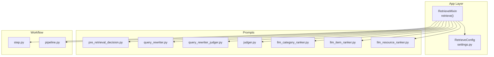
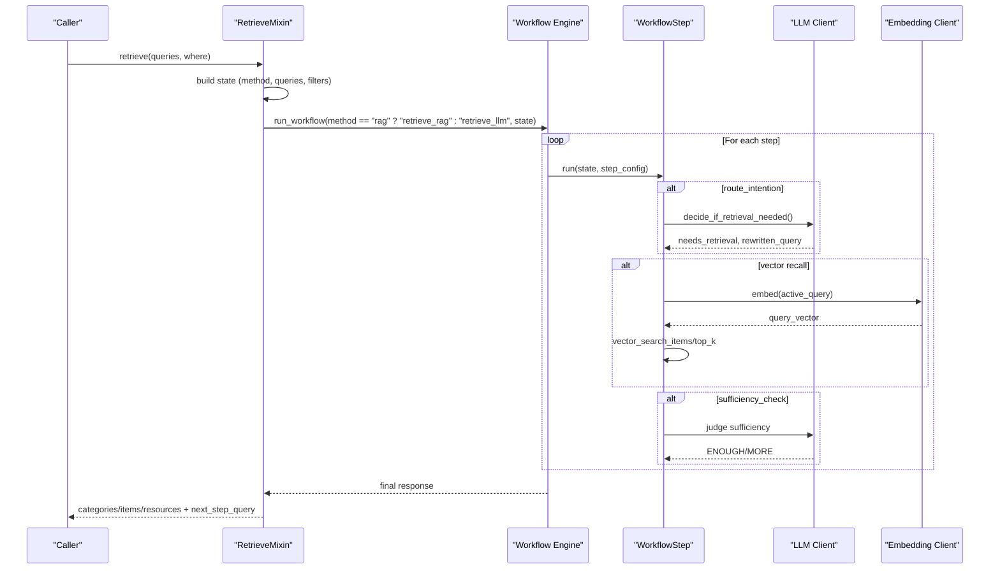
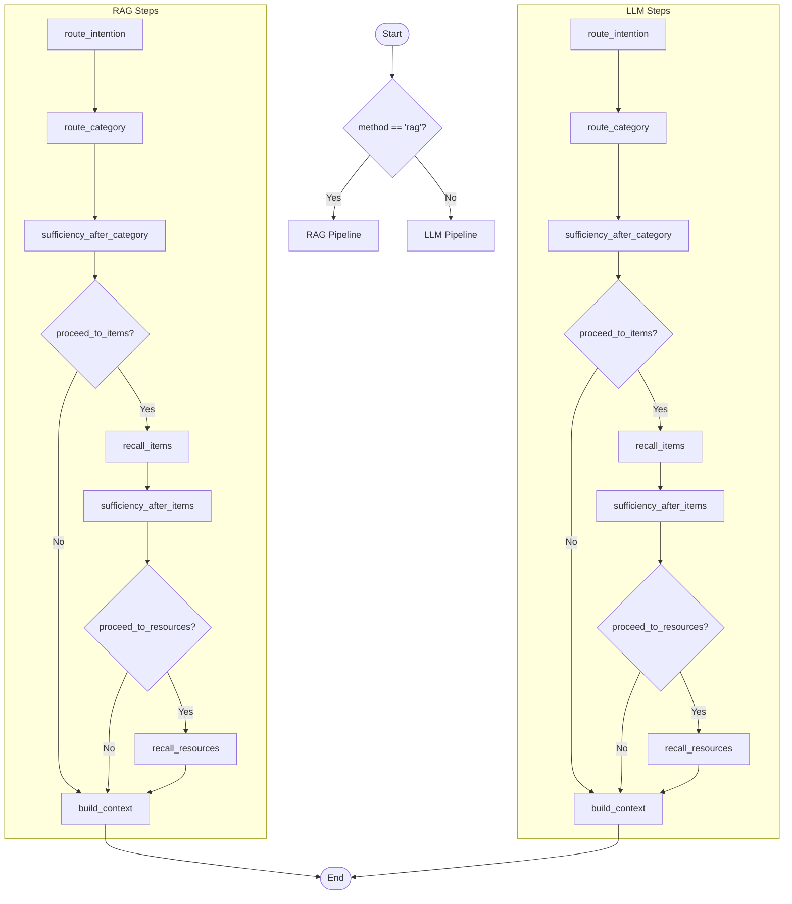
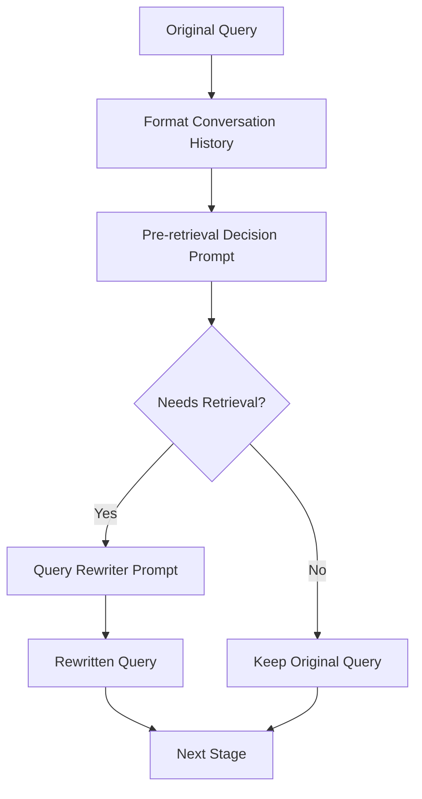
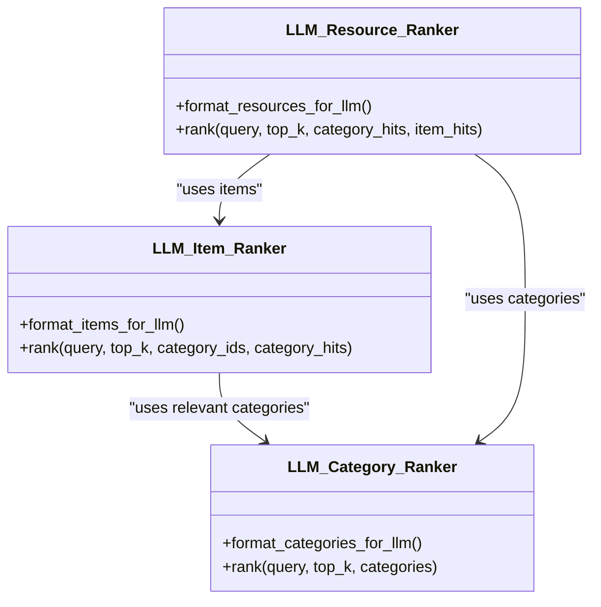
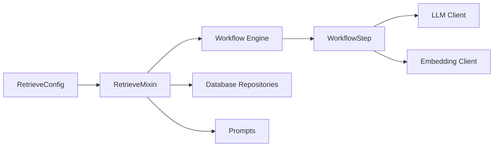

# Retrieve Configuration

<cite>
**Referenced Files in This Document**
- [retrieve.py](file://src/memu/app/retrieve.py)
- [settings.py](file://src/memu/app/settings.py)
- [pre_retrieval_decision.py](file://src/memu/prompts/retrieve/pre_retrieval_decision.py)
- [query_rewriter.py](file://src/memu/prompts/retrieve/query_rewriter.py)
- [query_rewriter_judger.py](file://src/memu/prompts/retrieve/query_rewriter_judger.py)
- [judger.py](file://src/memu/prompts/retrieve/judger.py)
- [llm_category_ranker.py](file://src/memu/prompts/retrieve/llm_category_ranker.py)
- [llm_item_ranker.py](file://src/memu/prompts/retrieve/llm_item_ranker.py)
- [llm_resource_ranker.py](file://src/memu/prompts/retrieve/llm_resource_ranker.py)
- [pipeline.py](file://src/memu/workflow/pipeline.py)
- [step.py](file://src/memu/workflow/step.py)
</cite>

## Table of Contents
1. [Introduction](#introduction)
2. [Project Structure](#project-structure)
3. [Core Components](#core-components)
4. [Architecture Overview](#architecture-overview)
5. [Detailed Component Analysis](#detailed-component-analysis)
6. [Dependency Analysis](#dependency-analysis)
7. [Performance Considerations](#performance-considerations)
8. [Troubleshooting Guide](#troubleshooting-guide)
9. [Conclusion](#conclusion)
10. [Appendices](#appendices)

## Introduction
This document explains how to configure and optimize retrieval in the system. It focuses on the RetrieveConfig structure, the dual-mode retrieval system (RAG vs LLM-based ranking), query processing settings, and retrieval parameters. It also covers query rewriting, intent detection, and context filtering, and provides practical guidance for tuning retrieval across conversational retrieval, semantic search, and proactive context loading scenarios.

## Project Structure
The retrieval system is implemented as a mixin that integrates with a workflow engine. Configuration is centralized in a Pydantic model, while prompts define the behavior of query rewriting, intent detection, and LLM-based ranking.

**Diagram sources**
- [retrieve.py](file://src/memu/app/retrieve.py#L42-L85)
- [settings.py](file://src/memu/app/settings.py#L175-L202)
- [pre_retrieval_decision.py](file://src/memu/prompts/retrieve/pre_retrieval_decision.py#L1-L54)
- [query_rewriter.py](file://src/memu/prompts/retrieve/query_rewriter.py#L1-L45)
- [query_rewriter_judger.py](file://src/memu/prompts/retrieve/query_rewriter_judger.py#L1-L49)
- [judger.py](file://src/memu/prompts/retrieve/judger.py#L1-L40)
- [llm_category_ranker.py](file://src/memu/prompts/retrieve/llm_category_ranker.py#L1-L36)
- [llm_item_ranker.py](file://src/memu/prompts/retrieve/llm_item_ranker.py#L1-L41)
- [llm_resource_ranker.py](file://src/memu/prompts/retrieve/llm_resource_ranker.py#L1-L41)
- [step.py](file://src/memu/workflow/step.py#L16-L48)
- [pipeline.py](file://src/memu/workflow/pipeline.py#L21-L171)

**Section sources**
- [retrieve.py](file://src/memu/app/retrieve.py#L1-L120)
- [settings.py](file://src/memu/app/settings.py#L175-L202)

## Core Components
- RetrieveConfig: Central configuration for retrieval behavior, including method selection, routing, sufficiency checks, and per-stage retrieval parameters.
- RetrieveMixin: Implements the retrieve() entry point and orchestrates the dual-mode retrieval workflow.
- Prompts: Define query rewriting, intent detection, and LLM-based ranking behaviors.
- Workflow engine: Provides typed steps and pipeline management for modular execution.

Key configuration attributes:
- method: Choose between "rag" (vector similarity + optional LLM sufficiency checks) and "llm" (LLM-driven search and ranking).
- route_intention: Enable/disable intent detection and query rewriting.
- category/item/resource: Per-stage toggles and top_k controls.
- sufficiency_check and sufficiency_check_prompt/sufficiency_check_llm_profile: Configure iterative sufficiency checks and LLM profile for judgment.
- llm_ranking_llm_profile: LLM profile for LLM-based ranking steps.

**Section sources**
- [settings.py](file://src/memu/app/settings.py#L146-L202)
- [retrieve.py](file://src/memu/app/retrieve.py#L42-L85)

## Architecture Overview
The retrieval system supports two execution modes controlled by RetrieveConfig.method:

- RAG mode: Uses vector similarity for category and item recall, cosine similarity for resource recall, and optional LLM-based sufficiency checks between stages.
- LLM mode: Delegates search and ranking to LLM prompts per stage, with optional sufficiency checks.

**Diagram sources**
- [retrieve.py](file://src/memu/app/retrieve.py#L42-L85)
- [retrieve.py](file://src/memu/app/retrieve.py#L106-L210)
- [retrieve.py](file://src/memu/app/retrieve.py#L454-L536)
- [step.py](file://src/memu/workflow/step.py#L40-L101)
- [pipeline.py](file://src/memu/workflow/pipeline.py#L47-L123)

## Detailed Component Analysis

### RetrieveConfig Structure
RetrieveConfig governs the entire retrieval pipeline. It includes:
- method: "rag" or "llm".
- route_intention: Whether to detect intent and rewrite queries.
- category/item/resource: Feature flags and top_k per stage.
- sufficiency_check: Enable iterative sufficiency checks after each stage.
- sufficiency_check_prompt and sufficiency_check_llm_profile: Prompt and LLM profile for sufficiency decisions.
- llm_ranking_llm_profile: LLM profile for LLM-based ranking steps.

Per-stage configuration:
- category.enabled and category.top_k
- item.enabled, item.top_k, item.use_category_references, item.ranking, item.recency_decay_days
- resource.enabled and resource.top_k

**Section sources**
- [settings.py](file://src/memu/app/settings.py#L146-L202)

### Dual-Mode Retrieval System
- RAG mode:
  - Intent detection and query rewriting via LLM when enabled.
  - Category recall uses summary embeddings and cosine_topk.
  - Item recall uses vector_search_items with configurable ranking and recency decay.
  - Resource recall uses cosine similarity over stored embeddings.
  - Sufficiency checks can trigger query rewriting and re-embedding between stages.

- LLM mode:
  - Intent detection and query rewriting via LLM when enabled.
  - Category ranking uses a dedicated LLM prompt.
  - Item ranking filters items by category relevance and ranks them.
  - Resource ranking uses context from categories and items to rank resources.
  - Optional sufficiency checks after each stage.

**Diagram sources**
- [retrieve.py](file://src/memu/app/retrieve.py#L106-L210)
- [retrieve.py](file://src/memu/app/retrieve.py#L454-L536)

**Section sources**
- [retrieve.py](file://src/memu/app/retrieve.py#L42-L85)
- [retrieve.py](file://src/memu/app/retrieve.py#L106-L210)
- [retrieve.py](file://src/memu/app/retrieve.py#L454-L536)

### Query Processing Settings
- route_intention: Enables intent detection and query rewriting before retrieval.
- skip_rewrite: Skips rewriting when processing single-turn queries.
- sufficiency_check: Iterative sufficiency checks after each stage.
- sufficiency_check_prompt and sufficiency_check_llm_profile: Customize judgment prompts and LLM profile.
- llm_ranking_llm_profile: Profile for LLM-based ranking steps.

**Section sources**
- [retrieve.py](file://src/memu/app/retrieve.py#L42-L85)
- [retrieve.py](file://src/memu/app/retrieve.py#L228-L258)
- [settings.py](file://src/memu/app/settings.py#L190-L202)

### Retrieval Parameters
- category.top_k: Number of categories to retrieve.
- item.top_k: Number of items to retrieve.
- item.use_category_references: When insufficient categories are retrieved, follow [ref:ITEM_ID] citations to fetch referenced items.
- item.ranking: "similarity" (cosine) or "salience" (reinforcement + recency).
- item.recency_decay_days: Half-life for recency decay in salience scoring.
- resource.top_k: Number of resources to retrieve.

**Section sources**
- [settings.py](file://src/memu/app/settings.py#L146-L173)
- [retrieve.py](file://src/memu/app/retrieve.py#L359-L367)

### Query Rewriting and Intent Detection
- Pre-retrieval decision prompt defines when retrieval is needed and how to rewrite queries.
- Query rewriter prompt transforms ambiguous or pronoun-heavy queries into explicit, self-contained forms.
- Combined judger prompt performs both rewriting and sufficiency judgment in one step.

**Diagram sources**
- [retrieve.py](file://src/memu/app/retrieve.py#L746-L784)
- [pre_retrieval_decision.py](file://src/memu/prompts/retrieve/pre_retrieval_decision.py#L1-L54)
- [query_rewriter.py](file://src/memu/prompts/retrieve/query_rewriter.py#L1-L45)
- [query_rewriter_judger.py](file://src/memu/prompts/retrieve/query_rewriter_judger.py#L1-L49)

**Section sources**
- [retrieve.py](file://src/memu/app/retrieve.py#L746-L784)
- [pre_retrieval_decision.py](file://src/memu/prompts/retrieve/pre_retrieval_decision.py#L1-L54)
- [query_rewriter.py](file://src/memu/prompts/retrieve/query_rewriter.py#L1-L45)
- [query_rewriter_judger.py](file://src/memu/prompts/retrieve/query_rewriter_judger.py#L1-L49)
- [judger.py](file://src/memu/prompts/retrieve/judger.py#L1-L40)

### Context Filtering
- where filters are normalized against the user model fields and applied to each stage’s repository calls.
- Unknown filter fields raise errors to prevent invalid scopes.

**Section sources**
- [retrieve.py](file://src/memu/app/retrieve.py#L87-L104)

### LLM-Based Ranking Prompts
- Category ranking prompt: Given a query and available categories, select and rank up to top_k relevant categories.
- Item ranking prompt: Given relevant categories, select and rank up to top_k items.
- Resource ranking prompt: Given context (categories and items), select and rank up to top_k resources.

**Diagram sources**
- [llm_category_ranker.py](file://src/memu/prompts/retrieve/llm_category_ranker.py#L1-L36)
- [llm_item_ranker.py](file://src/memu/prompts/retrieve/llm_item_ranker.py#L1-L41)
- [llm_resource_ranker.py](file://src/memu/prompts/retrieve/llm_resource_ranker.py#L1-L41)
- [retrieve.py](file://src/memu/app/retrieve.py#L1216-L1323)

**Section sources**
- [llm_category_ranker.py](file://src/memu/prompts/retrieve/llm_category_ranker.py#L1-L36)
- [llm_item_ranker.py](file://src/memu/prompts/retrieve/llm_item_ranker.py#L1-L41)
- [llm_resource_ranker.py](file://src/memu/prompts/retrieve/llm_resource_ranker.py#L1-L41)
- [retrieve.py](file://src/memu/app/retrieve.py#L1216-L1323)

## Dependency Analysis
- RetrieveMixin depends on:
  - RetrieveConfig for behavior flags and parameters.
  - Workflow engine for step execution and pipeline registration.
  - LLM and embedding clients for intent detection, rewriting, ranking, and embeddings.
  - Database repositories for categories, items, and resources.
- Prompts are injected into the system via configuration and used by the decision and ranking steps.
- Workflow pipeline enforces capability and profile availability, ensuring steps can run with the configured LLM profiles.

**Diagram sources**
- [retrieve.py](file://src/memu/app/retrieve.py#L42-L85)
- [settings.py](file://src/memu/app/settings.py#L175-L202)
- [step.py](file://src/memu/workflow/step.py#L16-L48)
- [pipeline.py](file://src/memu/workflow/pipeline.py#L21-L171)

**Section sources**
- [pipeline.py](file://src/memu/workflow/pipeline.py#L131-L164)
- [step.py](file://src/memu/workflow/step.py#L16-L48)

## Performance Considerations
- Method selection:
  - "rag" reduces LLM calls by relying on vector similarity and optional sufficiency checks.
  - "llm" increases LLM usage but can yield more accurate rankings.
- Ranking strategy:
  - "similarity" is faster; "salience" adds computation for reinforcement and recency weighting.
  - Adjust item.recency_decay_days to balance freshness vs. stability.
- top_k tuning:
  - Increase top_k to reduce iteration count but increase latency and cost.
  - Decrease top_k to speed up and reduce cost but risk insufficient context.
- Embedding and vector index:
  - Ensure embedding client batching and model choices align with throughput targets.
  - For pgvector, ensure proper DSN and provider selection in DatabaseConfig.
- LLM profiles:
  - Use separate profiles for sufficiency checks and ranking to isolate latency and cost.
  - Prefer lower-latency models for sufficiency checks and higher-quality models for ranking.

[No sources needed since this section provides general guidance]

## Troubleshooting Guide
Common issues and resolutions:
- Missing required state keys in workflow steps:
  - Ensure previous steps produce required keys or initialize with initial_state_keys.
- Unknown LLM profile:
  - Verify llm_profile exists in LLMProfilesConfig.
- Unknown filter field:
  - Confirm where filter keys match user model fields; otherwise, raise ValueError.
- Empty or invalid query:
  - Validate query structure and content; reject empty or malformed inputs.
- Insufficient context:
  - Enable sufficiency_check and route_intention; adjust top_k and ranking strategy.

**Section sources**
- [pipeline.py](file://src/memu/workflow/pipeline.py#L131-L164)
- [retrieve.py](file://src/memu/app/retrieve.py#L87-L104)
- [retrieve.py](file://src/memu/app/retrieve.py#L811-L840)

## Conclusion
RetrieveConfig provides a flexible, dual-mode retrieval system that balances performance and accuracy. By tuning method, ranking strategy, top_k, and sufficiency checks—and by leveraging query rewriting and intent detection—you can optimize retrieval for conversational retrieval, semantic search, and proactive context loading. Use LLM profiles strategically and monitor vector index configuration to achieve the desired balance of latency, cost, and quality.

[No sources needed since this section summarizes without analyzing specific files]

## Appendices

### Configuration Examples by Scenario
- Conversational retrieval:
  - Enable route_intention and sufficiency_check.
  - Use "rag" method with moderate top_k and "similarity" ranking for speed.
  - Set sufficiency_check_llm_profile to a fast model; keep llm_ranking_llm_profile for higher quality when needed.
- Semantic search:
  - Use "rag" with "salience" ranking and tuned recency_decay_days.
  - Increase item.top_k and resource.top_k to capture nuanced context.
- Proactive context loading:
  - Disable route_intention and sufficiency_check to minimize iterations.
  - Use "rag" with larger top_k and enable item.use_category_references to expand coverage.

[No sources needed since this section provides general guidance]