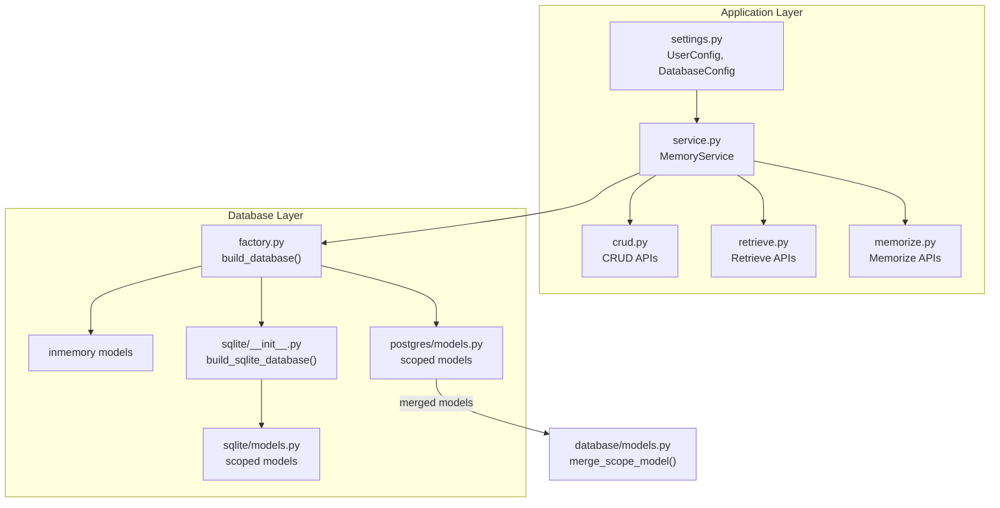
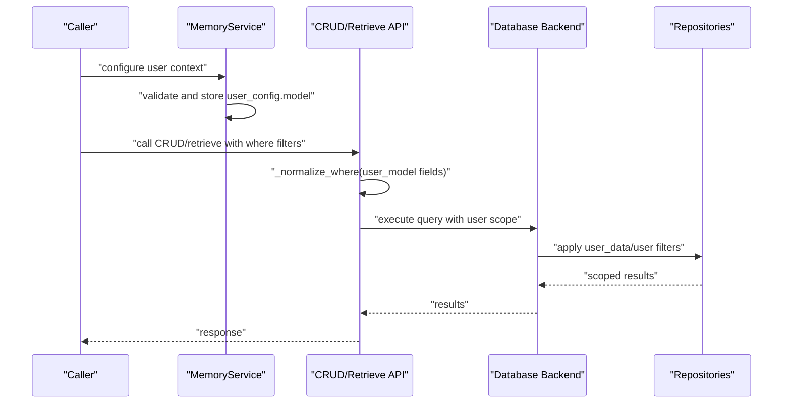
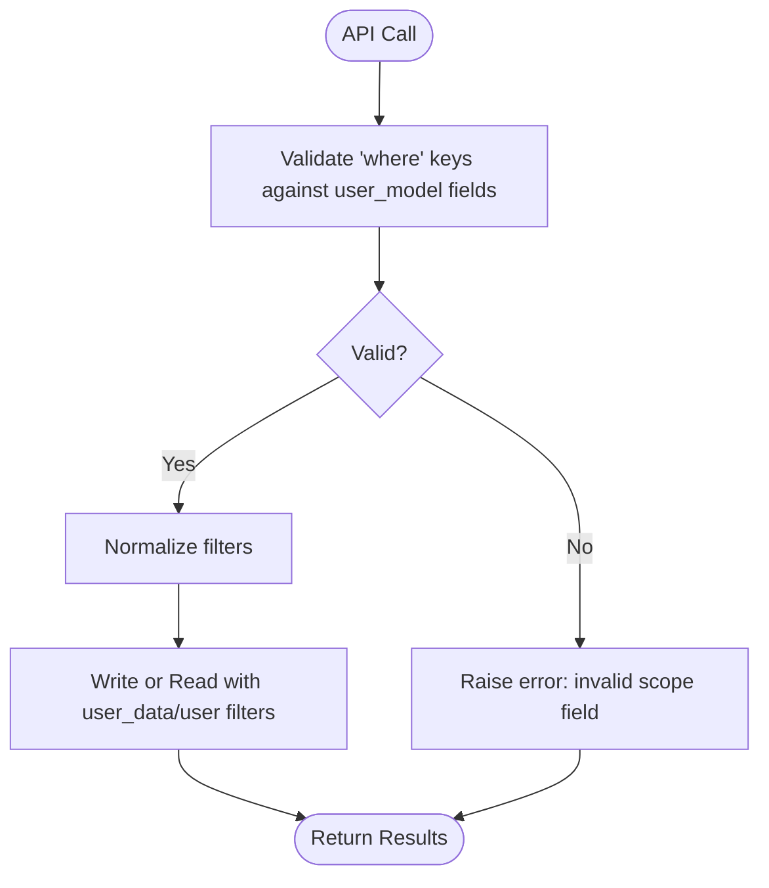
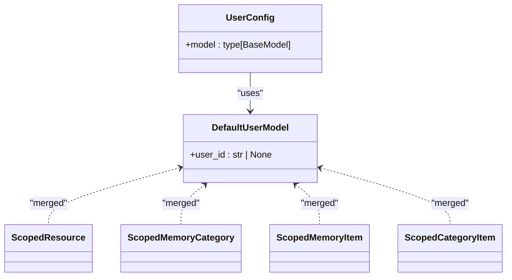
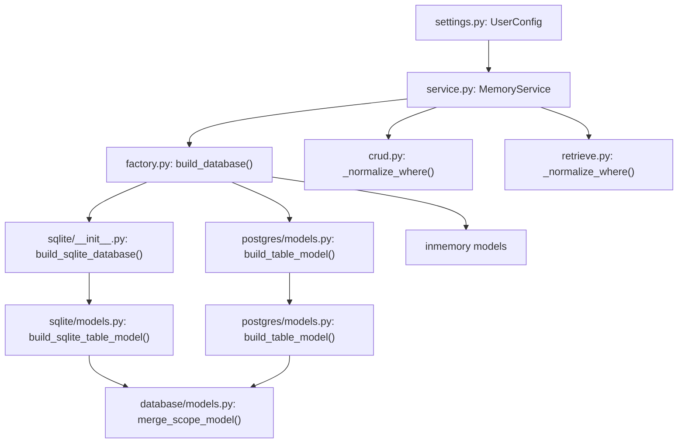

# User Configuration

<cite>
**Referenced Files in This Document**
- [settings.py](file://src/memu/app/settings.py)
- [service.py](file://src/memu/app/service.py)
- [models.py](file://src/memu/database/models.py)
- [factory.py](file://src/memu/database/factory.py)
- [sqlite/__init__.py](file://src/memu/database/sqlite/__init__.py)
- [sqlite/models.py](file://src/memu/database/sqlite/models.py)
- [postgres/models.py](file://src/memu/database/postgres/models.py)
- [crud.py](file://src/memu/app/crud.py)
- [retrieve.py](file://src/memu/app/retrieve.py)
- [memorize.py](file://src/memu/app/memorize.py)
- [sqlite.md](file://docs/sqlite.md)
- [0003-user-scope-in-data-model.md](file://docs/adr/0003-user-scope-in-data-model.md)
</cite>

## Table of Contents
1. [Introduction](#introduction)
2. [Project Structure](#project-structure)
3. [Core Components](#core-components)
4. [Architecture Overview](#architecture-overview)
5. [Detailed Component Analysis](#detailed-component-analysis)
6. [Dependency Analysis](#dependency-analysis)
7. [Performance Considerations](#performance-considerations)
8. [Troubleshooting Guide](#troubleshooting-guide)
9. [Conclusion](#conclusion)

## Introduction
This document explains user configuration options in MemoryService with a focus on the UserConfig structure and user scope management. It covers how user identification is modeled, how permissions and multi-user isolation are enforced, and how user configuration relates to database scoping. It also provides practical examples for configuring user contexts across common application scenarios, along with security and privacy considerations.

## Project Structure
The user configuration and scoping mechanism spans several modules:
- Application settings define the UserConfig model and related configuration structures.
- MemoryService composes the runtime with the configured user model and database backend.
- Database backends (in-memory, SQLite, PostgreSQL) build scoped models that embed user fields into persisted entities.
- CRUD and retrieval APIs validate and enforce scope filters against the configured user model.

**Diagram sources**
- [settings.py](file://src/memu/app/settings.py#L256-L258)
- [service.py](file://src/memu/app/service.py#L49-L95)
- [factory.py](file://src/memu/database/factory.py#L15-L44)
- [sqlite/__init__.py](file://src/memu/database/sqlite/__init__.py#L11-L36)
- [sqlite/models.py](file://src/memu/database/sqlite/models.py#L163-L208)
- [postgres/models.py](file://src/memu/database/postgres/models.py#L92-L135)
- [models.py](file://src/memu/database/models.py#L108-L134)

**Section sources**
- [settings.py](file://src/memu/app/settings.py#L256-L258)
- [service.py](file://src/memu/app/service.py#L49-L95)
- [factory.py](file://src/memu/database/factory.py#L15-L44)

## Core Components
- UserConfig: Defines the user scope model used across the system. The default model includes a user identifier field suitable for single-user isolation. Additional fields can be added to support multi-agent or session scoping.
- Scoped Models: The core record models (Resource, MemoryCategory, MemoryItem, CategoryItem) are merged with the user scope model to embed scope fields directly into persisted entities.
- Database Backends: Each backend builds scoped models and ensures indexes for efficient scoped queries.
- APIs: CRUD and retrieval APIs validate where filters against the configured user model and propagate user scope during writes and reads.

**Section sources**
- [settings.py](file://src/memu/app/settings.py#L249-L258)
- [models.py](file://src/memu/database/models.py#L108-L134)
- [sqlite/models.py](file://src/memu/database/sqlite/models.py#L163-L208)
- [postgres/models.py](file://src/memu/database/postgres/models.py#L92-L135)
- [crud.py](file://src/memu/app/crud.py#L195-L213)
- [retrieve.py](file://src/memu/app/retrieve.py#L87-L96)

## Architecture Overview
The user scope is embedded into all persisted entities by merging the user-defined scope model with core record models. This ensures consistent filtering and enforcement across all operations, regardless of the underlying database backend.

**Diagram sources**
- [service.py](file://src/memu/app/service.py#L60-L63)
- [crud.py](file://src/memu/app/crud.py#L195-L213)
- [retrieve.py](file://src/memu/app/retrieve.py#L87-L96)
- [factory.py](file://src/memu/database/factory.py#L15-L44)

## Detailed Component Analysis

### UserConfig and User Identification
- UserConfig.model is a Pydantic model that defines the user scope fields. By default, it includes a user identifier field suitable for single-user isolation. Additional fields (for example, agent identifiers or session identifiers) can be added to the model to enable multi-agent or session scoping.
- MemoryService stores the resolved user model and passes it to the database builder and APIs to ensure consistent scoping across the system.

Practical implications:
- Single-user isolation: Provide a user_id in the user payload for all operations.
- Multi-agent or session isolation: Extend the user model to include agent_id or session_id so that agents/sessions maintain separate scopes.

**Section sources**
- [settings.py](file://src/memu/app/settings.py#L249-L258)
- [service.py](file://src/memu/app/service.py#L60-L63)

### Permission Handling and Multi-User Isolation
- Scope enforcement occurs at two levels:
  - API-level validation: where filters are validated against the configured user model fields before execution.
  - Repository-level enforcement: user_data is passed on writes and user scope filters are applied on reads.
- The design decision to embed scope fields directly into persisted entities ensures strong isolation and prevents accidental cross-user or cross-agent leakage.

**Diagram sources**
- [crud.py](file://src/memu/app/crud.py#L195-L213)
- [retrieve.py](file://src/memu/app/retrieve.py#L87-L96)

**Section sources**
- [crud.py](file://src/memu/app/crud.py#L195-L213)
- [retrieve.py](file://src/memu/app/retrieve.py#L87-L96)
- [0003-user-scope-in-data-model.md](file://docs/adr/0003-user-scope-in-data-model.md#L12-L18)

### Relationship Between User Configuration and Database Scoping
- Scoped models are built by merging the user scope model with core record models. This creates composite models that include both the core entity fields and the user scope fields.
- Database backends create indexes on scope fields to optimize scoped queries and enforce uniqueness when needed.
- The factory selects the appropriate backend and constructs the scoped store with the configured user model.

**Diagram sources**
- [settings.py](file://src/memu/app/settings.py#L249-L258)
- [models.py](file://src/memu/database/models.py#L108-L134)
- [sqlite/models.py](file://src/memu/database/sqlite/models.py#L163-L208)
- [postgres/models.py](file://src/memu/database/postgres/models.py#L92-L135)

**Section sources**
- [models.py](file://src/memu/database/models.py#L108-L134)
- [sqlite/models.py](file://src/memu/database/sqlite/models.py#L163-L208)
- [postgres/models.py](file://src/memu/database/postgres/models.py#L92-L135)
- [factory.py](file://src/memu/database/factory.py#L15-L44)

### Examples of Configuring User Contexts
Below are scenario-based examples of configuring user contexts. Replace the placeholders with your actual values and ensure the user model fields align with your where filters.

- Single-user isolation
  - Provide a user_id in the user payload for all operations (for example, memorize, retrieve, CRUD).
  - Use where filters like {"user_id": "alice"} to scope queries.

- Multi-agent isolation
  - Extend the user model to include agent_id.
  - Use where filters like {"agent_id": "planner-123"} to isolate agent memories.

- Session-based isolation
  - Extend the user model to include session_id.
  - Use where filters like {"session_id": "sess_xyz"} to isolate session memories.

- Mixed scoping (user + agent)
  - Extend the user model to include both user_id and agent_id.
  - Use where filters like {"user_id": "...", "agent_id": "..."} to combine scopes.

Notes:
- Ensure that where filters only include fields defined in the configured user model.
- For SQLite, see the quick-start examples for provider selection and DSN configuration.

**Section sources**
- [sqlite.md](file://docs/sqlite.md#L14-L53)
- [crud.py](file://src/memu/app/crud.py#L195-L213)
- [retrieve.py](file://src/memu/app/retrieve.py#L87-L96)

### Security Considerations and Data Privacy Settings
- Strong isolation: Embedding scope fields directly into persisted entities prevents accidental cross-user or cross-agent leakage.
- Filter validation: APIs validate where filters against the configured user model fields to prevent injection of unauthorized scope keys.
- Minimal exposure: Avoid including sensitive fields in the user model unless necessary. Keep scope minimal and aligned with the principle of least privilege.
- Auditability: Maintain logs of scope usage for compliance and auditing purposes.

[No sources needed since this section provides general guidance]

## Dependency Analysis
The user scoping mechanism depends on:
- Settings defining the user model.
- MemoryService wiring the user model into the database and APIs.
- Database factory selecting the backend and building scoped models.
- Scoped models ensuring indexes and merged fields.

**Diagram sources**
- [settings.py](file://src/memu/app/settings.py#L256-L258)
- [service.py](file://src/memu/app/service.py#L60-L80)
- [factory.py](file://src/memu/database/factory.py#L15-L44)
- [sqlite/__init__.py](file://src/memu/database/sqlite/__init__.py#L11-L36)
- [sqlite/models.py](file://src/memu/database/sqlite/models.py#L183-L208)
- [postgres/models.py](file://src/memu/database/postgres/models.py#L111-L135)
- [models.py](file://src/memu/database/models.py#L108-L134)
- [crud.py](file://src/memu/app/crud.py#L195-L213)
- [retrieve.py](file://src/memu/app/retrieve.py#L87-L96)

**Section sources**
- [settings.py](file://src/memu/app/settings.py#L256-L258)
- [service.py](file://src/memu/app/service.py#L60-L80)
- [factory.py](file://src/memu/database/factory.py#L15-L44)
- [models.py](file://src/memu/database/models.py#L108-L134)

## Performance Considerations
- Indexes on scope fields: Backends create indexes on scope fields to speed up scoped queries. Ensure your user model includes only necessary fields to minimize index overhead.
- Unique-with-scope: When enforcing uniqueness constrained to a scope (for example, a unique resource URL per user), backends add composite unique indexes to maintain integrity while preserving isolation.
- Filtering cost: Prefer precise where filters aligned with your user model to reduce scan costs.

[No sources needed since this section provides general guidance]

## Troubleshooting Guide
Common issues and resolutions:
- Unknown filter field error
  - Cause: where filters include a field not present in the configured user model.
  - Resolution: Align where filters with the fields defined in user_config.model.

- Scope mismatch between where and user payloads
  - Cause: where filters and user payloads do not match the configured user model.
  - Resolution: Ensure both where and user payloads conform to the same user model definition.

- Backend-specific configuration
  - SQLite: Verify provider and DSN settings when using SQLite as the metadata store.
  - PostgreSQL: Confirm provider and DSN settings when using PostgreSQL with optional vector index configuration.

**Section sources**
- [crud.py](file://src/memu/app/crud.py#L207-L210)
- [retrieve.py](file://src/memu/app/retrieve.py#L87-L96)
- [sqlite.md](file://docs/sqlite.md#L14-L53)

## Conclusion
UserConfig and the embedded user scope model provide a robust foundation for multi-user, multi-agent, and session-based isolation. By validating filters against the configured user model and embedding scope fields into persisted entities, the system enforces strong isolation and consistent behavior across all APIs and database backends. Configure the user model to match your application’s identity and scoping needs, and follow the examples and security guidance to ensure safe and efficient operation.