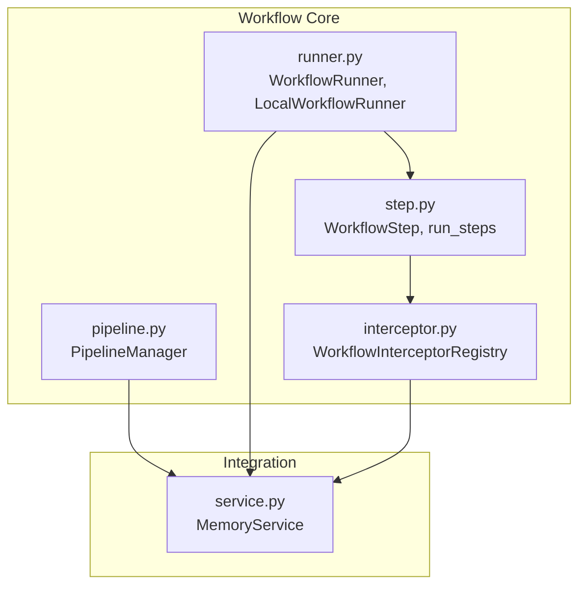
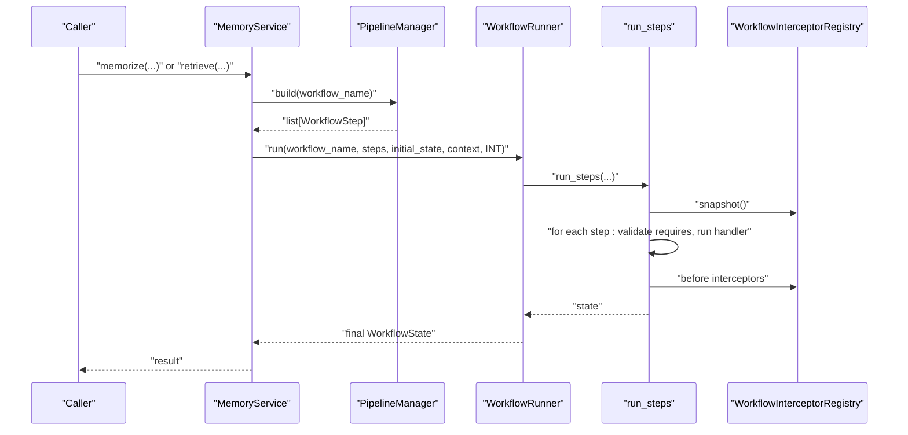
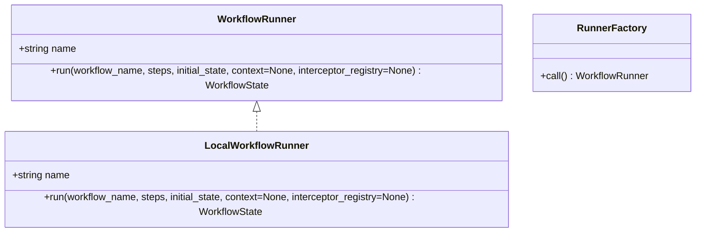
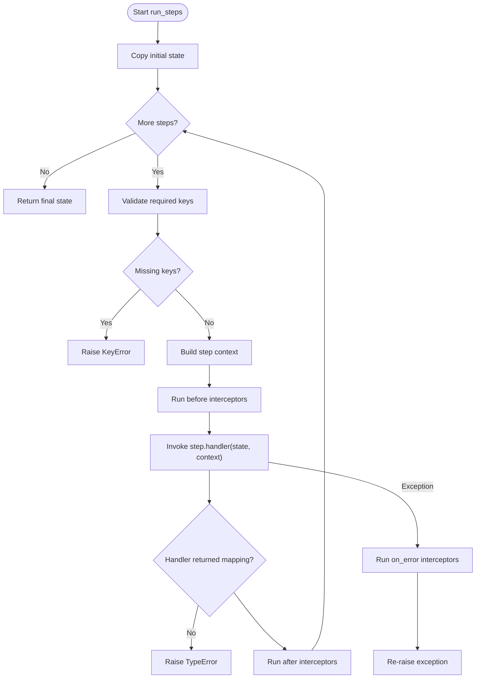
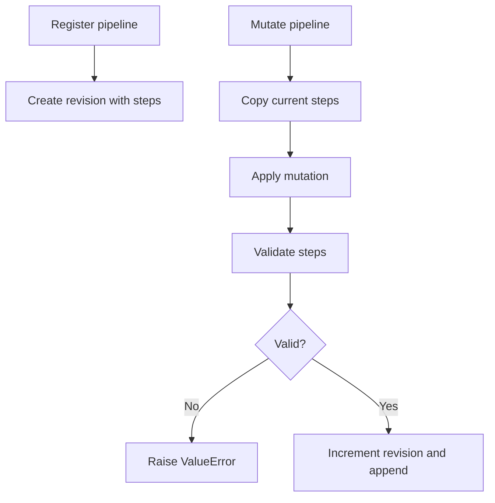
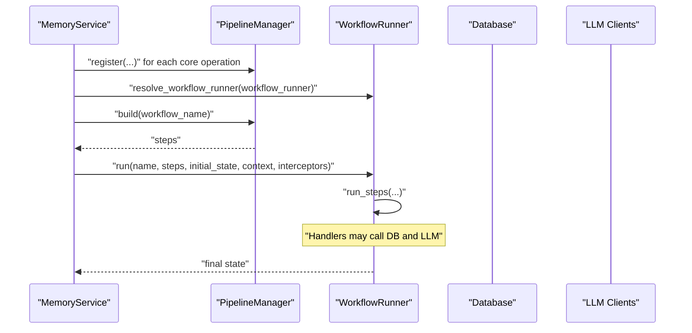
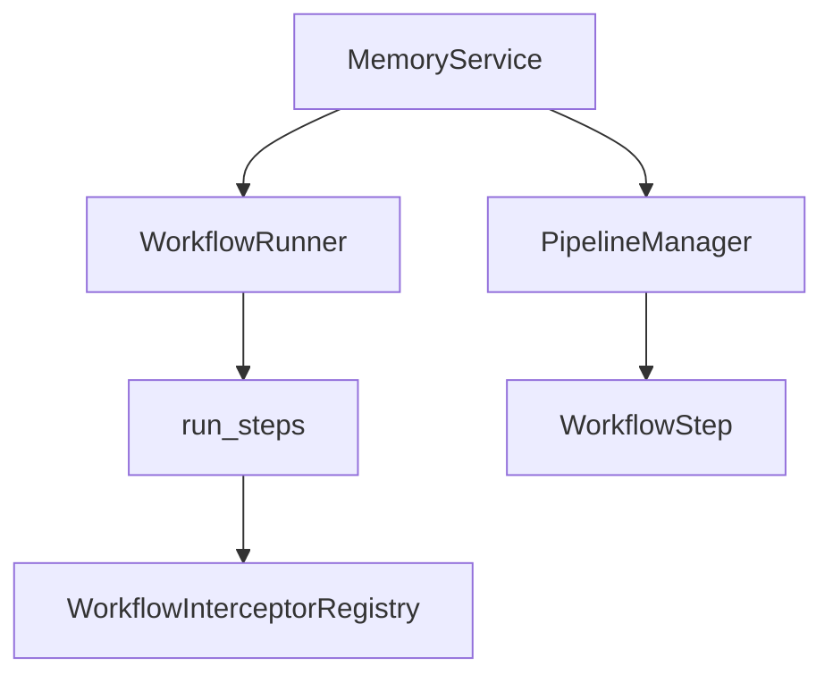

# Workflow Runner Configuration

<cite>
**Referenced Files in This Document**
- [runner.py](file://src/memu/workflow/runner.py)
- [step.py](file://src/memu/workflow/step.py)
- [interceptor.py](file://src/memu/workflow/interceptor.py)
- [pipeline.py](file://src/memu/workflow/pipeline.py)
- [service.py](file://src/memu/app/service.py)
- [0001-workflow-pipeline-architecture.md](file://docs/adr/0001-workflow-pipeline-architecture.md)
- [example_1_conversation_memory.py](file://examples/example_1_conversation_memory.py)
- [test_inmemory.py](file://tests/test_inmemory.py)
</cite>

## Table of Contents
1. [Introduction](#introduction)
2. [Project Structure](#project-structure)
3. [Core Components](#core-components)
4. [Architecture Overview](#architecture-overview)
5. [Detailed Component Analysis](#detailed-component-analysis)
6. [Dependency Analysis](#dependency-analysis)
7. [Performance Considerations](#performance-considerations)
8. [Troubleshooting Guide](#troubleshooting-guide)
9. [Conclusion](#conclusion)
10. [Appendices](#appendices)

## Introduction
This document explains how workflow runner configuration works in MemoryService. It covers the WorkflowRunner interface, the default LocalWorkflowRunner implementation, pipeline configuration, step execution order, and workflow state management. It also details how workflow runners relate to memory operations, how to configure different execution patterns, and how to monitor and observe workflow performance. Error handling, retry mechanisms, and observability options are documented with concrete references to the codebase.

## Project Structure
The workflow subsystem resides under src/memu/workflow and integrates with MemoryService in src/memu/app/service.py. The key modules are:
- runner.py: Defines the WorkflowRunner protocol and LocalWorkflowRunner
- step.py: Defines WorkflowStep, WorkflowState, and the step execution engine
- interceptor.py: Provides before/after/on_error step interceptors and registry
- pipeline.py: Manages pipeline definitions, revisions, and mutations
- service.py: Integrates workflow runners with MemoryService and exposes pipeline configuration APIs

**Diagram sources**
- [runner.py](file://src/memu/workflow/runner.py#L12-L81)
- [step.py](file://src/memu/workflow/step.py#L16-L101)
- [interceptor.py](file://src/memu/workflow/interceptor.py#L56-L218)
- [pipeline.py](file://src/memu/workflow/pipeline.py#L21-L171)
- [service.py](file://src/memu/app/service.py#L49-L427)

**Section sources**
- [runner.py](file://src/memu/workflow/runner.py#L1-L82)
- [step.py](file://src/memu/workflow/step.py#L1-L102)
- [interceptor.py](file://src/memu/workflow/interceptor.py#L1-L219)
- [pipeline.py](file://src/memu/workflow/pipeline.py#L1-L171)
- [service.py](file://src/memu/app/service.py#L1-L427)

## Core Components
- WorkflowRunner: Protocol defining the asynchronous run method that executes a named workflow with steps, initial state, and optional context and interceptors.
- LocalWorkflowRunner: Default implementation that delegates execution to run_steps.
- WorkflowStep: Encapsulates a single unit of work with handler, required/produced state keys, capabilities, and step-level config.
- run_steps: Executes steps sequentially, enforcing state requirements, invoking interceptors, and returning the final state.
- WorkflowInterceptorRegistry: Central registry for before/after/on_error interceptors with thread-safe registration and snapshots.
- PipelineManager: Manages pipeline definitions, validates step dependencies, and supports structural mutations (insert/replace/remove) with revision history.

**Section sources**
- [runner.py](file://src/memu/workflow/runner.py#L12-L81)
- [step.py](file://src/memu/workflow/step.py#L16-L101)
- [interceptor.py](file://src/memu/workflow/interceptor.py#L56-L218)
- [pipeline.py](file://src/memu/workflow/pipeline.py#L21-L171)

## Architecture Overview
MemoryService composes workflows from registered pipelines, resolves a runner, and executes them with optional step interceptors. The execution flow ensures state correctness and provides hooks for observability and control.

**Diagram sources**
- [service.py](file://src/memu/app/service.py#L350-L360)
- [runner.py](file://src/memu/workflow/runner.py#L28-L39)
- [step.py](file://src/memu/workflow/step.py#L50-L101)
- [interceptor.py](file://src/memu/workflow/interceptor.py#L163-L165)

**Section sources**
- [service.py](file://src/memu/app/service.py#L350-L360)
- [runner.py](file://src/memu/workflow/runner.py#L28-L39)
- [step.py](file://src/memu/workflow/step.py#L50-L101)
- [interceptor.py](file://src/memu/workflow/interceptor.py#L163-L165)

## Detailed Component Analysis

### WorkflowRunner Interface and Local Implementation
- WorkflowRunner defines an asynchronous run method that accepts a workflow name, list of steps, initial state, optional context, and an interceptor registry. This enables pluggable backends.
- LocalWorkflowRunner implements the protocol and simply delegates execution to run_steps, preserving the same signature for compatibility.
- The resolver supports string names and factories, enabling external runners to be registered and resolved later.

**Diagram sources**
- [runner.py](file://src/memu/workflow/runner.py#L12-L49)

**Section sources**
- [runner.py](file://src/memu/workflow/runner.py#L12-L81)

### Step Execution Order and State Management
- Steps are executed in the order they appear in the pipeline. Each step’s handler is invoked with the current state and step context.
- State requirements are validated before each step; missing keys cause a keyed error.
- After successful execution, the returned mapping updates the state for subsequent steps.
- Interceptors are invoked around each step: before, after, and on error. On error, on_error interceptors run and then the exception propagates.

**Diagram sources**
- [step.py](file://src/memu/workflow/step.py#L50-L101)
- [interceptor.py](file://src/memu/workflow/interceptor.py#L168-L202)

**Section sources**
- [step.py](file://src/memu/workflow/step.py#L50-L101)
- [interceptor.py](file://src/memu/workflow/interceptor.py#L168-L202)

### Pipeline Configuration and Validation
- PipelineManager registers pipelines with steps and metadata, including initial state keys.
- Structural mutations (config_step, insert_after, insert_before, replace_step, remove_step) create new revisions with validation.
- Validation checks:
  - Duplicate step IDs
  - Unknown capabilities against available capabilities
  - Unknown LLM profiles referenced by steps
  - Missing required state keys for steps
  - Produces keys become available for subsequent steps

**Diagram sources**
- [pipeline.py](file://src/memu/workflow/pipeline.py#L27-L122)
- [pipeline.py](file://src/memu/workflow/pipeline.py#L131-L164)

**Section sources**
- [pipeline.py](file://src/memu/workflow/pipeline.py#L21-L171)

### Relationship Between Workflow Runners and Memory Operations
- MemoryService constructs pipelines for memorize, retrieve (RAG and LLM), and CRUD/patch operations during initialization.
- It resolves the configured runner and executes pipelines via _run_workflow, passing the pipeline steps and initial state.
- LLM client selection and wrapping leverage step context to choose profiles per step.

**Diagram sources**
- [service.py](file://src/memu/app/service.py#L315-L348)
- [service.py](file://src/memu/app/service.py#L350-L360)
- [runner.py](file://src/memu/workflow/runner.py#L61-L81)

**Section sources**
- [service.py](file://src/memu/app/service.py#L315-L360)
- [runner.py](file://src/memu/workflow/runner.py#L61-L81)

### Configuring Different Workflow Execution Patterns
- Choose runner:
  - Pass a WorkflowRunner instance, a string name, or None (defaults to local).
  - Register additional runners via register_workflow_runner and resolve by name.
- Configure steps:
  - Use MemoryService.configure_pipeline to update step config by step_id.
  - Mutate pipeline structure with insert_after, insert_before, replace_step, remove_step.
- Control execution:
  - Use interceptors to instrument before/after/on_error events.
  - Enable strict mode on the registry to propagate interceptor errors instead of logging.

Practical examples:
- Example usage initializing MemoryService with LLM profiles and running memorize: [example_1_conversation_memory.py](file://examples/example_1_conversation_memory.py#L70-L79)
- In-memory test demonstrating retrieval and CRUD operations: [test_inmemory.py](file://tests/test_inmemory.py#L17-L36)

**Section sources**
- [runner.py](file://src/memu/workflow/runner.py#L52-L81)
- [service.py](file://src/memu/app/service.py#L390-L426)
- [interceptor.py](file://src/memu/workflow/interceptor.py#L65-L76)
- [example_1_conversation_memory.py](file://examples/example_1_conversation_memory.py#L70-L79)
- [test_inmemory.py](file://tests/test_inmemory.py#L17-L36)

### Monitoring Workflow Performance
- Observability hooks:
  - Register before/after/on_error interceptors to capture timing, metrics, and traces.
  - Use step_context to pass trace_id, tags, and operation identifiers.
- Strict mode:
  - When enabled, interceptor exceptions propagate instead of being logged, aiding debugging.
- LLM observability:
  - MemoryService wraps LLM clients and attaches metadata derived from step context for downstream telemetry.

References:
- Interceptor registration and strict property: [interceptor.py](file://src/memu/workflow/interceptor.py#L56-L76)
- LLM metadata derivation from step context: [service.py](file://src/memu/app/service.py#L154-L166)
- LLM client wrapping: [service.py](file://src/memu/app/service.py#L178-L185)

**Section sources**
- [interceptor.py](file://src/memu/workflow/interceptor.py#L56-L76)
- [service.py](file://src/memu/app/service.py#L154-L185)

### Error Handling, Retry Mechanisms, and Observability
- Step-level errors:
  - run_steps invokes on_error interceptors before re-raising exceptions.
  - Handlers must return a mapping; otherwise a type error is raised.
- Interceptor errors:
  - In non-strict mode, interceptor exceptions are logged; in strict mode, they propagate.
- Retry strategies:
  - Not built-in at the runner level; implement retries in step handlers or wrap handlers with retry logic and register before/after interceptors to record attempts and outcomes.

References:
- Step handler contract and error: [step.py](file://src/memu/workflow/step.py#L40-L47)
- On-error interceptor invocation: [step.py](file://src/memu/workflow/step.py#L92-L95)
- Interceptor safe invocation and strict behavior: [interceptor.py](file://src/memu/workflow/interceptor.py#L205-L218)

**Section sources**
- [step.py](file://src/memu/workflow/step.py#L40-L47)
- [step.py](file://src/memu/workflow/step.py#L92-L95)
- [interceptor.py](file://src/memu/workflow/interceptor.py#L205-L218)

## Dependency Analysis
- MemoryService depends on PipelineManager for pipeline definitions and on WorkflowRunner for execution.
- WorkflowRunner delegates to run_steps, which depends on WorkflowInterceptorRegistry for lifecycle hooks.
- PipelineManager validates step dependencies and enforces capability and profile constraints.

**Diagram sources**
- [service.py](file://src/memu/app/service.py#L315-L360)
- [runner.py](file://src/memu/workflow/runner.py#L28-L39)
- [step.py](file://src/memu/workflow/step.py#L50-L101)
- [interceptor.py](file://src/memu/workflow/interceptor.py#L56-L165)
- [pipeline.py](file://src/memu/workflow/pipeline.py#L21-L171)

**Section sources**
- [service.py](file://src/memu/app/service.py#L315-L360)
- [runner.py](file://src/memu/workflow/runner.py#L28-L39)
- [step.py](file://src/memu/workflow/step.py#L50-L101)
- [interceptor.py](file://src/memu/workflow/interceptor.py#L56-L165)
- [pipeline.py](file://src/memu/workflow/pipeline.py#L21-L171)

## Performance Considerations
- Prefer local execution for low-latency, synchronous workflows; use external runners only when distributed scheduling or persistence is required.
- Minimize heavy computations inside step handlers; offload to external services or batch operations.
- Use interceptors to instrument timings and resource usage without modifying core handlers.
- Keep pipeline steps focused and atomic to enable efficient validation and easier debugging.

## Troubleshooting Guide
Common issues and resolutions:
- Unknown workflow runner name:
  - Ensure the runner is registered via register_workflow_runner before resolving.
  - Reference: [runner.py](file://src/memu/workflow/runner.py#L52-L81)
- Missing required state keys:
  - Verify earlier steps produce the required keys or provide initial_state_keys when registering pipelines.
  - Reference: [step.py](file://src/memu/workflow/step.py#L69-L72), [pipeline.py](file://src/memu/workflow/pipeline.py#L156-L162)
- Unknown LLM profile:
  - Confirm the profile exists in llm_profiles and is referenced correctly in step config.
  - Reference: [pipeline.py](file://src/memu/workflow/pipeline.py#L147-L154)
- Duplicate step_id:
  - Ensure each step_id is unique within a pipeline.
  - Reference: [pipeline.py](file://src/memu/workflow/pipeline.py#L136-L138)
- Handler does not return a mapping:
  - Ensure step handlers return a mapping; otherwise a type error is raised.
  - Reference: [step.py](file://src/memu/workflow/step.py#L44-L47)
- Interceptor exceptions:
  - Disable strict mode to log and continue, or enable strict mode to surface errors.
  - Reference: [interceptor.py](file://src/memu/workflow/interceptor.py#L74-L76), [interceptor.py](file://src/memu/workflow/interceptor.py#L215-L218)

**Section sources**
- [runner.py](file://src/memu/workflow/runner.py#L52-L81)
- [step.py](file://src/memu/workflow/step.py#L44-L72)
- [pipeline.py](file://src/memu/workflow/pipeline.py#L136-L154)
- [interceptor.py](file://src/memu/workflow/interceptor.py#L74-L76)
- [interceptor.py](file://src/memu/workflow/interceptor.py#L215-L218)

## Conclusion
MemoryService leverages a flexible workflow subsystem centered on pipelines, steps, and interceptors. The WorkflowRunner abstraction allows swapping execution backends, while PipelineManager and step validation ensure predictable, observable execution. Interceptors provide hooks for monitoring and control, and the design supports easy customization of execution patterns and robust error handling.

## Appendices

### ADR Context
- Architectural Decision Record confirms the adoption of workflow pipelines for core operations, emphasizing uniform execution, inspection, extension, and observability.
- Reference: [0001-workflow-pipeline-architecture.md](file://docs/adr/0001-workflow-pipeline-architecture.md#L12-L20)

**Section sources**
- [0001-workflow-pipeline-architecture.md](file://docs/adr/0001-workflow-pipeline-architecture.md#L1-L36)