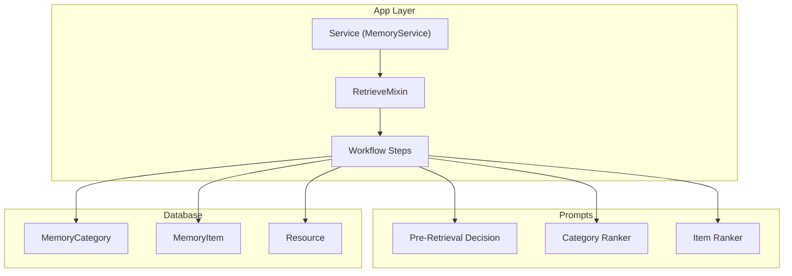
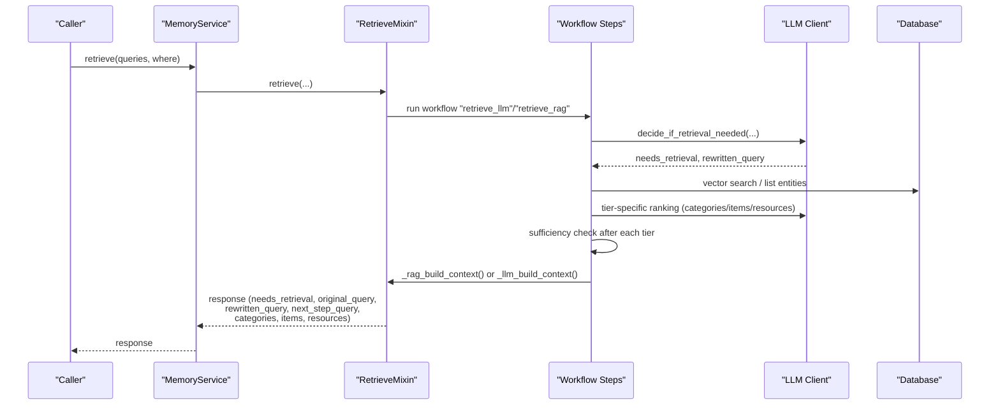
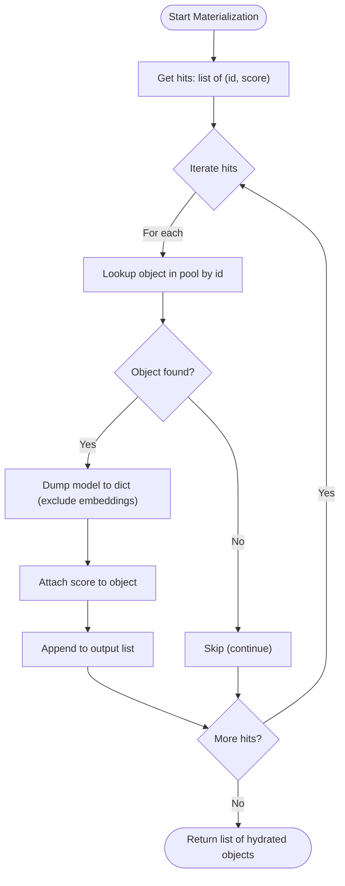
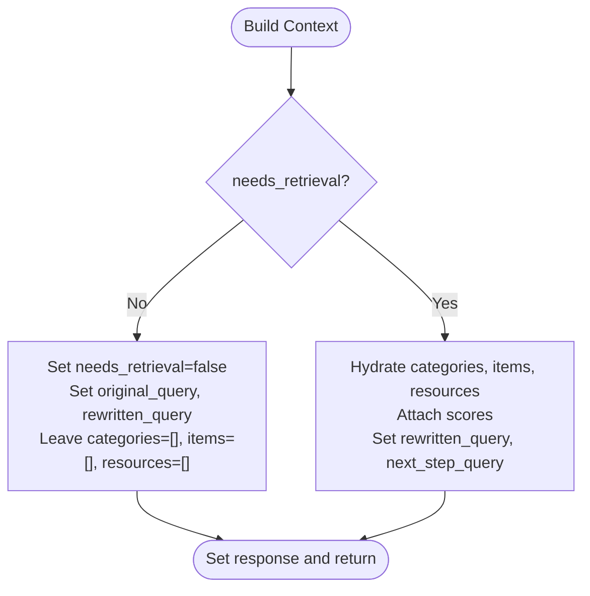
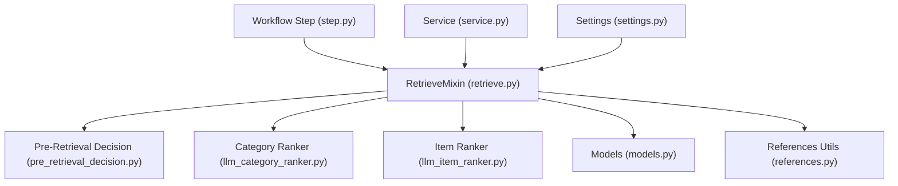

# Context Construction and Response Formatting

<cite>
**Referenced Files in This Document**
- [retrieve.py](file://src/memu/app/retrieve.py)
- [pre_retrieval_decision.py](file://src/memu/prompts/retrieve/pre_retrieval_decision.py)
- [llm_category_ranker.py](file://src/memu/prompts/retrieve/llm_category_ranker.py)
- [llm_item_ranker.py](file://src/memu/prompts/retrieve/llm_item_ranker.py)
- [models.py](file://src/memu/database/models.py)
- [step.py](file://src/memu/workflow/step.py)
- [service.py](file://src/memu/app/service.py)
- [settings.py](file://src/memu/app/settings.py)
- [references.py](file://src/memu/utils/references.py)
- [test_postgres.py](file://tests/test_postgres.py)
</cite>

## Table of Contents
1. [Introduction](#introduction)
2. [Project Structure](#project-structure)
3. [Core Components](#core-components)
4. [Architecture Overview](#architecture-overview)
5. [Detailed Component Analysis](#detailed-component-analysis)
6. [Dependency Analysis](#dependency-analysis)
7. [Performance Considerations](#performance-considerations)
8. [Troubleshooting Guide](#troubleshooting-guide)
9. [Conclusion](#conclusion)
10. [Appendices](#appendices)

## Introduction
This document explains the context construction and response formatting phase that transforms raw retrieval results into a final response structure. It covers the response schema, the materialization process from raw hits to formatted objects, formatting functions for different content types, and the integration of metadata. It also details conditional response building based on retrieval success, handling of empty results, and preservation of retrieval context. Finally, it provides examples of response formats across scenarios and integration patterns for downstream applications.

## Project Structure
The retrieval and context construction logic is primarily implemented in the RetrieveMixin class and orchestrated via workflow steps. Prompts define the LLM ranking and decision-making behavior. The database models define the shape of stored entities. The service layer wires clients and configuration into the workflow.

**Diagram sources**
- [service.py](file://src/memu/app/service.py#L49-L95)
- [retrieve.py](file://src/memu/app/retrieve.py#L106-L210)
- [pre_retrieval_decision.py](file://src/memu/prompts/retrieve/pre_retrieval_decision.py#L1-L54)
- [llm_category_ranker.py](file://src/memu/prompts/retrieve/llm_category_ranker.py#L1-L36)
- [llm_item_ranker.py](file://src/memu/prompts/retrieve/llm_item_ranker.py#L1-L41)
- [models.py](file://src/memu/database/models.py#L68-L106)

**Section sources**
- [service.py](file://src/memu/app/service.py#L49-L95)
- [retrieve.py](file://src/memu/app/retrieve.py#L106-L210)

## Core Components
- Response schema fields:
  - needs_retrieval: Boolean indicating whether retrieval was needed or continued.
  - original_query: The initial user query.
  - rewritten_query: The query after context-aware rewriting.
  - next_step_query: The query to use in subsequent retrieval tiers.
  - categories: List of category objects with scores and metadata.
  - items: List of memory item objects with scores and metadata.
  - resources: List of resource objects with scores and metadata.
- Materialization: Converts raw hit tuples (id, score) into hydrated objects by merging with pools and attaching scores.
- Formatting functions: Produce human-readable or LLM-consumable strings for each content type.
- Conditional building: Builds the response only when retrieval is needed; otherwise returns minimal fields.
- Empty handling: Ensures empty lists are returned when no hits are produced.
- Metadata integration: Uses Pydantic model dumps to exclude embeddings and include extra fields.

**Section sources**
- [retrieve.py](file://src/memu/app/retrieve.py#L708-L723)
- [retrieve.py](file://src/memu/app/retrieve.py#L943-L952)
- [retrieve.py](file://src/memu/app/retrieve.py#L954-L994)
- [retrieve.py](file://src/memu/app/retrieve.py#L1397-L1418)

## Architecture Overview
The context construction phase runs as part of a retrieval workflow. It decides whether retrieval is needed, performs retrieval at each tier (categories, items, resources), checks sufficiency after each tier, and finally builds a unified response with materialized objects and scores.

**Diagram sources**
- [service.py](file://src/memu/app/service.py#L49-L95)
- [retrieve.py](file://src/memu/app/retrieve.py#L42-L85)
- [retrieve.py](file://src/memu/app/retrieve.py#L106-L210)
- [retrieve.py](file://src/memu/app/retrieve.py#L426-L452)
- [retrieve.py](file://src/memu/app/retrieve.py#L708-L723)

## Detailed Component Analysis

### Response Schema and Fields
- needs_retrieval: Boolean derived from the decision-making step.
- original_query: The first query in the conversation chain.
- rewritten_query: Updated query after integrating context.
- next_step_query: Query for the next tier; may be None if retrieval ends early.
- categories: Hydrated category objects with score and metadata.
- items: Hydrated memory item objects with score and metadata.
- resources: Hydrated resource objects with score and metadata.

Behavioral notes:
- When retrieval is not needed, categories/items/resources remain empty lists.
- Scores are attached to each object during materialization.
- Metadata fields (e.g., extra) are preserved via model dump logic.

**Section sources**
- [retrieve.py](file://src/memu/app/retrieve.py#L708-L723)
- [retrieve.py](file://src/memu/app/retrieve.py#L943-L952)
- [models.py](file://src/memu/database/models.py#L68-L106)

### Materialization Process
Materialization converts raw hits (id, score) into final objects by:
- Looking up the entity in the appropriate pool (categories, items, resources).
- Dumping the Pydantic model to dict while excluding embeddings.
- Attaching the score to the resulting object.

**Diagram sources**
- [retrieve.py](file://src/memu/app/retrieve.py#L943-L952)

**Section sources**
- [retrieve.py](file://src/memu/app/retrieve.py#L943-L952)

### Formatting Functions for Different Content Types
- Category formatting:
  - Human-readable: Name, summary, score.
  - LLM-consumable: ID, name, description, summary.
- Item formatting:
  - Human-readable: Type, summary, score.
  - LLM-consumable: ID, type, summary.
- Resource formatting:
  - Human-readable: Caption or URL, score.
  - LLM-consumable: ID, URL, modality, caption.

These functions are used for:
- Building context strings for sufficiency checks.
- Constructing prompts for LLM rankers.
- Presenting results to downstream consumers.

**Section sources**
- [retrieve.py](file://src/memu/app/retrieve.py#L954-L994)
- [retrieve.py](file://src/memu/app/retrieve.py#L1119-L1143)
- [retrieve.py](file://src/memu/app/retrieve.py#L1145-L1179)
- [retrieve.py](file://src/memu/app/retrieve.py#L1181-L1214)
- [retrieve.py](file://src/memu/app/retrieve.py#L1397-L1418)

### Conditional Response Building
The response is built conditionally:
- If needs_retrieval is true, hydrate and attach categories, items, and resources.
- If needs_retrieval is false, return minimal fields with empty lists for the three collections.
- next_step_query is included when available.

**Diagram sources**
- [retrieve.py](file://src/memu/app/retrieve.py#L426-L452)
- [retrieve.py](file://src/memu/app/retrieve.py#L708-L723)

**Section sources**
- [retrieve.py](file://src/memu/app/retrieve.py#L426-L452)
- [retrieve.py](file://src/memu/app/retrieve.py#L708-L723)

### Handling of Empty Results
- If no hits are produced at any tier, the corresponding collection remains empty.
- If no content is available for formatting, fallback strings are used (e.g., “No categories available.”).
- The sufficiency checker gracefully handles empty content by defaulting to retrieval continuation.

**Section sources**
- [retrieve.py](file://src/memu/app/retrieve.py#L1130-L1131)
- [retrieve.py](file://src/memu/app/retrieve.py#L1170-L1171)
- [retrieve.py](file://src/memu/app/retrieve.py#L1202-L1203)
- [retrieve.py](file://src/memu/app/retrieve.py#L789-L790)

### Preservation of Retrieval Context
- Query context is preserved and formatted for prompts, including roles and nested content.
- Rewritten queries are tracked across tiers to maintain continuity.
- Metadata such as extra fields and computed hashes are preserved in model dumps.

**Section sources**
- [retrieve.py](file://src/memu/app/retrieve.py#L786-L809)
- [retrieve.py](file://src/memu/app/retrieve.py#L860-L865)
- [models.py](file://src/memu/database/models.py#L35-L41)
- [models.py](file://src/memu/database/models.py#L76-L94)

### Examples of Response Formats
Below are representative response structures across scenarios. These examples illustrate the schema and typical field presence.

- Scenario A: Retrieval not needed
  - needs_retrieval: false
  - original_query: "Hello"
  - rewritten_query: "Hello"
  - next_step_query: null
  - categories: []
  - items: []
  - resources: []

- Scenario B: Retrieval needed, categories only
  - needs_retrieval: true
  - original_query: "Tell me about my preferences"
  - rewritten_query: "Based on our conversation, tell me about my preferences"
  - next_step_query: "Based on our conversation, tell me about my preferences"
  - categories: [{id, name, summary, score, ...}]
  - items: []
  - resources: []

- Scenario C: Retrieval needed, categories + items + resources
  - needs_retrieval: true
  - original_query: "What do I know about AI?"
  - rewritten_query: "What do I know about AI?"
  - next_step_query: null
  - categories: [{...}]
  - items: [{id, memory_type, summary, score, ...}]
  - resources: [{id, url, caption, score, ...}]

Integration note: Downstream applications can rely on the presence of needs_retrieval to decide whether to augment prompts with retrieved context or to respond directly.

**Section sources**
- [test_postgres.py](file://tests/test_postgres.py#L64-L76)
- [retrieve.py](file://src/memu/app/retrieve.py#L708-L723)

### Downstream Application Integration Patterns
- Conditional branching: If needs_retrieval is true, inject formatted context into downstream prompts; otherwise, bypass retrieval augmentation.
- Score-aware filtering: Use scores to gate inclusion thresholds in downstream systems.
- Metadata utilization: Access extra fields (e.g., tool metadata) for specialized downstream logic.
- Progressive refinement: Use next_step_query to iteratively refine retrieval across multiple rounds.

**Section sources**
- [retrieve.py](file://src/memu/app/retrieve.py#L708-L723)
- [models.py](file://src/memu/database/models.py#L76-L94)

## Dependency Analysis
The retrieval and context construction pipeline depends on:
- Workflow steps to orchestrate stages and pass state.
- LLM prompts to guide ranking and sufficiency decisions.
- Database models to represent entities and metadata.
- Utility functions for reference parsing and citation formatting.

**Diagram sources**
- [step.py](file://src/memu/workflow/step.py#L16-L47)
- [retrieve.py](file://src/memu/app/retrieve.py#L106-L210)
- [pre_retrieval_decision.py](file://src/memu/prompts/retrieve/pre_retrieval_decision.py#L1-L54)
- [llm_category_ranker.py](file://src/memu/prompts/retrieve/llm_category_ranker.py#L1-L36)
- [llm_item_ranker.py](file://src/memu/prompts/retrieve/llm_item_ranker.py#L1-L41)
- [models.py](file://src/memu/database/models.py#L68-L106)
- [references.py](file://src/memu/utils/references.py#L20-L49)
- [service.py](file://src/memu/app/service.py#L49-L95)
- [settings.py](file://src/memu/app/settings.py#L175-L200)

**Section sources**
- [step.py](file://src/memu/workflow/step.py#L16-L47)
- [retrieve.py](file://src/memu/app/retrieve.py#L106-L210)
- [settings.py](file://src/memu/app/settings.py#L175-L200)

## Performance Considerations
- Embedding reuse: Reuse query vectors across tiers when rewriting queries to reduce redundant embeddings.
- Top-k tuning: Adjust top_k per tier to balance recall and latency.
- Score-based pruning: Downstream systems can prune low-score results to reduce payload size.
- Batched embeddings: Use batch sizes aligned with provider limits to improve throughput.

[No sources needed since this section provides general guidance]

## Troubleshooting Guide
- Unexpected empty results:
  - Verify where filters and user scope alignment.
  - Confirm category/item/resource availability in the database.
- Parsing failures in LLM rankings:
  - Inspect JSON extraction and parsing logic for malformed outputs.
- Query rewriting inconsistencies:
  - Validate decision extraction and fallback behavior.
- Score discrepancies:
  - Ensure materialization attaches scores consistently and downstream systems interpret floating-point precision correctly.

**Section sources**
- [retrieve.py](file://src/memu/app/retrieve.py#L841-L865)
- [retrieve.py](file://src/memu/app/retrieve.py#L1325-L1347)
- [retrieve.py](file://src/memu/app/retrieve.py#L1349-L1371)
- [retrieve.py](file://src/memu/app/retrieve.py#L1373-L1395)

## Conclusion
The context construction and response formatting phase consolidates retrieval results into a structured, scored, and metadata-rich response. It preserves retrieval context, supports conditional building, and integrates seamlessly with downstream applications through a clear schema and consistent materialization process.

[No sources needed since this section summarizes without analyzing specific files]

## Appendices

### Appendix A: Retrieval Method Selection
- rag: Embedding-based vector search with optional LLM-based sufficiency checks.
- llm: LLM-driven ranking at each tier with explicit JSON outputs.

**Section sources**
- [settings.py](file://src/memu/app/settings.py#L185-L186)
- [retrieve.py](file://src/memu/app/retrieve.py#L106-L210)
- [retrieve.py](file://src/memu/app/retrieve.py#L454-L536)

### Appendix B: Role-Aware Query Context Formatting
- Supports both string and structured query formats.
- Preserves role and nested content for richer context.

**Section sources**
- [retrieve.py](file://src/memu/app/retrieve.py#L786-L809)