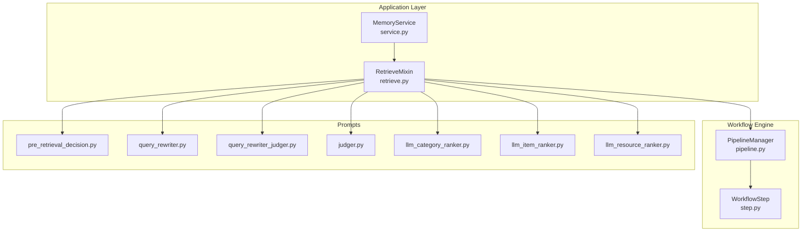
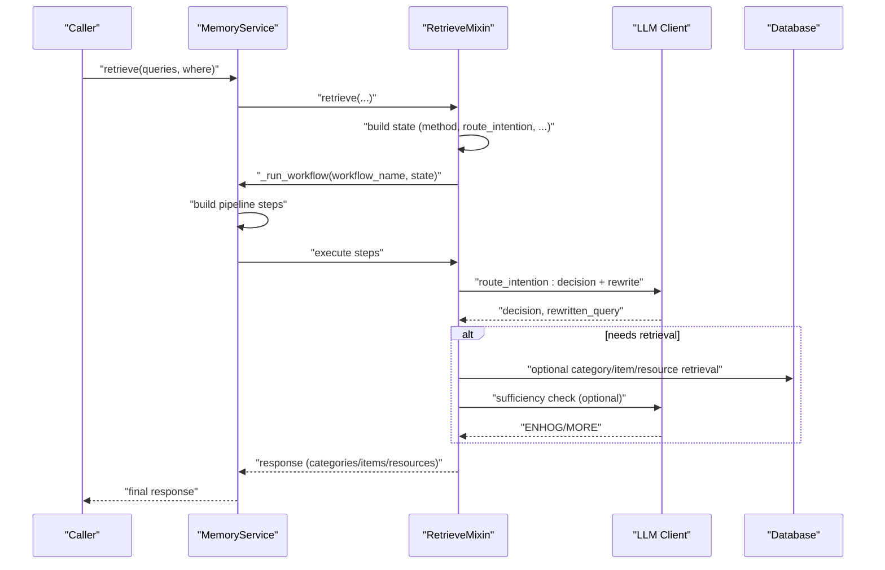
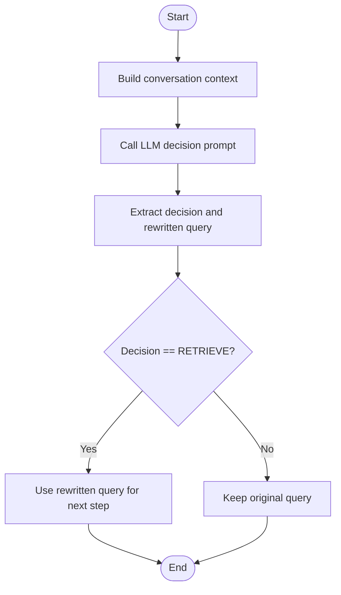
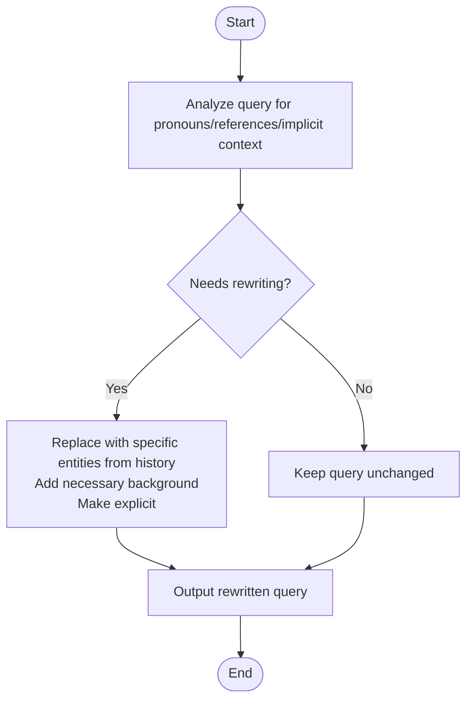
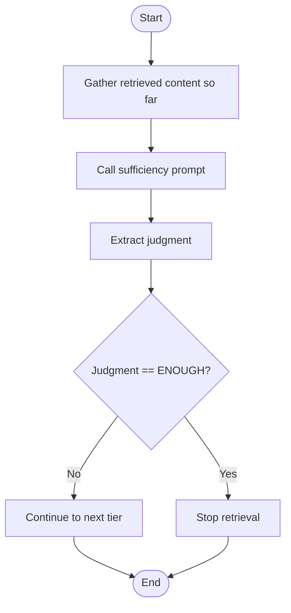
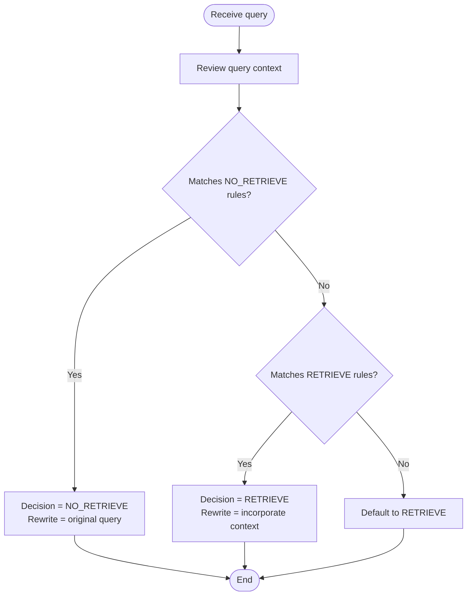
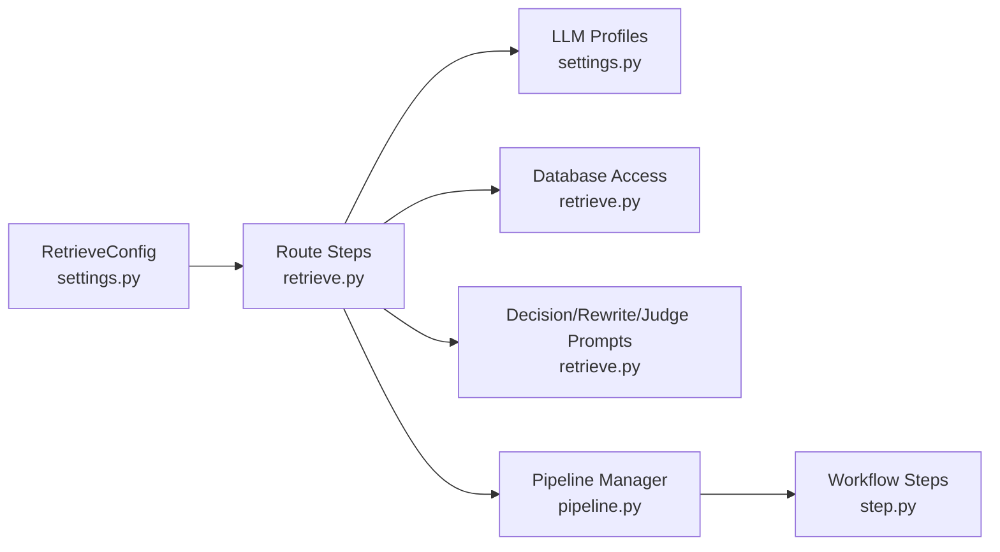

# Intention Routing and Query Rewriting

<cite>
**Referenced Files in This Document**
- [retrieve.py](file://src/memu/app/retrieve.py)
- [settings.py](file://src/memu/app/settings.py)
- [pre_retrieval_decision.py](file://src/memu/prompts/retrieve/pre_retrieval_decision.py)
- [query_rewriter.py](file://src/memu/prompts/retrieve/query_rewriter.py)
- [query_rewriter_judger.py](file://src/memu/prompts/retrieve/query_rewriter_judger.py)
- [judger.py](file://src/memu/prompts/retrieve/judger.py)
- [llm_category_ranker.py](file://src/memu/prompts/retrieve/llm_category_ranker.py)
- [llm_item_ranker.py](file://src/memu/prompts/retrieve/llm_item_ranker.py)
- [llm_resource_ranker.py](file://src/memu/prompts/retrieve/llm_resource_ranker.py)
- [service.py](file://src/memu/app/service.py)
- [pipeline.py](file://src/memu/workflow/pipeline.py)
- [step.py](file://src/memu/workflow/step.py)
</cite>

## Table of Contents
1. [Introduction](#introduction)
2. [Project Structure](#project-structure)
3. [Core Components](#core-components)
4. [Architecture Overview](#architecture-overview)
5. [Detailed Component Analysis](#detailed-component-analysis)
6. [Dependency Analysis](#dependency-analysis)
7. [Performance Considerations](#performance-considerations)
8. [Troubleshooting Guide](#troubleshooting-guide)
9. [Conclusion](#conclusion)

## Introduction
This document explains the intention routing and query rewriting system that decides whether retrieval is needed and optimizes queries accordingly. It covers:
- Pre-retrieval decision making via LLM-based classification
- Query rewriting to improve self-containment and specificity
- Sufficiency checking to minimize unnecessary retrieval tiers
- Decision tree logic for retrieval necessity
- Prompt engineering rationale for decision prompts
- Extraction of decisions and rewritten queries
- Configuration options for route_intention, sufficiency_check, and related LLM profiles
- Examples of routing paths for different query types and how rewriting improves retrieval effectiveness

## Project Structure
The intention routing and retrieval pipeline is implemented as part of the retrieval subsystem and orchestrated by a workflow engine. Key modules:
- Retrieval orchestration and routing logic
- Configuration for retrieval behavior and LLM profiles
- Prompt templates for decision, rewriting, and sufficiency judgment
- Workflow pipeline and step execution framework

**Diagram sources**
- [service.py](file://src/memu/app/service.py#L49-L323)
- [retrieve.py](file://src/memu/app/retrieve.py#L106-L536)
- [pipeline.py](file://src/memu/workflow/pipeline.py#L21-L171)
- [step.py](file://src/memu/workflow/step.py#L16-L102)
- [pre_retrieval_decision.py](file://src/memu/prompts/retrieve/pre_retrieval_decision.py#L1-L54)
- [query_rewriter.py](file://src/memu/prompts/retrieve/query_rewriter.py#L1-L45)
- [query_rewriter_judger.py](file://src/memu/prompts/retrieve/query_rewriter_judger.py#L1-L49)
- [judger.py](file://src/memu/prompts/retrieve/judger.py#L1-L40)
- [llm_category_ranker.py](file://src/memu/prompts/retrieve/llm_category_ranker.py#L1-L36)
- [llm_item_ranker.py](file://src/memu/prompts/retrieve/llm_item_ranker.py#L1-L41)
- [llm_resource_ranker.py](file://src/memu/prompts/retrieve/llm_resource_ranker.py#L1-L41)

**Section sources**
- [service.py](file://src/memu/app/service.py#L49-L323)
- [retrieve.py](file://src/memu/app/retrieve.py#L106-L536)
- [pipeline.py](file://src/memu/workflow/pipeline.py#L21-L171)
- [step.py](file://src/memu/workflow/step.py#L16-L102)

## Core Components
- RetrieveMixin orchestrates retrieval workflows, builds state, and executes either RAG or LLM-based retrieval pipelines.
- Route intention step uses a decision prompt to classify queries and rewrite them when needed.
- Query rewriting improves clarity and resolves references using conversation history.
- Sufficiency checks evaluate whether retrieved content is enough to answer the query.
- LLM-based ranking prompts rank categories, items, and resources for targeted retrieval.
- Configuration controls routing behavior, sufficiency checks, and LLM profiles.

**Section sources**
- [retrieve.py](file://src/memu/app/retrieve.py#L42-L85)
- [retrieve.py](file://src/memu/app/retrieve.py#L228-L258)
- [retrieve.py](file://src/memu/app/retrieve.py#L746-L784)
- [settings.py](file://src/memu/app/settings.py#L175-L202)

## Architecture Overview
The retrieval system supports two strategies:
- RAG pipeline: Uses embedding similarity and vector search with optional sufficiency checks.
- LLM pipeline: Delegates ranking to LLM with explicit ranking prompts.

Both strategies start with route_intention, which decides whether retrieval is needed and rewrites the query. Subsequent steps depend on sufficiency checks and configuration toggles.

**Diagram sources**
- [service.py](file://src/memu/app/service.py#L315-L361)
- [retrieve.py](file://src/memu/app/retrieve.py#L42-L85)
- [retrieve.py](file://src/memu/app/retrieve.py#L228-L258)
- [retrieve.py](file://src/memu/app/retrieve.py#L288-L322)
- [retrieve.py](file://src/memu/app/retrieve.py#L538-L568)
- [retrieve.py](file://src/memu/app/retrieve.py#L590-L613)

## Detailed Component Analysis

### Pre-Retrieval Decision Mechanism
- Purpose: Classify whether retrieval is needed and optionally rewrite the query to incorporate context.
- Inputs: Original query, conversation history, and optionally retrieved content so far.
- Output: Boolean decision (RETRIEVE or NO_RETRIEVE) and a rewritten query.
- Extraction: Parses structured outputs to extract decision and rewritten query.

**Diagram sources**
- [retrieve.py](file://src/memu/app/retrieve.py#L746-L784)
- [retrieve.py](file://src/memu/app/retrieve.py#L841-L865)
- [pre_retrieval_decision.py](file://src/memu/prompts/retrieve/pre_retrieval_decision.py#L1-L54)

**Section sources**
- [retrieve.py](file://src/memu/app/retrieve.py#L746-L784)
- [retrieve.py](file://src/memu/app/retrieve.py#L841-L865)
- [pre_retrieval_decision.py](file://src/memu/prompts/retrieve/pre_retrieval_decision.py#L1-L54)

### Query Rewriting Logic
- Purpose: Resolve pronouns, referential expressions, and implicit context to make the query self-contained.
- Inputs: Conversation history and current query.
- Output: Structured analysis and rewritten query.
- Behavior: Preserves intent, avoids introducing new assumptions, and keeps rewritten query concise.

**Diagram sources**
- [query_rewriter.py](file://src/memu/prompts/retrieve/query_rewriter.py#L1-L45)

**Section sources**
- [query_rewriter.py](file://src/memu/prompts/retrieve/query_rewriter.py#L1-L45)

### Sufficiency Checking
- Purpose: Determine if retrieved content is sufficient to answer the query; if not, request more retrieval.
- Two modes:
  - Dedicated sufficiency prompt: Evaluates retrieved content against strict criteria.
  - Combined rewriting + sufficiency prompt: Performs rewriting and sufficiency judgment in one step.
- Extraction: Parses structured outputs to extract judgment (ENOUGH or MORE).

**Diagram sources**
- [judger.py](file://src/memu/prompts/retrieve/judger.py#L1-L40)
- [query_rewriter_judger.py](file://src/memu/prompts/retrieve/query_rewriter_judger.py#L1-L49)
- [retrieve.py](file://src/memu/app/retrieve.py#L1006-L1019)

**Section sources**
- [judger.py](file://src/memu/prompts/retrieve/judger.py#L1-L40)
- [query_rewriter_judger.py](file://src/memu/prompts/retrieve/query_rewriter_judger.py#L1-L49)
- [retrieve.py](file://src/memu/app/retrieve.py#L1006-L1019)

### Decision Tree for Retrieval Necessity
- NO_RETRIEVE conditions:
  - Greetings, casual chat, acknowledgments
  - Questions about only the current conversation/context
  - General knowledge questions
  - Requests for clarification
  - Meta-questions about the system itself
- RETRIEVE conditions:
  - Questions about past events, conversations, or interactions
  - Queries about user preferences, habits, or characteristics
  - Requests to recall specific information
  - Questions referencing historical data
- Output format enforces structured decision and rewritten query extraction.

**Diagram sources**
- [pre_retrieval_decision.py](file://src/memu/prompts/retrieve/pre_retrieval_decision.py#L14-L27)
- [retrieve.py](file://src/memu/app/retrieve.py#L841-L858)

**Section sources**
- [pre_retrieval_decision.py](file://src/memu/prompts/retrieve/pre_retrieval_decision.py#L14-L27)
- [retrieve.py](file://src/memu/app/retrieve.py#L841-L858)

### Prompt Engineering Behind Decision Prompts
- Objective clarity: Explicitly defines task, workflow, rules, and output format.
- Conservative defaults: Favors retrieval when uncertain to reduce false negatives.
- Structured output: Enforces XML-like tags for robust extraction.
- Context grounding: Requires conversation history and retrieved content to inform decisions.

**Section sources**
- [pre_retrieval_decision.py](file://src/memu/prompts/retrieve/pre_retrieval_decision.py#L1-L54)

### Extraction of Rewritten Queries
- Pattern-based extraction: Searches for the rewritten query block and returns its content.
- Fallback behavior: If parsing fails, falls back to the original query.
- Consistency: Ensures downstream steps receive a valid query for subsequent retrieval.

**Section sources**
- [retrieve.py](file://src/memu/app/retrieve.py#L860-L865)
- [retrieve.py](file://src/memu/app/retrieve.py#L841-L858)

### Configuration Options
Key configuration affecting routing and rewriting:
- route_intention: Enables/disables the pre-retrieval decision step.
- sufficiency_check: Enables/disables sufficiency checks after each tier.
- sufficiency_check_prompt: Overrides the default sufficiency prompt.
- sufficiency_check_llm_profile: LLM profile for route_intention and sufficiency checks.
- llm_ranking_llm_profile: LLM profile for LLM-based ranking steps.
- category.enabled/top_k, item.enabled/top_k, resource.enabled/top_k: Control retrieval depth and breadth.
- item.use_category_references: When insufficient category content is retrieved, follow item references to fetch related items.
- item.ranking/recency_decay_days: Controls ranking strategy and recency weighting for item retrieval.

**Section sources**
- [settings.py](file://src/memu/app/settings.py#L175-L202)
- [settings.py](file://src/memu/app/settings.py#L146-L173)
- [retrieve.py](file://src/memu/app/retrieve.py#L57-L61)
- [retrieve.py](file://src/memu/app/retrieve.py#L626-L634)

### Examples: Routing Paths and Query Rewriting Effects
- Casual greeting: route_intention → NO_RETRIEVE → response built without retrieval.
- Historical preference query: route_intention → RETRIEVE → rewritten to include context → sufficiency check may stop early or proceed to items/resources.
- Ambiguous pronoun: route_intention → RETRIEVE → rewritten to resolve entity → improved matching in later tiers.
- General knowledge: route_intention → NO_RETRIEVE → direct response.

These examples illustrate how routing prevents unnecessary retrieval and how rewriting improves precision and reduces iterative retrieval loops.

[No sources needed since this section does not analyze specific files]

## Dependency Analysis
The retrieval system depends on:
- LLM profiles for routing, sufficiency checks, and ranking
- Database for categories, items, and resources
- Workflow engine for step sequencing and capability gating

**Diagram sources**
- [settings.py](file://src/memu/app/settings.py#L175-L202)
- [retrieve.py](file://src/memu/app/retrieve.py#L53-L61)
- [retrieve.py](file://src/memu/app/retrieve.py#L106-L210)
- [pipeline.py](file://src/memu/workflow/pipeline.py#L21-L171)
- [step.py](file://src/memu/workflow/step.py#L16-L102)

**Section sources**
- [settings.py](file://src/memu/app/settings.py#L175-L202)
- [retrieve.py](file://src/memu/app/retrieve.py#L53-L61)
- [pipeline.py](file://src/memu/workflow/pipeline.py#L131-L164)

## Performance Considerations
- Minimize LLM calls: route_intention and sufficiency checks are invoked per tier; disable where appropriate to reduce cost and latency.
- Use skip_rewrite for single-turn queries to avoid unnecessary rewriting.
- Tune top_k and ranking strategies to balance recall and precision.
- Prefer embedding-based retrieval (RAG) for speed when LLM ranking is not required.

[No sources needed since this section provides general guidance]

## Troubleshooting Guide
Common issues and resolutions:
- Unexpected NO_RETRIEVE: Verify route_intention is enabled and that the query matches intended categories. Adjust decision prompt or thresholds if needed.
- Missing rewritten query: Ensure structured output format is followed and extraction patterns are present.
- Insufficient retrieval: Enable sufficiency_check and adjust llm_ranking_llm_profile for better ranking quality.
- Unknown LLM profile: Confirm profile exists in LLMProfilesConfig and is referenced correctly in step configurations.

**Section sources**
- [retrieve.py](file://src/memu/app/retrieve.py#L841-L865)
- [pipeline.py](file://src/memu/workflow/pipeline.py#L147-L154)
- [service.py](file://src/memu/app/service.py#L91-L95)

## Conclusion
The intention routing and query rewriting system provides a robust mechanism to determine retrieval necessity, improve query clarity, and optimize retrieval effectiveness. By combining structured decision prompts, rewriting logic, and sufficiency checks, it minimizes unnecessary retrieval while ensuring accurate answers. Proper configuration of routing, sufficiency checks, and LLM profiles enables tuning for cost, latency, and accuracy trade-offs.