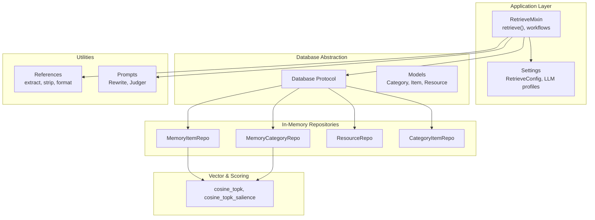
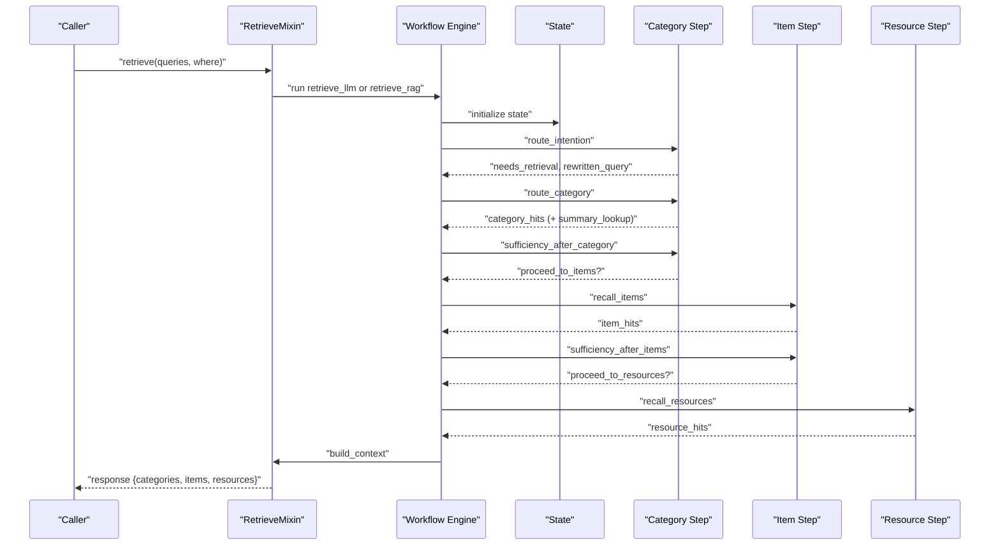
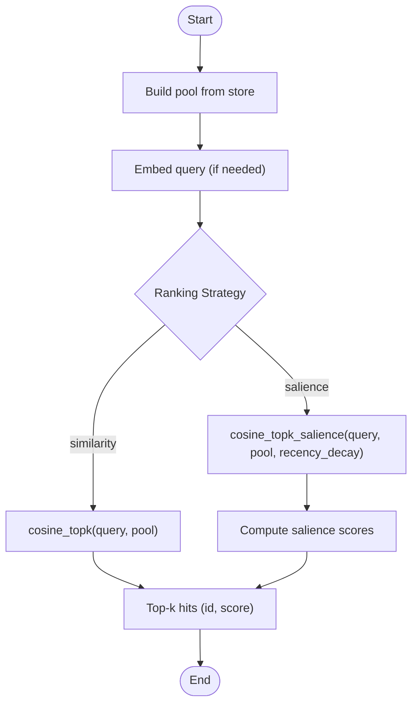
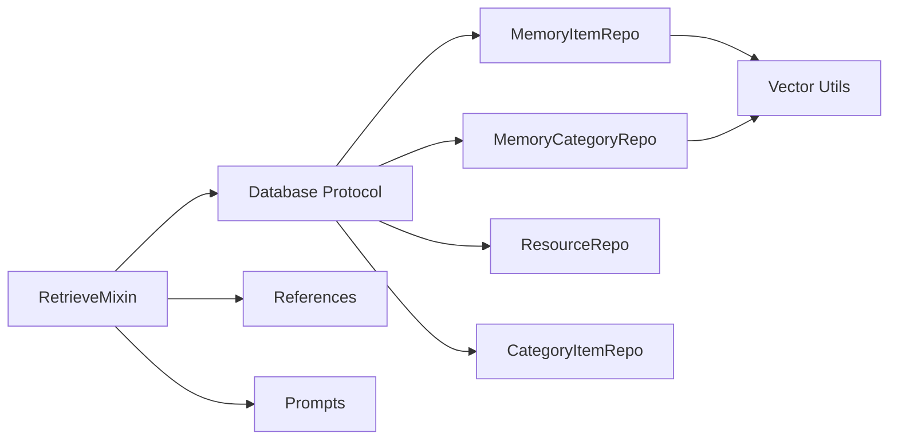

# Memory Layers Retrieval

<cite>
**Referenced Files in This Document**
- [retrieve.py](file://src/memu/app/retrieve.py)
- [settings.py](file://src/memu/app/settings.py)
- [interfaces.py](file://src/memu/database/interfaces.py)
- [models.py](file://src/memu/database/models.py)
- [vector.py](file://src/memu/database/inmemory/vector.py)
- [memory_category_repo.py](file://src/memu/database/inmemory/repositories/memory_category_repo.py)
- [memory_item_repo.py](file://src/memu/database/inmemory/repositories/memory_item_repo.py)
- [resource_repo.py](file://src/memu/database/inmemory/repositories/resource_repo.py)
- [category_item_repo.py](file://src/memu/database/inmemory/repositories/category_item_repo.py)
- [references.py](file://src/memu/utils/references.py)
- [query_rewriter.py](file://src/memu/prompts/retrieve/query_rewriter.py)
- [judger.py](file://src/memu/prompts/retrieve/judger.py)
- [factory.py](file://src/memu/database/factory.py)
</cite>

## Table of Contents
1. [Introduction](#introduction)
2. [Project Structure](#project-structure)
3. [Core Components](#core-components)
4. [Architecture Overview](#architecture-overview)
5. [Detailed Component Analysis](#detailed-component-analysis)
6. [Dependency Analysis](#dependency-analysis)
7. [Performance Considerations](#performance-considerations)
8. [Troubleshooting Guide](#troubleshooting-guide)
9. [Conclusion](#conclusion)
10. [Appendices](#appendices)

## Introduction
This document explains the hierarchical memory retrieval system across three layers: categories, items, and resources. Categories provide topic summaries and act as a coarse index; items are atomic memories with embeddings and optional reinforcement tracking; resources are raw artifacts (e.g., images, documents) with captions and embeddings. The retrieval engine supports two strategies:
- RAG mode: Uses vector embeddings and configurable ranking (similarity or salience-aware).
- LLM mode: Delegates ranking to an LLM per tier.

It documents retrieval order, cross-layer relationships, configuration options, materialization of hits into full objects, pooling mechanisms, and integration with vector embeddings. It also includes examples of how different configurations affect outcomes.

## Project Structure
The retrieval logic is implemented in the application layer and orchestrated by a workflow engine. Data models and repositories define the storage contracts and in-memory implementations. Vector utilities provide similarity and salience-aware ranking. Utilities handle reference parsing for cross-layer linkage.

**Diagram sources**
- [retrieve.py](file://src/memu/app/retrieve.py#L42-L85)
- [settings.py](file://src/memu/app/settings.py#L175-L202)
- [interfaces.py](file://src/memu/database/interfaces.py#L12-L26)
- [models.py](file://src/memu/database/models.py#L68-L106)
- [memory_category_repo.py](file://src/memu/database/inmemory/repositories/memory_category_repo.py#L15-L51)
- [memory_item_repo.py](file://src/memu/database/inmemory/repositories/memory_item_repo.py#L16-L196)
- [resource_repo.py](file://src/memu/database/inmemory/repositories/resource_repo.py#L13-L54)
- [category_item_repo.py](file://src/memu/database/inmemory/repositories/category_item_repo.py#L13-L43)
- [vector.py](file://src/memu/database/inmemory/vector.py#L56-L127)
- [references.py](file://src/memu/utils/references.py#L20-L49)
- [query_rewriter.py](file://src/memu/prompts/retrieve/query_rewriter.py#L1-L45)
- [judger.py](file://src/memu/prompts/retrieve/judger.py#L1-L40)

**Section sources**
- [retrieve.py](file://src/memu/app/retrieve.py#L42-L85)
- [settings.py](file://src/memu/app/settings.py#L175-L202)
- [interfaces.py](file://src/memu/database/interfaces.py#L12-L26)
- [models.py](file://src/memu/database/models.py#L68-L106)

## Core Components
- RetrieveMixin: Orchestrates retrieval workflows, builds state, and executes steps for routing, ranking, sufficiency checks, and context building.
- RetrieveConfig: Central configuration for retrieval behavior, including method (RAG or LLM), per-layer enablement, top_k, ranking strategy, recency decay, sufficiency checks, and LLM profiles.
- Database Protocol: Defines typed accessors for repositories and in-memory collections.
- Repositories: Provide list, search, and relation operations for categories, items, resources, and category-item relations.
- Vector Utilities: Implement cosine similarity and salience-aware scoring for ranking.
- References Utility: Parses and formats [ref:ITEM_ID] citations to link categories to items.

**Section sources**
- [retrieve.py](file://src/memu/app/retrieve.py#L42-L85)
- [settings.py](file://src/memu/app/settings.py#L146-L202)
- [interfaces.py](file://src/memu/database/interfaces.py#L12-L26)
- [memory_category_repo.py](file://src/memu/database/inmemory/repositories/memory_category_repo.py#L15-L51)
- [memory_item_repo.py](file://src/memu/database/inmemory/repositories/memory_item_repo.py#L16-L196)
- [resource_repo.py](file://src/memu/database/inmemory/repositories/resource_repo.py#L13-L54)
- [category_item_repo.py](file://src/memu/database/inmemory/repositories/category_item_repo.py#L13-L43)
- [vector.py](file://src/memu/database/inmemory/vector.py#L56-L127)
- [references.py](file://src/memu/utils/references.py#L20-L49)

## Architecture Overview
The retrieval pipeline runs as a workflow with two modes:

- RAG Mode:
  - Route intention (optional).
  - Rank categories by summary embeddings; optionally check sufficiency.
  - Recall items via vector search (similarity or salience-aware); optionally check sufficiency.
  - Recall resources via vector search; optionally check sufficiency.
  - Build final context by materializing hits into full objects.

- LLM Mode:
  - Route intention (optional).
  - LLM ranks categories; sufficiency check; LLM ranks items (optionally using category references and relations); sufficiency check; LLM ranks resources; build context.

**Diagram sources**
- [retrieve.py](file://src/memu/app/retrieve.py#L42-L85)
- [retrieve.py](file://src/memu/app/retrieve.py#L106-L210)
- [retrieve.py](file://src/memu/app/retrieve.py#L454-L536)

## Detailed Component Analysis

### Retrieval Configuration Options
Per-layer configuration is controlled via RetrieveConfig and nested sub-configs:
- CategoryConfig: enabled, top_k.
- ItemConfig: enabled, top_k, use_category_references, ranking ("similarity" or "salience"), recency_decay_days.
- ResourceConfig: enabled, top_k.

Additional controls:
- method: "rag" or "llm".
- route_intention: whether to rewrite queries and decide necessity.
- sufficiency_check: whether to evaluate sufficiency after each tier.
- LLM profiles for sufficiency checks and LLM ranking.

These fields govern retrieval order, ranking, and cross-layer behavior.

**Section sources**
- [settings.py](file://src/memu/app/settings.py#L146-L202)

### Retrieval Order and Cross-Layer Relationships
- Order: categories → items → resources.
- Cross-layer:
  - Category summaries may include [ref:ITEM_ID] citations; when enabled, items can be fetched by referenced IDs.
  - Relations between categories and items inform item ranking in LLM mode.
  - Sufficiency checks can trigger query rewriting and re-embedding for subsequent tiers.

**Section sources**
- [retrieve.py](file://src/memu/app/retrieve.py#L324-L344)
- [retrieve.py](file://src/memu/app/retrieve.py#L626-L640)
- [references.py](file://src/memu/utils/references.py#L20-L49)

### Materialization of Hits to Full Objects
After retrieval, hits are materialized into full objects:
- Categories: list of category records from the category pool.
- Items: list of item records from the item pool.
- Resources: list of resource records from the resource pool.

This ensures downstream consumers receive complete entities rather than bare IDs.

**Section sources**
- [retrieve.py](file://src/memu/app/retrieve.py#L426-L452)

### Pooling Mechanisms and Vector Embeddings
- Category pooling: list_categories filtered by where; summaries are embedded and ranked via cosine_topk.
- Item pooling: list_items filtered by where; vector_search_items supports:
  - similarity: cosine_topk(query, [(id, embedding)...]).
  - salience: cosine_topk_salience(query, [(id, embedding, reinforcement_count, last_reinforced_at)...], recency_decay_days).
- Resource pooling: list_resources filtered by where; captions are embedded and cosine_topk used for retrieval.

Salience-aware scoring combines similarity, reinforcement count, and recency decay with a half-life parameter.

**Diagram sources**
- [retrieve.py](file://src/memu/app/retrieve.py#L260-L286)
- [retrieve.py](file://src/memu/app/retrieve.py#L346-L367)
- [retrieve.py](file://src/memu/app/retrieve.py#L400-L424)
- [memory_item_repo.py](file://src/memu/database/inmemory/repositories/memory_item_repo.py#L169-L196)
- [vector.py](file://src/memu/database/inmemory/vector.py#L56-L127)

**Section sources**
- [memory_category_repo.py](file://src/memu/database/inmemory/repositories/memory_category_repo.py#L21-L24)
- [memory_item_repo.py](file://src/memu/database/inmemory/repositories/memory_item_repo.py#L22-L25)
- [memory_item_repo.py](file://src/memu/database/inmemory/repositories/memory_item_repo.py#L169-L196)
- [resource_repo.py](file://src/memu/database/inmemory/repositories/resource_repo.py#L19-L22)
- [vector.py](file://src/memu/database/inmemory/vector.py#L56-L127)

### Ranking Strategies and Recency Decay
- Similarity-only: cosine similarity between query and embeddings.
- Salience-aware: multiplies similarity by log(reinforcement_count + 1) and exponential recency decay with half-life in days.

Recency decay is computed using the last_reinforced_at timestamp stored in item.extra.

**Section sources**
- [memory_item_repo.py](file://src/memu/database/inmemory/repositories/memory_item_repo.py#L180-L192)
- [vector.py](file://src/memu/database/inmemory/vector.py#L16-L53)

### Query Rewriting and Sufficiency Checks
- Query rewriting: resolves pronouns and referential expressions using conversation history.
- Sufficiency judgment: determines whether more retrieval is needed based on retrieved content.

Both are integrated into the workflow to refine queries and control retrieval depth.

**Section sources**
- [retrieve.py](file://src/memu/app/retrieve.py#L228-L258)
- [retrieve.py](file://src/memu/app/retrieve.py#L288-L322)
- [retrieve.py](file://src/memu/app/retrieve.py#L369-L398)
- [retrieve.py](file://src/memu/app/retrieve.py#L538-L568)
- [retrieve.py](file://src/memu/app/retrieve.py#L590-L613)
- [retrieve.py](file://src/memu/app/retrieve.py#L659-L682)
- [query_rewriter.py](file://src/memu/prompts/retrieve/query_rewriter.py#L1-L45)
- [judger.py](file://src/memu/prompts/retrieve/judger.py#L1-L40)

### Examples: How Different Configurations Affect Outcomes
- Increasing category.top_k expands the initial topic coverage; may increase downstream item recall.
- Switching item.ranking to "salience" prioritizes recently reinforced or frequently recalled items; adjust recency_decay_days to control how quickly older memories decay.
- Enabling item.use_category_references allows category summaries to drive targeted item retrieval via [ref:...].
- Using LLM mode delegates ranking to an LLM; combine with category and item relations to guide item ranking.
- Disabling sufficiency_check reduces iterations but may under-retrieve or over-retrieve.

These behaviors are implemented by the workflow steps and repository vector search methods.

**Section sources**
- [settings.py](file://src/memu/app/settings.py#L146-L202)
- [retrieve.py](file://src/memu/app/retrieve.py#L106-L210)
- [retrieve.py](file://src/memu/app/retrieve.py#L454-L536)
- [memory_item_repo.py](file://src/memu/database/inmemory/repositories/memory_item_repo.py#L169-L196)
- [references.py](file://src/memu/utils/references.py#L20-L49)

## Dependency Analysis
The retrieval system composes several subsystems with clear boundaries:
- RetrieveMixin depends on Database protocol and LLM/embedding clients.
- Repositories depend on models and filters.
- Vector utilities are shared across item and category ranking.
- References utility is used to parse and resolve cross-layer links.

**Diagram sources**
- [retrieve.py](file://src/memu/app/retrieve.py#L42-L85)
- [interfaces.py](file://src/memu/database/interfaces.py#L12-L26)
- [memory_category_repo.py](file://src/memu/database/inmemory/repositories/memory_category_repo.py#L15-L51)
- [memory_item_repo.py](file://src/memu/database/inmemory/repositories/memory_item_repo.py#L16-L196)
- [resource_repo.py](file://src/memu/database/inmemory/repositories/resource_repo.py#L13-L54)
- [category_item_repo.py](file://src/memu/database/inmemory/repositories/category_item_repo.py#L13-L43)
- [vector.py](file://src/memu/database/inmemory/vector.py#L56-L127)
- [references.py](file://src/memu/utils/references.py#L20-L49)

**Section sources**
- [interfaces.py](file://src/memu/database/interfaces.py#L12-L26)
- [models.py](file://src/memu/database/models.py#L68-L106)

## Performance Considerations
- Vector search uses argpartition for top-k selection to avoid full sorts, reducing complexity.
- Salience-aware scoring iterates over the corpus; consider limiting the item pool via where filters to reduce cost.
- Embedding calls are batched per step; ensure appropriate embed_llm_profile batching.
- In-memory stores are fast but not persistent; for large corpora, consider vector index backends.

[No sources needed since this section provides general guidance]

## Troubleshooting Guide
Common issues and diagnostics:
- Empty or missing embeddings: Ensure embeddings are generated before vector search; verify repository embedding fields.
- Insufficient retrieval depth: Enable sufficiency_check and consider increasing top_k per tier.
- Poor relevance: Switch item ranking to "salience" and tune recency_decay_days.
- Mislinked references: Verify [ref:ITEM_ID] formatting in category summaries and presence of corresponding items.

Operational hooks:
- Workflow state inspection during steps to confirm needs_retrieval, rewritten_query, and query_vector updates.
- Repository filtering via where to constrain pools and improve precision.

**Section sources**
- [retrieve.py](file://src/memu/app/retrieve.py#L228-L258)
- [retrieve.py](file://src/memu/app/retrieve.py#L288-L322)
- [retrieve.py](file://src/memu/app/retrieve.py#L369-L398)
- [memory_item_repo.py](file://src/memu/database/inmemory/repositories/memory_item_repo.py#L169-L196)
- [references.py](file://src/memu/utils/references.py#L20-L49)

## Conclusion
The retrieval system provides a robust, configurable, and extensible pipeline across categories, items, and resources. By combining vector similarity with optional salience-aware scoring and LLM-driven ranking, it balances breadth, relevance, and contextual sufficiency. Proper configuration of top_k, ranking strategy, and recency decay yields predictable outcomes tailored to application needs.

[No sources needed since this section summarizes without analyzing specific files]

## Appendices

### Retrieval Modes and Workflows
- RAG workflow: embedding-based ranking, optional sufficiency checks, and iterative refinement.
- LLM workflow: LLM-based ranking per tier, optional use of category references and relations.

**Section sources**
- [retrieve.py](file://src/memu/app/retrieve.py#L106-L210)
- [retrieve.py](file://src/memu/app/retrieve.py#L454-L536)

### Database Provider Support
The system supports pluggable metadata stores: in-memory, PostgreSQL (with optional pgvector), and SQLite. Vector index provider is selected automatically based on metadata store provider.

**Section sources**
- [factory.py](file://src/memu/database/factory.py#L15-L44)
- [settings.py](file://src/memu/app/settings.py#L305-L322)