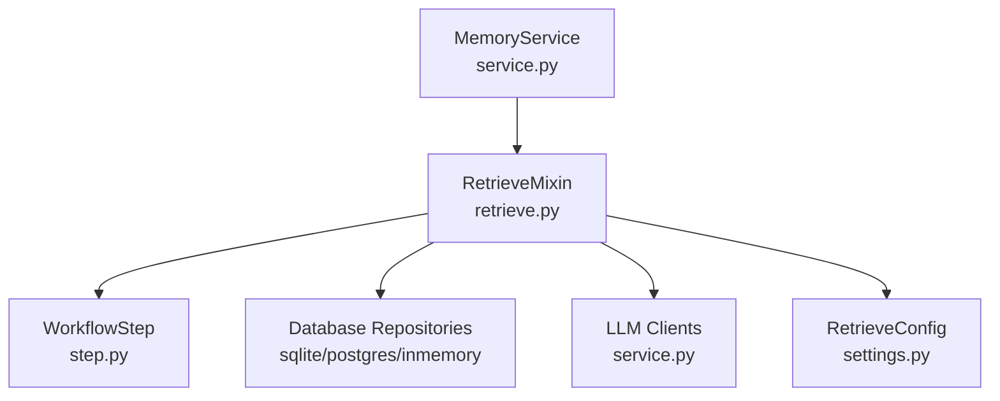
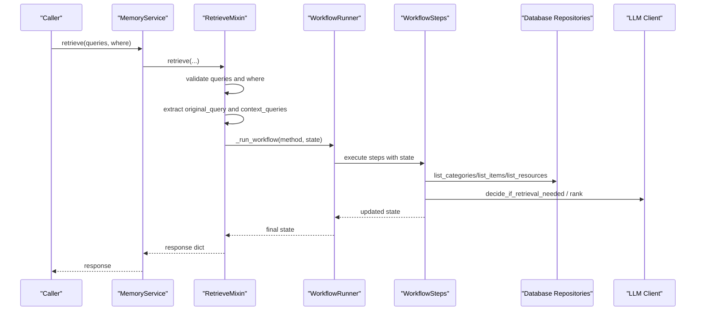
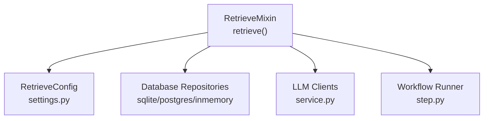

# Method Signature and Parameters

<cite>
**Referenced Files in This Document**
- [retrieve.py](file://src/memu/app/retrieve.py)
- [service.py](file://src/memu/app/service.py)
- [settings.py](file://src/memu/app/settings.py)
- [step.py](file://src/memu/workflow/step.py)
- [base.py (SQLite)](file://src/memu/database/sqlite/repositories/base.py)
- [base.py (Postgres)](file://src/memu/database/postgres/repositories/base.py)
- [filter.py (In-Memory)](file://src/memu/database/inmemory/repositories/filter.py)
- [test_postgres.py](file://tests/test_postgres.py)
- [test_sqlite.py](file://tests/test_sqlite.py)
- [getting_started_robust.py](file://examples/getting_started_robust.py)
</cite>

## Table of Contents
1. [Introduction](#introduction)
2. [Project Structure](#project-structure)
3. [Core Components](#core-components)
4. [Architecture Overview](#architecture-overview)
5. [Detailed Component Analysis](#detailed-component-analysis)
6. [Dependency Analysis](#dependency-analysis)
7. [Performance Considerations](#performance-considerations)
8. [Troubleshooting Guide](#troubleshooting-guide)
9. [Conclusion](#conclusion)

## Introduction
This document provides comprehensive documentation for the `retrieve()` method signature and parameter specifications. It explains the method signature, parameter types, validation rules, acceptable values, default behaviors, and error conditions. It also documents the structure of the `queries` parameter (role/content fields), the `where` filter syntax with field operators, and the relationship between the original query and context queries. Practical examples demonstrate common usage patterns and parameter combinations.

## Project Structure
The `retrieve()` method resides in the `RetrieveMixin` class within the application layer. It orchestrates retrieval workflows using configurable strategies (RAG vs LLM-based) and integrates with database repositories and LLM clients.

**Diagram sources**
- [retrieve.py](file://src/memu/app/retrieve.py#L27-L85)
- [service.py](file://src/memu/app/service.py#L49-L200)
- [step.py](file://src/memu/workflow/step.py#L11-L47)
- [settings.py](file://src/memu/app/settings.py#L175-L200)

**Section sources**
- [retrieve.py](file://src/memu/app/retrieve.py#L27-L85)
- [service.py](file://src/memu/app/service.py#L49-L200)
- [step.py](file://src/memu/workflow/step.py#L11-L47)
- [settings.py](file://src/memu/app/settings.py#L175-L200)

## Core Components
- RetrieveMixin.retrieve(): Asynchronous method that accepts a list of query messages and optional scope filters, returning a structured dictionary containing retrieval results.
- RetrieveConfig: Configuration object controlling retrieval behavior (method, routing, sufficiency checks, and per-stage limits).
- WorkflowState: Dictionary carrying runtime state passed through workflow steps.
- Database repositories: Provide filtering and retrieval of categories, items, and resources based on normalized `where` filters.

Key responsibilities:
- Validate and normalize input parameters.
- Extract the original query from the last element of the queries list.
- Build context queries from preceding elements.
- Apply scope filters to constrain retrieval to a user-defined subset.
- Execute either RAG or LLM-based retrieval workflows.

**Section sources**
- [retrieve.py](file://src/memu/app/retrieve.py#L41-L85)
- [settings.py](file://src/memu/app/settings.py#L175-L200)
- [step.py](file://src/memu/workflow/step.py#L11-L47)

## Architecture Overview
The retrieval pipeline is driven by a configurable workflow. The method constructs a state object and dispatches it to either a RAG or LLM workflow depending on configuration.

**Diagram sources**
- [retrieve.py](file://src/memu/app/retrieve.py#L41-L85)
- [retrieve.py](file://src/memu/app/retrieve.py#L106-L210)
- [retrieve.py](file://src/memu/app/retrieve.py#L454-L536)
- [service.py](file://src/memu/app/service.py#L49-L200)

## Detailed Component Analysis

### Method Signature and Parameters
- Method: `retrieve(self, queries: list[dict[str, Any]], where: dict[str, Any] | None = None) -> dict[str, Any]`
- Parameters:
  - queries: list of query objects representing a conversation-like sequence. The last element is treated as the active query; preceding elements form the context used for query rewriting and sufficiency checks.
  - where: optional dictionary specifying scope filters applied to database queries. Keys may include field names and operators separated by "__".

Validation and behavior:
- Empty queries list raises a specific error condition.
- Unknown filter fields in `where` cause validation to fail with an error indicating invalid scope.
- The method extracts the original query text from the last query object and builds a context from earlier entries.
- The method selects between RAG and LLM workflows based on configuration.

Return type:
- A dictionary containing retrieval results with keys such as needs_retrieval, original_query, rewritten_query, next_step_query, categories, items, and resources.

**Section sources**
- [retrieve.py](file://src/memu/app/retrieve.py#L41-L85)
- [retrieve.py](file://src/memu/app/retrieve.py#L87-L104)

### Parameter Details

#### queries: list[dict[str, Any]]
- Purpose: Defines the conversation context and the active query.
- Structure:
  - Each element is a dictionary with:
    - role: string (e.g., "user", "assistant")
    - content: either a string or a dictionary with a "text" field
- Validation rules:
  - Must not be empty; otherwise raises a specific error.
  - Each element must be a dictionary with a valid content field; otherwise raises a type error.
  - If content is a dictionary, it must contain a non-empty "text" field; otherwise raises an empty content error.
  - Backward compatibility allows passing a string directly for the last element.
- Acceptable values:
  - Role must be a string; content must be a string or a dictionary with "text".
- Defaults:
  - None for where; queries must be provided.

Behavior:
- The last element is treated as the active query for retrieval.
- Earlier elements are used to construct conversation history for query rewriting and sufficiency checks.

**Section sources**
- [retrieve.py](file://src/memu/app/retrieve.py#L812-L840)

#### where: dict[str, Any] | None
- Purpose: Scope filters to constrain retrieval to a specific user or dataset subset.
- Structure:
  - Keys are field names optionally followed by operators using "__" separator.
  - Values are expected values for matching.
- Operators:
  - Exact match: field=value
  - Membership: field__in=[...] or field__in="single_value"
- Validation rules:
  - Unknown filter fields (not present in the configured user model) are rejected with an error.
  - None values are ignored.
- Acceptable values:
  - For exact match: any comparable value compatible with the underlying repository.
  - For membership: a list or a single value.
- Defaults:
  - None (no scope filters).

Normalization:
- The method normalizes the where clause against the configured user model to ensure only valid fields are used.

**Section sources**
- [retrieve.py](file://src/memu/app/retrieve.py#L87-L104)
- [base.py (SQLite)](file://src/memu/database/sqlite/repositories/base.py#L80-L100)
- [base.py (Postgres)](file://src/memu/database/postgres/repositories/base.py#L78-L86)
- [filter.py (In-Memory)](file://src/memu/database/inmemory/repositories/filter.py#L7-L29)

### Relationship Between Original Query and Context Queries
- Original query: Extracted from the last element of the queries list.
- Context queries: All elements except the last one.
- The method passes both to downstream steps for query rewriting and sufficiency checks.
- The skip_rewrite flag is set when there is only one query, preventing unnecessary rewriting.

**Section sources**
- [retrieve.py](file://src/memu/app/retrieve.py#L50-L70)

### Parameter Validation Logic and Error Conditions
- Empty queries list: Raises a specific error indicating empty queries.
- Invalid query object: Raises a type error for unsupported structures.
- Empty content in query: Raises an empty content error when content is a dictionary without a non-empty "text" field.
- Unknown filter field: Raises an error indicating the field is not valid for the current user scope.
- Workflow failure: If the workflow fails to produce a response, a runtime error is raised.

Sanitization:
- Query text extraction handles backward compatibility and ensures non-empty strings.
- Where normalization filters out None values and validates fields against the user model.

**Section sources**
- [retrieve.py](file://src/memu/app/retrieve.py#L47-L48)
- [retrieve.py](file://src/memu/app/retrieve.py#L826-L839)
- [retrieve.py](file://src/memu/app/retrieve.py#L98-L101)

### Practical Examples and Common Usage Patterns

#### Basic retrieval with a single query
- Use case: Direct recall without context.
- Pattern: Provide a single query object with role and content.
- Behavior: skip_rewrite is true; no context is used for rewriting.

**Section sources**
- [getting_started_robust.py](file://examples/getting_started_robust.py#L88)

#### Multi-turn retrieval with context
- Use case: Query depends on prior conversation turns.
- Pattern: Provide multiple query objects; the last is the active query, others form context.
- Behavior: Context is formatted and passed to sufficiency checks and query rewriting.

**Section sources**
- [test_postgres.py](file://tests/test_postgres.py#L36-L65)
- [test_sqlite.py](file://tests/test_sqlite.py#L69-L76)

#### Scoped retrieval with where filters
- Use case: Restrict retrieval to a specific user or dataset subset.
- Pattern: Pass where with exact match or membership operators.
- Behavior: Filters are normalized against the user model and applied to repository queries.

**Section sources**
- [test_postgres.py](file://tests/test_postgres.py#L48-L64)
- [test_sqlite.py](file://tests/test_sqlite.py#L70-L75)

#### RAG vs LLM-based retrieval
- Use case: Choose between embedding-based vector search (RAG) and LLM-driven ranking (LLM).
- Pattern: Configure retrieve_config.method accordingly.
- Behavior: Different workflows are executed with distinct steps and prompts.

**Section sources**
- [retrieve.py](file://src/memu/app/retrieve.py#L62-L63)
- [retrieve.py](file://src/memu/app/retrieve.py#L106-L210)
- [retrieve.py](file://src/memu/app/retrieve.py#L454-L536)

## Dependency Analysis
The retrieve method depends on:
- RetrieveConfig for workflow selection and per-stage controls.
- Database repositories for listing categories, items, and resources with normalized where filters.
- LLM clients for query rewriting and ranking decisions.
- Workflow runner for executing the selected workflow.

**Diagram sources**
- [retrieve.py](file://src/memu/app/retrieve.py#L41-L85)
- [settings.py](file://src/memu/app/settings.py#L175-L200)
- [service.py](file://src/memu/app/service.py#L49-L200)
- [step.py](file://src/memu/workflow/step.py#L11-L47)

**Section sources**
- [retrieve.py](file://src/memu/app/retrieve.py#L41-L85)
- [settings.py](file://src/memu/app/settings.py#L175-L200)
- [service.py](file://src/memu/app/service.py#L49-L200)
- [step.py](file://src/memu/workflow/step.py#L11-L47)

## Performance Considerations
- RAG workflow uses vector search and cosine similarity; performance scales with top_k and repository sizes.
- LLM workflow delegates ranking to the language model; performance depends on model latency and prompt sizes.
- Using where filters reduces the search space and improves performance by limiting repository scans.
- Query rewriting and sufficiency checks introduce additional LLM calls; configure these judiciously to balance accuracy and speed.

## Troubleshooting Guide
Common issues and resolutions:
- Empty queries list: Ensure at least one query object is provided.
- Invalid query structure: Verify each query object has a valid role and content field.
- Unknown filter field: Confirm the field exists in the configured user model; adjust where filters accordingly.
- Workflow failure: Check that the workflow runner is properly configured and that required capabilities are available.

**Section sources**
- [retrieve.py](file://src/memu/app/retrieve.py#L47-L48)
- [retrieve.py](file://src/memu/app/retrieve.py#L826-L839)
- [retrieve.py](file://src/memu/app/retrieve.py#L98-L101)
- [retrieve.py](file://src/memu/app/retrieve.py#L81-L84)

## Conclusion
The `retrieve()` method provides a flexible and robust interface for memory retrieval with support for contextual queries, scoped filtering, and dual retrieval strategies. Proper validation and normalization ensure reliable behavior, while clear error handling and workflow orchestration deliver predictable outcomes across diverse usage patterns.