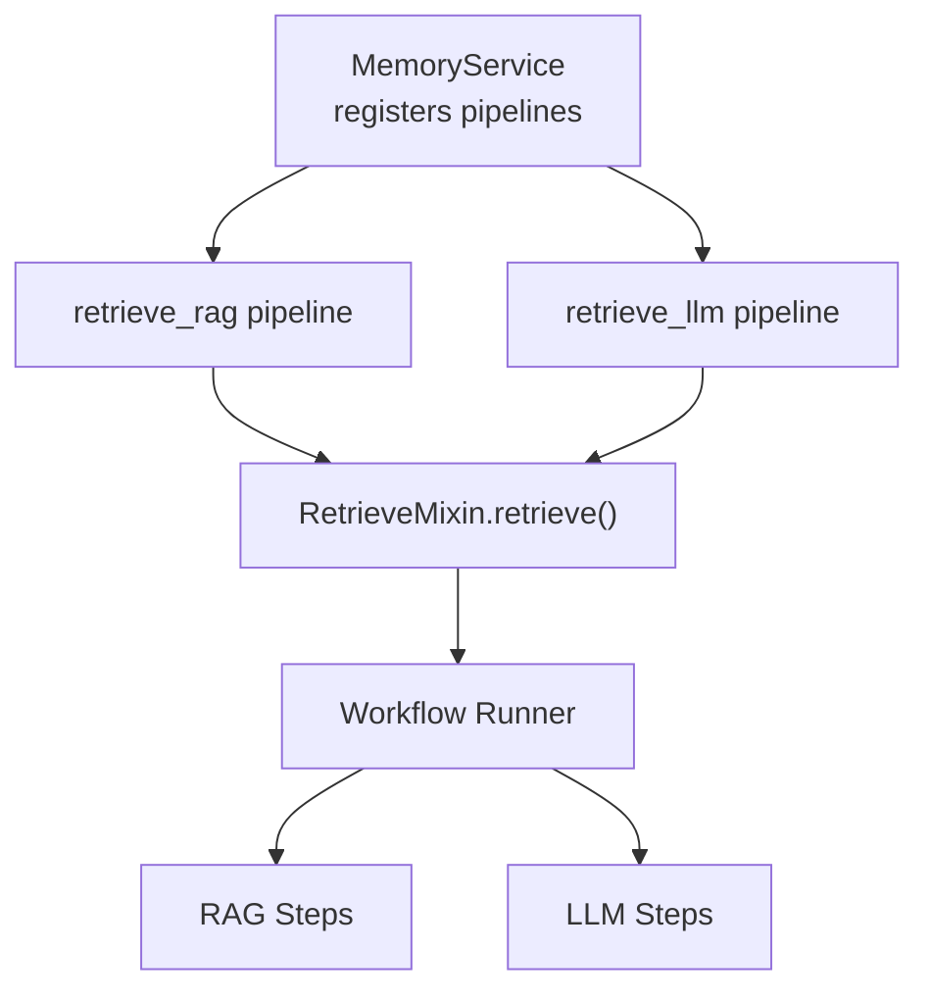
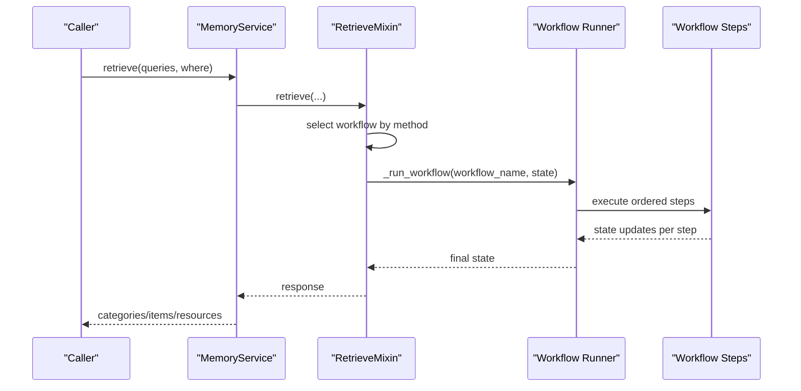
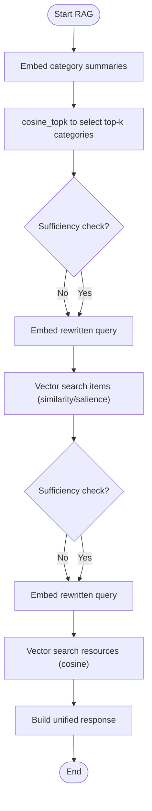
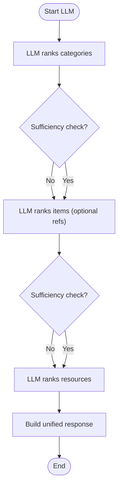
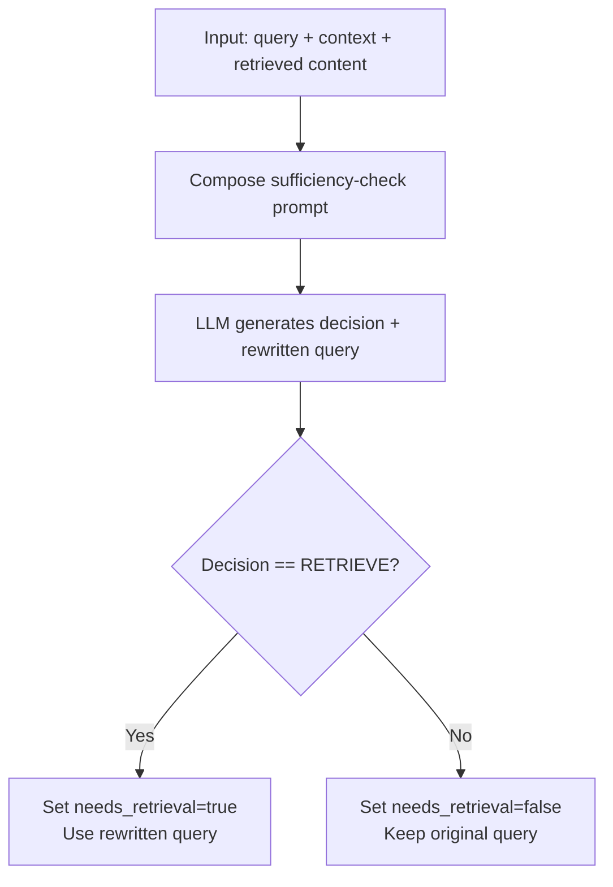
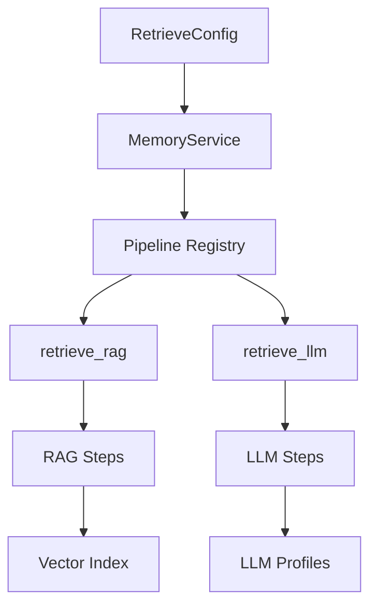

# Retrieval Modes

<cite>
**Referenced Files in This Document**
- [retrieve.py](file://src/memu/app/retrieve.py)
- [settings.py](file://src/memu/app/settings.py)
- [service.py](file://src/memu/app/service.py)
- [pre_retrieval_decision.py](file://src/memu/prompts/retrieve/pre_retrieval_decision.py)
- [llm_category_ranker.py](file://src/memu/prompts/retrieve/llm_category_ranker.py)
- [llm_item_ranker.py](file://src/memu/prompts/retrieve/llm_item_ranker.py)
- [llm_resource_ranker.py](file://src/memu/prompts/retrieve/llm_resource_ranker.py)
- [test_inmemory.py](file://tests/test_inmemory.py)
- [test_postgres.py](file://tests/test_postgres.py)
</cite>

## Table of Contents
1. [Introduction](#introduction)
2. [Project Structure](#project-structure)
3. [Core Components](#core-components)
4. [Architecture Overview](#architecture-overview)
5. [Detailed Component Analysis](#detailed-component-analysis)
6. [Dependency Analysis](#dependency-analysis)
7. [Performance Considerations](#performance-considerations)
8. [Troubleshooting Guide](#troubleshooting-guide)
9. [Conclusion](#conclusion)
10. [Appendices](#appendices)

## Introduction
This document explains the two retrieval modes supported by the retrieve() method:
- RAG-based vector search: Uses embedding vectors and cosine similarity to retrieve relevant memory categories, items, and resources.
- LLM-driven ranking: Delegates ranking and selection to language models at each retrieval tier.

It covers when to use each mode, their advantages and trade-offs, configuration options for retrieve_config.method, performance characteristics, accuracy differences, resource requirements, and decision criteria for choosing between modes.

## Project Structure
The retrieval logic is implemented in the RetrieveMixin class and orchestrated by MemoryService. Two distinct workflows are registered:
- retrieve_rag: Embedding-based vector search with sufficiency checks and query rewriting.
- retrieve_llm: LLM-driven ranking at each tier with sufficiency checks and query rewriting.

**Diagram sources**
- [service.py](file://src/memu/app/service.py#L315-L323)
- [retrieve.py](file://src/memu/app/retrieve.py#L42-L85)

**Section sources**
- [service.py](file://src/memu/app/service.py#L315-L323)
- [retrieve.py](file://src/memu/app/retrieve.py#L42-L85)

## Core Components
- RetrieveConfig.method: Controls the retrieval mode. Accepts "rag" or "llm".
- RetrieveConfig.route_intention: Enables query routing and rewriting at the start of retrieval.
- RetrieveConfig.sufficiency_check: Enables iterative sufficiency checks after each tier.
- RetrieveConfig.category/top_k, item/top_k, resource/top_k: Control how many results to return per tier.
- RetrieveConfig.item.use_category_references: When insufficient category retrieval occurs, follow [ref:ITEM_ID] citations to fetch referenced items.
- RetrieveConfig.item.ranking: "similarity" (cosine) or "salience" (reinforcement + recency).
- RetrieveConfig.item.recency_decay_days: Half-life for recency decay in salience scoring.
- LLM profiles: sufficiency_check_llm_profile, llm_ranking_llm_profile.

**Section sources**
- [settings.py](file://src/memu/app/settings.py#L175-L202)
- [settings.py](file://src/memu/app/settings.py#L146-L173)
- [settings.py](file://src/memu/app/settings.py#L151-L168)

## Architecture Overview
The retrieve() method selects a workflow based on retrieve_config.method and runs a multi-tier retrieval pipeline:
- Route intention: Decide if retrieval is needed and optionally rewrite the query.
- Category tier: Retrieve top-k categories (RAG: vector search; LLM: LLM ranking).
- Sufficiency check: Judge if more retrieval is needed and optionally rewrite the query.
- Item tier: Retrieve top-k items (RAG: vector search; LLM: LLM ranking).
- Sufficiency check: Judge if more retrieval is needed and optionally rewrite the query.
- Resource tier: Retrieve top-k resources (RAG: vector search; LLM: LLM ranking).
- Build context: Materialize results into a unified response.

**Diagram sources**
- [retrieve.py](file://src/memu/app/retrieve.py#L42-L85)
- [service.py](file://src/memu/app/service.py#L350-L360)

## Detailed Component Analysis

### RAG-based Vector Search Mode
- Category tier: Embeddings of category summaries are computed and cosine_topk is used to retrieve top-k categories.
- Item tier: Vector search over memory items using query embeddings; supports "similarity" or "salience" ranking with recency decay.
- Resource tier: Vector search over resource embeddings using cosine_topk.
- Sufficiency checks: After each tier, the system decides whether to continue and optionally rewrites the query.

**Diagram sources**
- [retrieve.py](file://src/memu/app/retrieve.py#L106-L210)
- [retrieve.py](file://src/memu/app/retrieve.py#L260-L286)
- [retrieve.py](file://src/memu/app/retrieve.py#L346-L367)
- [retrieve.py](file://src/memu/app/retrieve.py#L400-L424)

**Section sources**
- [retrieve.py](file://src/memu/app/retrieve.py#L106-L210)
- [retrieve.py](file://src/memu/app/retrieve.py#L260-L286)
- [retrieve.py](file://src/memu/app/retrieve.py#L346-L367)
- [retrieve.py](file://src/memu/app/retrieve.py#L400-L424)

### LLM-driven Ranking Mode
- Category tier: LLM ranks categories by relevance to the query.
- Item tier: LLM ranks items within relevant categories; can use category references to narrow candidates.
- Resource tier: LLM ranks resources based on context (categories and items).
- Sufficiency checks: After each tier, the system decides whether to continue and optionally rewrite the query.

**Diagram sources**
- [retrieve.py](file://src/memu/app/retrieve.py#L454-L536)
- [retrieve.py](file://src/memu/app/retrieve.py#L570-L588)
- [retrieve.py](file://src/memu/app/retrieve.py#L615-L657)
- [retrieve.py](file://src/memu/app/retrieve.py#L684-L706)

**Section sources**
- [retrieve.py](file://src/memu/app/retrieve.py#L454-L536)
- [retrieve.py](file://src/memu/app/retrieve.py#L570-L588)
- [retrieve.py](file://src/memu/app/retrieve.py#L615-L657)
- [retrieve.py](file://src/memu/app/retrieve.py#L684-L706)

### Decision Logic and Query Rewriting
Both modes use a shared sufficiency-check prompt to decide whether to continue retrieval and to rewrite the query with contextual information. The decision is extracted from structured LLM output.

**Diagram sources**
- [pre_retrieval_decision.py](file://src/memu/prompts/retrieve/pre_retrieval_decision.py#L1-L54)
- [retrieve.py](file://src/memu/app/retrieve.py#L746-L784)

**Section sources**
- [pre_retrieval_decision.py](file://src/memu/prompts/retrieve/pre_retrieval_decision.py#L1-L54)
- [retrieve.py](file://src/memu/app/retrieve.py#L746-L784)

### Configuration Options for retrieve_config.method
- Values: "rag" or "llm"
- Behavior: Determines which workflow is executed and how tiers are processed.

**Section sources**
- [settings.py](file://src/memu/app/settings.py#L175-L202)
- [retrieve.py](file://src/memu/app/retrieve.py#L63-L63)

### LLM Ranking Prompts
- Category ranking prompt: Guides LLM to select top-k relevant categories.
- Item ranking prompt: Guides LLM to select top-k relevant items within relevant categories.
- Resource ranking prompt: Guides LLM to select top-k relevant resources based on context.

**Section sources**
- [llm_category_ranker.py](file://src/memu/prompts/retrieve/llm_category_ranker.py#L1-L36)
- [llm_item_ranker.py](file://src/memu/prompts/retrieve/llm_item_ranker.py#L1-L41)
- [llm_resource_ranker.py](file://src/memu/prompts/retrieve/llm_resource_ranker.py#L1-L41)

## Dependency Analysis
- MemoryService registers two pipelines: retrieve_rag and retrieve_llm.
- RetrieveMixin builds step sequences for each mode and orchestrates state transitions.
- LLM profiles control which LLM backend and model are used for sufficiency checks and ranking.
- Vector operations depend on configured vector index provider (bruteforce/pgvector/in-memory).

**Diagram sources**
- [service.py](file://src/memu/app/service.py#L315-L323)
- [settings.py](file://src/memu/app/settings.py#L175-L202)

**Section sources**
- [service.py](file://src/memu/app/service.py#L315-L323)
- [settings.py](file://src/memu/app/settings.py#L175-L202)

## Performance Considerations
- RAG-based vector search:
  - Pros: Fast, deterministic, scales with vector index provider; minimal LLM calls.
  - Cons: Accuracy depends on embedding quality and query phrasing; may miss nuanced semantics.
  - Cost drivers: Embedding API calls, vector index operations, optional LLM sufficiency checks.
- LLM-driven ranking:
  - Pros: More flexible and semantically robust; can leverage category references and context.
  - Cons: Higher LLM cost; slower due to multiple LLM calls; sensitive to prompt quality and model capabilities.
  - Cost drivers: Multiple LLM calls per tier plus potential embedding calls for query rewriting.

[No sources needed since this section provides general guidance]

## Troubleshooting Guide
- Unknown filter field errors: Ensure where clause keys correspond to user model fields.
- Empty queries: retrieve() raises an error if queries is empty.
- Workflow failures: If response is None, a runtime error is raised indicating workflow failure.
- LLM parsing failures: Responses are parsed expecting JSON blobs; failures are logged and ignored gracefully.

**Section sources**
- [retrieve.py](file://src/memu/app/retrieve.py#L47-L48)
- [retrieve.py](file://src/memu/app/retrieve.py#L82-L84)
- [retrieve.py](file://src/memu/app/retrieve.py#L87-L104)
- [retrieve.py](file://src/memu/app/retrieve.py#L1325-L1347)
- [retrieve.py](file://src/memu/app/retrieve.py#L1349-L1371)
- [retrieve.py](file://src/memu/app/retrieve.py#L1373-L1395)

## Conclusion
Choose RAG-based vector search when:
- You need fast, low-cost retrieval with consistent latency.
- Your data is well-embedded and queries align with surface-level semantics.
- You want minimal LLM usage and rely on vector similarity.

Choose LLM-driven ranking when:
- You need nuanced semantic understanding and flexibility.
- You benefit from category references and contextual ranking.
- You can afford higher LLM costs and accept increased latency.

## Appendices

### Decision Criteria Matrix
- Data characteristics:
  - High-quality embeddings and clear query phrasing: favor RAG.
  - Ambiguous or multi-faceted queries: favor LLM.
- System constraints:
  - Budget/Limits on LLM calls: favor RAG.
  - Latency budgets: favor RAG.
- Accuracy requirements:
  - Surface-level recall: favor RAG.
  - Deep semantic alignment: favor LLM.

[No sources needed since this section provides general guidance]

### Examples Demonstrating Each Mode
- RAG mode example (in-memory):
  - Sets retrieve_config.method = "rag", calls retrieve(), prints categories, items, and resources.
- LLM mode example (in-memory):
  - Sets retrieve_config.method = "llm", calls retrieve(), prints categories, items, and resources.
- RAG mode example (PostgreSQL):
  - Similar pattern with database-backed storage.

**Section sources**
- [test_inmemory.py](file://tests/test_inmemory.py#L54-L68)
- [test_inmemory.py](file://tests/test_inmemory.py#L68-L100)
- [test_postgres.py](file://tests/test_postgres.py#L46-L65)