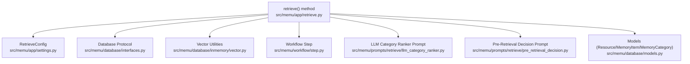
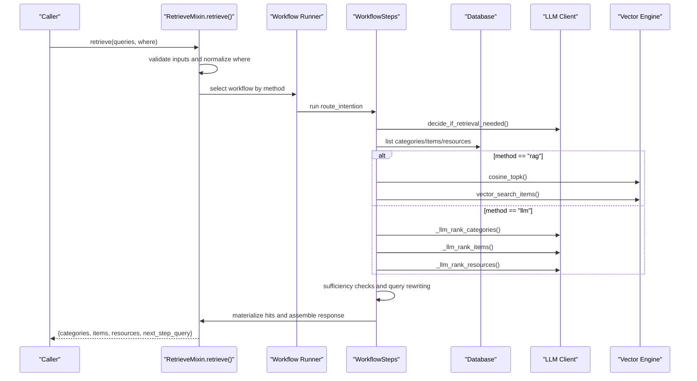
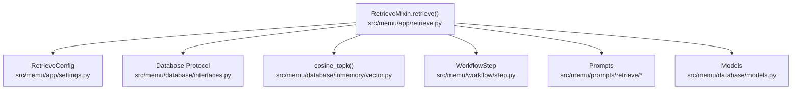

# Retrieve Method

<cite>
**Referenced Files in This Document**
- [retrieve.py](file://src/memu/app/retrieve.py)
- [settings.py](file://src/memu/app/settings.py)
- [interfaces.py](file://src/memu/database/interfaces.py)
- [models.py](file://src/memu/database/models.py)
- [vector.py](file://src/memu/database/inmemory/vector.py)
- [step.py](file://src/memu/workflow/step.py)
- [llm_category_ranker.py](file://src/memu/prompts/retrieve/llm_category_ranker.py)
- [pre_retrieval_decision.py](file://src/memu/prompts/retrieve/pre_retrieval_decision.py)
- [getting_started_robust.py](file://examples/getting_started_robust.py)
- [README_zh.md](file://readme/README_zh.md)
- [README_es.md](file://readme/README_es.md)
- [README_fr.md](file://readme/README_fr.md)
</cite>

## Table of Contents
1. [Introduction](#introduction)
2. [Project Structure](#project-structure)
3. [Core Components](#core-components)
4. [Architecture Overview](#architecture-overview)
5. [Detailed Component Analysis](#detailed-component-analysis)
6. [Dependency Analysis](#dependency-analysis)
7. [Performance Considerations](#performance-considerations)
8. [Troubleshooting Guide](#troubleshooting-guide)
9. [Conclusion](#conclusion)
10. [Appendices](#appendices)

## Introduction
This document provides comprehensive API documentation for the retrieve() method focused on memory retrieval and contextual search. It covers method signature, parameter specifications, return value structure, dual retrieval modes (RAG-based vector search and LLM-driven ranking), practical examples, performance optimization, caching strategies, and scalability considerations.

## Project Structure
The retrieve() method resides in the application layer and orchestrates retrieval across categories, memory items, and resources. It integrates with:
- Configuration models for retrieval behavior
- Database interfaces for storage operations
- Vector similarity utilities for embedding-based search
- Workflow engine for stepwise execution
- Prompt templates for LLM-based ranking and decision-making

**Diagram sources**
- [retrieve.py](file://src/memu/app/retrieve.py#L42-L85)
- [settings.py](file://src/memu/app/settings.py#L175-L202)
- [interfaces.py](file://src/memu/database/interfaces.py#L12-L26)
- [vector.py](file://src/memu/database/inmemory/vector.py#L56-L91)
- [step.py](file://src/memu/workflow/step.py#L16-L47)
- [llm_category_ranker.py](file://src/memu/prompts/retrieve/llm_category_ranker.py#L1-L36)
- [pre_retrieval_decision.py](file://src/memu/prompts/retrieve/pre_retrieval_decision.py#L1-L54)
- [models.py](file://src/memu/database/models.py#L68-L101)

**Section sources**
- [retrieve.py](file://src/memu/app/retrieve.py#L1-L120)
- [settings.py](file://src/memu/app/settings.py#L175-L202)

## Core Components
- Retrieve method signature and parameters
- Dual retrieval modes: RAG (vector similarity) and LLM (semantic ranking)
- Hierarchical retrieval pipeline: categories → items → resources
- Context-aware sufficiency checks and query rewriting
- Return value structure with relevance scores and metadata

**Section sources**
- [retrieve.py](file://src/memu/app/retrieve.py#L42-L85)
- [settings.py](file://src/memu/app/settings.py#L175-L202)

## Architecture Overview
The retrieve() method selects a workflow based on the configured method ("rag" or "llm"). Both workflows share a common pipeline:
1. Route intention: decide if retrieval is needed and rewrite the query
2. Category retrieval/ranking
3. Sufficiency check and optional query rewriting
4. Item retrieval/ranking
5. Sufficiency check and optional query rewriting
6. Resource retrieval/ranking
7. Context assembly and response formatting

**Diagram sources**
- [retrieve.py](file://src/memu/app/retrieve.py#L42-L85)
- [retrieve.py](file://src/memu/app/retrieve.py#L106-L210)
- [retrieve.py](file://src/memu/app/retrieve.py#L454-L536)
- [step.py](file://src/memu/workflow/step.py#L40-L101)

## Detailed Component Analysis

### Method Signature and Parameters
- Method: retrieve(self, queries: list[dict[str, Any]], where: dict[str, Any] | None = None) -> dict[str, Any]
- Parameters:
  - queries: list of query objects with role/content structure. The last element is treated as the primary query; earlier elements provide conversation context.
  - where: optional scope filters validated against the user model fields. Unknown fields are rejected with a ValueError.
- Validation rules:
  - queries must be non-empty; otherwise raises ValueError.
  - where keys must correspond to fields defined in the user model; otherwise raises ValueError.
  - Query content must be a string or a dict containing a "text" field; otherwise raises TypeError/ValueError.

**Section sources**
- [retrieve.py](file://src/memu/app/retrieve.py#L42-L85)
- [retrieve.py](file://src/memu/app/retrieve.py#L87-L104)
- [retrieve.py](file://src/memu/app/retrieve.py#L811-L840)

### Retrieval Modes
- RAG mode ("rag"): Uses vector similarity search for categories, items, and resources. Embeddings are computed on-demand and Top-K results are selected using cosine similarity.
- LLM mode ("llm"): Delegates ranking to LLM prompts. Categories, items, and resources are ranked based on relevance judgments, with optional query rewriting and sufficiency checks at each tier.

**Section sources**
- [retrieve.py](file://src/memu/app/retrieve.py#L63-L85)
- [settings.py](file://src/memu/app/settings.py#L175-L202)

### Return Value Structure
The response object contains:
- needs_retrieval: boolean indicating if retrieval was performed
- original_query: the original query string
- rewritten_query: the query after rewriting by the LLM (if applicable)
- next_step_query: predicted follow-up query for iterative retrieval
- categories: list of category records with relevance scores
- items: list of memory item records with relevance scores
- resources: list of resource records with relevance scores

Each returned record includes:
- Standard fields from the respective models (e.g., id, name, summary, url, etc.)
- score: float relevance score (0.0–1.0)

**Section sources**
- [retrieve.py](file://src/memu/app/retrieve.py#L426-L452)
- [models.py](file://src/memu/database/models.py#L68-L101)

### Hierarchical Retrieval Pipeline
- Categories: Ranked by relevance to the query; in RAG mode, category summaries are embedded and compared; in LLM mode, categories are ranked by an LLM prompt.
- Items: Retrieved from relevant categories or by reference IDs; ranked by similarity or LLM judgment; supports salience-aware ranking with recency decay.
- Resources: Caption embeddings are used for vector search; in LLM mode, resources are ranked by relevance to the context.

**Section sources**
- [retrieve.py](file://src/memu/app/retrieve.py#L260-L286)
- [retrieve.py](file://src/memu/app/retrieve.py#L346-L367)
- [retrieve.py](file://src/memu/app/retrieve.py#L400-L424)
- [retrieve.py](file://src/memu/app/retrieve.py#L570-L588)
- [retrieve.py](file://src/memu/app/retrieve.py#L615-L657)
- [retrieve.py](file://src/memu/app/retrieve.py#L684-L706)

### Context-Awareness and Query Rewriting
- Pre-retrieval decision: Determines whether retrieval is needed and optionally rewrites the query to incorporate context.
- Sufficiency checks: After each tier, decides if more retrieval is needed and rewrites the query accordingly.
- Decision parsing: Extracts "RETRIEVE"/"NO_RETRIEVE" and rewritten query from LLM responses.

**Section sources**
- [retrieve.py](file://src/memu/app/retrieve.py#L228-L258)
- [retrieve.py](file://src/memu/app/retrieve.py#L288-L322)
- [retrieve.py](file://src/memu/app/retrieve.py#L369-L398)
- [retrieve.py](file://src/memu/app/retrieve.py#L538-L568)
- [retrieve.py](file://src/memu/app/retrieve.py#L590-L613)
- [retrieve.py](file://src/memu/app/retrieve.py#L659-L682)
- [pre_retrieval_decision.py](file://src/memu/prompts/retrieve/pre_retrieval_decision.py#L1-L54)

### Practical Examples
- Basic retrieval with a single query:
  - See example usage in the getting started script invoking retrieve() with a list containing a single query object.
- Context-aware retrieval with multiple queries:
  - Demonstrates passing multiple query objects to capture conversation history and improve relevance.
- Filtering with where clause:
  - Restricts retrieval to a specific user scope using fields defined in the user model.

Integration patterns:
- Downstream applications can use categories/items/resources to construct prompts, assemble context windows, or trigger tool calls based on memory types.

**Section sources**
- [getting_started_robust.py](file://examples/getting_started_robust.py#L83-L98)
- [README_zh.md](file://readme/README_zh.md#L460-L479)
- [README_es.md](file://readme/README_es.md#L462-L481)
- [README_fr.md](file://readme/README_fr.md#L437-L460)

## Dependency Analysis
The retrieve() method depends on:
- Configuration: RetrieveConfig controls method selection, top_k limits, sufficiency checks, and LLM profiles
- Database protocol: Provides access to repositories for categories, items, resources, and relations
- Vector utilities: cosine_topk for similarity search
- Workflow engine: Executes steps with capability routing and context passing
- Prompts: LLM prompts for ranking and decision-making

**Diagram sources**
- [retrieve.py](file://src/memu/app/retrieve.py#L42-L85)
- [settings.py](file://src/memu/app/settings.py#L175-L202)
- [interfaces.py](file://src/memu/database/interfaces.py#L12-L26)
- [vector.py](file://src/memu/database/inmemory/vector.py#L56-L91)
- [step.py](file://src/memu/workflow/step.py#L16-L47)
- [llm_category_ranker.py](file://src/memu/prompts/retrieve/llm_category_ranker.py#L1-L36)
- [pre_retrieval_decision.py](file://src/memu/prompts/retrieve/pre_retrieval_decision.py#L1-L54)
- [models.py](file://src/memu/database/models.py#L68-L101)

**Section sources**
- [retrieve.py](file://src/memu/app/retrieve.py#L1-L120)
- [settings.py](file://src/memu/app/settings.py#L175-L202)
- [interfaces.py](file://src/memu/database/interfaces.py#L12-L26)
- [vector.py](file://src/memu/database/inmemory/vector.py#L56-L91)
- [step.py](file://src/memu/workflow/step.py#L16-L47)
- [llm_category_ranker.py](file://src/memu/prompts/retrieve/llm_category_ranker.py#L1-L36)
- [pre_retrieval_decision.py](file://src/memu/prompts/retrieve/pre_retrieval_decision.py#L1-L54)
- [models.py](file://src/memu/database/models.py#L68-L101)

## Performance Considerations
- RAG mode advantages:
  - Fast and efficient vector similarity search
  - Deterministic results
  - Lower LLM costs
  - Good for factual recall
- LLM mode advantages:
  - Better semantic understanding
  - Handles complex queries
  - Context-aware results
  - Flexible interpretation
- Performance optimization strategies:
  - Adjust top_k per tier to balance recall and latency
  - Use salience-aware ranking for items when available
  - Cache embeddings for frequently accessed categories/resources
  - Batch embedding requests where supported
  - Limit context size passed to LLM prompts
  - Enable early termination via sufficiency checks
- Scalability considerations:
  - Vector index provider selection affects performance (bruteforce vs pgvector)
  - Database provider choice impacts retrieval throughput
  - Workflow step parallelism and capability routing reduce latency

**Section sources**
- [README_zh.md](file://readme/README_zh.md#L435-L459)
- [README_es.md](file://readme/README_es.md#L445-L461)
- [README_fr.md](file://readme/README_fr.md#L437-L460)
- [settings.py](file://src/memu/app/settings.py#L305-L322)
- [vector.py](file://src/memu/database/inmemory/vector.py#L56-L91)
- [vector.py](file://src/memu/database/inmemory/vector.py#L94-L127)

## Troubleshooting Guide
Common issues and resolutions:
- Empty queries: Raises ValueError when queries is empty
- Invalid query content: Raises TypeError/ValueError for unsupported content types or missing text
- Unknown where fields: Raises ValueError when where keys are not part of the user model
- Workflow failures: Raises RuntimeError if the workflow fails to produce a response
- LLM parsing errors: Gracefully falls back to default decisions when LLM responses cannot be parsed

Debugging tips:
- Inspect the response structure to verify retrieval tiers
- Verify where filters align with user model fields
- Monitor embedding availability for vector-based retrieval
- Confirm LLM profiles and credentials are configured correctly

**Section sources**
- [retrieve.py](file://src/memu/app/retrieve.py#L47-L85)
- [retrieve.py](file://src/memu/app/retrieve.py#L87-L104)
- [retrieve.py](file://src/memu/app/retrieve.py#L841-L865)
- [retrieve.py](file://src/memu/app/retrieve.py#L1325-L1395)

## Conclusion
The retrieve() method provides a robust, configurable retrieval system supporting both fast vector-based and semantic LLM-driven approaches. Its hierarchical pipeline, context-awareness, and sufficiency checks enable precise, scalable memory retrieval tailored to diverse application needs.

## Appendices

### Parameter Specifications
- queries: list[dict[str, Any]]
  - Data type: list of query objects
  - Validation: Non-empty; each query must be a dict with "content" containing "text" or a string
  - Acceptable values: Role-based query objects; last element is primary query
- where: dict[str, Any] | None
  - Data type: Mapping of field names to filter values
  - Validation: Keys must match user model fields; unknown fields cause ValueError
  - Acceptable values: Scope filters aligned with user model definition

### Return Value Fields
- needs_retrieval: bool
- original_query: str
- rewritten_query: str | None
- next_step_query: str | None
- categories: list[dict[str, Any]]
  - Each item includes model fields plus score: float
- items: list[dict[str, Any]]
  - Each item includes model fields plus score: float
- resources: list[dict[str, Any]]
  - Each item includes model fields plus score: float

### Practical Examples
- Single-query retrieval: See [getting_started_robust.py](file://examples/getting_started_robust.py#L83-L98)
- Multi-query context: See [README_zh.md](file://readme/README_zh.md#L462-L479), [README_es.md](file://readme/README_es.md#L464-L481), [README_fr.md](file://readme/README_fr.md#L439-L460)

### Dual Retrieval Modes
- RAG mode ("rag"): Vector similarity search across categories, items, and resources
- LLM mode ("llm"): LLM-driven ranking and decision-making at each tier

**Section sources**
- [retrieve.py](file://src/memu/app/retrieve.py#L42-L85)
- [settings.py](file://src/memu/app/settings.py#L175-L202)
- [README_zh.md](file://readme/README_zh.md#L435-L479)
- [README_es.md](file://readme/README_es.md#L445-L481)
- [README_fr.md](file://readme/README_fr.md#L437-L460)