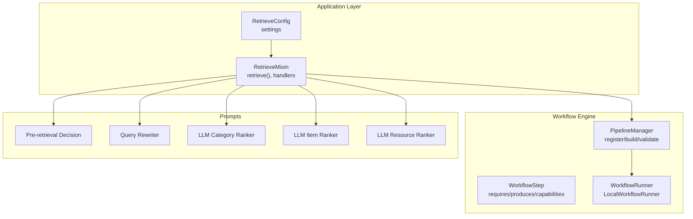
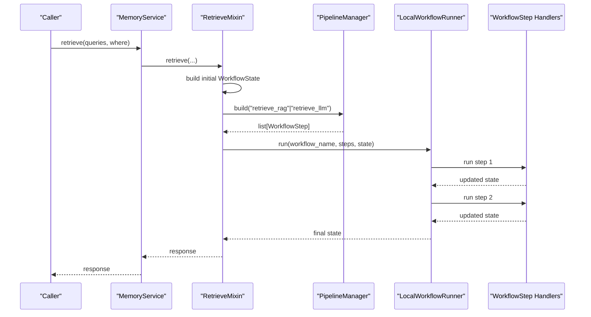
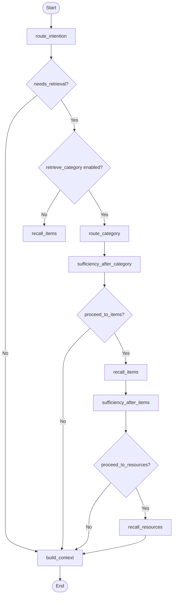
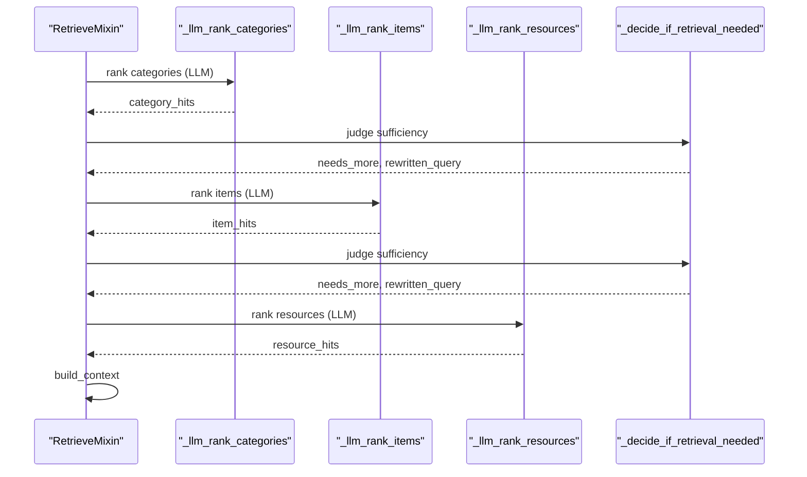
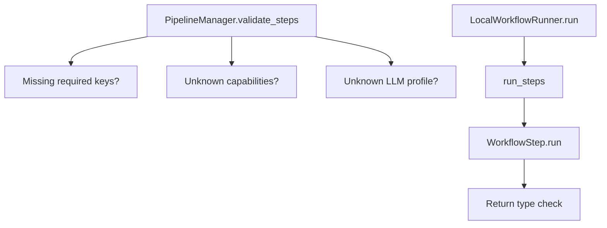

# Workflow Steps and Execution

<cite>
**Referenced Files in This Document**
- [retrieve.py](file://src/memu/app/retrieve.py)
- [service.py](file://src/memu/app/service.py)
- [step.py](file://src/memu/workflow/step.py)
- [pipeline.py](file://src/memu/workflow/pipeline.py)
- [runner.py](file://src/memu/workflow/runner.py)
- [settings.py](file://src/memu/app/settings.py)
- [pre_retrieval_decision.py](file://src/memu/prompts/retrieve/pre_retrieval_decision.py)
- [query_rewriter.py](file://src/memu/prompts/retrieve/query_rewriter.py)
- [llm_category_ranker.py](file://src/memu/prompts/retrieve/llm_category_ranker.py)
- [llm_item_ranker.py](file://src/memu/prompts/retrieve/llm_item_ranker.py)
- [llm_resource_ranker.py](file://src/memu/prompts/retrieve/llm_resource_ranker.py)
</cite>

## Table of Contents
1. [Introduction](#introduction)
2. [Project Structure](#project-structure)
3. [Core Components](#core-components)
4. [Architecture Overview](#architecture-overview)
5. [Detailed Component Analysis](#detailed-component-analysis)
6. [Dependency Analysis](#dependency-analysis)
7. [Performance Considerations](#performance-considerations)
8. [Troubleshooting Guide](#troubleshooting-guide)
9. [Conclusion](#conclusion)
10. [Appendices](#appendices)

## Introduction
This document explains the workflow execution model used by the retrieve() method. It documents the seven-step retrieval pipeline that dynamically routes queries, decides sufficiency at each stage, recalls relevant categories, items, and resources, and finally builds a structured response. The focus is on:
- The seven-step workflow: route_intention, route_category, sufficiency_after_category, recall_items, sufficiency_after_items, recall_resources, and build_context
- State management and the WorkflowState structure
- Required and produced keys per step
- Step dependencies and capability requirements
- Conditional execution logic and dynamic query rewriting
- Typical execution paths for different query types and retrieval configurations

## Project Structure
The retrieval workflow is implemented in the application layer and orchestrated by the workflow engine:
- Application-level retrieval logic and handlers live in the retrieve module
- The workflow engine defines the step abstraction, pipeline registration/validation, and execution runner
- Settings define retrieval configuration toggles and thresholds
- Prompts define the LLM behaviors for routing, ranking, and sufficiency judgment

**Diagram sources**
- [retrieve.py](file://src/memu/app/retrieve.py#L42-L85)
- [pipeline.py](file://src/memu/workflow/pipeline.py#L21-L50)
- [runner.py](file://src/memu/workflow/runner.py#L28-L39)
- [settings.py](file://src/memu/app/settings.py#L175-L202)
- [pre_retrieval_decision.py](file://src/memu/prompts/retrieve/pre_retrieval_decision.py#L1-L54)
- [query_rewriter.py](file://src/memu/prompts/retrieve/query_rewriter.py#L1-L45)
- [llm_category_ranker.py](file://src/memu/prompts/retrieve/llm_category_ranker.py#L1-L36)
- [llm_item_ranker.py](file://src/memu/prompts/retrieve/llm_item_ranker.py#L1-L41)
- [llm_resource_ranker.py](file://src/memu/prompts/retrieve/llm_resource_ranker.py#L1-L41)

**Section sources**
- [retrieve.py](file://src/memu/app/retrieve.py#L42-L85)
- [service.py](file://src/memu/app/service.py#L315-L361)
- [settings.py](file://src/memu/app/settings.py#L175-L202)

## Core Components
- RetrieveMixin: Implements the retrieve() entry point, constructs initial WorkflowState, selects the pipeline by method, and runs the workflow via the configured runner.
- WorkflowStep: Defines step metadata (step_id, role, requires, produces, capabilities, config) and execution semantics.
- PipelineManager: Registers pipelines, validates step dependencies and capabilities, and builds copies of steps for execution.
- LocalWorkflowRunner: Executes steps sequentially and applies interceptors around each step.
- RetrieveConfig: Controls retrieval behavior (method, routing, sufficiency checks, tiers, and LLM profiles).

Key responsibilities:
- retrieve(): Builds initial state and dispatches to the appropriate pipeline
- Handlers: Implement each step’s logic and update state accordingly
- Validation: PipelineManager ensures required keys are present and capabilities are satisfied

**Section sources**
- [retrieve.py](file://src/memu/app/retrieve.py#L42-L85)
- [step.py](file://src/memu/workflow/step.py#L16-L48)
- [pipeline.py](file://src/memu/workflow/pipeline.py#L21-L171)
- [runner.py](file://src/memu/workflow/runner.py#L28-L39)
- [settings.py](file://src/memu/app/settings.py#L175-L202)

## Architecture Overview
The retrieve() method orchestrates a two-pipeline system:
- retrieve_rag: Embedding-based vector search with optional LLM-driven sufficiency checks
- retrieve_llm: LLM-driven search and ranking across categories, items, and resources

**Diagram sources**
- [retrieve.py](file://src/memu/app/retrieve.py#L42-L85)
- [service.py](file://src/memu/app/service.py#L350-L361)
- [pipeline.py](file://src/memu/workflow/pipeline.py#L47-L49)
- [runner.py](file://src/memu/workflow/runner.py#L31-L39)
- [step.py](file://src/memu/workflow/step.py#L50-L102)

## Detailed Component Analysis

### WorkflowState and Initial Keys
WorkflowState is a dictionary carrying all inputs, intermediate results, and outputs across steps. The initial keys are populated by retrieve() and include:
- method, original_query, context_queries, route_intention, skip_rewrite
- retrieve_category, retrieve_item, retrieve_resource, sufficiency_check
- ctx, store, where

These keys are declared as initial_state_keys during pipeline registration and validated by PipelineManager.

**Section sources**
- [retrieve.py](file://src/memu/app/retrieve.py#L65-L78)
- [retrieve.py](file://src/memu/app/retrieve.py#L212-L226)
- [service.py](file://src/memu/app/service.py#L319-L323)
- [pipeline.py](file://src/memu/workflow/pipeline.py#L34-L36)

### Seven-Step Workflow

#### 1) route_intention
Purpose: Determine if retrieval is needed and optionally rewrite the query using conversation context.
- Requires: route_intention, original_query, context_queries, skip_rewrite
- Produces: needs_retrieval, rewritten_query, active_query, next_step_query (initially None)
- Capabilities: llm
- Behavior:
  - If routing is disabled, default to needs_retrieval = true and pass-through original_query
  - Otherwise, call sufficiency checker to decide and optionally rewrite
  - If skip_rewrite is true, use original_query as rewritten_query

Dynamic behavior:
- Uses pre_retrieval_decision prompts and extracts decision and rewritten query from LLM output

**Section sources**
- [retrieve.py](file://src/memu/app/retrieve.py#L106-L116)
- [retrieve.py](file://src/memu/app/retrieve.py#L228-L258)
- [retrieve.py](file://src/memu/app/retrieve.py#L746-L784)
- [pre_retrieval_decision.py](file://src/memu/prompts/retrieve/pre_retrieval_decision.py#L1-L54)
- [query_rewriter.py](file://src/memu/prompts/retrieve/query_rewriter.py#L1-L45)

#### 2) route_category
Purpose: Optionally search and rank categories relevant to the active query.
- Requires: retrieve_category, needs_retrieval, active_query, ctx, store, where
- Produces: category_hits, category_summary_lookup, query_vector
- Capabilities: vector
- Behavior:
  - If retrieval disabled or not needed, set empty results and no vector
  - Otherwise, embed active_query and rank categories by summary similarity
  - Store category_pool for later materialization

Notes:
- Uses cosine_topk and embedding client
- Stores both hits and a summary lookup for formatting

**Section sources**
- [retrieve.py](file://src/memu/app/retrieve.py#L117-L125)
- [retrieve.py](file://src/memu/app/retrieve.py#L260-L286)
- [retrieve.py](file://src/memu/app/retrieve.py#L725-L744)

#### 3) sufficiency_after_category
Purpose: Judge sufficiency after category tier and decide whether to continue to items.
- Requires: retrieve_category, needs_retrieval, active_query, context_queries, category_hits, ctx, store, where
- Produces: next_step_query, proceed_to_items, query_vector
- Capabilities: llm
- Behavior:
  - If not needed or sufficiency checks disabled, proceed_to_items = true
  - Otherwise, format category content and call sufficiency checker
  - If needs more, re-embed active_query and update query_vector

**Section sources**
- [retrieve.py](file://src/memu/app/retrieve.py#L127-L146)
- [retrieve.py](file://src/memu/app/retrieve.py#L288-L322)
- [retrieve.py](file://src/memu/app/retrieve.py#L746-L784)

#### 4) recall_items
Purpose: Recall memory items relevant to the active query.
- Requires: needs_retrieval, proceed_to_items, ctx, store, where, active_query, query_vector
- Produces: item_hits, query_vector
- Capabilities: vector
- Behavior:
  - If retrieval disabled or not needed or not proceeding, set empty results
  - Otherwise, embed active_query if not present and vector-search items with configured ranking and recency decay
  - Store item_pool for materialization

**Section sources**
- [retrieve.py](file://src/memu/app/retrieve.py#L147-L163)
- [retrieve.py](file://src/memu/app/retrieve.py#L346-L367)

#### 5) sufficiency_after_items
Purpose: Judge sufficiency after item tier and decide whether to continue to resources.
- Requires: needs_retrieval, active_query, context_queries, item_hits, ctx, store, where
- Produces: next_step_query, proceed_to_resources, query_vector
- Capabilities: llm
- Behavior:
  - If not needed or sufficiency checks disabled, proceed_to_resources = true
  - Otherwise, format item content and call sufficiency checker
  - If needs more, re-embed active_query and update query_vector

**Section sources**
- [retrieve.py](file://src/memu/app/retrieve.py#L164-L183)
- [retrieve.py](file://src/memu/app/retrieve.py#L369-L398)
- [retrieve.py](file://src/memu/app/retrieve.py#L746-L784)

#### 6) recall_resources
Purpose: Recall resources relevant to the active query.
- Requires: needs_retrieval, proceed_to_resources, ctx, store, where, active_query, query_vector
- Produces: resource_hits, query_vector
- Capabilities: vector
- Behavior:
  - If retrieval disabled or not needed or not proceeding, set empty results
  - Otherwise, build resource caption corpus and cosine_topk search
  - Store resource_pool for materialization

**Section sources**
- [retrieve.py](file://src/memu/app/retrieve.py#L184-L200)
- [retrieve.py](file://src/memu/app/retrieve.py#L400-L424)

#### 7) build_context
Purpose: Materialize and assemble the final response.
- Requires: needs_retrieval, original_query, rewritten_query, ctx, store, where
- Produces: response
- Behavior:
  - If retrieval was needed, materialize category_hits, item_hits, resource_hits using pools
  - Assemble response with needs_retrieval flag, original and rewritten queries, next_step_query, and lists of materials

**Section sources**
- [retrieve.py](file://src/memu/app/retrieve.py#L201-L209)
- [retrieve.py](file://src/memu/app/retrieve.py#L426-L452)

### Conditional Execution Logic and Branching
- route_intention controls whether routing is performed; if disabled, defaults to needs_retrieval = true and passes through the original query
- sufficiency_after_category and sufficiency_after_items gate progression to subsequent stages; if sufficiency checks are disabled or retrieval is not needed, steps are skipped and proceed_* flags are set appropriately
- recall_* steps are skipped when retrieval is disabled or when the proceed_* flags are false
- Dynamic query rewriting occurs at each sufficiency check; the active_query is updated and vectors are re-embedded when the query is rewritten

**Diagram sources**
- [retrieve.py](file://src/memu/app/retrieve.py#L106-L209)
- [retrieve.py](file://src/memu/app/retrieve.py#L228-L398)
- [retrieve.py](file://src/memu/app/retrieve.py#L400-L452)

### Capability Requirements and Inter-Step Data Flow
- llm capability is required for route_intention and sufficiency checks; it enables the pre_retrieval_decision prompts and decision extraction
- vector capability is required for route_category and recall_* steps; it enables embedding and cosine_topk search
- Inter-step data flow:
  - route_intention writes rewritten_query and active_query
  - route_category writes category_hits, category_summary_lookup, and query_vector
  - sufficiency_after_category updates next_step_query and may re-embed to update query_vector
  - recall_items writes item_hits and may embed if needed
  - sufficiency_after_items updates next_step_query and may re-embed to update query_vector
  - recall_resources writes resource_hits
  - build_context reads all hits and pools to materialize final response

**Section sources**
- [retrieve.py](file://src/memu/app/retrieve.py#L106-L209)
- [pipeline.py](file://src/memu/workflow/pipeline.py#L131-L165)

### LLM-Ranked Retrieval (retrieve_llm)
The retrieve_llm pipeline follows the same seven-step structure but delegates ranking to LLM prompts:
- route_intention and sufficiency checks mirror the RAG pipeline
- route_category uses llm_category_ranker prompt to select top K categories
- recall_items uses llm_item_ranker prompt to rank items within relevant categories
- recall_resources uses llm_resource_ranker prompt to rank resources based on context
- build_context materializes LLM-ranked results

**Diagram sources**
- [retrieve.py](file://src/memu/app/retrieve.py#L454-L536)
- [retrieve.py](file://src/memu/app/retrieve.py#L570-L706)
- [llm_category_ranker.py](file://src/memu/prompts/retrieve/llm_category_ranker.py#L1-L36)
- [llm_item_ranker.py](file://src/memu/prompts/retrieve/llm_item_ranker.py#L1-L41)
- [llm_resource_ranker.py](file://src/memu/prompts/retrieve/llm_resource_ranker.py#L1-L41)

**Section sources**
- [retrieve.py](file://src/memu/app/retrieve.py#L454-L536)
- [retrieve.py](file://src/memu/app/retrieve.py#L570-L706)

### Examples: Typical Execution Paths
- Simple query requiring no retrieval:
  - route_intention → needs_retrieval = false → build_context with empty materials
- Query needing category recall:
  - route_intention → route_category → sufficiency_after_category → proceed_to_items = false → build_context
- Query needing category and item recall:
  - route_intention → route_category → sufficiency_after_category → recall_items → sufficiency_after_items → proceed_to_resources = false → build_context
- Query needing category, item, and resource recall:
  - route_intention → route_category → sufficiency_after_category → recall_items → sufficiency_after_items → recall_resources → build_context
- Query with dynamic rewriting:
  - route_intention → rewritten_query → sufficiency_after_category (re-embed) → proceed_to_items → recall_items → sufficiency_after_items (re-embed) → recall_resources → build_context

**Section sources**
- [retrieve.py](file://src/memu/app/retrieve.py#L228-L398)
- [retrieve.py](file://src/memu/app/retrieve.py#L426-L452)

## Dependency Analysis
- PipelineManager enforces:
  - Unique step_id across a pipeline
  - Availability of required keys before each step
  - Capability availability for each step
  - Validity of LLM profile references
- WorkflowStep.run validates that each handler returns a mapping
- LocalWorkflowRunner executes steps sequentially and supports interceptors

**Diagram sources**
- [pipeline.py](file://src/memu/workflow/pipeline.py#L131-L165)
- [step.py](file://src/memu/workflow/step.py#L40-L47)
- [runner.py](file://src/memu/workflow/runner.py#L31-L39)

**Section sources**
- [pipeline.py](file://src/memu/workflow/pipeline.py#L131-L165)
- [step.py](file://src/memu/workflow/step.py#L40-L47)
- [runner.py](file://src/memu/workflow/runner.py#L31-L39)

## Performance Considerations
- Embedding reuse: query_vector is cached and reused across sufficiency checks; re-embed only when the query is rewritten
- Early termination: If sufficiency checks determine no more retrieval is needed, downstream steps are skipped
- Ranking strategies:
  - Item ranking supports similarity and salience modes with configurable recency decay
  - LLM ranking offloads ordering to the model, reducing embedding costs but increasing LLM calls
- Vector search efficiency: cosine_topk and embedding batch sizes impact latency and throughput

[No sources needed since this section provides general guidance]

## Troubleshooting Guide
Common issues and diagnostics:
- Missing required keys for a step:
  - PipelineManager raises a KeyError indicating which keys are missing
- Unknown capabilities or LLM profiles:
  - PipelineManager validates capabilities and profile names; adjust step.config or profiles accordingly
- Handler return type errors:
  - WorkflowStep.run expects a mapping; ensure handlers return a dict-like object
- Empty or invalid queries:
  - Query extraction validates structure and content; ensure queries conform to supported formats
- Insufficient retrieval:
  - Verify sufficiency_check is enabled and prompts are configured; confirm LLM decisions align with expectations

**Section sources**
- [pipeline.py](file://src/memu/workflow/pipeline.py#L131-L165)
- [step.py](file://src/memu/workflow/step.py#L40-L47)
- [retrieve.py](file://src/memu/app/retrieve.py#L812-L840)

## Conclusion
The retrieve() workflow provides a robust, extensible retrieval pipeline supporting both embedding-based and LLM-based strategies. Its seven-step design with conditional execution, dynamic query rewriting, and structured state management enables precise control over retrieval depth and quality. By leveraging PipelineManager validation and LocalWorkflowRunner execution, the system remains maintainable and adaptable to evolving retrieval requirements.

[No sources needed since this section summarizes without analyzing specific files]

## Appendices

### Appendix A: RetrieveConfig Options
- method: "rag" or "llm"
- route_intention: enable/disable routing and query rewriting
- category.enabled/top_k
- item.enabled/top_k/ranking/recency_decay_days/use_category_references
- resource.enabled/top_k
- sufficiency_check/sufficiency_check_prompt/sufficiency_check_llm_profile
- llm_ranking_llm_profile

**Section sources**
- [settings.py](file://src/memu/app/settings.py#L175-L202)