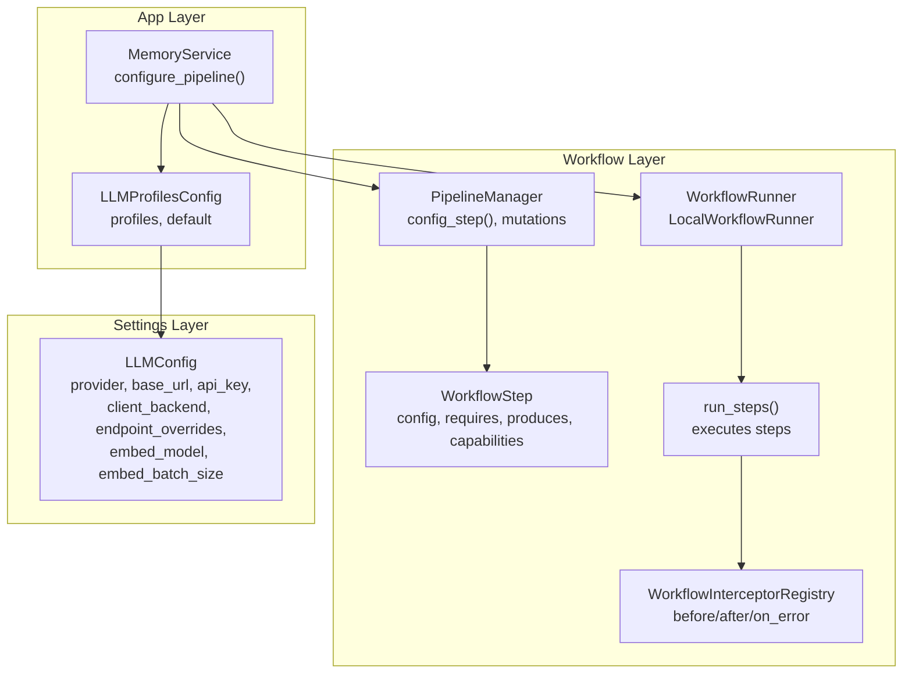
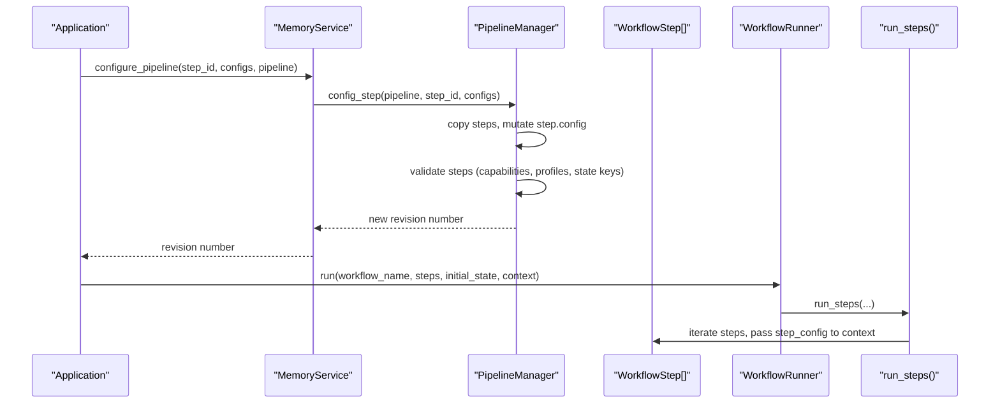
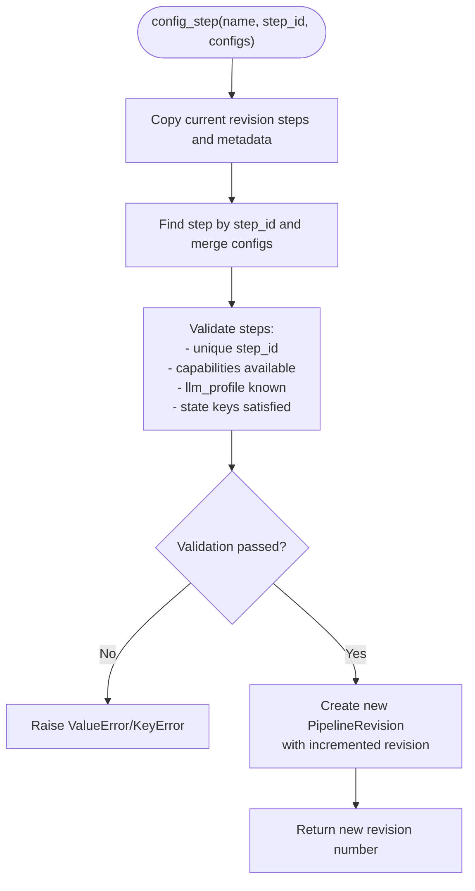
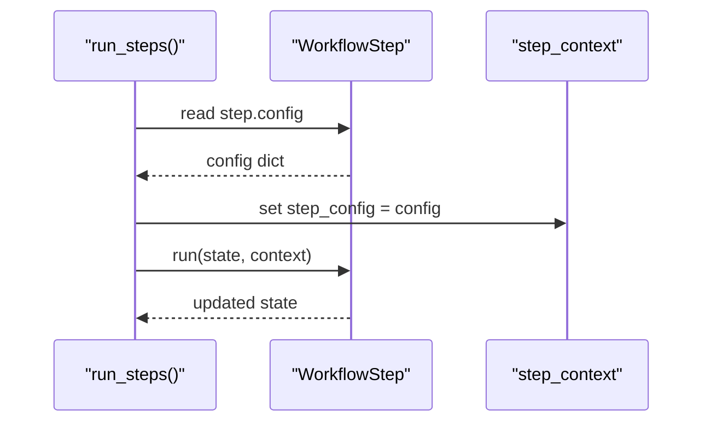
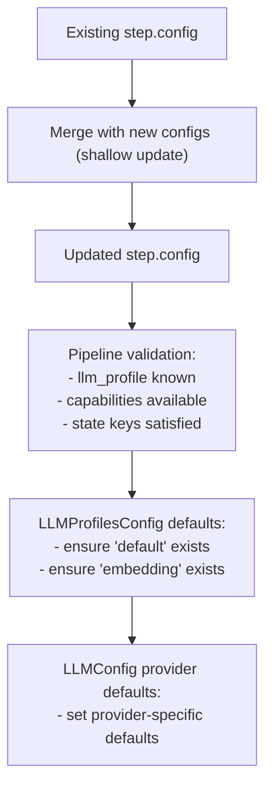
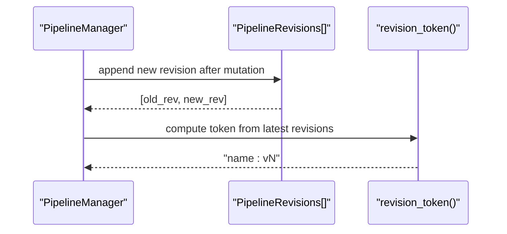
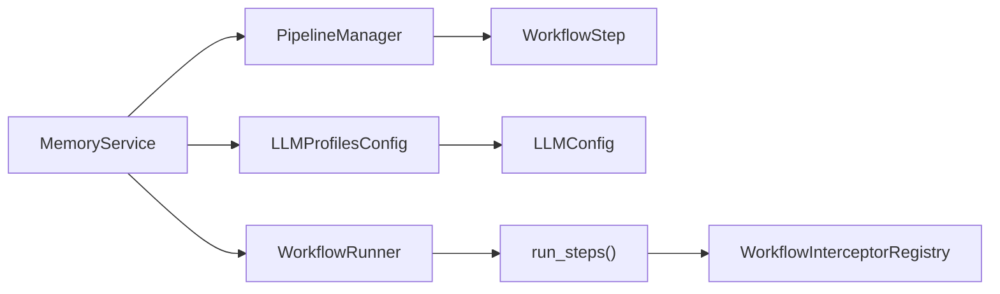

# Pipeline Configuration

<cite>
**Referenced Files in This Document**
- [pipeline.py](file://src/memu/workflow/pipeline.py)
- [step.py](file://src/memu/workflow/step.py)
- [service.py](file://src/memu/app/service.py)
- [settings.py](file://src/memu/app/settings.py)
- [runner.py](file://src/memu/workflow/runner.py)
- [interceptor.py](file://src/memu/workflow/interceptor.py)
- [architecture.md](file://docs/architecture.md)
</cite>

## Table of Contents
1. [Introduction](#introduction)
2. [Project Structure](#project-structure)
3. [Core Components](#core-components)
4. [Architecture Overview](#architecture-overview)
5. [Detailed Component Analysis](#detailed-component-analysis)
6. [Dependency Analysis](#dependency-analysis)
7. [Performance Considerations](#performance-considerations)
8. [Troubleshooting Guide](#troubleshooting-guide)
9. [Conclusion](#conclusion)

## Introduction
This document explains pipeline configuration management with a focus on dynamic workflow adjustment. It documents the config_step() method for updating step configurations, including LLM profile settings, capability assignments, and runtime parameter modifications. It also covers configuration merging strategies, default value handling, validation processes, and the relationship between pipeline revisions and configuration changes.

## Project Structure
The pipeline configuration system centers on the workflow module’s PipelineManager and WorkflowStep, with orchestration provided by MemoryService. Configuration defaults and validation are handled by typed settings models.

**Diagram sources**
- [pipeline.py](file://src/memu/workflow/pipeline.py#L21-L122)
- [step.py](file://src/memu/workflow/step.py#L16-L48)
- [runner.py](file://src/memu/workflow/runner.py#L28-L39)
- [interceptor.py](file://src/memu/workflow/interceptor.py#L56-L165)
- [service.py](file://src/memu/app/service.py#L49-L95)
- [settings.py](file://src/memu/app/settings.py#L102-L139)

**Section sources**
- [pipeline.py](file://src/memu/workflow/pipeline.py#L1-L171)
- [step.py](file://src/memu/workflow/step.py#L1-L102)
- [service.py](file://src/memu/app/service.py#L49-L95)
- [settings.py](file://src/memu/app/settings.py#L102-L139)
- [runner.py](file://src/memu/workflow/runner.py#L1-L82)
- [interceptor.py](file://src/memu/workflow/interceptor.py#L1-L219)
- [architecture.md](file://docs/architecture.md#L52-L62)

## Core Components
- PipelineManager: Manages pipeline registrations, builds copies of steps, and applies mutations (including config_step()). It enforces step validation and maintains revision history.
- WorkflowStep: Represents a single step with identifiers, capability tags, required/produced state keys, and a config dictionary.
- MemoryService: Exposes configure_pipeline() as the public API for dynamic configuration updates and integrates with LLM profiles and runners.
- LLMProfilesConfig and LLMConfig: Define default and validated LLM profiles and their attributes, including provider defaults and client backend selection.

Key responsibilities:
- config_step(): Merges new configuration into an existing step’s config and creates a new pipeline revision.
- Validation: Ensures step uniqueness, capability availability, profile existence, and state key contracts.
- Revisioning: Increments revision numbers and snapshots metadata for reproducible execution.

**Section sources**
- [pipeline.py](file://src/memu/workflow/pipeline.py#L51-L62)
- [pipeline.py](file://src/memu/workflow/pipeline.py#L131-L164)
- [service.py](file://src/memu/app/service.py#L390-L392)
- [settings.py](file://src/memu/app/settings.py#L263-L297)

## Architecture Overview
The configuration change lifecycle:
1. Application code calls MemoryService.configure_pipeline().
2. MemoryService delegates to PipelineManager.config_step().
3. PipelineManager copies the current revision, mutates the target step’s config, re-validates the pipeline, and appends a new revision.
4. Future executions use the latest revision; interceptors and runners operate on the updated step configuration.

**Diagram sources**
- [service.py](file://src/memu/app/service.py#L390-L392)
- [pipeline.py](file://src/memu/workflow/pipeline.py#L51-L62)
- [pipeline.py](file://src/memu/workflow/pipeline.py#L108-L122)
- [step.py](file://src/memu/workflow/step.py#L73-L77)
- [runner.py](file://src/memu/workflow/runner.py#L31-L39)

## Detailed Component Analysis

### PipelineManager and config_step()
- Purpose: Dynamically update a step’s configuration within a named pipeline and produce a new revision.
- Behavior:
  - Copies the current revision’s steps and metadata.
  - Locates the step by step_id and merges configs using a shallow update strategy.
  - Re-validates the mutated pipeline to ensure correctness.
  - Creates a new PipelineRevision with incremented revision number.
- Error handling:
  - Raises KeyError if the step_id is not found.
  - Raises ValueError for duplicate step IDs, unknown capabilities, invalid LLM profiles, or missing state keys.

**Diagram sources**
- [pipeline.py](file://src/memu/workflow/pipeline.py#L51-L62)
- [pipeline.py](file://src/memu/workflow/pipeline.py#L108-L122)
- [pipeline.py](file://src/memu/workflow/pipeline.py#L131-L164)

**Section sources**
- [pipeline.py](file://src/memu/workflow/pipeline.py#L51-L62)
- [pipeline.py](file://src/memu/workflow/pipeline.py#L108-L122)
- [pipeline.py](file://src/memu/workflow/pipeline.py#L131-L164)

### Step Configuration and Runtime Parameter Modifications
- WorkflowStep.config stores arbitrary key-value pairs that influence runtime behavior.
- During execution, run_steps() injects step.config into the step context, enabling handlers to read runtime parameters.
- Practical examples (conceptual):
  - Adjust LLM provider parameters (e.g., model name, temperature) by updating step.config.
  - Switch LLM profiles per step using keys like llm_profile, chat_llm_profile, or embed_llm_profile.
  - Modify processing parameters (e.g., top_k, thresholds) that downstream handlers consume.

**Diagram sources**
- [step.py](file://src/memu/workflow/step.py#L73-L77)
- [step.py](file://src/memu/workflow/step.py#L40-L47)

**Section sources**
- [step.py](file://src/memu/workflow/step.py#L16-L38)
- [step.py](file://src/memu/workflow/step.py#L40-L47)
- [step.py](file://src/memu/workflow/step.py#L73-L77)

### Configuration Merging Strategies and Default Value Handling
- Merging: The PipelineManager performs a shallow dict update of the existing step.config with the provided configs. This replaces top-level keys and does not deep merge nested structures.
- Defaults:
  - LLMProfilesConfig ensures a default profile exists and an embedding profile is present (auto-derived from default if absent).
  - LLMConfig sets provider-specific defaults (e.g., switching to Grok defaults when provider is set to “grok”).
- Validation:
  - PipelineManager checks that step.config references known LLM profiles.
  - MemoryService resolves per-step LLM clients using step_config keys (chat_llm_profile, embed_llm_profile, or llm_profile).

**Diagram sources**
- [pipeline.py](file://src/memu/workflow/pipeline.py#L55-L57)
- [pipeline.py](file://src/memu/workflow/pipeline.py#L147-L154)
- [settings.py](file://src/memu/app/settings.py#L269-L288)
- [settings.py](file://src/memu/app/settings.py#L128-L138)

**Section sources**
- [pipeline.py](file://src/memu/workflow/pipeline.py#L55-L57)
- [pipeline.py](file://src/memu/workflow/pipeline.py#L147-L154)
- [settings.py](file://src/memu/app/settings.py#L269-L288)
- [settings.py](file://src/memu/app/settings.py#L128-L138)

### Relationship Between Pipeline Revisions and Configuration Changes
- Each mutation (including config_step) creates a new PipelineRevision with an incremented revision number.
- The revision token combines pipeline names with their latest revision numbers, enabling external systems to detect changes.
- Execution uses the latest revision; prior revisions remain immutable and can be referenced for auditing or rollback.

**Diagram sources**
- [pipeline.py](file://src/memu/workflow/pipeline.py#L108-L122)
- [pipeline.py](file://src/memu/workflow/pipeline.py#L166-L170)

**Section sources**
- [pipeline.py](file://src/memu/workflow/pipeline.py#L108-L122)
- [pipeline.py](file://src/memu/workflow/pipeline.py#L166-L170)

### Practical Examples

- Modify existing workflows without breaking changes:
  - Use config_step to add or override keys in step.config without altering step_id or dependencies.
  - Keep requires and produces unchanged to preserve state contracts.

- Update LLM provider configurations:
  - Set llm_profile, chat_llm_profile, or embed_llm_profile in step.config to route calls to different profiles.
  - Ensure the referenced profile exists in LLMProfilesConfig.

- Adjust processing parameters:
  - Add keys like top_k, thresholds, or model names in step.config and read them in the step handler.

Note: These examples describe conceptual usage patterns. Refer to the code paths below for precise implementation details.

**Section sources**
- [service.py](file://src/memu/app/service.py#L390-L392)
- [pipeline.py](file://src/memu/workflow/pipeline.py#L51-L62)
- [settings.py](file://src/memu/app/settings.py#L263-L297)

## Dependency Analysis
- PipelineManager depends on WorkflowStep and enforces validation rules.
- MemoryService composes PipelineManager and exposes configure_pipeline() to callers.
- LLMProfilesConfig and LLMConfig define default values and provider-specific behavior.
- WorkflowRunner and run_steps() execute the updated steps with the injected step_config.

**Diagram sources**
- [service.py](file://src/memu/app/service.py#L49-L95)
- [pipeline.py](file://src/memu/workflow/pipeline.py#L21-L45)
- [settings.py](file://src/memu/app/settings.py#L102-L139)
- [runner.py](file://src/memu/workflow/runner.py#L28-L39)
- [interceptor.py](file://src/memu/workflow/interceptor.py#L56-L165)

**Section sources**
- [service.py](file://src/memu/app/service.py#L49-L95)
- [pipeline.py](file://src/memu/workflow/pipeline.py#L21-L45)
- [settings.py](file://src/memu/app/settings.py#L102-L139)
- [runner.py](file://src/memu/workflow/runner.py#L28-L39)
- [interceptor.py](file://src/memu/workflow/interceptor.py#L56-L165)

## Performance Considerations
- Shallow merge: Merging step.config is O(n) in the number of keys; keep step.config compact to minimize overhead.
- Validation cost: config_step triggers a full pipeline validation; batch related changes to reduce repeated validations.
- Execution context: Injecting step_config into run_steps() adds minimal overhead; avoid heavy computations inside step handlers.

[No sources needed since this section provides general guidance]

## Troubleshooting Guide
Common issues and resolutions:
- Step not found: config_step raises KeyError if step_id is missing. Verify the step_id exists in the pipeline.
- Unknown LLM profile: config_step raises ValueError if step.config references a profile not present in LLMProfilesConfig. Ensure the profile exists or use an existing one.
- Capability mismatch: config_step raises ValueError if a step requests unavailable capabilities. Confirm available capabilities during PipelineManager construction.
- Missing state keys: run_steps raises KeyError if a step’s required keys are not satisfied. Ensure earlier steps produce the required keys or supply initial_state_keys.

**Section sources**
- [pipeline.py](file://src/memu/workflow/pipeline.py#L59-L60)
- [pipeline.py](file://src/memu/workflow/pipeline.py#L149-L154)
- [pipeline.py](file://src/memu/workflow/pipeline.py#L142-L145)
- [step.py](file://src/memu/workflow/step.py#L71-L72)

## Conclusion
The pipeline configuration system enables safe, dynamic adjustments to workflow execution through config_step(). By leveraging shallow merging, robust validation, and immutable revisioning, it supports iterative tuning of LLM profiles, capability assignments, and runtime parameters without breaking changes. Combined with typed settings and interceptors, it provides a flexible foundation for evolving workflows in production environments.