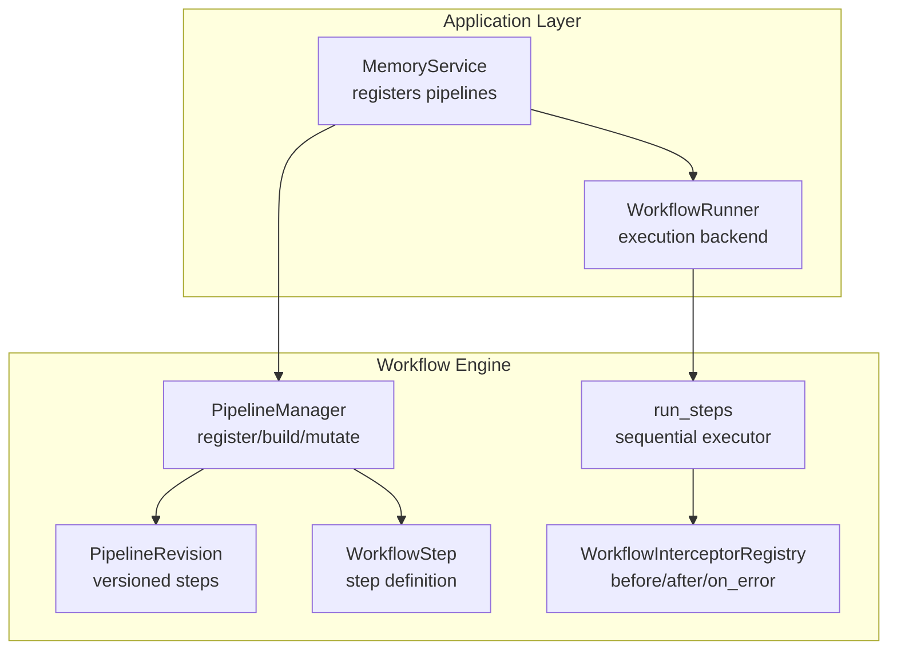
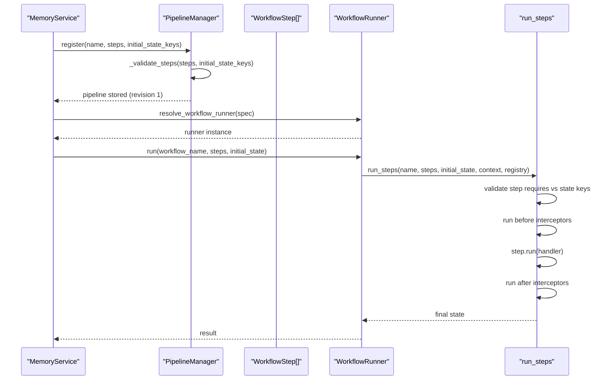
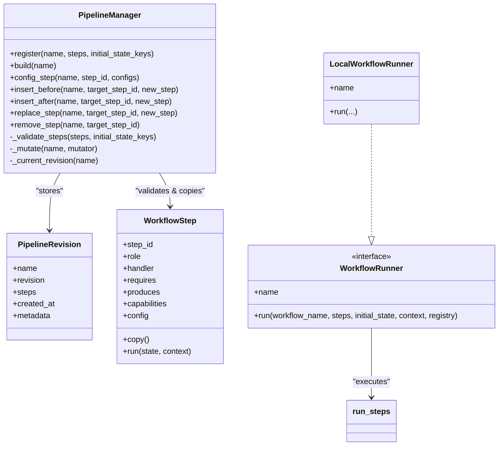

# Pipeline Registration

<cite>
**Referenced Files in This Document**
- [pipeline.py](file://src/memu/workflow/pipeline.py)
- [step.py](file://src/memu/workflow/step.py)
- [runner.py](file://src/memu/workflow/runner.py)
- [interceptor.py](file://src/memu/workflow/interceptor.py)
- [service.py](file://src/memu/app/service.py)
- [memorize.py](file://src/memu/app/memorize.py)
- [retrieve.py](file://src/memu/app/retrieve.py)
- [architecture.md](file://docs/architecture.md)
- [0001-workflow-pipeline-architecture.md](file://docs/adr/0001-workflow-pipeline-architecture.md)
</cite>

## Table of Contents
1. [Introduction](#introduction)
2. [Project Structure](#project-structure)
3. [Core Components](#core-components)
4. [Architecture Overview](#architecture-overview)
5. [Detailed Component Analysis](#detailed-component-analysis)
6. [Dependency Analysis](#dependency-analysis)
7. [Performance Considerations](#performance-considerations)
8. [Troubleshooting Guide](#troubleshooting-guide)
9. [Conclusion](#conclusion)
10. [Appendices](#appendices)

## Introduction
This document explains pipeline registration operations for workflow setup and configuration. It focuses on the register() method for creating new pipelines, including step definitions, initial state keys, and capability validation. It also documents pipeline naming conventions, step ordering requirements, validation rules, and the PipelineRevision system for version tracking. Practical examples show how to register memory ingestion pipelines, retrieval pipelines, and custom processing chains. Finally, it covers common registration errors, validation failures, and best practices for pipeline design.

## Project Structure
The workflow subsystem resides under src/memu/workflow and integrates with application services under src/memu/app. Pipelines are registered centrally in the application service and executed via a runner abstraction.

**Diagram sources**
- [service.py](file://src/memu/app/service.py#L91-L95)
- [pipeline.py](file://src/memu/workflow/pipeline.py#L21-L46)
- [step.py](file://src/memu/workflow/step.py#L16-L48)
- [runner.py](file://src/memu/workflow/runner.py#L28-L39)
- [interceptor.py](file://src/memu/workflow/interceptor.py#L56-L166)

**Section sources**
- [service.py](file://src/memu/app/service.py#L91-L95)
- [architecture.md](file://docs/architecture.md#L52-L85)

## Core Components
- PipelineManager: central registry for named pipelines with validation and revisioning.
- PipelineRevision: immutable snapshot of a pipeline’s steps and metadata at a revision.
- WorkflowStep: step definition with identifiers, roles, handlers, required/produced state keys, capabilities, and config.
- WorkflowRunner: pluggable execution backend (default local).
- WorkflowInterceptorRegistry: step-level before/after/on_error hooks.

Key responsibilities:
- PipelineManager.register(): validates step ordering and capabilities, stores initial state keys, and creates the first revision.
- PipelineManager.build(): returns a fresh copy of the current revision’s steps.
- PipelineManager mutation APIs: config_step(), insert_before/after(), replace_step(), remove_step() create new revisions.
- Validation enforces uniqueness of step_id, capability availability, llm_profile validity, and state key dependencies.

**Section sources**
- [pipeline.py](file://src/memu/workflow/pipeline.py#L21-L171)
- [step.py](file://src/memu/workflow/step.py#L16-L48)
- [runner.py](file://src/memu/workflow/runner.py#L28-L82)
- [interceptor.py](file://src/memu/workflow/interceptor.py#L56-L166)

## Architecture Overview
Pipelines are registered once during service initialization and can be mutated later. Execution is delegated to a runner, which runs steps sequentially and supports interceptors.

**Diagram sources**
- [service.py](file://src/memu/app/service.py#L91-L95)
- [pipeline.py](file://src/memu/workflow/pipeline.py#L27-L46)
- [runner.py](file://src/memu/workflow/runner.py#L61-L82)
- [step.py](file://src/memu/workflow/step.py#L50-L102)
- [interceptor.py](file://src/memu/workflow/interceptor.py#L163-L219)

## Detailed Component Analysis

### PipelineManager.register()
Purpose:
- Accepts a pipeline name, an iterable of WorkflowStep, and optional initial_state_keys.
- Validates steps immediately and stores the first revision.

Validation performed:
- Duplicate step_id detection.
- Capability availability against configured available_capabilities.
- llm_profile presence in configured llm_profiles.
- State key dependency chain: each step’s requires must be satisfied by earlier steps’ produces plus initial_state_keys.

Outputs:
- A new PipelineRevision with revision 1 and metadata containing initial_state_keys.

Usage pattern:
- Called during service initialization to register built-in pipelines (e.g., memorize, retrieve).

**Section sources**
- [pipeline.py](file://src/memu/workflow/pipeline.py#L27-L46)
- [pipeline.py](file://src/memu/workflow/pipeline.py#L131-L165)

### PipelineRevision and Version Tracking
- Each pipeline is a list of PipelineRevision snapshots.
- New revisions are appended on mutations; the current revision is the last element.
- revision_token() encodes the current state of all pipelines for change detection.

Relationship to names and step configurations:
- Name identifies the pipeline; each revision preserves the name and tracks step list and metadata.
- Metadata includes initial_state_keys; mutations preserve and reuse this metadata.

**Section sources**
- [pipeline.py](file://src/memu/workflow/pipeline.py#L12-L18)
- [pipeline.py](file://src/memu/workflow/pipeline.py#L166-L171)

### Step Ordering Requirements and Validation Rules
Ordering:
- Steps are validated in list order. Each step must declare requires that are either produced by earlier steps or provided by initial_state_keys.

Validation rules enforced:
- Uniqueness of step_id within a pipeline.
- Capability availability: step.capabilities must be a subset of available_capabilities.
- llm_profile validity: step.config.llm_profile must match registered llm_profiles.
- State key dependency: step.requires must be a subset of currently available keys (initial_state_keys ∪ produces of preceding steps).

Runtime execution:
- run_steps() checks step.requires against the current state keys before invoking each step.

**Section sources**
- [pipeline.py](file://src/memu/workflow/pipeline.py#L131-L165)
- [step.py](file://src/memu/workflow/step.py#L50-L102)

### Pipeline Naming Conventions
- Names are arbitrary strings identifying the pipeline (e.g., "memorize", "retrieve_rag", "retrieve_llm", "patch_create").
- These names are used to select a pipeline for execution and to mutate it later.

**Section sources**
- [service.py](file://src/memu/app/service.py#L315-L328)
- [memorize.py](file://src/memu/app/memorize.py#L97-L167)

### Practical Examples

#### Example 1: Memory Ingestion Pipeline
- Steps: ingest_resource → preprocess_multimodal → extract_items → dedupe_merge → categorize_items → persist_index → build_response.
- Initial state keys include resource_url, modality, memory_types, categories_prompt_str, ctx, store, category_ids, user.
- Capabilities: io, llm, db, vector.
- Config: per-step llm profiles selected via step.config.

Registration:
- Built in MemorizeMixin and registered via PipelineManager.register("memorize", steps, initial_state_keys).

Execution:
- MemoryService._run_workflow resolves runner and executes steps sequentially.

**Section sources**
- [memorize.py](file://src/memu/app/memorize.py#L97-L167)
- [memorize.py](file://src/memu/app/memorize.py#L169-L179)
- [service.py](file://src/memu/app/service.py#L315-L318)

#### Example 2: Retrieval Pipelines
- Two retrieval pipelines are registered:
  - retrieve_rag: RAG-based retrieval pipeline.
  - retrieve_llm: LLM-based retrieval pipeline.
- Both share initial state keys and rely on LLM and vector capabilities.
- Steps are defined in RetrieveMixin and registered similarly.

**Section sources**
- [service.py](file://src/memu/app/service.py#L319-L323)
- [retrieve.py](file://src/memu/app/retrieve.py#L483-L509)
- [retrieve.py](file://src/memu/app/retrieve.py#L684-L699)

#### Example 3: Custom Processing Chain
- Define a new pipeline with a custom name (e.g., "my_custom_pipeline").
- Compose WorkflowStep instances with appropriate step_id, role, handler, requires, produces, capabilities, and config.
- Call PipelineManager.register("my_custom_pipeline", steps, initial_state_keys={...}).
- Optionally mutate later using config_step(), insert_before/after(), replace_step(), or remove_step().

**Section sources**
- [pipeline.py](file://src/memu/workflow/pipeline.py#L27-L46)
- [step.py](file://src/memu/workflow/step.py#L16-L38)

### Mutation APIs and Revisioning
Mutation functions:
- config_step(name, step_id, configs): merges step.config with provided configs; raises if step_id not found.
- insert_before(name, target_step_id, new_step): inserts before target; raises if not found.
- insert_after(name, target_step_id, new_step): inserts after target; raises if not found.
- replace_step(name, target_step_id, new_step): replaces target; raises if not found.
- remove_step(name, target_step_id): removes target; raises if not found.

Each mutation:
- Copies current steps and metadata.
- Applies the mutator.
- Re-validates steps.
- Creates a new revision with incremented revision number.

**Section sources**
- [pipeline.py](file://src/memu/workflow/pipeline.py#L51-L106)
- [pipeline.py](file://src/memu/workflow/pipeline.py#L108-L122)

### Execution and Interceptors
- WorkflowRunner is a protocol; default LocalWorkflowRunner delegates to run_steps().
- run_steps() validates per-step requires, invokes step.run(), and runs before/after/on_error interceptors.
- Interceptors receive WorkflowStepContext and current state; on error, on_error interceptors run.

**Section sources**
- [runner.py](file://src/memu/workflow/runner.py#L12-L26)
- [runner.py](file://src/memu/workflow/runner.py#L28-L39)
- [step.py](file://src/memu/workflow/step.py#L50-L102)
- [interceptor.py](file://src/memu/workflow/interceptor.py#L163-L219)

## Dependency Analysis
- PipelineManager depends on WorkflowStep and validates against configured capabilities and llm_profiles.
- MemoryService constructs PipelineManager with available capabilities and llm_profiles, then registers pipelines.
- Execution path: MemoryService → WorkflowRunner → run_steps → step.run → interceptors.

**Diagram sources**
- [pipeline.py](file://src/memu/workflow/pipeline.py#L21-L171)
- [step.py](file://src/memu/workflow/step.py#L16-L48)
- [runner.py](file://src/memu/workflow/runner.py#L12-L49)

**Section sources**
- [pipeline.py](file://src/memu/workflow/pipeline.py#L21-L171)
- [step.py](file://src/memu/workflow/step.py#L16-L48)
- [runner.py](file://src/memu/workflow/runner.py#L12-L49)

## Performance Considerations
- Validation occurs at registration and mutation time; keep step lists concise and ordered to minimize validation overhead.
- Copying steps for mutations adds memory overhead proportional to the number of steps; prefer targeted mutations (replace/insert) over rebuilding entire pipelines.
- Interceptors add latency; use them selectively for critical instrumentation.
- Using the local runner avoids network overhead for simple scenarios; external runners (e.g., temporal, burr) add orchestration benefits at the cost of complexity.

[No sources needed since this section provides general guidance]

## Troubleshooting Guide
Common registration errors and validation failures:
- Duplicate step_id: Ensure each step_id is unique within a pipeline.
- Unknown capability: Confirm step.capabilities are a subset of available_capabilities configured on PipelineManager.
- Unknown llm_profile: Verify step.config.llm_profile exists in llm_profiles.
- Missing state keys: Ensure previous steps produce required keys or include them in initial_state_keys.
- Step not found during mutation: Use existing step_id values when calling config_step(), insert_*(), replace_step(), or remove_step().

Operational tips:
- Use PipelineManager.revision_token() to detect changes across pipelines.
- Leverage interceptors for diagnostics; enable strict mode to surface interceptor exceptions.

**Section sources**
- [pipeline.py](file://src/memu/workflow/pipeline.py#L131-L165)
- [pipeline.py](file://src/memu/workflow/pipeline.py#L51-L106)
- [interceptor.py](file://src/memu/workflow/interceptor.py#L73-L76)

## Conclusion
Pipeline registration centers on PipelineManager.register(), which enforces step ordering, capability availability, and state key dependencies. The PipelineRevision system enables safe, auditable evolution of pipelines through mutation APIs. By structuring steps with explicit requires/produces, capabilities, and configs, and by registering pipelines early in service initialization, teams can build robust, observable, and extensible workflows for memory ingestion, retrieval, and custom processing chains.

[No sources needed since this section summarizes without analyzing specific files]

## Appendices

### Best Practices for Pipeline Design
- Explicitly declare requires and produces for every step; avoid implicit state dependencies.
- Use meaningful step_id values that reflect roles and stages.
- Group related steps by capability (e.g., llm, db, vector) to simplify validation and mutation.
- Centralize llm_profile configuration in step.config and ensure profiles exist in llm_profiles.
- Register pipelines once during service startup; use mutations sparingly and document their impact.

**Section sources**
- [architecture.md](file://docs/architecture.md#L52-L85)
- [0001-workflow-pipeline-architecture.md](file://docs/adr/0001-workflow-pipeline-architecture.md#L12-L21)