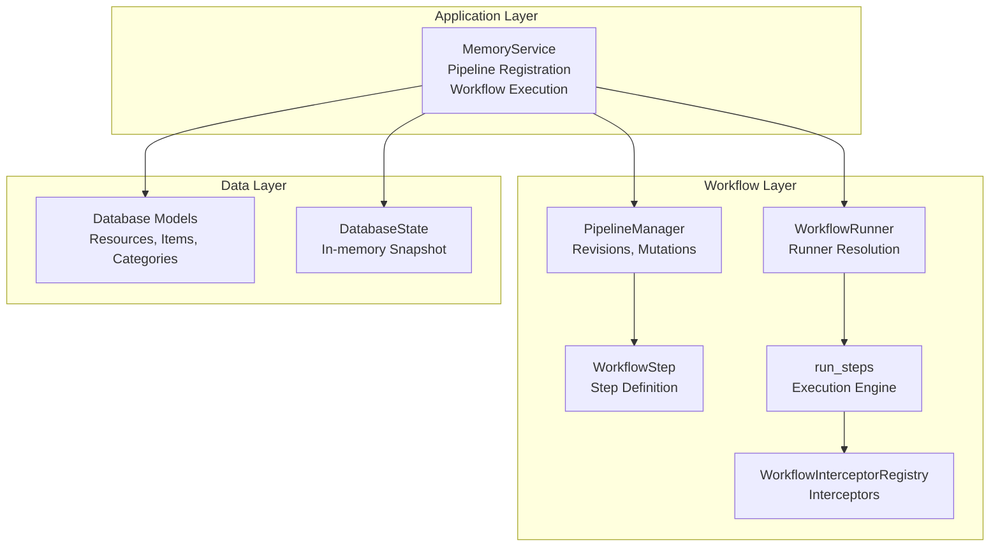
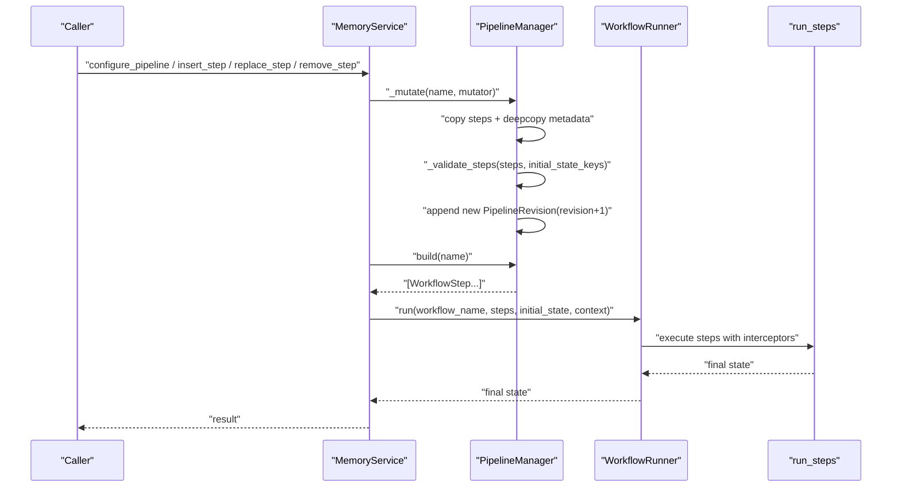
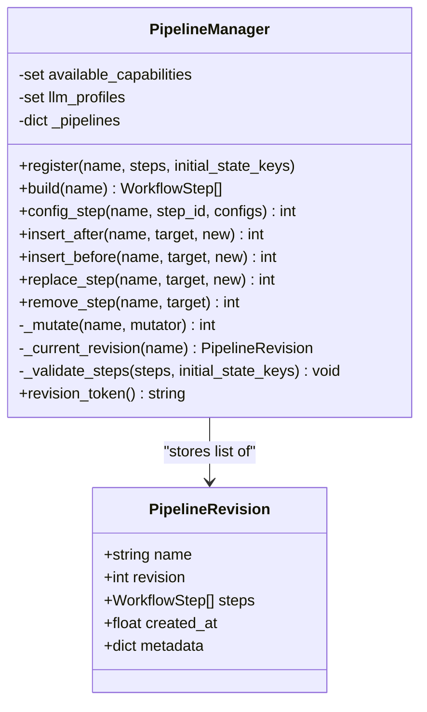
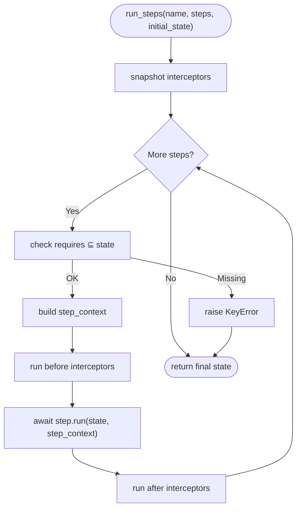
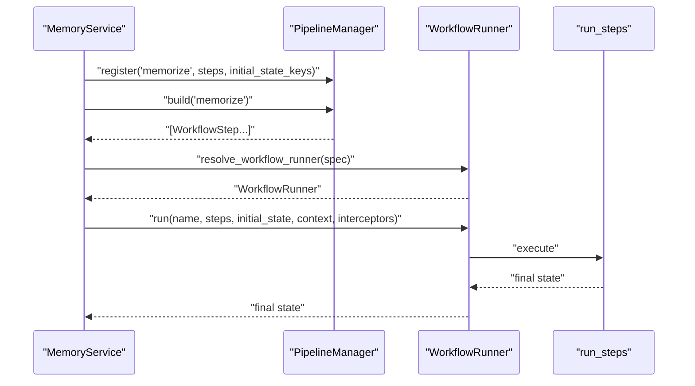
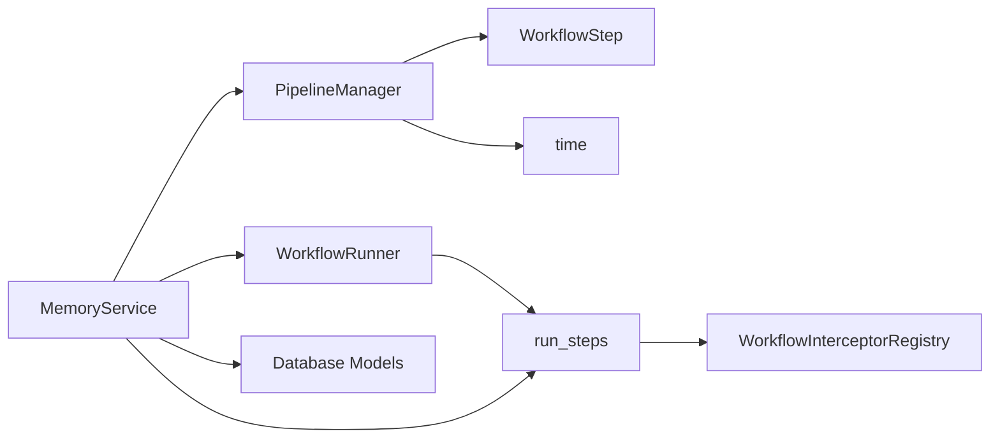

# Pipeline State Management

<cite>
**Referenced Files in This Document**
- [pipeline.py](file://src/memu/workflow/pipeline.py)
- [step.py](file://src/memu/workflow/step.py)
- [runner.py](file://src/memu/workflow/runner.py)
- [interceptor.py](file://src/memu/workflow/interceptor.py)
- [service.py](file://src/memu/app/service.py)
- [memorize.py](file://src/memu/app/memorize.py)
- [models.py](file://src/memu/database/models.py)
- [state.py](file://src/memu/database/state.py)
</cite>

## Table of Contents
1. [Introduction](#introduction)
2. [Project Structure](#project-structure)
3. [Core Components](#core-components)
4. [Architecture Overview](#architecture-overview)
5. [Detailed Component Analysis](#detailed-component-analysis)
6. [Dependency Analysis](#dependency-analysis)
7. [Performance Considerations](#performance-considerations)
8. [Troubleshooting Guide](#troubleshooting-guide)
9. [Conclusion](#conclusion)
10. [Appendices](#appendices)

## Introduction
This document explains the pipeline state management system with a focus on revision tracking and workflow lifecycle. It covers how pipeline definitions are modeled, how revisions are created and validated, how metadata is handled, and how the revision token enables change detection across pipelines. It also documents state copying mechanisms during mutations and their impact on workflow execution consistency, and provides practical examples for tracking modifications, comparing versions, and implementing change detection systems.

## Project Structure
The pipeline state management spans several modules:
- Workflow primitives define steps and execution semantics
- Pipeline manager maintains immutable revisions of pipeline definitions
- Application service wires pipelines into real workflows and exposes mutation APIs
- Interceptors provide cross-cutting concerns around step execution
- Database models and state represent persistent data structures used by workflows

**Diagram sources**
- [pipeline.py](file://src/memu/workflow/pipeline.py#L21-L170)
- [step.py](file://src/memu/workflow/step.py#L16-L102)
- [runner.py](file://src/memu/workflow/runner.py#L12-L82)
- [interceptor.py](file://src/memu/workflow/interceptor.py#L56-L219)
- [service.py](file://src/memu/app/service.py#L49-L360)
- [models.py](file://src/memu/database/models.py#L35-L149)
- [state.py](file://src/memu/database/state.py#L8-L17)

**Section sources**
- [pipeline.py](file://src/memu/workflow/pipeline.py#L1-L171)
- [step.py](file://src/memu/workflow/step.py#L1-L102)
- [runner.py](file://src/memu/workflow/runner.py#L1-L82)
- [interceptor.py](file://src/memu/workflow/interceptor.py#L1-L219)
- [service.py](file://src/memu/app/service.py#L1-L427)
- [models.py](file://src/memu/database/models.py#L1-L149)
- [state.py](file://src/memu/database/state.py#L1-L17)

## Core Components
- PipelineRevision: Immutable snapshot of a pipeline definition at a point in time, including name, revision number, step list, creation timestamp, and metadata.
- PipelineManager: Central orchestrator for registering pipelines, building executable step lists, mutating pipeline definitions, validating step connectivity, and generating a global revision token.
- WorkflowStep: Lightweight step descriptor with identity, roles, handler, required/produced state keys, capabilities, and configuration.
- MemoryService: Registers built-in pipelines, resolves runners, and executes workflows using the current pipeline revision.
- WorkflowRunner and run_steps: Execution engine that validates state requirements and runs steps with optional interceptors.

Key behaviors:
- Creation timestamps: Each revision captures a creation timestamp for auditability.
- Metadata handling: Initial state keys and other pipeline metadata are preserved across revisions.
- Version increment logic: Every mutation increments the revision number and appends a new revision.
- Revision token: A composite token encoding pipeline names and their latest revision numbers for change detection.

**Section sources**
- [pipeline.py](file://src/memu/workflow/pipeline.py#L12-L171)
- [step.py](file://src/memu/workflow/step.py#L16-L48)
- [service.py](file://src/memu/app/service.py#L315-L360)

## Architecture Overview
The system separates pipeline definition (immutable revisions) from execution (current step list). Mutations create new revisions; execution always uses the latest revision. Interceptors wrap each step execution for cross-cutting concerns.

**Diagram sources**
- [pipeline.py](file://src/memu/workflow/pipeline.py#L108-L122)
- [service.py](file://src/memu/app/service.py#L350-L360)
- [runner.py](file://src/memu/workflow/runner.py#L28-L39)
- [step.py](file://src/memu/workflow/step.py#L50-L102)

## Detailed Component Analysis

### PipelineRevision and PipelineManager
- PipelineRevision encapsulates the entire pipeline definition at a moment in time, including creation timestamp and metadata. This ensures historical traceability.
- PipelineManager enforces:
  - Unique step IDs
  - Capability availability
  - LLM profile validity
  - State key continuity (requires must be satisfied by prior steps’ produces)
- Mutation operations:
  - Copy current steps and deep-copy metadata
  - Apply mutator (config_step, insert_before/after, replace_step, remove_step)
  - Validate resulting step list
  - Create new revision with incremented revision number and updated timestamp
- Global revision token:
  - Concatenates each pipeline’s name and latest revision separated by a pipe
  - Useful for detecting whether any pipeline definition changed

**Diagram sources**
- [pipeline.py](file://src/memu/workflow/pipeline.py#L12-L171)

**Section sources**
- [pipeline.py](file://src/memu/workflow/pipeline.py#L12-L171)

### WorkflowStep and Execution Semantics
- WorkflowStep defines step identity, role, handler, required/produced state keys, capabilities, and configuration.
- run_steps validates required keys against current state, builds step context, and runs handlers with optional before/after/on-error interceptors.
- Step copying preserves mutable fields while keeping the handler reference unchanged, ensuring deterministic handler behavior across copies.

**Diagram sources**
- [step.py](file://src/memu/workflow/step.py#L50-L102)
- [interceptor.py](file://src/memu/workflow/interceptor.py#L168-L203)

**Section sources**
- [step.py](file://src/memu/workflow/step.py#L16-L48)
- [step.py](file://src/memu/workflow/step.py#L50-L102)
- [interceptor.py](file://src/memu/workflow/interceptor.py#L56-L219)

### Application Integration and Pipeline Registration
- MemoryService registers multiple pipelines (e.g., memorize, retrieve, CRUD) with initial state keys.
- Execution resolves a runner (local/sync or external) and delegates to run_steps with interceptors.
- Mutation APIs expose step configuration, insertion, replacement, and removal, returning the new revision number.

**Diagram sources**
- [service.py](file://src/memu/app/service.py#L315-L360)
- [runner.py](file://src/memu/workflow/runner.py#L61-L82)
- [pipeline.py](file://src/memu/workflow/pipeline.py#L27-L45)

**Section sources**
- [service.py](file://src/memu/app/service.py#L315-L360)
- [service.py](file://src/memu/app/service.py#L390-L426)
- [runner.py](file://src/memu/workflow/runner.py#L12-L82)

### Practical Examples

#### Track workflow modifications
- Use the global revision token to detect changes across all pipelines:
  - Token format: "pipeline_a:v3|pipeline_b:v1|..."
  - Compare token values over time to detect any pipeline definition change.
- Example usage:
  - Compute token periodically and store it alongside deployment artifacts.
  - If token differs, trigger revalidation or notify operators.

**Section sources**
- [pipeline.py](file://src/memu/workflow/pipeline.py#L166-L171)

#### Compare different pipeline versions
- Retrieve the current revision number for a named pipeline via the returned revision from mutation APIs.
- Inspect the step list from build(name) to compare step sequences, configurations, and capabilities.
- Compare metadata (e.g., initial_state_keys) across revisions to understand state requirements evolution.

**Section sources**
- [pipeline.py](file://src/memu/workflow/pipeline.py#L47-L49)
- [pipeline.py](file://src/memu/workflow/pipeline.py#L108-L122)

#### Implement change detection systems
- Monitor revision_token changes to gate deployments or invalidate caches.
- For targeted checks, maintain per-pipeline revision counters and compare deltas.
- Combine with runner resolution to ensure the latest pipeline definition is executed.

**Section sources**
- [pipeline.py](file://src/memu/workflow/pipeline.py#L166-L171)
- [service.py](file://src/memu/app/service.py#L350-L360)

### State Copying Mechanisms and Execution Consistency
- During mutations, steps are shallow-copied with copied mutable fields (sets and dicts) and shared handler references. This preserves handler identity while isolating step metadata changes.
- build(name) returns fresh copies of steps for each execution, preventing accidental mutation of the underlying revision.
- Execution validates that required state keys exist before running each step, ensuring consistency between pipeline definitions and runtime state.

Implications:
- Handlers remain unchanged across copies, maintaining deterministic behavior.
- Mutations do not affect currently running executions; each execution uses the revision captured at the time of build.
- Validation prevents invalid state transitions caused by missing or conflicting step requirements.

**Section sources**
- [pipeline.py](file://src/memu/workflow/pipeline.py#L108-L122)
- [pipeline.py](file://src/memu/workflow/pipeline.py#L47-L49)
- [step.py](file://src/memu/workflow/step.py#L27-L38)
- [step.py](file://src/memu/workflow/step.py#L67-L72)

## Dependency Analysis
- PipelineManager depends on WorkflowStep and time for timestamps.
- MemoryService composes PipelineManager, WorkflowRunner, and Database models.
- run_steps depends on WorkflowInterceptorRegistry for before/after/on-error hooks.
- Database models and state provide persistent structures used by workflows.

**Diagram sources**
- [pipeline.py](file://src/memu/workflow/pipeline.py#L1-L10)
- [service.py](file://src/memu/app/service.py#L34-L36)
- [runner.py](file://src/memu/workflow/runner.py#L6-L7)
- [step.py](file://src/memu/workflow/step.py#L8-L13)
- [interceptor.py](file://src/memu/workflow/interceptor.py#L10-L13)
- [models.py](file://src/memu/database/models.py#L10-L11)

**Section sources**
- [pipeline.py](file://src/memu/workflow/pipeline.py#L1-L10)
- [service.py](file://src/memu/app/service.py#L34-L36)
- [runner.py](file://src/memu/workflow/runner.py#L6-L7)
- [step.py](file://src/memu/workflow/step.py#L8-L13)
- [interceptor.py](file://src/memu/workflow/interceptor.py#L10-L13)
- [models.py](file://src/memu/database/models.py#L10-L11)

## Performance Considerations
- Revisions are immutable snapshots; frequent mutations increase memory footprint. Consider limiting mutation frequency or pruning old revisions if needed.
- Deep-copying metadata and step lists during mutations adds overhead proportional to step count. Keep pipeline sizes reasonable.
- Interceptors introduce per-step overhead; use sparingly in hot paths or disable in production when not needed.
- Database operations (persistence, embeddings) dominate latency in memory workflows; optimize client-side batching and caching.

## Troubleshooting Guide
Common issues and resolutions:
- Step not found during mutation:
  - Symptom: KeyError indicating step_id not present.
  - Action: Verify step_id exists in the current pipeline and retry mutation.
- Duplicate step_id:
  - Symptom: ValueError about duplicate step_id.
  - Action: Ensure each step_id is unique within a pipeline.
- Unknown capability requested:
  - Symptom: ValueError listing unavailable capabilities.
  - Action: Adjust step capabilities to match available_capabilities or extend capabilities.
- Unknown LLM profile:
  - Symptom: ValueError mentioning unknown llm_profile.
  - Action: Configure the profile in llm_profiles or adjust step config.
- Missing required state keys:
  - Symptom: KeyError indicating missing keys for a step.
  - Action: Ensure preceding steps produce required keys or include initial_state_keys.

**Section sources**
- [pipeline.py](file://src/memu/workflow/pipeline.py#L131-L165)

## Conclusion
The pipeline state management system provides robust revision tracking and lifecycle control. Revisions capture immutable definitions with creation timestamps and metadata, enabling auditability and change detection via the revision token. Mutations are safe and isolated, preserving handler identity while creating new versions. Execution uses the latest revision, ensuring consistency between definitions and runtime behavior. Together, these mechanisms support reliable, traceable, and evolvable workflows.

## Appendices

### Appendix A: Revision Token Format
- Composite string: "name1:vR1|name2:vR2|..."
- Use for:
  - Deployment gating
  - Cache invalidation triggers
  - Rollback verification

**Section sources**
- [pipeline.py](file://src/memu/workflow/pipeline.py#L166-L171)

### Appendix B: Pipeline Names and Initial State Keys
- Pipelines registered by MemoryService include:
  - memorize
  - retrieve_rag
  - retrieve_llm
  - patch_create
  - patch_update
  - patch_delete
  - crud_list_memory_items
  - crud_list_memory_categories
  - crud_clear_memory
- Each pipeline declares initial_state_keys to validate step connectivity.

**Section sources**
- [service.py](file://src/memu/app/service.py#L315-L348)
- [memorize.py](file://src/memu/app/memorize.py#L168-L179)