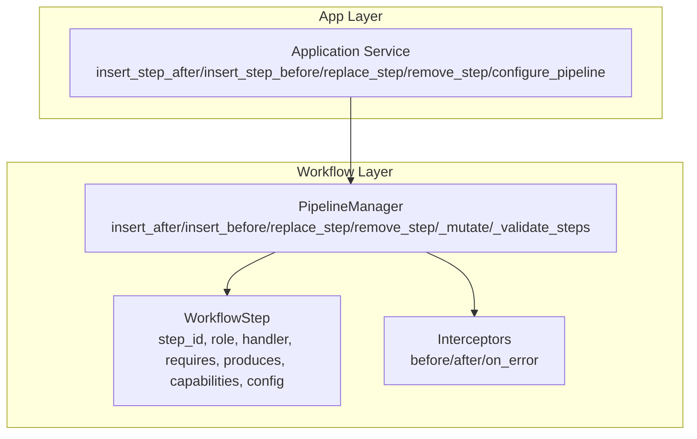
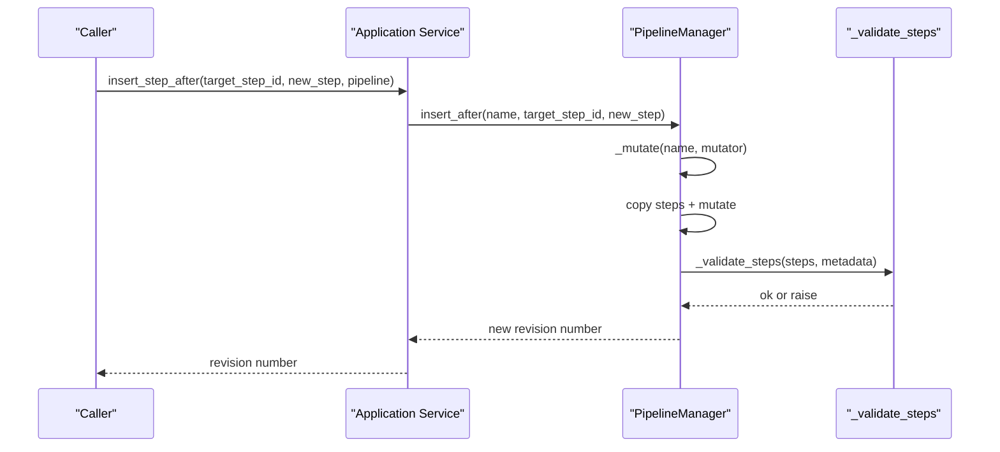
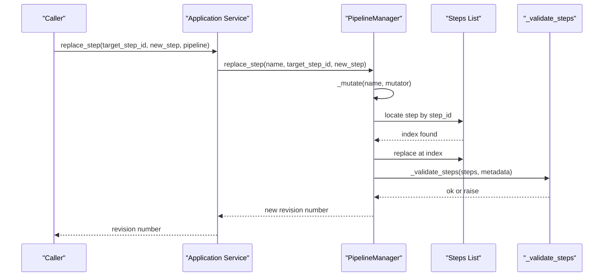
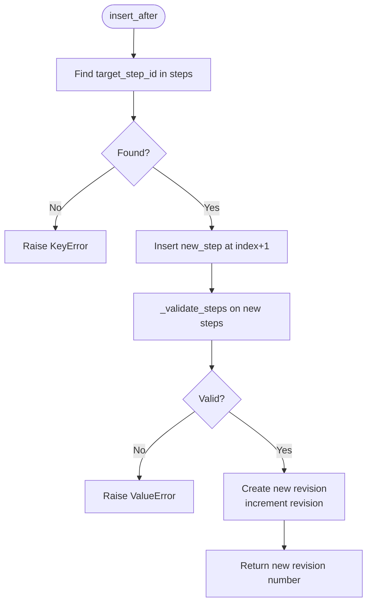
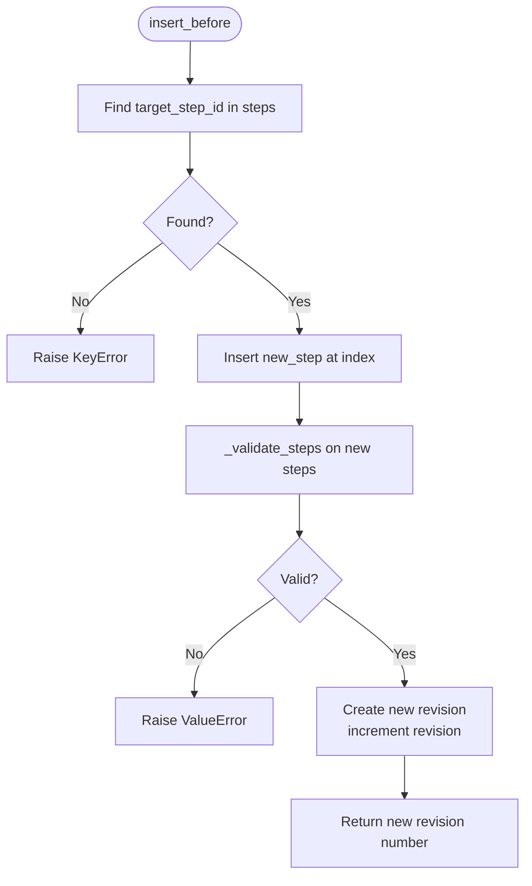
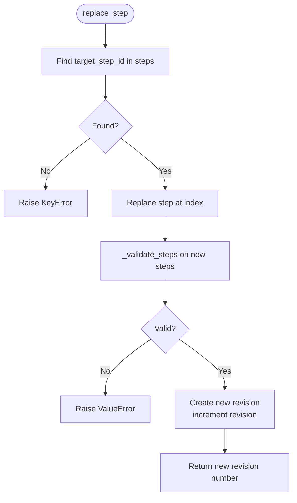
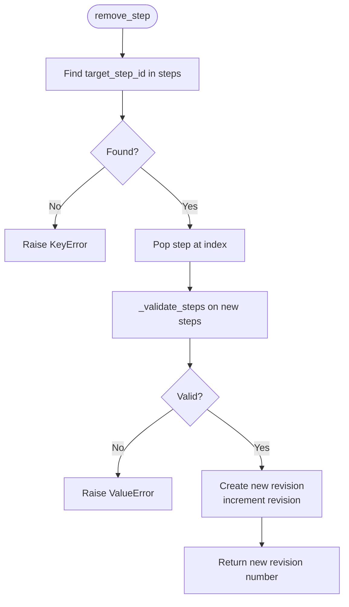
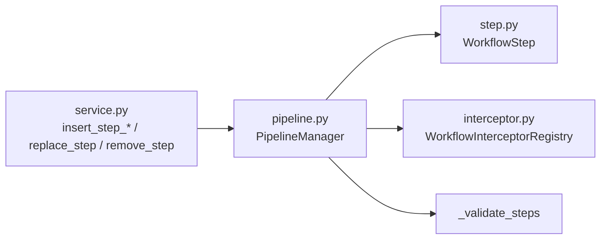

# Step Manipulation

<cite>
**Referenced Files in This Document**
- [pipeline.py](file://src/memu/workflow/pipeline.py)
- [step.py](file://src/memu/workflow/step.py)
- [interceptor.py](file://src/memu/workflow/interceptor.py)
- [service.py](file://src/memu/app/service.py)
- [crud.py](file://src/memu/app/crud.py)
</cite>

## Table of Contents
1. [Introduction](#introduction)
2. [Project Structure](#project-structure)
3. [Core Components](#core-components)
4. [Architecture Overview](#architecture-overview)
5. [Detailed Component Analysis](#detailed-component-analysis)
6. [Dependency Analysis](#dependency-analysis)
7. [Performance Considerations](#performance-considerations)
8. [Troubleshooting Guide](#troubleshooting-guide)
9. [Conclusion](#conclusion)

## Introduction
This document explains step manipulation operations for workflows: insert_after(), insert_before(), replace_step(), and remove_step(). It covers parameters, return values, side effects (including revision increments), validation triggers, step ID matching semantics, position-based insertion/replacement, and error handling. Practical examples illustrate modifying workflows such as adding preprocessing steps, replacing LLM steps with custom implementations, and removing unnecessary processing stages. Rollback and state consistency are addressed via immutable revisions and validation.

## Project Structure
The step manipulation logic lives in the workflow subsystem and is exposed through the application service layer:
- PipelineManager orchestrates immutable revisions and validates step graphs.
- WorkflowStep defines the unit of execution.
- Interceptors provide cross-cutting hooks around step execution.
- Application service exposes convenience methods wrapping PipelineManager operations.

**Diagram sources**
- [pipeline.py](file://src/memu/workflow/pipeline.py#L21-L129)
- [step.py](file://src/memu/workflow/step.py#L16-L47)
- [interceptor.py](file://src/memu/workflow/interceptor.py#L56-L165)
- [service.py](file://src/memu/app/service.py#L390-L426)

**Section sources**
- [pipeline.py](file://src/memu/workflow/pipeline.py#L1-L171)
- [step.py](file://src/memu/workflow/step.py#L1-L102)
- [interceptor.py](file://src/memu/workflow/interceptor.py#L1-L219)
- [service.py](file://src/memu/app/service.py#L380-L427)

## Core Components
- PipelineManager: Manages named pipelines with immutable revisions. Provides mutation APIs that return the new revision number and trigger validation.
- WorkflowStep: Encapsulates a single step’s identity, dependencies, capabilities, and handler.
- Interceptors: Optional hooks executed around step execution for pre/post/error behaviors.
- Application Service: Wraps PipelineManager operations for higher-level usage.

Key behaviors:
- Mutations operate on a copy of the current revision’s steps and metadata, then validate the new graph before committing a new revision.
- Validation ensures unique step IDs, capability availability, LLM profile validity, and state dependency correctness.

**Section sources**
- [pipeline.py](file://src/memu/workflow/pipeline.py#L21-L129)
- [step.py](file://src/memu/workflow/step.py#L16-L47)
- [interceptor.py](file://src/memu/workflow/interceptor.py#L56-L165)
- [service.py](file://src/memu/app/service.py#L390-L426)

## Architecture Overview
The following sequence diagrams show how each manipulation method behaves end-to-end.

**Diagram sources**
- [service.py](file://src/memu/app/service.py#L394-L402)
- [pipeline.py](file://src/memu/workflow/pipeline.py#L64-L73)
- [pipeline.py](file://src/memu/workflow/pipeline.py#L108-L122)
- [pipeline.py](file://src/memu/workflow/pipeline.py#L131-L164)

**Diagram sources**
- [service.py](file://src/memu/app/service.py#L414-L422)
- [pipeline.py](file://src/memu/workflow/pipeline.py#L86-L95)
- [pipeline.py](file://src/memu/workflow/pipeline.py#L108-L122)
- [pipeline.py](file://src/memu/workflow/pipeline.py#L131-L164)

## Detailed Component Analysis

### insert_after(name, target_step_id, new_step) -> int
- Purpose: Insert a new step immediately after the step identified by target_step_id.
- Parameters:
  - name: Pipeline identifier.
  - target_step_id: String step_id to match.
  - new_step: WorkflowStep instance to insert.
- Return value: New revision number (integer).
- Side effects:
  - Creates a new PipelineRevision with incremented revision.
  - Validates the resulting step graph.
- Matching semantics:
  - Exact string match on step_id.
- Position semantics:
  - Insertion occurs at index = first occurrence of target_step_id + 1.
- Validation triggers:
  - Duplicate step_id detection.
  - Capability availability checks.
  - LLM profile validity.
  - State dependency correctness (requires/produces).
- Error conditions:
  - KeyError if target_step_id is not found.
  - ValueError for duplicate step_id, unknown capabilities, unknown LLM profile, or missing required state keys.
- Practical example scenarios:
  - Add preprocessing step after a fetch stage.
  - Insert a cache-check step after data normalization.
- Rollback/consistency:
  - No in-place mutation; new revision preserves prior state.

**Diagram sources**
- [pipeline.py](file://src/memu/workflow/pipeline.py#L64-L73)
- [pipeline.py](file://src/memu/workflow/pipeline.py#L108-L122)
- [pipeline.py](file://src/memu/workflow/pipeline.py#L131-L164)

**Section sources**
- [pipeline.py](file://src/memu/workflow/pipeline.py#L64-L73)
- [pipeline.py](file://src/memu/workflow/pipeline.py#L108-L122)
- [pipeline.py](file://src/memu/workflow/pipeline.py#L131-L164)

### insert_before(name, target_step_id, new_step) -> int
- Purpose: Insert a new step immediately before the step identified by target_step_id.
- Parameters:
  - name: Pipeline identifier.
  - target_step_id: String step_id to match.
  - new_step: WorkflowStep instance to insert.
- Return value: New revision number (integer).
- Side effects:
  - Creates a new PipelineRevision with incremented revision.
  - Validates the resulting step graph.
- Matching semantics:
  - Exact string match on step_id.
- Position semantics:
  - Insertion occurs at index = first occurrence of target_step_id.
- Validation triggers:
  - Duplicate step_id detection.
  - Capability availability checks.
  - LLM profile validity.
  - State dependency correctness (requires/produces).
- Error conditions:
  - KeyError if target_step_id is not found.
  - ValueError for duplicate step_id, unknown capabilities, unknown LLM profile, or missing required state keys.
- Practical example scenarios:
  - Add logging or tracing step before sensitive processing.
  - Insert a rate-limit step before external API calls.

**Diagram sources**
- [pipeline.py](file://src/memu/workflow/pipeline.py#L75-L83)
- [pipeline.py](file://src/memu/workflow/pipeline.py#L108-L122)
- [pipeline.py](file://src/memu/workflow/pipeline.py#L131-L164)

**Section sources**
- [pipeline.py](file://src/memu/workflow/pipeline.py#L75-L83)
- [pipeline.py](file://src/memu/workflow/pipeline.py#L108-L122)
- [pipeline.py](file://src/memu/workflow/pipeline.py#L131-L164)

### replace_step(name, target_step_id, new_step) -> int
- Purpose: Replace an existing step by step_id with a new step.
- Parameters:
  - name: Pipeline identifier.
  - target_step_id: String step_id to match.
  - new_step: WorkflowStep instance to substitute.
- Return value: New revision number (integer).
- Side effects:
  - Creates a new PipelineRevision with incremented revision.
  - Validates the resulting step graph.
- Matching semantics:
  - Exact string match on step_id.
- Replacement semantics:
  - Replaces the entire step object at the matched index.
- Validation triggers:
  - Duplicate step_id detection.
  - Capability availability checks.
  - LLM profile validity.
  - State dependency correctness (requires/produces).
- Error conditions:
  - KeyError if target_step_id is not found.
  - ValueError for duplicate step_id, unknown capabilities, unknown LLM profile, or missing required state keys.
- Practical example scenarios:
  - Replace an LLM step with a custom handler for specialized logic.
  - Swap out a legacy data source step with a new one.

**Diagram sources**
- [pipeline.py](file://src/memu/workflow/pipeline.py#L86-L95)
- [pipeline.py](file://src/memu/workflow/pipeline.py#L108-L122)
- [pipeline.py](file://src/memu/workflow/pipeline.py#L131-L164)

**Section sources**
- [pipeline.py](file://src/memu/workflow/pipeline.py#L86-L95)
- [pipeline.py](file://src/memu/workflow/pipeline.py#L108-L122)
- [pipeline.py](file://src/memu/workflow/pipeline.py#L131-L164)

### remove_step(name, target_step_id) -> int
- Purpose: Remove an existing step by step_id.
- Parameters:
  - name: Pipeline identifier.
  - target_step_id: String step_id to match.
- Return value: New revision number (integer).
- Side effects:
  - Creates a new PipelineRevision with incremented revision.
  - Validates the resulting step graph.
- Matching semantics:
  - Exact string match on step_id.
- Removal semantics:
  - Removes the step at the matched index.
- Validation triggers:
  - Duplicate step_id detection.
  - Capability availability checks.
  - LLM profile validity.
  - State dependency correctness (requires/produces).
- Error conditions:
  - KeyError if target_step_id is not found.
  - ValueError for duplicate step_id, unknown capabilities, unknown LLM profile, or missing required state keys.
- Practical example scenarios:
  - Remove redundant deduplication or filtering steps.
  - Strip out optional diagnostic steps in production.

**Diagram sources**
- [pipeline.py](file://src/memu/workflow/pipeline.py#L97-L106)
- [pipeline.py](file://src/memu/workflow/pipeline.py#L108-L122)
- [pipeline.py](file://src/memu/workflow/pipeline.py#L131-L164)

**Section sources**
- [pipeline.py](file://src/memu/workflow/pipeline.py#L97-L106)
- [pipeline.py](file://src/memu/workflow/pipeline.py#L108-L122)
- [pipeline.py](file://src/memu/workflow/pipeline.py#L131-L164)

### Step ID Matching, Position Semantics, and Replacement
- Matching: Exact string equality on step_id.
- Position semantics:
  - insert_before: inserts at the index of the matched step.
  - insert_after: inserts at index = matched index + 1.
- Replacement semantics:
  - replace_step swaps the entire step object at the matched index.
- Validation:
  - All mutations call _validate_steps on the new step list, ensuring:
    - Unique step_id across the pipeline.
    - Known capabilities against available set.
    - Valid LLM profile names.
    - State dependency chain integrity (requires must be satisfied by earlier steps’ produces).

**Section sources**
- [pipeline.py](file://src/memu/workflow/pipeline.py#L64-L106)
- [pipeline.py](file://src/memu/workflow/pipeline.py#L131-L164)

### Practical Examples

#### Adding a Preprocessing Step After Data Fetch
- Scenario: Insert a normalization step right after a fetch step to prepare data for downstream processing.
- Steps:
  - Obtain the current pipeline revision.
  - Call insert_after with the fetch step’s step_id and a new normalization WorkflowStep.
  - Use the returned revision number to confirm the change.
- Outcome: The normalization step runs immediately after fetch, and the new revision enforces validation.

**Section sources**
- [service.py](file://src/memu/app/service.py#L394-L402)
- [pipeline.py](file://src/memu/workflow/pipeline.py#L64-L73)

#### Replacing an LLM Step with a Custom Implementation
- Scenario: Replace a generic LLM step with a specialized handler that uses cached results or a different provider.
- Steps:
  - Prepare a new WorkflowStep with the desired handler and appropriate requires/produces.
  - Call replace_step with the LLM step’s step_id.
  - Observe the new revision number and rely on validation to ensure compatibility.
- Outcome: The pipeline now uses the custom handler while preserving state dependencies.

**Section sources**
- [service.py](file://src/memu/app/service.py#L414-L422)
- [pipeline.py](file://src/memu/workflow/pipeline.py#L86-L95)

#### Removing an Unnecessary Processing Stage
- Scenario: Remove a diagnostics or optional step that is no longer needed.
- Steps:
  - Call remove_step with the step’s step_id.
  - Validate that the remaining pipeline still satisfies state dependencies.
- Outcome: Simplified pipeline with a new revision.

**Section sources**
- [service.py](file://src/memu/app/service.py#L424-L426)
- [pipeline.py](file://src/memu/workflow/pipeline.py#L97-L106)

### Interceptors and Execution Context
While not part of the manipulation APIs themselves, interceptors influence step execution and can be useful when validating behavior during modifications:
- Before/After/On-error interceptors are invoked per step during run_steps.
- Interceptor registries snapshot at runtime to capture the effective set of interceptors for a given run.

**Section sources**
- [interceptor.py](file://src/memu/workflow/interceptor.py#L56-L165)
- [step.py](file://src/memu/workflow/step.py#L50-L101)

## Dependency Analysis
The following diagram shows how the manipulation APIs depend on core components.

**Diagram sources**
- [service.py](file://src/memu/app/service.py#L390-L426)
- [pipeline.py](file://src/memu/workflow/pipeline.py#L21-L129)
- [step.py](file://src/memu/workflow/step.py#L16-L47)
- [interceptor.py](file://src/memu/workflow/interceptor.py#L56-L165)

**Section sources**
- [service.py](file://src/memu/app/service.py#L390-L426)
- [pipeline.py](file://src/memu/workflow/pipeline.py#L21-L129)
- [step.py](file://src/memu/workflow/step.py#L16-L47)
- [interceptor.py](file://src/memu/workflow/interceptor.py#L56-L165)

## Performance Considerations
- Complexity:
  - insert_before/insert_after/replace_step/remove_step scan the steps list linearly by step_id; complexity is O(n) per operation.
  - Validation iterates the steps once, checking uniqueness, capabilities, profiles, and state dependencies; complexity is O(n).
- Copying:
  - Each mutation copies the current steps and metadata before applying changes, adding overhead proportional to the number of steps.
- Recommendations:
  - Batch related mutations when possible to minimize repeated copying and validation.
  - Keep step lists reasonably sized to avoid long linear scans.

[No sources needed since this section provides general guidance]

## Troubleshooting Guide
Common errors and resolutions:
- KeyError: "Step '...' not found in pipeline '...'":
  - Cause: target_step_id does not exist in the pipeline.
  - Resolution: Verify the step_id exists in the current revision or adjust the pipeline name.
- KeyError: "Pipeline '...' not registered":
  - Cause: Attempting to mutate a pipeline that was never registered.
  - Resolution: Register the pipeline first or use a valid pipeline name.
- ValueError: "Duplicate step_id '...' found":
  - Cause: The new step introduces a duplicate step_id.
  - Resolution: Choose a unique step_id for the new step.
- ValueError: "Step '...' requests unavailable capabilities: ...":
  - Cause: The step declares capabilities not present in the manager’s available set.
  - Resolution: Adjust step capabilities or configure the manager’s available capabilities.
- ValueError: "Step '...' references unknown llm_profile '...'":
  - Cause: The step config references an LLM profile not in the manager’s llm_profiles.
  - Resolution: Define the profile or correct the step config.
- ValueError: "Step '...' requires missing state keys: ...":
  - Cause: The step’s requires are not satisfied by earlier steps’ produces plus initial state keys.
  - Resolution: Ensure preceding steps produce the required keys or include them in initial_state_keys.

Operational tips:
- Use the returned revision number to track changes and coordinate rollouts.
- If validation fails, inspect the step’s requires/produces and capabilities against the pipeline’s current state.

**Section sources**
- [pipeline.py](file://src/memu/workflow/pipeline.py#L59-L60)
- [pipeline.py](file://src/memu/workflow/pipeline.py#L126-L128)
- [pipeline.py](file://src/memu/workflow/pipeline.py#L136-L138)
- [pipeline.py](file://src/memu/workflow/pipeline.py#L141-L154)
- [pipeline.py](file://src/memu/workflow/pipeline.py#L156-L162)

## Conclusion
The step manipulation APIs provide safe, immutable ways to evolve workflows. Each operation:
- Matches steps by exact step_id.
- Operates positionally for insertions.
- Replaces the entire step object for replacements.
- Increments the pipeline revision and validates the new graph.
- Returns a new revision number for tracking and consistency.

By leveraging these guarantees, teams can confidently add preprocessing, swap LLM implementations, and prune unnecessary stages while maintaining state correctness and capability alignment.