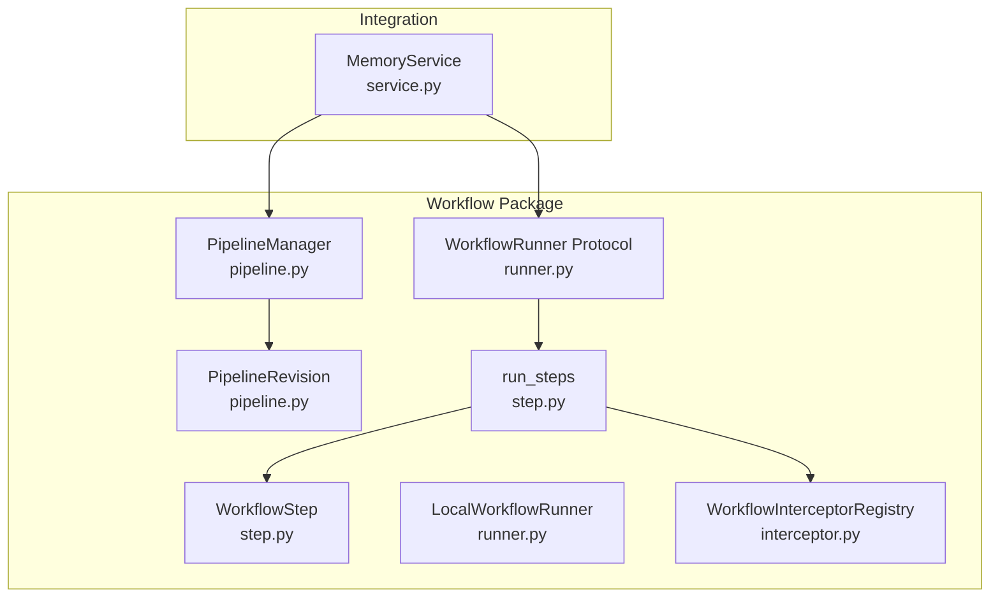
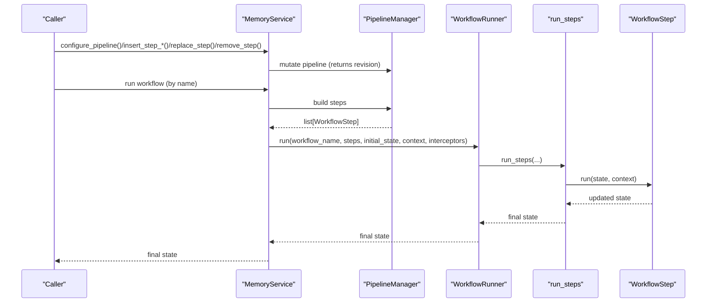
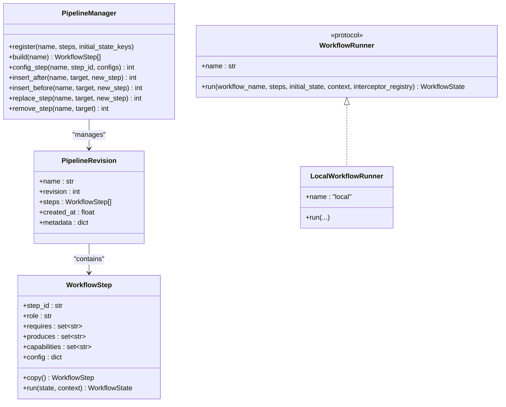
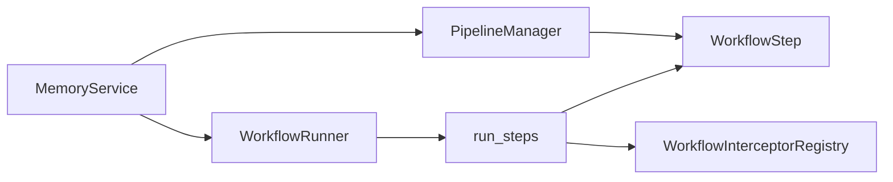

# Workflow Management

<cite>
**Referenced Files in This Document**
- [pipeline.py](file://src/memu/workflow/pipeline.py)
- [step.py](file://src/memu/workflow/step.py)
- [runner.py](file://src/memu/workflow/runner.py)
- [interceptor.py](file://src/memu/workflow/interceptor.py)
- [service.py](file://src/memu/app/service.py)
- [architecture.md](file://docs/architecture.md)
- [0001-workflow-pipeline-architecture.md](file://docs/adr/0001-workflow-pipeline-architecture.md)
</cite>

## Table of Contents
1. [Introduction](#introduction)
2. [Project Structure](#project-structure)
3. [Core Components](#core-components)
4. [Architecture Overview](#architecture-overview)
5. [Detailed Component Analysis](#detailed-component-analysis)
6. [Dependency Analysis](#dependency-analysis)
7. [Performance Considerations](#performance-considerations)
8. [Troubleshooting Guide](#troubleshooting-guide)
9. [Conclusion](#conclusion)
10. [Appendices](#appendices)

## Introduction
This document provides API documentation for workflow management operations focused on pipeline configuration and execution. It covers methods for pipeline manipulation, the pipeline registration process, step configuration options, and workflow state management. It also explains how workflows relate to the main MemoryService operations, and addresses workflow versioning, rollback capabilities, and debugging techniques.

## Project Structure
The workflow management system is implemented under the workflow package and integrated with MemoryService. The key modules are:
- Pipeline manager and revisioning for pipeline configuration
- Step definition and execution
- Runner abstraction for execution backends
- Interceptor system for instrumentation and control
- Integration with MemoryService for orchestration

**Diagram sources**
- [pipeline.py](file://src/memu/workflow/pipeline.py#L21-L171)
- [step.py](file://src/memu/workflow/step.py#L16-L102)
- [runner.py](file://src/memu/workflow/runner.py#L12-L82)
- [interceptor.py](file://src/memu/workflow/interceptor.py#L56-L219)
- [service.py](file://src/memu/app/service.py#L49-L427)

**Section sources**
- [architecture.md](file://docs/architecture.md#L52-L72)
- [0001-workflow-pipeline-architecture.md](file://docs/adr/0001-workflow-pipeline-architecture.md#L12-L21)

## Core Components
- PipelineManager: Manages named pipelines, validates step dependencies, and maintains revisions for safe mutations.
- WorkflowStep: Encapsulates a single stage in a pipeline with identity, roles, required/produced state keys, capabilities, and handler.
- WorkflowRunner: Abstraction for execution backends; default is LocalWorkflowRunner.
- WorkflowInterceptorRegistry: Provides before/after/on_error hooks around each step.
- MemoryService: Integrates pipelines with orchestration, exposes mutation APIs, and resolves runners.

**Section sources**
- [pipeline.py](file://src/memu/workflow/pipeline.py#L21-L171)
- [step.py](file://src/memu/workflow/step.py#L16-L102)
- [runner.py](file://src/memu/workflow/runner.py#L12-L82)
- [interceptor.py](file://src/memu/workflow/interceptor.py#L56-L219)
- [service.py](file://src/memu/app/service.py#L49-L427)

## Architecture Overview
The system models each core operation as a named workflow pipeline composed of ordered WorkflowStep units. Pipelines are registered centrally in MemoryService via PipelineManager, validated for required/produced state keys, executed through a WorkflowRunner abstraction, and support runtime customization by step-level config and structural mutation. Interceptors provide instrumentation and control around step execution.

**Diagram sources**
- [service.py](file://src/memu/app/service.py#L390-L426)
- [pipeline.py](file://src/memu/workflow/pipeline.py#L47-L122)
- [runner.py](file://src/memu/workflow/runner.py#L28-L39)
- [step.py](file://src/memu/workflow/step.py#L50-L102)

## Detailed Component Analysis

### Pipeline Manipulation API
The following methods enable runtime pipeline reconfiguration. They return the new revision number and raise errors when targets are not found or validations fail.

- configure_pipeline(step_id, configs, pipeline="memorize") -> int
  - Parameters:
    - step_id: Identifier of the target step to update
    - configs: Mapping of configuration keys to update
    - pipeline: Name of the pipeline to mutate
  - Return: New revision number
  - Side effects: Creates a new revision with merged step config; raises KeyError if step not found; raises ValueError on validation failure
  - Notes: Merges provided configs into existing step config

- insert_step_after(target_step_id, new_step, pipeline="memorize") -> int
  - Parameters:
    - target_step_id: Step after which to insert
    - new_step: WorkflowStep to insert
    - pipeline: Pipeline name
  - Return: New revision number
  - Side effects: Inserts a new step immediately after the target; raises KeyError if not found

- insert_step_before(target_step_id, new_step, pipeline="memorize") -> int
  - Parameters:
    - target_step_id: Step before which to insert
    - new_step: WorkflowStep to insert
    - pipeline: Pipeline name
  - Return: New revision number
  - Side effects: Inserts a new step immediately before the target; raises KeyError if not found

- replace_step(target_step_id, new_step, pipeline="memorize") -> int
  - Parameters:
    - target_step_id: Step to replace
    - new_step: Replacement WorkflowStep
    - pipeline: Pipeline name
  - Return: New revision number
  - Side effects: Replaces the target step; raises KeyError if not found

- remove_step(target_step_id, pipeline="memorize") -> int
  - Parameters:
    - target_step_id: Step to remove
    - pipeline: Pipeline name
  - Return: New revision number
  - Side effects: Removes the target step; raises KeyError if not found

Validation rules enforced during mutation:
- Duplicate step_id detection
- Capability availability checks against PipelineManager’s available capabilities
- LLM profile validity checks against configured profiles
- Required state keys presence before each step based on accumulated produced keys

**Section sources**
- [service.py](file://src/memu/app/service.py#L390-L426)
- [pipeline.py](file://src/memu/workflow/pipeline.py#L51-L122)
- [pipeline.py](file://src/memu/workflow/pipeline.py#L131-L165)

### Pipeline Registration and Execution
- Pipeline registration:
  - PipelineManager.register(name, steps, initial_state_keys=None) creates the first revision
  - initial_state_keys define the baseline required keys for validation
- Pipeline building:
  - PipelineManager.build(name) returns a deep copy of the current revision’s steps
- Execution:
  - MemoryService resolves a runner and executes the named pipeline with initial state and optional context
  - WorkflowRunner.run(...) delegates to run_steps(...) which enforces step requirements and invokes interceptors

**Diagram sources**
- [pipeline.py](file://src/memu/workflow/pipeline.py#L21-L171)
- [step.py](file://src/memu/workflow/step.py#L16-L48)
- [runner.py](file://src/memu/workflow/runner.py#L12-L49)

**Section sources**
- [pipeline.py](file://src/memu/workflow/pipeline.py#L27-L45)
- [pipeline.py](file://src/memu/workflow/pipeline.py#L47-L49)
- [runner.py](file://src/memu/workflow/runner.py#L28-L39)
- [service.py](file://src/memu/app/service.py#L350-L360)

### Step Configuration Options
- Step identity and contract:
  - step_id: Unique identifier used for targeting mutations
  - requires: Keys required in state before step execution
  - produces: Keys written to state by the step
  - capabilities: Tags indicating required backend capabilities
  - config: Per-step configuration dictionary
- Handler signature:
  - handler(state, context) -> Mapping[str, Any] (sync or async)
- Context injection:
  - run_steps injects step_id and step_config into the step context for interceptors and handlers

Practical configuration examples (conceptual):
- Switch LLM profile for a step by setting llm_profile/chat_llm_profile/embed_llm_profile in step config
- Adjust step behavior via custom keys in config (e.g., thresholds, flags) consumed by the handler

**Section sources**
- [step.py](file://src/memu/workflow/step.py#L16-L48)
- [step.py](file://src/memu/workflow/step.py#L50-L102)
- [pipeline.py](file://src/memu/workflow/pipeline.py#L147-L154)

### Workflow State Management
- State is a dictionary keyed by strings; each step declares required and produced keys
- Validation ensures required keys are present before each step and accumulates produced keys across the pipeline
- run_steps enforces missing keys and passes a copy of the initial state into the pipeline

**Section sources**
- [step.py](file://src/memu/workflow/step.py#L67-L72)
- [pipeline.py](file://src/memu/workflow/pipeline.py#L156-L164)

### Practical Examples

Note: The following examples describe workflows conceptually. Replace placeholders with actual step definitions and handlers appropriate to your use case.

- Customize a step’s configuration:
  - Call configure_pipeline(step_id="...", configs={"some_key": "value"}, pipeline="memorize")
  - Inspect returned revision to confirm the change

- Insert a step after a given step:
  - Create a new WorkflowStep with desired behavior
  - Call insert_step_after(target_step_id="...", new_step=new_step, pipeline="memorize")

- Insert a step before a given step:
  - Same as above, using insert_step_before

- Replace a step:
  - Create a replacement WorkflowStep
  - Call replace_step(target_step_id="...", new_step=new_step, pipeline="memorize")

- Remove a step:
  - Call remove_step(target_step_id="...", pipeline="memorize")

- Re-run a workflow with the new pipeline:
  - Build steps via PipelineManager.build("memorize")
  - Execute via MemoryService workflow runner

- Debugging:
  - Register before/after/on_error workflow interceptors to capture step context and state snapshots
  - Enable strict mode on the interceptor registry to propagate interceptor exceptions instead of logging

**Section sources**
- [service.py](file://src/memu/app/service.py#L390-L426)
- [interceptor.py](file://src/memu/workflow/interceptor.py#L78-L115)
- [interceptor.py](file://src/memu/workflow/interceptor.py#L163-L219)

## Dependency Analysis
- PipelineManager depends on WorkflowStep and enforces validation across steps
- run_steps depends on WorkflowStep and WorkflowInterceptorRegistry
- MemoryService composes PipelineManager, WorkflowRunner, and interceptors
- Runner resolution supports pluggable backends (e.g., "local"/"sync")

**Diagram sources**
- [pipeline.py](file://src/memu/workflow/pipeline.py#L9-L9)
- [step.py](file://src/memu/workflow/step.py#L57-L62)
- [runner.py](file://src/memu/workflow/runner.py#L61-L82)
- [service.py](file://src/memu/app/service.py#L89-L95)

**Section sources**
- [runner.py](file://src/memu/workflow/runner.py#L46-L82)
- [service.py](file://src/memu/app/service.py#L89-L95)

## Performance Considerations
- Pipeline mutations create new revisions; frequent mutations can increase memory usage. Monitor revision counts and prune old revisions if needed.
- run_steps iterates steps sequentially; keep steps focused and avoid heavy synchronous work inside handlers.
- Interceptors add overhead; disable or minimize interceptor count in hot paths.
- LLM client selection and caching are handled by MemoryService; ensure profiles are configured appropriately to avoid repeated client initialization.

[No sources needed since this section provides general guidance]

## Troubleshooting Guide
Common issues and resolutions:
- Step not found during mutation:
  - Ensure step_id matches exactly; verify pipeline name and current revision
- Validation failures:
  - Duplicate step_id: Change step_id to be unique
  - Unknown capability: Confirm PipelineManager’s available capabilities include the step’s capabilities
  - Unknown LLM profile: Add the profile to llm_profiles or adjust step config
  - Missing required state keys: Ensure preceding steps produce the required keys or supply initial_state_keys at registration
- Handler errors:
  - Handlers must return a mapping; otherwise a TypeError is raised
- Interceptor exceptions:
  - By default, interceptor exceptions are logged; enable strict mode to propagate them

Debugging techniques:
- Register before/after/on_error workflow interceptors to capture step_context and state snapshots
- Use revision_token to track pipeline state across deployments
- Validate pipeline state by building steps and iterating through requires/produces

**Section sources**
- [pipeline.py](file://src/memu/workflow/pipeline.py#L59-L60)
- [pipeline.py](file://src/memu/workflow/pipeline.py#L92-L93)
- [pipeline.py](file://src/memu/workflow/pipeline.py#L103-L104)
- [pipeline.py](file://src/memu/workflow/pipeline.py#L137-L138)
- [pipeline.py](file://src/memu/workflow/pipeline.py#L144-L145)
- [pipeline.py](file://src/memu/workflow/pipeline.py#L158-L162)
- [step.py](file://src/memu/workflow/step.py#L45-L46)
- [interceptor.py](file://src/memu/workflow/interceptor.py#L215-L218)
- [pipeline.py](file://src/memu/workflow/pipeline.py#L166-L171)

## Conclusion
The workflow management system provides a robust, extensible framework for modeling core operations as pipelines. It supports safe runtime reconfiguration, explicit state contracts, and comprehensive instrumentation through interceptors. MemoryService integrates these capabilities to orchestrate ingestion, retrieval, and CRUD operations with clear versioning and validation guarantees.

[No sources needed since this section summarizes without analyzing specific files]

## Appendices

### Relationship Between Workflows and MemoryService Operations
- MemoryService registers multiple pipelines (e.g., memorize, retrieve_rag, retrieve_llm, CRUD operations) via PipelineManager
- Public APIs (memorize, retrieve, CRUD) execute as workflows using the configured runner
- Interceptors and runner resolution are managed by MemoryService

**Section sources**
- [service.py](file://src/memu/app/service.py#L315-L348)
- [service.py](file://src/memu/app/service.py#L350-L360)
- [architecture.md](file://docs/architecture.md#L34-L51)

### Workflow Versioning and Rollback
- Pipeline revisions are numbered and appended upon mutation; each revision preserves metadata (including initial_state_keys)
- To “rollback,” rebuild steps from a previously recorded revision and re-execute the workflow
- Use revision_token to serialize current pipeline state across deployments

**Section sources**
- [pipeline.py](file://src/memu/workflow/pipeline.py#L114-L122)
- [pipeline.py](file://src/memu/workflow/pipeline.py#L166-L171)