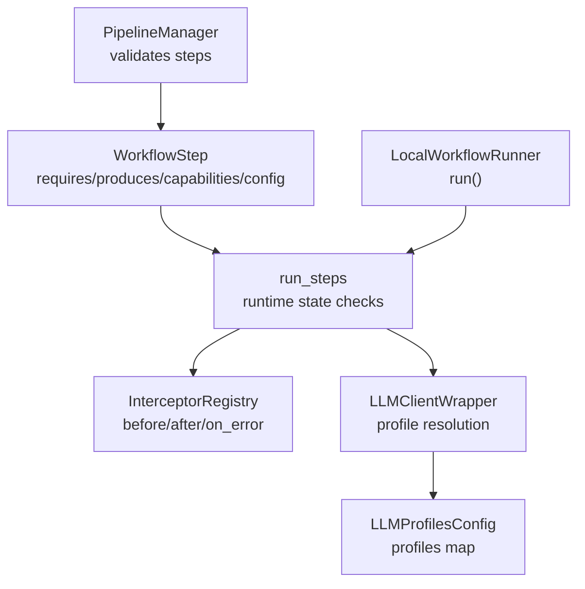
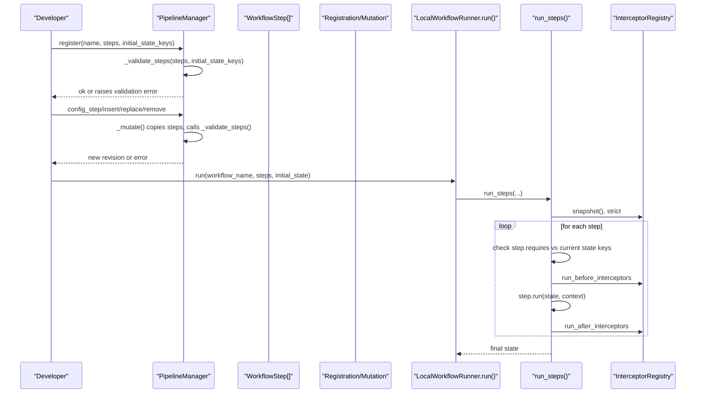
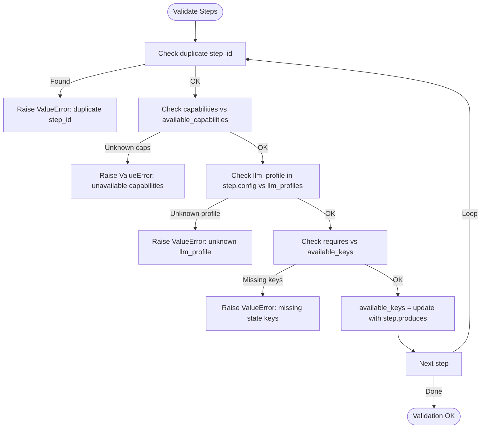
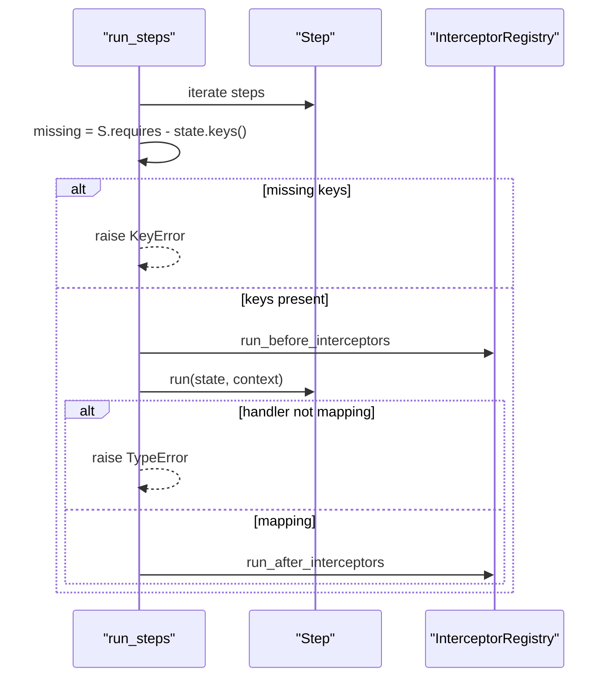
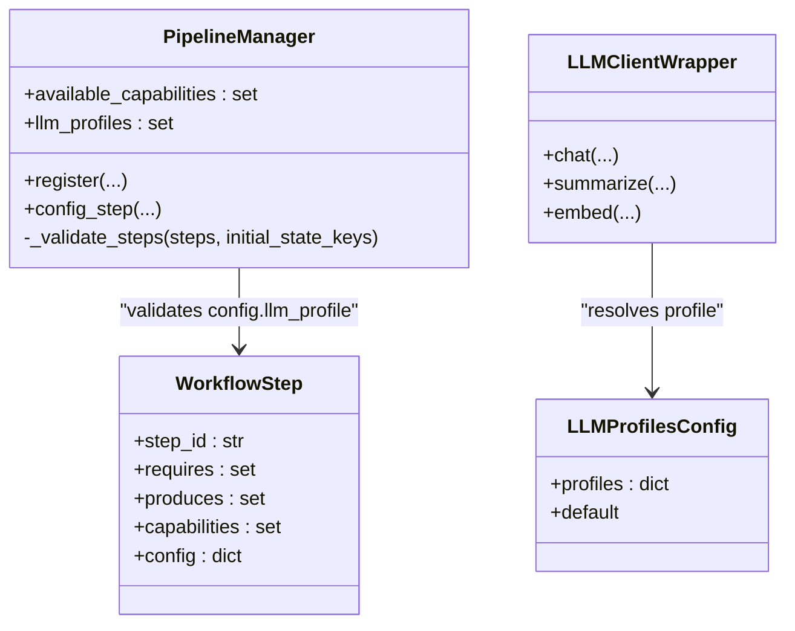
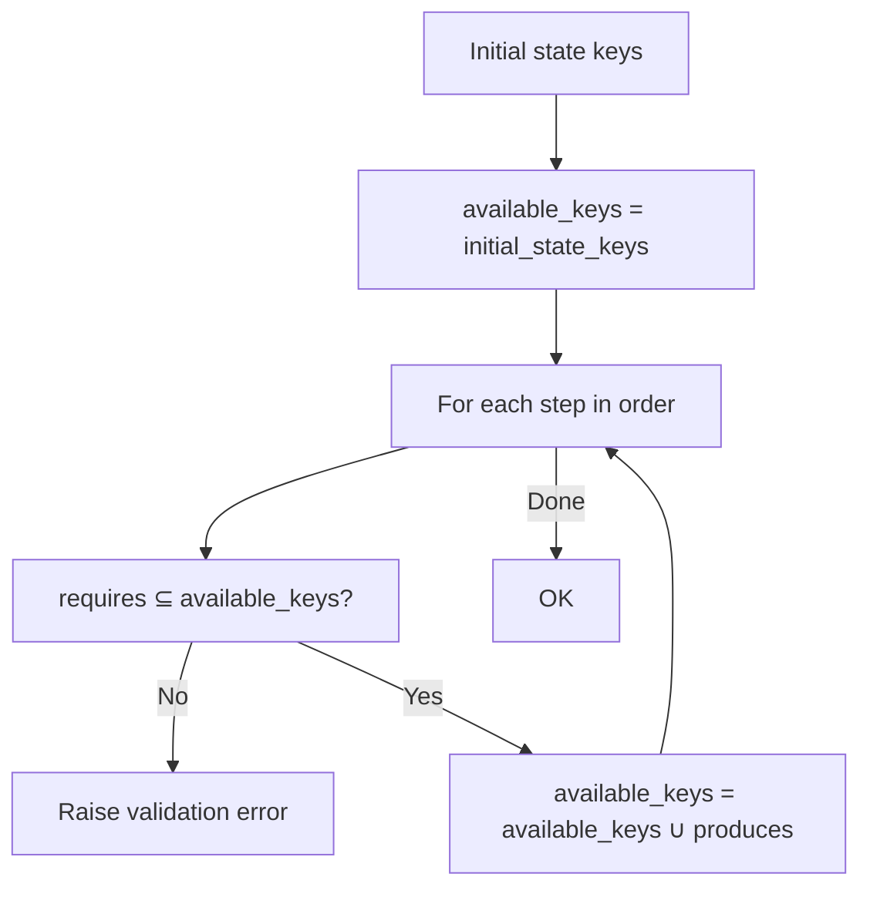
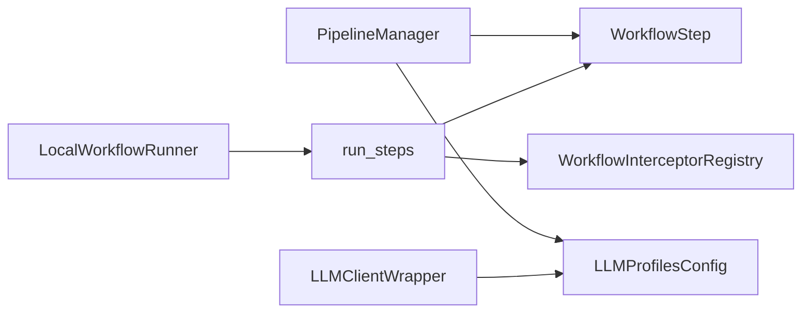

# Workflow Validation

<cite>
**Referenced Files in This Document**
- [pipeline.py](file://src/memu/workflow/pipeline.py)
- [step.py](file://src/memu/workflow/step.py)
- [runner.py](file://src/memu/workflow/runner.py)
- [interceptor.py](file://src/memu/workflow/interceptor.py)
- [wrapper.py](file://src/memu/llm/wrapper.py)
- [settings.py](file://src/memu/app/settings.py)
- [service.py](file://src/memu/app/service.py)
- [retrieve.py](file://src/memu/app/retrieve.py)
- [crud.py](file://src/memu/app/crud.py)
</cite>

## Table of Contents
1. [Introduction](#introduction)
2. [Project Structure](#project-structure)
3. [Core Components](#core-components)
4. [Architecture Overview](#architecture-overview)
5. [Detailed Component Analysis](#detailed-component-analysis)
6. [Dependency Analysis](#dependency-analysis)
7. [Performance Considerations](#performance-considerations)
8. [Troubleshooting Guide](#troubleshooting-guide)
9. [Conclusion](#conclusion)

## Introduction
This document explains the workflow validation mechanisms that ensure pipeline integrity and operational safety in the system. It focuses on:
- Duplicate step ID detection
- Capability availability checks
- LLM profile validation
- State dependency verification
- Validation timing during pipeline operations
- How validation failures are surfaced and handled
- Debugging techniques for complex validation issues

The validation logic is enforced at two stages:
- Pipeline registration and mutation (design-time validation)
- Step execution (runtime validation)

## Project Structure
The workflow validation spans several modules:
- Pipeline definition and validation: [pipeline.py](file://src/memu/workflow/pipeline.py)
- Step execution and runtime checks: [step.py](file://src/memu/workflow/step.py)
- Execution orchestration: [runner.py](file://src/memu/workflow/runner.py)
- Interceptors for pre/post execution hooks: [interceptor.py](file://src/memu/workflow/interceptor.py)
- LLM client wrapping and profile resolution: [wrapper.py](file://src/memu/llm/wrapper.py)
- LLM profiles configuration: [settings.py](file://src/memu/app/settings.py)
- Service integration and step usage: [service.py](file://src/memu/app/service.py), [retrieve.py](file://src/memu/app/retrieve.py), [crud.py](file://src/memu/app/crud.py)

**Diagram sources**
- [pipeline.py](file://src/memu/workflow/pipeline.py#L21-L171)
- [step.py](file://src/memu/workflow/step.py#L16-L102)
- [runner.py](file://src/memu/workflow/runner.py#L28-L82)
- [interceptor.py](file://src/memu/workflow/interceptor.py#L56-L219)
- [wrapper.py](file://src/memu/llm/wrapper.py#L226-L505)
- [settings.py](file://src/memu/app/settings.py#L263-L297)

**Section sources**
- [pipeline.py](file://src/memu/workflow/pipeline.py#L21-L171)
- [step.py](file://src/memu/workflow/step.py#L16-L102)
- [runner.py](file://src/memu/workflow/runner.py#L28-L82)
- [interceptor.py](file://src/memu/workflow/interceptor.py#L56-L219)
- [wrapper.py](file://src/memu/llm/wrapper.py#L226-L505)
- [settings.py](file://src/memu/app/settings.py#L263-L297)

## Core Components
- PipelineManager: Validates step uniqueness, capability availability, LLM profile presence, and state dependency chain during registration and mutations.
- WorkflowStep: Defines step semantics (IDs, requires, produces, capabilities, config).
- run_steps: Enforces runtime state dependency checks and invokes interceptors around each step.
- LocalWorkflowRunner: Executes a named workflow with a given initial state.
- WorkflowInterceptorRegistry: Manages before/after/on_error hooks around step execution.
- LLMClientWrapper and LLMProfilesConfig: Resolve and validate LLM profiles used by steps.

**Section sources**
- [pipeline.py](file://src/memu/workflow/pipeline.py#L21-L171)
- [step.py](file://src/memu/workflow/step.py#L16-L102)
- [runner.py](file://src/memu/workflow/runner.py#L28-L82)
- [interceptor.py](file://src/memu/workflow/interceptor.py#L56-L219)
- [wrapper.py](file://src/memu/llm/wrapper.py#L226-L505)
- [settings.py](file://src/memu/app/settings.py#L263-L297)

## Architecture Overview
The validation architecture separates design-time and runtime checks:

**Diagram sources**
- [pipeline.py](file://src/memu/workflow/pipeline.py#L27-L122)
- [step.py](file://src/memu/workflow/step.py#L50-L102)
- [runner.py](file://src/memu/workflow/runner.py#L28-L40)
- [interceptor.py](file://src/memu/workflow/interceptor.py#L163-L219)

## Detailed Component Analysis

### Pipeline Registration and Mutation Validation
PipelineManager enforces:
- Unique step IDs across a pipeline
- Capability availability against configured set
- LLM profile existence for steps referencing profiles
- State dependency chain: each step’s requires must be satisfied by earlier steps’ produces plus initial_state_keys

**Diagram sources**
- [pipeline.py](file://src/memu/workflow/pipeline.py#L131-L165)

**Section sources**
- [pipeline.py](file://src/memu/workflow/pipeline.py#L131-L165)

### Runtime Step Execution Validation
During execution, run_steps enforces:
- Each step’s requires must be present in the current state keys
- Step handlers must return a mapping

**Diagram sources**
- [step.py](file://src/memu/workflow/step.py#L50-L102)
- [interceptor.py](file://src/memu/workflow/interceptor.py#L168-L203)

**Section sources**
- [step.py](file://src/memu/workflow/step.py#L50-L102)
- [interceptor.py](file://src/memu/workflow/interceptor.py#L168-L203)

### LLM Profile Validation and Resolution
Steps can reference an llm_profile in their config. PipelineManager validates the profile exists against the configured llm_profiles set. At runtime, the service resolves the appropriate client wrapper and metadata for LLM calls.

**Diagram sources**
- [pipeline.py](file://src/memu/workflow/pipeline.py#L21-L171)
- [step.py](file://src/memu/workflow/step.py#L16-L38)
- [settings.py](file://src/memu/app/settings.py#L263-L297)
- [wrapper.py](file://src/memu/llm/wrapper.py#L226-L505)

**Section sources**
- [pipeline.py](file://src/memu/workflow/pipeline.py#L147-L154)
- [settings.py](file://src/memu/app/settings.py#L263-L297)
- [wrapper.py](file://src/memu/llm/wrapper.py#L226-L505)
- [service.py](file://src/memu/app/service.py#L168-L227)

### Capability Availability Checks
Steps declare capabilities (e.g., “llm”, “vector”, “db”). PipelineManager compares step.capabilities against the configured available_capabilities set and rejects unknown capabilities.

Practical usage examples in the codebase demonstrate:
- A retrieval step requiring “vector” capability
- A sufficiency check step requiring “llm” capability
- A CRUD step requiring “db” capability

**Section sources**
- [pipeline.py](file://src/memu/workflow/pipeline.py#L141-L145)
- [retrieve.py](file://src/memu/app/retrieve.py#L160-L182)
- [crud.py](file://src/memu/app/crud.py#L108-L109)

### State Dependency Verification
Two complementary checks ensure state integrity:
- Design-time: PipelineManager walks steps in order, building available_keys from initial_state_keys and prior step.produces, then verifies each step.requires ⊆ available_keys.
- Runtime: run_steps checks step.requires ⊆ current state.keys() before invoking the step.

**Diagram sources**
- [pipeline.py](file://src/memu/workflow/pipeline.py#L131-L165)
- [step.py](file://src/memu/workflow/step.py#L68-L72)

**Section sources**
- [pipeline.py](file://src/memu/workflow/pipeline.py#L131-L165)
- [step.py](file://src/memu/workflow/step.py#L68-L72)

### Validation Timing and Failure Handling
- Design-time failures occur during register() and mutation operations (config_step, insert_* , replace_step, remove_step). These raise ValueError or KeyError immediately, preventing invalid pipelines from being stored.
- Runtime failures occur during run_steps(). Missing state keys cause KeyError; handler returning non-mapping causes TypeError. Exceptions raised by steps can be intercepted via on_error hooks if configured.

**Section sources**
- [pipeline.py](file://src/memu/workflow/pipeline.py#L36-L45)
- [pipeline.py](file://src/memu/workflow/pipeline.py#L113-L122)
- [step.py](file://src/memu/workflow/step.py#L68-L72)
- [step.py](file://src/memu/workflow/step.py#L40-L47)
- [interceptor.py](file://src/memu/workflow/interceptor.py#L192-L203)

## Dependency Analysis
The following diagram shows how validation components depend on each other:

**Diagram sources**
- [pipeline.py](file://src/memu/workflow/pipeline.py#L21-L171)
- [step.py](file://src/memu/workflow/step.py#L16-L102)
- [runner.py](file://src/memu/workflow/runner.py#L28-L82)
- [interceptor.py](file://src/memu/workflow/interceptor.py#L56-L219)
- [wrapper.py](file://src/memu/llm/wrapper.py#L226-L505)
- [settings.py](file://src/memu/app/settings.py#L263-L297)

**Section sources**
- [pipeline.py](file://src/memu/workflow/pipeline.py#L21-L171)
- [step.py](file://src/memu/workflow/step.py#L16-L102)
- [runner.py](file://src/memu/workflow/runner.py#L28-L82)
- [interceptor.py](file://src/memu/workflow/interceptor.py#L56-L219)
- [wrapper.py](file://src/memu/llm/wrapper.py#L226-L505)
- [settings.py](file://src/memu/app/settings.py#L263-L297)

## Performance Considerations
- Validation is linear in the number of steps and constant per step for set operations, so overhead is minimal.
- Using sets for requires/produces/capabilities enables efficient containment checks.
- Avoid excessive mutations after registration; prefer batched updates to reduce repeated validation costs.

## Troubleshooting Guide

Common validation errors and resolutions:
- Duplicate step_id
  - Symptom: ValueError mentioning duplicate step_id.
  - Cause: Two or more steps share the same step_id.
  - Fix: Assign unique step_id values across the pipeline.
  - Section sources
    - [pipeline.py](file://src/memu/workflow/pipeline.py#L136-L139)

- Unknown capabilities
  - Symptom: ValueError listing unavailable capabilities for a step.
  - Cause: step.capabilities contains entries not present in available_capabilities.
  - Fix: Adjust step capabilities or configure available_capabilities accordingly.
  - Section sources
    - [pipeline.py](file://src/memu/workflow/pipeline.py#L141-L145)

- Unknown LLM profile
  - Symptom: ValueError stating an unknown llm_profile was referenced.
  - Cause: step.config.llm_profile is not present in configured llm_profiles.
  - Fix: Define the profile in LLMProfilesConfig or change the step’s llm_profile.
  - Section sources
    - [pipeline.py](file://src/memu/workflow/pipeline.py#L147-L154)
    - [settings.py](file://src/memu/app/settings.py#L263-L297)
    - [service.py](file://src/memu/app/service.py#L168-L227)

- Missing state keys
  - Symptom: ValueError at registration/mutation, or KeyError at runtime.
  - Cause: A step requires keys not produced by prior steps nor provided via initial_state_keys.
  - Fix: Reorder steps so producers come before consumers; or add the missing keys to initial_state_keys.
  - Section sources
    - [pipeline.py](file://src/memu/workflow/pipeline.py#L156-L162)
    - [step.py](file://src/memu/workflow/step.py#L68-L72)

Debugging techniques:
- Inspect step.requires and step.produces for each step to trace dependencies.
- Verify available_capabilities aligns with the environment and step declarations.
- Confirm llm_profiles includes all profiles referenced by steps.
- Use interceptor hooks to capture step_context and state snapshots around failing steps.
- Section sources
  - [interceptor.py](file://src/memu/workflow/interceptor.py#L163-L219)

## Conclusion
The workflow validation system provides robust design-time and runtime checks to maintain pipeline integrity and operational safety. By validating uniqueness, capability availability, LLM profile correctness, and state dependencies, it prevents common pitfalls such as missing keys, unknown capabilities, and invalid configurations. Errors are surfaced early and clearly, enabling quick fixes and reliable execution through interceptors and structured error handling.