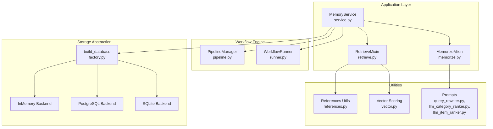
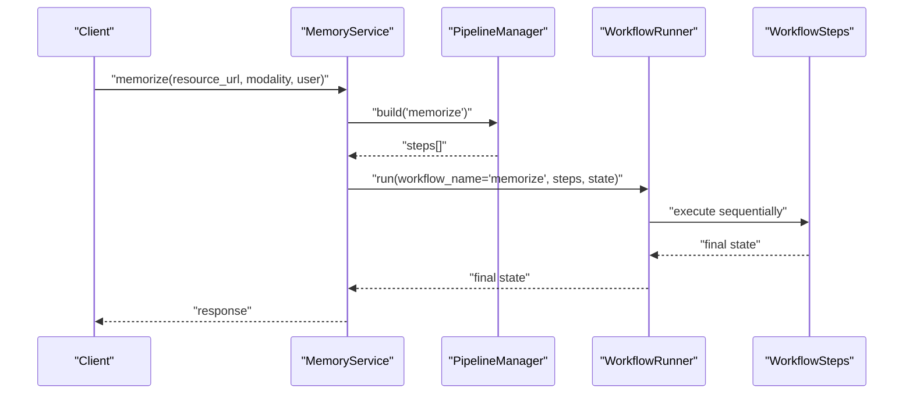
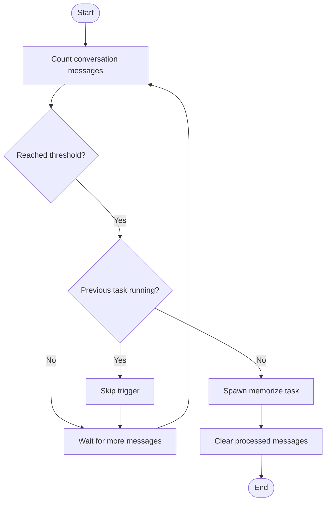
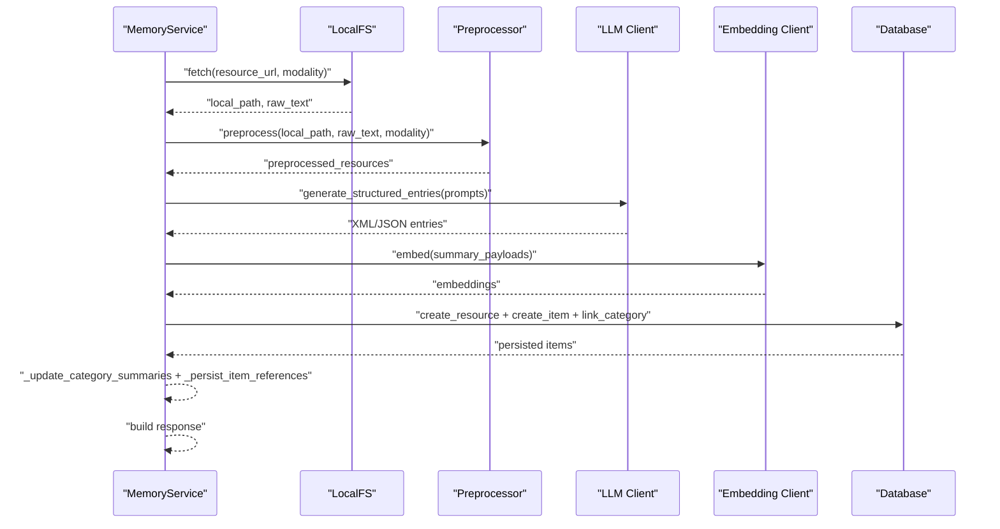
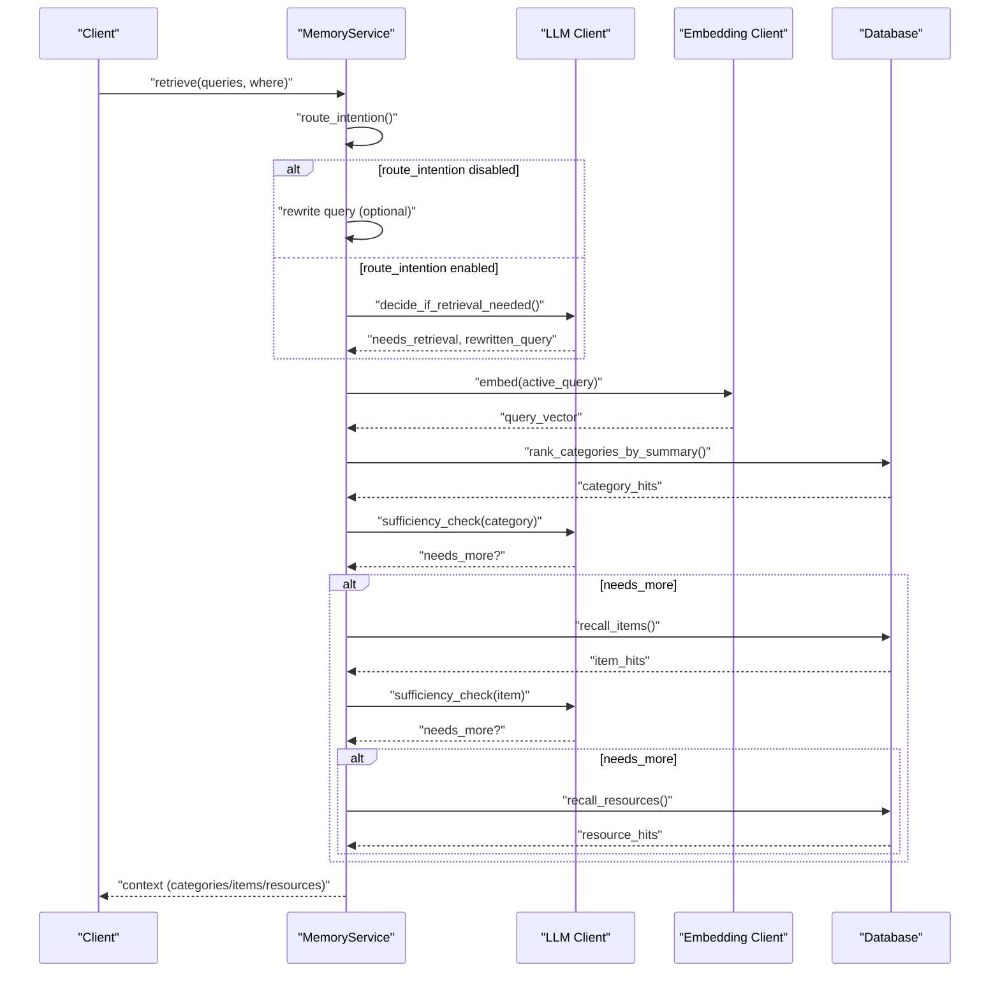
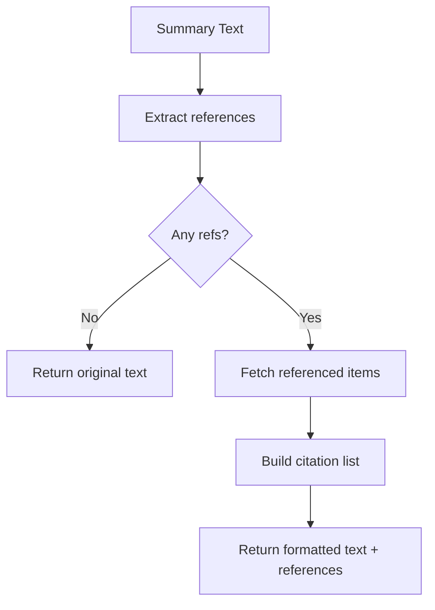
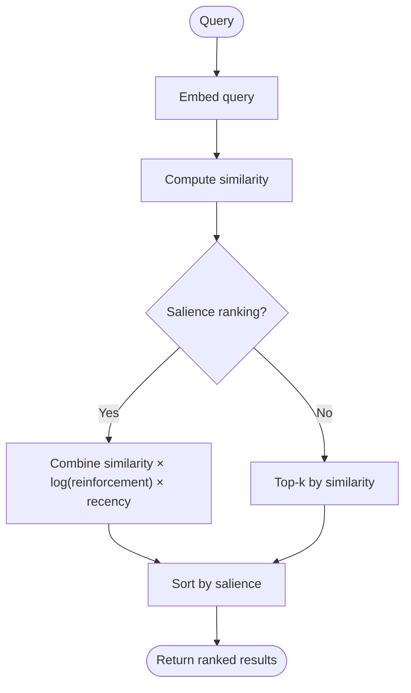
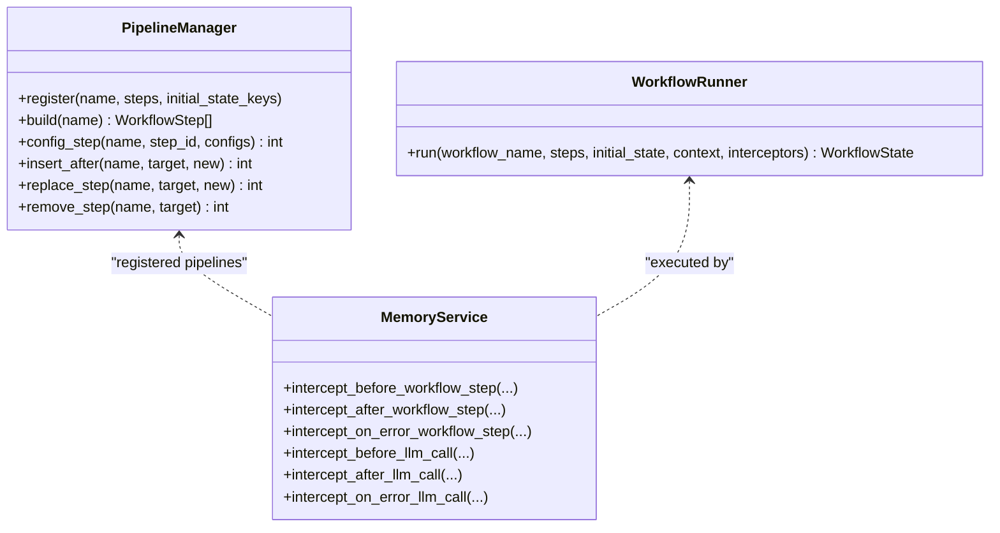
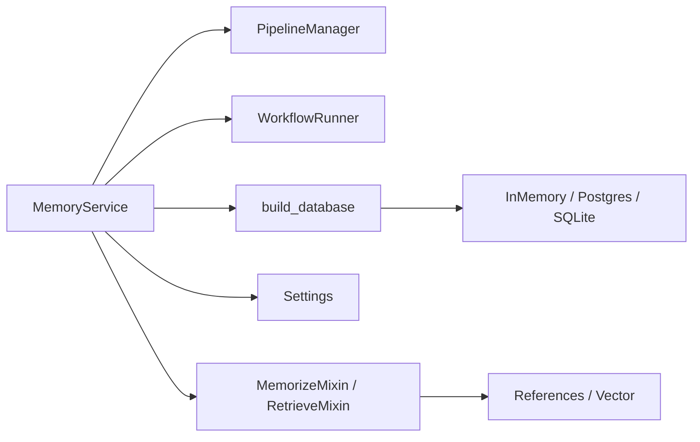

# Advanced Features

<cite>
**Referenced Files in This Document**
- [memorize.py](file://src/memu/app/memorize.py)
- [retrieve.py](file://src/memu/app/retrieve.py)
- [service.py](file://src/memu/app/service.py)
- [settings.py](file://src/memu/app/settings.py)
- [pipeline.py](file://src/memu/workflow/pipeline.py)
- [runner.py](file://src/memu/workflow/runner.py)
- [vector.py](file://src/memu/database/inmemory/vector.py)
- [references.py](file://src/memu/utils/references.py)
- [models.py](file://src/memu/database/models.py)
- [factory.py](file://src/memu/database/factory.py)
- [proactive.py](file://examples/proactive/proactive.py)
- [config.py](file://examples/proactive/memory/config.py)
- [query_rewriter.py](file://src/memu/prompts/retrieve/query_rewriter.py)
- [llm_category_ranker.py](file://src/memu/prompts/retrieve/llm_category_ranker.py)
- [llm_item_ranker.py](file://src/memu/prompts/retrieve/llm_item_ranker.py)
</cite>

## Table of Contents
1. [Introduction](#introduction)
2. [Project Structure](#project-structure)
3. [Core Components](#core-components)
4. [Architecture Overview](#architecture-overview)
5. [Detailed Component Analysis](#detailed-component-analysis)
6. [Dependency Analysis](#dependency-analysis)
7. [Performance Considerations](#performance-considerations)
8. [Troubleshooting Guide](#troubleshooting-guide)
9. [Conclusion](#conclusion)
10. [Appendices](#appendices)

## Introduction
This document explains memU’s advanced features designed for production-grade deployments. It focuses on:
- Proactive memory management and automated ingestion
- Cross-referencing and knowledge graph construction via item references
- Advanced retrieval with context prediction and iterative sufficiency checks
- Performance optimization strategies and scalability patterns
- Extension points, monitoring hooks, and operational hardening

It synthesizes the actual codebase to provide actionable guidance for implementing custom proactive behaviors, optimizing memory usage, and scaling enterprise systems.

## Project Structure
At a high level, memU is organized around:
- Application layer: Memory ingestion and retrieval orchestration
- Workflow engine: Pluggable pipelines and step-based execution
- Database abstraction: In-memory, SQLite, and PostgreSQL backends
- Utilities: References parsing, vector scoring, and prompts
- Examples: Proactive memory automation and configuration

**Diagram sources**
- [service.py](file://src/memu/app/service.py#L49-L349)
- [memorize.py](file://src/memu/app/memorize.py#L47-L166)
- [retrieve.py](file://src/memu/app/retrieve.py#L27-L226)
- [pipeline.py](file://src/memu/workflow/pipeline.py#L21-L171)
- [runner.py](file://src/memu/workflow/runner.py#L12-L82)
- [factory.py](file://src/memu/database/factory.py#L15-L44)
- [references.py](file://src/memu/utils/references.py#L20-L173)
- [vector.py](file://src/memu/database/inmemory/vector.py#L56-L138)
- [query_rewriter.py](file://src/memu/prompts/retrieve/query_rewriter.py#L1-L45)
- [llm_category_ranker.py](file://src/memu/prompts/retrieve/llm_category_ranker.py#L1-L36)
- [llm_item_ranker.py](file://src/memu/prompts/retrieve/llm_item_ranker.py#L1-L41)

**Section sources**
- [service.py](file://src/memu/app/service.py#L49-L349)
- [pipeline.py](file://src/memu/workflow/pipeline.py#L21-L171)
- [runner.py](file://src/memu/workflow/runner.py#L12-L82)
- [factory.py](file://src/memu/database/factory.py#L15-L44)

## Core Components
- MemoryService orchestrates memory ingestion and retrieval, manages LLM clients, and wires pipelines.
- MemorizeMixin defines the end-to-end memory ingestion workflow with multimodal preprocessing, structured extraction, categorization, persistence, and response assembly.
- RetrieveMixin implements two retrieval strategies (RAG and LLM-driven) with iterative sufficiency checks, category/item/resource recall, and context building.
- PipelineManager and WorkflowRunner provide extensibility for customizing step ordering, adding steps, and replacing handlers.
- Vector utilities implement cosine similarity and salience-aware scoring for retrieval ranking.
- References utilities enable cross-item citations and downstream retrieval of referenced items.

**Section sources**
- [service.py](file://src/memu/app/service.py#L49-L349)
- [memorize.py](file://src/memu/app/memorize.py#L47-L325)
- [retrieve.py](file://src/memu/app/retrieve.py#L27-L723)
- [pipeline.py](file://src/memu/workflow/pipeline.py#L21-L171)
- [runner.py](file://src/memu/workflow/runner.py#L12-L82)
- [vector.py](file://src/memu/database/inmemory/vector.py#L56-L138)
- [references.py](file://src/memu/utils/references.py#L20-L173)

## Architecture Overview
The system separates concerns across ingestion and retrieval, with a pluggable workflow engine and configurable LLM profiles. Storage backends are abstracted behind a factory.

**Diagram sources**
- [service.py](file://src/memu/app/service.py#L350-L361)
- [pipeline.py](file://src/memu/workflow/pipeline.py#L47-L49)
- [runner.py](file://src/memu/workflow/runner.py#L28-L39)

## Detailed Component Analysis

### Proactive Memory Management
Proactive memory management continuously monitors conversation streams and triggers ingestion when thresholds are met. It avoids overlapping tasks and ensures completion before shutdown.

**Diagram sources**
- [proactive.py](file://examples/proactive/proactive.py#L97-L123)

Implementation highlights:
- Background task scheduling and lifecycle management
- Threshold-based triggering and concurrency guard
- Graceful shutdown with pending task completion

**Section sources**
- [proactive.py](file://examples/proactive/proactive.py#L20-L123)

### Automated Memory Organization and Categorization
The ingestion pipeline transforms raw resources into structured memories, assigns categories, persists embeddings, and optionally builds cross-references in category summaries.

**Diagram sources**
- [memorize.py](file://src/memu/app/memorize.py#L97-L166)
- [memorize.py](file://src/memu/app/memorize.py#L181-L325)

Key behaviors:
- Multimodal preprocessing with modality-specific dispatch
- Structured extraction via LLM prompts and XML parsing
- Embedding generation and persistence
- Category initialization and mapping
- Optional item reference tracking in summaries

**Section sources**
- [memorize.py](file://src/memu/app/memorize.py#L97-L325)

### Advanced Retrieval with Context Prediction and Iterative Sufficiency
Retrieval supports two modes:
- RAG mode: embedding-based vector search with iterative sufficiency checks
- LLM mode: LLM ranks categories/items/resources with explicit prompts

**Diagram sources**
- [retrieve.py](file://src/memu/app/retrieve.py#L106-L226)
- [retrieve.py](file://src/memu/app/retrieve.py#L228-L452)
- [retrieve.py](file://src/memu/app/retrieve.py#L454-L723)

Advanced features:
- Query rewriting to disambiguate pronouns and implicit references
- Iterative sufficiency checks after each tier
- Salience-aware ranking for items (reinforcement count and recency)
- Reference-aware item recall from category summaries

**Section sources**
- [retrieve.py](file://src/memu/app/retrieve.py#L106-L723)
- [query_rewriter.py](file://src/memu/prompts/retrieve/query_rewriter.py#L1-L45)
- [llm_category_ranker.py](file://src/memu/prompts/retrieve/llm_category_ranker.py#L1-L36)
- [llm_item_ranker.py](file://src/memu/prompts/retrieve/llm_item_ranker.py#L1-L41)

### Cross-Referencing and Knowledge Graph Building
memU supports inline item references in category summaries (e.g., [ref:ITEM_ID]). These references can be:
- Extracted from text for downstream use
- Stripped for clean presentation
- Converted to numbered citations
- Used to fetch referenced items for retrieval

**Diagram sources**
- [references.py](file://src/memu/utils/references.py#L20-L173)
- [retrieve.py](file://src/memu/app/retrieve.py#L324-L344)

Operational impact:
- Enables knowledge graph edges from category summaries to memory items
- Supports reference-aware retrieval to expand context dynamically

**Section sources**
- [references.py](file://src/memu/utils/references.py#L20-L173)
- [retrieve.py](file://src/memu/app/retrieve.py#L324-L344)

### Performance Optimization Strategies
- Vector search optimization:
  - Use vectorized cosine similarity and argpartition for top-k selection
  - Salience-aware scoring combines similarity, reinforcement, and recency
- Batch embedding:
  - Configure embedding batch sizes per profile
- Asynchronous execution:
  - Workflow steps run concurrently where possible; use interceptors for observability
- Caching and lazy initialization:
  - LLM clients are cached per profile and initialized lazily

**Diagram sources**
- [vector.py](file://src/memu/database/inmemory/vector.py#L56-L138)

**Section sources**
- [vector.py](file://src/memu/database/inmemory/vector.py#L56-L138)
- [service.py](file://src/memu/app/service.py#L97-L151)

### Extension Points and Customization
- LLM profiles:
  - Define multiple named profiles for chat/embedding and switch per step
- Step customization:
  - Insert, replace, or remove steps in pipelines
  - Configure step-level profiles and capabilities
- Interceptors:
  - Hook before/after workflow steps and LLM calls for metrics, retries, and tracing
- Storage backends:
  - Choose in-memory, SQLite, or PostgreSQL/pgvector via factory

**Diagram sources**
- [pipeline.py](file://src/memu/workflow/pipeline.py#L21-L171)
- [runner.py](file://src/memu/workflow/runner.py#L12-L82)
- [service.py](file://src/memu/app/service.py#L258-L296)

**Section sources**
- [settings.py](file://src/memu/app/settings.py#L263-L297)
- [pipeline.py](file://src/memu/workflow/pipeline.py#L21-L171)
- [runner.py](file://src/memu/workflow/runner.py#L12-L82)
- [service.py](file://src/memu/app/service.py#L258-L296)

### Advanced Retrieval Features and Context Prediction
- Route intention: Decide whether retrieval is needed and rewrite the query
- Tiered recall: Categories → Items → Resources
- Sufficiency checks: After each tier, determine if more retrieval is needed
- LLM-driven ranking: Explicit prompts for category and item ranking
- Salience-aware ranking: Weight by reinforcement count and recency decay

**Section sources**
- [retrieve.py](file://src/memu/app/retrieve.py#L228-L452)
- [retrieve.py](file://src/memu/app/retrieve.py#L454-L723)
- [vector.py](file://src/memu/database/inmemory/vector.py#L16-L53)

### Automated Memory Organization Details
- Structured extraction prompts per memory type
- Category initialization with embeddings
- Deduplication via content hashing
- Optional item reinforcement tracking

**Section sources**
- [memorize.py](file://src/memu/app/memorize.py#L424-L554)
- [memorize.py](file://src/memu/app/memorize.py#L648-L687)
- [models.py](file://src/memu/database/models.py#L15-L33)

### Production Hardening and Monitoring
- Interceptors for LLM calls and workflow steps enable:
  - Metrics collection
  - Retry policies
  - Request tracing
- Pipeline revision tracking helps detect configuration drift
- User scope filtering via validated models

**Section sources**
- [service.py](file://src/memu/app/service.py#L228-L296)
- [pipeline.py](file://src/memu/workflow/pipeline.py#L166-L171)

## Dependency Analysis
The system exhibits low coupling between components, with clear separation of concerns:
- MemoryService depends on pipelines, runners, database factory, and LLM clients
- Retrieval and memorize mixins encapsulate domain logic
- Utilities are standalone and reusable

**Diagram sources**
- [service.py](file://src/memu/app/service.py#L49-L349)
- [factory.py](file://src/memu/database/factory.py#L15-L44)
- [settings.py](file://src/memu/app/settings.py#L175-L322)

**Section sources**
- [service.py](file://src/memu/app/service.py#L49-L349)
- [factory.py](file://src/memu/database/factory.py#L15-L44)
- [settings.py](file://src/memu/app/settings.py#L175-L322)

## Performance Considerations
- Prefer RAG mode for large corpora; LLM mode reduces latency but may be less precise
- Tune top_k per stage to balance recall and latency
- Enable salience ranking for dynamic relevance; adjust recency_decay_days for domain needs
- Use embedding batch sizes appropriate for provider limits
- Monitor LLM latency and throughput via interceptors

[No sources needed since this section provides general guidance]

## Troubleshooting Guide
Common issues and remedies:
- Unknown LLM profile or capability:
  - Ensure profile names exist and capabilities match pipeline availability
- Missing state keys:
  - Verify previous steps produce required keys or set initial_state_keys
- Retrieval returns empty:
  - Check route_intention and sufficiency_check configurations
  - Confirm embeddings exist for query and corpus
- Reference parsing errors:
  - Validate [ref:ID] syntax and ensure referenced items exist

**Section sources**
- [pipeline.py](file://src/memu/workflow/pipeline.py#L131-L165)
- [retrieve.py](file://src/memu/app/retrieve.py#L228-L258)

## Conclusion
memU’s advanced features combine proactive ingestion, robust retrieval with iterative sufficiency, and cross-referencing to form a scalable, extensible memory system. By leveraging configurable LLM profiles, pluggable pipelines, and salience-aware ranking, teams can tailor memory behavior to production workloads while maintaining observability and reliability.

[No sources needed since this section summarizes without analyzing specific files]

## Appendices

### Advanced Configuration Options
- LLM profiles: chat_model, embed_model, provider, endpoint_overrides
- Retrieval:
  - method: rag or llm
  - route_intention, sufficiency_check
  - category/item/resource top_k
  - item ranking strategy and recency decay
- Memory:
  - memory_types, memory_type_prompts
  - enable_item_references, enable_item_reinforcement
  - memory_categories with custom prompts

**Section sources**
- [settings.py](file://src/memu/app/settings.py#L102-L322)

### Example: Implementing Custom Proactive Behaviors
- Use MemoryService interceptors to monitor conversation length and trigger memorize
- Schedule background tasks with concurrency guards
- Clear processed messages after successful ingestion

**Section sources**
- [proactive.py](file://examples/proactive/proactive.py#L20-L123)
- [service.py](file://src/memu/app/service.py#L258-L296)

### Example: Optimizing Memory Usage
- Adjust embedding batch size per profile
- Use salience ranking to reduce irrelevant results
- Persist references selectively to minimize summary size

**Section sources**
- [settings.py](file://src/memu/app/settings.py#L119-L126)
- [vector.py](file://src/memu/database/inmemory/vector.py#L94-L127)

### Example: Scaling for Enterprise Deployments
- Choose PostgreSQL with pgvector for persistent, scalable storage
- Register custom WorkflowRunner backends (e.g., distributed executors)
- Use interceptors for centralized telemetry and retry logic

**Section sources**
- [factory.py](file://src/memu/database/factory.py#L15-L44)
- [runner.py](file://src/memu/workflow/runner.py#L52-L81)
- [service.py](file://src/memu/app/service.py#L228-L296)