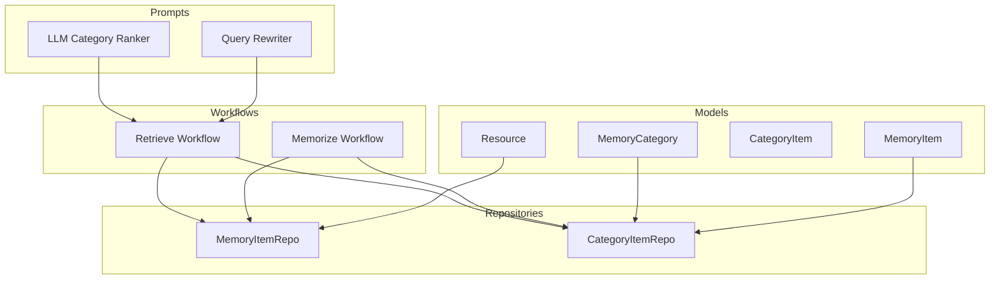
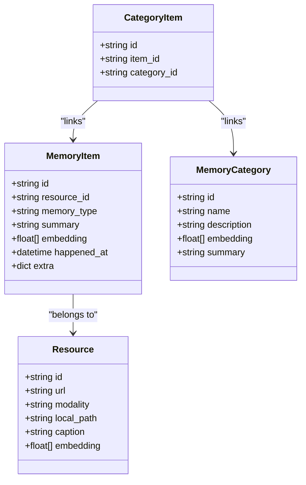
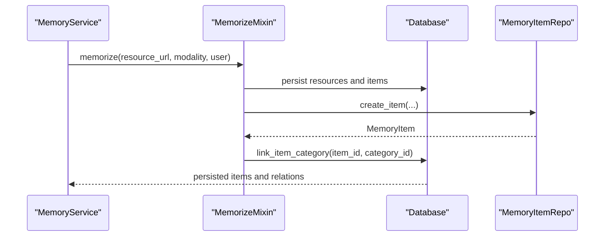
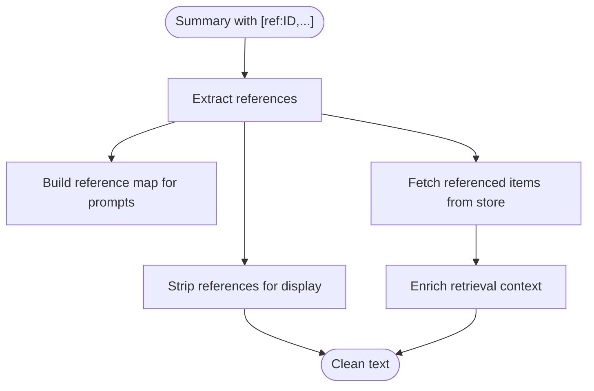
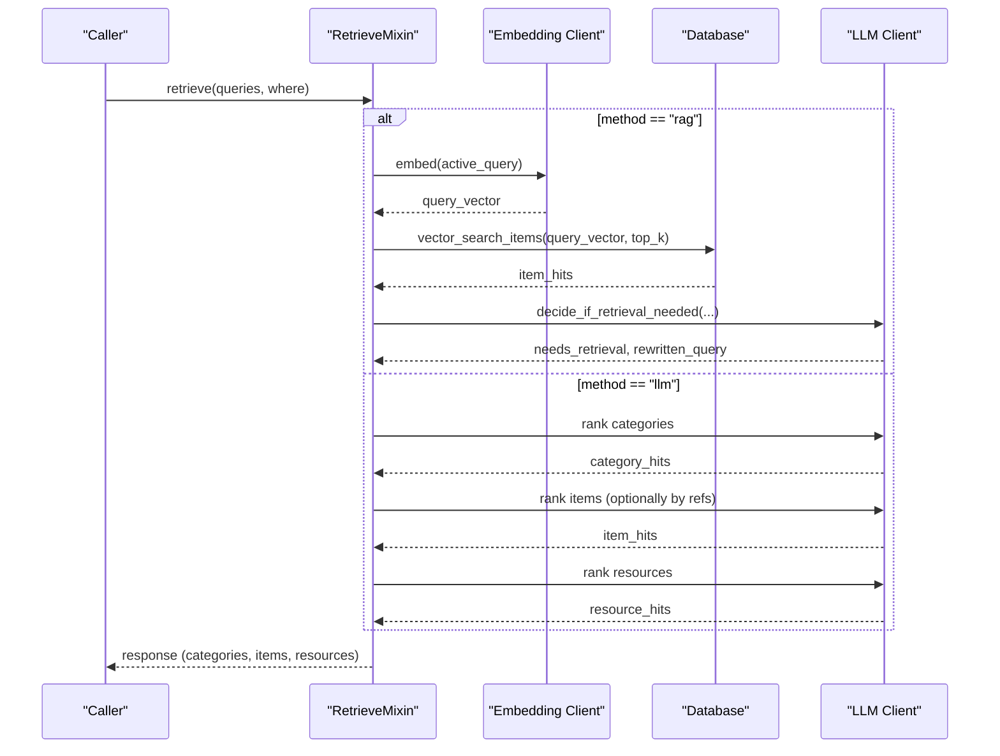
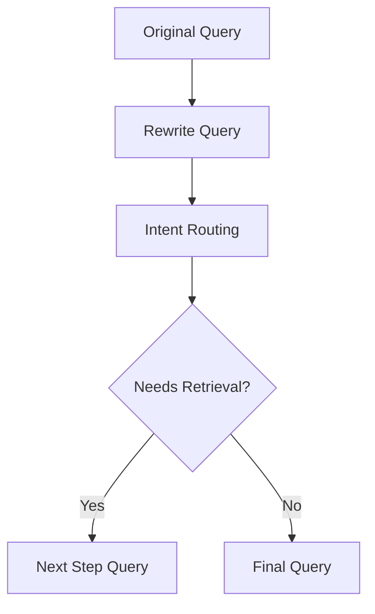
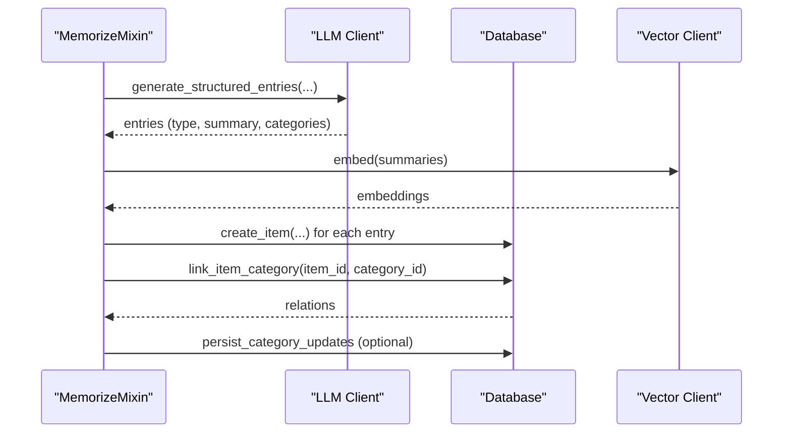
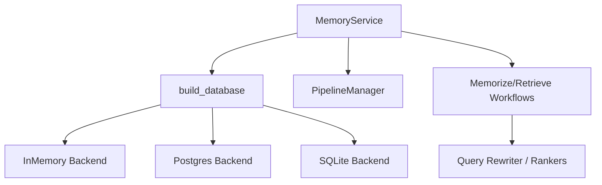

# Cross-referencing and Knowledge Graph

<cite>
**Referenced Files in This Document**
- [models.py](file://src/memu/database/models.py)
- [interfaces.py](file://src/memu/database/interfaces.py)
- [factory.py](file://src/memu/database/factory.py)
- [memory_item.py](file://src/memu/database/repositories/memory_item.py)
- [category_item.py](file://src/memu/database/repositories/category_item.py)
- [memory_item_repo.py](file://src/memu/database/inmemory/repositories/memory_item_repo.py)
- [category_item_repo.py](file://src/memu/database/inmemory/repositories/category_item_repo.py)
- [references.py](file://src/memu/utils/references.py)
- [conversation.py](file://src/memu/utils/conversation.py)
- [service.py](file://src/memu/app/service.py)
- [memorize.py](file://src/memu/app/memorize.py)
- [retrieve.py](file://src/memu/app/retrieve.py)
- [pipeline.py](file://src/memu/workflow/pipeline.py)
- [query_rewriter.py](file://src/memu/prompts/retrieve/query_rewriter.py)
- [llm_category_ranker.py](file://src/memu/prompts/retrieve/llm_category_ranker.py)
</cite>

## Table of Contents
1. [Introduction](#introduction)
2. [Project Structure](#project-structure)
3. [Core Components](#core-components)
4. [Architecture Overview](#architecture-overview)
5. [Detailed Component Analysis](#detailed-component-analysis)
6. [Dependency Analysis](#dependency-analysis)
7. [Performance Considerations](#performance-considerations)
8. [Troubleshooting Guide](#troubleshooting-guide)
9. [Conclusion](#conclusion)
10. [Appendices](#appendices)

## Introduction
This document explains memU’s cross-referencing and knowledge graph capabilities with a focus on intelligent relationship discovery and semantic linking. It covers:
- Knowledge graph architecture: categories, items, and item-to-category relations
- Reference extraction and semantic association mechanisms
- Relationship scoring and ranking during retrieval
- Automated knowledge discovery via memory categorization and reference propagation
- Practical guidance for extending the system with custom extractors, relationship types, and advanced querying

## Project Structure
The knowledge graph spans data models, repositories, workflows, prompts, and utilities:
- Data models define MemoryItem, MemoryCategory, CategoryItem, and Resource
- Repositories encapsulate persistence and retrieval for items, categories, and relations
- Workflows orchestrate memory ingestion, categorization, and retrieval
- Prompts guide LLM-based ranking and query rewriting
- Utilities implement reference parsing and conversation normalization

**Diagram sources**
- [models.py](file://src/memu/database/models.py#L76-L106)
- [memory_item.py](file://src/memu/database/repositories/memory_item.py#L9-L54)
- [category_item.py](file://src/memu/database/repositories/category_item.py#L9-L23)
- [memorize.py](file://src/memu/app/memorize.py#L97-L166)
- [retrieve.py](file://src/memu/app/retrieve.py#L106-L210)
- [query_rewriter.py](file://src/memu/prompts/retrieve/query_rewriter.py#L1-L45)
- [llm_category_ranker.py](file://src/memu/prompts/retrieve/llm_category_ranker.py#L1-L36)

**Section sources**
- [models.py](file://src/memu/database/models.py#L15-L149)
- [interfaces.py](file://src/memu/database/interfaces.py#L12-L35)
- [factory.py](file://src/memu/database/factory.py#L15-L43)

## Core Components
- MemoryItem: Represents a memory entry with type, summary, embedding, and extra fields (including content hashing and reinforcement tracking)
- MemoryCategory: Represents a semantic category with optional summary and embedding
- CategoryItem: Links items to categories (many-to-many via relations)
- Resource: Stores media/text resources with optional captions and embeddings
- Reference utilities: Extract, strip, and format references; fetch referenced items
- Retrieval workflows: RAG-style and LLM-only pipelines with routing, ranking, and sufficiency checks
- Workflow pipeline manager: Registers, mutates, and validates pipeline steps

Key implementation references:
- [MemoryItem](file://src/memu/database/models.py#L76-L94)
- [MemoryCategory](file://src/memu/database/models.py#L96-L101)
- [CategoryItem](file://src/memu/database/models.py#L103-L106)
- [Reference extraction](file://src/memu/utils/references.py#L20-L49)
- [Reference stripping and formatting](file://src/memu/utils/references.py#L52-L116)
- [Fetch referenced items](file://src/memu/utils/references.py#L118-L146)
- [RAG retrieval pipeline](file://src/memu/app/retrieve.py#L106-L210)
- [LLM retrieval pipeline](file://src/memu/app/retrieve.py#L454-L536)

**Section sources**
- [models.py](file://src/memu/database/models.py#L76-L106)
- [references.py](file://src/memu/utils/references.py#L20-L146)
- [retrieve.py](file://src/memu/app/retrieve.py#L106-L210)

## Architecture Overview
The knowledge graph is built around three primary entities and their relationships:
- Items represent facts/knowledge extracted from resources
- Categories group items by semantic themes
- Relations connect items to categories

Cross-referencing is achieved through inline citations in category summaries that link to specific items. During retrieval, these references are extracted and used to enrich downstream ranking and context construction.

**Diagram sources**
- [models.py](file://src/memu/database/models.py#L68-L106)

**Section sources**
- [models.py](file://src/memu/database/models.py#L68-L106)

## Detailed Component Analysis

### Knowledge Graph Schema and Relationships
- Item-to-Category relations are stored in CategoryItem and exposed via CategoryItemRepo
- MemoryItemRepo supports vector search, filtering, and reference-based queries
- In-memory repositories demonstrate deduplication via content hashing and reinforcement counters

**Diagram sources**
- [service.py](file://src/memu/app/service.py#L49-L95)
- [memorize.py](file://src/memu/app/memorize.py#L578-L623)
- [memory_item.py](file://src/memu/database/repositories/memory_item.py#L21-L31)
- [category_item.py](file://src/memu/database/repositories/category_item.py#L17-L18)

**Section sources**
- [memory_item_repo.py](file://src/memu/database/inmemory/repositories/memory_item_repo.py#L79-L167)
- [category_item_repo.py](file://src/memu/database/inmemory/repositories/category_item_repo.py#L24-L31)

### Reference Extraction and Semantic Linking
- References are embedded as [ref:ITEM_ID] in category summaries
- Extraction identifies unique item IDs; stripping removes references for clean display
- Numbered citations can be generated with a reference list appended
- Referenced items are fetched from the store for context enrichment

**Diagram sources**
- [references.py](file://src/memu/utils/references.py#L20-L146)

**Section sources**
- [references.py](file://src/memu/utils/references.py#L20-L146)

### Retrieval Pipelines and Relationship Scoring
Two retrieval modes coexist:
- RAG-style: Embeddings drive category/item recall; sufficiency checks decide continuation
- LLM-only: LLM ranks categories/items/resources; optional reference-driven item recall

**Diagram sources**
- [retrieve.py](file://src/memu/app/retrieve.py#L42-L85)
- [retrieve.py](file://src/memu/app/retrieve.py#L106-L210)
- [retrieve.py](file://src/memu/app/retrieve.py#L454-L536)

**Section sources**
- [retrieve.py](file://src/memu/app/retrieve.py#L106-L210)
- [retrieve.py](file://src/memu/app/retrieve.py#L454-L536)

### Query Rewriting and Intent Routing
- Query rewriting improves self-containment by resolving pronouns and referential expressions using conversation history
- Intent routing decides whether retrieval is needed and computes a rewritten query for subsequent steps

**Diagram sources**
- [query_rewriter.py](file://src/memu/prompts/retrieve/query_rewriter.py#L1-L45)
- [retrieve.py](file://src/memu/app/retrieve.py#L228-L258)

**Section sources**
- [query_rewriter.py](file://src/memu/prompts/retrieve/query_rewriter.py#L1-L45)
- [retrieve.py](file://src/memu/app/retrieve.py#L228-L258)

### Automated Knowledge Discovery and Categorization
- Memory ingestion extracts structured entries from multimodal resources
- Items are embedded and persisted; categories are linked based on extracted category names
- Category summaries are updated and can include references to items, enabling downstream semantic linking

**Diagram sources**
- [memorize.py](file://src/memu/app/memorize.py#L424-L534)
- [memorize.py](file://src/memu/app/memorize.py#L578-L623)
- [memorize.py](file://src/memu/app/memorize.py#L283-L297)

**Section sources**
- [memorize.py](file://src/memu/app/memorize.py#L424-L534)
- [memorize.py](file://src/memu/app/memorize.py#L578-L623)
- [memorize.py](file://src/memu/app/memorize.py#L283-L297)

### Custom Reference Extractors and Relationship Types
- Implement a custom extractor by providing a function that accepts text and returns a list of item IDs
- Integrate extraction into prompts or workflows to populate reference maps and enrich context
- Extend relationship types by adding new fields to MemoryItem.extra and updating categorization prompts to capture richer semantics

Guidance references:
- [Reference extraction API](file://src/memu/utils/references.py#L20-L49)
- [Reference map builder](file://src/memu/utils/references.py#L149-L172)
- [Category summary prompt integration](file://src/memu/app/memorize.py#L424-L534)

**Section sources**
- [references.py](file://src/memu/utils/references.py#L20-L49)
- [references.py](file://src/memu/utils/references.py#L149-L172)
- [memorize.py](file://src/memu/app/memorize.py#L424-L534)

### Optimizing Knowledge Graph Queries
- Vector search supports similarity and salience-based ranking; salience considers reinforcement counts and recency decay
- Deduplication via content hashing reduces redundant items within user scope
- Use where filters to constrain retrieval to specific user scopes and reduce corpus size

References:
- [Salience-aware vector search](file://src/memu/database/inmemory/repositories/memory_item_repo.py#L169-L196)
- [Content hash deduplication](file://src/memu/database/inmemory/repositories/memory_item_repo.py#L122-L167)
- [Where filter normalization](file://src/memu/app/retrieve.py#L87-L104)

**Section sources**
- [memory_item_repo.py](file://src/memu/database/inmemory/repositories/memory_item_repo.py#L169-L196)
- [memory_item_repo.py](file://src/memu/database/inmemory/repositories/memory_item_repo.py#L122-L167)
- [retrieve.py](file://src/memu/app/retrieve.py#L87-L104)

### Extending with Custom Relationship Types and Advanced Querying
- Add new relationship semantics by extending MemoryItem.extra and updating prompts to capture attributes (e.g., causality, temporal order)
- Implement advanced querying by composing filters (e.g., memory_type, time windows) and leveraging reference-based item recall
- Use conversation preprocessing utilities to normalize inputs for robust extraction

References:
- [Extra fields in MemoryItem](file://src/memu/database/models.py#L82-L94)
- [Conversation preprocessing](file://src/memu/utils/conversation.py#L7-L90)
- [LLM-based item recall with references](file://src/memu/app/retrieve.py#L615-L657)

**Section sources**
- [models.py](file://src/memu/database/models.py#L82-L94)
- [conversation.py](file://src/memu/utils/conversation.py#L7-L90)
- [retrieve.py](file://src/memu/app/retrieve.py#L615-L657)

## Dependency Analysis
The system exhibits clear separation of concerns:
- Database abstraction via the Database protocol
- Backend selection through a factory
- Workflow orchestration decoupled from storage
- Prompt-driven ranking and query rewriting

**Diagram sources**
- [factory.py](file://src/memu/database/factory.py#L15-L43)
- [service.py](file://src/memu/app/service.py#L77-L95)
- [pipeline.py](file://src/memu/workflow/pipeline.py#L21-L49)

**Section sources**
- [factory.py](file://src/memu/database/factory.py#L15-L43)
- [interfaces.py](file://src/memu/database/interfaces.py#L12-L35)
- [pipeline.py](file://src/memu/workflow/pipeline.py#L21-L49)

## Performance Considerations
- Prefer salience-aware ranking for higher-quality recall when reinforcement signals are meaningful
- Limit retrieval pools using where filters to reduce embedding computations
- Batch embedding calls and reuse vectors where possible
- Use reference-based item recall to narrow down candidate sets before ranking

[No sources needed since this section provides general guidance]

## Troubleshooting Guide
Common issues and remedies:
- Unknown filter fields: Ensure where filters align with the user scope model fields
- Missing step dependencies in pipelines: Verify that required state keys are produced by earlier steps
- Unsupported database provider: Confirm provider is supported by the factory
- Reference extraction yields no results: Validate that category summaries include proper [ref:ID] markers

References:
- [Where filter validation](file://src/memu/app/retrieve.py#L87-L104)
- [Pipeline step validation](file://src/memu/workflow/pipeline.py#L131-L165)
- [Database provider selection](file://src/memu/database/factory.py#L28-L43)
- [Reference extraction](file://src/memu/utils/references.py#L20-L49)

**Section sources**
- [retrieve.py](file://src/memu/app/retrieve.py#L87-L104)
- [pipeline.py](file://src/memu/workflow/pipeline.py#L131-L165)
- [factory.py](file://src/memu/database/factory.py#L28-L43)
- [references.py](file://src/memu/utils/references.py#L20-L49)

## Conclusion
memU’s knowledge graph integrates structured memory items with semantic categories and cross-references to enable intelligent relationship discovery and semantic linking. Through modular workflows, prompt-driven ranking, and robust reference handling, the system supports scalable, user-scoped knowledge management. Extensibility is achieved via custom extractors, relationship types, and advanced querying strategies.

[No sources needed since this section summarizes without analyzing specific files]

## Appendices
- Example prompts for category ranking and query rewriting are available for customization
- Conversation preprocessing utilities help normalize inputs for robust extraction

**Section sources**
- [llm_category_ranker.py](file://src/memu/prompts/retrieve/llm_category_ranker.py#L1-L36)
- [query_rewriter.py](file://src/memu/prompts/retrieve/query_rewriter.py#L1-L45)
- [conversation.py](file://src/memu/utils/conversation.py#L7-L90)