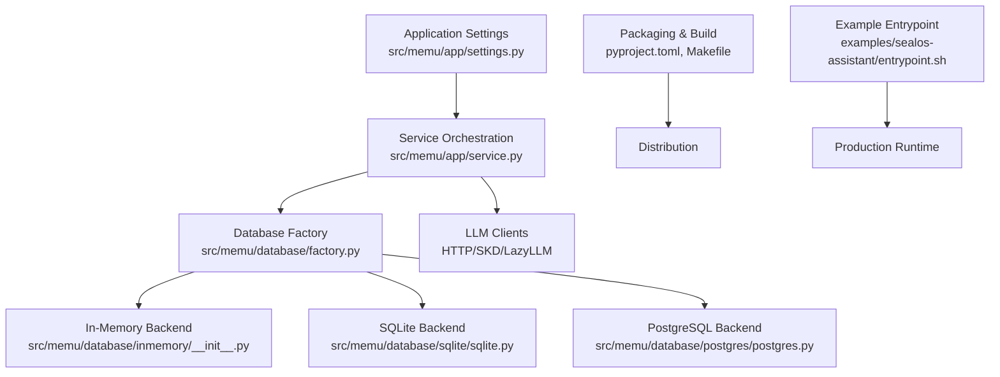
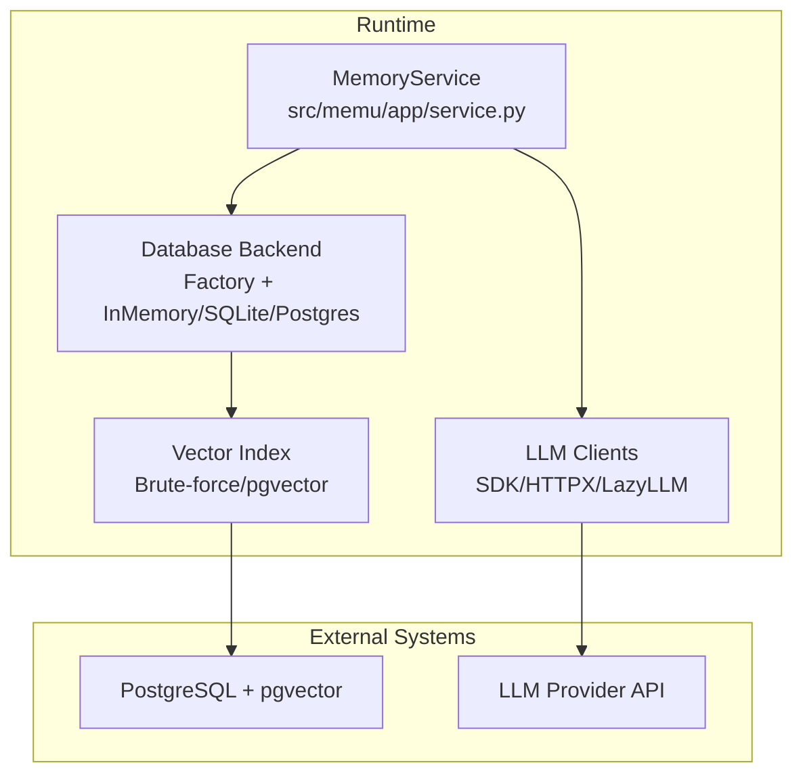
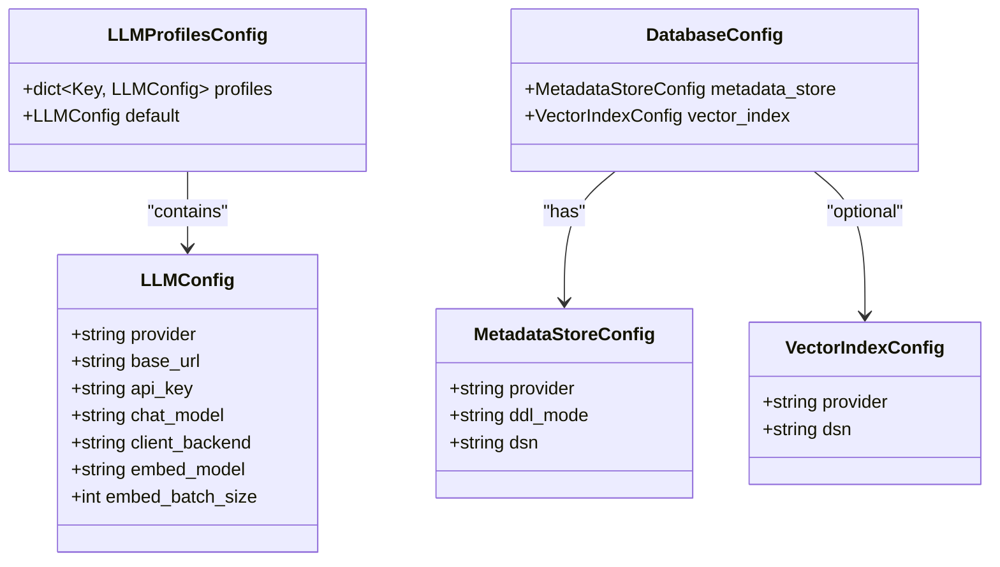
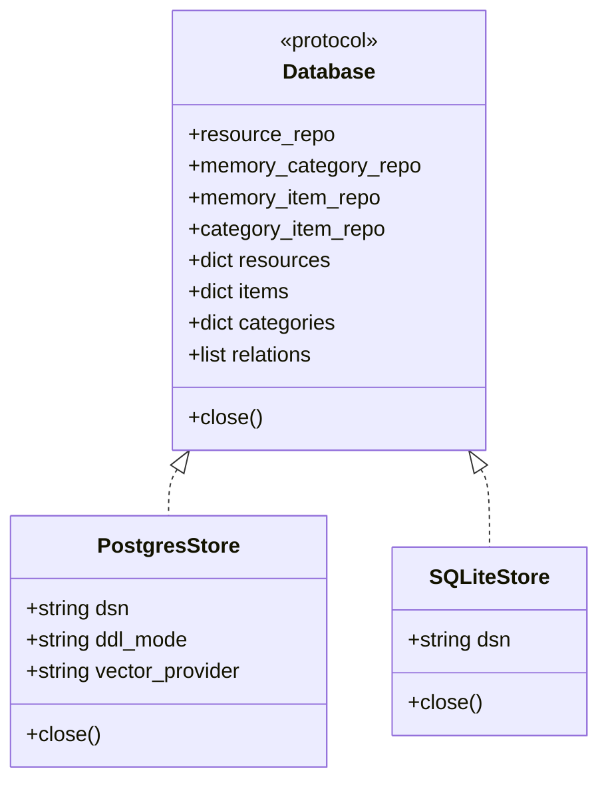
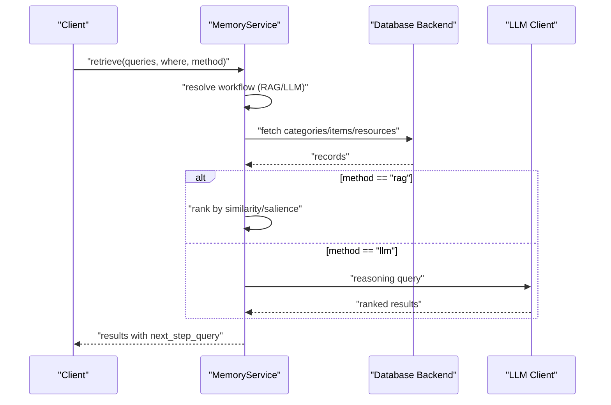
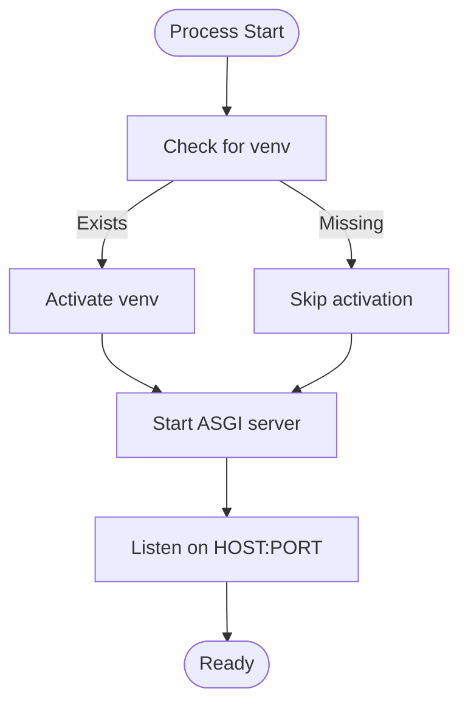
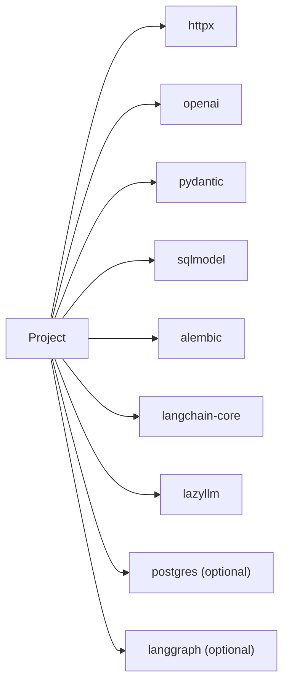

# Enterprise Deployment and Production Hardening

<cite>
**Referenced Files in This Document**
- [README.md](file://README.md)
- [pyproject.toml](file://pyproject.toml)
- [Makefile](file://Makefile)
- [src/memu/app/settings.py](file://src/memu/app/settings.py)
- [src/memu/app/service.py](file://src/memu/app/service.py)
- [src/memu/database/factory.py](file://src/memu/database/factory.py)
- [src/memu/database/interfaces.py](file://src/memu/database/interfaces.py)
- [src/memu/database/models.py](file://src/memu/database/models.py)
- [src/memu/database/postgres/postgres.py](file://src/memu/database/postgres/postgres.py)
- [src/memu/database/sqlite/sqlite.py](file://src/memu/database/sqlite/sqlite.py)
- [src/memu/database/inmemory/__init__.py](file://src/memu/database/inmemory/__init__.py)
- [docs/providers/grok.md](file://docs/providers/grok.md)
- [docs/integrations/grok.md](file://docs/integrations/grok.md)
- [examples/sealos-assistant/entrypoint.sh](file://examples/sealos-assistant/entrypoint.sh)
- [docs/sealos-devbox-guide.md](file://docs/sealos-devbox-guide.md)
- [examples/resources/logs/log1.txt](file://examples/resources/logs/log1.txt)
</cite>

## Table of Contents
1. [Introduction](#introduction)
2. [Project Structure](#project-structure)
3. [Core Components](#core-components)
4. [Architecture Overview](#architecture-overview)
5. [Detailed Component Analysis](#detailed-component-analysis)
6. [Dependency Analysis](#dependency-analysis)
7. [Performance Considerations](#performance-considerations)
8. [Troubleshooting Guide](#troubleshooting-guide)
9. [Conclusion](#conclusion)
10. [Appendices](#appendices)

## Introduction
This document provides enterprise-grade deployment and production hardening guidance for memU. It focuses on deployment architectures, containerization strategies, infrastructure requirements, configuration management, environment variable handling, security hardening, monitoring and alerting, backup and recovery, CI/CD and gradual rollouts, and compliance considerations. The content is grounded in the repository’s code and documentation to ensure accurate, actionable guidance for production readiness.

## Project Structure
The repository is a Python package with a modular architecture supporting multiple database backends, pluggable LLM providers, and extensible configuration. Key areas for production deployment include:
- Application configuration and service orchestration
- Database abstraction and backends (in-memory, SQLite, PostgreSQL with optional vector index)
- LLM client backends and provider integrations
- Packaging and build tooling for distribution
- Example deployment artifacts and operational logs

**Diagram sources**
- [src/memu/app/settings.py](file://src/memu/app/settings.py#L1-L322)
- [src/memu/app/service.py](file://src/memu/app/service.py#L1-L427)
- [src/memu/database/factory.py](file://src/memu/database/factory.py#L1-L44)
- [src/memu/database/inmemory/__init__.py](file://src/memu/database/inmemory/__init__.py#L1-L26)
- [src/memu/database/sqlite/sqlite.py](file://src/memu/database/sqlite/sqlite.py#L1-L146)
- [src/memu/database/postgres/postgres.py](file://src/memu/database/postgres/postgres.py#L1-L109)
- [pyproject.toml](file://pyproject.toml#L1-L181)
- [Makefile](file://Makefile#L1-L23)
- [examples/sealos-assistant/entrypoint.sh](file://examples/sealos-assistant/entrypoint.sh#L1-L13)

**Section sources**
- [README.md](file://README.md#L276-L317)
- [pyproject.toml](file://pyproject.toml#L1-L181)
- [Makefile](file://Makefile#L1-L23)

## Core Components
- Configuration models define LLM profiles, database backends, retrieval and memorize behaviors, and user scoping. These are validated and normalized to ensure safe defaults and consistent behavior in production.
- The service orchestrator composes LLM clients, database backends, and workflow pipelines, enabling flexible deployment modes (in-memory for dev, SQLite for small-scale, PostgreSQL for production).
- Database factory selects the appropriate backend at runtime, with lazy imports to minimize overhead when unused backends are not required.
- LLM client backends include SDK, HTTPX, and LazyLLM variants, supporting multiple providers and custom endpoints.

**Section sources**
- [src/memu/app/settings.py](file://src/memu/app/settings.py#L102-L139)
- [src/memu/app/settings.py](file://src/memu/app/settings.py#L300-L322)
- [src/memu/app/service.py](file://src/memu/app/service.py#L49-L95)
- [src/memu/database/factory.py](file://src/memu/database/factory.py#L15-L44)

## Architecture Overview
The production architecture centers around a configurable service that integrates LLM providers, a pluggable database backend, and optional vector indexing. The system supports:
- Deployment modes: in-memory (development), SQLite (lightweight), PostgreSQL (enterprise)
- Retrieval strategies: RAG-based vector search and LLM-driven reasoning
- Extensible LLM backends and provider configurations
- Operational observability and graceful degradation

**Diagram sources**
- [src/memu/app/service.py](file://src/memu/app/service.py#L49-L95)
- [src/memu/database/factory.py](file://src/memu/database/factory.py#L15-L44)
- [src/memu/database/postgres/postgres.py](file://src/memu/database/postgres/postgres.py#L23-L103)
- [src/memu/database/sqlite/sqlite.py](file://src/memu/database/sqlite/sqlite.py#L25-L143)
- [src/memu/database/inmemory/__init__.py](file://src/memu/database/inmemory/__init__.py#L10-L22)

## Detailed Component Analysis

### Configuration Management and Environment Variables
- LLM configuration supports multiple profiles, provider selection, base URLs, models, and client backends. Defaults are applied for specific providers (e.g., Grok).
- Database configuration supports in-memory, SQLite, and PostgreSQL backends, with automatic vector index selection and DDL mode control.
- Environment variables are used to supply API keys and provider endpoints, enabling secure secret injection without baking secrets into code.

**Diagram sources**
- [src/memu/app/settings.py](file://src/memu/app/settings.py#L102-L139)
- [src/memu/app/settings.py](file://src/memu/app/settings.py#L263-L297)
- [src/memu/app/settings.py](file://src/memu/app/settings.py#L299-L322)

**Section sources**
- [src/memu/app/settings.py](file://src/memu/app/settings.py#L102-L139)
- [src/memu/app/settings.py](file://src/memu/app/settings.py#L263-L322)
- [docs/providers/grok.md](file://docs/providers/grok.md#L17-L31)
- [docs/integrations/grok.md](file://docs/integrations/grok.md#L14-L24)

### Database Backends and Vector Indexing
- In-memory backend: suitable for ephemeral or development deployments; no persistence.
- SQLite backend: file-based, lightweight, and portable; uses brute-force similarity for vector search.
- PostgreSQL backend: enterprise-grade with optional pgvector provider for efficient vector operations; migrations and session management are handled internally.

**Diagram sources**
- [src/memu/database/interfaces.py](file://src/memu/database/interfaces.py#L12-L27)
- [src/memu/database/postgres/postgres.py](file://src/memu/database/postgres/postgres.py#L23-L103)
- [src/memu/database/sqlite/sqlite.py](file://src/memu/database/sqlite/sqlite.py#L25-L143)

**Section sources**
- [src/memu/database/factory.py](file://src/memu/database/factory.py#L15-L44)
- [src/memu/database/postgres/postgres.py](file://src/memu/database/postgres/postgres.py#L23-L103)
- [src/memu/database/sqlite/sqlite.py](file://src/memu/database/sqlite/sqlite.py#L25-L143)
- [src/memu/database/inmemory/__init__.py](file://src/memu/database/inmemory/__init__.py#L10-L22)

### Retrieval and Memory Workflows
- Retrieval supports two strategies: RAG-based vector search and LLM-driven reasoning. Configuration controls top-K, routing, sufficiency checks, and ranking.
- Memory workflows integrate preprocessing, extraction, categorization, and cross-references, with optional reinforcement tracking and reference citations.

**Diagram sources**
- [src/memu/app/service.py](file://src/memu/app/service.py#L315-L348)
- [src/memu/app/settings.py](file://src/memu/app/settings.py#L175-L202)

**Section sources**
- [src/memu/app/settings.py](file://src/memu/app/settings.py#L175-L243)
- [src/memu/app/service.py](file://src/memu/app/service.py#L315-L348)

### Containerization and Runtime Entrypoints
- The example entrypoint demonstrates a standard production pattern: activate a virtual environment if present, then start the ASGI server with host/port from environment variables.
- The guide illustrates a typical FastAPI application exposing endpoints that delegate to the MemU service.

**Diagram sources**
- [examples/sealos-assistant/entrypoint.sh](file://examples/sealos-assistant/entrypoint.sh#L1-L13)
- [docs/sealos-devbox-guide.md](file://docs/sealos-devbox-guide.md#L361-L385)

**Section sources**
- [examples/sealos-assistant/entrypoint.sh](file://examples/sealos-assistant/entrypoint.sh#L1-L13)
- [docs/sealos-devbox-guide.md](file://docs/sealos-devbox-guide.md#L359-L385)

### Security Hardening Practices
- Prefer provider-specific environment variables for API keys (e.g., XAI_API_KEY, OPENROUTER_API_KEY) and avoid embedding secrets in code.
- Use HTTPS base URLs and validate provider defaults; override only when necessary.
- Restrict client backends to trusted providers and monitor LLM usage via interceptors and metadata tagging.
- Apply least privilege for database credentials and restrict network egress to provider endpoints.

**Section sources**
- [docs/providers/grok.md](file://docs/providers/grok.md#L17-L31)
- [docs/integrations/grok.md](file://docs/integrations/grok.md#L14-L24)
- [src/memu/app/service.py](file://src/memu/app/service.py#L168-L186)

### Monitoring and Alerting
- Implement health checks and metrics collection for database connectivity, LLM latency, and throughput.
- Monitor connection pool saturation during blue/green deployments to prevent simultaneous environment contention.
- Use structured logs and tracing to correlate retrieval and memorize operations with downstream LLM and database calls.

**Section sources**
- [examples/resources/logs/log1.txt](file://examples/resources/logs/log1.txt#L164-L212)

### Backup and Recovery Procedures
- For PostgreSQL deployments, use managed backups and point-in-time recovery; validate restore procedures regularly.
- For SQLite deployments, maintain file-level snapshots and ensure atomic writes to avoid corruption.
- For in-memory deployments, treat as ephemeral and rely on externalized persistence (PostgreSQL) for production.

**Section sources**
- [src/memu/database/postgres/postgres.py](file://src/memu/database/postgres/postgres.py#L57-L57)
- [src/memu/database/sqlite/sqlite.py](file://src/memu/database/sqlite/sqlite.py#L126-L131)

### CI/CD Pipelines and Gradual Rollouts
- Use a CI pipeline to build and test the package, enforce lock file consistency, lint, type-check, and run coverage.
- Adopt blue/green or canary rollouts; monitor connection pools and database capacity before increasing traffic.
- Automate remediation steps (e.g., rollback) and alert on error spikes.

**Section sources**
- [Makefile](file://Makefile#L7-L22)
- [pyproject.toml](file://pyproject.toml#L176-L181)
- [examples/resources/logs/log1.txt](file://examples/resources/logs/log1.txt#L164-L212)

## Dependency Analysis
The application depends on a curated set of libraries for HTTP, LLM integration, ORM, and vector operations. Optional extras enable PostgreSQL and LangGraph integrations.

**Diagram sources**
- [pyproject.toml](file://pyproject.toml#L20-L31)
- [pyproject.toml](file://pyproject.toml#L69-L72)

**Section sources**
- [pyproject.toml](file://pyproject.toml#L20-L31)
- [pyproject.toml](file://pyproject.toml#L69-L72)

## Performance Considerations
- Choose PostgreSQL with pgvector for large-scale vector operations; otherwise, use brute-force similarity in SQLite.
- Tune embedding batch sizes and client backends to balance throughput and latency.
- Use retrieval ranking strategies (similarity vs. salience) and top-K settings to control context breadth and cost.
- Monitor database connection pools and adjust max connections for concurrent environments during deployments.

**Section sources**
- [src/memu/app/settings.py](file://src/memu/app/settings.py#L159-L168)
- [src/memu/database/postgres/postgres.py](file://src/memu/database/postgres/postgres.py#L57-L57)
- [examples/resources/logs/log1.txt](file://examples/resources/logs/log1.txt#L169-L173)

## Troubleshooting Guide
Common production issues and resolutions:
- Database connection pool exhaustion during blue/green deployments: increase max connections and add monitoring; validate with full capacity load tests.
- Provider configuration mismatches: verify environment variables and provider defaults; ensure base URLs and models align with documented defaults.
- Retrieval latency: adjust ranking strategy and top-K; consider switching to RAG for faster responses.

**Section sources**
- [examples/resources/logs/log1.txt](file://examples/resources/logs/log1.txt#L164-L212)
- [docs/providers/grok.md](file://docs/providers/grok.md#L27-L31)
- [docs/integrations/grok.md](file://docs/integrations/grok.md#L47-L52)

## Conclusion
memU offers a flexible, production-ready foundation for proactive memory services. By leveraging configurable LLM backends, pluggable database backends, and robust configuration models, teams can deploy scalable, secure, and observable memory systems. Adopt the recommended practices for environment management, monitoring, backups, and CI/CD to achieve reliable, enterprise-grade operations.

## Appendices
- Example deployment references and operational logs demonstrate real-world lessons in connection pool sizing and gradual rollout challenges.

**Section sources**
- [README.md](file://README.md#L276-L317)
- [examples/resources/logs/log1.txt](file://examples/resources/logs/log1.txt#L28-L67)