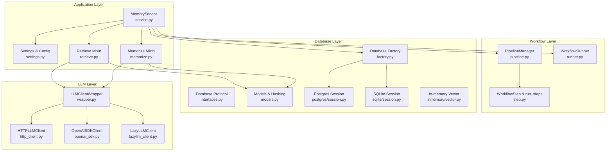
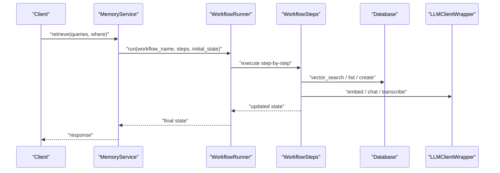
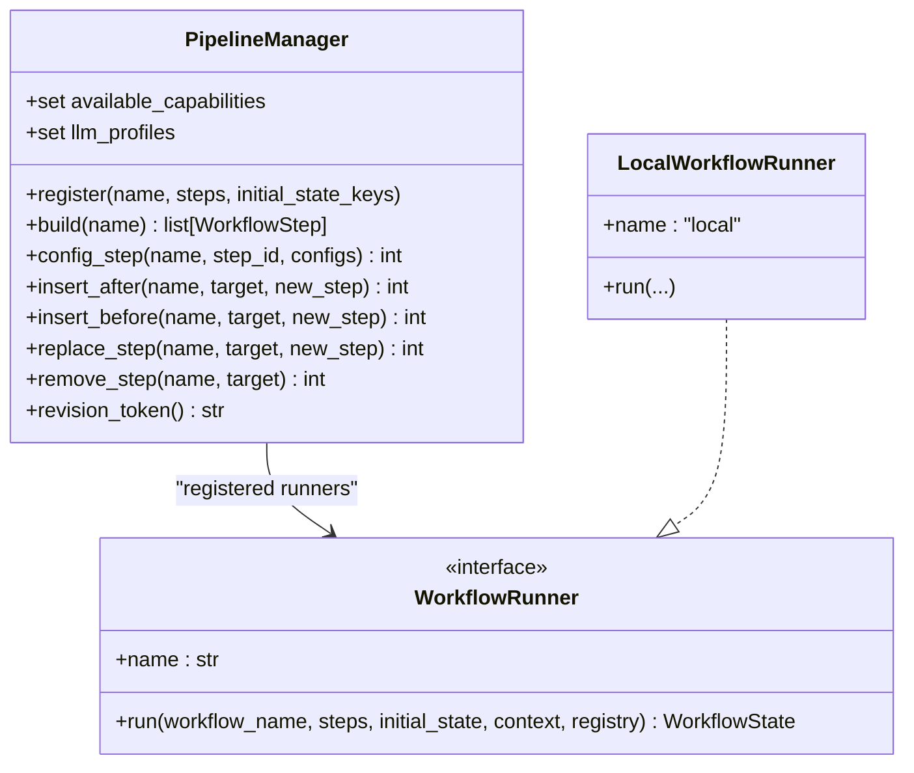
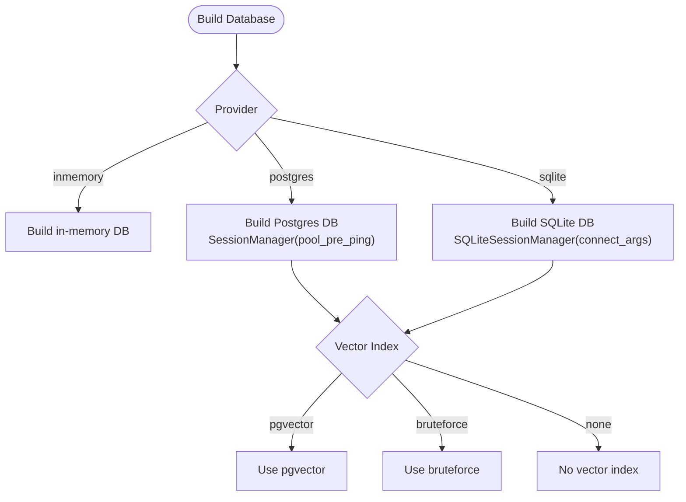
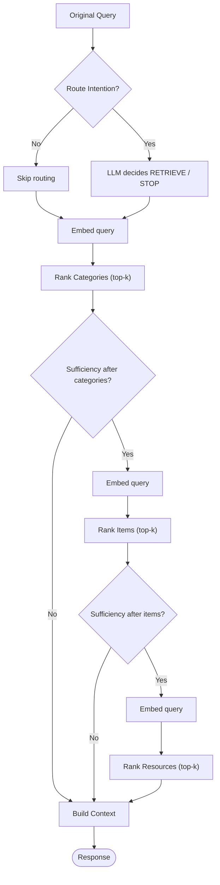
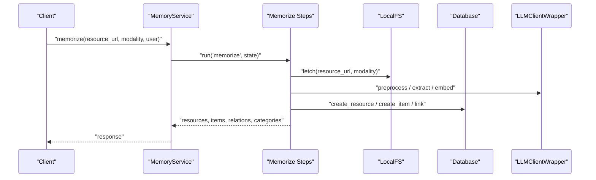
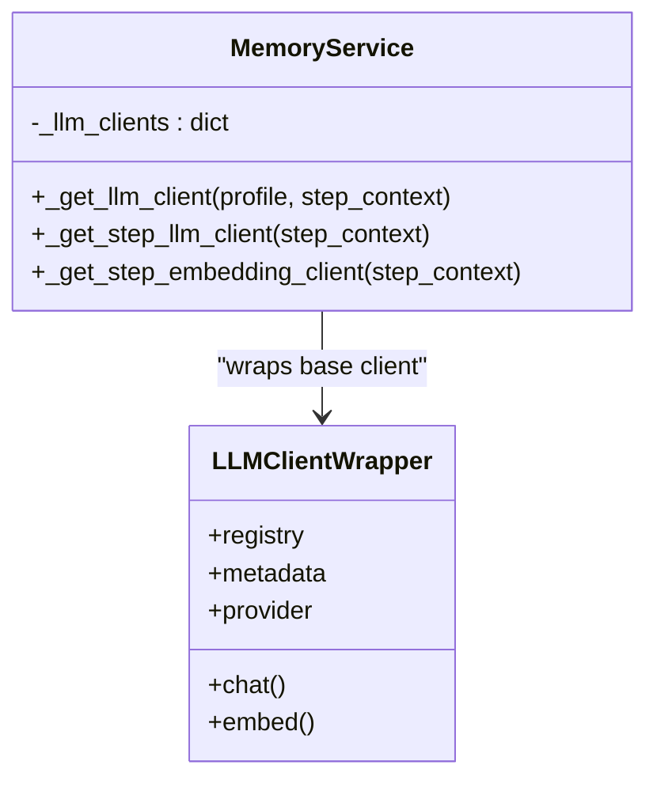
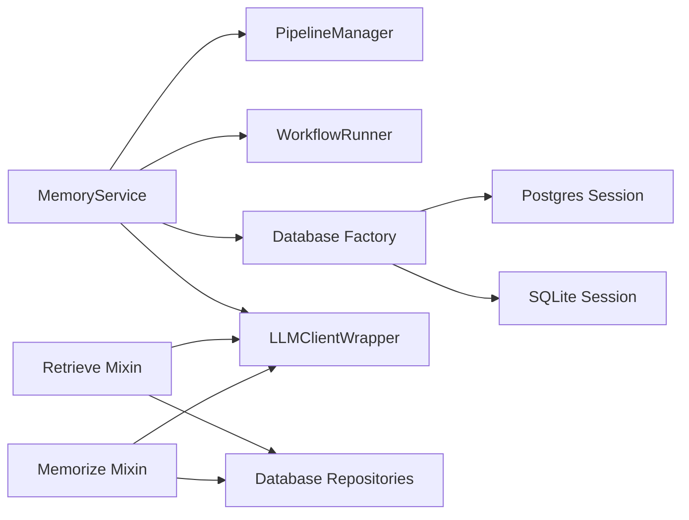

# Performance Optimization and Scaling

<cite>
**Referenced Files in This Document**
- [src/memu/__init__.py](file://src/memu/__init__.py)
- [src/memu/_core.pyi](file://src/memu/_core.pyi)
- [src/memu/app/service.py](file://src/memu/app/service.py)
- [src/memu/app/settings.py](file://src/memu/app/settings.py)
- [src/memu/app/retrieve.py](file://src/memu/app/retrieve.py)
- [src/memu/app/memorize.py](file://src/memu/app/memorize.py)
- [src/memu/workflow/pipeline.py](file://src/memu/workflow/pipeline.py)
- [src/memu/workflow/runner.py](file://src/memu/workflow/runner.py)
- [src/memu/workflow/step.py](file://src/memu/workflow/step.py)
- [src/memu/database/interfaces.py](file://src/memu/database/interfaces.py)
- [src/memu/database/models.py](file://src/memu/database/models.py)
- [src/memu/database/factory.py](file://src/memu/database/factory.py)
- [src/memu/database/postgres/session.py](file://src/memu/database/postgres/session.py)
- [src/memu/database/sqlite/session.py](file://src/memu/database/sqlite/session.py)
- [src/memu/llm/wrapper.py](file://src/memu/llm/wrapper.py)
- [src/memu/llm/http_client.py](file://src/memu/llm/http_client.py)
- [src/memu/llm/openai_sdk.py](file://src/memu/llm/openai_sdk.py)
- [src/memu/llm/lazyllm_client.py](file://src/memu/llm/lazyllm_client.py)
- [src/memu/database/inmemory/vector.py](file://src/memu/database/inmemory/vector.py)
- [examples/example_1_conversation_memory.py](file://examples/example_1_conversation_memory.py)
- [examples/getting_started_robust.py](file://examples/getting_started_robust.py)
- [docs/HACKATHON_MAD_COMBOS.md](file://docs/HACKATHON_MAD_COMBOS.md)
</cite>

## Table of Contents
1. [Introduction](#introduction)
2. [Project Structure](#project-structure)
3. [Core Components](#core-components)
4. [Architecture Overview](#architecture-overview)
5. [Detailed Component Analysis](#detailed-component-analysis)
6. [Dependency Analysis](#dependency-analysis)
7. [Performance Considerations](#performance-considerations)
8. [Troubleshooting Guide](#troubleshooting-guide)
9. [Conclusion](#conclusion)
10. [Appendices](#appendices)

## Introduction
This document focuses on performance optimization and scaling strategies for memU’s enterprise-grade deployment. It explains memory usage optimization, database connection pooling, and workflow execution efficiency. It also documents scaling patterns for high-throughput memory processing, concurrent access handling, and resource management strategies. Concrete examples from the codebase show how to configure optimal pipeline settings, implement efficient database backends, and monitor system performance. The relationship between memory layers, retrieval efficiency, and overall system throughput is clarified, along with caching strategies, batch processing optimizations, and memory footprint reduction techniques. Guidance is included for load testing, bottleneck identification, and implementing horizontal and vertical scaling solutions, alongside production hardening, monitoring requirements, and capacity planning.

## Project Structure
The memU codebase is organized around a modular architecture:
- Application layer: service orchestration, configuration, and user-facing APIs
- Workflow layer: pipeline definition, step execution, and runner abstraction
- Database layer: pluggable backends (in-memory, SQLite, PostgreSQL/pgvector)
- LLM integration layer: client wrappers and backends (SDK, HTTP, LazyLLM)
- Prompts and retrieval logic: configurable retrieval strategies and ranking
- Examples and documentation: tutorials and advanced combo ideas for memory lifecycle and compression

**Diagram sources**
- [src/memu/app/service.py](file://src/memu/app/service.py#L49-L427)
- [src/memu/app/settings.py](file://src/memu/app/settings.py#L1-L322)
- [src/memu/app/retrieve.py](file://src/memu/app/retrieve.py#L1-L800)
- [src/memu/app/memorize.py](file://src/memu/app/memorize.py#L1-L800)
- [src/memu/workflow/pipeline.py](file://src/memu/workflow/pipeline.py#L1-L171)
- [src/memu/workflow/runner.py](file://src/memu/workflow/runner.py#L1-L82)
- [src/memu/workflow/step.py](file://src/memu/workflow/step.py#L1-L102)
- [src/memu/database/factory.py](file://src/memu/database/factory.py#L1-L44)
- [src/memu/database/interfaces.py](file://src/memu/database/interfaces.py#L1-L36)
- [src/memu/database/models.py](file://src/memu/database/models.py#L1-L149)
- [src/memu/database/postgres/session.py](file://src/memu/database/postgres/session.py#L1-L35)
- [src/memu/database/sqlite/session.py](file://src/memu/database/sqlite/session.py#L1-L49)
- [src/memu/database/inmemory/vector.py](file://src/memu/database/inmemory/vector.py)
- [src/memu/llm/wrapper.py](file://src/memu/llm/wrapper.py)
- [src/memu/llm/http_client.py](file://src/memu/llm/http_client.py)
- [src/memu/llm/openai_sdk.py](file://src/memu/llm/openai_sdk.py)
- [src/memu/llm/lazyllm_client.py](file://src/memu/llm/lazyllm_client.py)

**Section sources**
- [src/memu/app/service.py](file://src/memu/app/service.py#L49-L427)
- [src/memu/app/settings.py](file://src/memu/app/settings.py#L1-L322)
- [src/memu/workflow/pipeline.py](file://src/memu/workflow/pipeline.py#L1-L171)
- [src/memu/workflow/runner.py](file://src/memu/workflow/runner.py#L1-L82)
- [src/memu/workflow/step.py](file://src/memu/workflow/step.py#L1-L102)
- [src/memu/database/factory.py](file://src/memu/database/factory.py#L1-L44)
- [src/memu/database/interfaces.py](file://src/memu/database/interfaces.py#L1-L36)
- [src/memu/database/models.py](file://src/memu/database/models.py#L1-L149)
- [src/memu/database/postgres/session.py](file://src/memu/database/postgres/session.py#L1-L35)
- [src/memu/database/sqlite/session.py](file://src/memu/database/sqlite/session.py#L1-L49)
- [src/memu/database/inmemory/vector.py](file://src/memu/database/inmemory/vector.py)
- [src/memu/llm/wrapper.py](file://src/memu/llm/wrapper.py)
- [src/memu/llm/http_client.py](file://src/memu/llm/http_client.py)
- [src/memu/llm/openai_sdk.py](file://src/memu/llm/openai_sdk.py)
- [src/memu/llm/lazyllm_client.py](file://src/memu/llm/lazyllm_client.py)

## Core Components
- MemoryService orchestrates memory ingestion, categorization, retrieval, and CRUD operations. It lazily initializes LLM clients, manages workflow runners, and registers pipelines.
- PipelineManager defines and mutates workflow pipelines with validation for step uniqueness, capability availability, and state key dependencies.
- WorkflowRunner abstracts execution backends (local/sync) and supports registration of external runners.
- Database factory builds pluggable backends (in-memory, SQLite, PostgreSQL/pgvector) with appropriate session managers.
- LLMClientWrapper integrates interceptors and metadata for observability and profiling.
- Retrieval and memorize mixins implement configurable retrieval strategies (RAG vs LLM ranking) and multimodal preprocessing with batching and deduplication.

**Section sources**
- [src/memu/app/service.py](file://src/memu/app/service.py#L49-L427)
- [src/memu/workflow/pipeline.py](file://src/memu/workflow/pipeline.py#L21-L171)
- [src/memu/workflow/runner.py](file://src/memu/workflow/runner.py#L12-L82)
- [src/memu/database/factory.py](file://src/memu/database/factory.py#L15-L44)
- [src/memu/llm/wrapper.py](file://src/memu/llm/wrapper.py)
- [src/memu/app/retrieve.py](file://src/memu/app/retrieve.py#L106-L210)
- [src/memu/app/memorize.py](file://src/memu/app/memorize.py#L97-L167)

## Architecture Overview
The system separates concerns across layers:
- Configuration drives behavior (LLM profiles, retrieval top-K, vector index provider).
- Workflows define stepwise execution with explicit requires/produces contracts.
- Database backends provide repository abstractions and vector search.
- LLM clients encapsulate batching and client selection strategies.

**Diagram sources**
- [src/memu/app/service.py](file://src/memu/app/service.py#L350-L361)
- [src/memu/workflow/runner.py](file://src/memu/workflow/runner.py#L28-L42)
- [src/memu/workflow/step.py](file://src/memu/workflow/step.py#L50-L102)
- [src/memu/app/retrieve.py](file://src/memu/app/retrieve.py#L42-L86)
- [src/memu/app/memorize.py](file://src/memu/app/memorize.py#L65-L96)

## Detailed Component Analysis

### Pipeline and Workflow Execution
- PipelineManager enforces step uniqueness, capability checks, and validates state key dependencies across steps. It supports mutation operations (insert/replace/remove) and revision tracking.
- WorkflowRunner resolves a runner backend (local/sync) and delegates execution to run_steps, which enforces requires/produces contracts and runs interceptors before/after or on error.

**Diagram sources**
- [src/memu/workflow/pipeline.py](file://src/memu/workflow/pipeline.py#L21-L171)
- [src/memu/workflow/runner.py](file://src/memu/workflow/runner.py#L12-L82)

**Section sources**
- [src/memu/workflow/pipeline.py](file://src/memu/workflow/pipeline.py#L21-L171)
- [src/memu/workflow/runner.py](file://src/memu/workflow/runner.py#L28-L82)
- [src/memu/workflow/step.py](file://src/memu/workflow/step.py#L16-L102)

### Database Backends and Connection Pooling
- Database factory selects backend based on configuration and constructs appropriate session managers.
- Postgres SessionManager creates an engine with pool_pre_ping enabled and yields sessions via Session.
- SQLite SessionManager configures multi-threaded access and disposes engine safely.
- Vector index provider defaults to bruteforce for non-Postgres and pgvector for Postgres when unspecified.

**Diagram sources**
- [src/memu/database/factory.py](file://src/memu/database/factory.py#L15-L44)
- [src/memu/database/postgres/session.py](file://src/memu/database/postgres/session.py#L15-L35)
- [src/memu/database/sqlite/session.py](file://src/memu/database/sqlite/session.py#L14-L49)
- [src/memu/app/settings.py](file://src/memu/app/settings.py#L305-L322)

**Section sources**
- [src/memu/database/factory.py](file://src/memu/database/factory.py#L15-L44)
- [src/memu/database/postgres/session.py](file://src/memu/database/postgres/session.py#L15-L35)
- [src/memu/database/sqlite/session.py](file://src/memu/database/sqlite/session.py#L14-L49)
- [src/memu/app/settings.py](file://src/memu/app/settings.py#L305-L322)

### Retrieval Efficiency and Ranking
- Retrieval supports two modes:
  - RAG mode: embedding-based vector search with cosine_topk and optional salience-aware ranking.
  - LLM mode: LLM ranks categories/items/resources based on prompts.
- Configuration controls top-K per stage, sufficiency checks, and whether to use category references to fetch referenced items.
- Embedding batching is controlled per LLM profile; embedding client is cached per profile to reduce overhead.

**Diagram sources**
- [src/memu/app/retrieve.py](file://src/memu/app/retrieve.py#L106-L210)
- [src/memu/app/retrieve.py](file://src/memu/app/retrieve.py#L228-L453)
- [src/memu/app/retrieve.py](file://src/memu/app/retrieve.py#L454-L536)
- [src/memu/database/inmemory/vector.py](file://src/memu/database/inmemory/vector.py)

**Section sources**
- [src/memu/app/retrieve.py](file://src/memu/app/retrieve.py#L106-L210)
- [src/memu/app/retrieve.py](file://src/memu/app/retrieve.py#L228-L453)
- [src/memu/app/retrieve.py](file://src/memu/app/retrieve.py#L454-L536)
- [src/memu/database/inmemory/vector.py](file://src/memu/database/inmemory/vector.py)

### Memory Ingestion and Categorization
- The memorize workflow ingests resources, preprocesses multimodal content, extracts structured memories, persists items, links categories, and optionally updates category summaries.
- Embedding batching is configured per LLM profile; embeddings are computed once per batch and reused across steps.
- Deduplication and reinforcement tracking are supported via hashing and extra fields in memory items.

**Diagram sources**
- [src/memu/app/service.py](file://src/memu/app/service.py#L65-L96)
- [src/memu/app/memorize.py](file://src/memu/app/memorize.py#L97-L167)
- [src/memu/app/memorize.py](file://src/memu/app/memorize.py#L181-L325)

**Section sources**
- [src/memu/app/memorize.py](file://src/memu/app/memorize.py#L97-L167)
- [src/memu/app/memorize.py](file://src/memu/app/memorize.py#L181-L325)
- [src/memu/database/models.py](file://src/memu/database/models.py#L15-L33)

### LLM Client Caching and Batch Processing
- LLM clients are lazily initialized and cached per profile to avoid repeated network setup.
- Embedding batch size is configurable per profile; batching reduces API call overhead.
- LLMClientWrapper integrates interceptors and metadata for tracing and profiling.

**Diagram sources**
- [src/memu/app/service.py](file://src/memu/app/service.py#L97-L152)
- [src/memu/app/service.py](file://src/memu/app/service.py#L168-L190)
- [src/memu/llm/wrapper.py](file://src/memu/llm/wrapper.py)

**Section sources**
- [src/memu/app/service.py](file://src/memu/app/service.py#L97-L152)
- [src/memu/app/service.py](file://src/memu/app/service.py#L168-L190)
- [src/memu/llm/wrapper.py](file://src/memu/llm/wrapper.py)

## Dependency Analysis
- Coupling:
  - MemoryService depends on PipelineManager, WorkflowRunner, Database factory, and LLM clients.
  - Retrieval and Memorize mixins depend on Database repositories and LLM clients.
- Cohesion:
  - Each module encapsulates a single responsibility: configuration, workflow, database, or LLM integration.
- External dependencies:
  - SQLModel/SQLAlchemy for database backends.
  - Pydantic for configuration models.
  - Optional LazyLLM client for multi-provider backends.

**Diagram sources**
- [src/memu/app/service.py](file://src/memu/app/service.py#L49-L427)
- [src/memu/workflow/pipeline.py](file://src/memu/workflow/pipeline.py#L21-L171)
- [src/memu/workflow/runner.py](file://src/memu/workflow/runner.py#L61-L82)
- [src/memu/database/factory.py](file://src/memu/database/factory.py#L15-L44)
- [src/memu/app/retrieve.py](file://src/memu/app/retrieve.py#L1-L800)
- [src/memu/app/memorize.py](file://src/memu/app/memorize.py#L1-L800)

**Section sources**
- [src/memu/app/service.py](file://src/memu/app/service.py#L49-L427)
- [src/memu/workflow/pipeline.py](file://src/memu/workflow/pipeline.py#L21-L171)
- [src/memu/workflow/runner.py](file://src/memu/workflow/runner.py#L61-L82)
- [src/memu/database/factory.py](file://src/memu/database/factory.py#L15-L44)
- [src/memu/app/retrieve.py](file://src/memu/app/retrieve.py#L1-L800)
- [src/memu/app/memorize.py](file://src/memu/app/memorize.py#L1-L800)

## Performance Considerations
- Memory usage optimization:
  - Avoid storing embeddings when serializing responses by excluding embedding fields from dumps.
  - Use streaming-like segmentation for long conversations to limit intermediate state size.
  - Leverage category references to defer fetching referenced items until needed.
- Database connection pooling:
  - Postgres: pool_pre_ping enabled to detect dead connections; reuse Session instances per request.
  - SQLite: connect_args allow multi-threaded access; dispose engines on shutdown.
  - Vector index provider selection impacts memory footprint; bruteforce uses in-memory cosine_topk while pgvector offloads to database.
- Workflow execution efficiency:
  - Configure pipeline steps to minimize redundant computations (e.g., compute embeddings once per query).
  - Use sufficiency checks to terminate early when sufficient context is gathered.
  - Cache LLM clients per profile to avoid repeated initialization overhead.
- Retrieval efficiency:
  - Tune top-K per stage to balance recall and latency.
  - Choose ranking strategy (“similarity” vs “salience”) based on workload characteristics.
  - Enable reference-aware retrieval to expand coverage without increasing raw top-K.
- Embedding batching:
  - Increase embed_batch_size per profile to amortize API latency; ensure downstream consumers can handle batched embeddings.
- Caching strategies:
  - LLM client caching per profile.
  - Interceptor-based telemetry and profiling for bottleneck identification.
- Batch processing optimizations:
  - Group embedding calls per step to leverage batching.
  - Segment long conversations to reduce context window pressure.
- Memory footprint reduction:
  - Exclude embeddings from serialized outputs.
  - Use category summaries to reduce raw item count.
  - Implement auto-pruning of low-value memories (see advanced combos).

[No sources needed since this section provides general guidance]

## Troubleshooting Guide
- Pipeline validation errors:
  - Duplicate step_id or missing required state keys cause immediate failures during pipeline validation.
- Unknown LLM profile:
  - Using a non-existent profile raises an error; ensure profiles are registered in LLMProfilesConfig.
- Unsupported database provider:
  - Factory raises an error for unsupported metadata_store provider.
- Database engine disposal:
  - Postgres and SQLite session managers log exceptions during engine disposal; ensure proper shutdown sequences.
- Retrieval workflow failures:
  - Retrieve workflow raises an error if response is missing; verify vector index provider and embedding client configuration.
- Load testing and bottleneck identification:
  - Use interceptor hooks to instrument LLM calls and workflow steps.
  - Monitor embedding latency and throughput; adjust embed_batch_size accordingly.
  - Profile vector search performance; consider switching to pgvector for large corpora.

**Section sources**
- [src/memu/workflow/pipeline.py](file://src/memu/workflow/pipeline.py#L131-L165)
- [src/memu/app/service.py](file://src/memu/app/service.py#L202-L226)
- [src/memu/database/factory.py](file://src/memu/database/factory.py#L41-L44)
- [src/memu/database/postgres/session.py](file://src/memu/database/postgres/session.py#L27-L32)
- [src/memu/database/sqlite/session.py](file://src/memu/database/sqlite/session.py#L35-L41)
- [src/memu/app/retrieve.py](file://src/memu/app/retrieve.py#L80-L85)

## Conclusion
memU’s architecture enables enterprise-grade performance through modular design, pluggable backends, and configurable workflows. By tuning pipeline settings, leveraging database connection pooling, optimizing embedding batching, and applying retrieval strategies tailored to workload characteristics, organizations can achieve high-throughput memory processing with controlled resource usage. Interceptors and configuration-driven profiles support observability and scalability, while advanced memory lifecycle and compression strategies offer further optimization potential.

[No sources needed since this section summarizes without analyzing specific files]

## Appendices

### Configuration Reference for Optimal Pipeline Settings
- LLM profiles:
  - client_backend: choose “sdk”, “httpx”, or “lazyllm_backend”
  - embed_batch_size: increase for higher throughput
  - endpoint_overrides: customize provider endpoints when needed
- Retrieval:
  - method: “rag” or “llm”
  - category/item/resource top_k: tune per stage
  - sufficiency_check: enable to reduce unnecessary steps
  - ranking: “similarity” or “salience”
  - use_category_references: enable to fetch referenced items
- Database:
  - metadata_store.provider: “inmemory”, “postgres”, or “sqlite”
  - vector_index.provider: “bruteforce”, “pgvector”, or “none”
  - dsn: connection string for Postgres/SQLite

**Section sources**
- [src/memu/app/settings.py](file://src/memu/app/settings.py#L102-L139)
- [src/memu/app/settings.py](file://src/memu/app/settings.py#L175-L202)
- [src/memu/app/settings.py](file://src/memu/app/settings.py#L305-L322)

### Scaling Patterns and Best Practices
- Horizontal scaling:
  - Stateless MemoryService instances behind a load balancer; persist state in PostgreSQL with pgvector.
  - Use separate LLM profiles for embedding vs chat to isolate resource usage.
- Vertical scaling:
  - Increase embed_batch_size and worker concurrency for embedding-heavy workloads.
  - Provision larger Postgres instances with pgvector extension for vector search.
- Production hardening:
  - Enable pool_pre_ping for Postgres; configure connection limits.
  - Use interceptor-based telemetry for latency and error rate monitoring.
  - Implement graceful shutdown to dispose engines and flush caches.
- Capacity planning:
  - Estimate embedding storage per memory item and vector index overhead.
  - Plan for category and item growth; consider pruning low-salience memories.

**Section sources**
- [src/memu/database/postgres/session.py](file://src/memu/database/postgres/session.py#L18-L25)
- [src/memu/app/settings.py](file://src/memu/app/settings.py#L119-L127)
- [src/memu/app/service.py](file://src/memu/app/service.py#L84-L96)

### Advanced Memory Lifecycle and Compression Strategies
- Intelligent memory lifecycle:
  - Reinforcement and decay to mimic human forgetting; auto-pruning for low-value memories.
- Working memory compression:
  - Compact, compress, and auto modes to handle long conversations without context overflow.

**Section sources**
- [docs/HACKATHON_MAD_COMBOS.md](file://docs/HACKATHON_MAD_COMBOS.md#L269-L660)

### Example Usage References
- Conversation memory example: demonstrates basic memory ingestion and retrieval patterns.
- Getting started robust example: shows configuration and client initialization for production scenarios.

**Section sources**
- [examples/example_1_conversation_memory.py](file://examples/example_1_conversation_memory.py)
- [examples/getting_started_robust.py](file://examples/getting_started_robust.py)