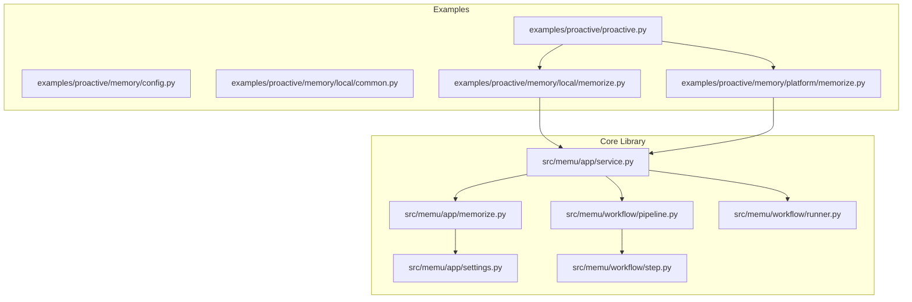
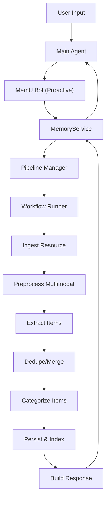
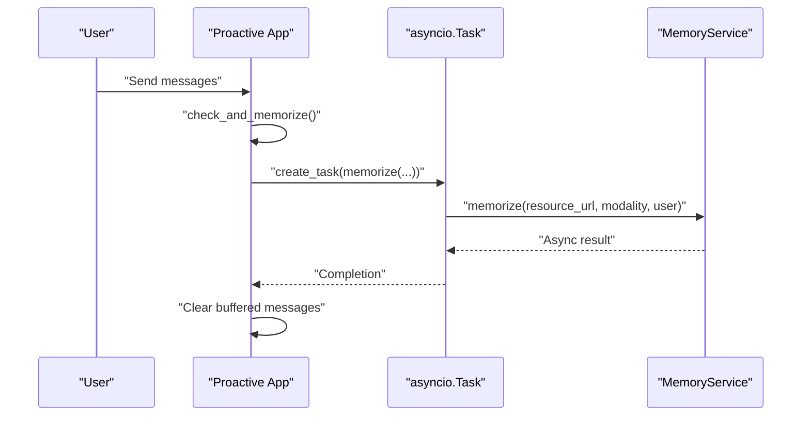
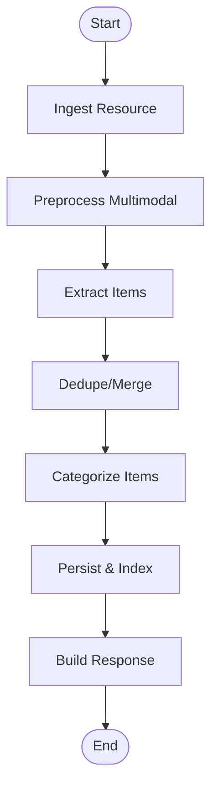
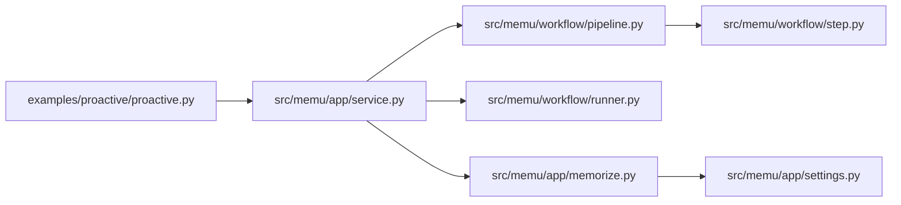

# Proactive Memory Management

<cite>
**Referenced Files in This Document**
- [proactive.py](file://examples/proactive/proactive.py)
- [config.py](file://examples/proactive/memory/config.py)
- [local/common.py](file://examples/proactive/memory/local/common.py)
- [local/memorize.py](file://examples/proactive/memory/local/memorize.py)
- [platform/memorize.py](file://examples/proactive/memory/platform/memorize.py)
- [memorize.py](file://src/memu/app/memorize.py)
- [service.py](file://src/memu/app/service.py)
- [settings.py](file://src/memu/app/settings.py)
- [pipeline.py](file://src/memu/workflow/pipeline.py)
- [runner.py](file://src/memu/workflow/runner.py)
- [step.py](file://src/memu/workflow/step.py)
- [README_en.md](file://readme/README_en.md)
- [0001-workflow-pipeline-architecture.md](file://docs/adr/0001-workflow-pipeline-architecture.md)
</cite>

## Table of Contents
1. [Introduction](#introduction)
2. [Project Structure](#project-structure)
3. [Core Components](#core-components)
4. [Architecture Overview](#architecture-overview)
5. [Detailed Component Analysis](#detailed-component-analysis)
6. [Dependency Analysis](#dependency-analysis)
7. [Performance Considerations](#performance-considerations)
8. [Troubleshooting Guide](#troubleshooting-guide)
9. [Conclusion](#conclusion)
10. [Appendices](#appendices)

## Introduction
This document explains memU’s proactive memory management system with a focus on automated memory processing. It covers how automatic triggers initiate memory extraction, how background tasks are managed concurrently, and how continuous learning workflows operate. It also documents threshold-based memorization, concurrent task handling, memory consolidation strategies, and practical guidance for configuring thresholds, managing background tasks, implementing custom proactive behaviors, and optimizing performance during continuous memory operations.

## Project Structure
The proactive memory system spans example applications and the core library:
- Examples demonstrate two modes of operation: local file-based memory and platform-based remote memory.
- The core library implements a configurable, extensible workflow pipeline for memory processing.

**Diagram sources**
- [proactive.py](file://examples/proactive/proactive.py#L1-L199)
- [local/memorize.py](file://examples/proactive/memory/local/memorize.py#L1-L39)
- [platform/memorize.py](file://examples/proactive/memory/platform/memorize.py#L1-L32)
- [memorize.py](file://src/memu/app/memorize.py#L1-L1331)
- [service.py](file://src/memu/app/service.py#L1-L427)
- [settings.py](file://src/memu/app/settings.py#L1-L322)
- [pipeline.py](file://src/memu/workflow/pipeline.py#L1-L171)
- [runner.py](file://src/memu/workflow/runner.py#L1-L82)
- [step.py](file://src/memu/workflow/step.py#L1-L102)

**Section sources**
- [proactive.py](file://examples/proactive/proactive.py#L1-L199)
- [local/memorize.py](file://examples/proactive/memory/local/memorize.py#L1-L39)
- [platform/memorize.py](file://examples/proactive/memory/platform/memorize.py#L1-L32)
- [memorize.py](file://src/memu/app/memorize.py#L1-L1331)
- [service.py](file://src/memu/app/service.py#L1-L427)
- [settings.py](file://src/memu/app/settings.py#L1-L322)
- [pipeline.py](file://src/memu/workflow/pipeline.py#L1-L171)
- [runner.py](file://src/memu/workflow/runner.py#L1-L82)
- [step.py](file://src/memu/workflow/step.py#L1-L102)

## Core Components
- Threshold-based trigger: The example demonstrates a simple counter-based trigger that starts a background memory task when a conversation reaches a configured message count.
- Background task management: The example uses asyncio tasks to run memory processing concurrently and avoids overlapping runs.
- Memory extraction pipeline: The core library implements a multi-step workflow pipeline for ingestion, preprocessing, extraction, categorization, persistence, and response building.
- Configuration: Memory types, categories, prompts, and retrieval settings are configured via dedicated configuration objects and dictionaries.

Key implementation references:
- Trigger and task orchestration: [proactive.py](file://examples/proactive/proactive.py#L16-L124)
- Local memory service initialization: [local/common.py](file://examples/proactive/memory/local/common.py#L11-L31)
- Local memory extraction entry point: [local/memorize.py](file://examples/proactive/memory/local/memorize.py#L34-L39)
- Platform memory extraction entry point: [platform/memorize.py](file://examples/proactive/memory/platform/memorize.py#L13-L31)
- Memory pipeline definition and steps: [memorize.py](file://src/memu/app/memorize.py#L97-L166)
- Workflow runner and pipeline manager: [service.py](file://src/memu/app/service.py#L315-L361), [runner.py](file://src/memu/workflow/runner.py#L28-L82), [pipeline.py](file://src/memu/workflow/pipeline.py#L21-L171)
- Settings for memory types, categories, and prompts: [settings.py](file://src/memu/app/settings.py#L204-L243), [config.py](file://examples/proactive/memory/config.py#L1-L67)

**Section sources**
- [proactive.py](file://examples/proactive/proactive.py#L16-L124)
- [local/common.py](file://examples/proactive/memory/local/common.py#L11-L31)
- [local/memorize.py](file://examples/proactive/memory/local/memorize.py#L34-L39)
- [platform/memorize.py](file://examples/proactive/memory/platform/memorize.py#L13-L31)
- [memorize.py](file://src/memu/app/memorize.py#L97-L166)
- [service.py](file://src/memu/app/service.py#L315-L361)
- [runner.py](file://src/memu/workflow/runner.py#L28-L82)
- [pipeline.py](file://src/memu/workflow/pipeline.py#L21-L171)
- [settings.py](file://src/memu/app/settings.py#L204-L243)
- [config.py](file://examples/proactive/memory/config.py#L1-L67)

## Architecture Overview
The proactive memory lifecycle integrates user input, agent execution, and automated memory processing. The example application monitors conversation length and triggers background memory tasks, while the core library executes a robust, configurable pipeline for memory extraction and consolidation.

**Diagram sources**
- [README_en.md](file://readme/README_en.md#L106-L155)
- [service.py](file://src/memu/app/service.py#L315-L361)
- [pipeline.py](file://src/memu/workflow/pipeline.py#L21-L171)
- [runner.py](file://src/memu/workflow/runner.py#L28-L82)
- [memorize.py](file://src/memu/app/memorize.py#L97-L166)

**Section sources**
- [README_en.md](file://readme/README_en.md#L106-L155)
- [service.py](file://src/memu/app/service.py#L315-L361)
- [pipeline.py](file://src/memu/workflow/pipeline.py#L21-L171)
- [runner.py](file://src/memu/workflow/runner.py#L28-L82)
- [memorize.py](file://src/memu/app/memorize.py#L97-L166)

## Detailed Component Analysis

### Proactive Trigger and Background Task Management
The example implements a simple yet effective proactive mechanism:
- A configurable threshold controls when memory processing is triggered.
- A global asyncio task tracks the current background job to prevent overlap.
- On threshold crossing, a background task is created and the conversation buffer is cleared to keep memory overhead bounded.

**Diagram sources**
- [proactive.py](file://examples/proactive/proactive.py#L16-L124)
- [local/memorize.py](file://examples/proactive/memory/local/memorize.py#L34-L39)
- [memorize.py](file://src/memu/app/memorize.py#L65-L95)

**Section sources**
- [proactive.py](file://examples/proactive/proactive.py#L16-L124)
- [local/memorize.py](file://examples/proactive/memory/local/memorize.py#L34-L39)
- [memorize.py](file://src/memu/app/memorize.py#L65-L95)

### Memory Extraction Pipeline (Core Library)
The core library defines a multi-step pipeline for memory processing:
- Ingestion: Fetches and prepares the resource.
- Preprocessing: Applies modality-specific transformations.
- Extraction: Generates structured memory entries using configured prompts.
- Deduplication/Merging: Placeholder for future dedup logic.
- Categorization: Creates resources, items, and category relations.
- Persistence/Indexing: Updates category summaries and optionally persists references.
- Response Building: Aggregates results into a unified response.

**Diagram sources**
- [memorize.py](file://src/memu/app/memorize.py#L97-L166)
- [memorize.py](file://src/memu/app/memorize.py#L181-L325)

**Section sources**
- [memorize.py](file://src/memu/app/memorize.py#L97-L166)
- [memorize.py](file://src/memu/app/memorize.py#L181-L325)

### Configuration of Threshold-Based Memorization
Threshold-based memorization is controlled by:
- A configurable constant that determines when to trigger background processing.
- A global variable tracking the running task to avoid overlap.

Practical guidance:
- Adjust the threshold constant to balance responsiveness vs. processing overhead.
- Ensure the task completion is awaited at session end to avoid orphaned operations.

References:
- Threshold constant and task variable: [proactive.py](file://examples/proactive/proactive.py#L16-L17)
- Trigger and task creation: [proactive.py](file://examples/proactive/proactive.py#L20-L34)
- Session cleanup and finalization: [proactive.py](file://examples/proactive/proactive.py#L155-L195)

**Section sources**
- [proactive.py](file://examples/proactive/proactive.py#L16-L17)
- [proactive.py](file://examples/proactive/proactive.py#L20-L34)
- [proactive.py](file://examples/proactive/proactive.py#L155-L195)

### Concurrent Task Handling and Memory Consolidation
Concurrency is handled via asyncio tasks:
- A single background task is tracked globally.
- The system checks task completion and handles exceptions.
- Memory consolidation occurs within the pipeline’s persistence/indexing steps.

References:
- Task tracking and checks: [proactive.py](file://examples/proactive/proactive.py#L102-L123)
- Pipeline persistence and indexing: [memorize.py](file://src/memu/app/memorize.py#L283-L297)

**Section sources**
- [proactive.py](file://examples/proactive/proactive.py#L102-L123)
- [memorize.py](file://src/memu/app/memorize.py#L283-L297)

### Relationship Between Conversation Length Thresholds, Task Scheduling, and Memory Optimization
- Threshold: Controls frequency of memory processing to balance latency and throughput.
- Task scheduling: Background tasks are scheduled only when thresholds are met and no prior task is running.
- Memory optimization: Buffering messages until threshold reduces I/O and improves batching efficiency; clearing buffers after successful processing keeps memory footprint bounded.

References:
- Threshold evaluation and scheduling: [proactive.py](file://examples/proactive/proactive.py#L97-L124)
- Buffer clearing after processing: [proactive.py](file://examples/proactive/proactive.py#L121-L123)

**Section sources**
- [proactive.py](file://examples/proactive/proactive.py#L97-L124)
- [proactive.py](file://examples/proactive/proactive.py#L121-L123)

### Continuous Learning Workflows
Continuous learning is supported by:
- Configurable memory types and category prompts.
- Automatic category initialization and embeddings.
- Optional item reinforcement and reference tracking.

References:
- Memory types and prompts: [settings.py](file://src/memu/app/settings.py#L204-L243), [config.py](file://examples/proactive/memory/config.py#L1-L67)
- Category initialization and embeddings: [memorize.py](file://src/memu/app/memorize.py#L648-L669)
- Reinforcement and references: [settings.py](file://src/memu/app/settings.py#L235-L242), [memorize.py](file://src/memu/app/memorize.py#L603-L623)

**Section sources**
- [settings.py](file://src/memu/app/settings.py#L204-L243)
- [config.py](file://examples/proactive/memory/config.py#L1-L67)
- [memorize.py](file://src/memu/app/memorize.py#L648-L669)
- [memorize.py](file://src/memu/app/memorize.py#L603-L623)

### Implementing Custom Proactive Behaviors
To extend proactive behaviors:
- Define custom triggers based on conversation metrics, time windows, or external signals.
- Use the pipeline APIs to inject custom steps or modify existing ones.
- Leverage interceptors for instrumentation and control.

References:
- Pipeline registration and mutation: [service.py](file://src/memu/app/service.py#L315-L361), [pipeline.py](file://src/memu/workflow/pipeline.py#L47-L122)
- Step-level configuration and interceptors: [service.py](file://src/memu/app/service.py#L258-L295)
- Workflow runner resolution: [runner.py](file://src/memu/workflow/runner.py#L61-L82)

**Section sources**
- [service.py](file://src/memu/app/service.py#L315-L361)
- [pipeline.py](file://src/memu/workflow/pipeline.py#L47-L122)
- [service.py](file://src/memu/app/service.py#L258-L295)
- [runner.py](file://src/memu/workflow/runner.py#L61-L82)

## Dependency Analysis
The proactive memory system exhibits clear separation of concerns:
- Example layer depends on the core MemoryService.
- MemoryService composes pipeline and runner abstractions.
- Pipeline enforces step validation and capability constraints.
- Runner executes steps with optional interceptors.

**Diagram sources**
- [proactive.py](file://examples/proactive/proactive.py#L1-L199)
- [service.py](file://src/memu/app/service.py#L1-L427)
- [pipeline.py](file://src/memu/workflow/pipeline.py#L1-L171)
- [step.py](file://src/memu/workflow/step.py#L1-L102)
- [runner.py](file://src/memu/workflow/runner.py#L1-L82)
- [memorize.py](file://src/memu/app/memorize.py#L1-L1331)
- [settings.py](file://src/memu/app/settings.py#L1-L322)

**Section sources**
- [proactive.py](file://examples/proactive/proactive.py#L1-L199)
- [service.py](file://src/memu/app/service.py#L1-L427)
- [pipeline.py](file://src/memu/workflow/pipeline.py#L1-L171)
- [step.py](file://src/memu/workflow/step.py#L1-L102)
- [runner.py](file://src/memu/workflow/runner.py#L1-L82)
- [memorize.py](file://src/memu/app/memorize.py#L1-L1331)
- [settings.py](file://src/memu/app/settings.py#L1-L322)

## Performance Considerations
- Threshold tuning: Increase thresholds to reduce frequency of memory processing; decrease for more responsive but heavier processing.
- Concurrency control: Limit simultaneous background tasks to prevent resource contention; the example uses a single global task to serialize operations.
- Batch processing: Buffer messages until threshold to improve batching efficiency and reduce I/O overhead.
- Embedding costs: Configure embedding profiles and batch sizes to balance accuracy and cost.
- Pipeline customization: Insert or remove steps based on workload; use interceptors to monitor and adjust performance.
- Cleanup: Ensure tasks are awaited at session end to release resources promptly.

[No sources needed since this section provides general guidance]

## Troubleshooting Guide
Common issues and resolutions:
- Overlapping tasks: Ensure only one background task runs at a time; the example checks task completion and exceptions.
- API key errors: Verify environment variables for local memory service initialization.
- Pipeline validation errors: Confirm step requirements and capabilities match available resources.
- Workflow failures: Use interceptors to capture errors and inspect step contexts.

References:
- Task completion and exception handling: [proactive.py](file://examples/proactive/proactive.py#L107-L123)
- Environment variable requirement: [local/common.py](file://examples/proactive/memory/local/common.py#L16-L19)
- Pipeline validation: [pipeline.py](file://src/memu/workflow/pipeline.py#L131-L165)
- Interceptors for error handling: [service.py](file://src/memu/app/service.py#L284-L295)

**Section sources**
- [proactive.py](file://examples/proactive/proactive.py#L107-L123)
- [local/common.py](file://examples/proactive/memory/local/common.py#L16-L19)
- [pipeline.py](file://src/memu/workflow/pipeline.py#L131-L165)
- [service.py](file://src/memu/app/service.py#L284-L295)

## Conclusion
memU’s proactive memory system combines a simple, configurable trigger with a robust, extensible workflow pipeline. By tuning thresholds, managing concurrency carefully, and leveraging the pipeline’s modular design, teams can achieve responsive, scalable, and maintainable automated memory processing. The example applications provide concrete patterns for integrating proactive behaviors, while the core library offers powerful customization hooks for advanced scenarios.

[No sources needed since this section summarizes without analyzing specific files]

## Appendices

### Appendix A: How to Configure Threshold-Based Memorization
- Adjust the threshold constant to control when background tasks are started.
- Ensure the global task variable is used to prevent overlapping runs.
- Clear the conversation buffer after successful processing to maintain memory bounds.

References:
- [proactive.py](file://examples/proactive/proactive.py#L16-L17)
- [proactive.py](file://examples/proactive/proactive.py#L97-L124)
- [proactive.py](file://examples/proactive/proactive.py#L121-L123)

**Section sources**
- [proactive.py](file://examples/proactive/proactive.py#L16-L17)
- [proactive.py](file://examples/proactive/proactive.py#L97-L124)
- [proactive.py](file://examples/proactive/proactive.py#L121-L123)

### Appendix B: Managing Background Tasks
- Create tasks only when thresholds are met and no task is running.
- Await tasks at session end to ensure completion.
- Handle exceptions from previous tasks to maintain system health.

References:
- [proactive.py](file://examples/proactive/proactive.py#L102-L124)
- [proactive.py](file://examples/proactive/proactive.py#L171-L195)

**Section sources**
- [proactive.py](file://examples/proactive/proactive.py#L102-L124)
- [proactive.py](file://examples/proactive/proactive.py#L171-L195)

### Appendix C: Implementing Custom Proactive Triggers and Processing Logic
- Extend the trigger function to incorporate domain-specific signals.
- Customize memory types and categories via configuration objects.
- Inject custom steps into the pipeline or replace existing ones.

References:
- [config.py](file://examples/proactive/memory/config.py#L1-L67)
- [settings.py](file://src/memu/app/settings.py#L204-L243)
- [service.py](file://src/memu/app/service.py#L390-L427)
- [pipeline.py](file://src/memu/workflow/pipeline.py#L47-L122)

**Section sources**
- [config.py](file://examples/proactive/memory/config.py#L1-L67)
- [settings.py](file://src/memu/app/settings.py#L204-L243)
- [service.py](file://src/memu/app/service.py#L390-L427)
- [pipeline.py](file://src/memu/workflow/pipeline.py#L47-L122)