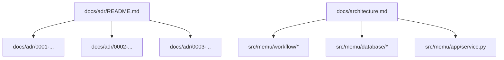
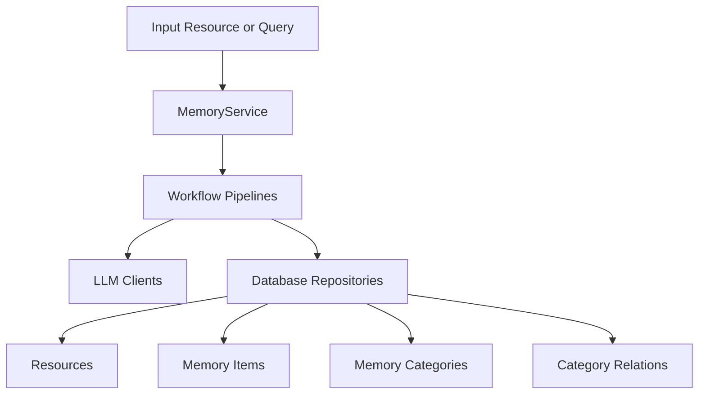
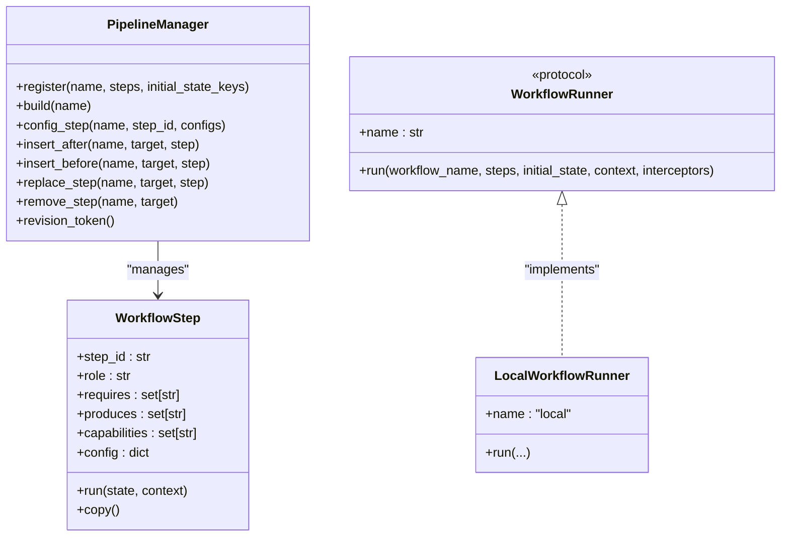
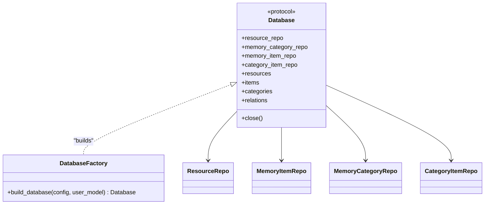
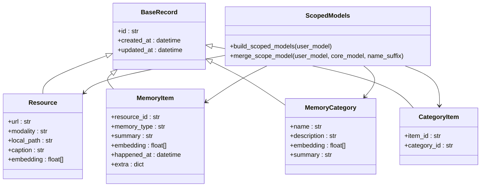
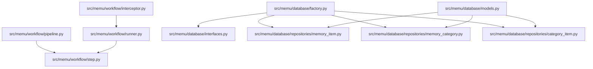

# Architecture Decision Records

<cite>
**Referenced Files in This Document**
- [0001-workflow-pipeline-architecture.md](file://docs/adr/0001-workflow-pipeline-architecture.md)
- [0002-pluggable-storage-and-vector-strategy.md](file://docs/adr/0002-pluggable-storage-and-vector-strategy.md)
- [0003-user-scope-in-data-model.md](file://docs/adr/0003-user-scope-in-data-model.md)
- [README.md](file://docs/adr/README.md)
- [architecture.md](file://docs/architecture.md)
- [pipeline.py](file://src/memu/workflow/pipeline.py)
- [runner.py](file://src/memu/workflow/runner.py)
- [step.py](file://src/memu/workflow/step.py)
- [interceptor.py](file://src/memu/workflow/interceptor.py)
- [factory.py](file://src/memu/database/factory.py)
- [interfaces.py](file://src/memu/database/interfaces.py)
- [models.py](file://src/memu/database/models.py)
- [memory_item.py](file://src/memu/database/repositories/memory_item.py)
- [memory_category.py](file://src/memu/database/repositories/memory_category.py)
- [category_item.py](file://src/memu/database/repositories/category_item.py)
</cite>

## Table of Contents
1. [Introduction](#introduction)
2. [Project Structure](#project-structure)
3. [Core Components](#core-components)
4. [Architecture Overview](#architecture-overview)
5. [Detailed Component Analysis](#detailed-component-analysis)
6. [Dependency Analysis](#dependency-analysis)
7. [Performance Considerations](#performance-considerations)
8. [Troubleshooting Guide](#troubleshooting-guide)
9. [Conclusion](#conclusion)
10. [Appendices](#appendices)

## Introduction
This document presents the Architecture Decision Records (ADRs) that define memU’s foundational design choices. It explains the rationale, evaluation criteria, and trade-offs for:
- Workflow pipeline architecture for core operations
- Pluggable storage and vector strategy
- User scope modeling embedded in data models

It also documents how these decisions influence system behavior, extensibility, and maintenance, and provides guidance for evolving the architecture over time.

## Project Structure
The ADRs are organized under docs/adr and complement the architecture overview in docs/architecture.md. The implementation spans workflow orchestration, database abstraction, and data models.

**Diagram sources**
- [README.md](file://docs/adr/README.md#L1-L6)
- [architecture.md](file://docs/architecture.md#L1-L170)

**Section sources**
- [README.md](file://docs/adr/README.md#L1-L6)
- [architecture.md](file://docs/architecture.md#L1-L170)

## Core Components
- Workflow engine: pipelines, steps, runners, and interceptors enable staged execution with observability and customization.
- Database abstraction: a protocol-backed repository layer supports pluggable backends with backend-aware vector behavior.
- Data models: scope fields are merged into core records to enforce consistent scoping across APIs.

**Section sources**
- [architecture.md](file://docs/architecture.md#L32-L170)

## Architecture Overview
The system orchestrates ingestion and retrieval through named pipelines, backed by a repository abstraction and LLM clients. The architecture supports local-first development and production-grade vector search.

**Diagram sources**
- [architecture.md](file://docs/architecture.md#L20-L30)

**Section sources**
- [architecture.md](file://docs/architecture.md#L9-L170)

## Detailed Component Analysis

### ADR 0001: Use Workflow Pipelines for Core Operations
- Decision: Model operations as named pipelines of ordered steps with explicit state contracts and capability tags.
- Evaluation criteria: Extensibility, observability, runtime customization, and uniformity across memorize/retrieve/CRUD.
- Alternatives considered: Monolithic functions per operation (rejected due to reduced extensibility and observability).
- Trade-offs:
  - Positive: Uniform execution model, explicit stage boundaries, extension points, interception and observability.
  - Negative: Dict-based state relies on key discipline, pipeline mutation can vary behavior across deployments, more framework code than direct calls.
- Implementation highlights:
  - PipelineManager registers pipelines, validates dependencies, and supports runtime mutation (insert/replace/remove).
  - WorkflowRunner is a protocol with a default LocalWorkflowRunner.
  - Interceptors provide before/after/on_error hooks for instrumentation and control.

**Diagram sources**
- [pipeline.py](file://src/memu/workflow/pipeline.py#L21-L171)
- [step.py](file://src/memu/workflow/step.py#L16-L102)
- [runner.py](file://src/memu/workflow/runner.py#L12-L82)

**Section sources**
- [0001-workflow-pipeline-architecture.md](file://docs/adr/0001-workflow-pipeline-architecture.md#L1-L36)
- [pipeline.py](file://src/memu/workflow/pipeline.py#L21-L171)
- [step.py](file://src/memu/workflow/step.py#L16-L102)
- [runner.py](file://src/memu/workflow/runner.py#L12-L82)
- [interceptor.py](file://src/memu/workflow/interceptor.py#L56-L219)

### ADR 0002: Use Pluggable Storage with Backend-Specific Vector Search
- Decision: Adopt a repository-based abstraction behind a Database protocol with selectable providers: inmemory, sqlite, postgres.
- Evaluation criteria: Zero-setup local development, lightweight persistence, and scalable vector similarity in production.
- Alternatives considered: Single monolithic storage engine (rejected due to mismatched needs across local and production).
- Trade-offs:
  - Positive: One service API across environments, clear backend contracts, predictable fallback behavior.
  - Negative: Duplicate repository logic across backends, performance differences, brute-force search on SQLite/inmemory.
- Implementation highlights:
  - Factory builds provider-specific databases.
  - Vector behavior is backend-aware: brute-force cosine search for portability; pgvector distance queries when enabled.

**Diagram sources**
- [interfaces.py](file://src/memu/database/interfaces.py#L12-L36)
- [factory.py](file://src/memu/database/factory.py#L15-L44)
- [memory_item.py](file://src/memu/database/repositories/memory_item.py#L9-L55)
- [memory_category.py](file://src/memu/database/repositories/memory_category.py#L9-L34)
- [category_item.py](file://src/memu/database/repositories/category_item.py#L9-L24)

**Section sources**
- [0002-pluggable-storage-and-vector-strategy.md](file://docs/adr/0002-pluggable-storage-and-vector-strategy.md#L1-L43)
- [factory.py](file://src/memu/database/factory.py#L15-L44)
- [interfaces.py](file://src/memu/database/interfaces.py#L12-L36)
- [architecture.md](file://docs/architecture.md#L111-L170)

### ADR 0003: Model User Scope as First-Class Fields on Memory Records
- Decision: Embed scope directly into persisted entities by merging a configurable UserConfig model with core record models.
- Evaluation criteria: Consistent filtering across APIs, backend independence, and support for multi-tenant and multi-agent patterns.
- Alternatives considered: Keeping scope external (rejected due to ad-hoc filtering and weakened isolation).
- Trade-offs:
  - Positive: Consistent filtering model, backend-independent semantics, multi-tenant/multi-agent support.
  - Negative: Increased schema/model complexity, varying shapes by scope model, caller alignment requirements.
- Implementation highlights:
  - Scope fields are part of resource/category/item/relation models.
  - Repositories accept user_data on writes and where filters on reads.
  - API-level where filters are validated against configured scope fields.

**Diagram sources**
- [models.py](file://src/memu/database/models.py#L35-L149)

**Section sources**
- [0003-user-scope-in-data-model.md](file://docs/adr/0003-user-scope-in-data-model.md#L1-L33)
- [models.py](file://src/memu/database/models.py#L108-L149)
- [architecture.md](file://docs/architecture.md#L132-L137)

## Dependency Analysis
The workflow and database layers are decoupled from concrete implementations via protocols and factories, enabling runtime selection and extension.

**Diagram sources**
- [pipeline.py](file://src/memu/workflow/pipeline.py#L1-L171)
- [step.py](file://src/memu/workflow/step.py#L1-L102)
- [runner.py](file://src/memu/workflow/runner.py#L1-L82)
- [interceptor.py](file://src/memu/workflow/interceptor.py#L1-L219)
- [factory.py](file://src/memu/database/factory.py#L1-L44)
- [interfaces.py](file://src/memu/database/interfaces.py#L1-L36)
- [memory_item.py](file://src/memu/database/repositories/memory_item.py#L1-L55)
- [memory_category.py](file://src/memu/database/repositories/memory_category.py#L1-L34)
- [category_item.py](file://src/memu/database/repositories/category_item.py#L1-L24)
- [models.py](file://src/memu/database/models.py#L1-L149)

**Section sources**
- [pipeline.py](file://src/memu/workflow/pipeline.py#L21-L171)
- [runner.py](file://src/memu/workflow/runner.py#L46-L82)
- [factory.py](file://src/memu/database/factory.py#L15-L44)
- [interfaces.py](file://src/memu/database/interfaces.py#L12-L36)

## Performance Considerations
- Workflow state is dict-based, validated by key names rather than static types; ensure disciplined naming and schema hygiene.
- SQLite and inmemory vector search rely on brute-force cosine similarity; expect lower scalability compared to pgvector-enabled Postgres.
- Category and extraction quality depend on prompts and LLMs; consider prompt engineering and quality gates.
- Some extension hooks are placeholders (e.g., dedupe/merge stage); treat as temporary and revisit during refinement.

**Section sources**
- [architecture.md](file://docs/architecture.md#L158-L164)

## Troubleshooting Guide
- Pipeline errors:
  - Missing required state keys or unknown capabilities/validation failures occur during registration/mutation; review step contracts and capability tags.
  - Use revision tokens to track pipeline changes across deployments.
- Runner resolution:
  - Unknown runner names or factories returning non-compliant runners cause errors; register via the runner factory and ensure protocol compliance.
- Interceptors:
  - Strict mode propagates interceptor exceptions; otherwise failures are logged. Verify interceptor signatures and error handling.
- Database provider selection:
  - Unsupported provider or misconfiguration raises errors; confirm provider string and backend availability.

**Section sources**
- [pipeline.py](file://src/memu/workflow/pipeline.py#L131-L171)
- [runner.py](file://src/memu/workflow/runner.py#L61-L82)
- [interceptor.py](file://src/memu/workflow/interceptor.py#L163-L219)
- [factory.py](file://src/memu/database/factory.py#L15-L44)

## Conclusion
These ADRs establish a flexible, observable, and extensible foundation for memU:
- Workflows provide uniform, customizable execution with strong observability.
- Storage abstraction enables seamless transitions from local to production-grade vector search.
- User scope embedded in models ensures consistent isolation and multi-tenant/multi-agent support.

Future evolution should focus on reducing duplication across backends, refining placeholder extension hooks, and enhancing schema stability while preserving backward compatibility.

## Appendices
- Related ADRs and architecture overview are linked below for cross-reference.

**Section sources**
- [README.md](file://docs/adr/README.md#L1-L6)
- [architecture.md](file://docs/architecture.md#L165-L170)