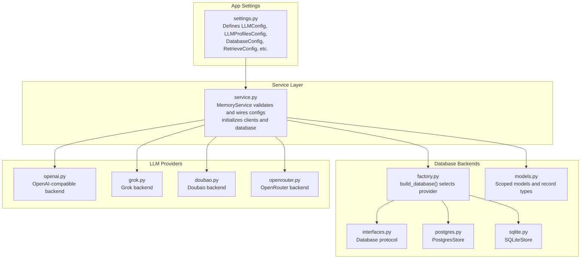
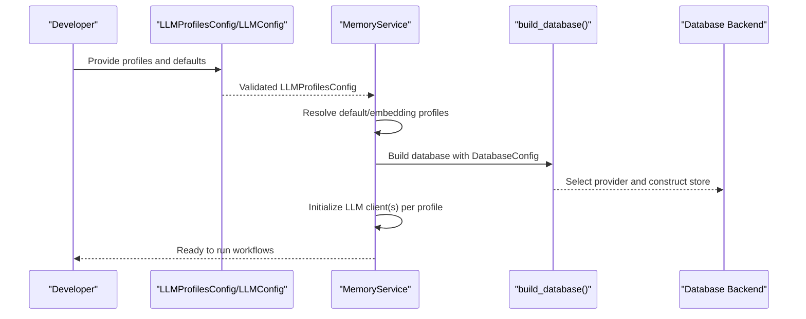
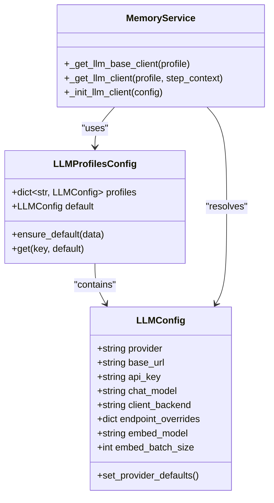
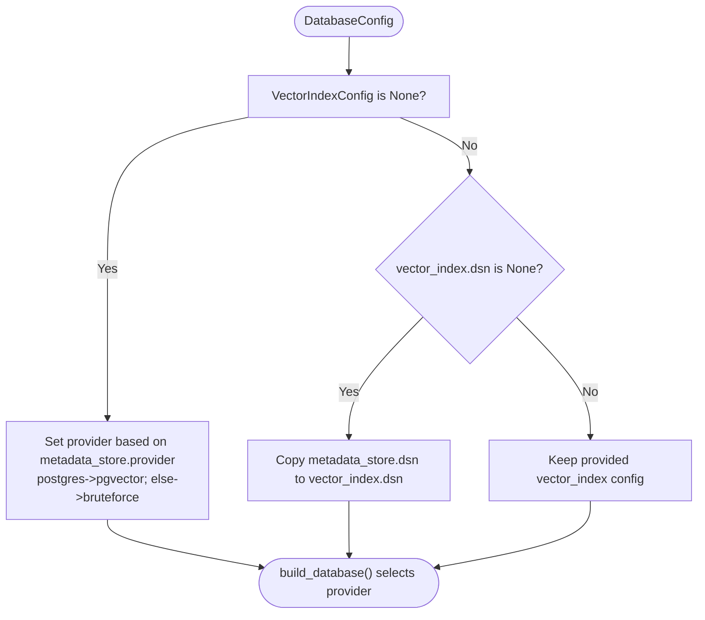
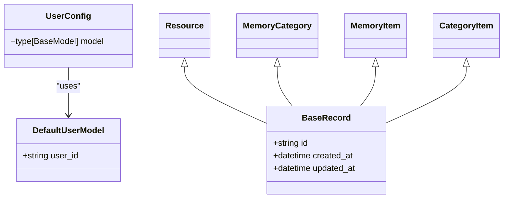
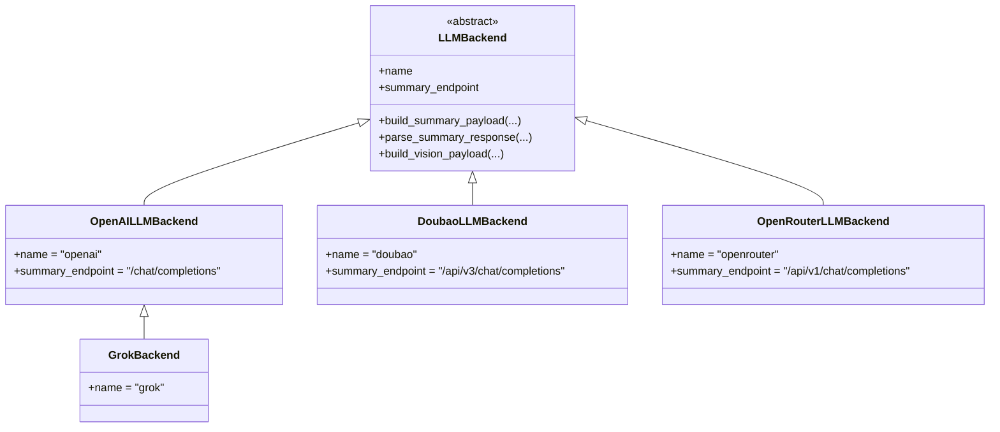
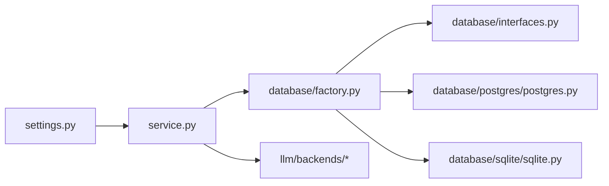

# Configuration Management

<cite>
**Referenced Files in This Document**
- [settings.py](file://src/memu/app/settings.py)
- [service.py](file://src/memu/app/service.py)
- [factory.py](file://src/memu/database/factory.py)
- [interfaces.py](file://src/memu/database/interfaces.py)
- [models.py](file://src/memu/database/models.py)
- [postgres.py](file://src/memu/database/postgres/postgres.py)
- [sqlite.py](file://src/memu/database/sqlite/sqlite.py)
- [openai.py](file://src/memu/llm/backends/openai.py)
- [grok.py](file://src/memu/llm/backends/grok.py)
- [doubao.py](file://src/memu/llm/backends/doubao.py)
- [openrouter.py](file://src/memu/llm/backends/openrouter.py)
- [grok.md](file://docs/providers/grok.md)
- [grok_integration.md](file://docs/integrations/grok.md)
</cite>

## Table of Contents
1. [Introduction](#introduction)
2. [Project Structure](#project-structure)
3. [Core Components](#core-components)
4. [Architecture Overview](#architecture-overview)
5. [Detailed Component Analysis](#detailed-component-analysis)
6. [Dependency Analysis](#dependency-analysis)
7. [Performance Considerations](#performance-considerations)
8. [Troubleshooting Guide](#troubleshooting-guide)
9. [Conclusion](#conclusion)
10. [Appendices](#appendices)

## Introduction
This document explains memU’s configuration management system with a focus on the flexible settings hierarchy, environment variable handling, and profile-based configuration for LLM providers. It covers database configuration options, scope settings for user management, and advanced configuration parameters. You will learn how settings propagate through the system, how defaults are handled, how to override values, and how to manage configuration across development, staging, and production environments. Practical examples are provided via code snippet paths to help you configure different deployment scenarios securely and reliably.

## Project Structure
memU organizes configuration around strongly typed Pydantic models that define:
- LLM provider configuration and profiles
- Database metadata store and vector index configuration
- Retrieval and memory extraction behaviors
- User scope models for multi-agent and multi-session filtering

**Diagram sources**
- [settings.py](file://src/memu/app/settings.py#L102-L139)
- [service.py](file://src/memu/app/service.py#L49-L95)
- [factory.py](file://src/memu/database/factory.py#L15-L44)
- [interfaces.py](file://src/memu/database/interfaces.py#L12-L27)
- [models.py](file://src/memu/database/models.py#L108-L134)
- [postgres.py](file://src/memu/database/postgres/postgres.py#L23-L103)
- [sqlite.py](file://src/memu/database/sqlite/sqlite.py#L25-L145)
- [openai.py](file://src/memu/llm/backends/openai.py#L8-L65)
- [grok.py](file://src/memu/llm/backends/grok.py#L6-L12)
- [doubao.py](file://src/memu/llm/backends/doubao.py#L8-L70)
- [openrouter.py](file://src/memu/llm/backends/openrouter.py#L8-L71)

**Section sources**
- [settings.py](file://src/memu/app/settings.py#L102-L139)
- [service.py](file://src/memu/app/service.py#L49-L95)
- [factory.py](file://src/memu/database/factory.py#L15-L44)

## Core Components
- LLMConfig: Defines provider, base URL, API key placeholder, chat model, client backend, and embedding settings. Includes provider-specific defaults (e.g., Grok).
- LLMProfilesConfig: Manages named profiles keyed by string, ensuring a default profile and an embedding profile.
- DatabaseConfig: Encapsulates metadata store provider, DDL mode, and vector index provider with automatic fallbacks.
- RetrieveConfig and MemorizeConfig: Control retrieval and memory extraction behaviors, including ranking, sufficiency checks, and prompt customization.
- UserConfig and DefaultUserModel: Define the user scope model used to build scoped Pydantic models for records.

Key behaviors:
- Validation and normalization via Pydantic validators and annotated types.
- Automatic provider defaults for LLMConfig (e.g., switching to Grok defaults when provider is set to “grok”).
- Profile-driven client selection and caching in MemoryService.

**Section sources**
- [settings.py](file://src/memu/app/settings.py#L102-L139)
- [settings.py](file://src/memu/app/settings.py#L263-L297)
- [settings.py](file://src/memu/app/settings.py#L310-L322)
- [settings.py](file://src/memu/app/settings.py#L175-L202)
- [settings.py](file://src/memu/app/settings.py#L204-L243)
- [settings.py](file://src/memu/app/settings.py#L249-L258)

## Architecture Overview
The configuration system is layered:
- Settings models define the shape and defaults.
- MemoryService validates and wires settings into runtime components.
- Database factory selects the appropriate backend based on DatabaseConfig.
- LLM backends are selected by provider and client backend, with profile-based overrides.

**Diagram sources**
- [settings.py](file://src/memu/app/settings.py#L263-L297)
- [service.py](file://src/memu/app/service.py#L49-L95)
- [factory.py](file://src/memu/database/factory.py#L15-L44)

## Detailed Component Analysis

### LLM Profiles and Provider Configuration
- Profiles are stored as a dictionary keyed by string. The validator ensures a default profile exists and an embedding profile is present (defaults to the default profile if not provided).
- LLMConfig sets provider defaults for Grok, including base URL and model when provider equals “grok”.
- MemoryService resolves clients per profile lazily and caches them, enabling dynamic routing of chat and embedding calls to different profiles.

**Diagram sources**
- [settings.py](file://src/memu/app/settings.py#L102-L139)
- [settings.py](file://src/memu/app/settings.py#L263-L297)
- [service.py](file://src/memu/app/service.py#L97-L151)

Practical example paths:
- Configure Grok provider defaults and API key: [LLMConfig provider defaults](file://src/memu/app/settings.py#L128-L139)
- Ensure default and embedding profiles exist: [LLMProfilesConfig validator](file://src/memu/app/settings.py#L269-L288)
- Initialize LLM client based on backend: [MemoryService client init](file://src/memu/app/service.py#L97-L136)

**Section sources**
- [settings.py](file://src/memu/app/settings.py#L102-L139)
- [settings.py](file://src/memu/app/settings.py#L263-L297)
- [service.py](file://src/memu/app/service.py#L97-L151)

### Environment Variables and Sensitive Credentials
- API keys are modeled as string fields with sensible defaults. For Grok, the default API key placeholder is aligned with the provider’s environment variable convention.
- Provider-specific documentation describes environment variables and defaults.

Recommended practices:
- Store secrets in environment variables or secret managers, not in code.
- Use provider-specific placeholders (e.g., Grok’s XAI API key) to avoid leaking hardcoded values.
- Rotate keys regularly and restrict access to secrets.

Example paths:
- Grok provider environment variable and defaults: [Provider docs](file://docs/providers/grok.md#L17-L31)
- Grok integration environment variable: [Integration docs](file://docs/integrations/grok.md#L12-L24)

**Section sources**
- [settings.py](file://src/memu/app/settings.py#L108-L109)
- [settings.py](file://src/memu/app/settings.py#L128-L139)
- [grok.md](file://docs/providers/grok.md#L17-L31)
- [grok_integration.md](file://docs/integrations/grok.md#L12-L24)

### Database Configuration Options
- Metadata store provider supports in-memory, PostgreSQL, and SQLite.
- Vector index provider defaults to brute-force unless PostgreSQL is used; pgvector is supported when DSN is provided.
- The factory builds the appropriate backend at runtime.

**Diagram sources**
- [settings.py](file://src/memu/app/settings.py#L314-L322)
- [factory.py](file://src/memu/database/factory.py#L15-L44)

Example paths:
- DatabaseConfig post-init logic: [Vector index defaults](file://src/memu/app/settings.py#L314-L322)
- Provider selection and construction: [Factory](file://src/memu/database/factory.py#L15-L44)
- PostgreSQL store initialization and migrations: [PostgresStore](file://src/memu/database/postgres/postgres.py#L33-L103)
- SQLite store initialization and table creation: [SQLiteStore](file://src/memu/database/sqlite/sqlite.py#L52-L145)

**Section sources**
- [settings.py](file://src/memu/app/settings.py#L300-L322)
- [factory.py](file://src/memu/database/factory.py#L15-L44)
- [postgres.py](file://src/memu/database/postgres/postgres.py#L33-L103)
- [sqlite.py](file://src/memu/database/sqlite/sqlite.py#L52-L145)

### Scope Settings for User Management
- UserConfig defines a user scope model used to build scoped record models.
- Scoped models combine user-defined fields with core record fields, ensuring no conflicts.

**Diagram sources**
- [settings.py](file://src/memu/app/settings.py#L249-L258)
- [models.py](file://src/memu/database/models.py#L35-L41)
- [models.py](file://src/memu/database/models.py#L68-L106)

Example paths:
- User scope model definition: [UserConfig](file://src/memu/app/settings.py#L256-L258)
- Scoped model composition: [merge_scope_model/build_scoped_models](file://src/memu/database/models.py#L108-L134)

**Section sources**
- [settings.py](file://src/memu/app/settings.py#L249-L258)
- [models.py](file://src/memu/database/models.py#L108-L134)

### Retrieval and Memory Extraction Configuration
- RetrieveConfig controls retrieval strategy (RAG or LLM), routing, sufficiency checks, and per-stage top-k.
- MemorizeConfig governs memory type ordering, prompts, category definitions, and summary generation settings.

Example paths:
- Retrieval configuration: [RetrieveConfig](file://src/memu/app/settings.py#L175-L202)
- Memory extraction configuration: [MemorizeConfig](file://src/memu/app/settings.py#L204-L243)

**Section sources**
- [settings.py](file://src/memu/app/settings.py#L175-L202)
- [settings.py](file://src/memu/app/settings.py#L204-L243)

### LLM Provider Backends
- OpenAI-compatible backends share payload building and response parsing patterns.
- Specialized backends (Grok, Doubao, OpenRouter) align with provider-specific endpoints and payloads.

**Diagram sources**
- [openai.py](file://src/memu/llm/backends/openai.py#L8-L65)
- [grok.py](file://src/memu/llm/backends/grok.py#L6-L12)
- [doubao.py](file://src/memu/llm/backends/doubao.py#L8-L70)
- [openrouter.py](file://src/memu/llm/backends/openrouter.py#L8-L71)

**Section sources**
- [openai.py](file://src/memu/llm/backends/openai.py#L8-L65)
- [grok.py](file://src/memu/llm/backends/grok.py#L6-L12)
- [doubao.py](file://src/memu/llm/backends/doubao.py#L8-L70)
- [openrouter.py](file://src/memu/llm/backends/openrouter.py#L8-L71)

## Dependency Analysis
- Settings models are validated and passed into MemoryService, which orchestrates client initialization and database wiring.
- DatabaseConfig drives the factory to instantiate the correct backend, which exposes a unified Database protocol.
- LLMProfilesConfig enables profile-based routing of chat and embedding operations.

**Diagram sources**
- [settings.py](file://src/memu/app/settings.py#L102-L139)
- [service.py](file://src/memu/app/service.py#L49-L95)
- [factory.py](file://src/memu/database/factory.py#L15-L44)
- [interfaces.py](file://src/memu/database/interfaces.py#L12-L27)
- [postgres.py](file://src/memu/database/postgres/postgres.py#L23-L103)
- [sqlite.py](file://src/memu/database/sqlite/sqlite.py#L25-L145)

**Section sources**
- [settings.py](file://src/memu/app/settings.py#L102-L139)
- [service.py](file://src/memu/app/service.py#L49-L95)
- [factory.py](file://src/memu/database/factory.py#L15-L44)

## Performance Considerations
- Embedding batch size: Tune embed_batch_size in LLMConfig to balance throughput and latency for embedding backends.
- Vector index provider: Prefer pgvector for PostgreSQL for efficient similarity search; otherwise, bruteforce is used.
- Client caching: MemoryService caches LLM clients per profile to avoid repeated initialization overhead.
- Connection pooling: For PostgreSQL, ensure adequate pool sizing to support concurrent workloads (see Troubleshooting).

[No sources needed since this section provides general guidance]

## Troubleshooting Guide
Common configuration issues and resolutions:
- Unknown LLM profile: Steps referencing unknown profiles will fail during pipeline registration. Ensure the profile exists in LLMProfilesConfig.
  - Reference: [Pipeline profile validation](file://src/memu/workflow/pipeline.py#L147-L154)
- Missing default or embedding profile: LLMProfilesConfig ensures presence of default and embedding profiles. If absent, the validator adds them.
  - Reference: [LLMProfilesConfig validator](file://src/memu/app/settings.py#L269-L288)
- Provider defaults not applied: When provider is “grok”, base URL and model defaults are applied automatically. Verify provider selection.
  - Reference: [LLMConfig provider defaults](file://src/memu/app/settings.py#L128-L139)
- Database provider mismatch: Ensure vector index provider and DSN are correctly set when using PostgreSQL.
  - Reference: [DatabaseConfig post-init](file://src/memu/app/settings.py#L314-L322)
- Connection pool sizing during deployments: For blue-green deployments, calculate total connections needed across environments and adjust pool sizes accordingly.
  - Reference: [Deployment lessons learned](file://examples/resources/logs/log1.txt#L167-L212)

Security and best practices:
- Use environment variables for API keys; avoid committing secrets.
- Validate configuration at startup using the provided validation helpers.
- Limit exposure of sensitive configuration in logs or error messages.

**Section sources**
- [pipeline.py](file://src/memu/workflow/pipeline.py#L147-L154)
- [settings.py](file://src/memu/app/settings.py#L269-L288)
- [settings.py](file://src/memu/app/settings.py#L128-L139)
- [settings.py](file://src/memu/app/settings.py#L314-L322)
- [log1.txt](file://examples/resources/logs/log1.txt#L167-L212)

## Conclusion
memU’s configuration system centers on strongly typed settings with robust defaults, profile-based LLM routing, and provider-agnostic database wiring. By leveraging Pydantic validation, explicit environment variable handling, and modular backends, teams can confidently deploy and operate memU across diverse environments—from single-developer setups to complex enterprise systems. Apply the examples and guidelines in this document to configure secure, scalable deployments tailored to your needs.

[No sources needed since this section summarizes without analyzing specific files]

## Appendices

### Configuration Scenarios and Examples
- Grok provider setup with environment variable and defaults:
  - [Provider docs](file://docs/providers/grok.md#L17-L31)
  - [Integration docs](file://docs/integrations/grok.md#L12-L24)
- PostgreSQL with pgvector and DDL mode:
  - [PostgresStore](file://src/memu/database/postgres/postgres.py#L33-L103)
  - [DatabaseConfig defaults](file://src/memu/app/settings.py#L314-L322)
- SQLite for lightweight deployments:
  - [SQLiteStore](file://src/memu/database/sqlite/sqlite.py#L52-L145)

[No sources needed since this section aggregates previously cited references]