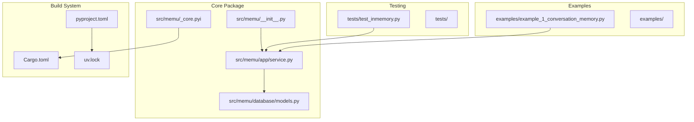

# Contributing Guide

<cite>
**Referenced Files in This Document**
- [CONTRIBUTING.md](file://CONTRIBUTING.md)
- [README.md](file://README.md)
- [pyproject.toml](file://pyproject.toml)
- [Makefile](file://Makefile)
- [.pre-commit-config.yaml](file://.pre-commit-config.yaml)
- [uv.lock](file://uv.lock)
- [Cargo.toml](file://Cargo.toml)
- [setup.cfg](file://setup.cfg)
- [src/memu/__init__.py](file://src/memu/__init__.py)
- [src/memu/_core.pyi](file://src/memu/_core.pyi)
- [src/memu/app/service.py](file://src/memu/app/service.py)
- [src/memu/database/models.py](file://src/memu/database/models.py)
- [tests/test_inmemory.py](file://tests/test_inmemory.py)
- [examples/example_1_conversation_memory.py](file://examples/example_1_conversation_memory.py)
- [.github/PULL_REQUEST_TEMPLATE.md](file://.github/PULL_REQUEST_TEMPLATE.md)
</cite>

## Table of Contents
1. [Introduction](#introduction)
2. [Getting Started](#getting-started)
3. [Development Environment Setup](#development-environment-setup)
4. [Project Structure](#project-structure)
5. [Development Guidelines](#development-guidelines)
6. [Code Standards and Practices](#code-standards-and-practices)
7. [Testing Requirements](#testing-requirements)
8. [Writing Tests](#writing-tests)
9. [Documentation Updates](#documentation-updates)
10. [Pull Request Process](#pull-request-process)
11. [Issue Reporting and Feature Requests](#issue-reporting-and-feature-requests)
12. [Code Quality Tools](#code-quality-tools)
13. [Pre-commit Hooks](#pre-commit-hooks)
14. [Continuous Integration](#continuous-integration)
15. [Release Process and Versioning](#release-process-and-versioning)
16. [Backwards Compatibility](#backwards-compatibility)
17. [Community Engagement](#community-engagement)
18. [Mentorship Opportunities](#mentorship-opportunities)
19. [Troubleshooting Guide](#troubleshooting-guide)
20. [Conclusion](#conclusion)

## Introduction
This guide provides comprehensive instructions for contributing to the memU project. It covers development environment setup using uv, code standards, testing requirements, pull request procedures, and community engagement guidelines. The goal is to help both new and experienced contributors make meaningful contributions efficiently and consistently.

## Getting Started
- **Prerequisites**: Python 3.13+, Git, uv (Python package manager), and a code editor (VS Code recommended)
- **Quick Start**: Fork the repository, clone it locally, and use the provided Makefile targets to install dependencies and run checks

**Section sources**
- [CONTRIBUTING.md](file://CONTRIBUTING.md#L20-L42)
- [README.md](file://README.md#L599-L642)

## Development Environment Setup
The project uses uv for fast dependency management and virtual environment creation. The Makefile automates common tasks like installing dependencies, running checks, and executing tests.

Key setup steps:
1. Fork and clone the repository
2. Install dependencies using `make install`
3. Verify setup by running `make check` and `make test`

The Makefile integrates uv with pre-commit hooks and provides shortcuts for:
- `make install`: Creates virtual environment and installs dependencies
- `make check`: Lock file verification, pre-commit hooks, mypy, and deptry
- `make test`: Runs pytest with coverage

**Section sources**
- [CONTRIBUTING.md](file://CONTRIBUTING.md#L26-L51)
- [Makefile](file://Makefile#L1-L23)

## Project Structure
The repository follows a modular structure with clear separation of concerns:

- **src/memu/**: Core Python package containing the main application logic
- **tests/**: Unit and integration tests
- **examples/**: Usage examples and demonstrations
- **docs/**: Architectural decision records and integration guides
- **.github/**: GitHub templates and workflows

The Rust-based core is exposed through Python bindings using PyO3 with ABI stability targeting Python 3.13+.

**Diagram sources**
- [src/memu/__init__.py](file://src/memu/__init__.py#L1-L10)
- [src/memu/app/service.py](file://src/memu/app/service.py#L1-L200)
- [src/memu/database/models.py](file://src/memu/database/models.py#L1-L149)
- [Cargo.toml](file://Cargo.toml#L1-L15)
- [pyproject.toml](file://pyproject.toml#L1-L181)

**Section sources**
- [src/memu/__init__.py](file://src/memu/__init__.py#L1-L10)
- [src/memu/_core.pyi](file://src/memu/_core.pyi#L1-L2)
- [Cargo.toml](file://Cargo.toml#L1-L15)

## Development Guidelines
The project emphasizes clean, maintainable code with strong typing and comprehensive testing. Core guidelines include:

- Follow PEP 8 Python style guidelines
- Use Ruff for code formatting and linting (line length: 120)
- Implement type hints for all functions and methods
- Write docstrings for public APIs
- Maintain test coverage > 80%
- All code must pass linting (ruff, mypy)
- Use meaningful variable and function names
- Keep functions focused and small
- Follow SOLID principles

**Section sources**
- [CONTRIBUTING.md](file://CONTRIBUTING.md#L54-L66)

## Code Standards and Practices
### Python Coding Standards
- **Style**: PEP 8 compliance with Ruff enforcement
- **Formatting**: Line length 120 characters
- **Type Hints**: Required for all public APIs
- **Docstrings**: Required for public functions and classes
- **Naming**: Descriptive and consistent naming conventions

### Architecture Principles
- **Modular Design**: Clear separation between LLM clients, database layers, and workflow managers
- **Extensibility**: Pluggable architecture supporting multiple providers and storage backends
- **Type Safety**: Heavy use of Pydantic models for data validation
- **Async/Await**: Consistent async programming model throughout

**Section sources**
- [CONTRIBUTING.md](file://CONTRIBUTING.md#L54-L66)
- [src/memu/app/service.py](file://src/memu/app/service.py#L1-L200)

## Testing Requirements
The project maintains high test coverage with comprehensive testing strategies:

### Test Execution
- Run all tests: `make test`
- Direct pytest execution: `uv run python -m pytest`
- Coverage reporting: `uv run python -m pytest --cov --cov-config=pyproject.toml --cov-report=html`
- Specific test files: `uv run python -m pytest tests/rust_entry_test.py`
- Filtered execution: `uv run python -m pytest -m "not slow"`

### Test Categories
- **Unit Tests**: Individual component testing with mocks
- **Integration Tests**: End-to-end workflow testing
- **Database Tests**: Storage backend validation
- **Provider Tests**: LLM and embedding provider compatibility

**Section sources**
- [CONTRIBUTING.md](file://CONTRIBUTING.md#L67-L84)
- [Makefile](file://Makefile#L19-L23)

## Writing Tests
### Test Structure and Organization
Tests are organized by functional area with clear naming conventions:

- **Location**: tests/ directory
- **Naming**: test_*.py for unit tests, *_test.py for integration tests
- **Async Support**: pytest-asyncio for async test functions
- **Coverage**: pytest-cov for coverage reporting

### Best Practices for Test Writing
1. **Isolation**: Each test should be independent
2. **Descriptive Names**: Clear test method names indicating expected behavior
3. **Setup/Teardown**: Proper test lifecycle management
4. **Mock External Dependencies**: Use fixtures for external services
5. **Edge Cases**: Comprehensive coverage of boundary conditions

**Section sources**
- [tests/test_inmemory.py](file://tests/test_inmemory.py#L1-L90)

## Documentation Updates
### Documentation Structure
The project maintains documentation in multiple formats:

- **API Documentation**: Built from docstrings using mkdocstrings
- **Tutorials**: Step-by-step guides in docs/tutorials/
- **Integration Guides**: Provider-specific documentation
- **Architecture Decision Records**: docs/adr/ directory

### Update Procedures
1. **Source Location**: Update docstrings in source code
2. **Build Process**: Use mkdocs material for site generation
3. **Examples**: Keep examples in examples/ directory synchronized
4. **Versioning**: Update version information in pyproject.toml

**Section sources**
- [pyproject.toml](file://pyproject.toml#L50-L55)

## Pull Request Process
### Branch Strategy
- Create feature branches: `feature/your-feature-name`
- Bug fix branches: `bugfix/issue-description`
- Keep branches focused and atomic

### PR Requirements
1. **Conventional Commits**: Use format: `type(scope): description`
2. **Description**: Clear problem statement and solution approach
3. **Testing**: Include tests for new functionality
4. **Documentation**: Update docs as needed
5. **Coverage**: Maintain or improve test coverage

### Review Process
- **Response Time**: Prompt responses to review comments
- **Changes**: Make requested changes in new commits (avoid force pushes)
- **Communication**: Ask questions if feedback is unclear

**Section sources**
- [CONTRIBUTING.md](file://CONTRIBUTING.md#L106-L157)
- [.github/PULL_REQUEST_TEMPLATE.md](file://.github/PULL_REQUEST_TEMPLATE.md#L1-L45)

## Issue Reporting and Feature Requests
### Bug Report Template
Include in bug reports:
- Environment details (Python version, OS, MemU version)
- Reproduction steps with minimal code example
- Expected vs actual behavior
- Error messages or stack traces

### Feature Request Template
Include in feature requests:
- Problem statement and context
- Proposed solution or approach
- Alternative solutions considered
- Use cases and examples

### Issue Labels
- `good first issue`: Perfect for newcomers
- `help wanted`: Extra attention needed
- `bug`: Something isn't working
- `enhancement`: New feature request
- `documentation`: Improvements to docs
- `performance`: Performance optimization

**Section sources**
- [CONTRIBUTING.md](file://CONTRIBUTING.md#L92-L185)

## Code Quality Tools
### Static Analysis
- **mypy**: Static type checking with strict configuration
- **Ruff**: Fast Python linter and formatter
- **deptry**: Dependency analysis to detect unused packages

### Configuration Details
- **mypy**: Strict mode with disallow_any_unimported and show_error_codes
- **Ruff**: Line length 120, comprehensive rule set
- **Coverage**: Minimum 80% coverage requirement

**Section sources**
- [pyproject.toml](file://pyproject.toml#L86-L116)
- [setup.cfg](file://setup.cfg#L1-L19)

## Pre-commit Hooks
The project uses pre-commit hooks for automated quality checks:

### Hook Configuration
- **File Validation**: YAML, TOML, JSON formatting
- **Code Quality**: Ruff linting and formatting
- **Merge Conflict Detection**: Automated conflict resolution
- **Case Conflicts**: File naming consistency

### Hook Execution
- Install hooks: `uv run pre-commit install`
- Manual execution: `uv run pre-commit run -a`
- Auto-fix capabilities: Ruff can automatically fix issues

**Section sources**
- [.pre-commit-config.yaml](file://.pre-commit-config.yaml#L1-L21)
- [Makefile](file://Makefile#L5-L5)

## Continuous Integration
### CI Requirements
- **Lock File Verification**: Ensure pyproject.toml consistency
- **Code Quality Checks**: All pre-commit hooks must pass
- **Type Checking**: mypy must succeed
- **Dependency Analysis**: deptry must pass
- **Test Coverage**: Minimum 80% coverage maintained

### Build System Integration
- **uv.lock**: Pin all dependencies for reproducible builds
- **Cargo.toml**: Rust core compilation with PyO3
- **Maturin**: Python wheel building

**Section sources**
- [Makefile](file://Makefile#L7-L16)
- [uv.lock](file://uv.lock#L1-L615)
- [Cargo.toml](file://Cargo.toml#L1-L15)

## Release Process and Versioning
### Versioning Strategy
- **Semantic Versioning**: MAJOR.MINOR.PATCH
- **Version Source**: Centralized in pyproject.toml
- **ABI Stability**: Rust core uses Python 3.13 ABI

### Release Workflow
1. **Version Bump**: Update version in pyproject.toml
2. **Changelog**: Document changes and breaking changes
3. **Tag Creation**: Git tag for release
4. **Package Build**: Build wheels with Maturin
5. **Distribution**: Publish to PyPI

**Section sources**
- [pyproject.toml](file://pyproject.toml#L3-L3)
- [Cargo.toml](file://Cargo.toml#L3-L3)

## Backwards Compatibility
### Compatibility Guarantees
- **Python 3.13+**: Minimum supported version
- **ABI Stability**: Rust core maintains Python 3.13 ABI
- **Breaking Changes**: Clearly documented with migration guides
- **Deprecation Policy**: Graceful deprecation periods

### Migration Strategies
- **Gradual Updates**: Support both old and new APIs during transition
- **Automated Migration**: Provide scripts for common migrations
- **Documentation**: Clear upgrade instructions

**Section sources**
- [Cargo.toml](file://Cargo.toml#L12-L14)
- [pyproject.toml](file://pyproject.toml#L10-L18)

## Community Engagement
### Communication Channels
- **Discord**: Real-time chat and quick questions
- **GitHub Discussions**: Feature discussions and Q&A
- **GitHub Issues**: Bug reports and feature requests
- **Email**: Private inquiries and security reports

### Community Guidelines
- **Respectful Interaction**: Follow code of conduct
- **Help Others**: Share knowledge and best practices
- **Celebrate Diversity**: Welcome different perspectives

**Section sources**
- [CONTRIBUTING.md](file://CONTRIBUTING.md#L215-L231)

## Mentorship Opportunities
### Getting Help
- **New Contributors**: Use `good first issue` labels
- **Technical Guidance**: Reach out via Discord or GitHub discussions
- **Pair Programming**: Available upon request
- **Documentation**: Extensive examples and tutorials

### Learning Resources
- **Examples Directory**: Comprehensive usage examples
- **Architecture Docs**: ADRs explaining design decisions
- **API Reference**: Generated from docstrings
- **Integration Guides**: Provider-specific setup instructions

**Section sources**
- [CONTRIBUTING.md](file://CONTRIBUTING.md#L223-L240)

## Troubleshooting Guide
### Common Issues and Solutions
1. **Dependency Conflicts**: Run `make install` to recreate virtual environment
2. **Type Checking Failures**: Use `make check` to identify issues
3. **Test Failures**: Run specific failing tests with verbose output
4. **Coverage Issues**: Add missing test cases for uncovered functions

### Debugging Tools
- **Verbose Logging**: Enable pytest logging with `-v` flag
- **Coverage Analysis**: Use HTML reports for detailed coverage analysis
- **Static Analysis**: Ruff provides specific error locations and fixes

**Section sources**
- [CONTRIBUTING.md](file://CONTRIBUTING.md#L186-L199)

## Conclusion
This contributing guide provides a comprehensive framework for participating in the memU project. By following these guidelines, contributors can ensure their work integrates smoothly with the existing codebase while maintaining high standards for quality, documentation, and community engagement. The project welcomes contributions of all kinds and provides structured pathways for new contributors to become valuable members of the community.