# Core Concepts

<cite>
**Referenced Files in This Document**
- [src/memu/__init__.py](file://src/memu/__init__.py)
- [src/memu/_core.pyi](file://src/memu/_core.pyi)
- [src/memu/database/models.py](file://src/memu/database/models.py)
- [src/memu/database/interfaces.py](file://src/memu/database/interfaces.py)
- [src/memu/database/factory.py](file://src/memu/database/factory.py)
- [src/memu/app/service.py](file://src/memu/app/service.py)
- [src/memu/app/memorize.py](file://src/memu/app/memorize.py)
- [src/memu/app/retrieve.py](file://src/memu/app/retrieve.py)
- [src/memu/app/settings.py](file://src/memu/app/settings.py)
- [src/memu/workflow/pipeline.py](file://src/memu/workflow/pipeline.py)
- [src/memu/workflow/runner.py](file://src/memu/workflow/runner.py)
- [src/memu/workflow/step.py](file://src/memu/workflow/step.py)
- [src/memu/llm/backends/base.py](file://src/memu/llm/backends/base.py)
- [src/memu/embedding/backends/base.py](file://src/memu/embedding/backends/base.py)
- [examples/proactive/proactive.py](file://examples/proactive/proactive.py)
</cite>

## Table of Contents
1. [Introduction](#introduction)
2. [Project Structure](#project-structure)
3. [Core Components](#core-components)
4. [Architecture Overview](#architecture-overview)
5. [Detailed Component Analysis](#detailed-component-analysis)
6. [Dependency Analysis](#dependency-analysis)
7. [Performance Considerations](#performance-considerations)
8. [Troubleshooting Guide](#troubleshooting-guide)
9. [Conclusion](#conclusion)

## Introduction
This document explains memU’s core architecture and design principles with a focus on:
- The memory layers: Resource, Item, Category
- The memory-as-file-system paradigm and how it relates to the three layers
- Proactive memory lifecycle and the dual-mode retrieval system (RAG vs LLM-based)
- The workflow pipeline architecture and how memory flows from ingestion to retrieval
- Provider abstraction for LLMs and embeddings
- Scope management for user contexts
- Storage backends and their relationships

The goal is to give beginners a clear mental model while providing experienced developers the technical depth to implement custom features and integrate new providers or backends.

## Project Structure
At a high level, memU is organized around:
- Application service and mixins for memory ingestion and retrieval
- A pluggable workflow pipeline engine
- A provider-agnostic database layer with multiple storage backends
- Provider abstractions for LLMs and embeddings
- Settings and configuration models for memory categories, retrieval, and memorization

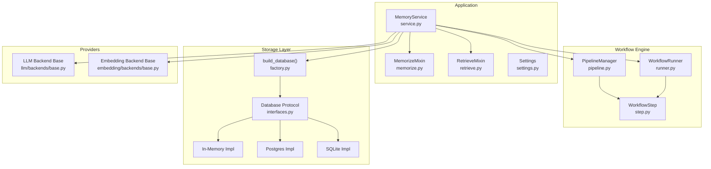

**Diagram sources**
- [src/memu/app/service.py](file://src/memu/app/service.py#L49-L95)
- [src/memu/app/memorize.py](file://src/memu/app/memorize.py#L97-L166)
- [src/memu/app/retrieve.py](file://src/memu/app/retrieve.py#L106-L210)
- [src/memu/workflow/pipeline.py](file://src/memu/workflow/pipeline.py#L21-L49)
- [src/memu/workflow/runner.py](file://src/memu/workflow/runner.py#L28-L39)
- [src/memu/workflow/step.py](file://src/memu/workflow/step.py#L16-L38)
- [src/memu/database/factory.py](file://src/memu/database/factory.py#L15-L43)
- [src/memu/database/interfaces.py](file://src/memu/database/interfaces.py#L12-L26)
- [src/memu/llm/backends/base.py](file://src/memu/llm/backends/base.py#L6-L31)
- [src/memu/embedding/backends/base.py](file://src/memu/embedding/backends/base.py#L6-L17)

**Section sources**
- [src/memu/app/service.py](file://src/memu/app/service.py#L49-L95)
- [src/memu/workflow/pipeline.py](file://src/memu/workflow/pipeline.py#L21-L49)
- [src/memu/database/factory.py](file://src/memu/database/factory.py#L15-L43)

## Core Components
This section introduces the foundational building blocks that underpin memU.

- Memory Layers
  - Resource: Represents a source artifact (e.g., a file or URL) with associated metadata and optional embeddings.
  - MemoryItem: Represents a piece of memory extracted from a Resource, with a memory type (profile, event, knowledge, behavior, skill, tool), summary, and optional embeddings.
  - MemoryCategory: Represents a semantic bucket grouping related MemoryItems, with optional summary and embeddings.

- Memory-as-File-System Paradigm
  - Resources are ingested from URLs or local paths and preprocessed into one or more logical segments.
  - Items are extracted from Resources and linked to Categories.
  - Categories summarize related Items and can reference specific Items for richer recall.

- Dual-Mode Retrieval
  - RAG mode: Uses vector similarity at each tier (Category → Item → Resource) with optional sufficiency checks.
  - LLM mode: Delegates ranking to the LLM at each tier, optionally using category references to narrow recall.

- Workflow Pipeline
  - Steps are composable units with explicit requires/produces sets and capability tags.
  - Pipelines are registered and can be mutated at runtime (insert/replace/remove steps, update configs).
  - Execution is delegated to a runner backend (local/sync supported; extensible).

- Provider Abstraction
  - LLMBackend defines payload construction and response parsing for chat/summary/vision.
  - EmbeddingBackend defines payload construction and response parsing for embeddings.
  - Clients are lazily initialized and cached per profile; wrappers add interception and metadata.

- Scope Management
  - User scope is modeled as a Pydantic model; filters are validated against user-defined fields.
  - Scoped models are built dynamically by merging user scope with core records.

**Section sources**
- [src/memu/database/models.py](file://src/memu/database/models.py#L68-L106)
- [src/memu/app/memorize.py](file://src/memu/app/memorize.py#L97-L166)
- [src/memu/app/retrieve.py](file://src/memu/app/retrieve.py#L106-L210)
- [src/memu/workflow/pipeline.py](file://src/memu/workflow/pipeline.py#L21-L49)
- [src/memu/workflow/step.py](file://src/memu/workflow/step.py#L16-L38)
- [src/memu/llm/backends/base.py](file://src/memu/llm/backends/base.py#L6-L31)
- [src/memu/embedding/backends/base.py](file://src/memu/embedding/backends/base.py#L6-L17)
- [src/memu/app/settings.py](file://src/memu/app/settings.py#L249-L258)

## Architecture Overview
The system orchestrates memory from ingestion to retrieval through a pipeline-driven architecture. MemoryService coordinates:
- LLM and embedding clients (HTTP/SKD/LazyLLM)
- Storage backends (in-memory, PostgreSQL with pgvector, SQLite)
- Workflow pipelines for memorize and retrieve
- Interceptors for observability and policy enforcement

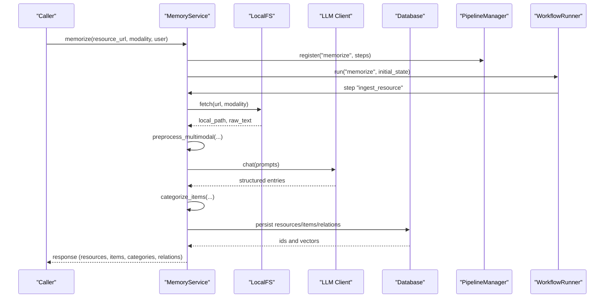

**Diagram sources**
- [src/memu/app/service.py](file://src/memu/app/service.py#L315-L348)
- [src/memu/app/memorize.py](file://src/memu/app/memorize.py#L97-L166)
- [src/memu/workflow/runner.py](file://src/memu/workflow/runner.py#L28-L39)
- [src/memu/workflow/step.py](file://src/memu/workflow/step.py#L50-L101)

## Detailed Component Analysis

### Memory Layers and the Memory-as-File-System Paradigm
- Resource
  - Stores the source URL, modality, local path, optional caption, and optional embedding.
  - Used as the atomic unit for retrieval and indexing.
- MemoryItem
  - Captures extracted memory with a memory type, summary, and embedding.
  - Supports reinforcement tracking and metadata for specialized types (e.g., tools).
- MemoryCategory
  - Groups related items and supports optional summaries and embeddings.
  - Summaries can include inline references to items for precise recall.

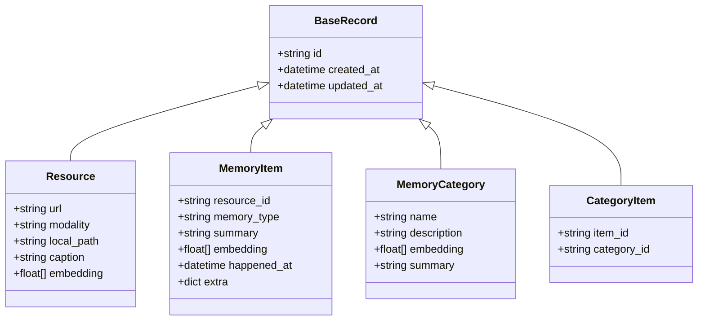

**Diagram sources**
- [src/memu/database/models.py](file://src/memu/database/models.py#L35-L106)

**Section sources**
- [src/memu/database/models.py](file://src/memu/database/models.py#L68-L106)

### Proactive Memory Lifecycle
The proactive lifecycle ties memory capture into ongoing workflows. It demonstrates how a continuous stream of conversation messages is periodically captured and persisted.

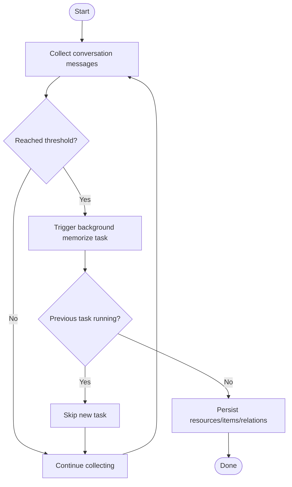

**Diagram sources**
- [examples/proactive/proactive.py](file://examples/proactive/proactive.py#L20-L123)

**Section sources**
- [examples/proactive/proactive.py](file://examples/proactive/proactive.py#L20-L123)

### Dual-Mode Retrieval System (RAG vs LLM-Based)
- RAG Mode
  - Routes intent, ranks categories by summary embeddings, checks sufficiency, then recalls items and resources via vector search, optionally rewriting queries between tiers.
- LLM Mode
  - Routes intent, asks the LLM to rank categories, then uses LLM to rank items (optionally using category references), then resources; sufficiency checks can also be LLM-driven.

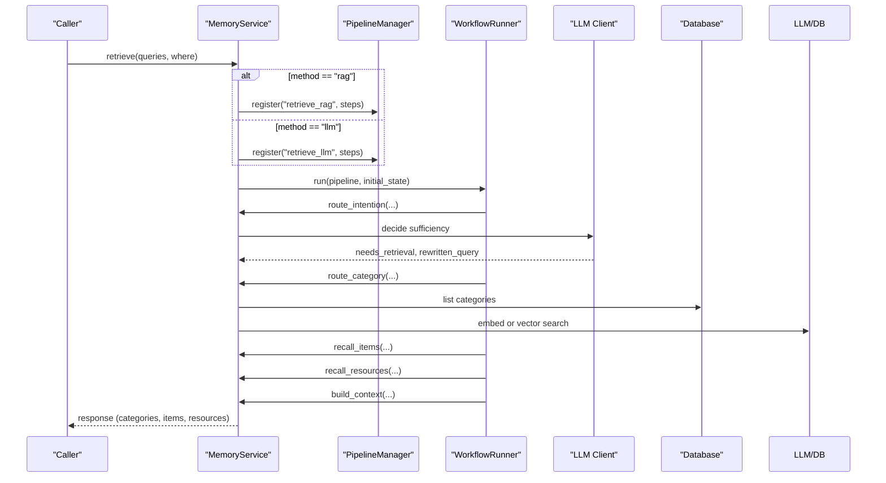

**Diagram sources**
- [src/memu/app/service.py](file://src/memu/app/service.py#L315-L348)
- [src/memu/app/retrieve.py](file://src/memu/app/retrieve.py#L106-L210)
- [src/memu/workflow/runner.py](file://src/memu/workflow/runner.py#L28-L39)

**Section sources**
- [src/memu/app/retrieve.py](file://src/memu/app/retrieve.py#L42-L85)
- [src/memu/app/retrieve.py](file://src/memu/app/retrieve.py#L106-L210)
- [src/memu/app/retrieve.py](file://src/memu/app/retrieve.py#L454-L536)

### Workflow Pipeline Architecture
- PipelineManager registers named pipelines with ordered steps and validates capabilities, required/produced state keys, and profile availability.
- WorkflowRunner executes steps sequentially, invoking before/after/on-error interceptors.
- Steps declare capabilities (e.g., io, llm, vector, db) enabling runtime routing and backend selection.

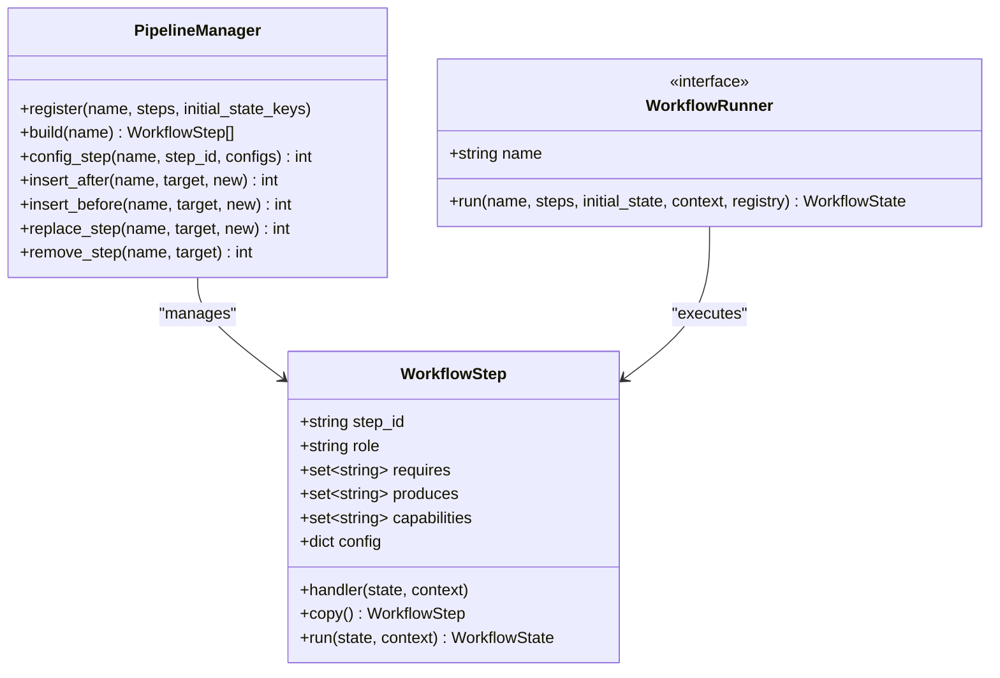

**Diagram sources**
- [src/memu/workflow/pipeline.py](file://src/memu/workflow/pipeline.py#L21-L171)
- [src/memu/workflow/step.py](file://src/memu/workflow/step.py#L16-L48)
- [src/memu/workflow/runner.py](file://src/memu/workflow/runner.py#L12-L26)

**Section sources**
- [src/memu/workflow/pipeline.py](file://src/memu/workflow/pipeline.py#L21-L171)
- [src/memu/workflow/step.py](file://src/memu/workflow/step.py#L16-L48)
- [src/memu/workflow/runner.py](file://src/memu/workflow/runner.py#L12-L26)

### Provider Abstraction for LLMs and Embeddings
- LLMBackend defines standardized methods for building chat/summary/vision payloads and parsing responses.
- EmbeddingBackend defines standardized methods for building embedding payloads and parsing vectors.
- MemoryService lazily initializes clients per profile and wraps them for interception and metadata.

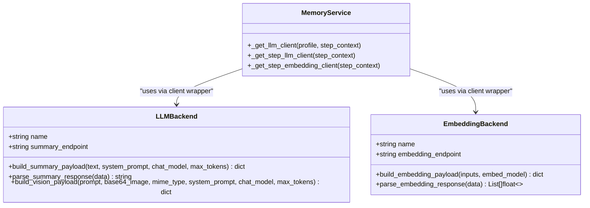

**Diagram sources**
- [src/memu/llm/backends/base.py](file://src/memu/llm/backends/base.py#L6-L31)
- [src/memu/embedding/backends/base.py](file://src/memu/embedding/backends/base.py#L6-L17)
- [src/memu/app/service.py](file://src/memu/app/service.py#L97-L151)

**Section sources**
- [src/memu/llm/backends/base.py](file://src/memu/llm/backends/base.py#L6-L31)
- [src/memu/embedding/backends/base.py](file://src/memu/embedding/backends/base.py#L6-L17)
- [src/memu/app/service.py](file://src/memu/app/service.py#L97-L151)

### Scope Management for User Contexts
- UserConfig holds a Pydantic model type that defines the user scope schema.
- Filters passed to retrieval are validated against the user model fields to prevent invalid queries.
- Scoped models are dynamically constructed by merging user scope with core records.

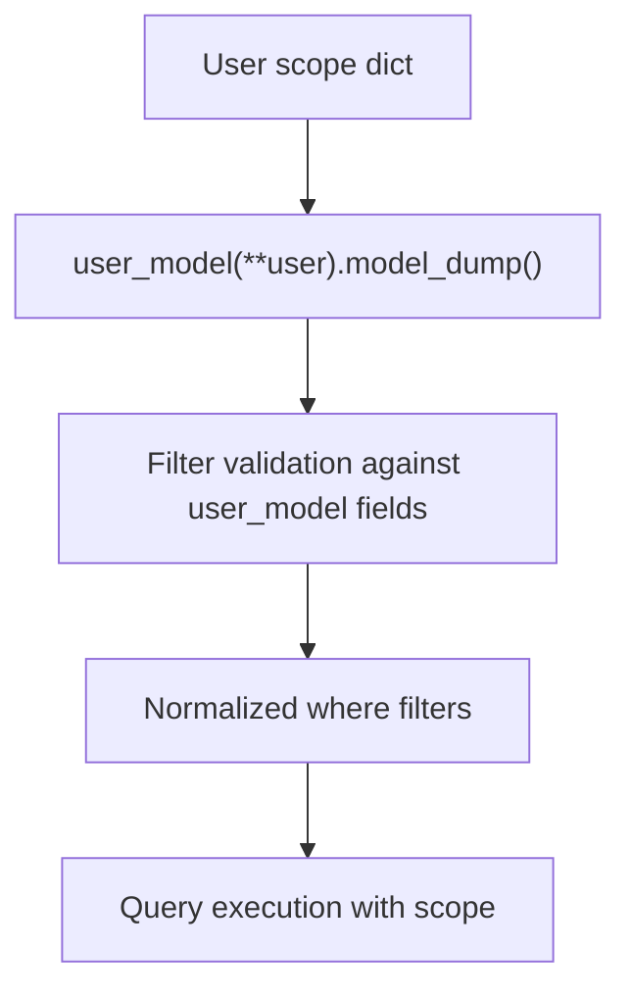

**Diagram sources**
- [src/memu/app/retrieve.py](file://src/memu/app/retrieve.py#L87-L104)
- [src/memu/database/models.py](file://src/memu/database/models.py#L124-L134)

**Section sources**
- [src/memu/app/retrieve.py](file://src/memu/app/retrieve.py#L87-L104)
- [src/memu/database/models.py](file://src/memu/database/models.py#L124-L134)

### Relationship Between Storage Backends
- build_database selects the backend based on configuration:
  - inmemory: ephemeral, no persistence
  - postgres: persistent with optional pgvector
  - sqlite: lightweight, file-based
- The Database protocol exposes repositories for resources, categories, items, and relations, enabling a uniform API regardless of backend.

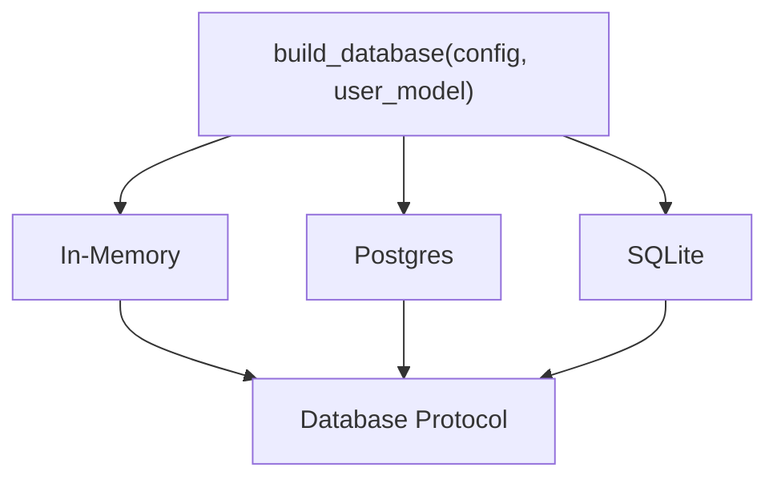

**Diagram sources**
- [src/memu/database/factory.py](file://src/memu/database/factory.py#L15-L43)
- [src/memu/database/interfaces.py](file://src/memu/database/interfaces.py#L12-L26)

**Section sources**
- [src/memu/database/factory.py](file://src/memu/database/factory.py#L15-L43)
- [src/memu/database/interfaces.py](file://src/memu/database/interfaces.py#L12-L26)

### Memory Flow From Ingestion to Retrieval
- Ingestion (Memorize)
  - Fetch resource, preprocess multimodal content, extract structured entries, deduplicate/merge, categorize items, persist and index, summarize categories, and emit a response.
- Retrieval (RAG/LLM)
  - Route intent, optionally rewrite query, rank categories, check sufficiency, recall items and resources, and build a contextualized response.

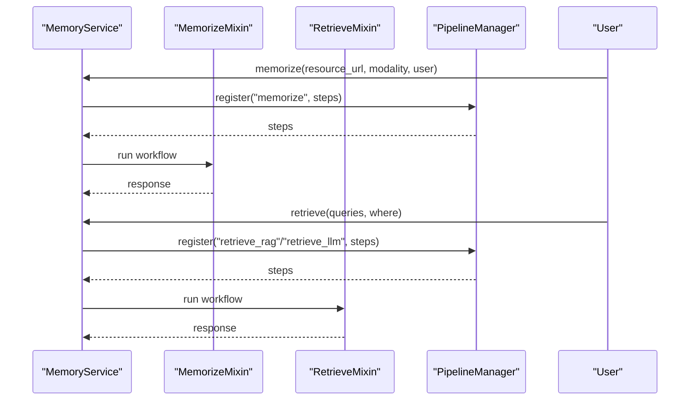

**Diagram sources**
- [src/memu/app/memorize.py](file://src/memu/app/memorize.py#L65-L95)
- [src/memu/app/retrieve.py](file://src/memu/app/retrieve.py#L42-L85)
- [src/memu/app/service.py](file://src/memu/app/service.py#L315-L348)

**Section sources**
- [src/memu/app/memorize.py](file://src/memu/app/memorize.py#L65-L95)
- [src/memu/app/retrieve.py](file://src/memu/app/retrieve.py#L42-L85)
- [src/memu/app/service.py](file://src/memu/app/service.py#L315-L348)

## Dependency Analysis
- Coupling and Cohesion
  - MemoryService aggregates concerns (clients, pipelines, runners, databases) but delegates implementation to mixins and protocols, keeping cohesion high within each module.
- External Dependencies
  - LLM and embedding clients are pluggable; database backends are selected at runtime via a factory.
- Potential Circular Dependencies
  - None observed among the analyzed modules; protocol-based interfaces decouple consumers from implementations.

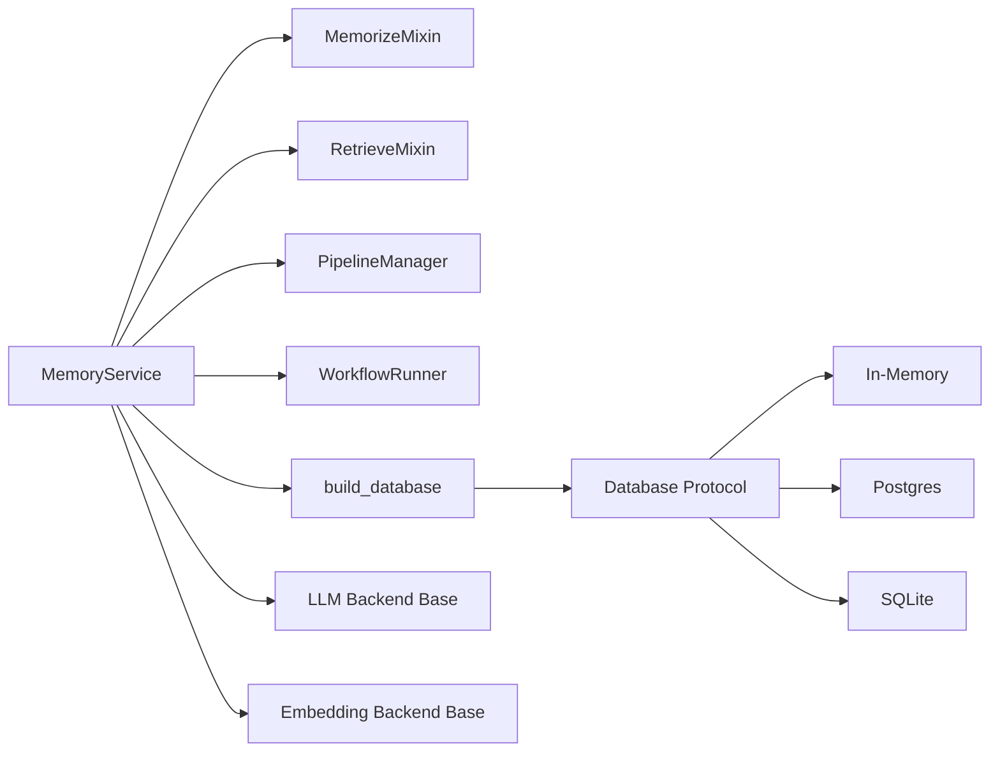

**Diagram sources**
- [src/memu/app/service.py](file://src/memu/app/service.py#L49-L95)
- [src/memu/database/factory.py](file://src/memu/database/factory.py#L15-L43)
- [src/memu/database/interfaces.py](file://src/memu/database/interfaces.py#L12-L26)
- [src/memu/llm/backends/base.py](file://src/memu/llm/backends/base.py#L6-L31)
- [src/memu/embedding/backends/base.py](file://src/memu/embedding/backends/base.py#L6-L17)

**Section sources**
- [src/memu/app/service.py](file://src/memu/app/service.py#L49-L95)
- [src/memu/database/factory.py](file://src/memu/database/factory.py#L15-L43)
- [src/memu/database/interfaces.py](file://src/memu/database/interfaces.py#L12-L26)

## Performance Considerations
- Vector Search Efficiency
  - Use appropriate top_k per tier to balance recall and latency.
  - Prefer pgvector for production-grade vector search when using PostgreSQL.
- Embedding Batch Size
  - Adjust embed_batch_size for SDK-based clients to optimize throughput.
- Client Caching
  - LLM clients are cached per profile to avoid repeated initialization overhead.
- Interceptors and Workflows
  - Keep interceptors lightweight; heavy logic should be deferred to dedicated steps.

## Troubleshooting Guide
- Unknown filter field for user scope
  - Ensure the where clause keys match the user model fields; otherwise, a validation error is raised.
- Missing required keys in workflow state
  - Verify that prior steps produced the required keys declared by subsequent steps.
- Unknown workflow runner or profile
  - Register custom runners via the provided registration mechanism and ensure profile names exist.
- Unsupported metadata_store provider
  - Only inmemory, postgres, and sqlite are supported; ensure configuration matches one of these.

**Section sources**
- [src/memu/app/retrieve.py](file://src/memu/app/retrieve.py#L87-L104)
- [src/memu/workflow/pipeline.py](file://src/memu/workflow/pipeline.py#L131-L164)
- [src/memu/workflow/runner.py](file://src/memu/workflow/runner.py#L61-L81)
- [src/memu/database/factory.py](file://src/memu/database/factory.py#L42-L43)

## Conclusion
memU’s architecture centers on three memory layers—Resource, Item, and Category—organized as a memory-as-file-system paradigm. The dual-mode retrieval system (RAG and LLM-based) provides flexibility in how relevance is determined, while the workflow pipeline offers composability and runtime configurability. Provider abstractions for LLMs and embeddings, combined with pluggable storage backends, enable extensibility. Scope management ensures safe and predictable filtering of memory across user contexts. Together, these design choices deliver a robust foundation for building proactive, context-aware memory systems.