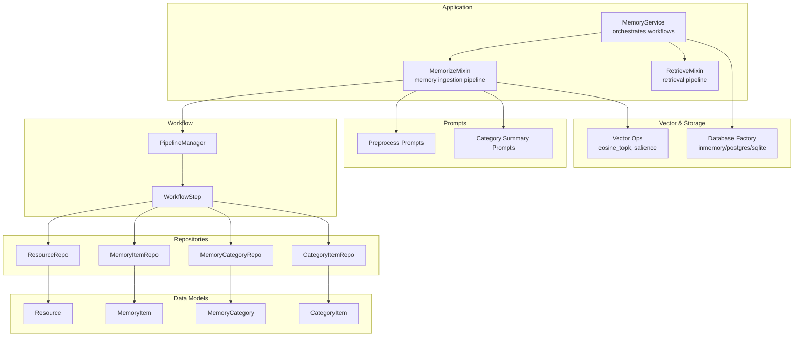
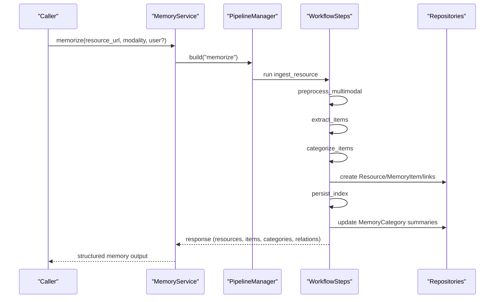
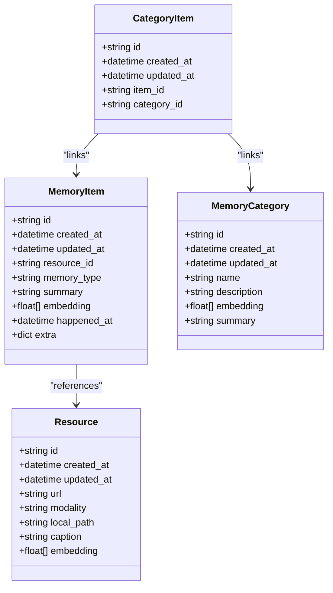
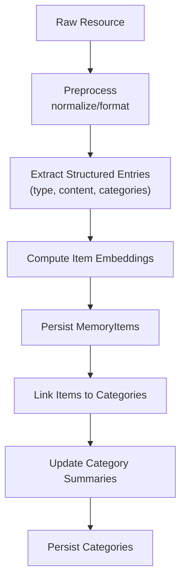
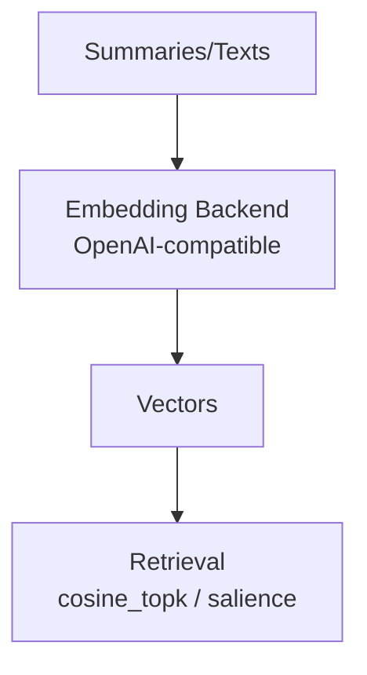
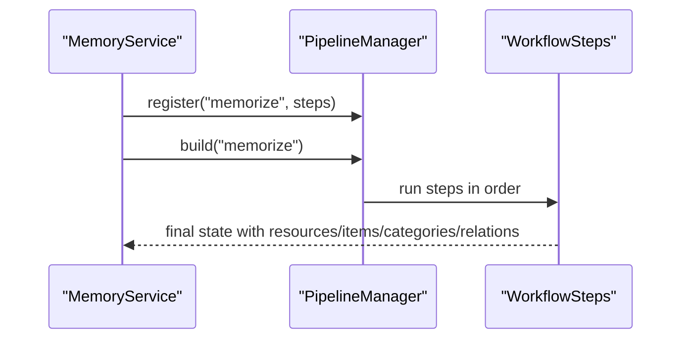
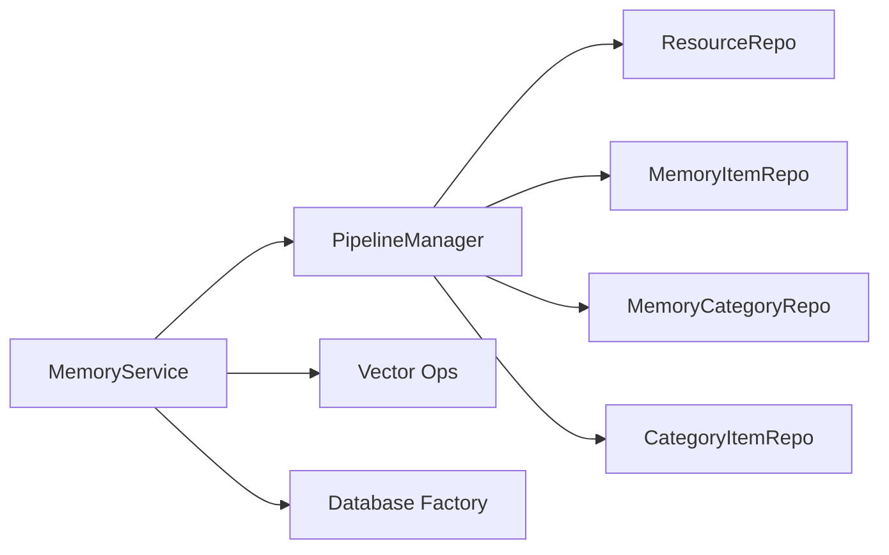

# Memory Layers Architecture

<cite>
**Referenced Files in This Document**
- [models.py](file://src/memu/database/models.py)
- [memory_item.py](file://src/memu/database/repositories/memory_item.py)
- [memory_category.py](file://src/memu/database/repositories/memory_category.py)
- [category_item.py](file://src/memu/database/repositories/category_item.py)
- [resource.py](file://src/memu/database/repositories/resource.py)
- [memorize.py](file://src/memu/app/memorize.py)
- [service.py](file://src/memu/app/service.py)
- [pipeline.py](file://src/memu/workflow/pipeline.py)
- [conversation.py](file://src/memu/utils/conversation.py)
- [conversation.py (preprocess)](file://src/memu/prompts/preprocess/conversation.py)
- [category_summary.py](file://src/memu/prompts/category_summary/category.py)
- [vector.py](file://src/memu/database/inmemory/vector.py)
- [factory.py](file://src/memu/database/factory.py)
- [openai.py](file://src/memu/embedding/backends/openai.py)
</cite>

## Table of Contents
1. [Introduction](#introduction)
2. [Project Structure](#project-structure)
3. [Core Components](#core-components)
4. [Architecture Overview](#architecture-overview)
5. [Detailed Component Analysis](#detailed-component-analysis)
6. [Dependency Analysis](#dependency-analysis)
7. [Performance Considerations](#performance-considerations)
8. [Troubleshooting Guide](#troubleshooting-guide)
9. [Conclusion](#conclusion)

## Introduction
This document explains memU’s hierarchical memory architecture that organizes knowledge across three layers:
- Resource layer: raw input artifacts (e.g., conversation transcripts, documents, images, audio).
- Memory Item layer: atomic extracted memories with embeddings.
- Memory Category layer: topic summaries and relationships, forming a knowledge graph via item-to-category links.

The system transforms raw inputs into fine-grained memories, aggregates them into categories, and maintains both precise retrieval and high-level semantic understanding. It supports pluggable storage and vector backends, embeddings, and modular workflows.

## Project Structure
The memory layers are implemented through typed Pydantic models, repository protocols, a workflow engine, and prompts. Storage backends are selected via a factory, and vector operations are provided by an in-memory module optimized for cosine similarity and salience-aware ranking.



**Diagram sources**
- [service.py](file://src/memu/app/service.py#L49-L349)
- [memorize.py](file://src/memu/app/memorize.py#L97-L166)
- [pipeline.py](file://src/memu/workflow/pipeline.py#L21-L171)
- [models.py](file://src/memu/database/models.py#L68-L106)
- [resource.py](file://src/memu/database/repositories/resource.py#L9-L31)
- [memory_item.py](file://src/memu/database/repositories/memory_item.py#L9-L55)
- [memory_category.py](file://src/memu/database/repositories/memory_category.py#L9-L34)
- [category_item.py](file://src/memu/database/repositories/category_item.py#L9-L24)
- [conversation.py (preprocess)](file://src/memu/prompts/preprocess/conversation.py#L1-L44)
- [category_summary.py](file://src/memu/prompts/category_summary/category.py#L280-L287)
- [vector.py](file://src/memu/database/inmemory/vector.py#L56-L128)
- [factory.py](file://src/memu/database/factory.py#L15-L44)

**Section sources**
- [service.py](file://src/memu/app/service.py#L49-L349)
- [memorize.py](file://src/memu/app/memorize.py#L97-L166)
- [pipeline.py](file://src/memu/workflow/pipeline.py#L21-L171)
- [models.py](file://src/memu/database/models.py#L68-L106)
- [resource.py](file://src/memu/database/repositories/resource.py#L9-L31)
- [memory_item.py](file://src/memu/database/repositories/memory_item.py#L9-L55)
- [memory_category.py](file://src/memu/database/repositories/memory_category.py#L9-L34)
- [category_item.py](file://src/memu/database/repositories/category_item.py#L9-L24)
- [conversation.py (preprocess)](file://src/memu/prompts/preprocess/conversation.py#L1-L44)
- [category_summary.py](file://src/memu/prompts/category_summary/category.py#L280-L287)
- [vector.py](file://src/memu/database/inmemory/vector.py#L56-L128)
- [factory.py](file://src/memu/database/factory.py#L15-L44)

## Core Components
- Resource: raw artifact with modality, optional caption, and optional embedding.
- MemoryItem: atomic memory with type, summary, embedding, optional temporal info, and extra metadata (including reinforcement tracking and tool-call records).
- MemoryCategory: named category with description, optional embedding, and optional summary.
- CategoryItem: relation linking MemoryItem to MemoryCategory.

These models define the three-layer memory structure and enable:
- Fine-grained retrieval via MemoryItem embeddings.
- Topic-level understanding via MemoryCategory embeddings and summaries.
- Relationship tracking via CategoryItem.

**Section sources**
- [models.py](file://src/memu/database/models.py#L68-L106)

## Architecture Overview
The memory lifecycle follows a workflow-driven pipeline:
1. Ingest resource (audio/video/image/document/conversation).
2. Preprocess multimodal content (e.g., segment conversations).
3. Extract structured memories (types and summaries) with category hints.
4. Deduplicate and merge (placeholder).
5. Categorize items and persist resources/items/relations.
6. Update category summaries and optionally persist item references.
7. Emit response with resources, items, categories, and relations.



**Diagram sources**
- [service.py](file://src/memu/app/service.py#L350-L361)
- [pipeline.py](file://src/memu/workflow/pipeline.py#L47-L49)
- [memorize.py](file://src/memu/app/memorize.py#L97-L166)
- [resource.py](file://src/memu/database/repositories/resource.py#L19-L28)
- [memory_item.py](file://src/memu/database/repositories/memory_item.py#L21-L31)
- [memory_category.py](file://src/memu/database/repositories/memory_category.py#L19-L21)
- [category_item.py](file://src/memu/database/repositories/category_item.py#L17-L18)

## Detailed Component Analysis

### Three-Tier Memory Structure
- Resource layer
  - Purpose: capture raw inputs and optional captions.
  - Data: URL, modality, local path, optional caption, optional embedding.
  - Persistence: created during categorization; caption may be embedded.
- Memory Item layer
  - Purpose: atomic extracted memories with embeddings for retrieval.
  - Data: resource_id, memory_type, summary, embedding, optional happened_at, extra metadata.
  - Persistence: created per structured entry; supports reinforcement tracking and tool-call records.
- Memory Category layer
  - Purpose: topic-level summaries and relationships.
  - Data: name, description, optional embedding, optional summary.
  - Persistence: created on demand; updated with consolidated summaries.



**Diagram sources**
- [models.py](file://src/memu/database/models.py#L68-L106)

**Section sources**
- [models.py](file://src/memu/database/models.py#L68-L106)

### Data Transformations Between Layers
- From Resource to Memory Item:
  - Preprocessing normalizes conversation transcripts and segments them when applicable.
  - Extraction prompts request structured entries with content and category hints.
  - Embeddings are generated for each summary; items are persisted.
- From Memory Item to Memory Category:
  - Items are linked to categories by name mapping.
  - Category embeddings are computed from category texts.
  - Category summaries are updated by merging new items into existing category content.



**Diagram sources**
- [memorize.py](file://src/memu/app/memorize.py#L186-L281)
- [conversation.py (preprocess)](file://src/memu/prompts/preprocess/conversation.py#L1-L44)
- [category_summary.py](file://src/memu/prompts/category_summary/category.py#L280-L287)

**Section sources**
- [memorize.py](file://src/memu/app/memorize.py#L186-L281)
- [conversation.py (preprocess)](file://src/memu/prompts/preprocess/conversation.py#L1-L44)
- [category_summary.py](file://src/memu/prompts/category_summary/category.py#L280-L287)

### EntityRelationship Model and CategoryItemRecord
- CategoryItem acts as the relationship entity linking MemoryItem to MemoryCategory.
- The linking process:
  - Map category names to category IDs.
  - Create CategoryItem records for each mapping.
  - Track category updates as item-id/summary pairs for later summary updates.

```mermaid
sequenceDiagram
participant Extract as "Extract Items"
participant Store as "Database"
participant Link as "CategoryItemRepo"
Extract->>Store : create MemoryItem(embedding, summary,...)
Extract->>Extract : map_category_names_to_ids(names, ctx)
Extract->>Link : link_item_category(item_id, category_id)
Link-->>Extract : CategoryItem
```

**Diagram sources**
- [memorize.py](file://src/memu/app/memorize.py#L617-L623)
- [category_item.py](file://src/memu/database/repositories/category_item.py#L17-L18)

**Section sources**
- [memorize.py](file://src/memu/app/memorize.py#L617-L623)
- [category_item.py](file://src/memu/database/repositories/category_item.py#L17-L18)

### Role of Embeddings in Vectorizing Different Memory Types
- Resource caption embeddings: computed when a caption exists.
- MemoryItem embeddings: generated for each summary payload.
- MemoryCategory embeddings: derived from category name/description texts during initialization.
- Retrieval scoring:
  - Cosine similarity for raw vector search.
  - Salience-aware scoring incorporating reinforcement count and recency decay.



**Diagram sources**
- [openai.py](file://src/memu/embedding/backends/openai.py#L14-L18)
- [vector.py](file://src/memu/database/inmemory/vector.py#L56-L128)

**Section sources**
- [openai.py](file://src/memu/embedding/backends/openai.py#L14-L18)
- [vector.py](file://src/memu/database/inmemory/vector.py#L56-L128)

### Memory Lifecycle and Workflows
- Initialization:
  - Categories are initialized once using embeddings of category texts.
- Ingestion:
  - Fetch resource, preprocess (multimodal), extract items, dedupe/merge (placeholder), categorize, persist/index, summarize categories, emit response.
- Retrieval:
  - Separate pipelines support RAG and LLM-based retrieval.



**Diagram sources**
- [service.py](file://src/memu/app/service.py#L315-L349)
- [pipeline.py](file://src/memu/workflow/pipeline.py#L47-L49)
- [memorize.py](file://src/memu/app/memorize.py#L97-L166)

**Section sources**
- [service.py](file://src/memu/app/service.py#L315-L349)
- [pipeline.py](file://src/memu/workflow/pipeline.py#L47-L49)
- [memorize.py](file://src/memu/app/memorize.py#L97-L166)

### Concrete Examples
- Conversation transcripts segmented and converted to structured entries; each entry becomes a MemoryItem with a summary and embedding; items are linked to categories by name; categories are summarized.
- Items aggregate into categories; category updates track (item_id, summary) tuples to inform consolidation.
- Categories form a knowledge graph via CategoryItem relations; category summaries consolidate new items into existing topics.

[No sources needed since this section synthesizes behavior without quoting specific code]

## Dependency Analysis
- Repositories define contracts for persistence and vector operations.
- MemoryService composes repositories and orchestrates workflows.
- PipelineManager validates step dependencies and manages pipeline revisions.
- Vector module provides efficient cosine similarity and salience-aware ranking.
- Factory selects storage backend (in-memory, Postgres, SQLite).



**Diagram sources**
- [service.py](file://src/memu/app/service.py#L315-L349)
- [pipeline.py](file://src/memu/workflow/pipeline.py#L131-L164)
- [resource.py](file://src/memu/database/repositories/resource.py#L9-L31)
- [memory_item.py](file://src/memu/database/repositories/memory_item.py#L9-L55)
- [memory_category.py](file://src/memu/database/repositories/memory_category.py#L9-L34)
- [category_item.py](file://src/memu/database/repositories/category_item.py#L9-L24)
- [vector.py](file://src/memu/database/inmemory/vector.py#L56-L128)
- [factory.py](file://src/memu/database/factory.py#L15-L44)

**Section sources**
- [service.py](file://src/memu/app/service.py#L315-L349)
- [pipeline.py](file://src/memu/workflow/pipeline.py#L131-L164)
- [vector.py](file://src/memu/database/inmemory/vector.py#L56-L128)
- [factory.py](file://src/memu/database/factory.py#L15-L44)

## Performance Considerations
- Vector search:
  - Uses vectorized cosine similarity and argpartition-based top-k selection for O(n) partial sorting.
  - Salience-aware scoring combines similarity, reinforcement count (logarithmic), and recency decay.
- Batch embeddings:
  - Embedding backends accept batched inputs; batching reduces overhead.
- Workflow validation:
  - PipelineManager enforces step dependencies and capability availability to avoid runtime failures.
- Storage backends:
  - In-memory backend is fast but ephemeral; Postgres/SQLite offer persistence and can leverage vector extensions.

[No sources needed since this section provides general guidance]

## Troubleshooting Guide
- Missing JSON in conversation input:
  - Conversation normalization falls back to raw text if JSON cannot be parsed.
- No structured entries returned:
  - Extraction falls back to a placeholder entry when no content is produced.
- Unknown category names:
  - Items without mapped categories are ignored; ensure category names match initialization.
- Pipeline errors:
  - Validate step dependencies and capabilities; ensure initial state keys are satisfied.
- Embedding failures:
  - Confirm embedding backend configuration and endpoint overrides.

**Section sources**
- [conversation.py](file://src/memu/utils/conversation.py#L39-L90)
- [memorize.py](file://src/memu/app/memorize.py#L566-L577)
- [pipeline.py](file://src/memu/workflow/pipeline.py#L131-L164)
- [openai.py](file://src/memu/embedding/backends/openai.py#L14-L18)

## Conclusion
memU’s three-tier memory architecture cleanly separates raw inputs, atomic memories, and topic-level knowledge. The layered approach enables both precise, fine-grained retrieval via MemoryItem embeddings and high-level semantic understanding via MemoryCategory summaries and relationships. The workflow-driven design, combined with pluggable storage and vector backends, provides a flexible foundation for building robust memory systems across diverse modalities and use cases.