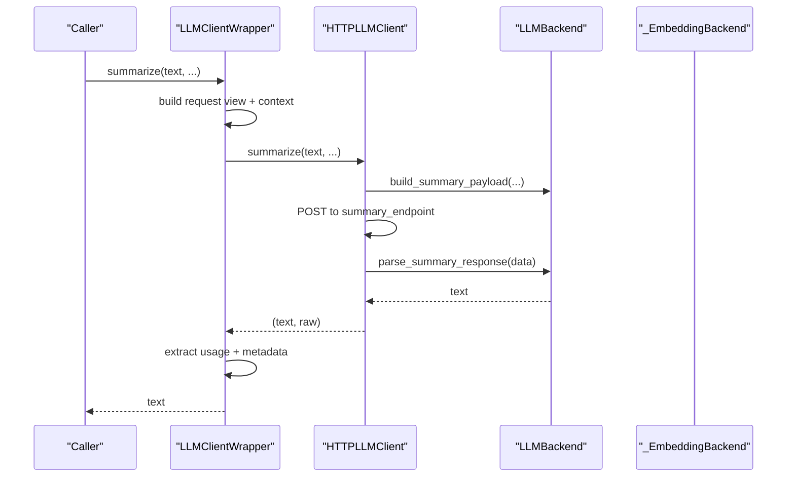
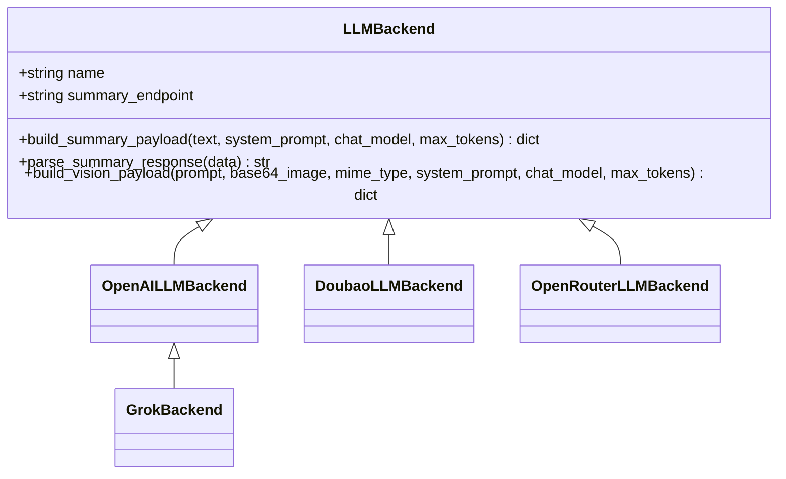
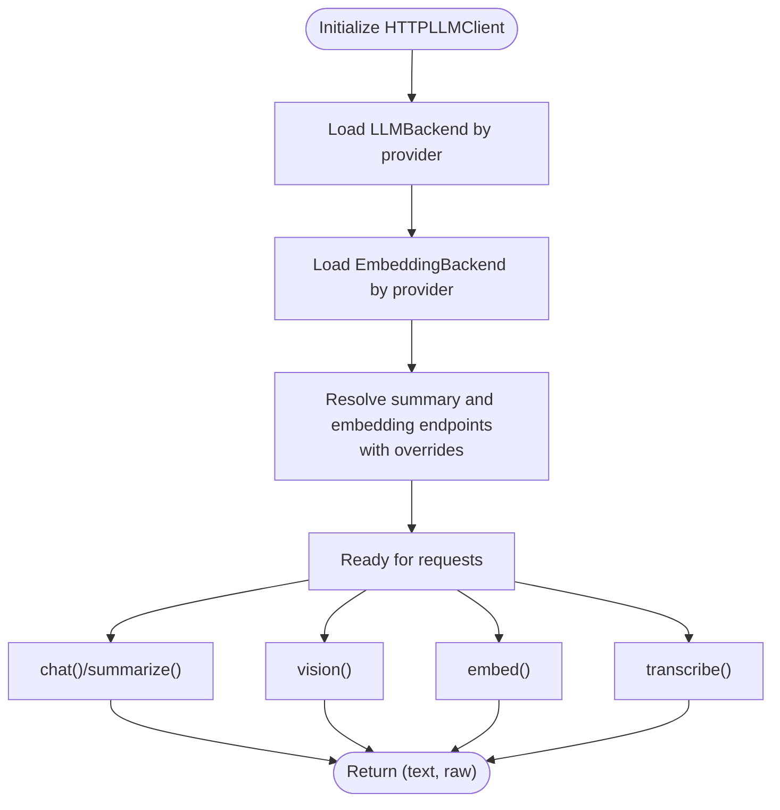
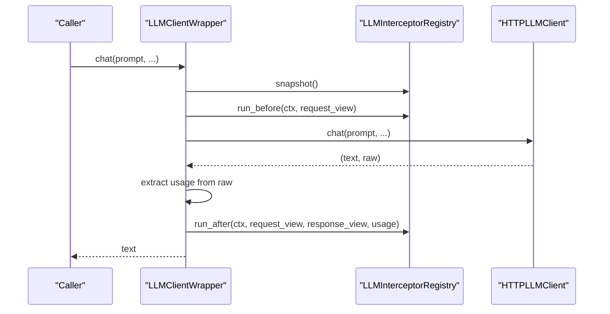
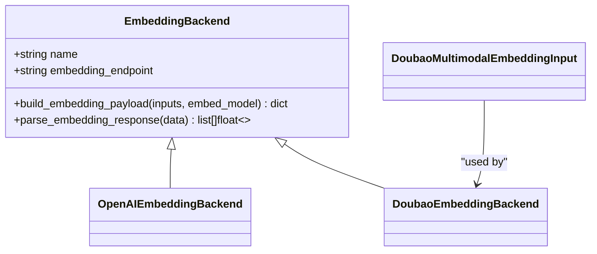
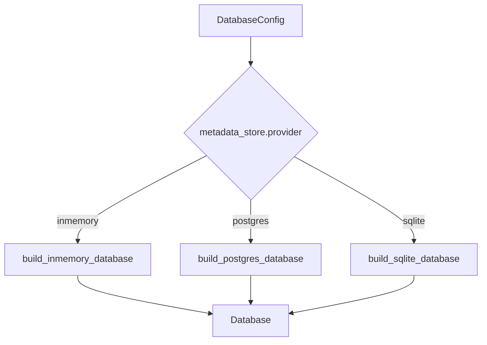
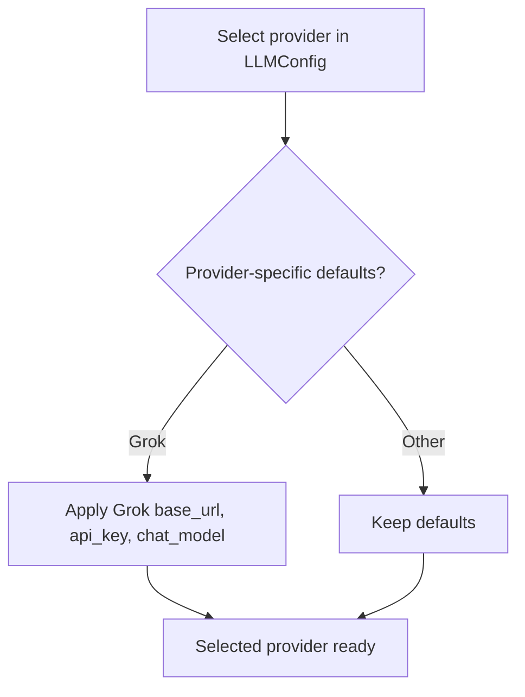
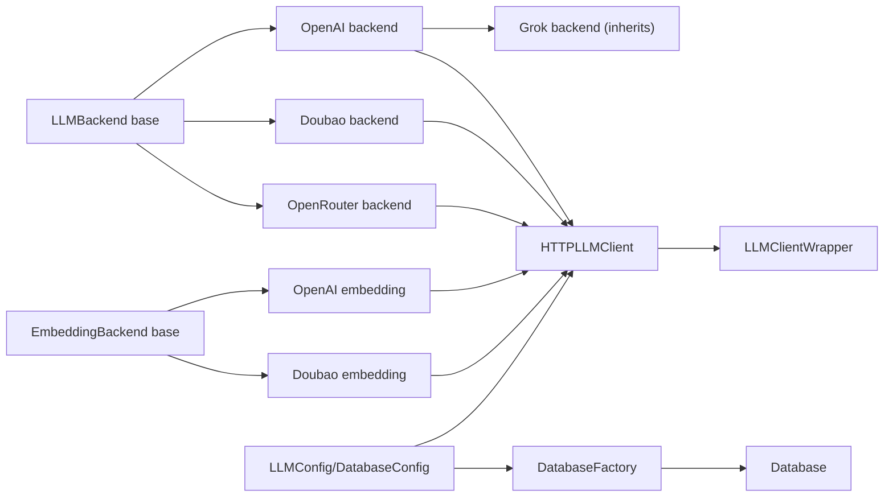

# Provider Abstraction System

<cite>
**Referenced Files in This Document**
- [base.py](file://src/memu/llm/backends/base.py)
- [openai.py](file://src/memu/llm/backends/openai.py)
- [grok.py](file://src/memu/llm/backends/grok.py)
- [doubao.py](file://src/memu/llm/backends/doubao.py)
- [openrouter.py](file://src/memu/llm/backends/openrouter.py)
- [http_client.py](file://src/memu/llm/http_client.py)
- [wrapper.py](file://src/memu/llm/wrapper.py)
- [openai_wrapper.py](file://src/memu/client/openai_wrapper.py)
- [factory.py](file://src/memu/database/factory.py)
- [__init__.py](file://src/memu/database/__init__.py)
- [base.py](file://src/memu/embedding/backends/base.py)
- [openai.py](file://src/memu/embedding/backends/openai.py)
- [doubao.py](file://src/memu/embedding/backends/doubao.py)
- [settings.py](file://src/memu/app/settings.py)
- [example_4_openrouter_memory.py](file://examples/example_4_openrouter_memory.py)
- [test_nebius_provider.py](file://examples/test_nebius_provider.py)
- [test_openrouter.py](file://tests/test_openrouter.py)
- [interceptor.py](file://src/memu/workflow/interceptor.py)
</cite>

## Table of Contents
1. [Introduction](#introduction)
2. [Project Structure](#project-structure)
3. [Core Components](#core-components)
4. [Architecture Overview](#architecture-overview)
5. [Detailed Component Analysis](#detailed-component-analysis)
6. [Dependency Analysis](#dependency-analysis)
7. [Performance Considerations](#performance-considerations)
8. [Troubleshooting Guide](#troubleshooting-guide)
9. [Conclusion](#conclusion)
10. [Appendices](#appendices)

## Introduction
This document explains memU’s provider abstraction system that enables flexible integration with multiple Large Language Model (LLM) providers and pluggable storage backends. It covers:
- Unified LLM provider backends (OpenAI, Grok, Doubao, OpenRouter)
- HTTP client abstraction and client wrapper system for interceptors, metadata tracking, and provider-specific configurations
- Pluggable storage architecture supporting in-memory, SQLite, and PostgreSQL backends
- How provider selection affects memory operations (chat vs embedding)
- Authentication patterns, rate limiting considerations, error handling, and performance optimization strategies

## Project Structure
The provider abstraction spans several modules:
- LLM backends define provider-specific payload construction and response parsing
- HTTP client encapsulates provider endpoints, timeouts, and authentication
- Client wrapper adds interceptors, metadata tracking, and usage extraction
- Database factory selects storage backend based on configuration
- Embedding backends mirror LLM backends for embeddings
- Settings define provider identifiers, defaults, and endpoint overrides

```mermaid
graph TB
subgraph "LLM Layer"
LLMBackends["LLM Backends<br/>base.py, openai.py, grok.py, doubao.py, openrouter.py"]
HTTPClient["HTTPLLMClient<br/>http_client.py"]
ClientWrapper["LLMClientWrapper + Registry<br/>wrapper.py"]
end
subgraph "Embedding Layer"
EmbBackends["Embedding Backends<br/>base.py, openai.py, doubao.py"]
end
subgraph "Storage Layer"
DBFactory["Database Factory<br/>factory.py"]
DBInit["Database Exports<br/>__init__.py"]
end
subgraph "Settings"
Settings["LLMConfig, DatabaseConfig<br/>settings.py"]
end
LLMBackends --> HTTPClient
EmbBackends --> HTTPClient
HTTPClient --> ClientWrapper
Settings --> HTTPClient
Settings --> DBFactory
DBFactory --> DBInit
```

**Diagram sources**
- [http_client.py](file://src/memu/llm/http_client.py#L80-L301)
- [wrapper.py](file://src/memu/llm/wrapper.py#L226-L505)
- [factory.py](file://src/memu/database/factory.py#L15-L44)
- [settings.py](file://src/memu/app/settings.py#L102-L322)

**Section sources**
- [http_client.py](file://src/memu/llm/http_client.py#L80-L301)
- [wrapper.py](file://src/memu/llm/wrapper.py#L226-L505)
- [factory.py](file://src/memu/database/factory.py#L15-L44)
- [settings.py](file://src/memu/app/settings.py#L102-L322)

## Core Components
- LLM provider backends: Define provider-specific payload builders and response parsers for chat, vision, and embeddings
- HTTPLLMClient: Centralized HTTP client that selects backends by provider, handles authentication, endpoints, timeouts, and proxies
- LLMClientWrapper: Adds interceptors, metadata tracking, usage extraction, and standardized request/response views
- Database factory: Builds in-memory, SQLite, or PostgreSQL backends based on configuration
- Embedding backends: Mirror LLM backends for embeddings with provider-specific endpoints and payload formats
- Settings: Provide provider identifiers, defaults, endpoint overrides, and model names

**Section sources**
- [base.py](file://src/memu/llm/backends/base.py#L6-L31)
- [openai.py](file://src/memu/llm/backends/openai.py#L8-L65)
- [grok.py](file://src/memu/llm/backends/grok.py#L6-L12)
- [doubao.py](file://src/memu/llm/backends/doubao.py#L8-L70)
- [openrouter.py](file://src/memu/llm/backends/openrouter.py#L8-L71)
- [http_client.py](file://src/memu/llm/http_client.py#L80-L301)
- [wrapper.py](file://src/memu/llm/wrapper.py#L226-L505)
- [factory.py](file://src/memu/database/factory.py#L15-L44)
- [base.py](file://src/memu/embedding/backends/base.py#L6-L17)
- [openai.py](file://src/memu/embedding/backends/openai.py#L8-L19)
- [doubao.py](file://src/memu/embedding/backends/doubao.py#L31-L73)
- [settings.py](file://src/memu/app/settings.py#L102-L322)

## Architecture Overview
The system separates concerns across layers:
- Provider backends encapsulate differences in payload and response formats
- The HTTP client centralizes transport, authentication, and endpoint resolution
- The wrapper layer adds observability and standardized metrics
- The database factory decouples storage from computation
- Settings unify configuration across providers and backends



**Diagram sources**
- [wrapper.py](file://src/memu/llm/wrapper.py#L247-L306)
- [http_client.py](file://src/memu/llm/http_client.py#L148-L159)
- [base.py](file://src/memu/llm/backends/base.py#L12-L18)

## Detailed Component Analysis

### LLM Provider Backends
These backends define provider-specific payload construction and response parsing for chat and vision tasks. They also expose endpoint names for embeddings.



- OpenAI and OpenRouter backends share similar payload structures and inherit the same response parsing
- Grok reuses OpenAI-compatible payload and response handling
- Doubao uses provider-specific endpoints and supports OpenAI-compatible payloads

**Diagram sources**
- [base.py](file://src/memu/llm/backends/base.py#L6-L31)
- [openai.py](file://src/memu/llm/backends/openai.py#L8-L65)
- [grok.py](file://src/memu/llm/backends/grok.py#L6-L12)
- [doubao.py](file://src/memu/llm/backends/doubao.py#L8-L70)
- [openrouter.py](file://src/memu/llm/backends/openrouter.py#L8-L71)

**Section sources**
- [base.py](file://src/memu/llm/backends/base.py#L6-L31)
- [openai.py](file://src/memu/llm/backends/openai.py#L8-L65)
- [grok.py](file://src/memu/llm/backends/grok.py#L6-L12)
- [doubao.py](file://src/memu/llm/backends/doubao.py#L8-L70)
- [openrouter.py](file://src/memu/llm/backends/openrouter.py#L8-L71)

### HTTP Client Abstraction
The HTTP client encapsulates:
- Provider selection via a backend registry
- Endpoint resolution with override support
- Authentication via Authorization header
- Timeout and proxy configuration
- Separate embedding backend selection
- Asynchronous calls for chat, vision, embeddings, and audio transcription



**Diagram sources**
- [http_client.py](file://src/memu/llm/http_client.py#L80-L301)

**Section sources**
- [http_client.py](file://src/memu/llm/http_client.py#L80-L301)

### Client Wrapper System
The wrapper adds:
- Interceptors before/after/error with filtering and priority
- Metadata tracking (profile, operation, step_id, tags)
- Usage extraction from raw responses (tokens, latency, finish reason)
- Standardized request/response views for telemetry and analytics



**Diagram sources**
- [wrapper.py](file://src/memu/llm/wrapper.py#L387-L436)

**Section sources**
- [wrapper.py](file://src/memu/llm/wrapper.py#L226-L505)
- [interceptor.py](file://src/memu/workflow/interceptor.py#L56-L219)

### Embedding Backends
Embedding backends mirror LLM backends for embeddings:
- OpenAI-compatible embeddings
- Doubao embeddings (standard and multimodal)
- OpenRouter embeddings (OpenAI-compatible)



**Diagram sources**
- [base.py](file://src/memu/embedding/backends/base.py#L6-L17)
- [openai.py](file://src/memu/embedding/backends/openai.py#L8-L19)
- [doubao.py](file://src/memu/embedding/backends/doubao.py#L31-L73)

**Section sources**
- [base.py](file://src/memu/embedding/backends/base.py#L6-L17)
- [openai.py](file://src/memu/embedding/backends/openai.py#L8-L19)
- [doubao.py](file://src/memu/embedding/backends/doubao.py#L31-L73)

### Database Factory Pattern
The factory builds storage backends based on configuration:
- inmemory: ephemeral, no persistence
- postgres: with optional pgvector
- sqlite: lightweight, file-based



**Diagram sources**
- [factory.py](file://src/memu/database/factory.py#L15-L44)

**Section sources**
- [factory.py](file://src/memu/database/factory.py#L15-L44)
- [__init__.py](file://src/memu/database/__init__.py#L1-L29)

### Provider Selection and Memory Operations
- Chat and vision tasks are handled by LLM backends
- Embedding tasks are handled by embedding backends
- Settings allow selecting provider, base_url, api_key, chat_model, embed_model, and endpoint overrides
- Provider-specific defaults are applied (e.g., Grok defaults)



**Diagram sources**
- [settings.py](file://src/memu/app/settings.py#L102-L139)

**Section sources**
- [settings.py](file://src/memu/app/settings.py#L102-L139)

## Dependency Analysis
- LLM backends depend on a shared base interface
- HTTPLLMClient depends on selected LLM and embedding backends
- Client wrapper depends on the HTTP client and interceptor registry
- Database factory depends on configuration and lazy-loads backend modules
- Examples and tests demonstrate provider configuration and usage



**Diagram sources**
- [base.py](file://src/memu/llm/backends/base.py#L6-L31)
- [openai.py](file://src/memu/llm/backends/openai.py#L8-L65)
- [grok.py](file://src/memu/llm/backends/grok.py#L6-L12)
- [doubao.py](file://src/memu/llm/backends/doubao.py#L8-L70)
- [openrouter.py](file://src/memu/llm/backends/openrouter.py#L8-L71)
- [http_client.py](file://src/memu/llm/http_client.py#L80-L301)
- [wrapper.py](file://src/memu/llm/wrapper.py#L226-L505)
- [factory.py](file://src/memu/database/factory.py#L15-L44)
- [settings.py](file://src/memu/app/settings.py#L102-L322)

**Section sources**
- [http_client.py](file://src/memu/llm/http_client.py#L80-L301)
- [wrapper.py](file://src/memu/llm/wrapper.py#L226-L505)
- [factory.py](file://src/memu/database/factory.py#L15-L44)
- [settings.py](file://src/memu/app/settings.py#L102-L322)

## Performance Considerations
- Asynchronous HTTP calls reduce blocking overhead
- Proxy support via environment variables enables network optimization
- Token usage extraction from raw responses enables cost and latency monitoring
- Embedding batch sizes and endpoint overrides help tune throughput
- Interceptor strictness controls error propagation during observability hooks

[No sources needed since this section provides general guidance]

## Troubleshooting Guide
Common issues and resolutions:
- Unsupported provider: Ensure provider is one of the supported keys and initialize the client accordingly
- Authentication failures: Verify API key and base URL; confirm Authorization header is set
- Endpoint mismatches: Use endpoint overrides for provider-specific paths
- Embedding provider mismatch: Confirm embedding backend selection aligns with provider
- Proxy connectivity: Set MEMU_HTTP_PROXY/HTTP_PROXY/HTTPS_PROXY environment variables
- Interceptor errors: Use strict mode to surface exceptions or rely on logging

**Section sources**
- [http_client.py](file://src/memu/llm/http_client.py#L282-L300)
- [http_client.py](file://src/memu/llm/http_client.py#L19-L20)
- [wrapper.py](file://src/memu/llm/wrapper.py#L760-L773)

## Conclusion
memU’s provider abstraction system cleanly separates provider-specific logic behind unified interfaces, enabling seamless switching among OpenAI, Grok, Doubao, and OpenRouter without changing application code. The HTTP client and wrapper layers add robust observability, metadata tracking, and usage extraction. The database factory supports pluggable storage backends, while settings unify configuration across providers. Together, these components deliver a flexible, maintainable, and extensible architecture for memory-enabled LLM applications.

[No sources needed since this section summarizes without analyzing specific files]

## Appendices

### Provider Configuration Examples
- OpenRouter configuration with explicit chat and embedding models
- Nebius integration using OpenAI-compatible endpoints and models

**Section sources**
- [example_4_openrouter_memory.py](file://examples/example_4_openrouter_memory.py#L64-L76)
- [test_nebius_provider.py](file://examples/test_nebius_provider.py#L119-L134)

### Implementing Custom Backends
- Extend the base backend classes and register them in the client backend map
- Provide provider-specific payload builders and response parsers
- Ensure endpoint names and authentication patterns match the provider

**Section sources**
- [base.py](file://src/memu/llm/backends/base.py#L6-L31)
- [http_client.py](file://src/memu/llm/http_client.py#L72-L77)
- [http_client.py](file://src/memu/llm/http_client.py#L282-L287)

### Managing Provider-Specific Settings
- Use LLMConfig to select provider, base_url, api_key, chat_model, embed_model, and endpoint overrides
- Provider-specific defaults are applied for certain providers (e.g., Grok)

**Section sources**
- [settings.py](file://src/memu/app/settings.py#L102-L139)

### Authentication Patterns
- Authorization header with bearer token
- Environment variables for API keys and proxy configuration

**Section sources**
- [http_client.py](file://src/memu/llm/http_client.py#L279-L280)
- [http_client.py](file://src/memu/llm/http_client.py#L19-L20)

### Rate Limiting and Error Handling
- HTTP client raises on non-success status; callers should wrap calls with retry and backoff
- Interceptors can capture errors and augment telemetry
- Strict interceptor mode controls whether errors propagate

**Section sources**
- [http_client.py](file://src/memu/llm/http_client.py#L142-L143)
- [wrapper.py](file://src/memu/llm/wrapper.py#L404-L408)
- [interceptor.py](file://src/memu/workflow/interceptor.py#L56-L76)

### Relationship Between Provider Selection and Memory Operations
- Chat and vision: handled by LLM backends
- Embeddings: handled by embedding backends
- Tests and examples demonstrate end-to-end workflows with different providers

**Section sources**
- [test_openrouter.py](file://tests/test_openrouter.py#L86-L120)
- [test_nebius_provider.py](file://examples/test_nebius_provider.py#L107-L134)