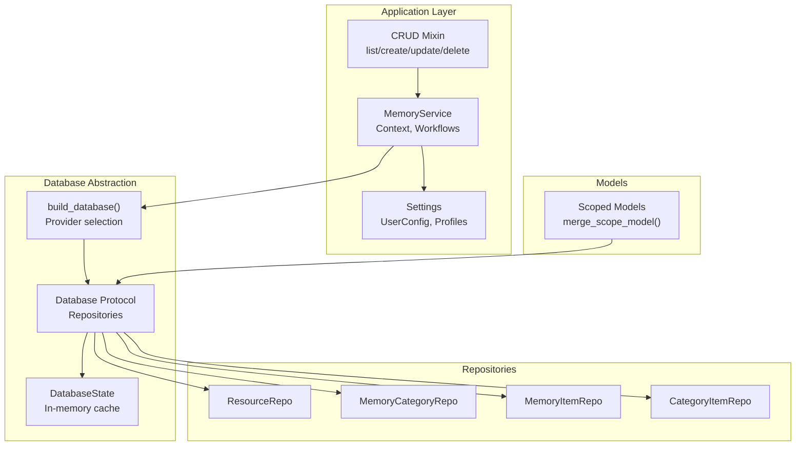
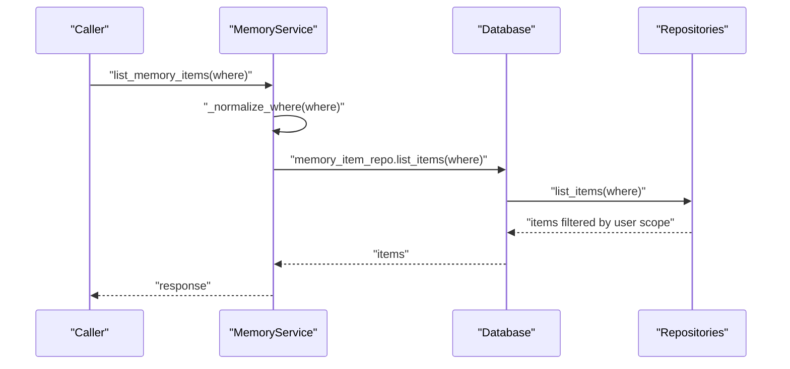
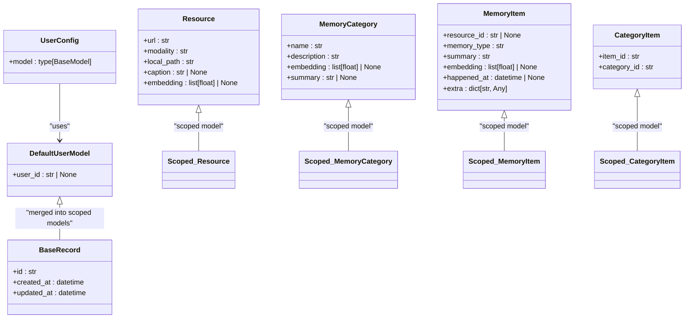
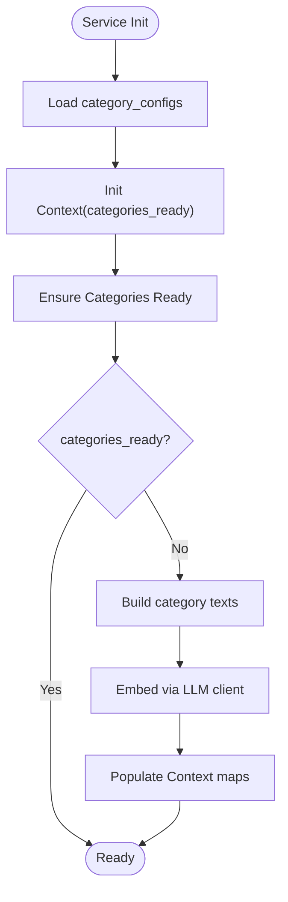
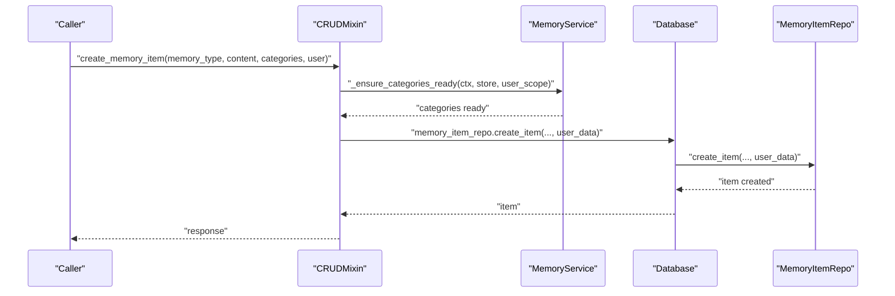
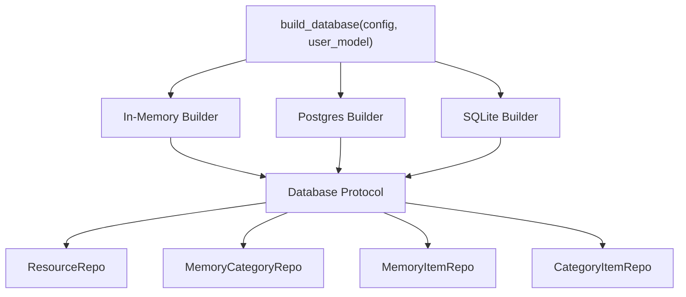
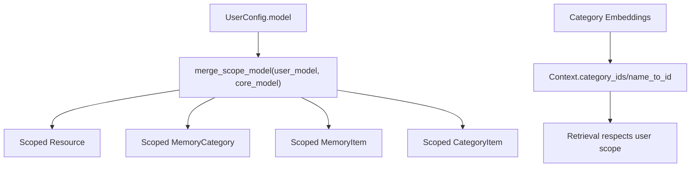
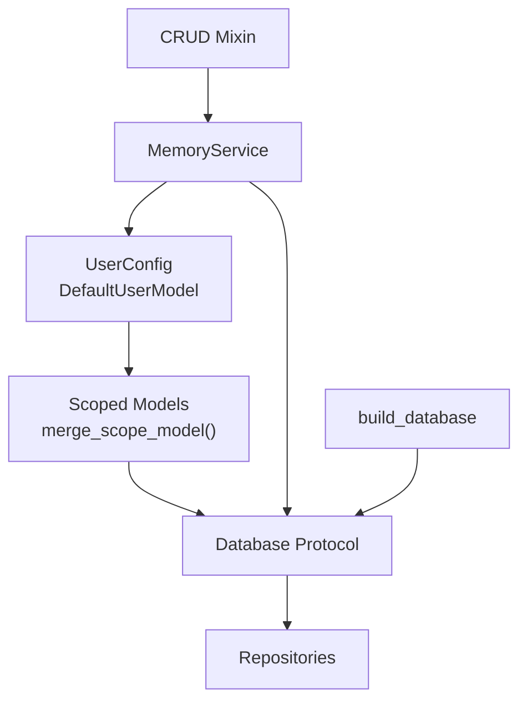

# User Scope and Context Management

<cite>
**Referenced Files in This Document**
- [src/memu/__init__.py](file://src/memu/__init__.py)
- [src/memu/_core.pyi](file://src/memu/_core.pyi)
- [src/memu/app/service.py](file://src/memu/app/service.py)
- [src/memu/app/settings.py](file://src/memu/app/settings.py)
- [src/memu/app/crud.py](file://src/memu/app/crud.py)
- [src/memu/database/factory.py](file://src/memu/database/factory.py)
- [src/memu/database/interfaces.py](file://src/memu/database/interfaces.py)
- [src/memu/database/models.py](file://src/memu/database/models.py)
- [src/memu/database/state.py](file://src/memu/database/state.py)
- [src/memu/database/repositories/memory_item.py](file://src/memu/database/repositories/memory_item.py)
- [src/memu/database/repositories/memory_category.py](file://src/memu/database/repositories/memory_category.py)
- [src/memu/database/repositories/category_item.py](file://src/memu/database/repositories/category_item.py)
- [src/memu/database/repositories/resource.py](file://src/memu/database/repositories/resource.py)
- [src/memu/database/sqlite/sqlite.py](file://src/memu/database/sqlite/sqlite.py)
- [docs/architecture.md](file://docs/architecture.md)
- [docs/adr/0003-user-scope-in-data-model.md](file://docs/adr/0003-user-scope-in-data-model.md)
</cite>

## Table of Contents
1. [Introduction](#introduction)
2. [Project Structure](#project-structure)
3. [Core Components](#core-components)
4. [Architecture Overview](#architecture-overview)
5. [Detailed Component Analysis](#detailed-component-analysis)
6. [Dependency Analysis](#dependency-analysis)
7. [Performance Considerations](#performance-considerations)
8. [Troubleshooting Guide](#troubleshooting-guide)
9. [Conclusion](#conclusion)
10. [Appendices](#appendices)

## Introduction
This document explains how memU manages user scope and context across multi-user and multi-context scenarios. It focuses on the UserConfig system, user_id scoping for memory isolation, and context-aware memory operations. The system ensures that each user, agent, or session operates within a separate memory space while sharing common configuration. It documents the Context class structure, category initialization per user scope, and how memory operations respect user boundaries. Practical topics include configuring user-specific memory profiles, handling context switching, implementing multi-tenant memory management, and understanding the relationship between user scope and database operations, category inheritance patterns, and data isolation guarantees.

## Project Structure
The user scope and context management spans several modules:
- Application-level service and settings define user scoping and workflows.
- Database abstraction exposes a unified interface across backends.
- Repository contracts define CRUD operations with user-scoped filters.
- Scoped models merge user scope fields into core record models.

**Diagram sources**
- [src/memu/app/service.py](file://src/memu/app/service.py#L41-L95)
- [src/memu/app/settings.py](file://src/memu/app/settings.py#L249-L258)
- [src/memu/app/crud.py](file://src/memu/app/crud.py#L23-L37)
- [src/memu/database/factory.py](file://src/memu/database/factory.py#L15-L44)
- [src/memu/database/interfaces.py](file://src/memu/database/interfaces.py#L12-L27)
- [src/memu/database/state.py](file://src/memu/database/state.py#L8-L14)
- [src/memu/database/models.py](file://src/memu/database/models.py#L108-L134)

**Section sources**
- [src/memu/app/service.py](file://src/memu/app/service.py#L41-L95)
- [src/memu/app/settings.py](file://src/memu/app/settings.py#L249-L258)
- [src/memu/database/factory.py](file://src/memu/database/factory.py#L15-L44)
- [src/memu/database/interfaces.py](file://src/memu/database/interfaces.py#L12-L27)
- [src/memu/database/state.py](file://src/memu/database/state.py#L8-L14)
- [src/memu/database/models.py](file://src/memu/database/models.py#L108-L134)

## Core Components
- UserConfig: Defines the user scope model used across the system. The default model includes user_id and room for agent_id/session_id.
- Context: Holds per-service-instance runtime state for category initialization and lookup.
- Scoped Models: Generated by merging the user scope model with core record models (Resource, MemoryCategory, MemoryItem, CategoryItem).
- Database Protocol: Backend-agnostic interface exposing repositories for resources, categories, items, and relations.
- CRUD Mixin: Provides list/create/update/delete operations with user-scoped where filters and category initialization.

Key responsibilities:
- Enforce user boundary via validated where filters and scoped write payloads.
- Initialize category embeddings per user scope and cache category IDs/names.
- Persist and retrieve memory artifacts with user_id (and optionally agent/session) applied automatically.

**Section sources**
- [src/memu/app/settings.py](file://src/memu/app/settings.py#L249-L258)
- [src/memu/app/service.py](file://src/memu/app/service.py#L41-L95)
- [src/memu/database/models.py](file://src/memu/database/models.py#L108-L134)
- [src/memu/database/interfaces.py](file://src/memu/database/interfaces.py#L12-L27)
- [src/memu/app/crud.py](file://src/memu/app/crud.py#L195-L213)

## Architecture Overview
memU embeds user scope fields directly into persisted entities. The UserConfig.model is merged into core record models, ensuring that where filters and user_data are consistently available across APIs. The build_database function constructs a Database instance with repositories configured to honor user scope.

**Diagram sources**
- [src/memu/app/crud.py](file://src/memu/app/crud.py#L38-L77)
- [src/memu/app/crud.py](file://src/memu/app/crud.py#L195-L213)
- [src/memu/database/interfaces.py](file://src/memu/database/interfaces.py#L12-L27)

**Section sources**
- [docs/architecture.md](file://docs/architecture.md#L132-L136)
- [docs/adr/0003-user-scope-in-data-model.md](file://docs/adr/0003-user-scope-in-data-model.md#L12-L18)
- [src/memu/database/factory.py](file://src/memu/database/factory.py#L15-L44)

## Detailed Component Analysis

### UserConfig and Scoped Models
- UserConfig.model defines the schema for user scope. The default model includes user_id and reserves fields for agent_id/session_id.
- Scoped models are generated by merge_scope_model(user_model, core_model) to ensure scope fields co-exist with core record fields without overlap.
- build_scoped_models returns Resource, MemoryCategory, MemoryItem, and CategoryItem with user scope integrated.

**Diagram sources**
- [src/memu/app/settings.py](file://src/memu/app/settings.py#L249-L258)
- [src/memu/database/models.py](file://src/memu/database/models.py#L108-L134)
- [src/memu/database/models.py](file://src/memu/database/models.py#L68-L106)

**Section sources**
- [src/memu/app/settings.py](file://src/memu/app/settings.py#L249-L258)
- [src/memu/database/models.py](file://src/memu/database/models.py#L108-L134)

### Context Class and Category Initialization
- Context holds per-service state: categories_ready flag, category_ids, category_name_to_id mapping, and an optional initialization task.
- Category initialization embeds category texts via an embedding client and stores category vectors and mappings in Context.
- MemoryService initializes category_configs and Context during construction and defers category readiness until needed.

**Diagram sources**
- [src/memu/app/service.py](file://src/memu/app/service.py#L49-L95)
- [src/memu/app/memorize.py](file://src/memu/app/memorize.py#L626-L660)

**Section sources**
- [src/memu/app/service.py](file://src/memu/app/service.py#L41-L95)
- [src/memu/app/memorize.py](file://src/memu/app/memorize.py#L626-L660)

### Memory Operations Respect User Boundaries
- CRUD operations accept a where filter and user payload. The where filter is normalized against the configured user model fields to prevent unknown fields.
- Writes (create/update) attach user_data to repositories to persist scope fields alongside core records.
- Reads (list/clear) apply where filters to restrict results to the requested user scope.

**Diagram sources**
- [src/memu/app/crud.py](file://src/memu/app/crud.py#L279-L314)
- [src/memu/app/crud.py](file://src/memu/app/crud.py#L502-L528)
- [src/memu/database/repositories/memory_item.py](file://src/memu/database/repositories/memory_item.py#L21-L31)

**Section sources**
- [src/memu/app/crud.py](file://src/memu/app/crud.py#L195-L213)
- [src/memu/app/crud.py](file://src/memu/app/crud.py#L279-L314)
- [src/memu/database/repositories/memory_item.py](file://src/memu/database/repositories/memory_item.py#L21-L31)

### Database Provider Integration and Scope Propagation
- build_database selects provider (inmemory, postgres, sqlite) and passes user_model to backend builders.
- SQLite backend initializes repositories with scope_fields derived from the user_model, ensuring where filters and user_data are honored.
- The Database protocol exposes repositories uniformly across providers.

**Diagram sources**
- [src/memu/database/factory.py](file://src/memu/database/factory.py#L15-L44)
- [src/memu/database/sqlite/sqlite.py](file://src/memu/database/sqlite/sqlite.py#L88-L123)
- [src/memu/database/interfaces.py](file://src/memu/database/interfaces.py#L12-L27)

**Section sources**
- [src/memu/database/factory.py](file://src/memu/database/factory.py#L15-L44)
- [src/memu/database/sqlite/sqlite.py](file://src/memu/database/sqlite/sqlite.py#L88-L123)
- [src/memu/database/interfaces.py](file://src/memu/database/interfaces.py#L12-L27)

### Category Inheritance Patterns and Data Isolation
- Category initialization embeds category texts and stores category vectors in Context. This enables downstream retrieval to be scoped per user.
- Scoped models ensure that category summaries and relations carry user scope fields, preventing cross-user leakage.
- The architecture enforces that where filters and user_data payloads align with the configured scope fields.

**Diagram sources**
- [src/memu/database/models.py](file://src/memu/database/models.py#L108-L134)
- [src/memu/app/memorize.py](file://src/memu/app/memorize.py#L648-L660)

**Section sources**
- [src/memu/database/models.py](file://src/memu/database/models.py#L108-L134)
- [src/memu/app/memorize.py](file://src/memu/app/memorize.py#L648-L660)

## Dependency Analysis
The following diagram highlights key dependencies among user scope and context management components.

**Diagram sources**
- [src/memu/app/settings.py](file://src/memu/app/settings.py#L249-L258)
- [src/memu/database/models.py](file://src/memu/database/models.py#L108-L134)
- [src/memu/database/interfaces.py](file://src/memu/database/interfaces.py#L12-L27)
- [src/memu/app/service.py](file://src/memu/app/service.py#L49-L95)
- [src/memu/app/crud.py](file://src/memu/app/crud.py#L23-L37)
- [src/memu/database/factory.py](file://src/memu/database/factory.py#L15-L44)

**Section sources**
- [src/memu/app/settings.py](file://src/memu/app/settings.py#L249-L258)
- [src/memu/database/models.py](file://src/memu/database/models.py#L108-L134)
- [src/memu/database/interfaces.py](file://src/memu/database/interfaces.py#L12-L27)
- [src/memu/app/service.py](file://src/memu/app/service.py#L49-L95)
- [src/memu/app/crud.py](file://src/memu/app/crud.py#L23-L37)
- [src/memu/database/factory.py](file://src/memu/database/factory.py#L15-L44)

## Performance Considerations
- Category initialization is deferred until needed and cached in Context to avoid repeated embedding computations.
- Where filter normalization prevents invalid or unknown fields, reducing backend overhead from malformed queries.
- Vector index provider selection (bruteforce vs pgvector) influences retrieval performance; the default is bruteforce for non-postgres providers.
- In-memory state caching (DatabaseState) reduces repeated lookups within a single process lifecycle.

[No sources needed since this section provides general guidance]

## Troubleshooting Guide
Common issues and remedies:
- Unknown filter field errors: Ensure where keys correspond to fields defined in UserConfig.model; the system validates against user_model fields.
- Missing user_id or mismatched scope: Provide a user payload matching the configured user model; writes and reads require consistent scope alignment.
- Category initialization failures: Verify that category_configs are present and that embedding client is reachable; initialization is triggered on-demand.

**Section sources**
- [src/memu/app/crud.py](file://src/memu/app/crud.py#L195-L213)
- [src/memu/app/crud.py](file://src/memu/app/crud.py#L279-L314)
- [src/memu/app/memorize.py](file://src/memu/app/memorize.py#L648-L660)

## Conclusion
memU’s user scope and context management centers on embedding scope fields directly into persisted models, validating where filters against the configured user model, and initializing category embeddings per user scope. The Context class and scoped models ensure that memory operations remain isolated per user, agent, or session while maintaining a shared configuration surface. The Database protocol and repository contracts provide a consistent backend-agnostic interface, enabling multi-tenant and multi-agent patterns without separate storage stacks.

[No sources needed since this section summarizes without analyzing specific files]

## Appendices

### Example Scenarios and Best Practices
- Configure user-specific memory profiles: Define LLM profiles and adjust retrieval and memorize configurations per user scope.
- Handle context switching: Use distinct user payloads to isolate memory between users; rely on where filters to constrain queries.
- Multi-tenant memory management: Use user_id as the primary scope field; optionally add agent_id/session_id for finer-grained separation.
- Performance tips: Keep category_configs minimal and static; reuse initialized embeddings; prefer efficient vector index providers for large-scale deployments.

[No sources needed since this section provides general guidance]