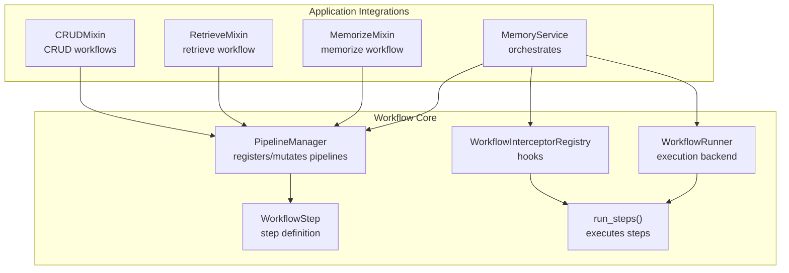
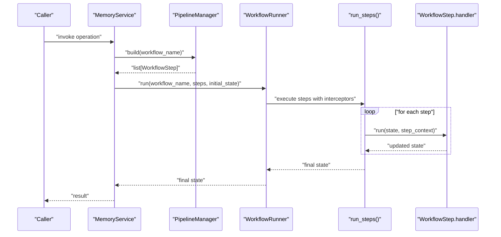
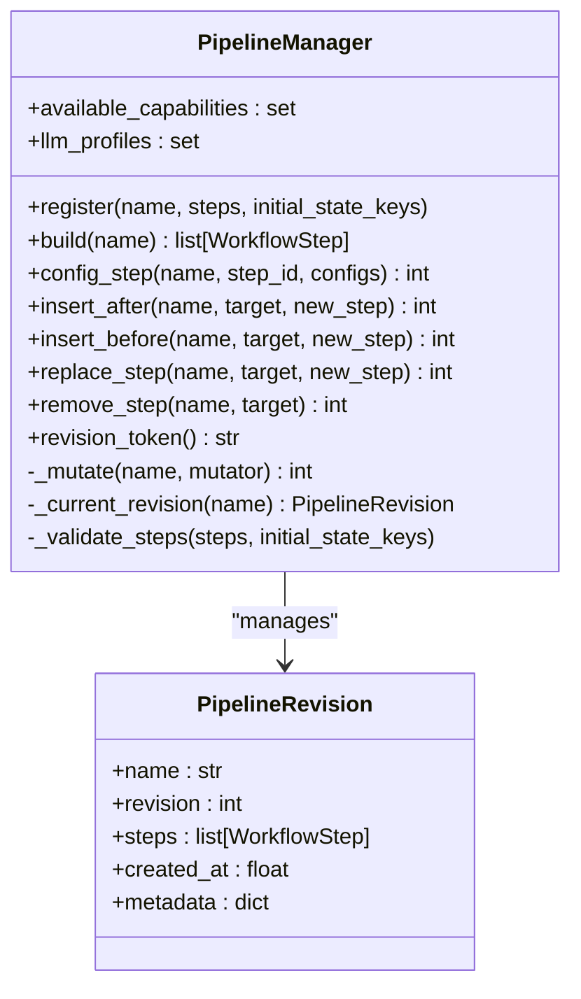
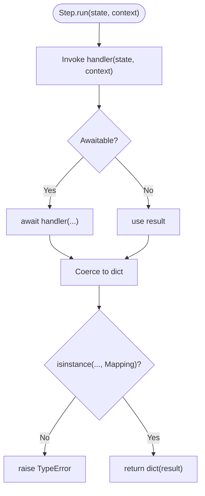
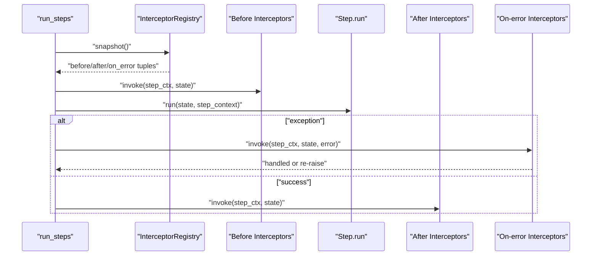
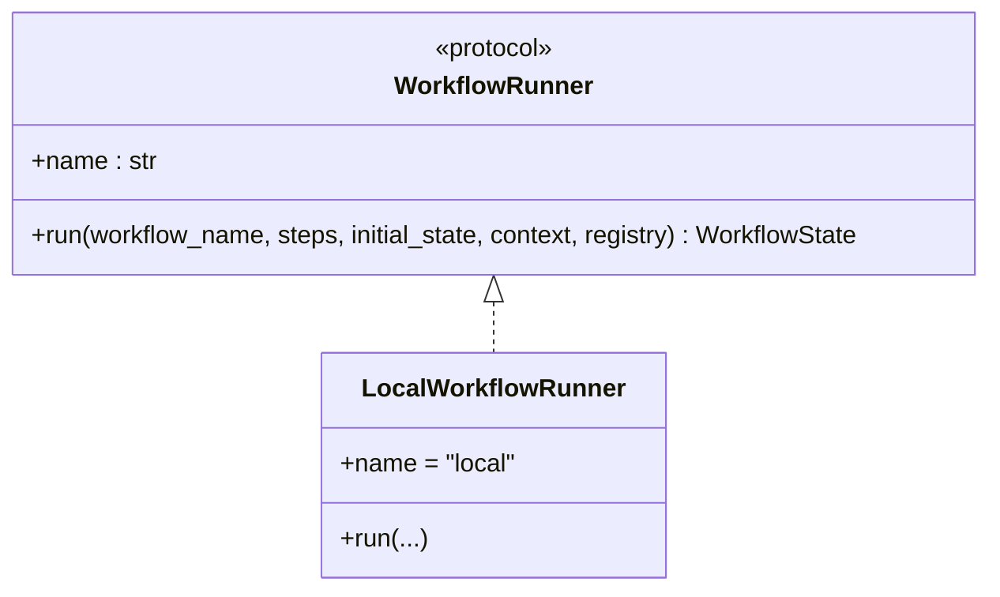
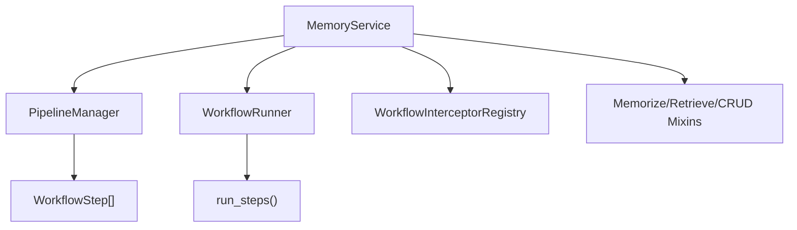
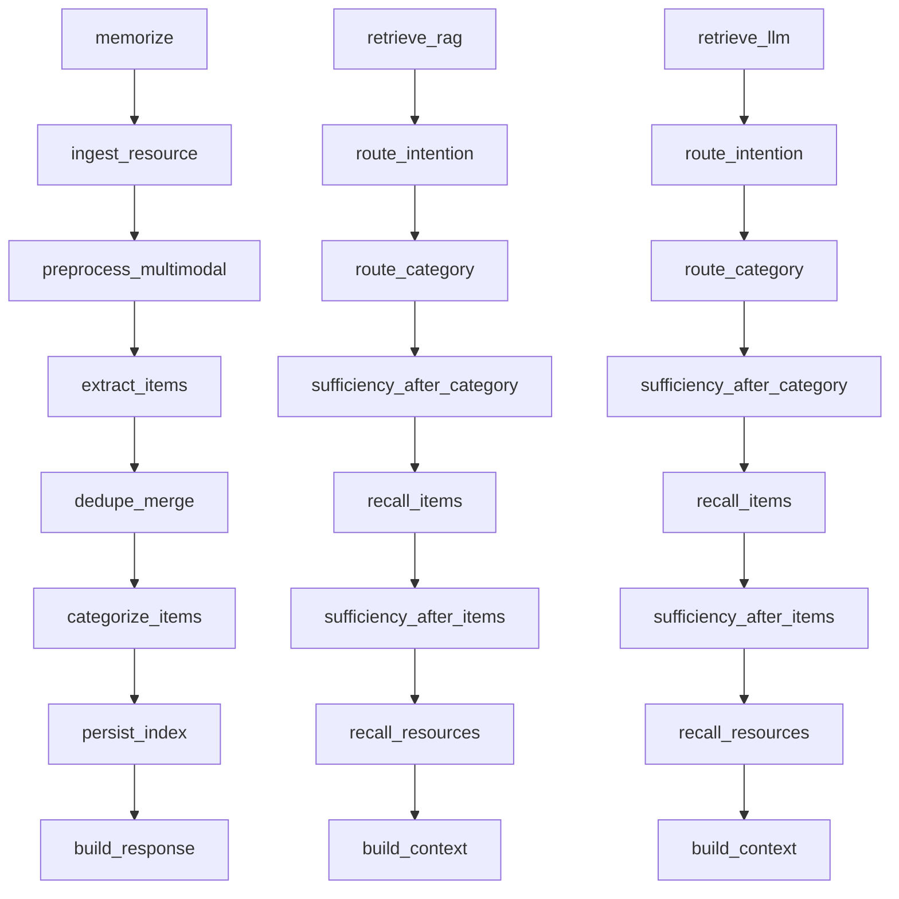
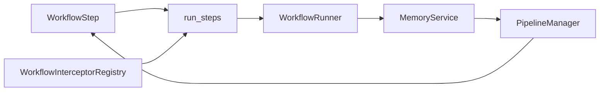

# Workflow Pipeline Architecture

<cite>
**Referenced Files in This Document**
- [pipeline.py](file://src/memu/workflow/pipeline.py)
- [step.py](file://src/memu/workflow/step.py)
- [runner.py](file://src/memu/workflow/runner.py)
- [interceptor.py](file://src/memu/workflow/interceptor.py)
- [service.py](file://src/memu/app/service.py)
- [memorize.py](file://src/memu/app/memorize.py)
- [retrieve.py](file://src/memu/app/retrieve.py)
- [crud.py](file://src/memu/app/crud.py)
- [architecture.md](file://docs/architecture.md)
- [0001-workflow-pipeline-architecture.md](file://docs/adr/0001-workflow-pipeline-architecture.md)
- [models.py](file://src/memu/database/models.py)
</cite>

## Table of Contents
1. [Introduction](#introduction)
2. [Project Structure](#project-structure)
3. [Core Components](#core-components)
4. [Architecture Overview](#architecture-overview)
5. [Detailed Component Analysis](#detailed-component-analysis)
6. [Dependency Analysis](#dependency-analysis)
7. [Performance Considerations](#performance-considerations)
8. [Troubleshooting Guide](#troubleshooting-guide)
9. [Conclusion](#conclusion)

## Introduction
This document explains memU’s modular execution engine built around workflow pipelines. It covers how the PipelineManager registers and mutates pipelines, how WorkflowStep defines discrete memory operations, and how WorkflowRunner executes them asynchronously. It also documents the interceptor system for workflow hooks, error handling, state management across steps, and how the pipeline architecture enables extensibility and customization. Practical examples describe how to construct workflows, insert/remove steps, and configure pipelines.

## Project Structure
The workflow pipeline lives under src/memu/workflow and integrates with application mixins under src/memu/app. The MemoryService composes capabilities, registers pipelines, and exposes mutation APIs. Workflows for memorize, retrieve, and CRUD operations are defined as lists of WorkflowStep instances.

**Diagram sources**
- [pipeline.py](file://src/memu/workflow/pipeline.py#L21-L171)
- [step.py](file://src/memu/workflow/step.py#L16-L102)
- [runner.py](file://src/memu/workflow/runner.py#L12-L82)
- [interceptor.py](file://src/memu/workflow/interceptor.py#L56-L219)
- [service.py](file://src/memu/app/service.py#L49-L427)
- [memorize.py](file://src/memu/app/memorize.py#L47-L326)
- [retrieve.py](file://src/memu/app/retrieve.py#L27-L226)
- [crud.py](file://src/memu/app/crud.py#L100-L245)

**Section sources**
- [architecture.md](file://docs/architecture.md#L1-L50)
- [0001-workflow-pipeline-architecture.md](file://docs/adr/0001-workflow-pipeline-architecture.md#L1-L36)
- [service.py](file://src/memu/app/service.py#L49-L427)

## Core Components
- PipelineManager: Central registry for named pipelines with revisioning and mutation. Validates step uniqueness, capability availability, LLM profile validity, and state key dependencies.
- WorkflowStep: Encapsulates a single step with handler, requires/produces state keys, capabilities, and optional config. Provides async run() that validates handler return type.
- WorkflowRunner: Pluggable execution backend protocol with a default local runner. Supports registering external runners.
- WorkflowInterceptorRegistry: Manages before/after/on_error hooks around each step, with snapshot-based invocation and strict-mode exception handling.
- MemoryService: Composes the system, registers pipelines, resolves runners, and exposes mutation APIs for runtime customization.

**Section sources**
- [pipeline.py](file://src/memu/workflow/pipeline.py#L21-L171)
- [step.py](file://src/memu/workflow/step.py#L16-L102)
- [runner.py](file://src/memu/workflow/runner.py#L12-L82)
- [interceptor.py](file://src/memu/workflow/interceptor.py#L56-L219)
- [service.py](file://src/memu/app/service.py#L49-L427)

## Architecture Overview
The system models each high-level operation (memorize, retrieve, CRUD) as a named pipeline composed of ordered WorkflowStep units. Execution is asynchronous and orchestrated by a WorkflowRunner. Interceptors wrap each step to provide instrumentation and control.

**Diagram sources**
- [service.py](file://src/memu/app/service.py#L350-L360)
- [pipeline.py](file://src/memu/workflow/pipeline.py#L47-L49)
- [runner.py](file://src/memu/workflow/runner.py#L28-L39)
- [step.py](file://src/memu/workflow/step.py#L50-L101)

## Detailed Component Analysis

### PipelineManager
- Responsibilities:
  - Register pipelines with initial state keys.
  - Build copies of the latest pipeline revision for execution.
  - Mutate pipelines (configure step, insert before/after, replace, remove) with validation.
  - Enforce uniqueness of step IDs, capability availability, LLM profile validity, and state key dependencies.
  - Revisioning: each mutation creates a new revision with incremented revision number and timestamp.
- Key behaviors:
  - Validation ensures requires keys are satisfied by prior steps’ produces.
  - Capability checks against available capabilities set.
  - LLM profile validation against configured profiles.

**Diagram sources**
- [pipeline.py](file://src/memu/workflow/pipeline.py#L21-L171)

**Section sources**
- [pipeline.py](file://src/memu/workflow/pipeline.py#L27-L122)

### WorkflowStep
- Defines a single unit of work with:
  - step_id: unique identifier within a pipeline.
  - role: semantic role for categorization.
  - handler: async callable(state, context) -> state.
  - requires/produces: state key contracts.
  - capabilities: required backend capabilities.
  - config: step-level configuration (e.g., LLM profiles).
- Execution:
  - run() invokes handler and validates return type is a mapping.

**Diagram sources**
- [step.py](file://src/memu/workflow/step.py#L40-L47)

**Section sources**
- [step.py](file://src/memu/workflow/step.py#L16-L48)

### run_steps and Interceptors
- run_steps orchestrates step execution with:
  - Pre-step before interceptors.
  - Step execution with state validation.
  - Post-step after interceptors.
  - On-error interceptors if a step raises.
- Interceptors:
  - Registered via WorkflowInterceptorRegistry.
  - Snapshot taken per execution to capture current registrations.
  - Strict mode controls whether interceptor exceptions propagate or are logged.

**Diagram sources**
- [step.py](file://src/memu/workflow/step.py#L50-L101)
- [interceptor.py](file://src/memu/workflow/interceptor.py#L163-L219)

**Section sources**
- [step.py](file://src/memu/workflow/step.py#L50-L101)
- [interceptor.py](file://src/memu/workflow/interceptor.py#L56-L219)

### WorkflowRunner
- Protocol defines run(workflow_name, steps, initial_state, context, interceptor_registry) -> state.
- LocalWorkflowRunner delegates to run_steps.
- External runners can be registered via register_workflow_runner and resolved by name.

**Diagram sources**
- [runner.py](file://src/memu/workflow/runner.py#L12-L49)

**Section sources**
- [runner.py](file://src/memu/workflow/runner.py#L12-L82)

### MemoryService Integration and Pipeline Registration
- MemoryService composes:
  - LLM clients and interceptors.
  - Database and blob storage.
  - PipelineManager with available capabilities and LLM profiles.
  - Registers pipelines for memorize, retrieve (RAG and LLM variants), and CRUD operations.
- Exposes mutation APIs:
  - configure_pipeline(step_id, configs, pipeline)
  - insert_step_after/before(target_step_id, new_step, pipeline)
  - replace_step(target_step_id, new_step, pipeline)
  - remove_step(target_step_id, pipeline)

**Diagram sources**
- [service.py](file://src/memu/app/service.py#L49-L427)
- [memorize.py](file://src/memu/app/memorize.py#L97-L166)
- [retrieve.py](file://src/memu/app/retrieve.py#L106-L210)
- [crud.py](file://src/memu/app/crud.py#L100-L148)

**Section sources**
- [service.py](file://src/memu/app/service.py#L91-L95)
- [service.py](file://src/memu/app/service.py#L315-L348)
- [service.py](file://src/memu/app/service.py#L390-L426)

### Step-Based Architecture for Memory Operations
- Ingestion (memorize): ingest resource → preprocess multimodal → extract items → categorize and persist → build response.
- Retrieval (retrieve): route intention → route category → sufficiency check → recall items → sufficiency check → recall resources → build context.
- CRUD: list, create, update, delete memory items and categories.

**Diagram sources**
- [memorize.py](file://src/memu/app/memorize.py#L97-L166)
- [retrieve.py](file://src/memu/app/retrieve.py#L106-L210)
- [retrieve.py](file://src/memu/app/retrieve.py#L454-L536)

**Section sources**
- [memorize.py](file://src/memu/app/memorize.py#L97-L325)
- [retrieve.py](file://src/memu/app/retrieve.py#L106-L723)
- [crud.py](file://src/memu/app/crud.py#L100-L245)

### Examples of Workflow Construction and Mutation
- Constructing a workflow:
  - Define a list of WorkflowStep with handler functions and state contracts.
  - Register with PipelineManager and specify initial state keys.
- Inserting/removing steps:
  - Use insert_after/insert_before/replace_step/remove_step to mutate pipelines.
  - PipelineManager enforces validation on each mutation.
- Configuring steps:
  - Use config_step to merge step-level config (e.g., LLM profiles).

Practical usage patterns are visible in:
- Pipeline registration in MemoryService.
- Workflow builders in MemorizeMixin and RetrieveMixin.
- Mutation APIs exposed by MemoryService.

**Section sources**
- [service.py](file://src/memu/app/service.py#L315-L348)
- [memorize.py](file://src/memu/app/memorize.py#L97-L166)
- [retrieve.py](file://src/memu/app/retrieve.py#L106-L210)
- [service.py](file://src/memu/app/service.py#L390-L426)

## Dependency Analysis
- PipelineManager depends on WorkflowStep and enforces validation across steps.
- run_steps depends on WorkflowInterceptorRegistry and WorkflowStep.
- WorkflowRunner depends on run_steps.
- MemoryService composes all pieces and registers pipelines.

**Diagram sources**
- [step.py](file://src/memu/workflow/step.py#L50-L101)
- [runner.py](file://src/memu/workflow/runner.py#L28-L39)
- [interceptor.py](file://src/memu/workflow/interceptor.py#L163-L219)
- [service.py](file://src/memu/app/service.py#L350-L360)
- [pipeline.py](file://src/memu/workflow/pipeline.py#L47-L49)

**Section sources**
- [pipeline.py](file://src/memu/workflow/pipeline.py#L131-L165)
- [step.py](file://src/memu/workflow/step.py#L50-L101)
- [runner.py](file://src/memu/workflow/runner.py#L28-L39)
- [interceptor.py](file://src/memu/workflow/interceptor.py#L163-L219)
- [service.py](file://src/memu/app/service.py#L350-L360)

## Performance Considerations
- Asynchronous execution: Handlers are awaited; use async I/O for LLM and vector operations to minimize blocking.
- Step-level concurrency: The current run_steps executes steps sequentially. To enable parallelism, introduce fan-out/fan-in patterns at the workflow level (e.g., parallelize independent branches) while preserving state guarantees.
- Interceptor overhead: Interceptors are invoked per step; keep them lightweight and avoid heavy synchronous operations.
- LLM profile selection: Step config supports selecting LLM profiles; choose appropriate models and batch sizes to balance latency and cost.
- Vector search: Retrieval steps rely on vector similarity; tune top_k and ranking strategies to reduce downstream processing.

[No sources needed since this section provides general guidance]

## Troubleshooting Guide
Common issues and resolutions:
- Missing required state keys: run_steps validates requires against current state; ensure upstream steps produce the required keys.
- Unknown step ID: PipelineManager raises KeyError when mutating steps that do not exist.
- Duplicate step IDs: PipelineManager enforces uniqueness within a pipeline.
- Unavailable capabilities: PipelineManager validates step capabilities against available capabilities set.
- Unknown LLM profile: PipelineManager validates step config against configured profiles.
- Interceptor errors: In non-strict mode, interceptor exceptions are logged; switch to strict mode to surface errors immediately.

Operational tips:
- Use interceptors to log step_context and state snapshots for debugging.
- Leverage revision_token to detect pipeline changes across deployments.
- Validate pipeline mutations locally before deploying to production.

**Section sources**
- [step.py](file://src/memu/workflow/step.py#L68-L72)
- [pipeline.py](file://src/memu/workflow/pipeline.py#L131-L165)
- [interceptor.py](file://src/memu/workflow/interceptor.py#L205-L219)

## Conclusion
memU’s workflow pipeline architecture provides a modular, extensible, and observable execution model for memory operations. PipelineManager centralizes registration and mutation with strong validation, WorkflowStep encapsulates discrete units of work with explicit state contracts, and WorkflowRunner offers a pluggable execution backend. The interceptor system adds instrumentation and control hooks, while MemoryService composes these pieces and exposes runtime customization APIs. This design enables teams to tailor memory processing workflows to their needs, safely evolve pipelines, and instrument execution for observability and debugging.