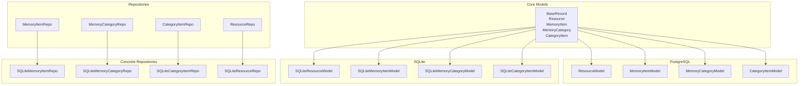
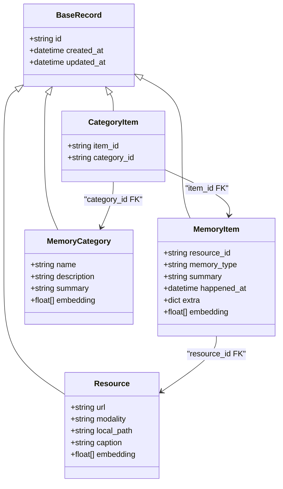
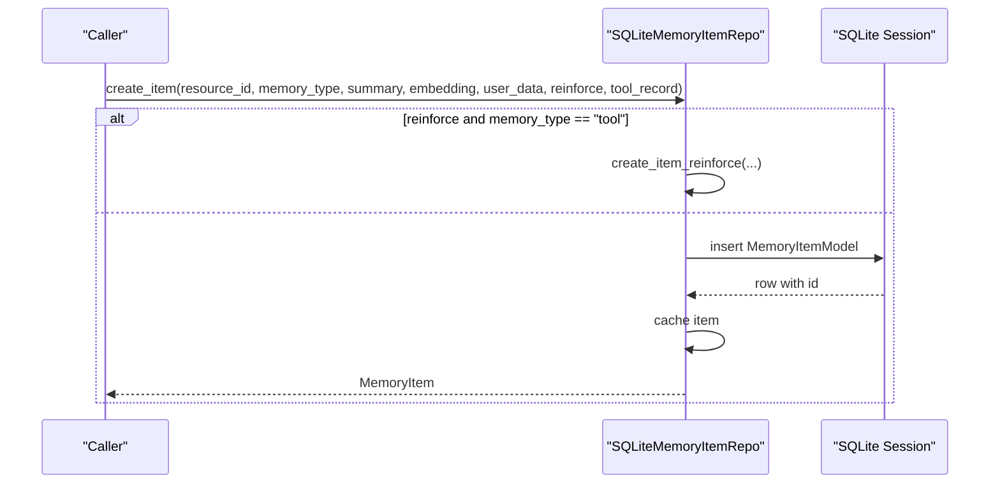
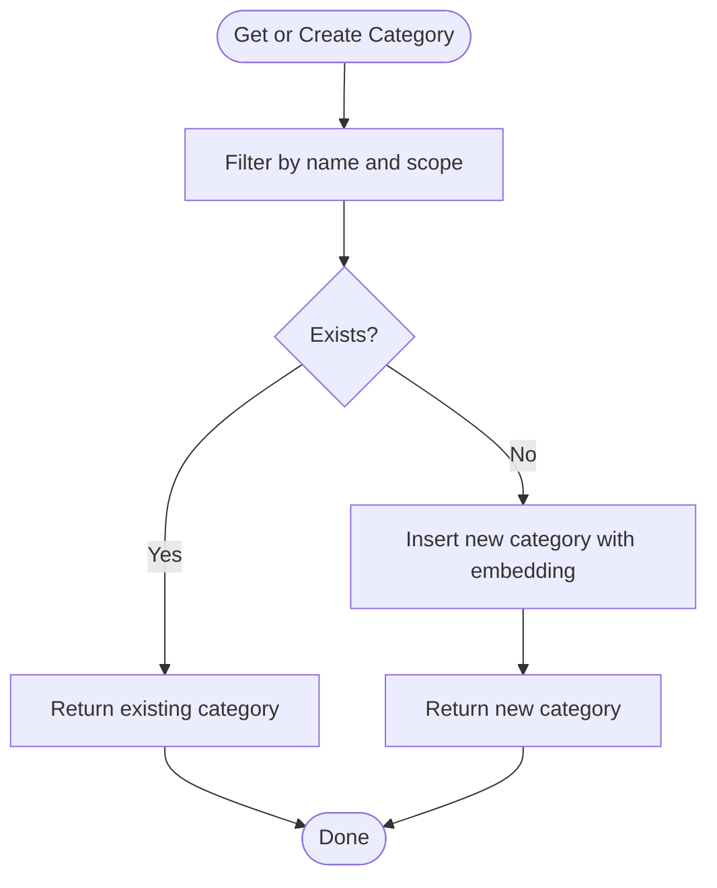
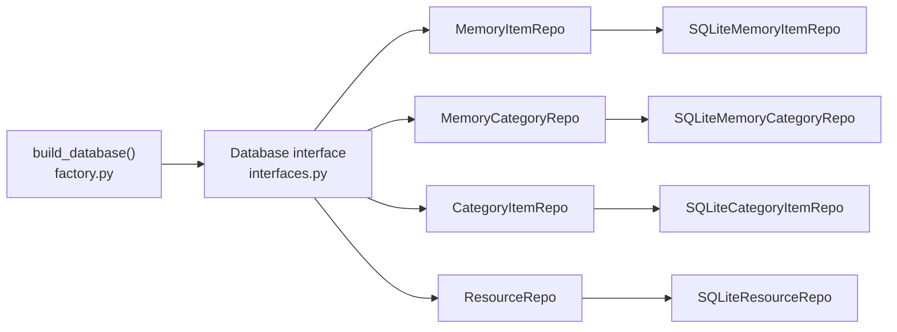
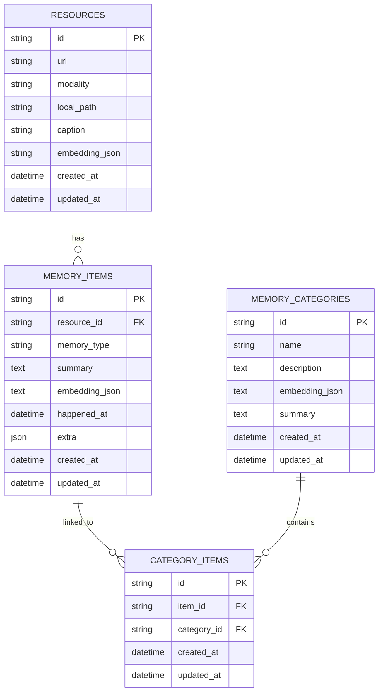

# Data Models and Schema

<cite>
**Referenced Files in This Document**
- [models.py](file://src/memu/database/models.py)
- [sqlite/models.py](file://src/memu/database/sqlite/models.py)
- [postgres/models.py](file://src/memu/database/postgres/models.py)
- [interfaces.py](file://src/memu/database/interfaces.py)
- [factory.py](file://src/memu/database/factory.py)
- [repositories/memory_item.py](file://src/memu/database/repositories/memory_item.py)
- [repositories/memory_category.py](file://src/memu/database/repositories/memory_category.py)
- [repositories/category_item.py](file://src/memu/database/repositories/category_item.py)
- [repositories/resource.py](file://src/memu/database/repositories/resource.py)
- [sqlite/repositories/memory_item_repo.py](file://src/memu/database/sqlite/repositories/memory_item_repo.py)
- [sqlite/repositories/memory_category_repo.py](file://src/memu/database/sqlite/repositories/memory_category_repo.py)
- [sqlite/repositories/category_item_repo.py](file://src/memu/database/sqlite/repositories/category_item_repo.py)
- [sqlite/repositories/resource_repo.py](file://src/memu/database/sqlite/repositories/resource_repo.py)
</cite>

## Table of Contents
1. [Introduction](#introduction)
2. [Project Structure](#project-structure)
3. [Core Components](#core-components)
4. [Architecture Overview](#architecture-overview)
5. [Detailed Component Analysis](#detailed-component-analysis)
6. [Dependency Analysis](#dependency-analysis)
7. [Performance Considerations](#performance-considerations)
8. [Troubleshooting Guide](#troubleshooting-guide)
9. [Conclusion](#conclusion)
10. [Appendices](#appendices)

## Introduction
This document describes the data models and schema for memU’s metadata storage, focusing on the core entities and their relationships. It covers ResourceRecord, MemoryItemRecord, MemoryCategoryRecord, and CategoryItemRecord, detailing field definitions, relationships, constraints, and the repository pattern implementation. It also explains validation rules, business logic enforcement, primary/foreign key relationships, indexing strategies, performance considerations, caching strategies, data lifecycle management, and consistency guarantees across supported backends (PostgreSQL with pgvector, SQLite, and in-memory).

## Project Structure
The data layer is organized around:
- Backend-agnostic Pydantic models that define the core records and shared behavior
- Backend-specific SQLModel table definitions for PostgreSQL and SQLite
- A repository protocol layer that defines contracts for CRUD and specialized operations
- Concrete repository implementations per backend
- A factory that selects the appropriate backend at runtime

**Diagram sources**
- [models.py](file://src/memu/database/models.py#L35-L106)
- [postgres/models.py](file://src/memu/database/postgres/models.py#L28-L75)
- [sqlite/models.py](file://src/memu/database/sqlite/models.py#L28-L145)
- [repositories/memory_item.py](file://src/memu/database/repositories/memory_item.py#L9-L54)
- [repositories/memory_category.py](file://src/memu/database/repositories/memory_category.py#L9-L33)
- [repositories/category_item.py](file://src/memu/database/repositories/category_item.py#L9-L23)
- [repositories/resource.py](file://src/memu/database/repositories/resource.py#L9-L30)
- [sqlite/repositories/memory_item_repo.py](file://src/memu/database/sqlite/repositories/memory_item_repo.py#L23-L541)
- [sqlite/repositories/memory_category_repo.py](file://src/memu/database/sqlite/repositories/memory_category_repo.py#L21-L261)
- [sqlite/repositories/category_item_repo.py](file://src/memu/database/sqlite/repositories/category_item_repo.py#L21-L181)
- [sqlite/repositories/resource_repo.py](file://src/memu/database/sqlite/repositories/resource_repo.py#L21-L196)

**Section sources**
- [models.py](file://src/memu/database/models.py#L1-L149)
- [sqlite/models.py](file://src/memu/database/sqlite/models.py#L1-L238)
- [postgres/models.py](file://src/memu/database/postgres/models.py#L1-L181)
- [repositories/memory_item.py](file://src/memu/database/repositories/memory_item.py#L1-L55)
- [repositories/memory_category.py](file://src/memu/database/repositories/memory_category.py#L1-L34)
- [repositories/category_item.py](file://src/memu/database/repositories/category_item.py#L1-L24)
- [repositories/resource.py](file://src/memu/database/repositories/resource.py#L1-L31)
- [sqlite/repositories/memory_item_repo.py](file://src/memu/database/sqlite/repositories/memory_item_repo.py#L1-L541)
- [sqlite/repositories/memory_category_repo.py](file://src/memu/database/sqlite/repositories/memory_category_repo.py#L1-L261)
- [sqlite/repositories/category_item_repo.py](file://src/memu/database/sqlite/repositories/category_item_repo.py#L1-L181)
- [sqlite/repositories/resource_repo.py](file://src/memu/database/sqlite/repositories/resource_repo.py#L1-L196)
- [interfaces.py](file://src/memu/database/interfaces.py#L1-L36)
- [factory.py](file://src/memu/database/factory.py#L1-L44)

## Core Components
This section documents the four core record types and their roles in the schema.

- ResourceRecord
  - Purpose: Stores external or local media references and optional embeddings
  - Key fields: id, created_at, updated_at, url, modality, local_path, caption, embedding
  - Constraints: url, modality, local_path are required; embedding is optional
  - Backend mapping:
    - PostgreSQL: uses a vector type for embedding
    - SQLite: stores embedding as JSON text

- MemoryItemRecord
  - Purpose: Represents a memory unit with semantic summary and optional associated resource
  - Key fields: id, created_at, updated_at, resource_id, memory_type, summary, embedding, happened_at, extra
  - Relationships: foreign key to ResourceRecord via resource_id
  - Constraints: memory_type is required; embedding and happened_at are optional; extra supports arbitrary JSON
  - Business logic:
    - Deduplication via content hash computed from summary and memory_type
    - Reinforcement tracking stored in extra (count, timestamps)
    - Tool memory may include tool-related fields merged into extra

- MemoryCategoryRecord
  - Purpose: Logical grouping of memory items
  - Key fields: id, created_at, updated_at, name, description, embedding, summary
  - Constraints: name is required and indexed; embedding and summary are optional
  - Business logic: retrieval via name with scoping; optional summary aggregation

- CategoryItemRecord
  - Purpose: Many-to-many relationship between MemoryItemRecord and MemoryCategoryRecord
  - Key fields: id, created_at, updated_at, item_id, category_id
  - Constraints: unique composite index on (item_id, category_id); cascading deletes on both sides
  - Business logic: link/unlink operations enforce uniqueness and maintain cache

Validation and normalization:
- Content hashing for deduplication normalizes summary text and concatenates with memory_type
- Embedding serialization/deserialization converts vectors to/from JSON strings in SQLite
- Timestamps are normalized to UTC

**Section sources**
- [models.py](file://src/memu/database/models.py#L35-L106)
- [sqlite/models.py](file://src/memu/database/sqlite/models.py#L48-L145)
- [postgres/models.py](file://src/memu/database/postgres/models.py#L46-L75)
- [sqlite/repositories/memory_item_repo.py](file://src/memu/database/sqlite/repositories/memory_item_repo.py#L285-L387)

## Architecture Overview
The architecture separates concerns across layers:
- Models: Backend-agnostic Pydantic models define records and shared utilities
- SQLModel tables: Backend-specific table definitions with proper types and indexes
- Repositories: Protocols define contracts; concrete implementations encapsulate queries and caching
- Factory: Selects backend based on configuration

**Diagram sources**
- [models.py](file://src/memu/database/models.py#L35-L106)
- [postgres/models.py](file://src/memu/database/postgres/models.py#L46-L75)
- [sqlite/models.py](file://src/memu/database/sqlite/models.py#L48-L145)

**Section sources**
- [interfaces.py](file://src/memu/database/interfaces.py#L12-L26)
- [factory.py](file://src/memu/database/factory.py#L15-L44)

## Detailed Component Analysis

### ResourceRecord
- Fields and types:
  - id: string (primary key)
  - created_at, updated_at: datetime with timezone
  - url: string (required)
  - modality: string (required)
  - local_path: string (required)
  - caption: string or null
  - embedding: vector (PostgreSQL) or JSON string (SQLite)
- Backend specifics:
  - PostgreSQL: embedding stored as vector; indexes may be added for similarity search
  - SQLite: embedding stored as JSON text; deserialization handles errors gracefully
- Operations:
  - Create, list, clear, load existing
  - Caching enabled for list operations when no filters are applied

**Section sources**
- [sqlite/models.py](file://src/memu/database/sqlite/models.py#L48-L76)
- [postgres/models.py](file://src/memu/database/postgres/models.py#L46-L51)
- [repositories/resource.py](file://src/memu/database/repositories/resource.py#L9-L30)
- [sqlite/repositories/resource_repo.py](file://src/memu/database/sqlite/repositories/resource_repo.py#L51-L196)

### MemoryItemRecord
- Fields and types:
  - id: string (primary key)
  - created_at, updated_at: datetime with timezone
  - resource_id: string or null (foreign key to Resource)
  - memory_type: string (enum-like via literal)
  - summary: text (required)
  - embedding: vector (PostgreSQL) or JSON string (SQLite)
  - happened_at: datetime or null
  - extra: JSON (PostgreSQL: JSONB; SQLite: JSON)
- Business logic:
  - Deduplication: compute content hash and check existing items in the same scope
  - Reinforcement: increment count and update timestamp in extra
  - Tool memory: merge tool-related fields into extra
- Vector search:
  - Brute-force cosine similarity in SQLite
  - Salience-aware ranking considers reinforcement count and recency

**Diagram sources**
- [sqlite/repositories/memory_item_repo.py](file://src/memu/database/sqlite/repositories/memory_item_repo.py#L211-L283)
- [sqlite/repositories/memory_item_repo.py](file://src/memu/database/sqlite/repositories/memory_item_repo.py#L285-L387)

**Section sources**
- [sqlite/models.py](file://src/memu/database/sqlite/models.py#L78-L107)
- [postgres/models.py](file://src/memu/database/postgres/models.py#L54-L60)
- [repositories/memory_item.py](file://src/memu/database/repositories/memory_item.py#L9-L54)
- [sqlite/repositories/memory_item_repo.py](file://src/memu/database/sqlite/repositories/memory_item_repo.py#L211-L520)

### MemoryCategoryRecord
- Fields and types:
  - id: string (primary key)
  - created_at, updated_at: datetime with timezone
  - name: string (required, indexed)
  - description: text (required)
  - embedding: vector (PostgreSQL) or JSON string (SQLite)
  - summary: text or null
- Operations:
  - Get-or-create by name with scoping
  - Update name, description, embedding, summary
  - Clear categories with filters

**Diagram sources**
- [sqlite/repositories/memory_category_repo.py](file://src/memu/database/sqlite/repositories/memory_category_repo.py#L131-L194)

**Section sources**
- [sqlite/models.py](file://src/memu/database/sqlite/models.py#L109-L135)
- [postgres/models.py](file://src/memu/database/postgres/models.py#L63-L67)
- [repositories/memory_category.py](file://src/memu/database/repositories/memory_category.py#L9-L33)
- [sqlite/repositories/memory_category_repo.py](file://src/memu/database/sqlite/repositories/memory_category_repo.py#L131-L253)

### CategoryItemRecord
- Fields and types:
  - id: string (primary key)
  - created_at, updated_at: datetime with timezone
  - item_id: string (foreign key to MemoryItem)
  - category_id: string (foreign key to MemoryCategory)
- Constraints:
  - Unique composite index on (item_id, category_id)
  - Cascading deletes on both sides
- Operations:
  - Link item to category (idempotent)
  - Unlink item from category
  - List relations and fetch categories for an item

**Section sources**
- [sqlite/models.py](file://src/memu/database/sqlite/models.py#L138-L144)
- [postgres/models.py](file://src/memu/database/postgres/models.py#L70-L74)
- [repositories/category_item.py](file://src/memu/database/repositories/category_item.py#L9-L23)
- [sqlite/repositories/category_item_repo.py](file://src/memu/database/sqlite/repositories/category_item_repo.py#L84-L173)

## Dependency Analysis
The repository pattern decouples backend-specific implementations from the application logic. The factory chooses the backend at runtime, enabling pluggable storage.

**Diagram sources**
- [factory.py](file://src/memu/database/factory.py#L15-L44)
- [interfaces.py](file://src/memu/database/interfaces.py#L12-L26)
- [repositories/memory_item.py](file://src/memu/database/repositories/memory_item.py#L9-L54)
- [repositories/memory_category.py](file://src/memu/database/repositories/memory_category.py#L9-L33)
- [repositories/category_item.py](file://src/memu/database/repositories/category_item.py#L9-L23)
- [repositories/resource.py](file://src/memu/database/repositories/resource.py#L9-L30)
- [sqlite/repositories/memory_item_repo.py](file://src/memu/database/sqlite/repositories/memory_item_repo.py#L23-L50)
- [sqlite/repositories/memory_category_repo.py](file://src/memu/database/sqlite/repositories/memory_category_repo.py#L21-L48)
- [sqlite/repositories/category_item_repo.py](file://src/memu/database/sqlite/repositories/category_item_repo.py#L21-L48)
- [sqlite/repositories/resource_repo.py](file://src/memu/database/sqlite/repositories/resource_repo.py#L21-L48)

**Section sources**
- [factory.py](file://src/memu/database/factory.py#L15-L44)
- [interfaces.py](file://src/memu/database/interfaces.py#L12-L26)

## Performance Considerations
- Indexing
  - PostgreSQL: name is indexed on MemoryCategory; unique composite index on (item_id, category_id) on CategoryItem; vector indexes recommended for similarity search
  - SQLite: indexes on id and name; JSON-extract filters for extra fields; unique composite index on (item_id, category_id)
- Embedding storage
  - PostgreSQL: native vector type for efficient similarity search
  - SQLite: JSON text; deserialization with error handling; brute-force similarity in-memory
- Caching
  - Repository implementations cache loaded records in-memory for fast subsequent reads
  - Cache invalidation occurs on write/delete operations
- Query patterns
  - Filtered lists leverage backend WHERE clauses
  - Vector search in SQLite uses brute force; consider limiting pool size or adding pre-filtering
- Transaction boundaries
  - Each operation runs within a single session; commits occur after writes
  - Cascading deletes ensure referential integrity

[No sources needed since this section provides general guidance]

## Troubleshooting Guide
- Embedding parsing failures
  - Symptom: embedding appears as null after load
  - Cause: malformed JSON in embedding field
  - Resolution: re-ingest or recompute embeddings; ensure consistent vector dimensionality
- Missing pgvector
  - Symptom: ImportError when initializing PostgreSQL backend
  - Cause: pgvector not installed
  - Resolution: install pgvector-compatible SQLAlchemy extension
- Duplicate memory creation
  - Symptom: Multiple identical items despite deduplication
  - Cause: Different memory_type or scope fields
  - Resolution: Verify content hash and scope fields match expectations
- Cascade deletion anomalies
  - Symptom: Deleting a category does not remove related relations
  - Cause: Backend mismatch or missing foreign keys
  - Resolution: Confirm CategoryItemModel foreign keys and cascade settings

**Section sources**
- [sqlite/models.py](file://src/memu/database/sqlite/models.py#L58-L76)
- [postgres/models.py](file://src/memu/database/postgres/models.py#L9-L13)
- [sqlite/repositories/memory_item_repo.py](file://src/memu/database/sqlite/repositories/memory_item_repo.py#L311-L320)

## Conclusion
The memU data model centers on four core records with clear relationships and robust backend-agnostic design. PostgreSQL offers native vector support and advanced indexing, while SQLite provides portability with JSON-based embeddings and brute-force similarity. The repository pattern ensures consistent CRUD and specialized operations across backends, with caching and validation rules supporting reliability and performance. Proper indexing, transaction boundaries, and embedding normalization are essential for maintaining data integrity and query efficiency.

[No sources needed since this section summarizes without analyzing specific files]

## Appendices

### Entity Relationship Diagram

**Diagram sources**
- [sqlite/models.py](file://src/memu/database/sqlite/models.py#L48-L145)
- [postgres/models.py](file://src/memu/database/postgres/models.py#L46-L75)

### Data Access Patterns and Repository Contracts
- MemoryItemRepo: get, list, clear, create, update, delete, list by ref_ids, vector search
- MemoryCategoryRepo: list, clear, get_or_create, update
- CategoryItemRepo: list, link, unlink, get_item_categories
- ResourceRepo: list, clear, create

**Section sources**
- [repositories/memory_item.py](file://src/memu/database/repositories/memory_item.py#L9-L54)
- [repositories/memory_category.py](file://src/memu/database/repositories/memory_category.py#L9-L33)
- [repositories/category_item.py](file://src/memu/database/repositories/category_item.py#L9-L23)
- [repositories/resource.py](file://src/memu/database/repositories/resource.py#L9-L30)

### Backend Selection and Scoped Models
- Factory supports in-memory, PostgreSQL, and SQLite backends
- Scoped models combine user scope fields with core records for tenant isolation

**Section sources**
- [factory.py](file://src/memu/database/factory.py#L15-L44)
- [models.py](file://src/memu/database/models.py#L108-L134)