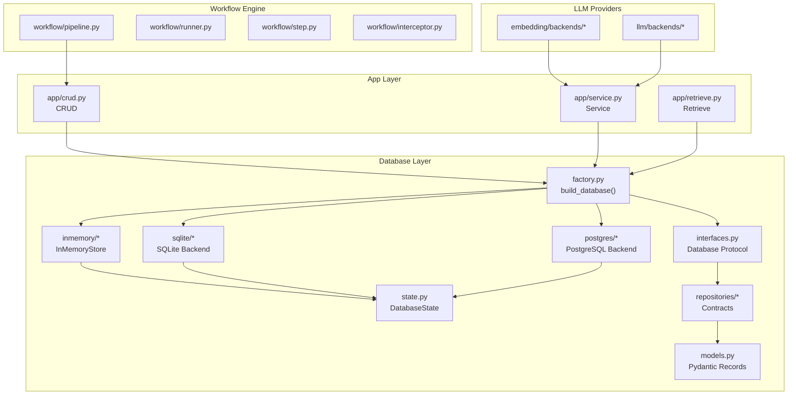
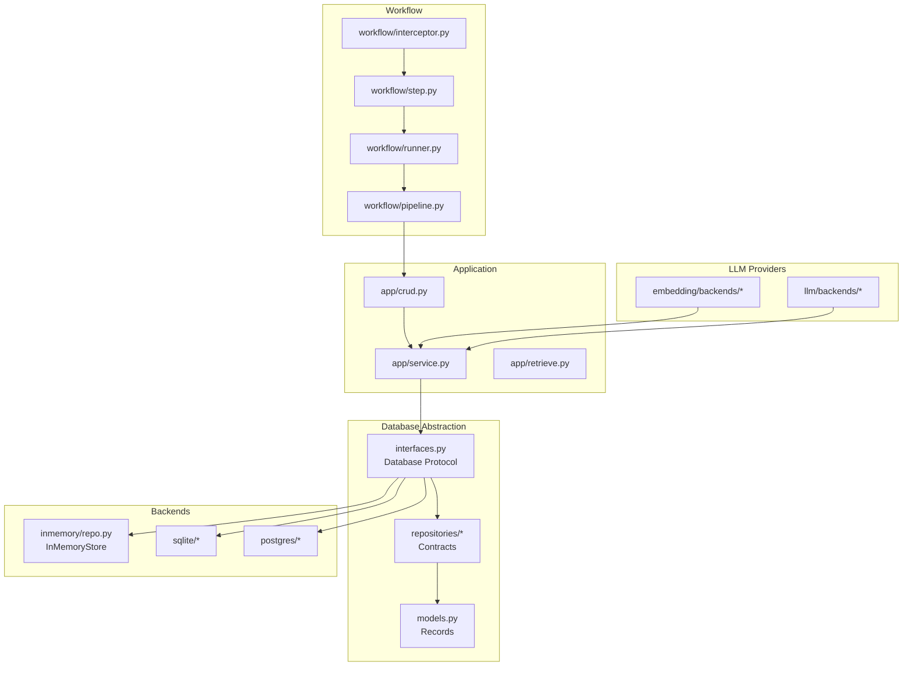
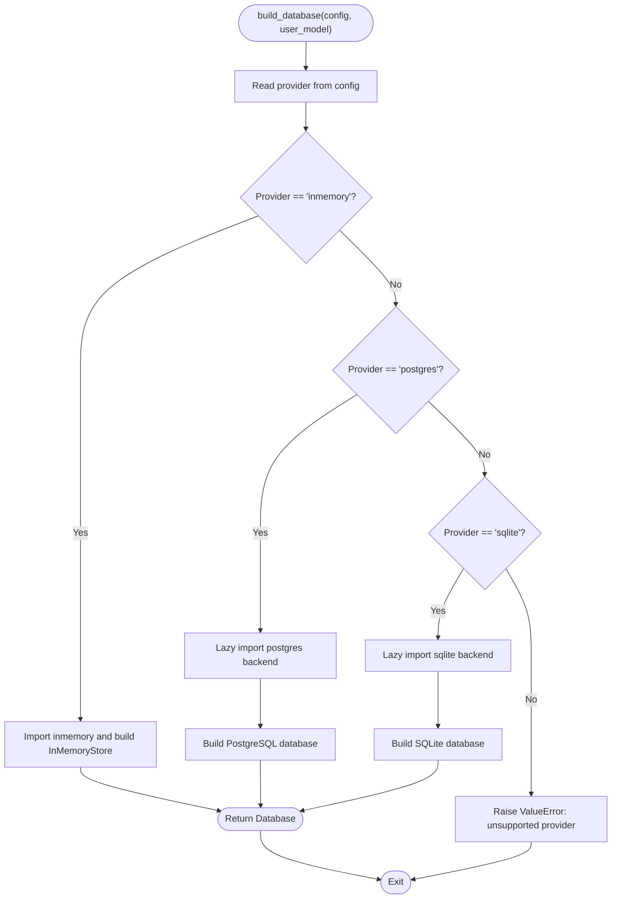
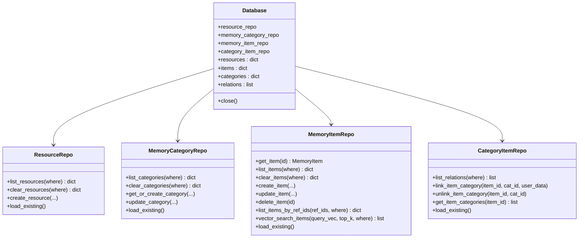
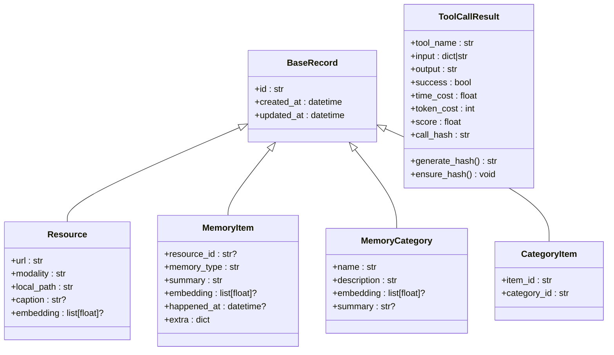
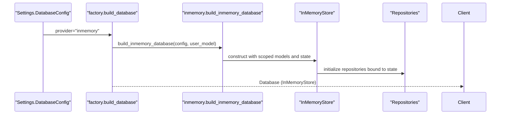
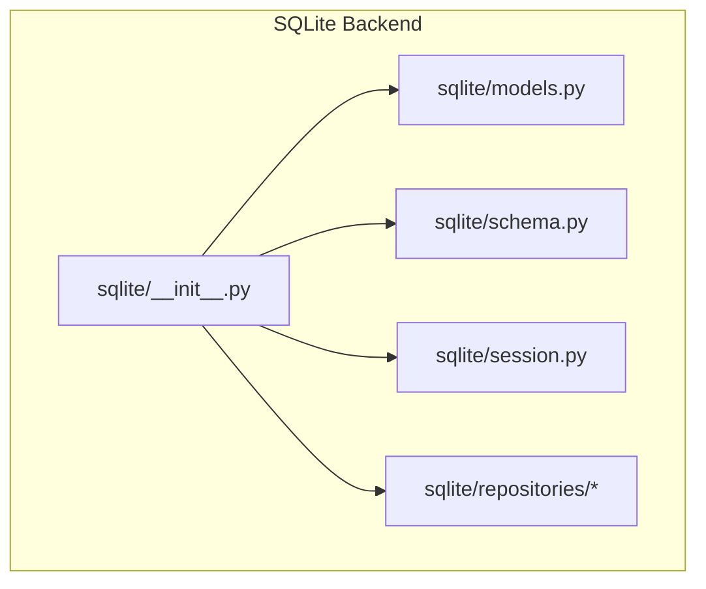
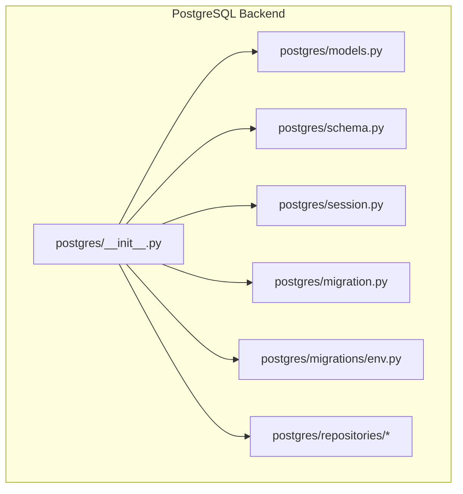
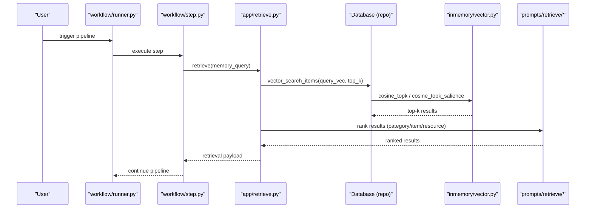
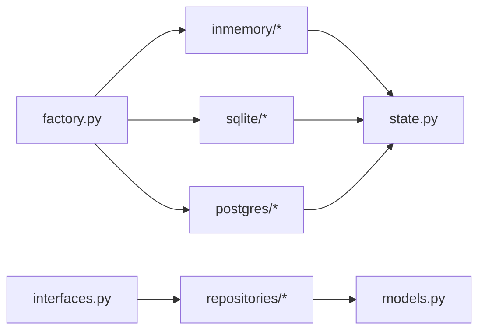

# Database Architecture

<cite>
**Referenced Files in This Document**
- [factory.py](file://src/memu/database/factory.py)
- [__init__.py](file://src/memu/database/__init__.py)
- [interfaces.py](file://src/memu/database/interfaces.py)
- [models.py](file://src/memu/models.py)
- [state.py](file://src/memu/database/state.py)
- [repositories/__init__.py](file://src/memu/database/repositories/__init__.py)
- [memory_item.py](file://src/memu/database/repositories/memory_item.py)
- [memory_category.py](file://src/memu/database/repositories/memory_category.py)
- [resource.py](file://src/memu/database/repositories/resource.py)
- [category_item.py](file://src/memu/database/repositories/category_item.py)
- [inmemory/__init__.py](file://src/memu/database/inmemory/__init__.py)
- [inmemory/models.py](file://src/memu/database/inmemory/models.py)
- [inmemory/repo.py](file://src/memu/database/inmemory/repo.py)
- [inmemory/vector.py](file://src/memu/database/inmemory/vector.py)
- [sqlite/__init__.py](file://src/memu/database/sqlite/__init__.py)
- [sqlite/models.py](file://src/memu/database/sqlite/models.py)
- [sqlite/schema.py](file://src/memu/database/sqlite/schema.py)
- [sqlite/session.py](file://src/memu/database/sqlite/session.py)
- [sqlite/sqlite.py](file://src/memu/database/sqlite/sqlite.py)
- [postgres/__init__.py](file://src/memu/database/postgres/__init__.py)
- [postgres/models.py](file://src/memu/database/postgres/models.py)
- [postgres/schema.py](file://src/memu/database/postgres/schema.py)
- [postgres/session.py](file://src/memu/database/postgres/session.py)
- [postgres/postgres.py](file://src/memu/database/postgres/postgres.py)
- [postgres/migration.py](file://src/memu/database/postgres/migration.py)
- [postgres/migrations/env.py](file://src/memu/database/postgres/migrations/env.py)
- [settings.py](file://src/memu/app/settings.py)
- [crud.py](file://src/memu/app/crud.py)
- [retrieve.py](file://src/memu/app/retrieve.py)
- [service.py](file://src/memu/app/service.py)
- [workflow/pipeline.py](file://src/memu/workflow/pipeline.py)
- [workflow/runner.py](file://src/memu/workflow/runner.py)
- [workflow/step.py](file://src/memu/workflow/step.py)
- [workflow/interceptor.py](file://src/memu/workflow/interceptor.py)
- [prompts/retrieve/query_rewriter.py](file://src/memu/prompts/retrieve/query_rewriter.py)
- [prompts/retrieve/llm_category_ranker.py](file://src/memu/prompts/retrieve/llm_category_ranker.py)
- [prompts/retrieve/llm_item_ranker.py](file://src/memu/prompts/retrieve/llm_item_ranker.py)
- [prompts/retrieve/llm_resource_ranker.py](file://src/memu/prompts/retrieve/llm_resource_ranker.py)
- [prompts/retrieve/judger.py](file://src/memu/prompts/retrieve/judger.py)
- [embedding/backends/openai.py](file://src/memu/embedding/backends/openai.py)
- [embedding/backends/doubao.py](file://src/memu/embedding/backends/doubao.py)
- [llm/backends/openai.py](file://src/memu/llm/backends/openai.py)
- [llm/backends/grok.py](file://src/memu/llm/backends/grok.py)
- [llm/backends/openrouter.py](file://src/memu/llm/backends/openrouter.py)
- [llm/backends/doubao.py](file://src/memu/llm/backends/doubao.py)
- [test_inmemory.py](file://tests/test_inmemory.py)
- [test_sqlite.py](file://tests/test_sqlite.py)
- [test_postgres.py](file://tests/test_postgres.py)
</cite>

## Table of Contents
1. [Introduction](#introduction)
2. [Project Structure](#project-structure)
3. [Core Components](#core-components)
4. [Architecture Overview](#architecture-overview)
5. [Detailed Component Analysis](#detailed-component-analysis)
6. [Dependency Analysis](#dependency-analysis)
7. [Performance Considerations](#performance-considerations)
8. [Troubleshooting Guide](#troubleshooting-guide)
9. [Conclusion](#conclusion)
10. [Appendices](#appendices)

## Introduction
This document describes the database layer architecture of memU with a focus on the pluggable storage backend system. It explains the factory pattern for backend selection, repository contracts, ORM-like models, and vector search utilities. It documents three storage backends:
- In-memory for development and testing
- SQLite for lightweight deployments
- PostgreSQL with optional pgvector extension for production

It also covers repository pattern implementation, migration strategies, infrastructure requirements, scalability considerations, deployment topology, and cross-cutting concerns such as data validation, transactions, and backups. Finally, it illustrates system context diagrams showing how the database layer integrates with the workflow engine and LLM providers.

## Project Structure
The database subsystem is organized around a backend-agnostic interface and a factory that selects a concrete implementation at runtime. The repository pattern isolates data access logic, while models define the persisted entities. Vector search utilities are provided for in-memory implementations.

**Diagram sources**
- [factory.py](file://src/memu/database/factory.py#L15-L44)
- [interfaces.py](file://src/memu/database/interfaces.py#L12-L27)
- [state.py](file://src/memu/database/state.py#L8-L14)
- [repositories/__init__.py](file://src/memu/database/repositories/__init__.py#L1-L7)
- [models.py](file://src/memu/database/models.py#L35-L148)
- [inmemory/repo.py](file://src/memu/database/inmemory/repo.py#L20-L61)
- [sqlite/__init__.py](file://src/memu/database/sqlite/__init__.py#L1-L26)
- [postgres/__init__.py](file://src/memu/database/postgres/__init__.py#L1-L26)
- [app/crud.py](file://src/memu/app/crud.py#L1-L200)
- [app/service.py](file://src/memu/app/service.py#L1-L200)
- [app/retrieve.py](file://src/memu/app/retrieve.py#L1-L200)
- [workflow/pipeline.py](file://src/memu/workflow/pipeline.py#L1-L200)
- [workflow/runner.py](file://src/memu/workflow/runner.py#L1-L200)
- [workflow/step.py](file://src/memu/workflow/step.py#L1-L200)
- [workflow/interceptor.py](file://src/memu/workflow/interceptor.py#L1-L200)
- [embedding/backends/openai.py](file://src/memu/embedding/backends/openai.py#L1-L200)
- [embedding/backends/doubao.py](file://src/memu/embedding/backends/doubao.py#L1-L200)
- [llm/backends/openai.py](file://src/memu/llm/backends/openai.py#L1-L200)
- [llm/backends/grok.py](file://src/memu/llm/backends/grok.py#L1-L200)
- [llm/backends/openrouter.py](file://src/memu/llm/backends/openrouter.py#L1-L200)
- [llm/backends/doubao.py](file://src/memu/llm/backends/doubao.py#L1-L200)

**Section sources**
- [factory.py](file://src/memu/database/factory.py#L1-L44)
- [__init__.py](file://src/memu/database/__init__.py#L1-L29)

## Core Components
- Factory pattern: The build_database function selects a backend based on configuration and returns a Database protocol-compliant object.
- Database Protocol: Defines repositories and in-memory caches for resources, items, categories, and relations.
- Repository Contracts: Typed protocols for CRUD and vector search operations.
- ORM-like Models: Pydantic models representing Resource, MemoryItem, MemoryCategory, and CategoryItem with computed hashes and timestamps.
- State Management: In-memory state container shared across repositories for in-memory backend.
- Vector Utilities: Cosine similarity and salience-aware scoring for retrieval ranking.

Key implementation references:
- Factory: [build_database](file://src/memu/database/factory.py#L15-L44)
- Database Protocol: [Database](file://src/memu/database/interfaces.py#L12-L27)
- Repositories: [ResourceRepo](file://src/memu/database/repositories/resource.py#L9-L31), [MemoryCategoryRepo](file://src/memu/database/repositories/memory_category.py#L9-L34), [MemoryItemRepo](file://src/memu/database/repositories/memory_item.py#L9-L55), [CategoryItemRepo](file://src/memu/database/repositories/category_item.py#L9-L24)
- Models: [Resource](file://src/memu/database/models.py#L68-L74), [MemoryItem](file://src/memu/database/models.py#L76-L94), [MemoryCategory](file://src/memu/database/models.py#L96-L101), [CategoryItem](file://src/memu/database/models.py#L103-L106), [compute_content_hash](file://src/memu/database/models.py#L15-L32)
- State: [DatabaseState](file://src/memu/database/state.py#L8-L14)
- Vector utilities: [cosine_topk](file://src/memu/database/inmemory/vector.py#L56-L92), [salience_score](file://src/memu/database/inmemory/vector.py#L16-L53)

**Section sources**
- [factory.py](file://src/memu/database/factory.py#L15-L44)
- [interfaces.py](file://src/memu/database/interfaces.py#L12-L27)
- [repositories/__init__.py](file://src/memu/database/repositories/__init__.py#L1-L7)
- [models.py](file://src/memu/database/models.py#L15-L148)
- [state.py](file://src/memu/database/state.py#L8-L14)
- [inmemory/vector.py](file://src/memu/database/inmemory/vector.py#L16-L138)

## Architecture Overview
The database layer follows a layered architecture:
- Application layer (app/*): orchestrates CRUD and retrieval operations.
- Database abstraction (database/*): provides a unified interface via the Database protocol and repository contracts.
- Backend implementations: inmemory, sqlite, postgres.
- Workflow engine: invokes app services that depend on the database abstraction.
- LLM providers: supply embeddings and generation results used by the app layer.

**Diagram sources**
- [app/crud.py](file://src/memu/app/crud.py#L1-L200)
- [app/service.py](file://src/memu/app/service.py#L1-L200)
- [app/retrieve.py](file://src/memu/app/retrieve.py#L1-L200)
- [interfaces.py](file://src/memu/database/interfaces.py#L12-L27)
- [repositories/__init__.py](file://src/memu/database/repositories/__init__.py#L1-L7)
- [models.py](file://src/memu/database/models.py#L35-L148)
- [inmemory/repo.py](file://src/memu/database/inmemory/repo.py#L20-L61)
- [sqlite/__init__.py](file://src/memu/database/sqlite/__init__.py#L1-L26)
- [postgres/__init__.py](file://src/memu/database/postgres/__init__.py#L1-L26)
- [workflow/pipeline.py](file://src/memu/workflow/pipeline.py#L1-L200)
- [workflow/runner.py](file://src/memu/workflow/runner.py#L1-L200)
- [workflow/step.py](file://src/memu/workflow/step.py#L1-L200)
- [workflow/interceptor.py](file://src/memu/workflow/interceptor.py#L1-L200)
- [embedding/backends/openai.py](file://src/memu/embedding/backends/openai.py#L1-L200)
- [embedding/backends/doubao.py](file://src/memu/embedding/backends/doubao.py#L1-L200)
- [llm/backends/openai.py](file://src/memu/llm/backends/openai.py#L1-L200)
- [llm/backends/grok.py](file://src/memu/llm/backends/grok.py#L1-L200)
- [llm/backends/openrouter.py](file://src/memu/llm/backends/openrouter.py#L1-L200)
- [llm/backends/doubao.py](file://src/memu/llm/backends/doubao.py#L1-L200)

## Detailed Component Analysis

### Factory Pattern and Backend Selection
The factory builds a Database implementation based on configuration. It supports:
- inmemory: No persistence, suitable for development and tests.
- postgres: Production-grade with optional pgvector.
- sqlite: Lightweight, file-based storage.

**Diagram sources**
- [factory.py](file://src/memu/database/factory.py#L15-L44)

**Section sources**
- [factory.py](file://src/memu/database/factory.py#L15-L44)

### Database Protocol and Repository Contracts
The Database protocol exposes typed repositories and in-memory caches. Repository contracts define CRUD and vector search operations.

**Diagram sources**
- [interfaces.py](file://src/memu/database/interfaces.py#L12-L27)
- [repositories/resource.py](file://src/memu/database/repositories/resource.py#L9-L31)
- [repositories/memory_category.py](file://src/memu/database/repositories/memory_category.py#L9-L34)
- [repositories/memory_item.py](file://src/memu/database/repositories/memory_item.py#L9-L55)
- [repositories/category_item.py](file://src/memu/database/repositories/category_item.py#L9-L24)

**Section sources**
- [interfaces.py](file://src/memu/database/interfaces.py#L12-L27)
- [repositories/resource.py](file://src/memu/database/repositories/resource.py#L9-L31)
- [repositories/memory_category.py](file://src/memu/database/repositories/memory_category.py#L9-L34)
- [repositories/memory_item.py](file://src/memu/database/repositories/memory_item.py#L9-L55)
- [repositories/category_item.py](file://src/memu/database/repositories/category_item.py#L9-L24)

### ORM Models and Scoped Models
Models define the persisted entities and include helper functions for deduplication and scoping. The scoped model mechanism merges user-defined scope models with core records.

**Diagram sources**
- [models.py](file://src/memu/database/models.py#L35-L148)

**Section sources**
- [models.py](file://src/memu/database/models.py#L15-L148)

### In-Memory Backend
The in-memory backend provides a fast, non-persistent store suitable for development and testing. It uses a shared state container and repository implementations that operate on in-memory collections.

**Diagram sources**
- [factory.py](file://src/memu/database/factory.py#L28-L31)
- [inmemory/__init__.py](file://src/memu/database/inmemory/__init__.py#L10-L22)
- [inmemory/repo.py](file://src/memu/database/inmemory/repo.py#L20-L61)

**Section sources**
- [inmemory/__init__.py](file://src/memu/database/inmemory/__init__.py#L10-L22)
- [inmemory/repo.py](file://src/memu/database/inmemory/repo.py#L20-L61)
- [inmemory/models.py](file://src/memu/database/inmemory/models.py#L30-L45)
- [inmemory/vector.py](file://src/memu/database/inmemory/vector.py#L56-L138)

### SQLite Backend
The SQLite backend provides a lightweight, file-based persistence layer. It defines models, schema, session management, and repository implementations.

**Diagram sources**
- [sqlite/__init__.py](file://src/memu/database/sqlite/__init__.py#L1-L26)
- [sqlite/models.py](file://src/memu/database/sqlite/models.py#L1-L200)
- [sqlite/schema.py](file://src/memu/database/sqlite/schema.py#L1-L200)
- [sqlite/session.py](file://src/memu/database/sqlite/session.py#L1-L200)
- [sqlite/repositories/category_item_repo.py](file://src/memu/database/sqlite/repositories/category_item_repo.py#L1-L200)
- [sqlite/repositories/memory_category_repo.py](file://src/memu/database/sqlite/repositories/memory_category_repo.py#L1-L200)
- [sqlite/repositories/memory_item_repo.py](file://src/memu/database/sqlite/repositories/memory_item_repo.py#L1-L200)
- [sqlite/repositories/resource_repo.py](file://src/memu/database/sqlite/repositories/resource_repo.py#L1-L200)

**Section sources**
- [sqlite/__init__.py](file://src/memu/database/sqlite/__init__.py#L1-L26)
- [sqlite/models.py](file://src/memu/database/sqlite/models.py#L1-L200)
- [sqlite/schema.py](file://src/memu/database/sqlite/schema.py#L1-L200)
- [sqlite/session.py](file://src/memu/database/sqlite/session.py#L1-L200)

### PostgreSQL Backend
The PostgreSQL backend supports production deployments and optional pgvector for vector operations. It includes models, schema, session management, migrations, and repository implementations.

**Diagram sources**
- [postgres/__init__.py](file://src/memu/database/postgres/__init__.py#L1-L26)
- [postgres/models.py](file://src/memu/database/postgres/models.py#L1-L200)
- [postgres/schema.py](file://src/memu/database/postgres/schema.py#L1-L200)
- [postgres/session.py](file://src/memu/database/postgres/session.py#L1-L200)
- [postgres/migration.py](file://src/memu/database/postgres/migration.py#L1-L200)
- [postgres/migrations/env.py](file://src/memu/database/postgres/migrations/env.py#L1-L200)
- [postgres/repositories/base.py](file://src/memu/database/postgres/repositories/base.py#L1-L200)
- [postgres/repositories/category_item_repo.py](file://src/memu/database/postgres/repositories/category_item_repo.py#L1-L200)
- [postgres/repositories/memory_category_repo.py](file://src/memu/database/postgres/repositories/memory_category_repo.py#L1-L200)
- [postgres/repositories/memory_item_repo.py](file://src/memu/database/postgres/repositories/memory_item_repo.py#L1-L200)
- [postgres/repositories/resource_repo.py](file://src/memu/database/postgres/repositories/resource_repo.py#L1-L200)

**Section sources**
- [postgres/__init__.py](file://src/memu/database/postgres/__init__.py#L1-L26)
- [postgres/models.py](file://src/memu/database/postgres/models.py#L1-L200)
- [postgres/schema.py](file://src/memu/database/postgres/schema.py#L1-L200)
- [postgres/session.py](file://src/memu/database/postgres/session.py#L1-L200)
- [postgres/migration.py](file://src/memu/database/postgres/migration.py#L1-L200)
- [postgres/migrations/env.py](file://src/memu/database/postgres/migrations/env.py#L1-L200)

### Retrieval and Ranking Pipeline
Retrieval leverages vector search utilities and ranking prompts. The workflow engine coordinates steps that invoke retrieval and ranking.

**Diagram sources**
- [workflow/runner.py](file://src/memu/workflow/runner.py#L1-L200)
- [workflow/step.py](file://src/memu/workflow/step.py#L1-L200)
- [app/retrieve.py](file://src/memu/app/retrieve.py#L1-L200)
- [inmemory/vector.py](file://src/memu/database/inmemory/vector.py#L56-L138)
- [prompts/retrieve/llm_category_ranker.py](file://src/memu/prompts/retrieve/llm_category_ranker.py#L1-L200)
- [prompts/retrieve/llm_item_ranker.py](file://src/memu/prompts/retrieve/llm_item_ranker.py#L1-L200)
- [prompts/retrieve/llm_resource_ranker.py](file://src/memu/prompts/retrieve/llm_resource_ranker.py#L1-L200)
- [prompts/retrieve/judger.py](file://src/memu/prompts/retrieve/judger.py#L1-L200)

**Section sources**
- [app/retrieve.py](file://src/memu/app/retrieve.py#L1-L200)
- [inmemory/vector.py](file://src/memu/database/inmemory/vector.py#L56-L138)
- [prompts/retrieve/llm_category_ranker.py](file://src/memu/prompts/retrieve/llm_category_ranker.py#L1-L200)
- [prompts/retrieve/llm_item_ranker.py](file://src/memu/prompts/retrieve/llm_item_ranker.py#L1-L200)
- [prompts/retrieve/llm_resource_ranker.py](file://src/memu/prompts/retrieve/llm_resource_ranker.py#L1-L200)
- [prompts/retrieve/judger.py](file://src/memu/prompts/retrieve/judger.py#L1-L200)

## Dependency Analysis
The database layer maintains low coupling through the Database protocol and repository contracts. Backends are loaded lazily to avoid unnecessary dependencies.

**Diagram sources**
- [factory.py](file://src/memu/database/factory.py#L15-L44)
- [interfaces.py](file://src/memu/database/interfaces.py#L12-L27)
- [repositories/__init__.py](file://src/memu/database/repositories/__init__.py#L1-L7)
- [models.py](file://src/memu/database/models.py#L35-L148)
- [state.py](file://src/memu/database/state.py#L8-L14)

**Section sources**
- [factory.py](file://src/memu/database/factory.py#L15-L44)
- [interfaces.py](file://src/memu/database/interfaces.py#L12-L27)

## Performance Considerations
- In-memory backend: Fastest for development; no disk I/O; state held in RAM.
- SQLite backend: Single-file database; suitable for small to medium deployments; consider WAL mode and appropriate pragmas for concurrency.
- PostgreSQL backend: Production-grade; enable connection pooling, indexing, and vector extensions for efficient similarity search.

Vector search performance:
- Use vectorized operations and top-k selection to minimize sorting overhead.
- Salience-aware scoring combines similarity, reinforcement count, and recency to improve relevance.

[No sources needed since this section provides general guidance]

## Troubleshooting Guide
Common issues and remedies:
- Unsupported provider: Verify configuration provider value matches supported backends.
- Missing pgvector: Ensure PostgreSQL backend is built with pgvector extension when enabled.
- Session/connection errors: Confirm session factories and environment variables are correctly configured for each backend.
- Migration failures: Review migration scripts and environment configuration for PostgreSQL.

**Section sources**
- [factory.py](file://src/memu/database/factory.py#L42-L43)
- [postgres/migration.py](file://src/memu/database/postgres/migration.py#L1-L200)
- [postgres/migrations/env.py](file://src/memu/database/postgres/migrations/env.py#L1-L200)

## Conclusion
The database layer employs a clean separation of concerns: a backend-agnostic protocol, typed repository contracts, and pluggable implementations. This design enables seamless switching between in-memory, SQLite, and PostgreSQL backends, supporting diverse deployment scenarios from development to production. Vector utilities and retrieval ranking integrate tightly with the workflow engine and LLM providers to deliver effective memory recall.

[No sources needed since this section summarizes without analyzing specific files]

## Appendices

### Infrastructure Requirements and Deployment Topology
- In-memory backend: Minimal footprint; ideal for ephemeral environments and CI.
- SQLite backend: Single-node file-based storage; suitable for embedded or small-scale deployments; ensure file permissions and path availability.
- PostgreSQL backend: Requires a running PostgreSQL instance; optional pgvector extension for vector operations; configure replication and backups for HA.

[No sources needed since this section provides general guidance]

### Technology Stack and Compatibility Notes
- Python libraries: Pydantic for data validation, pendulum for time handling, NumPy for vector math.
- Optional PostgreSQL/pgvector: Ensure compatible versions with the chosen Postgres driver and migration tooling.
- Embedding providers: OpenAI and Doubao backends are available for generating embeddings used by the retrieval pipeline.

[No sources needed since this section provides general guidance]

### Testing Coverage
- Unit tests exercise each backend’s capabilities and repository operations.

**Section sources**
- [test_inmemory.py](file://tests/test_inmemory.py#L1-L200)
- [test_sqlite.py](file://tests/test_sqlite.py#L1-L200)
- [test_postgres.py](file://tests/test_postgres.py#L1-L200)